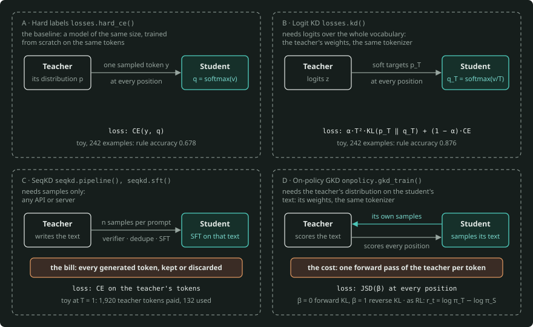
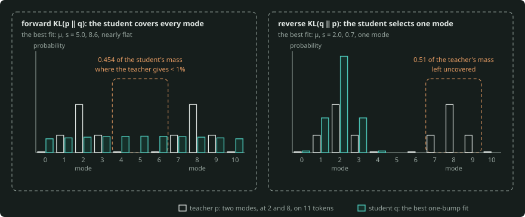
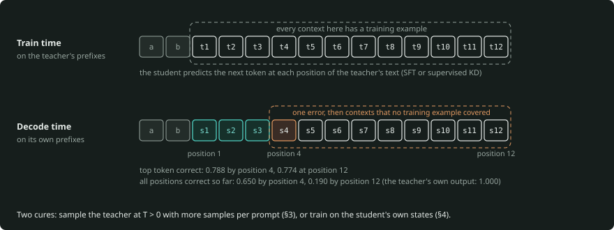
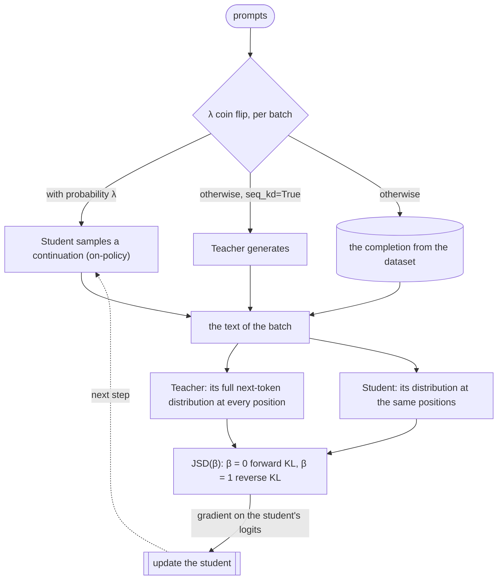
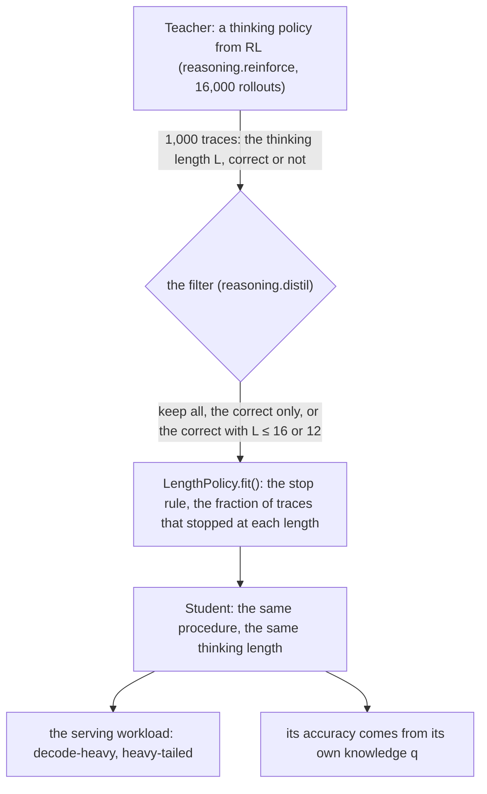
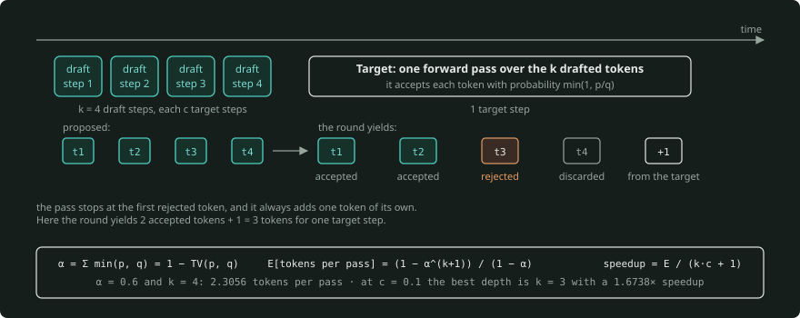
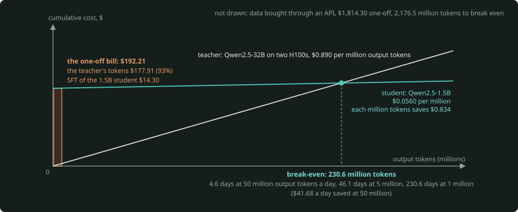

# Distillation: teaching a small model what a large one knows, and what the student saves in serving

*A primer for 00-foundations (module 00.6). Snapshot: September 2026. Each product fact has a date and the tag
(verify). Each formula has a worked number and names the function in [`distill-core/`](distill-core/) (package
`distillcore`) that calculates it.*

*Toy numbers are exact (the core enumerates the output space), or they come from seeded runs of small numpy models,
one run on one CPU. The BLAS and SIMD kernels of another CPU family round the same arithmetic differently in the
last bit, and training makes that difference larger. Thus a trained number can be different in its last digit
(α = 0.889 for the 0.890 in §7). The few chaotic numbers can be different by 0.1–0.2. They are the on-policy student
on rare inputs, the 4- and 8-unit drafts, and the §1 soft-target KL. The tests of the core hold these numbers to a
stated tolerance, and they hold the exact numbers verbatim.*

*Serving numbers are a roofline bound, not measurements. They use the arithmetic of `roofline.llm` and
`roofline.cost` in layer 01, and the tests of the core reproduce that arithmetic.*

This primer explains how to train a small model to behave like a large one, and what that gives you in serving. It
covers these topics:

- why a student learns more per example from the distribution of a teacher than from labels,
- which divergence to minimise, and what each divergence makes a student do when the student is too small,
- distillation from the text of the teacher (sequence-level), and from the scores that the teacher gives to the
  student's own samples (on-policy),
- the distillation of the traces of a thinking model,
- feature distillation, pruning and tokenizer mismatch,
- a draft model for speculative decoding, as a student whose metric is acceptance,
- how to measure a student,
- the economics: the one-off bill against the cost reduction per token.

This primer builds on these primers, and it does not repeat them:

- the [transformer primer](../transformers/docs/transformer-primer.md) (§6 training),
- the [capacity primer](../gpu-capacity-planning/PRIMER.md),
- the [roofline primer](../../01-hardware-gpu-fabric/roofline-and-fabric/PRIMER.md) (§3, §8),
- the [serving-engine primer](../../04-inference-engine/serving-engine/PRIMER.md) (§7),
- the [RL and thinking-models primer](../rl-and-thinking-models/PRIMER.md) (§1–§7).

You can learn every concept at tier T0 with [`distill-core/`](distill-core/). [`distill-lab/`](distill-lab/) distils
a small transformer in four ways in torch, and a real 0.5–0.6B student with TRL and vLLM (T1).

---

## The one-minute version

The output of a teacher is a distribution. Its **soft targets** $p = \operatorname{softmax}(z/T)$ show how incorrect
each incorrect answer is. A hard label does not carry this information. Thus a student learns more per example from
soft targets than a model of the same size that trains from scratch on the same tokens. The classic loss is
$\alpha \cdot T^2 \cdot \mathrm{KL}(p_T \,\Vert\, q_T) + (1 - \alpha) \cdot \mathrm{CE}$. The gradient of its soft
term on the logits of the student is $T \cdot (q_T - p_T)$.

- When the student cannot copy the teacher, the **divergence** decides what the student gets incorrect. Forward KL
  makes it cover every mode, and also fill the gaps between the modes. Reverse KL makes it select only the modes
  that it can fit.
- **Sequence-level distillation** is SFT on text that the teacher wrote. It needs only samples, and it pays for every
  token that the verifier discards. Its problem is **exposure bias**, because the student trains on the teacher's
  prefixes and decodes on its own.
- **On-policy distillation** samples from the student and asks the teacher to give a score to every token. It is RL
  with a dense reward $r_t = \log \pi_T - \log \pi_S$, with one forward pass of the teacher per token.
- When you distil a **thinking model**, the student copies the procedure of that model and the distribution of
  its thinking length, not its knowledge.
- A **draft model** is a student whose metric is acceptance, $\alpha = 1 - \mathrm{TV}$.
- Measure students by agreement *and* by task accuracy with intervals, per slice.

*Four ways to train the student, and what each one takes from the teacher. Hard labels and logit KD train on given text, with one sampled token or the teacher's full distribution at every position (§1, §2). SeqKD trains on text that the teacher wrote and that the verifier kept (§3). In on-policy GKD, the student samples its own text, and the teacher scores every position of it (§4).*

The payoff is in serving, with a 1.5B student as the example. It is ~16× cheaper per token on the roofline than a 32B
teacher served on two H100s (the 96× you get against one H100). That 96× is a separate case: on one H100, the teacher
has no room left to batch. The cost reduction comes with a one-off bill, and the teacher's tokens are the largest part
of that bill. Thus break-even is days to years, and it changes with the volume and with where those tokens come from.
A cascade is a middle option between the teacher alone and the student alone.

---

## 1. Why distil

**The cost argument, from the roofline.** At every step, decode streams the weights and the KV cache of each sequence
([roofline primer §3](../../01-hardware-gpu-fabric/roofline-and-fabric/PRIMER.md#3-llm-inference-on-the-roofline)).
Prefill costs approximately $2 \cdot N$ FLOPs per token. Take a student with a twentieth of the parameters. It streams
a twentieth of the weight bytes per decode step, and it needs a twentieth of the prefill FLOPs:

| Qwen2.5 (bf16) | Parameters | Weights | KV per token | Prefill per token | Batch-1 decode, 1K context, H100 | Sessions of 2K on one H100 |
|---|---|---|---|---|---|---|
| 32B (teacher) | 32.76 B | 65.53 GB | 262,144 B | 65.53 GFLOP | 19.175 ms | 12.06 |
| 1.5B (student) | 1.54 B | 3.09 GB | 28,672 B | 3.09 GFLOP | 0.930 ms | 1173.58 |

`distillcore.cost.Shape.params()` counts parameters as `roofline.llm.ModelConfig.params()` does, with no norms or
biases. `cost.decode_step()` is `roofline.llm.decode()` for dense models. The last column is
`cost.sessions_per_gpu()`, the `max_concurrent_sessions` of the capacity primer. It is the usable HBM minus the
weights, divided by the KV per session, with GB = 10⁹ bytes
([its formulas](../gpu-capacity-planning/PRIMER.md#the-formulas-all-of-capacitypy-in-one-page)).

The weights are 21.2× smaller and the KV per token 9.1× smaller. Thus on one H100 the student holds ~100× the
concurrent sequences. The small room that the 32B's weights leave for KV (6.47 GB of the usable 72) makes this ratio
too large. On two H100s, the 32B holds 146.2 such sessions, 73.1 per GPU, and the per-GPU ratio is 16×. In §9,
[`roofline.cost.cost_per_million_tokens`](../../01-hardware-gpu-fabric/roofline-and-fabric/PRIMER.md#8-the-cost-of-a-token)
changes that into dollars.

**Three routes to a small model.** You can train it small from scratch. You can prune a large model and repair it.
Or you can distil it: train it on the outputs of a teacher. The routes combine (prune, then distil, §6).

Why does a distilled student beat a model of the same size, trained from scratch on the *same* tokens? A hard label
is one sample from the distribution of the teacher. The soft target is the distribution. The toy language of the
core is an example. After the tokens $a$ and $b$, the next token is $(a + b) \bmod 11$ with probability 0.8, and
each neighbour has probability 0.1. A 16-unit student with the same contexts gets these results (notebook 01,
`tinylm.train()` with `losses.hard_ce()` or `losses.kd()`):

| Examples (per context) | Hard labels: rule accuracy / KL to the truth | Soft targets: rule accuracy / KL |
|---|---|---|
| 242 (2) | 0.678 / 3.472 nats | 0.876 / 0.617 nats |
| 605 (5) | 0.917 / 1.303 nats | 0.992 / 0.108 nats |

**Three families for language models.** What each family needs from the teacher decides where it can run:

| Family | Trains on | Needs from the teacher | Where it runs |
|---|---|---|---|
| Logit (soft-label) KD | the full distribution of the teacher at every position of some text | logits over the whole vocabulary: its weights, the same tokenizer | your own training job (§2) |
| Sequence-level (SeqKD) | text that the teacher generated, as SFT | samples only | any API or server (§3, §5) |
| On-policy, full distribution (GKD, TRL's trainers) | the student's own samples, scored at every position | the whole next-token distribution of the teacher on the student's text: its weights, the same tokenizer | your own training job, with the teacher in-process (§4) |
| On-policy, sampled-token reward (MiniLLM, Tinker) | the student's own samples, scored per token | the log-probability of each token that the student sampled (a forward pass over given text) | any server that returns prompt logprobs (§4) |

**What distillation cannot do.** Distillation cannot go above the capacity of the student. An 8-unit student of the
toy language tops out at 0.934 rule accuracy with the *exact* distribution as its target, where 16 units reach
1.000. Notebook 01 shows this with `tinylm.fit_language()`.

Distillation also cannot transfer knowledge that the teacher never puts into words. A student learns only what the
outputs (or logits) of the teacher on the training prompts show. And distillation cannot make the student show
behaviours that the data does not contain. A student that trains only on the teacher's text for twenty prompts is
correct on 0 of 101 other prompts (§8). The teacher–student gap is a capacity gap plus a coverage gap.

**Licences and terms, briefly (2026-09-27, verify; not legal advice).** The licence of the weights or the terms of
the API set the rules for training on the outputs of a model. Qwen2.5 (0.5B/1.5B/7B) and all Qwen3 open weights are
Apache 2.0. DeepSeek-R1 is MIT, and its README says that the series permits "distillation for training other LLMs".

The Llama 3.1 and 3.2 licences have a condition for a model that trains on Llama outputs and that you distribute.
The name of that model must have "Llama" at the start (verify). Some hosted-API terms put limits on the use of
outputs to build competing models (verify). Read the terms that you use. The student is also under
the licence of its base model (the R1 Qwen distills keep the Apache 2.0 of Qwen, verify).

**Where this starts.** The [RL primer §1](../rl-and-thinking-models/PRIMER.md#1-from-pretraining-to-post-training)
puts distillation in post-training (SFT on the outputs of a stronger model). Its
[§5](../rl-and-thinking-models/PRIMER.md#5-thinking-models) reports what distillation did for R1 and Qwen3. This
primer is the mechanism behind those lines.

## 2. Soft targets, temperature and the choice of divergence

**Soft targets and dark knowledge** (Hinton, Vinyals and Dean 2015). The logits $z$ of a teacher give
$p_T = \operatorname{softmax}(z/T)$. At T = 1, the small probabilities of a confident teacher are near zero. When you
increase $T$, the distribution becomes flatter, and the ranking of the incorrect answers becomes important. The
example has five tokens, teacher $z$ = (4, 3, 1, 0, −1) and student $v$ = (3, 3.5, 0, 0.5, −1) (`losses.softmax()`):

| | token 0 | 1 | 2 | 3 | 4 |
|---|---|---|---|---|---|
| teacher, T = 1 | 0.6931 | 0.2550 | 0.0345 | 0.0127 | 0.0047 |
| teacher, T = 2 | 0.4885 | 0.2963 | 0.1090 | 0.0661 | 0.0401 |
| student, T = 1 | 0.3573 | 0.5891 | 0.0178 | 0.0293 | 0.0065 |

The hard label says "token 0". The soft target also says that token 1 is a much better second choice than tokens 3
and 4. This is the dark knowledge. KL(p ‖ q) = 0.25650 nats at T = 1 (`losses.kl()`).

**The loss and its gradient** (`losses.hinton()`, `losses.kd()`).

$$
\begin{aligned}
\mathcal{L} &= \alpha \cdot T^2 \cdot \mathrm{KL}(p_T \,\Vert\, q_T) + (1 - \alpha) \cdot \mathrm{CE}(y, q_1) \\[6pt]
\frac{\partial\, \mathrm{KL}(p_T \,\Vert\, q_T)}{\partial v_i} &= \frac{q_{T,i} - p_{T,i}}{T} \\[6pt]
\text{so} \quad \frac{\partial\, (T^2 \cdot \mathrm{KL})}{\partial v_i} &= T \cdot (q_{T,i} - p_{T,i})
\end{aligned}
$$

The derivation is one line: $\mathrm{KL} = \sum p \log p - \sum p \log q_T$ and
$\partial \log q_{T,j} / \partial v_i = (\mathbf{1}[i = j] - q_{T,i})/T$. At T = 2, the gradient of the KL is
(−0.073543, 0.071047, −0.016410, 0.015853, 0.003053). Finite differences give the same result (the tests of the
core). Soft-target cross-entropy (`losses.soft_ce()`) has the same gradient. A hard label is the same loss with $p$
one-hot (`losses.hard_ce()`).

**Why T².** When $T$ increases, the KL decreases approximately as $1/T^2$, and its gradient decreases in the same
way. Without the factor, the hard-label term is much larger than a soft term at T = 4, and $\alpha$ does not mean
what it says (`losses.kd(scale=False)`):

| T | 1 | 2 | 4 | 10 | 100 | 1000 |
|---|---|---|---|---|---|---|
| KL(p_T ‖ q_T) | 0.25650 | 0.06639 | 0.01596 | 0.00242 | 0.00002 | 0.00000 |
| T²·KL | 0.25650 | 0.26558 | 0.25542 | 0.24196 | 0.23129 | 0.23013 |

**The high-T limit is logit matching.** The expansion $\operatorname{softmax}(v/T) \approx 1/N + (v_i - \bar v)/(NT)$
gives

$$
T^2 \cdot \mathrm{KL} \;\to\; \frac{1}{2N} \sum_i \bigl((v_i - \bar v) - (z_i - \bar z)\bigr)^2,
$$

that is, the mean-squared error on centred logits (Caruana's model compression): 0.23000 for the example
(`losses.logit_mse()`).

TRL applies no $T^2$ (verify). `GKDTrainer` calculates its divergence at T = 1, and its `temperature` sets only the
sampling. `DistillationTrainer` divides both logits by its `temperature` (default 1.0) in the loss. The
`LogitsDistillationLoss` of NVIDIA ModelOpt multiplies by $T^2$ (verify). Treat $T$ and $\alpha$ as settings to sweep.

**Why a soft target is worth more per example.** The gradient from a sampled hard label is
$\operatorname{onehot}(y) - q$. Its expectation over $y \sim p$ is ${p - q}$, the soft-target gradient. Its extra
variance is exactly $1 - \sum p^2$ (`losses.label_noise()`): 0.34 per example for the toy language's 0.8/0.1/0.1.
The soft target gives the expectation with no sampling noise. The §1 table shows that variance at work.

### The choice of divergence

**Forward against reverse KL.** A student that is too small to match the teacher must select what it gets
incorrect:

$$
\begin{aligned}
\text{forward } \mathrm{KL}(p \,\Vert\, q) &= \sum p \log(p/q) \\
\text{reverse } \mathrm{KL}(q \,\Vert\, p) &= \sum q \log(q/p) \\
\mathrm{JSD}(\beta) &= \beta \cdot \mathrm{KL}(p \,\Vert\, m) + (1 - \beta) \cdot \mathrm{KL}(q \,\Vert\, m), \\
m &= \beta p + (1 - \beta)\, q
\end{aligned}
$$

- forward KL: the student pays it wherever the teacher has mass that the student does not have. Thus forward KL is
  mode-covering (SFT and KD, and GKD β = 0).
- reverse KL: the student pays it wherever the student has mass that the teacher does not have. Thus reverse KL is
  mode-seeking (GKD β = 1, and the sampled-token reward).
- $\mathrm{JSD}(\beta)$: `divergences.jsd()`

The source of your training samples (the $\lambda$ of GKD, §4) and the divergence that you minimise (its $\beta$)
are separate choices. GKD runs either divergence on either data. Reverse KL is the natural partner of the student's
own samples. The reason is that its per-token estimate needs only one value: the teacher's log-probability of the
token that the student sampled. The argument of MiniLLM (Gu et al.) is that the reverse direction is correct for
generation. A forward-KL student "overestimates the low-probability regions of the teacher distribution", and it
samples text that the teacher never writes.

The core fits a one-bump student (a discretised Gaussian) to a two-bump teacher on 11 tokens, with modes at 2 and 8
(`divergences.fit_bump()`, notebook 02):

| Fit | μ, s | Divergence | Student mass where the teacher gives < 1% | Teacher mass left uncovered |
|---|---|---|---|---|
| forward KL | 5.0, 8.6 | 0.6425 | 0.454 | 0.00 |
| JSD, β = 0.5 | 5.0, 9.9 | 0.1789 | 0.454 | 0.00 |
| reverse KL | 2.0, 0.7 | 0.6931 = ln 2 | 0.019 | 0.51 |

The forward fit is nearly flat. It puts 45.4% of its samples where the teacher almost never goes, and most of these
samples are in the space between the modes. The reverse fit selects one mode and leaves half of the teacher's mass
uncovered. With this family, the fit of the JSD flips from covering to seeking between β = 0.6 and β = 0.7.

*The teacher of `divergences.fit_bump()` has two modes, at 2 and 8, on 11 tokens. Under each divergence, the chart shows the best one-bump student. The forward fit (μ, s = 5.0, 8.6) is nearly flat. It puts 0.454 of its mass where the teacher gives less than 1%. The reverse fit (μ, s = 2.0, 0.7) selects one mode. It leaves 0.51 of the teacher's mass uncovered.*

For classification, the choice has almost no effect, because you use only the argmax. For generation, every sampled
token conditions the next token. Thus where the student puts its low-probability mass is what it writes.

**TRL's convention.** `generalized_jsd_loss(student_logits, teacher_logits, beta)` calculates exactly the three rows
of the table. At β = 0 the loss is $\mathrm{KL}(\text{teacher} \,\Vert\, \text{student})$, and at β = 1 it is
$\mathrm{KL}(\text{student} \,\Vert\, \text{teacher})$, both exact at the endpoints. Between the endpoints, the loss
is the mixture JSD ($\le \ln 2$). Thus the loss scale jumps at the ends, by $\sim 1/\beta$ as $\beta \to 0$ and by
$\sim 1/(1 - \beta)$ as $\beta \to 1$. On the five-token example, it gives
0.256501 at β = 0, 0.023026 at 0.1, 0.064431 at 0.5, 0.024067 at 0.9, 0.271424 at β = 1 (`losses.gkd()`).

**Total variation** $\mathrm{TV} = \tfrac{1}{2} \sum \lvert p - q \rvert$ is the fourth measure to know.
$1 - \mathrm{TV}$ is the acceptance rate of a draft (§7). The KL in this section is the same KL that RL uses as its
penalty to a reference model
([RL primer §2](../rl-and-thinking-models/PRIMER.md#2-policy-gradients-over-token-sequences)). But it points the
other way. RL keeps the policy near the reference. Distillation pulls the policy onto the teacher.

## 3. Sequence-level distillation: learning from the teacher's outputs

**SeqKD is SFT on text the teacher wrote** (Kim and Rush 2016). Generate completions for a set of prompts. Keep the
good completions. Then fine-tune the student on them with the ordinary cross-entropy (`seqkd.sft()`).

SeqKD needs no logits, so it works through any API. It is the recipe behind the R1 distills, and behind the
off-policy stage of the strong-to-weak distillation of Qwen3. The recipe and its numbers are in the
[RL primer §1 and §5](../rl-and-thinking-models/PRIMER.md#5-thinking-models).

**The pipeline and its bookkeeping** (`seqkd.pipeline()`) has four stages:

1. Generate $n$ samples per prompt at a temperature.
2. Run the verifier on the samples.
3. Remove the duplicates.
4. Do SFT of the student on the samples that stay.

Every stage has a price. The example uses twenty prompts × 8 samples × 12 tokens from the toy teacher:

| Sampling | Generated | Pass the verifier | Unique | Teacher tokens paid | Tokens used |
|---|---|---|---|---|---|
| T = 0 (greedy) | 160 | 160 | 20 | 1,920 | 240 |
| T = 1 | 160 | 16 | 11 | 1,920 | 132 |

At T = 0, every sample of a prompt is the same. At T = 1, a teacher that obeys the rule with probability 0.8 per token
passes a 12-token check (0.8)^12 = 0.069 of the time. Thus each kept sample costs about 175 teacher tokens. So the
data budget is prompts × samples per prompt × tokens per sample at the teacher's price per token, not the size of the
kept set. Calculate its price with the model of the 06 layer ([scaling primer
§3.4](../../06-gateway/scaling-admission-cost/agentic-scaling-lab/docs/01-scaling-primer.md#34-cost-per-conversation)).
`cost.api_cost()` reproduces its `cost_per_call`.

**Filtering, deduplication, decontamination.** Keep only the samples that pass a verifier. This is rejection
sampling, the same machinery as best-of-n ([RL primer §6](../rl-and-thinking-models/PRIMER.md#6-test-time-compute)).
Also keep only the samples under a length limit (§5). Remove the duplicates. Remove anything that overlaps your eval
sets, because a teacher that saw a benchmark can write it into the training data of the student (§8).

**Exposure bias, measured.** The student trains on the teacher's prefixes and decodes on its own. Two 16-unit
students train on the greedy teacher's continuations of twenty prompts. Each student samples 2,000 continuations of
its own at T = 1. The core then measures if its top token obeys the rule, on the teacher's prefixes and on its own.
It measures this per position, and over the whole output so far (`seqkd.exposure_bias()`, notebook 02):

| Student | On the teacher's prefixes | Own prefixes, position 1 | position 4 | position 12 | Own output correct at every position, through 4 | through 12 | Entropy (teacher 0.64) |
|---|---|---|---|---|---|---|---|
| SFT on the greedy text | 1.000 | 1.000 | 0.999 | 0.999 | 0.999 | 0.994 | 0.009 |
| supervised KD on the greedy text (GKD λ = 0) | 1.000 | 1.000 | 0.788 | 0.774 | 0.650 | 0.190 | 0.652 |

The SFT student never makes an error, because its samples are always the same. It trained on one greedy output per
prompt, and it copied that output, not the teacher.

The KD student matches the teacher's distribution on the teacher's text. At T = 1, it thus samples off the cycle of
the rule. Here, its samples follow the rule 0.792 of the time at position 1, like the teacher's, then 0.636 by position
4, where the teacher's stay between 0.78 and 0.81. Each error puts it in contexts that no training example covered.
There, its top token is incorrect about a quarter of the time. Thus per-position accuracy drops to 0.788 by position
4 and then stays there (0.774 at position 12).

*Exposure bias in the §3 experiment, as `seqkd.exposure_bias()` measures it. The student trains on the teacher's prefixes, where every context has a training example. When it decodes on its own prefixes, one error puts it in contexts that no training example covered. After that error, its top token is incorrect about a quarter of the time. Whole outputs become incorrect more often as the length increases.*

What compounds with length is the output as a whole. Take the probability that the top token of the KD student is
correct at every position so far. This probability falls to 0.650 by position 4 and 0.190 by position 12, where the
teacher's stays at 1.000. The first of two cures is to cover more of the states that the student will visit. For
this, sample the teacher at T > 0 and take more samples per prompt, with more tokens paid. The other cure is to
train on the student's own states (§4).

**Rationales as extra supervision.** "Distilling step-by-step" (Hsieh et al.) trains a small T5 student to predict
both the label and the teacher's rationale. It uses
$\text{loss} = \alpha \cdot \text{label} + (1 - \alpha) \cdot \text{rationale}$, and its README recommends α = 0.5
(verify). Reasoning traces (§5) are the generative version of the same idea.

**Worked: the fixed cost of a SeqKD run.** 100,000 prompts × one 2,000-token completion = 2 × 10⁸ teacher tokens. At
$9.00 per million output tokens (the 06 lab's Gemini 3.5 Flash price, dated 2026-09-05 there, verify) that is
$1,800. Generation on the 32B, self-hosted on two H100s, at §9's roofline cost, makes it $177.91.

SFT of the 1.5B student for one epoch is
6·N·D = 1.85 × 10¹⁸ FLOPs ([transformer primer §6.2](../transformers/docs/transformer-primer.md#62-what-scale-means)).
That is 1.300 GPU-hours on an H100 at 40% MFU, $14.30 at $11/GPU-hour (`cost.fixed_cost()`,
`cost.training_flops()`, `cost.gpu_hours()`). The teacher's tokens are the bill.

## 4. On-policy distillation

**The method** (Agarwal et al., GKD, and Gu et al., MiniLLM). Sample a continuation from the *student*. Ask the
teacher for its distribution at every position, or only for its log-probability of each sampled token. Minimise a
divergence there. The student learns exactly on the prefixes that it will produce, so exposure bias has no place to
hide.

TRL's `GKDTrainer` minimises $\mathrm{JSD}(\beta)$ and mixes the data sources per batch:

- With probability $\lambda$, the student generates (on-policy).
- Otherwise, with `seq_kd=True`, the teacher generates.
- Otherwise, the trainer uses the completion from the dataset (supervised KD).

`onpolicy.gkd_train()` has the same loop.

*The GKD loop of TRL's `GKDTrainer`, which `onpolicy.gkd_train()` repeats. A coin flip with probability λ selects the source of each batch. Then the teacher gives its full next-token distribution at every position of that text, and the student minimises JSD(β) there. At β = 1, the per-token reward of the policy-gradient view gives the same gradient in expectation (`onpolicy.token_pg_identity()`).*

**Exposure bias removed.** Continue the training of the §3 KD student with GKD at λ = 1 for 300 steps (notebook
02):

| Continue with | Own prefixes, position 4 | position 12 | All 121 contexts |
|---|---|---|---|
| (nothing: supervised KD only) | 0.788 | 0.774 | 0.198 |
| GKD λ = 1, β = 0 (forward) | 0.994 | 0.984 | 0.942 |
| GKD λ = 1, β = 0.5 | 0.957 | 0.831 | 0.636 |
| GKD λ = 1, β = 1 (reverse) | 0.930 | 0.754 | 0.504 |

On-policy data repairs the problem, and the divergence decides how fast. In this toy, the reverse end is slow from
every start that the core tried. The table gives the rule accuracy over all 121 contexts after 300 steps
(`eval.vs_truth()`, notebook 02):

| Start from | At the start | Where incorrect, mass on the correct token | GKD λ = 1, β = 0 | β = 1 |
|---|---|---|---|---|
| the KD student (§3) | 0.198 | 0.029 | 0.942 | 0.504 |
| the SFT student (§3) | 0.190 | 0.007 | 0.950 | 0.372 |
| a fresh 16-unit student | 0.074 | 0.083 | 0.992 | 0.479 |

The gradient of reverse KL on a logit is $q_i \cdot (\log q_i - \log p_i - \mathrm{KL})$. It increases the
probability of a token in proportion to the student's own probability of that token. Thus it puts more mass on what
the student already proposes, and it almost never finds what the student does not propose. Where the §3 students
are incorrect, they give the right token 0.029 and 0.007, so starting from them does not help here. A fresh student
becomes confident early under β = 1 and ends in the same state. Where it is incorrect after 300 steps, it puts 0.757
on a wrong token and 0.034 on the right one.

Exercise 2.3 of notebook 02 shows the extreme case. Take a student with almost all its mass on a token to which the
teacher gives 0.0001. For this student, the reverse-KL gradient is 0.0055 of the forward one (`losses.gkd()`).

The published recipes start on-policy distillation from an SFT checkpoint (the strong-to-weak stage of Qwen3, the
tinker-cookbook, verify). On a real model, that checkpoint already writes in the format of the teacher and puts
mass near its modes. A lookup-table toy cannot show this. The toy shows that a warm start does not save reverse KL
where the student is confidently incorrect. Sweep $\beta$. The TRL docs say it as "the optimal beta varied
depending on the task".

### The policy-gradient view

**On-policy distillation is RL with a dense reward.** Reverse KL over whole sequences is

$$
\mathrm{KL}(\pi_S \,\Vert\, \pi_T) = \mathbb{E}_{y \sim \pi_S}\bigl[\log \pi_S(y) - \log \pi_T(y)\bigr],
$$

and because $\mathbb{E}[\nabla \log \pi_S] = 0$, its gradient is REINFORCE:

$$
\begin{aligned}
-\nabla \mathrm{KL}(\pi_S \,\Vert\, \pi_T) &= \mathbb{E}_{y \sim \pi_S}\bigl[R(y) \cdot \nabla \log \pi_S(y)\bigr], \\
R(y) &= \sum_t r_t, \\
r_t &= \log \pi_T(y_t \mid y_{<t}) - \log \pi_S(y_t \mid y_{<t})
\end{aligned}
$$

That is the KL penalty of [RL primer §2](../rl-and-thinking-models/PRIMER.md#2-policy-gradients-over-token-sequences),
with the teacher as the reference and no task reward. In code, it is
`rlcore.pg.reinforce_grad(policy, trajs, "mean", ref=teacher, beta=1.0)` with zero rewards.
`onpolicy.advantages()` uses the same sign, the same batch-mean baseline and the same 1/N average. The test of the
core compares it with rlcore's function on rlcore's own bracket task. The verifier of GRPO gives one number per
sequence ([RL primer §4](../rl-and-thinking-models/PRIMER.md#4-rl-with-verifiable-rewards-and-grpo)). But here,
every token gets its own number.

The core does an exact check of the identity, over all 125 three-token continuations of a 5-token language. Finite
differences of `onpolicy.exact_seq_kl()` give $-\nabla \mathrm{KL}$, and the expectation of the estimator
(`onpolicy.exact_pg_grad()`) equals it to 9 digits. Tinker's recipe uses the per-token form: the advantage of token
$t$ is $r_t$ alone (`kl_discount_factor=0`, verify). In expectation, the per-position β = 1 loss of GKD equals this
form (`onpolicy.token_pg_identity()`).

On the same enumerable task, the per-token estimator has a bias for the sequence KL. Its expectation differs by 31% of
the gradient's norm, because it does not include how a token changes the states after it. But its variance is lower
(total variance 1.86 against 3.15 per batch of 64).

### Cost, tokenizers and TRL

**Compute per student token.** In on-policy distillation, the teacher never generates. It gives a score to the
tokens of the student in one prefill-shaped forward pass, at $2 \cdot N_T$ FLOPs per token. The student adds
$2 \cdot N_S$ to generate and $6 \cdot N_S$ to train (`onpolicy.flops_per_prompt()`).

Take an 8B student and a 32B teacher. For this pair, that is 128 GFLOP per student token, against 64 for GRPO (80 with a
reference model's forward pass for its KL penalty). A teacher four times the student's size makes each on-policy
token twice as dear. At sixteen 4K-token samples per prompt, that is 8.39 × 10¹⁵ FLOPs against 4.19 × 10¹⁵ (5.24 ×
10¹⁵ with the reference).

The generation of the student is decode-bound, and the score pass of the teacher is prefill-shaped. FLOPs make the
first look less costly than it is, relative to the second. Thus, in GPU time, the pass of the teacher costs less
than its FLOPs show. But the cost reduction is not in the step. It is in the number of steps, because the dense
signal needs a much smaller number of steps.

Qwen3's report compares the two from the same off-policy-distilled 8B checkpoint. RL reached AIME'24 67.6 in 17,920
GPU-hours, and on-policy distillation reached 74.4 in 1,800 (verify).

The tinker-cookbook recipe distils Qwen3.5-9B-Base from Qwen3.5-9B, a teacher of the same size, with rank-128 LoRA (verify). SFT on OpenThoughts3 (traces that another model wrote) reaches AIME'24 ~65% (verify). Then on-policy distillation reaches ~76.7% in 200 steps of 512 prompt groups, with rollouts of up to 16K tokens (verify). This is not a small budget.
Both results compare against a teacher that already exists. The training cost of that teacher is not in either
number.

**The shared-tokenizer requirement.** For per-token scores, the teacher must read the tokens of the student. TRL's
GKD raises an error if the `vocab_size` of the two configs is different (verify). Qwen2.5-7B and larger have 152,064,
against 151,936 for the small Qwen2.5 and all Qwen3 models (verify). Thus you cannot use GKD to distil a 0.5B from a
7B, although the token ids match. The cross-tokenizer methods are in §6.

**TRL, concretely (1.14.0, verify).** `GKDConfig`/`GKDTrainer` are experimental:
`from trl.experimental.gkd import GKDConfig, GKDTrainer`. Their defaults are `lmbda=0.5`, `beta=0.5`,
`temperature=0.9` (sampling only: the loss runs at T = 1), `max_new_tokens=128` and `seq_kd=False`. $\lambda$ is a
per-batch coin flip.

`DistillationTrainer` / `DistillationConfig` are stable API (`from trl import …`). They are always on-policy, with
`beta=1.0` (reverse KL) by default, `max_completion_length=512`, and `temperature=1.0` applied to both logits. Their
quick start distils exactly Qwen2.5-0.5B-Instruct from Qwen2.5-1.5B-Instruct (verify).

A served teacher gives the necessary log-probabilities through the `prompt_logprobs` of vLLM. `--max-logprobs` sets
the limit, with a default of 20 (verify). Full-vocabulary distributions through an API are not practical. Thus API
teachers support the sampled-token reward, not full logit KD.

## 5. Distilling reasoning

**Traces are the data.** The output of a thinking model, that is its reasoning and its answer, is the SFT target.
Thus what a small student takes from the teacher is its **procedure**: its format, its steps and how long it thinks.
The toy of the core uses the ThinkTask formula of rlcore. The model thinks $L$ tokens, and then it answers. The
answer is correct with probability $1 - e_0 \cdot (1 - q)^L$ ($e_0 = 0.8,\; q = 0.1$, at most 32 tokens).

*The trace pipeline of §5. The teacher's traces go through a filter, and `LengthPolicy.fit()` reads the stop rule from the lengths that stay. The student copies that rule, that is the procedure and the thinking length, but its accuracy comes from its own knowledge $q$.*

A policy is a rule that decides when to stop. SFT on traces is maximum likelihood, and it has a closed form for this
rule. At each length, the closed form is the fraction of traces that stopped at that length, among the traces that
reached it (`reasoning.LengthPolicy.fit()`). The teacher is what 16,000 REINFORCE rollouts produced
(`reasoning.reinforce()`, as in [RL primer
§2](../rl-and-thinking-models/PRIMER.md#2-policy-gradients-over-token-sequences)). 1,000 of its traces distil into a
student that copies it (`reasoning.distil()`, `LengthPolicy.expected()`, notebook 03):

| Policy | Accuracy | Mean thinking tokens | p90 | Tokens per correct answer |
|---|---|---|---|---|
| untrained student | 0.273 | 1.00 | 3 | 3.67 |
| teacher (RL, 16,000 rollouts) | 0.893 | 19.91 | 23 | 22.31 |
| student, SFT on 1,000 traces | 0.892 | 19.91 | 24 | 22.31 |

Nothing told the student how long to think. It copied that from the traces. Thus the serving workload of a thinking
model comes with the distillation
([RL primer §7](../rl-and-thinking-models/PRIMER.md#7-what-thinking-does-to-serving): decode-heavy, heavy-tailed,
with a KV that grows while it thinks). Fewer traces give a student that stops too early. 10, 30, 100, 300 and 1,000
traces reach 0.710, 0.824, 0.864, 0.883 and 0.893. The student learns the length from the tail of the data.

**The filter sets the accuracy–length trade.** From the same 1,000 traces:

| Keep | Traces kept | Accuracy | Mean length | Tokens per correct answer |
|---|---|---|---|---|
| all (plain SeqKD) | 1000 | 0.892 | 19.91 | 22.31 |
| correct only (rejection sampling) | 898 | 0.895 | 20.07 | 22.43 |
| correct and L ≤ 16 | 89 | 0.769 | 12.73 | 16.56 |
| correct and L ≤ 12 | 28 | 0.646 | 8.55 | 13.24 |

When thinking helps, correct traces are longer. Thus rejection sampling increases the thinking length by a small
quantity. A length cap (budget-aware distillation) gives a lower-cost student, at a price in accuracy. It also
discards traces that you paid the teacher to write. The cap is a product decision that the data makes for you.

**Distillation against RL on a small model.** The comparison of R1 is in the
[RL primer §5](../rl-and-thinking-models/PRIMER.md#5-thinking-models): distillation of the large model beat
large-scale RL on the same small base. The toy version spends 1,000 samples on the student in both ways. SFT on
1,000 teacher traces reaches 0.892; REINFORCE on the student with 1,000 rollouts reaches 0.445, with 4,000 0.699,
with 16,000 0.884. A trace carries the whole behaviour, but a reward carries one bit.

But the toy has no capability ceiling. The authors of R1 say that it is possible that a small base with RL alone
does not reach the result of distillation at all.

**What does not transfer: knowledge.** Accuracy is a function of the solver's own $q$. Give the student half the
teacher's $q$ (0.05). Then it copies the teacher's 19.91-token thinking exactly and scores 0.706, not 0.893. Also,
its own best length at a cost of 0.01 per token is 27.5 tokens, not the 19.9 it copied
(`ThinkToy.optimal_length()`). The RL of the teacher ran with no length cost, so its 19.9 is where 16,000 rollouts
left it, not an optimum.

Distillation copies the procedure that the teacher found, not the procedure that the student needs. Evaluate the
student at its own best budget. Think about a short RL stage after distillation. Long-tail facts are the same story
at scale. The Inkling-Small of the model-landscape primer beat its parent on reasoning and lost on factuality
([§4.10](../model-landscape/open-weight-llms-primer.md#410-thinking-machines-lab-us)).

## 6. Feature distillation, pruning and vocabulary mismatch

**Matching features.** The encoder era distilled more than outputs (verify):

- DistilBERT has a "triple loss": masked-LM, distillation and a cosine loss on hidden states.
- TinyBERT matches attention maps and hidden states, layer by layer.
- MiniLM matches the self-attention distributions of the last layer.

These methods need a layer mapping, that is, which student layer copies which teacher layer. They also need
projections where the widths are different. Decoder LMs mostly distil logits and sequences instead, because the output
distribution is what generation uses. Also, logit and sequence distillation need no mapping, and they work across
architectures (a dense student of an MoE teacher). Feature matching stays in use where you build the student from the
teacher. For example, the draft head of EAGLE reads the hidden states of the target (§7).

**Pruning, then distillation.** Minitron prunes the embedding width, the attention heads and the MLP width (and the
depth) of a trained model. It selects by activation importance on a small calibration set. Then it repairs the model
with KD from the unpruned parent. For Minitron 8B and 4B from Nemotron-4 15B, its README reports "up to 40x
fewer training tokens per model" (verify). It also reports "compute cost savings of 1.8x" for the family, and "up to a 16%
improvement in MMLU" over training from scratch (verify).

The core does the same at a small scale (`TinyLM.prune_width()`, notebook 01). It prunes the 64-unit teacher to its
16 most active units on the student's 242 training contexts. Then it does KD from the parent on those contexts. The
comparison is fresh 16-unit students with the same KD. The table gives the rule accuracy, as the mean and the range
over five data draws, with four initialisations each for the fresh students:

| KD steps | 0 | 20 | 100 |
|---|---|---|---|
| pruned from the teacher | 0.317 (0.289–0.355) | 0.678 (0.612–0.727) | 0.868 (0.843–0.917) |
| fresh | 0.097 (0.074–0.132) | 0.278 (0.240–0.331) | 0.853 (0.818–0.934) |

Pruning alone breaks the model, but not back to nothing. KD repairs it fast: after 20 steps, the worst pruned
student beats the best fresh student. By 100 steps, the two are within seed noise. Pruning gives a head start in
training steps, not a better student. This is also the shape of the claim of Minitron: fewer training tokens per
model.

**Distillation at pretraining scale** (verify). The 1B and 3B of Llama 3.2 "incorporated logits from the Llama 3.1
8B and 70B models into the pretraining stage … as token-level targets". Also, KD "was used after pruning to recover
performance" (model card). Gemma 2's 2B and 9B trained with knowledge distillation. Gemma 3's instruction-tuned
models had their post-training with KD and RL (transformers docs).

Pretraining-scale logit KD needs the forward pass of the teacher over trillions of tokens. That is
$2 \cdot N_T \cdot D$ FLOPs on top of the $6 \cdot N_S \cdot D$ of the student. This is why the owner of the teacher
does it.

**A dense student from an MoE teacher.** The method does not change, but the cost of the teacher changes. The
forward pass of an MoE teacher costs its *active* parameters per token. But its memory is its total, and the experts
that a step touches set its decode batch shape
([MoE primer §5](../mixture-of-experts/PRIMER.md#5-moe-at-inference-which-experts-a-step-touches) and
[§7](../mixture-of-experts/PRIMER.md#7-sizing-and-cost)). Qwen3's small dense models are students of Qwen3-32B and
the Qwen3-235B-A22B MoE (verify).

**Different tokenizers.** Logit KD and per-token scores need the same token ids and the same vocabulary size. These
methods work across tokenizers (all verify):

- Universal Logit Distillation compares sorted probability vectors instead of aligned tokens.
- TRL's experimental GOLD trainer aligns text spans and merges their logits (`use_uld_loss`).
- The `use_heterogeneous_vocab` of vLLM lets a draft of another vocabulary propose greedily.

Sequence-level distillation goes around the problem fully, because text is text. This is one reason why it is the
most used method in practice.

**The checkpoint is an ordinary model.** You serve a distilled student like any other model of its size. The engine,
quantization and routing of layers 04–06 apply with no change, and their effects compound. A quantized student
(quantization §10) multiplies the cost reductions of §9.

## 7. A distilled draft for speculative decoding

**The draft is a student whose metric is acceptance.** Speculative decoding
([serving-engine primer §7](../../04-inference-engine/serving-engine/PRIMER.md#7-speculative-decoding)) accepts a
drafted token with probability $\min(1, p/q)$. Thus, per position:

$$
\begin{aligned}
\alpha &= \sum_v \min\bigl(p(v), q(v)\bigr) = 1 - \mathrm{TV}(p, q) \\[6pt]
E[\text{tokens per pass}] &= \frac{1 - \alpha^{k+1}}{1 - \alpha} \\[6pt]
\text{speedup} &= \frac{E}{k \cdot c + 1}, \\[4pt]
c &= \text{a draft step in target steps}
\end{aligned}
$$

The three formulas are `draft.acceptance_rate()`, `draft.expected_tokens()` and `draft.speedup()`
(`minengine.spec.acceptance_rate`, `minengine.spec.expected_tokens`, `minengine.spec.speedup`).

Take that primer's own $p$ = (0.5, 0.3, 0.15, 0.05) and $q$ = (0.2, 0.2, 0.2, 0.4). With these, α = 0.6, 2.3056
tokens per pass at k = 4, and at c = 0.1 the best depth is k = 3 with a 1.6738× speedup. `draft.best_k()` finds
that depth. The tests of the core reproduce `minengine.spec` on these inputs, and on the α = 0.8 examples of that
primer.

*One round of speculative decoding (§7). The draft proposes $k$ tokens in $k$ small steps, each $c$ target steps long. Then one target pass accepts each token with probability $\min(1, p/q)$, stops at the first rejected token, and adds one token of its own. At $\alpha = 0.6$ and $k = 4$, a round yields 2.3056 tokens on average.*

A draft is good exactly when its distribution is near the distribution of the target **on the target's own text**.
Distillation from the target optimises exactly this. By Pinsker, $\mathrm{TV} \le \sqrt{\mathrm{KL}/2}$. Thus, when
the KL decreases, acceptance increases.

**Distilled against off-the-shelf.** The target of the core is a fine-tuned dialect of the toy language: all of its
noise goes to one neighbour. The table shows three 16-unit drafts, with scores on the samples of the target
(`draft.acceptance_on_text()`, notebook 04):

| Draft | α | Greedy acceptance | KL(p ‖ q) | Speedup at k = 4, c = 0.289 |
|---|---|---|---|---|
| off-the-shelf (trained on the base language) | 0.890 | 0.800 | 0.147 | 1.86× |
| SeqKD from the target (24,000 of its tokens) | 0.933 | 0.795 | 0.038 | 2.03× |
| logit KD from the target | 0.988 | 0.800 | 0.010 | 2.26× |

The off-the-shelf draft knows the family but not the fine-tune. It loses exactly where the fine-tune changed the
target. Samples estimate the distribution of the target, but soft targets give the full distribution.

The same is true for real pairs. A small model of the same family is a worse draft for a fine-tuned target than a
draft trained on the target's own outputs. This is why the data preparation of SpecForge generates the assistant
responses again with the target. Its purpose is "to better align the draft model with the target model's output
distribution" (verify).

**Greedy drafting caps acceptance.** By default, the draft models of vLLM propose their argmax
(`draft_sample_method="greedy"`, verify). Then the acceptance is $p(\operatorname{argmax} q)$, not
$\sum \min(p, q)$: 0.05 against 0.6 on the primer's p and q (`draft.greedy_acceptance()`). When the target samples
at T = 1, greedy acceptance can never be more than the top-token probability of the target. That is 0.800 for every
draft in the first table of this section, and for a perfect draft.

**Acceptance against draft size.** The table shows logit-KD drafts of four widths, from narrow to wide, against the
same target. Here $c = \text{draft parameters} \div \text{target parameters}$, the memory-bound view of a decode
step (`draft.draft_cost()`):

| Draft hidden units | 4 | 8 | 16 | 32 |
|---|---|---|---|---|
| c | 0.112 | 0.171 | 0.289 | 0.526 |
| α (logit KD) | 0.589 | 0.722 | 0.988 | 0.995 |
| speedup at k = 4 | 1.56× | 1.72× | 2.26× | 1.60× |

$\alpha$ saturates when the draft can hold the target, but $c$ continues to increase. Thus the speedup is highest at
the smallest draft that holds the behaviour of the target. Below that size, the capacity gap sets $\alpha$, not the
training data.

Now take a real pair: Qwen3-0.6B as a draft for Qwen3-4B, with the same 151,936 vocabulary. This pair has c ≈ 0.148
by weight bytes, so k = 4 gives 1.45×, 1.74× and 2.11× at α = 0.6, 0.7 and 0.8. These numbers are a model, before
per-step overheads. Measure $c$, as the serving primer says.

**Draft-as-student designs** (verify). EAGLE trains a one-layer head that extrapolates the second-to-top-layer
features of the target. EAGLE-3 fuses low-, mid- and high-level target features. In its training code, it minimises
cross-entropy against the softmax of the target over 7 unrolled steps. This is soft-target distillation from the
target. The EAGLE README reports 3× (EAGLE) and 5.6× (EAGLE-3) over vanilla decoding, for a 13B Vicuna on 2×RTX
3090 in fp16.

Medusa adds decoding heads to the target itself, and it reports 2.2–3.6× (verify). Medusa-1 trains only the heads.
When the original data is not available, Medusa uses "self-distillation".

With vLLM 0.30.0 (verify), you serve these designs through `--speculative-config`. Its `"method"` is one of
`draft_model`, `eagle`, `eagle3`, `medusa`, `mtp`, `ngram` and others. For `draft_model`, the `vocab_size` of the
draft must be equal to the `vocab_size` of the target. Thus Qwen2.5-0.5B cannot be a draft for Qwen2.5-7B.

**The counters of vLLM** (`vllm:spec_decode_num_drafts`, `…_num_draft_tokens`, `…_num_accepted_tokens`,
`…_num_accepted_tokens_per_pos`, verify). "Mean acceptance length" =
$1 + \text{accepted} \div \text{drafts} = E[\text{tokens per pass}]$. $\alpha$ is the position-0 rate when the draft
samples (`draft_sample_method="probabilistic"`, which the lab's `serve_with_draft.sh` sets). But in the default
greedy mode, the position-0 rate is $p(\operatorname{argmax} q)$. The logged "draft acceptance rate" is
$\text{accepted} \div \text{drafted} = (E - 1)/k$: 0.3264 at α = 0.6, k = 4 (`draft.vllm_view()`).

Per-position rates that decrease faster than $\alpha^{i+1}$ mean correlated acceptance. Then the i.i.d. formula
gives values that are too high for deep drafts. The lab measures all of this for a real pair under vLLM
([`distill-lab`](distill-lab/) notebook `04_a_distilled_draft_in_vllm`, T1).

## 8. Measuring a student

**Agreement with the teacher** needs no labels. Its measures are the mean
$\mathrm{KL}(p_{\text{teacher}} \,\Vert\, p_{\text{student}})$ per position, top-1 agreement, and top-k overlap
(`eval.kl()`, `eval.argmax_agreement()`, `eval.topk_overlap()`). Top-k overlap is the agreement on the plausible
set.

The definitions are those of [quantization
§8](../../04-inference-engine/quantization/PRIMER.md#8-measuring-the-accuracy-you-pay) (`quantcore.eval.kl`,
`argmax_agreement`, which the tests of the core reproduce). A quantized model is a student too. Quantization-aware
distillation ([quantization
§7](../../04-inference-engine/quantization/PRIMER.md#7-quantization-aware-training-and-qlora-in-brief)) uses exactly
the loss of §2. Over the 121 contexts of the toy (notebook 05):

| Student | KL(teacher ‖ student) | Top-1 agreement | Top-3 overlap |
|---|---|---|---|
| KD on the teacher's text (§3) | 5.557 | 0.198 | 0.342 |
| + on-policy GKD (§4) | 0.185 | 0.942 | 0.923 |
| 8 units, KD on everything (§1's capacity gap) | 0.322 | 0.934 | 0.826 |

**Task accuracy with intervals, per slice.** Users feel the task accuracy, and a single number hides where a student
fails. Report the accuracy per slice, with a Wilson interval:

$$
\begin{aligned}
\text{centre} &= \frac{p + z^2/(2n)}{1 + z^2/n}, \\[6pt]
\text{half-width} &= \frac{z \cdot \sqrt{p(1 - p)/n + z^2/(4n^2)}}{1 + z^2/n}
\end{aligned}
$$

The core calculates it with `eval.wilson_interval()`, as the 07 platform lab's [evals
notebook](../../07-application-agent-framework/agent-fundamentals/gcp-agent-platform-lab/notebooks/08_evals_trajectory_judge_gates.ipynb)
and [`memory-core`](../../07-application-agent-framework/agent-memory/memory-core/) do. The items of the toy are as
follows. Continue a prompt greedily for $n$ tokens. The item is correct if all the tokens obey the rule. The "common"
prompts are the 20 prompts that the students trained from. The "rare" prompts are the other 101
(`eval.capability_gap()`):

| Student | Common, n = 2 or 8 | Rare, n = 2 | Rare, n = 8 |
|---|---|---|---|
| KD on the teacher's text | 20/20 (0.839–1.000) | 0.000 (0.000–0.037) | 0.000 (0.000–0.037) |
| + on-policy GKD | 20/20 (0.839–1.000) | 0.881 (0.804–0.931) | 0.683 (0.587–0.766) |
| 8 units, KD on everything | 20/20 (0.839–1.000) | 0.851 (0.769–0.908) | 0.525 (0.428–0.619) |

Every student is perfect on the slice that a short eval uses. The gap is in the tail: rare inputs and long outputs.
A long output visits many contexts, and an error rate of 6.6% per context compounds. Also, 20 items cannot bound
anything tighter than 84–100%.

At scale, the places where students fail have the same pattern:

- long-tail facts and rare knowledge,
- multi-step problems,
- instruction edge cases,
- safety behaviour that the distillation data does not cover sufficiently.

Compare the student and the teacher on the *same* items, and count the flips (`eval.compare()`, McNemar's $z$ as
the `paired_z` of quantization §8).

**When agreement is the incorrect metric.** A weak teacher (trained on only 605 tokens) is right on 0.950 of contexts.
Take a student trained on its samples *filtered by the verifier*. That student is right on 0.975 — better than its
teacher. But it agrees with its teacher less (KL 1.59, top-1 0.942) than a student of its unfiltered samples (0.934
right, KL 0.164, top-1 0.959).

A release gate of "agree with the teacher" selects the worse student for release. Put the gate on the task. Use
agreement as the low-cost regression signal.

**Two hazards of synthetic data.** The first hazard is model collapse. When models train generation after
generation on their own outputs, the distribution becomes narrower, and it loses its tails first. The §3 SFT
student's entropy (0.009 against the teacher's 0.64) is a one-step version.

The second hazard is contamination. A teacher that saw a benchmark can reproduce it in the distillation data. Then
the score of the student on that benchmark measures memory, not skill. Remove the contamination from the prompts
and the outputs (§3).

For thinking students, evaluate with the full generation length. By default, lm-eval's gsm8k uses greedy decoding
and 256 generated tokens (verify). This is too few for a trace (the lab's notebook 03).

## 9. The economics of a student

**Cost per token, teacher against student.** The table uses a 2K context. Each row has the largest batch whose
decode step meets a 30 ms ITL and fits in HBM (`cost.serving()`: `best_batch()`, `decode_step()`,
`cost_per_million_tokens()`). The price is ~$11 per GPU-hour on demand (September 2026,
[roofline primer §8](../../01-hardware-gpu-fabric/roofline-and-fabric/PRIMER.md#8-the-cost-of-a-token), verify):

| Model | H100s | Batch | Step | Tokens/s | $/M output tokens |
|---|---|---|---|---|---|
| Qwen2.5-32B (teacher), one GPU | 1 | 12 | 21.02 ms | 571 | $5.352 |
| Qwen2.5-32B (teacher), TP = 2 | 2 | 146 | 21.25 ms | 6,870 | $0.890 |
| Qwen2.5-1.5B (student) | 1 | 1173 | 21.49 ms | 54,575 | $0.0560 |
| Qwen2.5-0.5B (student) | 1 | 2821 | 21.50 ms | 131,218 | $0.0233 |

All are HBM-bound at this ITL. On one H100, the 32B's weights leave 6.47 GB of the usable 72 for KV, room for 12
sequences of 2K. This deployment does not have sufficient capacity for practical use, and the 96× it gives is an
artefact of that.

Now put the 32B on two H100s, with ideal tensor parallelism and with the all-reduces not counted (`cost.tp_group()`).
The roofline primer's §5.3 gives the cost of the all-reduces. Then it runs batch 146 at $0.890 per million, and the
student is 16× cheaper per token: 21× fewer weight bytes and 9× less KV per token let it run 16× the batch per GPU
at the same step time. At TP = 4 the teacher reaches $0.631 and the ratio 11×.

Now set the ITL to 10 ms. Then the 32B cannot serve on one H100 at all: batch 1 already takes 19.3 ms — while the
1.5B still runs batch 517.

The tests of the core reproduce the §8.1 table of the roofline primer with the same functions. For Llama-3.1-8B,
they give batch 68, 9.93 ms, 6,847 tokens/s, $0.446 per million. These numbers are bounds: real engines get a
fraction of them. The like-for-like ratio is the number to remember: approximately an order of magnitude.

**The fixed cost** (`cost.fixed_cost()`, §3's example) has two parts. The teacher generation is $1,800 through an API
at $9.00/M, or $177.91 on the 32B self-hosted at TP = 2. The SFT of the student adds 1.300 GPU-hours ($14.30) at 40%
MFU. The two parts together are the fixed cost. The teacher's tokens are 93% of it self-hosted and 99% through the
API. Evals, engineering and the work to keep a second model current are extra, and they are not small.

**Break-even** (`cost.break_even()`) is that bill divided by the cost reduction per token. With the self-hosted teacher,
$192.21 ÷ ($0.890 − $0.056 per million) is 230.6 million tokens: 4.6 days at 50 million output tokens a day ($41.68
a day saved), 46.1 days at 5 million, 230.6 days at 1 million.

*Break-even in the §9 example (`cost.break_even()`). The student starts with the one-off bill, and the teacher's tokens are 93% of that bill. Each million tokens then saves the difference between $0.890 and $0.056, so the lines cross at 230.6 million tokens. That is 4.6 days at 50 million output tokens a day, and 46.1 days at 5 million.*

With data from the teacher that you already serve, break-even is near the volume that the teacher wrote for the
student (here 2 × 10⁸ tokens). This is true at any cost per token of the teacher. Data bought through an API instead
makes it $1,814.30 ÷ $0.834, 2,176.5 million tokens: 43.5 days at 50 million a day, 435.3 at 5 million.

All of this is before evals and engineering. The slow cases are longer than the time that many models stay in
service. At low volume, distil for latency or for control, not for cost.

**The cascade.** Do not replace the teacher, but route the requests. The student answers, and a gate sends to the
teacher what the student gets incorrect (`cost.cascade()`). The example uses 500-token answers at the costs of the
first table in this section (the teacher at TP = 2). Its accuracies are illustrative: on easy requests (70%),
student 0.95 and teacher 0.97, and on hard requests (30%), student 0.30 and teacher 0.85. This is the split that the
[RL primer §7](../rl-and-thinking-models/PRIMER.md#7-what-thinking-does-to-serving) uses for its cost per correct
answer:

| Policy | To the teacher | Accuracy | $ per 1,000 correct answers |
|---|---|---|---|
| teacher only | 1.00 | 0.934 | 0.476 |
| student only | 0.00 | 0.755 | 0.037 |
| student first, gate catches 80% of hard, 10% false alarms | 0.31 | 0.888 | 0.187 |
| a perfect router up front | 0.30 | 0.920 | 0.166 |

The recall of the gate on hard requests gives the accuracy. But every false alarm is a full teacher call (19% of this
gate's bill). This is routing by cost at the gateway. The [06 scaling primer
§3.4](../../06-gateway/scaling-admission-cost/agentic-scaling-lab/docs/01-scaling-primer.md#34-cost-per-conversation)
routes a third of calls to a Flash-Lite tier in the same way.

**A decision table.**

| Situation | Prefer | Why |
|---|---|---|
| the large model is good, and the prompt or the format is the problem | prompting / a system prompt | No training. Later, move a long prompt into the weights (prompt distillation), but only if its tokens are the largest part of the cost. |
| a narrow task with labelled data, no stronger teacher | fine-tune the small model | nothing to distil from |
| a stronger teacher exists, high volume, a narrow-to-medium task | **distil** (SeqKD, then on-policy) | per-token cost reduction × volume ≫ the teacher-token bill |
| the model has the correct size but is memory- or bandwidth-bound | quantize ([quantization §10](../../04-inference-engine/quantization/PRIMER.md#10-choosing-a-scheme)) | a 2–4× reduction in bytes, no training |
| an off-the-shelf small model already meets the easy slice | route (cascade) | No training. Distil later if the volume increases. |
| latency, not cost, is the problem | a distilled draft (§7) | same outputs, fewer target passes |

## 10. Where to run it

| Tier | What runs | What it teaches |
|---|---|---|
| **T0** laptop / Colab CPU / CI, $0 | `distill-core` runs on numpy in seconds. The lab runs small torch transformers on a CPU: hard labels against logit KD, SeqKD and GKD. It also has a fake OpenAI-compatible teacher (labelled simulated) and bundled traces (labelled illustrative). | every concept in this primer |
| **T1** free Colab/Kaggle T4 (fp16 only) | teacher completions from Qwen2.5-1.5B-Instruct in vLLM, SFT and logit KD of Qwen2.5-0.5B-Instruct with TRL, on-policy GKD, and traces from Qwen3-1.7B or DeepSeek-R1-Distill-Qwen-1.5B | the real pipeline at small scale |
| **T1** a rented 24 GB GPU (an L4 or RTX 4090: RunPod or Vast.ai containers, Lambda VMs, a GCP `g2-standard-4` Spot L4) | Qwen3-4B as target with a Qwen3-0.6B draft (off-the-shelf, then distilled) under `--speculative-config`, and 1.5–1.7B students | spec-decode acceptance and speedup, measured |
| **T3** GCP | Teacher inference through the 04 serving lab's Cloud Run GPU or GKE deploys ([`vllm-serving-lab/deploy/gcp/`](../../04-inference-engine/serving-engine/vllm-serving-lab/deploy/gcp/)). No new Terraform. | the teacher as a served endpoint |

**What fits on a T4** (predicted from the arithmetic of the fact sheet, 2026-09-27, verify). Measure these numbers on
hardware to make sure. The lab's `hf/memory.py` calculates them. Full fine-tuning with AdamW and an fp32 master copy
is ~16 bytes per parameter. That is 7.90 GB for Qwen2.5-0.5B, which fits the ~15 GiB of a T4 with gradient
checkpointing and short sequences. It is 24.7 GB for a 1.5B, which does not fit.

Logit KD adds the frozen teacher (1.5B in fp16: 3.09 GB) and its logits. The logits are the largest part: one fp32
`[tokens, 151,936]` tensor is 2.49 GB per 4,096 tokens. Chunk the loss, or use LoRA. TRL's distillation loss works
in 256-position chunks. LoRA with r = 16 on every linear layer of the 0.5B has 8.8 M trainable parameters.

A T4 has no bf16. Load the trainable model in fp32. Set `fp16=True, bf16=False`. TRL's configs use bf16 by default,
unless you set `fp16`. If you train fp16-loaded weights with `fp16=True`, the run fails with "Attempting to unscale
FP16 gradients".

Serve the teacher with `vllm serve … --dtype half`. The RL primer's
[§9](../rl-and-thinking-models/PRIMER.md#9-where-to-run-it) has the T4 vLLM recipe. [`COMPUTE.md`](../../COMPUTE.md)
has the prices and how to get each tier. GCP is one target, never a prerequisite.

---

## In a design review

**The two-minute walkthrough.** "We want a small model that behaves like our large one on this task. The reason is
that decode cost increases with the bytes that a step streams. Take a 32B teacher on two H100s. Against it, a
1.5B student serves 16× the batch per GPU under the same ITL and is ~16× cheaper per token on the roofline (96×
against one H100). On one H100, the teacher has no room to batch, and that is not a fair baseline.

"We distil, and we do not train a small model from scratch. The reason is that the distribution of the teacher
carries much more per example than a label.

"The first stage is sequence-level. We generate with the teacher, run the verifier, remove duplicates, remove
contamination, and do SFT. This stage works through any API. Its bill is teacher tokens, and that includes the
tokens that the verifier discards.

"SFT on teacher text has exposure bias: the student trains on the teacher's prefixes and decodes on its own. Thus
the second stage is on-policy. The student samples, the teacher gives a score to every token in one forward pass,
and we minimise a divergence there. It is RL with a dense per-token reward, and it needs a shared tokenizer.

"We start it from the SFT student, as the published recipes do, and we sweep $\beta$. Reverse KL increases the
probability of a token only in proportion to the student's own probability of it. Thus it is slow wherever the
student is confidently incorrect. In our toy, the forward end converged fastest from every start.

"For a thinking model, traces copy the procedure and the thinking length. Thus, if we need a lower-cost student, we
put a cap on the length in the data. We also make the serving capacity sufficient for the tail that we inherit.

"We put the gate for the student on task accuracy with intervals per slice, not on agreement with the teacher. If
the student is sufficiently good only on easy traffic, we release it behind a cascade. Break-even is the
teacher-token bill divided by the per-token cost reduction. That is days at tens of millions of tokens a day, and months
below that."

**Drill questions**

1. *Why does a distilled student beat the same model fine-tuned on the same labelled data?* The soft target is the
   whole distribution of the teacher. It ranks the incorrect answers. Also, a sampled label adds $1 - \sum p^2$ of
   gradient noise per example. In the core, two examples per context gave 0.876 rule accuracy with soft targets and
   0.678 with labels.
2. *Our distilled model writes blends of two valid answers. What occurred, and what do you change?* The student is
   too small for the modes of the teacher, and it trained with forward KL (SFT, KD). Thus it covers both modes and
   puts mass between them. 45% of the toy student's samples landed where the teacher gives under 1%. Use reverse
   KL, or a JSD with $\beta$ near 1, on the student's own samples. The recipes start from the SFT student. Sweep
   $\beta$, because reverse KL is slow where the student is confidently incorrect. Or use a larger student.
3. *Teacher-forced validation loss is great. Generations become worse after a few sentences. Why?* Exposure bias:
   the metric uses the teacher's prefixes. Measure on the student's own samples. Add on-policy data (λ > 0). In the
   core, supervised KD decreased from 1.000 on the teacher's prefixes to 0.788 on its own by position 4.
   Also, only 0.190 of its outputs were right all the way to position 12. But on-policy training held 0.994.
4. *We replaced our non-thinking 1.5B with a 1.5B distilled from a thinking 32B. The serving bill per request
   increased. Why?* SFT on traces copies the thinking length of the teacher. The student thinks as long as the
   teacher (19.9 tokens against 19.9 in the toy). The model that it replaced answered directly. Keep only the traces
   under a length limit (budget-aware distillation). Add a thinking budget. Make `max_model_len` sufficient for the
   inherited tail (RL primer §7).
5. *The draft model from the same family accepts only 0.55 on our fine-tuned target. What is the solution?*
   Acceptance is $1 - \mathrm{TV}$ between the pair on *this* traffic. The off-the-shelf draft never saw the
   fine-tune. Distil the draft from the target's own outputs or logits (0.890 → 0.988 in the toy). For sampled
   traffic, set the draft to sample, not to propose greedily. A greedy draft limits the acceptance to the top-token
   probability of the target. Select the size where $E/(k \cdot c + 1)$ is highest.
6. *Is distillation worth it at 5M output tokens a day?* Calculate it. The one-off bill is mostly teacher tokens
   ($178 on a self-hosted teacher, $1,800 through an API, for 2 × 10⁸ tokens). Against it is a saving of ~$0.83
   per million over the teacher on two H100s — 46 days with self-hosted data, 435 with API-bought data. These times
   are before evals and engineering. If an off-the-shelf small model covers the easy slice, route first. Distil when
   the volume increases.

---

## Glossary

| Term | Meaning |
|---|---|
| Teacher / student | The teacher is the model whose behaviour the student copies. The student is the model, usually smaller, that you train to copy it. |
| Soft targets | the full output distribution of the teacher, $\operatorname{softmax}(z/T)$, as the training target |
| Dark knowledge | the relative probabilities that a teacher gives to incorrect answers |
| Temperature $T$ | It divides the logits before the softmax. T > 1 makes the distribution flatter and shows the small probabilities. |
| $T^2$ factor | It multiplies the soft loss, so that its gradient does not decrease as $1/T^2$. |
| Logit matching | MSE on centred logits: the $T \to \infty$ limit of $T^2 \cdot \mathrm{KL}$ |
| Forward KL, $\mathrm{KL}(p \,\Vert\, q)$ | teacher-weighted, mode-covering. SFT and KD minimise it (GKD β = 0). |
| Reverse KL, $\mathrm{KL}(q \,\Vert\, p)$ | student-weighted, mode-seeking. It is GKD β = 1 and the default of TRL's `DistillationTrainer`. The sampled-token reward estimates it. On-policy data can use either divergence. |
| Generalised $\mathrm{JSD}(\beta)$ | $\beta \cdot \mathrm{KL}(p \,\Vert\, m) + (1 - \beta) \cdot \mathrm{KL}(q \,\Vert\, m)$, $m = \beta p + (1 - \beta)\, q$. In TRL, β = 0 is forward and β = 1 is reverse. |
| Total variation (TV) | $\tfrac{1}{2} \sum \lvert p - q \rvert$. $1 - \mathrm{TV}$ is the acceptance rate of a draft. |
| SeqKD | sequence-level KD: SFT on teacher-generated outputs |
| Supervised KD | the teacher's distribution as target on given (dataset or teacher) text: GKD with λ = 0 |
| Exposure bias | The student trains on the teacher's prefixes and decodes on its own. It gets to states that it never trained on, and whole outputs become incorrect more often as the length increases. |
| On-policy distillation / GKD | The student samples, the teacher gives a score to its tokens, and you minimise a divergence there. |
| $\lambda$ (lmbda) | the fraction of batches that the student generates in GKD |
| Per-token reward | $r_t = \log \pi_T(y_t \mid \cdot) - \log \pi_S(y_t \mid \cdot)$: reverse KL as a dense RL reward |
| Rejection sampling | a filter that keeps only the teacher samples that a verifier accepts |
| Budget-aware distillation | training on traces with a length cap, to get a student that thinks less |
| Feature distillation | The student matches hidden states or attention maps, with a layer mapping. |
| Width / depth pruning | the removal of hidden units, heads or layers by importance, then a repair with KD |
| ULD / GOLD | cross-tokenizer distillation by sorted probabilities / aligned spans |
| Draft model | a small model that proposes tokens for speculative decoding. It is a student, and acceptance is its measure. |
| Acceptance rate $\alpha$ | $\sum \min(p, q)$ per position. It is vLLM's position-0 rate when the draft samples ($p(\operatorname{argmax} q)$ when the draft proposes greedily). |
| Cascade | the student first, and a gate that sends hard requests to the teacher |
| Break-even | the one-off distillation bill divided by the per-token cost reduction |

## Sources

Papers:

- Hinton, Vinyals and Dean, *Distilling the Knowledge in a Neural Network* (arXiv:1503.02531): soft targets, $T^2$.
- Buciluă, Caruana and Niculescu-Mizil, *Model Compression*, KDD 2006, and Ba and Caruana, *Do Deep Nets Really
  Need to be Deep?* (arXiv:1312.6184): logit matching.
- Kim and Rush, *Sequence-Level Knowledge Distillation* (arXiv:1606.07947): SeqKD.
- Agarwal et al., *On-Policy Distillation of Language Models: Learning from Self-Generated Mistakes* (arXiv:2306.13649):
  GKD. Gu et al., *MiniLLM: Knowledge Distillation of Large Language Models* (arXiv:2306.08543): reverse KL.
- Hsieh et al., *Distilling Step-by-Step!* (arXiv:2305.02301).
- Sanh et al., *DistilBERT* (arXiv:1910.01108). Jiao et al., *TinyBERT* (arXiv:1909.10351). Wang et al., *MiniLM*
  (arXiv:2002.10957).
- Muralidharan et al., *Compact Language Models via Pruning and Knowledge Distillation* (arXiv:2407.14679): Minitron.
- Boizard et al., *Towards Cross-Tokenizer Distillation: the Universal Logit Distillation Loss* (arXiv:2402.12030).
- Leviathan, Kalman and Matias (arXiv:2211.17192) and Chen et al. (arXiv:2302.01318): speculative decoding. Li et
  al., *EAGLE* (arXiv:2401.15077) and *EAGLE-3* (arXiv:2503.01840). Cai et al., *Medusa* (arXiv:2401.10774).
- DeepSeek-AI, *DeepSeek-R1* (arXiv:2501.12948). Qwen Team, *Qwen3 Technical Report* (arXiv:2505.09388).
- Shumailov et al., *AI models collapse when trained on recursively generated data*, Nature 631, 2024.

Code and documentation (read 2026-09-27):

- TRL `github.com/huggingface/trl` v1.14.0: `trl/experimental/gkd/gkd_trainer.py`, `gkd_config.py`,
  `trl/trainer/distillation_trainer.py`, `distillation_config.py`, `sft_config.py`, `docs/source/gkd_trainer.md`,
  `minillm_trainer.md`, `gold_trainer.md`, `dataset_formats.md`.
- vLLM `github.com/vllm-project/vllm` v0.30.0: `vllm/config/speculative.py`, `vllm/v1/spec_decode/metrics.py`,
  `docs/features/speculative_decoding/`, the completions protocol (`prompt_logprobs`, `echo`), `--max-logprobs`,
  `--logprobs-mode`.
- `github.com/thinking-machines-lab/tinker-cookbook` (`tinker_cookbook/distillation/train_on_policy.py`,
  `recipes/distillation/`), `github.com/microsoft/LMOps` (`minillm/`), `github.com/NVIDIA/Model-Optimizer`
  (`modelopt/torch/distill/`, `examples/pruning/`), `github.com/NVlabs/Minitron`, `github.com/SafeAILab/EAGLE`,
  `github.com/FasterDecoding/Medusa`, `github.com/sgl-project/SpecForge`. Also
  `github.com/google-research/distilling-step-by-step`, `github.com/meta-llama/llama-models` (Llama 3.2 model card,
  licences), `github.com/deepseek-ai/DeepSeek-R1`, `github.com/QwenLM/Qwen3` and the transformers model docs
  (DistilBERT, Gemma 2, Gemma 3).
- In this repo:
    - the [transformer primer](../transformers/docs/transformer-primer.md),
    - the [capacity primer](../gpu-capacity-planning/PRIMER.md) and [`capacity.py`](../gpu-capacity-planning/capacity.py),
    - the [roofline primer](../../01-hardware-gpu-fabric/roofline-and-fabric/PRIMER.md) and
      [`roofline-core`](../../01-hardware-gpu-fabric/roofline-and-fabric/roofline-core/) (`roofline.llm`, `roofline.cost`),
    - the [serving-engine primer](../../04-inference-engine/serving-engine/PRIMER.md) and
      [`mini-engine-core`](../../04-inference-engine/serving-engine/mini-engine-core/) (`minengine.spec`),
    - the [quantization primer](../../04-inference-engine/quantization/PRIMER.md) and
      [`quant-core`](../../04-inference-engine/quantization/quant-core/) (`quantcore.eval`),
    - the [RL and thinking-models primer](../rl-and-thinking-models/PRIMER.md) and [`rl-core`](../rl-and-thinking-models/rl-core/)
      (`rlcore.pg`, `rlcore.tasks.ThinkTask`), with its fact sheet
      [`tools/orchestration/facts/rl-and-thinking-models.md`](../../tools/orchestration/facts/rl-and-thinking-models.md)
      (the R1, Qwen3 and ThinkTask facts that this primer uses again),
    - the [mixture-of-experts primer](../mixture-of-experts/PRIMER.md),
    - the [model-landscape primer](../model-landscape/open-weight-llms-primer.md),
    - the [agentic scaling primer](../../06-gateway/scaling-admission-cost/agentic-scaling-lab/docs/01-scaling-primer.md) (`scalelab`),
    - the 07 [platform lab](../../07-application-agent-framework/agent-fundamentals/gcp-agent-platform-lab/) (evals) and
      [agent-memory primer](../../07-application-agent-framework/agent-memory/PRIMER.md) (`memcore.harness.wilson_interval`).

## Verify list

This list has the product facts in this primer, in `distillcore/cost.py` and in the notebooks, as of 2026-09-27. Do
the check again against the versions that you pin.

- **TRL 1.14.0**, with transformers 5.x, which pip resolves for it (`warmup_ratio` is gone, and `warmup_steps` < 1
  is a ratio):
    - `GKDTrainer`/`GKDConfig` under `trl.experimental.gkd` (`from trl import GKDTrainer` fails),
    - their defaults: `lmbda` 0.5, `beta` 0.5, `temperature` 0.9 (sampling only, the loss at T = 1, no $T^2$),
      `max_new_tokens` 128, `seq_kd` False,
    - a per-batch $\lambda$ coin flip, and the `vocab_size` check,
    - `DistillationTrainer`/`DistillationConfig` stable and always on-policy: `beta` 1.0, `temperature` 1.0 on both
      logits, `max_completion_length` 512, 256-position loss chunks,
    - its quick start, Qwen2.5-0.5B from 1.5B,
    - GOLD (`use_uld_loss`) and MiniLLM experimental,
    - `SFTConfig` and the other configs with bf16 as the default, unless you set `fp16`.
- **vLLM 0.30.0:**
    - `--speculative-config` and its `method` values,
    - `draft_sample_method="greedy"` by default (then the position-0 acceptance counter reads
      $p(\operatorname{argmax} q)$),
    - the equal-vocab-size check of `draft_model`, and `use_heterogeneous_vocab`,
    - the `vllm:spec_decode_*` counters, and the logged "draft acceptance rate" = $\text{accepted} \div \text{drafted}$,
    - `prompt_logprobs`, `--max-logprobs` default 20, `--logprobs-mode` default `raw_logprobs`,
    - `--dtype half` on a T4.
- **Models:**
    - the Qwen2.5-0.5B/1.5B/32B, Qwen3-0.6B/4B and Llama-3.1-8B shapes in `cost.SHAPES`,
    - config `vocab_size` 151,936 for small Qwen2.5 and all Qwen3, and 152,064 for Qwen2.5-7B and larger,
    - licences (Qwen Apache 2.0, DeepSeek-R1 MIT with distillation permitted, the Llama clause on model names),
    - hosted-API terms.
- **Results quoted:**
    - Qwen3 Table 21 (8B: RL 67.6 at 17,920 GPU-hours, on-policy distillation 74.4 at 1,800),
    - tinker-cookbook (Qwen3.5-9B-Base from Qwen3.5-9B, rank-128 LoRA: ~65% to ~76.7% AIME'24, 200 steps × 512
      groups, 16K-token rollouts),
    - the on-policy stage of Qwen3 and of the tinker-cookbook, which starts from an SFT checkpoint,
    - Minitron (40× fewer tokens, 1.8×, up to 16% MMLU),
    - the Llama 3.2 and Gemma 2/3 distillation statements,
    - EAGLE 3×, EAGLE-3 5.6× (13B, 2×RTX 3090), Medusa 2.2–3.6×,
    - the regeneration step of SpecForge,
    - the α = 0.5 of distilling step-by-step,
    - the triple loss of DistilBERT,
    - TinyBERT and MiniLM, described but not quantified,
    - the lm-eval gsm8k defaults (greedy, 256 tokens).
- **Prices and hardware:** H100 ~$11/GPU-hour on demand (Spot ~$3.7), Gemini 3.5 Flash $9.00/M output (06 lab,
  2026-09-05), and the device figures in `cost.GPUS` (roofline.specs'). The T4 fits (16 bytes per parameter for
  AdamW with an fp32 master, 2.49 GB of fp32 logits per 4,096 tokens) are predictions.
  [`COMPUTE.md`](../../COMPUTE.md) and the lab keep them current.
