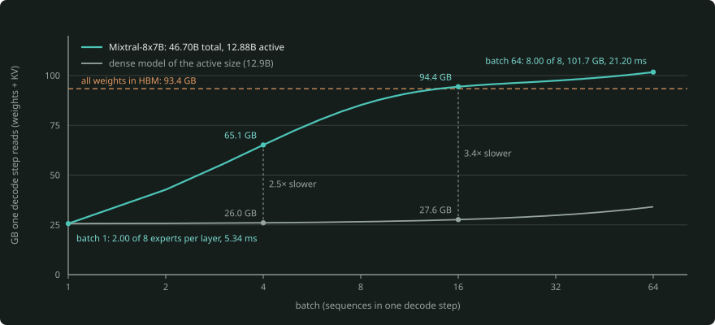
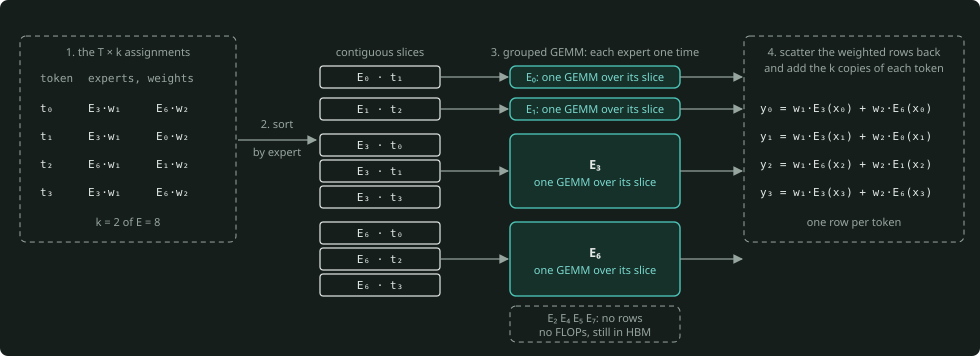
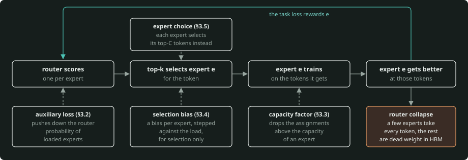
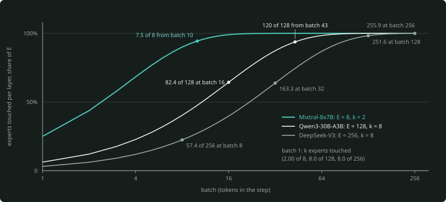
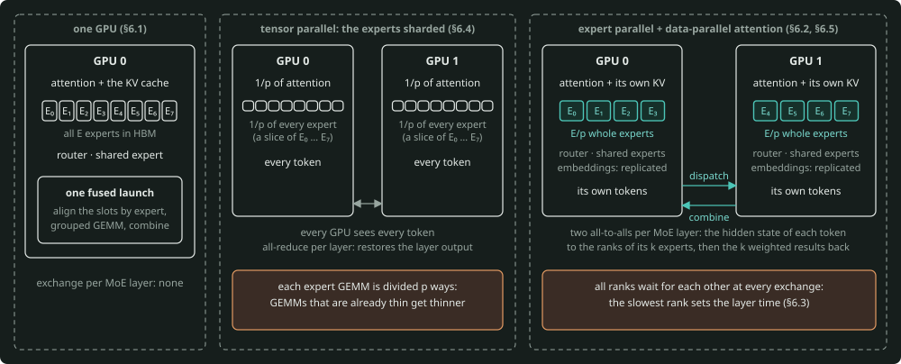
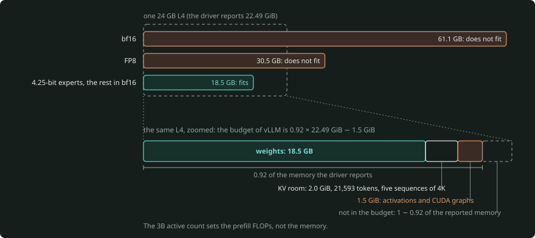

# Mixture-of-experts models: the router, the experts, and what sparsity does to serving

A mixture-of-experts (MoE) model replaces the MLP of each transformer block with many expert MLPs and a small
router. The router sends each token to a few of the experts. This primer explains these topics:

- the layer, from first principles,
- how training teaches the routers to share the work,
- which experts a batch of tokens actually reads at inference time,
- how MoE runs on GPUs (fused kernels, expert parallelism, all-to-alls, offloading, quantized experts),
- how to size a deployment and calculate its cost.

Each formula has a worked number. The package `moecore` in [`moe-core/`](moe-core/README.md) calculates it
(standard library + numpy). The text gives the name of the function next to the number. If the text and the code
do not agree, `moe-core/tests/test_primer_numbers.py` fails. The lab in [`moe-lab/`](moe-lab/README.md) runs the
same ideas on real GPUs.

This primer links to these primers, and it does not repeat them:

- the transformer itself: the [transformer primer](../transformers/docs/transformer-primer.md),
- how to size memory and TTFT/TPOT: the [capacity primer](../gpu-capacity-planning/PRIMER.md),
- the roofline: [layer 01](../../01-hardware-gpu-fabric/roofline-and-fabric/PRIMER.md).

---

## The one-minute version

- **An MoE layer is E expert MLPs plus a router.** The router gives each token a score against each expert. The
  token keeps its top-k. Its output is the weighted sum of the outputs of those k experts (plus a shared expert, in
  models that have one). All E experts are in memory. Only k of them do computation for each token.
- **Three parameter counts size three things.** HBM holds the *total* count (Mixtral-8x7B: 46.70B, DeepSeek-V3:
  671.03B). The *active* count sets the prefill FLOPs (12.88B, 37.55B). The bytes that a step *streams* set the
  decode time. These bytes start near the active count at batch 1, and they come near the total at serving
  batches.
- **Routers collapse unless balanced.** Training rewards the expert that is already good. Thus a few experts take
  every token. An auxiliary loss, capacity limits or the selection-only bias of DeepSeek-V3 spread the work.
- **A batch reads the union of its tokens' experts:** $E(1 - (1 - k/E)^T)$ per layer. Layer 01 uses the same
  formula. Thus Mixtral decodes like a 13B model at batch 1. By batch 16, it streams almost all 93 GB of its
  weights. Decode becomes compute-bound only at a batch approximately total ÷ active times the batch of the dense
  model. More precisely, the factor is weights streamed ÷ weights multiplied. On an H200, that batch is 754 for
  Mixtral and 2,055 for Qwen3-30B-A3B, against 207 for a dense 8B. MoE wants large batches.
- **Large batches mean expert parallelism.** Each GPU holds some experts. Each MoE layer exchanges tokens. With
  DeepEP-class kernels, this is two all-to-alls: dispatch the tokens, then combine the results. Each MoE layer also
  waits for its busiest GPU. In prefill, this is the GPU with the most rows. In decode, the layer waits for the
  busiest link. Data-parallel attention plus EP ("wide-EP") puts only a few experts on each GPU and frees memory for
  KV.
- **MoE does not change attention or the KV cache.** Prefix caching and the calculation of the KV size work exactly
  as for the dense model with the same attention. At long context, the KV cache is again the largest part.



*This chart shows the bytes that one decode step reads against the batch, for Mixtral-8x7B on an H200 at 1K
context (`touched.decode_step()`, simulated). At batch 1 the step reads 2.00 of 8 experts per layer, the same
cost as a dense model of the active size. By batch 16 it reads almost all of the 93.4 GB of weights.*

---

## 1. Why sparsity

**Parameters are knowledge. FLOPs are cost.** A dense transformer multiplies every weight by every token. Thus its
parameter count sets what it can store, and also what each token costs. The loss continues to decrease as the
parameters increase. But a dense model pays for every parameter on every token.

MoE breaks that link: it stores E times as many MLP weights, but it routes each token through only k of them. The
[§9 table](../transformers/docs/transformer-primer.md#9-modern-variants-and-why-each-exists) of the transformer
primer puts it in one row: "parameters grow ~E× while compute per token barely moves. More knowledge per FLOP, at
the cost of memory and serving complexity."

**The scaling-law view.** At a constant active size, more total parameters give a lower loss. Moonshot's Kimi K2
report (§2.3) keeps the activated parameters constant (8 routed + 1 shared expert) and changes the number of experts.
At equal validation loss, sparsity 48 (384 experts, 8 active) needs 1.69×, 1.39× and 1.15× fewer FLOPs than sparsity
8, 16 and 32. The returns decrease, but they are returns.

Most of the 2026 frontier open-weight models are MoE. They go from 26B with ~4B active (Gemma 4) to 2.8T with 104B
active (Kimi K3). See the
[open-weight primer §4](../model-landscape/open-weight-llms-primer.md#4-the-families-vendor-by-vendor) (verify).

**Memory by total, FLOPs by active.** The capacity primer does this calculation for Mistral Large 3 (675B total, 41B
active). It is in the section "When one GPU (or one node) won't do" of the
[capacity primer](../gpu-capacity-planning/PRIMER.md). In FP8, the weights of Mistral Large 3 are ~675 GB. This is
more than the 576 GB of usable HBM of 8×H100, before any KV cache.

Prefill costs the same as for a 41B dense model. A 2,048-token prompt is 2 × 41e9 × 2,048 = 1.68 × 10¹⁴ FLOPs
(`sizing.prefill_flops()`, the same formula as `capacity.prefill_flops()`). This is 16.5× less than a dense 675B
model needs. Decode at large batch streams every expert at every step: 675 GB ÷ (8 × 4.8 TB/s) = **17.6 ms** per
step across 8 H200s (`sizing.decode_floor()`). This is the "~18 ms floor" that the capacity primer quotes.

| What | Sized by | Mixtral-8x7B | Qwen3-30B-A3B | DeepSeek-V3 |
|---|---|---|---|---|
| HBM for weights | total parameters | 46.70B → 93.4 GB bf16 | 30.53B → 61.1 GB bf16 | 671.03B → 671.0 GB FP8 |
| compute per token (FLOPs = 2 × this) | active parameters | 12.88B | 3.35B | 37.55B |
| total ÷ active | how much the batch must increase | 3.6 | 9.1 | 17.9 |
| KV per token (bf16) | attention only | 131,072 B | 98,304 B | 70,272 B (MLA latent) |

(The functions are `MoEConfig.total()`, `.active()`, `.kv_bytes_per_token()` and `sizing.weight_bytes()`. The
configs are in `sizing.MODELS`.)

**What MoE does not change: attention and the KV cache.** Experts replace the MLP, and attention does not change.
The attention of Mixtral has the shape of Llama-3.1-8B (32 query heads, 8 KV heads of 128, 32 layers). Thus both
cache exactly 2 × 32 × 8 × 128 × 2 = 131,072 bytes per token. Paged KV, prefix caching and KV quantization
([`04-inference-engine/kv-cache`](../../04-inference-engine/kv-cache/), [`paged-attention`](../../04-inference-engine/paged-attention/))
apply with no change. What changes is the share of each step that goes to the KV reads (§5).

---

## 2. The MoE layer

### 2.1 Experts and the router

```
                  x (one token, d)
                  │
        ┌─────────┴───────────────────────────┐
        │ router: logits = x · W_r   (d × E)   │      shared expert(s)
        │ scores = softmax or sigmoid          │      ┌──────────────┐
        │ keep top-k, weights w₁..w_k          │      │ MLP_s(x)     │ every token, weight 1
        └──┬──────────┬───────────────────────┘      └──────┬───────┘
           │ w₁       │ w₂          (k = 2 of E = 8)         │
        ┌──▼───┐   ┌──▼───┐   ┌──────┐ ┌──────┐            │
        │ E₃   │   │ E₆   │   │ E₀   │ │ ...  │  unchosen: no FLOPs, still in HBM
        └──┬───┘   └──┬───┘   └──────┘ └──────┘            │
           └────┬─────┘                                    │
                ▼                                          ▼
          y = w₁·E₃(x) + w₂·E₆(x)            +          MLP_s(x)
```

Each expert is an ordinary gated MLP (SwiGLU:
$\operatorname{down}(\operatorname{silu}(x \cdot W_{\text{gate}}) \odot x \cdot W_{\text{up}})$), `moe.Expert`. The
router is one linear layer with $d \times E$ parameters. For Mixtral, that is 32,768 parameters, too few to be
important. With E = k = 1, the layer is exactly the dense MLP (`moe-core` notebook 01, exercise 1.2).

### 2.2 Router variants, as implemented

The families are different in how the scores become weights, and you can see the difference in the outputs. The
table puts the same eight logits [2.0, 1.2, 0.4, 0.3, −0.5, −1.0, −1.1, −2.0] through each router (`moe.route()`
with `moe.ROUTERS`):

| Family (source) | Scores | Selection | Weights | Worked weights (k = 2) |
|---|---|---|---|---|
| Mixtral (`MixtralTopKRouter`) | softmax over E | top-k of the probabilities | renormalised to sum to 1 | [0.69, 0.31] |
| OLMoE, Qwen2/Qwen3-MoE at transformers' default (`norm_topk_prob` False) | softmax over E | top-k | raw probabilities | [0.493, 0.221], sum 0.714 |
| Qwen2-MoE / Qwen1.5-MoE | softmax | top-k | raw, plus a shared expert × $\operatorname{sigmoid}(x \cdot g)$ | — |
| DeepSeek-V3 (`Gate`) | sigmoid | top-k of score + per-expert bias, inside the best 4 of 8 groups | *unbiased* scores, renormalised, × 2.5 (`route_scale`) | [1.335, 1.165], sum 2.5 |
| gpt-oss, Granite | router with a bias (gpt-oss) | top-k of the logits | softmax over only the k logits | [0.69, 0.31] |
| Llama 4 | sigmoid | top-1 | its sigmoid score scales the expert's **input** | [0.881] (k = 1) |

Two details teach a lesson. First, softmax over the top-k *logits* (gpt-oss) is equal to the renormalised softmax
of Mixtral, because the ratios of the exponents are the same. Thus the difference between the families there is
the router bias, not the arithmetic.

Second, the bias of DeepSeek-V3 only **selects**. Put a bias of +1.0 on the last expert (logit −2.0). That expert
then enters the top-2 on its biased score. But its weight is its unbiased sigmoid, renormalised: 0.298 of the 2.5
(`moe-core` notebook 01). That separation is the reason that auxiliary-loss-free balancing works (§3.4).

In transformers, the default of `norm_topk_prob` is False for Qwen2/Qwen3/OLMoE, and OLMoE uses False
(`ROUTERS["olmoe"]`). Reports say that the released Qwen3 MoE configs set it true (verify). This makes Qwen3
calculate its weights as Mixtral does (`ROUTERS["qwen3-moe"]`). Read the config of the checkpoint.

### 2.3 Shared experts and granularity

A **shared expert** runs on every token with weight 1. Examples:

- DeepSeek-V3 has 1 shared + 256 routed experts.
- Llama 4 has one shared expert.
- Qwen1.5-MoE-A2.7B has a shared expert that is four routed experts wide (5,632 = 4 × 1,408). The gate
  $\operatorname{sigmoid}(x \cdot g)$ multiplies its output. Thus each token uses 4 routed + 4 shared-sized units of
  64.

The shared expert holds what every token needs. Thus the routed experts are free to specialise. Qwen3 removed it
("Unlike Qwen2.5-MoE, the Qwen3-MoE design excludes shared experts", Qwen3 report §2).

**Granularity** is the size of an expert. Mixtral is coarse: 8 experts of width 14,336, top-2. DeepSeek-V3 is fine:
256 experts of width 2,048, top-8 (plus shared). At equal parameters and equal FLOPs, fine experts give a token many
more combinations. If you divide the 8 × 14,336 of Mixtral into 64 × 1,792 with top-16, the FLOPs and the parameters
stay the same. But the number of expert sets increases from 28 to 4.89 × 10¹⁴ (`math.comb`, notebook 01 exercise
1.5).

This is the DeepSeekMoE argument. §5 gives the price in serving. Because each token selects more
fine-grained experts, a batch touches more of the model, and each expert sees fewer rows.

### 2.4 Counting total and active parameters from a config

`MoEConfig` (`moecore/moe.py`) counts the matmul weights, the embeddings and the biases from the config fields. It
ignores the norms (< 0.01%). The config fields come from the model code in the upstream repos (transformers,
deepseek-v3, gpt-oss, llama-models).

**Mixtral-8x7B** (32 layers, d 4,096, GQA 32/8 × 128, experts of width 14,336, E 8, k 2, vocab 32,000):

```
one expert     3 × 4,096 × 14,336                       = 176,160,768
attention      2 × 4,096 × 4,096 + 2 × 4,096 × 1,024     =  41,943,040
router         4,096 × 8                                =      32,768
total   32 × (attention + 8 experts + router) + 2 × 32,000 × 4,096 = 46,702,526,464   (46.70B)
active  32 × (attention + 2 experts + router) + 2 × 32,000 × 4,096 = 12,879,659,008   (12.88B)
```

The name "8x7B" counts some parameters two times. Attention and the embeddings are common to all the experts. Thus
eight 7B models together are ~56B.

**DeepSeek-V3** (61 layers of which 3 dense, d 7,168, MLA with 128 heads, 256 routed experts of width 2,048 + 1
shared, top-8, vocab 129,280). MLA per layer is 187,107,328 parameters (`moe.mla_params()`), one expert 44,040,192,
and the MLP width of the dense layers is 18,432. Total **671.03B** and active **37.55B** match the published 671B /
37B. The Hugging Face checkpoint is 685B: 671B plus a 14B multi-token-prediction module. An engine loads this module
only for speculative decoding (verify).

**Which "active"?** The published active counts do not count the embeddings in the same way
(`MoEConfig.active(embeddings=)`):

| Model | total | active, both tables | LM head only | matmuls only | published |
|---|---|---|---|---|---|
| Mixtral-8x7B | 46.70B | 12.88B | 12.75B | 12.62B | 12.9B |
| Qwen3-30B-A3B | 30.53B | 3.35B | 3.04B | 2.73B | 3.3B |
| Qwen3-235B-A22B (verify d, I) | 235.09B | 22.19B | 21.57B | 20.95B | 22B |
| DeepSeek-V3 | 671.03B | 37.55B | 36.62B | 35.70B | 37B |
| gpt-oss-120b | 116.83B | 5.71B | **5.13B** | 4.55B | 5.1B |
| gpt-oss-20b (24 layers derived, verify) | 20.91B | 4.19B | **3.61B** | 3.03B | 3.6B |
| Llama 4 Scout (text) | 107.77B | 17.17B | 16.14B | 15.10B | 17B / 109B incl. vision |
| Llama 4 Maverick (text, interleave verify) | 400.71B | 17.18B | 16.15B | 15.12B | 17B / 400B |
| Qwen1.5-MoE-A2.7B | 14.32B | 2.69B | 2.38B | 2.07B | 2.7B |
| OLMoE-1B-7B | 6.92B | 1.28B | 1.18B | 1.08B | 1.3B / 6.9B |

OpenAI's 5.1B for gpt-oss-120b counts only the LM head. DeepSeek's 37B and layer 01's
`roofline.llm.active_params()` count both tables. A 201K-token vocabulary at d = 2,880 is 0.58B per table — 11% of
the active count of gpt-oss-120b. Thus give the convention before you compare two counts.

### 2.5 How the layer runs

You can run every expert on every token and set the outputs of the experts that the router did not select to zero.
This is correct, but it costs ${E/k}$ times too much (`MoELayer.forward_dense()`, the reference). Engines do what
`MoELayer.forward()` does:

1. Flatten the $T \times k$ assignments.
2. **Sort them by expert.**
3. Run each expert one time over its contiguous slice. This is a *grouped GEMM*.
4. Scatter the weighted rows back, and add the k copies of each token.



*`MoELayer.forward()` sorts the T × k assignments by expert and runs one GEMM per expert over its contiguous
slice (the grouped GEMM). Then it adds the k weighted rows back to each token. An expert with no rows costs no
FLOPs, but it stays in HBM.*

A test makes sure that the two are equal to 10⁻¹² for all five router families. The sort is the central part of
every fused MoE kernel (§6.1).

---

## 3. Routing and load balance

### 3.1 Router collapse

The task loss trains the router. The task loss rewards the router when it routes a token to the expert that is
*already* good at that token. The expert that wins early gets the gradient, becomes better, and wins more. An expert
that gets no tokens never trains and never gets a chance. If nothing controls this, a layer **collapses** onto a few
experts. The other experts are dead weight in HBM, and the model becomes a smaller dense model with extra memory.



*The feedback loop of §3.1 is a cycle, and each balance method acts at one point of it. The task loss rewards
the expert that is already good, thus the early winner gets more tokens. The auxiliary loss, the selection bias
and the capacity factor each limit the loop, and expert choice reverses the choice.*

`moecore.train` shows this with gradients written by hand. A check against finite differences shows that the
gradients are correct. The toy has these parts:

- four clusters of tokens, each with its own target map,
- four linear experts,
- a top-1 router with Switch-style weights.

The hidden states share a large common direction (as transformer hidden states do). Thus at step 0, two experts are
the top choice of most tokens, split 55/45. With no load balance, one expert carries 95% of the tokens by the end,
and the task loss stays at 0.186. Over ten task seeds, one to three of four experts carry all the tokens at the end.

### 3.2 The Switch auxiliary loss and the z-loss

Switch Transformer (and GShard before it) adds this loss:

$$
\begin{aligned}
L_{\text{aux}} &= \alpha \cdot E \cdot \sum_{e} f_e \cdot P_e \\
f_e &= \text{share of the batch's assignments routed to } e \\
P_e &= \text{mean router probability of } e \text{ over the batch}
\end{aligned}
$$

The loss is smallest when both $f$ and $P$ are uniform. Only $P$ carries a gradient, because $f$ comes from a top-k.
The gradient $\partial L_{\text{aux}} / \partial p[t, e] = \alpha \cdot E \cdot f_e / T$ pushes down the
probability of loaded experts (`routing.switch_aux_grad()`).

**Two normalisations exist.** The `load_balancing_loss_func` of transformers counts all k assignments
($\sum f = k$). Thus a router that is perfectly uniform gets the score **k**. Megatron-LM and MegaBlocks divide by k.
Thus a uniform router gets the score **1** (`routing.switch_aux_loss(convention=)`). With E = 8, k = 2:

| Routing | hf convention | Megatron convention |
|---|---|---|
| uniform | 2.00 | 1.00 |
| two experts take everything | 8.00 | 4.00 |

Thus the same coefficient gives a push that is different by a factor of k. These coefficients are in use:

- the config of Mixtral: 0.001,
- OLMoE: 0.01,
- the recommended start value of Megatron: 1e-2 (the Switch paper used 0.01, verify).

In the toy (§3.1), $\alpha = 0.1$ balances every seed and lowers the task loss to 0.057 at seed 6. The value
$\alpha = 0.01$ is too weak, and the router still collapses (notebook 02, exercise 2.4). A coefficient that is too
strong gives balance for a loss of quality. The loss demands equal counts even when the data has no balance. In the
toy, the aux run divides two unequal clusters across experts.

The **router z-loss** is the mean over tokens of $\operatorname{logsumexp}(\text{logits})^2$. It keeps the router
logits small, so that a bf16 softmax stays accurate (`routing.z_loss()`). Eight zero logits give a z-loss of
(ln 8)² = 4.324. An addition of 20 to every logit raises it to 488, but the softmax does not change. OLMoE trained
with weight 0.001. MegaBlocks calls 1e-3 "a reasonable value".

### 3.3 Capacity factor and token dropping vs dropless

A training kernel with a constant shape wants each expert to process the same number of rows. The **capacity** is
`int(factor · k · T / E)` rows per expert (MegaBlocks' `expert_capacity`, `routing.capacity()`). The kernel
**drops** the assignments above the capacity. The token skips that expert and goes through the residual connection.
Megatron drops the tail of the batch or the assignments with the lowest probability (`routing.apply_capacity()`).
The table uses a skewed batch of 256 tokens, 8 experts, top-2 (hottest expert 191 assignments against a mean of 64):

| Capacity factor | Rows per expert | Assignments dropped |
|---|---|---|
| 1.00 | 64 | 32.8% |
| 1.25 | 80 | 26.6% |
| 2.00 | 128 | 12.3% |

The kernel drops nothing until the factor is more than the hottest load over the mean (191 / 64 = 2.98; 3.00 in
steps of 0.25). **Dropless** MoE (MegaBlocks' dMoE, "removing the capacity_factor hyperparameter altogether")
changes the expert computation into block-sparse matmuls. Thus it keeps every assignment. OLMoE trained dropless.

Inference engines are dropless, because a dropped token changes the answer. They pay with padding instead. vLLM's
`moe_align_block_size` sorts the $T \cdot k$ slots by expert. It pads the segment of each expert to a multiple of the
kernel's `BLOCK_SIZE_M` with a pad id. `routing.align_block_size()` reproduces its docstring example. Here, 512
assignments become 576 rows at block 16, 12.5% padding.

### 3.4 Auxiliary-loss-free balancing and its sequence-level complement

DeepSeek-V3 moved the load balance out of the loss. Each expert has a bias that the router adds to its score **for
selection only**. As §2.2 shows, the combine weight uses the unbiased score. After each step, the bias moves by a
constant rate against the load. Megatron's `get_updated_expert_bias` does this:

```python
update_direction = torch.sign(total_tokens - tokens_per_expert * num_experts)   # under-loaded +, over-loaded −
expert_bias      = expert_bias + update_direction * expert_bias_update_rate     # 1e-3, "same as DeepSeekV3"
```

No gradient touches the router. Thus the task gradient stays clean. Take a frozen, skewed router (load
[416, 237, 61, …] over 8 experts, top-2). On it, 400 bias steps of 0.002 bring max/mean load to 1.03
(`routing.update_bias()`, notebook 02 exercise 2.3). In the toy, the bias method gets the lowest loss of the three
runs (0.036 at seed 6). It also gives the cleanest one-cluster-per-expert placement.

Batch-level balance can hide a collapse in each sequence. Take four sequences that each send every token to a
different expert. To the batch loss, they look perfect (1.0, Megatron convention). To a per-sequence loss, they look
collapsed (4.0 = E, `routing.sequence_aux_loss()`, Megatron's `seq_aux_loss`). DeepSeek-V3 keeps a small
sequence-wise balance loss together with the bias ($\alpha = 0.0001$ in its report, verify).

### 3.5 Expert-choice routing

Reverse the choice: each expert selects its top-C tokens from the batch (`routing.expert_choice()`). The load has a
perfect balance by construction. But a token can get zero experts or many. Also, the experts of a token depend on
the other tokens in the batch. Thus the method is not causal and not deterministic per request, and you cannot use it
for autoregressive decode. OLMoE reports that in their experiments, expert choice was not better than dropless token
choice.

### 3.6 Group-limited (node-limited) routing for EP

When the experts are on different nodes, a token that goes to 8 experts on 8 different nodes costs 8 cross-node
transfers. DeepSeek-V3 uses these steps (`moe.limit_groups()`):

1. Divide the 256 experts into 8 groups of 32.
2. Give each group a score: the sum of its top-2 biased scores.
3. Keep the best 4 groups.
4. Select the top-8 experts inside them.

With one group per node, a token talks to 4 nodes at most. Kimi K2 removed the expert groups (384 experts, no
groups), as the comparison table of its report shows.

### 3.7 Balance at inference: hot experts and domain skew

Training balances the experts *on average over the training mix*. A serving workload is not the training mix. A
tenant with much code, a workload in one language, or one long document sends more tokens to a few experts. Model the
skew as a Zipf popularity. This is a model, not a measurement (`touched.touched_mc()`, simulated). For Qwen3-30B-A3B at 16
tokens, s = 1.0 touches 58.0 experts instead of 82.4 and loads the hottest one 13.4× the mean.

On one GPU, skew *helps*, because the step reads fewer bytes (§5). Across GPUs, skew hurts where the rows set the
time. In prefill, and in decode at batches so large that decode is compute-bound, the step waits for the GPU that
holds the hot experts. In ordinary memory-bound decode, every GPU streams its touched experts for any number of rows.
There, the skew shows in the exchange instead (§6.3).

To measure skew, you need a real router. The lab's
[`02_watch_the_router`](moe-lab/notebooks/02_watch_the_router.ipynb) records the expert choices of each token with
router hooks or vLLM's `--enable-return-routed-experts`.

---

## 4. Training MoE in brief

**Communication.** With expert parallelism, every MoE layer runs a dispatch and a combine all-to-all in the forward
pass. It runs their transposes in the backward pass. That is four all-to-alls per layer per step, plus the
data-parallel gradient reductions. Training frameworks (Megatron-LM, MegaBlocks, DeepSpeed) overlap them with
compute. The cost model of the collective is in layer 02
([PRIMER §5](../../02-cuda-nccl-runtime/cuda-and-nccl/PRIMER.md#5-collectives)).

**Loss terms.** The loss is the language-model loss + $\alpha \cdot \text{aux}$ (§3.2, per micro-batch or per
sequence) + a z-loss (§3.2). The bias update can replace $\alpha$ (§3.4). The router computations run in fp32.
DeepSeek-V3 keeps its bias in fp32, and transformers upcasts the router logits before the softmax.

**Upcycling.** Start from a trained dense model. Copy its MLP into every expert, add a new router, and continue the
training. OLMoE's repo describes "sparse upcycling" (for example, OLMo-1B into an 8-expert MoE) with a conversion
script. Upcycled experts start identical. Thus the balance terms and the noise are what make them become different.

**MoE + MLA against MoE + GQA: the attention side.** MoE decreases the per-token cost of the MLP. It does nothing for the
KV cache.

DeepSeek-V3 puts MoE together with multi-head latent attention, and it caches a 512 + 64-wide latent per layer:
(512 + 64) × 61 × 2 = 70,272 bytes per token. Qwen3-235B-A22B puts MoE together with GQA (4 KV heads of 128, 94
layers): 192,512 bytes per token (`MoEConfig.kv_bytes_per_token()`). The
[transformer primer §9](../transformers/docs/transformer-primer.md#9-modern-variants-and-why-each-exists) lists both
variants. At long context, this choice is more important than the expert count (§7).

**The toy, honestly.** `moecore.train` is full-batch Adam on 512 tokens, 300 steps, a quarter of a second per run.
Plain SGD also collapses with no load balance. But on this badly scaled toy, it converges too slowly to show what
balance gives. The lab's [`01_a_tiny_moe_in_torch`](moe-lab/notebooks/01_a_tiny_moe_in_torch.ipynb) has the torch
version with a real small transformer.

---

## 5. MoE at inference: which experts a step touches

Layer 01 gives the core result in
[PRIMER §3.6](../../01-hardware-gpu-fabric/roofline-and-fabric/PRIMER.md#36-moe-which-weights-a-step-streams) with
`roofline.llm.experts_touched()`. It has a table of experts touched, step bytes and step time for Mixtral-8x7B and
Qwen3-30B-A3B at batches 1–64. It also gives the decode crossover batches. `moecore.touched` reproduces all of it.
`tests/test_touched.py` holds the table to the byte, and it makes sure that the primer of layer 01 still prints it.
This section derives the formula, and it extends the formula to fine-grained experts, skew, rows per expert and the
KV share.

**The union.** One token misses a given expert with probability ${1 - k/E}$, because it selects $k$ distinct experts
of $E$. Then $T$ independent tokens miss it with $(1 - k/E)^{T}$. Thus one layer touches this number of distinct
experts:

$$
\text{experts_touched}(E, k, T) = E \cdot \left(1 - \left(1 - \frac{k}{E}\right)^{T}\right)
$$

The function is `touched.experts_touched()`. A Monte Carlo draw, `touched.touched_mc()`, agrees within 2%. The step
streams the weights of every touched expert from HBM one time per step, for any number of rows that the expert
serves.

The function `touched.decode_step()` is the same one-kernel roofline as `roofline.llm.decode()`. It calculates the
table of layer 01 (1K context, H200). Its two ends are: at batch 1 Mixtral reads 2.00 of 8 experts per layer,
25,631,531,008 bytes of which 25,497,182,208 are weights, in 5.34 ms; at batch 64 it reads 8.00 of 8, 101.7 GB, in
21.20 ms. Qwen3 reads 8.0 and 125.9 of 128. All are memory-bound. These are bounds, not measurements.

Mixtral touches 7.5 of its 8 experts per layer from batch 10, Qwen3 120 of 128 from batch 43 (notebook 03, exercise
3.2). DeepSeek-V3 (256, top-8) touches 8.0, 57.4, 163.3, 251.6 and 255.9 experts at 1, 8, 32, 128 and 256 tokens.
Fine granularity keeps this decrease in bytes up to larger batches. But at typical decode batches, the step reads
every expert at every step.



*This chart shows the share of the E experts that one layer touches, against the batch, for three granularities
(`touched.experts_touched()`). Mixtral reads almost all of its 8 experts from batch 10. The fine experts of
Qwen3-30B-A3B and DeepSeek-V3 keep the decrease in bytes up to larger batches.*

**Skewed against uniform.** Skew (§3.7) touches fewer experts. Qwen3 at batch 16 under Zipf s = 1.0 reads 58.0 experts per
layer instead of 82.4, a 1.36× faster step on one GPU. This number comes from the simulation (notebook 03, exercise
3.6). Uniform routing is the safe assumption for bytes. Skew is the safe assumption for expert-parallel balance.

**The decode crossover.** The FLOPs increase with active × batch, while the bytes come near the total. Thus the
batch at which a decode step becomes compute-bound increases with the ratio of weights streamed to weights
multiplied. Layer 01's bisection (c = 0, H200, ridge 206) gives 207 for Llama-3.1-8B, 754 for Mixtral-8x7B and 2,055
for Qwen3-30B-A3B. `touched.decode_crossover_batch()` reproduces it.

The ratio that predicts them does not include the input embedding. The input embedding is a gather: the step does
not stream it and does not multiply it. For this ratio, streamed ÷ multiplied is 3.7 for Mixtral and 9.9 for Qwen3,
against total ÷ active of 3.6 and 9.1. The two ratios of Qwen3 are different because of its large vocabulary at
small d. A prediction of the crossover of Qwen3 from the dense one, 207 × 9.9 ≈ 2,057, is within 1% of the
bisection. But 207 × 9.1 would be 8% low (notebook 03, exercise 3.4).

**Why: each expert sees B·k/E of the batch.** Inside the step, the GEMM of an expert has as many rows as the tokens
that go to it, on average $B \cdot k/E$. Its arithmetic intensity is approximately that row count. At batch 256,
that is 64 rows for Mixtral, 16 for Qwen3 and 8 for DeepSeek-V3.

To get to the H200's ridge of 206, you need batches of 824, 3,296 and 6,592 tokens. **That is why MoE wants large
batches.** It is also why engines serve large MoE models with expert parallelism, which pools the tokens of many GPUs
at each expert (§6.5).

**KV unchanged, so the KV/weights ratio shifts.** For the same KV, an MoE step streams more weight bytes than a dense
model with the same active count. Take batch 64 (`touched.kv_share()`). At 1K context, the KV cache is 8.5% of a
Mixtral step but 36.4% of a Llama-3.1-8B step; at 32K context, 74.7% against 94.8%. The MoE stays weight-bound
longer. At long context, KV becomes the largest part for both.

**Prefix caching unchanged.** Cached prefix blocks hold K and V, which attention makes. A prefix hit skips the same
prefill FLOPs for an MoE as for a dense model. The
[serving-engine primer §5](../../04-inference-engine/serving-engine/PRIMER.md#5-prefix-caching) gives the mechanics
of prefix caching.

---

## 6. Running MoE on GPUs

### 6.1 Fused MoE kernels

A simple MoE launches one small GEMM per expert per layer. Fused kernels do the sort of §2.5 on the GPU, and they
run all the experts in one launch:

1. **Align.** vLLM's `moe_align_block_size(topk_ids, block_size, num_experts, expert_map)` flattens the $T \cdot k$
   assignments and sorts them by expert. It pads the segment of each expert to a multiple of `BLOCK_SIZE_M` (§3.3).
   With EP, experts on other ranks get id −1, and the kernel skips their blocks.
2. **Grouped GEMM.** `fused_moe_kernel` (Triton) goes through the sorted ids. Each program calculates one block of
   rows for one expert. It does GEMM 1 on the gate and up projections (`w1`), then the activation, then GEMM 2 on
   `w2`.
3. **Combine.** `moe_sum` adds the k weighted rows of each token.

The block sizes, the warps and the stages have values adjusted for each shape. vLLM ships JSON files with the name
`E={E},N={N},device_name={GPU},dtype=...,block_shape=[...].json`. N is the intermediate size of the expert per
shard. Each file maps the batch size M to a kernel config, and `benchmarks/kernels/benchmark_moe.py` generates them.
There are none for T4, L4 or A10 (examined at vLLM main `a4eb3f2`, verify for v0.30.0).

Thus on those GPUs, expect the warning "Using default MoE config. Performance might be sub-optimal!" For
unquantized weights on CUDA, vLLM prefers the FlashInfer TRT-LLM and CUTLASS backends, then Triton. On SM90, it puts
Triton first.

### 6.2 Expert parallelism: dispatch and combine

With **expert parallelism** (EP), each of $p$ GPUs holds ${E/p}$ whole experts. Every MoE layer moves tokens, not
weights. A **dispatch** all-to-all sends the hidden state of each token to the ranks that hold its k experts. A
**combine** all-to-all brings the k weighted results back. Per GPU and direction, the bytes are at most this
quantity:

$$
\begin{gathered}
\text{bytes} = \text{tokens} \times k \times \text{hidden} \times \text{bytes per element} \\
\text{(every assignment remote: the upper bound)}
\end{gathered}
$$

Under uniform routing, ${(p - 1)/p}$ of it leaves the GPU (`ep.dispatch_bytes()`). Layer 02's
[§5.6](../../02-cuda-nccl-runtime/cuda-and-nccl/PRIMER.md#56-how-inference-uses-collectives) gives the cost of a
Mixtral-like layer (hidden 4,096, top-2) at 256 tokens per GPU. It is 4 MiB per direction, **22 µs pairwise or 10 µs
direct** on 8 GPUs with α = 2 µs and 450 GB/s. `ep.a2a_time()` reproduces
`gpusim.collectives.model_time("all_to_all", ...)`. The table gives the values per MoE layer on 8 GPUs, with a
direct all-to-all (simulated, layer 01's illustrative links):

| Tokens per GPU | Link | Mixtral dispatch (BF16) | DeepSeek-V3 dispatch (FP8 + scales) | DeepSeek-V3 combine (BF16) |
|---|---|---|---|---|
| 8 (decode) | NVLink 4 | 0.12 MiB, 2.3 µs | 0.45 MiB, 2.9 µs | 0.88 MiB, 3.8 µs |
| 8 (decode) | 400 Gb/s IB | 0.12 MiB, 7.3 µs | 0.45 MiB, 13.3 µs | 0.88 MiB, 21.1 µs |
| 4,096 (prefill) | NVLink 4 | 64 MiB, 132.5 µs | 231 MiB, 473.0 µs | 448 MiB, 915.4 µs |
| 4,096 (prefill) | 400 Gb/s IB | 64 MiB, 1,179.4 µs | 231 MiB, 4,243.9 µs | 448 MiB, 8,225.8 µs |

Decode is latency-bound: α is most of the time. Prefill is bandwidth-bound, and across 400 Gb/s NICs it is roughly
9× slower than on NVLink. These are the numbers behind the rule of the deployment primer: "tensor and expert
parallelism go inside the NVLink domain"
([gpu-deployment §4](../../01-hardware-gpu-fabric/gpu-deployment/gpu-deployment-primer.md#4-when-one-gpu-isnt-enough-the-parallelism-menu)).
That is why **DeepEP**, the EP library of DeepSeek, ships two kernel families:

- *normal*: high-throughput, for prefill, NVLink then RDMA forwarding within a node,
- *low-latency*: for decode, pure RDMA, CUDA-graph compatible. V1 offered a hook-based overlap that uses no SMs.

The formula explains the published numbers of DeepEP. The EP8 low-latency dispatch of 128 tokens × top-8 × (7,168
FP8 bytes + 7,168/128 × 4 bytes of scales) = 7,569,408 B in 77 µs is **98.3 GB/s**. DeepEP reports 98. The BF16
combine, 14,680,064 B in 114 µs, is 128.8 GB/s, and DeepEP reports 127. DeepEP V2 needs SM90 (Hopper) or newer with
NVLink and RDMA. Thus it does not run on a T4 or an L4 (verify).

### 6.3 The slowest rank, and rebalancing

All ranks wait for each other at every exchange. Thus a layer takes as long as the expert work of the slowest rank
plus the exchanges (`ep.layer_time()`). Each rank's expert work is a roofline of its own: its rows × 2 × expert
parameters ÷ peak against its touched experts × expert bytes ÷ bandwidth (`ep.touched_per_rank()`). The table uses
the 128 experts of Qwen3-30B-A3B on 8 H100s (16 per GPU), NVLink, all-to-all kernels, simulated:

| Tokens per GPU | Routing | Placement | Rows on the busiest rank ÷ mean | Slowest rank bound by | Layer time | against balanced |
|---|---|---|---|---|---|---|
| 128 (decode) | uniform | linear | 1.04 | weight reads | 65.9 µs | 1.01× |
| 128 (decode) | Zipf s = 1.0 | linear (contiguous blocks, vLLM's default) | 1.63 | weight reads | 75.4 µs | 1.15× |
| 4,096 (prefill chunk) | uniform | linear | 1.01 | FLOPs | 844.0 µs | 1.01× |
| 4,096 (prefill chunk) | Zipf s = 1.0 | linear | 1.65 | FLOPs | 1,378.2 µs | 1.64× |
| 4,096 (prefill chunk) | Zipf s = 1.0 | round-robin (not applied to this model; below) | 1.46 | FLOPs | 1,225.9 µs | 1.46× |

**Decode: the skew moves to the exchange.** At 128 tokens per GPU, each expert sees about 64 rows, far below the
H100's ridge of 295. Thus every rank spends 45.1 µs streaming its 16 experts' weights, whatever the skew. The extra
rows of the hot rank (16.0 µs of FLOPs against a mean of 9.8) hide under that read. In decode, the skew costs time in
the exchange: the port of the hot rank receives the dispatch and sends the combine. On that port, the traffic is 1.5×
the mean (15.2 µs per all-to-all against 10.2), so the layer is 1.15× slower.

**Prefill: the rows set the time.** At 4,096 tokens per GPU, the expert GEMMs are compute-bound. Thus the busiest
rank's 1.65× rows make the layer 1.64× slower than a balanced one. This occurs on every layer of every prefill chunk
(notebook 04, exercise 4.4). Decode behaves the same way when its batch pushes the experts past the ridge (§5).

**Placement.** vLLM's `--expert-placement-strategy round_robin` puts expert $e$ on rank $e \bmod p$, not in
contiguous blocks. In this simulation, it can move the hot spot (1.65 → 1.46 rows), but it does not remove it. In
v0.30.0, vLLM applies it only when all these conditions are true:

- the model has more than one expert group (DeepSeek-V3 has 8),
- there are no redundant experts,
- EPLB is off,
- with all-to-all kernels, the backend is DeepEP low-latency or NIXL-EP.

If not, vLLM logs a warning and uses linear instead (`determine_expert_placement_strategy()` in
`fused_moe/expert_map_manager.py`, v0.30.0 and main `a4eb3f2`, verify for your version). Qwen3-30B-A3B has no expert
groups. Thus the round-robin row is a placement that vLLM does not apply to this model.

**EPLB** (`--enable-eplb`, window 1,000 steps, rebalance every 3,000 by default) measures the load and puts the
experts in new places. It replicates the hottest experts (`num_redundant_experts`). A greedy version
(`ep.rebalance()`) on the skewed decode batch gives these results. The new placement alone takes the busiest rank
from 1.63 to 1.08 max/mean; eight redundant copies take it to 1.01.

Replicas cost HBM. The EP guide of vLLM gives ~2.4 GB for one redundant DeepSeek-V3 expert per rank. That is 58 MoE
layers × 44,040,192 B in FP8 = 2.38 GiB (`ep.wide_ep_weights(redundant=)`).

### 6.4 TP vs EP for experts, and the hybrid

Without EP, experts are only MLPs, and they can be **tensor-parallel**. Every GPU holds ${1/p}$ of every expert, all
GPUs see all tokens, and an all-reduce restores the output of each layer (serving-engine
[§9](../../04-inference-engine/serving-engine/PRIMER.md#9-parallelism-inside-the-engine)). With EP, each GPU holds
whole experts and ships only assignments.



*The three layouts of §6.1, §6.4 and §6.5 differ in what each GPU holds and in what one MoE layer exchanges.
With tensor parallelism, every GPU holds a slice of every expert, and an all-reduce restores the output of the
layer. With expert parallelism, each GPU holds whole experts, and the layer runs a dispatch and a combine
all-to-all.*

Take a Mixtral MoE layer at batch 64 on 8 GPUs (`ep.moe_comm()`, simulated). TP's ring all-reduce sends 896 KiB per
GPU in 30.0 µs. EP with data-parallel attention and dedicated all-to-all kernels (DeepEP, NIXL-EP or FlashInfer's
kernels, with `mode="a2a"`) sends 224 KiB per GPU in 4.5 µs. TP also divides the GEMM of each expert $p$ ways. This
makes GEMMs that are already thin thinner.

The **hybrid** is the usual shape of a large deployment. Each rank has a copy of attention (or attention is
tensor-parallel inside each data-parallel group). The experts are expert-parallel across all the GPUs.

The semantics of vLLM (v0.30.0) are these. `--enable-expert-parallel` makes the MoE layers expert-parallel over
**EP = TP × DP** ranks. The EP size is not a flag of its own. When `--tensor-parallel-size 1`, each DP rank has a
copy of attention. When TP > 1, vLLM shards attention with TP within each DP group. **Without** the flag, MoE layers
run tensor-parallel over the same TP × DP group.

`--all2all-backend` selects the exchange (verify against your version):

- The default is `allgather_reducescatter`.
- `deepep_low_latency` is for decode, and `deepep_high_throughput` is for prefill across nodes.
- vLLM removed `pplx` and `naive`.
- There is no `VLLM_ALL2ALL_BACKEND` environment variable.

**What vLLM actually puts on the wire.** All-to-all kernels run only with EP and DP > 1, or with prefill context or
sequence parallelism (`FusedMoEParallelConfig.use_all2all_kernels`, `fused_moe/config.py`, v0.30.0). This gives
three cases:

- **TP × EP with DP = 1** (`--tensor-parallel-size 2 --enable-expert-parallel`): after attention, every GPU already
  holds every token. Thus there is no all-to-all at all. Each GPU runs its own experts on the tokens that go to
  them, and one all-reduce adds the outputs. This case has the traffic of TP (`mode="tp"`) and the memory layout of
  EP.
- **DP > 1 with the default `allgather_reducescatter`**: every rank all-gathers the tokens of every rank (tokens ×
  hidden, not × k). Then it reduce-scatters the outputs back. Each way, this is (p − 1) × tokens per GPU × hidden ×
  bytes. Here, it is the same 896 KiB and 30.0 µs as TP (`mode="agrs"`).
- **DP > 1 with an all-to-all backend** (`deepep_low_latency`, `deepep_high_throughput`, `nixl_ep`, …): this is the
  dispatch and combine of §6.2, the 224 KiB. DeepEP needs SM90 or newer with NVLink and RDMA. Thus it does not run
  on a T4 or an L4.

Thus the decrease in traffic that EP gives needs data-parallel attention *and* all-to-all kernels. On two PCIe GPUs,
`--enable-expert-parallel` changes the memory layout and the balance, not the bytes on the wire. The lab's
[`04_expert_parallelism_on_two_gpus`](moe-lab/notebooks/04_expert_parallelism_on_two_gpus.ipynb) measures exactly
that. SGLang and TensorRT-LLM serve large MoE models with the same two layouts under different flags. The
serving-engine primer's [§12](../../04-inference-engine/serving-engine/PRIMER.md#12-engines-and-where-to-run-them)
tells you which engine to select.

### 6.5 Data-parallel attention + EP (wide-EP)

Large deployments combine **data-parallel attention** with **EP** for the experts. With data-parallel attention,
every rank runs attention for its own requests with its own KV cache. The combination is "wide-EP"
([layer 05 §8](../../05-orchestrator/serving-orchestration/PRIMER.md#8-large-moe-topologies-wide-ep-in-brief)).
Every rank has a copy of attention, the dense layers, the shared experts, the routers and the embeddings. Only the
share of the routed experts on each GPU decreases with EP (`ep.wide_ep_weights()`). The table is for DeepSeek-V3 in
FP8 on H200s (141 GB):

| EP degree | Weights per GPU | Share of HBM | 4K-token sequences that fit |
|---|---|---|---|
| 8 | 98.9 GB | 70% | 776 |
| 16 | 58.0 GB | 41% | 3,824 |
| 32 | 37.6 GB | 27% | 9,920 |
| 64 | 27.3 GB | 19% | 22,080 |

(`sizing.sessions(layout="ep")`.) 17.1B parameters are replicated on every rank. At EP 64, they are most of the
weights of each GPU (17.1 of 27.3 GB).

This has two consequences. First, the DP ranks are not independent. The ranks align their forward passes. An idle
rank runs **dummy forward passes** while any rank has work (vLLM's DP coordinator).

Second, EP 16 means two 8-GPU nodes. Thus half of the all-to-all traffic of each GPU crosses the scale-out network.

Take DeepSeek-V3 at batch 512, 4K context, EP 16, FP8 dispatch and BF16 combine. It has 0.9 ms of all-to-alls per
step if all 16 GPUs shared one NVLink domain (an NVL72-class rack). Two 8-GPU nodes give each GPU 7 peers over
NVLink and 8 peers over one 400 Gb/s InfiniBand NIC per GPU. The result is 3.8 ms as two 8-GPU nodes, which is 22% of
a 17.6 ms step with no overlap (`ep.decode_on(per_node=8, intra=...)`, simulated). A layout with every peer behind
the NIC, the upper bound, gives 6.6 ms. This is the reason for NVL72-class racks, DeepEP's RDMA kernels and two-batch
overlap (vLLM `--enable-dbo`, SGLang TBO).

The wide-EP guide of llm-d runs DeepSeek-R1 on 32 H200 or B200 GPUs as 16-way DP prefill plus 16-way DP decode
(verify). The single-node form of SGLang is
`--tp 8 --dp-size 8 --ep 8 --enable-dp-attention --moe-a2a-backend deepep` (verify).

### 6.6 Expert offloading for small GPUs

When the experts do not fit, keep some of them in CPU memory:

- **vLLM** `--cpu-offload-gb N` puts N GiB of weights per GPU in CPU memory. It reads them through unified virtual
  addressing during each forward pass. `--cpu-offload-params experts` limits it to the expert weights (v0.30.0).
  The docs say that the engine loads offloaded weights "on the fly in each model forward pass". Count all of them
  per step as the upper bound (verify: examine what a given kernel actually touches).
- **llama.cpp** `--cpu-moe` keeps all expert weights in CPU memory. `--n-cpu-moe N` keeps the experts of the first N
  layers there. In small-batch decode, the CPU calculates those experts, so mostly activations cross PCIe. For large
  batches (prompt processing), llama.cpp by default copies the host-resident weights to the GPU and calculates there.
  `--op-offload` is on by default, and `--no-op-offload` keeps the work on the CPU. With the default, the weights do
  cross PCIe (from `common/arg.cpp` and the buffer-override semantics, verify).

The PCIe cost is high. Calculate the budget of one small GPU as vLLM does. 0.92 of the 15.0 GiB that a T4
reports, minus ~1.5 GiB of activations and CUDA graphs (verify), is 12.3 GiB (`sizing.kv_room_gib()`). This is the
same budget as the lab's `moelab.offload.fit`. OLMoE-1B-7B in fp16 is 13.8 GB = 12.9 GiB of weights. Thus on a 16 GB
T4, it has no room for KV at all.

The smallest offload that holds four 4K-token sequences is 3.0 GiB (`sizing.min_offload_gib()`, rounded up to 0.5
GiB). The lab prints `--cpu-offload-gb 3`. PCIe Gen3 gives ~12 GB/s effective (verify). A stream of the offload over
PCIe Gen3 adds ~268 ms to every step, against a 26 ms step at batch 4 — about 11× slower. The numbers come from
`sizing.offload_step_s()` and `touched.decode_step()` (simulated).

A 4-bit checkpoint is usually better: with 4-bit experts OLMoE is 4.4 GB and leaves room for 67,377 tokens of KV on
the same T4. Calculation of the offloaded experts on the CPU is also usually better. The lab's
[`05_moe_on_a_small_gpu`](moe-lab/notebooks/05_moe_on_a_small_gpu.ipynb) reads these numbers back from vLLM's
start-up log and measures the step.

### 6.7 Quantized experts

Experts are most of the bytes of an MoE. Thus quantization aims at them. The quantization primer has these topics:

- the formats, MXFP4 among them, in its [§2](../../04-inference-engine/quantization/PRIMER.md#2-number-formats),
- why routers stay in 16-bit, in its [§5](../../04-inference-engine/quantization/PRIMER.md#5-weight-and-activation-quantization),
- the calibration of rarely routed experts, in its
  [§8](../../04-inference-engine/quantization/PRIMER.md#8-measuring-the-accuracy-you-pay) (llm-compressor's
  `moe_calibrate_all_experts`, and `mlp.gate` in the ignore list).

These are the MoE-specific numbers:

- **gpt-oss ships MXFP4 experts** (4.25 bits per weight) and everything else in bf16. That makes gpt-oss-120b
  **65.2 GB** (one 80 GB GPU) and gpt-oss-20b **13.8 GB** (`sizing.weight_bytes(expert_bits=4.25)`). vLLM's MXFP4
  path needs compute capability 8.0 and bf16 activations. An L4 and an RTX 4090 can use it. A T4 cannot.
- **DeepSeek-V3 ships FP8** weights with 128 × 128 block scales. Its activations use quantization per 128 channels.

---

## 7. Sizing and cost

The recipe (`moecore.sizing`, notebook 05):

1. **Memory by total + KV.** Add the weights at the selected precision (`sizing.weight_bytes()`) and the KV cache of
   the batch. The KV cache is `MoEConfig.kv_bytes_per_token()` × context × sequences. For the size of a fleet, keep
   10% headroom on nominal GB (`sizing.sessions()`, layer 01's round budget). On one small GPU, the margin is the
   question. There, use the budget of vLLM itself (`sizing.kv_room_gib()`, §6.6).
2. **Prefill by active.** Calculate 2 × active × tokens (`sizing.prefill_flops()`). Divide it by an achieved
   fraction of the peak.
3. **Decode by the bytes streamed at the batch.** Add the touched experts, everything else and the KV (§5), per GPU
   in the selected layout (`ep.decode_on()`). Add two exchanges per MoE layer (§6.4). With DeepEP-class kernels,
   they are all-to-alls. If not, they are the default all-gather and reduce-scatter of vLLM.
4. **GPUs and EP degree.** Find the smallest count that holds the weights + KV and meets the ITL target
   (`sizing.plan()`).
5. **Cost.** Calculate GPUs × $/GPU-hour ÷ tokens per second (`sizing.usd_per_mtok()`).

**Memory, worked.** For memory, Qwen3-30B-A3B is a 30B model. It is 61.1 GB in bf16, 30.5 GB in FP8, 18.5 GB with
4.25-bit experts and the rest in bf16. Only the last fits a 24 GB L4.

The budget of vLLM (0.92 × 22.49 GiB − 1.5 GiB) then leaves 2.0 GiB for KV: 21,593 tokens, five sequences of 4K
(`sizing.kv_tokens()`). The lab's `python -m moelab fit` prints the same. The round 10%-headroom budget would say 7;
on one small GPU, the overheads are the whole margin. The 3B active count helps only the FLOPs.



*This figure shows the memory of one 24 GB L4 for Qwen3-30B-A3B, with the budget of vLLM
(`sizing.kv_room_gib()`). Only the checkpoint with 4.25-bit experts fits. It leaves 2.0 GiB for KV: 21,593
tokens, five sequences of 4K.*

**Prefill, worked.** An 8,192-token prompt costs a dense Llama-3.1-70B 5.48× the FLOPs it costs Mixtral-8x7B. At
50% of an H100's bf16 peak, Mixtral prefills it in 427 ms (simulated). In prefill, you see the full decrease in
FLOPs.

**Plans, worked** (4K context). The prices are illustrative placeholders per GPU-hour (see
[`COMPUTE.md`](../../COMPUTE.md)). All times come from the simulation:

| Case | Batch | ITL target | GPUs | Step | Tokens/s | $/M tokens at the placeholder price |
|---|---|---|---|---|---|---|
| Mixtral-8x7B, bf16, H100, DP attention + EP (all-to-all kernels) | 64 | 50 ms | 2 | 19.6 ms | 3,259 | 0.51 at $3/GPU-h |
| Llama-3.1-70B, bf16, H100, tensor parallel | 64 | 50 ms | 4 | 19.3 ms | 3,322 | 1.00 at $3/GPU-h |
| DeepSeek-V3, FP8, H200, wide-EP (all-to-all kernels, FP8 dispatch) | 256 | 50 ms | 8 | 23.2 ms | 11,046 | 0.60 at $3/GPU-h |
| Qwen3-30B-A3B, FP8, L4, DP attention + EP (vLLM's default `allgather_reducescatter` over PCIe) | 32 | 60 ms | 4 | 41.0 ms | 780 | 1.00 at $0.7/GPU-h |

The H100 and H200 EP rows assume all-to-all kernels. These are DeepEP-class kernels, which need Hopper with NVLink
and RDMA. DeepEP does not run on an L4. Thus the L4 row uses the default exchange of vLLM. It uses an assumed PCIe
peer-to-peer link of 12 GB/s and α = 15 µs (`ep.LINKS["pcie-l4"]`, the lab's `pcie-2xL4` value). Fit your own
values with layer 02's lab.

At batch 64, Mixtral costs about half as much per token as the dense 70B. The versions and your evals decide if the
two are of "similar quality" (verify). The point is the method, not the verdict. DeepSeek-V3's step (23.2 ms) is
above its all-experts floor (17.5 ms, `sizing.decode_floor()`). The difference is the KV reads of each rank, the
replicated weights of each rank and 0.9 ms of all-to-alls.

**Long context, worked.** Mixtral on 2 H100s gives these results:

- at 4K context 88 sequences fit and batch 16 runs at 1,024 tokens/s,
- at 32K only 10 fit (497 tokens/s at batch 10),
- at 128K, 2 (166 tokens/s).

When the context is long, the KV cache sets both the memory and the step, not the experts. The advantage of MoE
decreases with the batch that fits.

**The families, dated.** The table gives the configs as data in `sizing.MODELS`. They come from upstream code, read
on 2026-09-26, with the tag (verify) on a derived field. The table also gives the 2026 models that the
[open-weight primer §4](../model-landscape/open-weight-llms-primer.md#4-the-families-vendor-by-vendor) reports. For
these, there are no configs here. This primer cites their numbers and does not recompute them, and all of them carry
the tag (verify):

| Model | Routed E | k | Shared | d | Total / active | Source |
|---|---|---|---|---|---|---|
| Mixtral-8x7B | 8 | 2 | 0 | 4,096 | 46.70B / 12.88B | config |
| OLMoE-1B-7B | 64 | 8 | 0 | 2,048 | 6.92B / 1.28B | config, expert width derived (verify, 2026-09-26) |
| Qwen1.5-MoE-A2.7B | 60 | 4 | 1 (4× wide) | 2,048 | 14.32B / 2.69B | config |
| Qwen3-30B-A3B | 128 | 8 | 0 | 2,048 | 30.53B / 3.35B | config |
| Qwen3-235B-A22B | 128 | 8 | 0 | 4,096 | 235.09B / 22.19B | report, d and expert width 1,536 derived (verify, 2026-09-26) |
| gpt-oss-20b / 120b | 32 / 128 | 4 | 0 | 2,880 | 20.91B / 3.61B, 116.83B / 5.13B (head only) | reference code, 20b's 24 layers derived (verify, 2026-09-26) |
| Llama 4 Scout / Maverick | 16 / 128 | 1 | 1 | 5,120 | 107.77B / 17.17B, 400.71B / 17.18B (text) | Scout: config. Maverick: card 17B / 400B, MoE interleave and dense width 16,384 derived (verify, 2026-09-26) |
| DeepSeek-V3 | 256 | 8 | 1 | 7,168 | 671.03B / 37.55B | config |
| Kimi K2 | 384 | 8 | 1 | 7,168 | 1.04T / 32.6B | report (README: 1T / 32B), not recomputed (verify, 2026-09-26) |
| Mistral Large 3 | — | — | — | — | 675B / 41B | capacity and open-weight primers (verify, 2026-09-26) |
| DeepSeek V4-Pro / V4-Flash | — | — | — | — | 1.6T / ~49B, 284B / ~13B | open-weight primer (verify, 2026-09-26) |
| Qwen3.8-2.4T-A95B | 512 | 10 | 1 | — | 2.4T / ~95B | open-weight primer (verify, 2026-09-26) |
| Kimi K3 | 896 | 16 | yes | — | 2.8T / 104B | open-weight primer (verify, 2026-09-26) |
| MiniMax M3, Nemotron 3 Nano / Super / Ultra | — | — | — | — | M3: 428B / ~23B. Nemotron 3: ~31.6B / 3.2B, ~120B / 12B, ~550B / ~55B | open-weight primer (verify, 2026-09-26) |
| Gemma 4 26B MoE | — | — | — | — | 26B / ~4B | open-weight primer (verify, 2026-09-26) |

---

## 8. In a design review: failure modes

| Failure mode | What you see | The number behind it | What to do |
|---|---|---|---|
| **MoE at batch 1** | You get the memory of a 47B model for the decode speed of a 13B-class model. At small batches above 1, the MoE is slower than a dense model of the active size. | Mixtral on an H200 at batch 1: 5.34 ms, the same as a dense model of its 12.9B active size (`sizing.dense_equivalent()`). It has that speed, but 93 GB of weights resident against 26 GB. Then, at batch 4 and 16 it streams 65.1 and 94.4 GB against 26.0 and 27.6 GB, 2.5× and 3.4× slower. | Serve MoE where the traffic gives large batches. For low, bursty traffic, a dense model of the active size costs less. |
| **EP across a slow fabric** | Tokens/s stays flat or decreases when you add GPUs past one node. | DeepSeek-V3, EP 16, two 8-GPU nodes, 400 Gb/s IB: all-to-alls 3.8 ms per step (22% of the step) against 0.9 ms in one NVLink domain | Keep EP inside the NVLink domain. Use DeepEP RDMA kernels, overlap (DBO/TBO) and larger scale-up domains. |
| **Hot experts** | In prefill, one GPU is at 100% while the others are idle, and the busiest rank sets the step. In decode, the link of one GPU is the busiest. | Take Zipf-skewed Qwen3 on 8 H100s. 1.65× rows on the busiest rank make a prefill layer 1.64× slower; in decode the weight reads stay balanced and the hot rank's port makes the layer 1.15× slower | EPLB with redundant experts (~2.4 GiB each for DeepSeek-V3 FP8), placement strategy (round-robin only for grouped models), balance per tenant |
| **MoE on one 24 GB GPU** | Out of memory at load, or no room for KV. | Qwen3-30B-A3B: 61.1 GB bf16, 30.5 GB FP8, 18.5 GB with 4-bit experts (5 sequences of 4K at vLLM's defaults) | Quantize the experts. Offload only if you can accept the PCIe cost per step (OLMoE fp16 on a T4: 3 GiB offloaded, ~11× slower at batch 4). |
| **Long context where KV dominates** | The batch that fits becomes much smaller. The cost advantage of the MoE decreases. | Mixtral on 2 H100s: 88 sequences at 4K, 10 at 32K, 2 at 128K | KV quantization, MLA-style attention, prefix caching, P/D disaggregation (layer 05) |
| **Quantized experts** | Quality decreases only on some domains. | Rarely routed experts get too few calibration tokens. The router is sensitive. | Keep the gates in high precision. Calibrate every expert (llm-compressor `load_context()`). Evaluate per domain. |
| **Dense against MoE for a workload** | The "cheaper" model costs more in production. | At batch 64, Mixtral costs $0.51 against $1.00 per M tokens for the dense 70B (placeholder prices). At batch 1, the MoE only matches a dense model of its active size, on 3.6× the memory. | Decide with the plan: traffic (batch), the hardware that you can get (HBM, NVLink), context length, quality on your evals. |

---

## 9. Where to run it

You can learn every concept in this primer at T0. Hardware makes the numbers real. [`COMPUTE.md`](../../COMPUTE.md)
gives the prices and how to get each option.

| To learn | T0 (laptop / Colab CPU, $0) | T1 (one small GPU) | T2 (two or more GPUs) | T3 (GCP, optional) |
|---|---|---|---|---|
| the layer, routers, parameter counts (§2) | [`moe-core` notebook 01](moe-core/notebooks/01_the_moe_layer.ipynb) | router hooks on a small open MoE (lab [`02_watch_the_router`](moe-lab/notebooks/02_watch_the_router.ipynb)) | — | — |
| balance and collapse (§3–4) | [`moe-core` notebook 02](moe-core/notebooks/02_routing_and_load_balance.ipynb) (numpy), lab [`01_a_tiny_moe_in_torch`](moe-lab/notebooks/01_a_tiny_moe_in_torch.ipynb) (torch on CPU) | the same, faster | — | — |
| experts touched, decode against batch (§5) | [`moe-core` notebook 03](moe-core/notebooks/03_which_experts_a_batch_touches.ipynb) (simulated) | lab [`03_batch_vs_weight_stream`](moe-lab/notebooks/03_batch_vs_weight_stream.ipynb): vLLM step time against batch, MoE against dense | — | — |
| EP and all-to-all (§6.2–6.5) | [`moe-core` notebook 04](moe-core/notebooks/04_expert_parallelism_and_all_to_all.ipynb) (simulated) | — | lab [`04_expert_parallelism_on_two_gpus`](moe-lab/notebooks/04_expert_parallelism_on_two_gpus.ipynb): Kaggle's free 2×T4 (PCIe), `--enable-expert-parallel` against TP | the 02 lab's `l4x2` pool (2 × L4, PCIe) with the MoE lab's [`deploy/gke/`](moe-lab/deploy/gke/README.md) manifests |
| size calculation, offload, INT4 experts (§6.6–7) | [`moe-core` notebook 05](moe-core/notebooks/05_sizing_and_cost.ipynb) | lab [`05_moe_on_a_small_gpu`](moe-lab/notebooks/05_moe_on_a_small_gpu.ipynb) | — | — |

**What the two-GPU runs show.** On two PCIe GPUs, vLLM runs no dispatch/combine all-to-all (§6.4). TP × EP with
DP = 1 uses an all-reduce, and DP = 2 uses `allgather_reducescatter`. Thus the T2 and T3 EP runs compare these
things:

- the memory layout (half the experts per GPU against half of every expert),
- the balance across the two GPUs,
- the all-reduce traffic against the all-gather/reduce-scatter traffic.

Dispatch and combine occur only with DP > 1 and DeepEP-class backends on Hopper-class GPUs.

**Candidate models for T1** (ids and fits, verify):

- `allenai/OLMoE-1B-7B-0924` (6.9B): fp16 on a 24 GB GPU, or a T4 with `--cpu-offload-gb`,
- `Qwen/Qwen1.5-MoE-A2.7B` in INT4 (it fits a T4),
- `Qwen/Qwen3-30B-A3B` in INT4 on a 24 GB GPU,
- the small granite-3 MoE models (`ibm-granite/granite-3.0-1b-a400m-*`, `3b-a800m-*`).

The free options are Colab's T4, and Kaggle's T4 or 2×T4. The rented options are a 24 GB card on RunPod or Vast.ai
(containers) or Lambda (VMs), or a GCP L4 Spot VM. A T4 has no bf16 (`--dtype half`) and no FP8. It cannot run the
MXFP4 path of gpt-oss. An L4 or an RTX 4090 can run it.

On **GCP**, the Terraform of the cuda-and-nccl lab
([`02-cuda-nccl-runtime/cuda-and-nccl/cuda-nccl-lab/deploy/gcp/terraform/`](../../02-cuda-nccl-runtime/cuda-and-nccl/cuda-nccl-lab/deploy/gcp/terraform/))
creates a Spot `l4x2` pool (`g2-standard-24`, 2 × L4, PCIe, scales from zero). The GKE manifests of the MoE lab use
this pool with `--enable-expert-parallel`. There is no new Terraform. DeepEP and wide-EP need Hopper-class GPUs with
NVLink and RDMA. That is a rented 8-GPU H100/H200 box (RunPod, Vast.ai, Lambda) or GCP A3 shapes. It is a T2/T3
session that costs hours and dollars.

---

## In a design review

**The two-minute walkthrough.** "An MoE layer replaces the MLP with E expert MLPs and a router that sends each token
to its top-k. That separates what the model stores from what each token costs. Mixtral holds 46.7B parameters and
runs 12.9B per token. DeepSeek-V3 holds 671B and runs about 37B. Training must apply a balance method (an auxiliary
loss or DeepSeek-V3's selection-only bias), or the router collapses onto a few experts.

"At inference, three numbers set the size of the deployment. The *total* plus KV sets the memory, the *active* count
sets the prefill, and what a step *streams* sets the decode. A decode step reads every expert that any token in the
batch selected, $E(1 - (1 - k/E)^T)$ per layer. Thus an MoE is a small model at batch 1, and it streams almost all
its weights by batch 16–64. It becomes compute-bound only at batches approximately total ÷ active times the batch of
a dense model. More precisely, the factor is weights streamed ÷ weights multiplied, and for Mixtral on an H200 that
batch is 754.

"Thus we serve MoE at large batch with expert parallelism. Each GPU owns some experts. Each layer exchanges tokens
(two all-to-alls with DeepEP-class kernels). Data-parallel attention keeps the KV of each rank local. We keep EP
inside the NVLink domain, and we rebalance hot experts with a few redundant copies. We quantize the experts but not
the router.

"The attention alone sets the KV cache. At long context, the KV cache is again the largest part. For low-traffic
workloads on one GPU, a dense model of the active size is usually the better choice."

**Drill questions**

1. *"Qwen3-30B-A3B is 3B active, so it runs on my 24 GB GPU."* The total sets the memory: 61.1 GB in bf16, 30.5 GB
   in FP8. Only 4-bit experts (18.5 GB) fit, leaving room for about 5 sequences of 4K tokens at vLLM's defaults
   (21,593 tokens of KV). The 3B helps the FLOPs, not the memory.
2. *Why does decode turn compute-bound at batch 754 for Mixtral but 207 for Llama-3.1-8B on an H200?* The weight
   bytes of the step come near the total (all experts touched), while the active parameters set the FLOPs. The ratio
   of streamed to multiplied weights is 3.7. Also, each expert sees only $B \cdot k/E$ of the batch.
3. *Your aux loss reads 2.0 on a perfectly balanced router. Is something incorrect?* No. The convention of
   transformers counts all k assignments, so uniform routing gets the score k (2 for top-2). The convention of
   Megatron divides by k and gets the score 1. Examine the convention before you compare coefficients.
4. *Why does DeepSeek-V3's balance bias not change the model's outputs directly?* The router adds it to the scores
   only to select experts. The combine weights come from the unbiased scores. The bias controls the load, but it
   does not add a bias to the gradient of the task loss.
5. *EP = 16 across two nodes is slower per token than EP = 8 in one. Why?* Half of the all-to-all traffic of each GPU
   now crosses the network. For DeepSeek-V3 at batch 512: 3.8 ms of all-to-alls per step across two nodes on
   400 Gb/s vs 0.9 ms in one NVLink domain. The replicated attention weights are a larger share of the bytes of each
   GPU. Also, the busiest rank still sets the step.
6. *A hot expert keeps one GPU at 100% during prefill. Three solutions and their costs?*
   - EPLB-style replication of hot experts. It costs ~2.4 GiB of HBM per redundant DeepSeek-V3 expert per GPU.
   - A different placement. It moves the hot spot, it does not always remove it, and vLLM applies round-robin only
     to grouped models.
   - Routing of the work by tenant or domain across replicas (layer 05).

   After each one, measure again, because skew is a property of the workload. In memory-bound decode, the same skew
   shows on the link of the hot GPU, not on its GEMMs.

---

## Glossary

- **Active parameters**: the parameters that one token multiplies by. Some published counts include the embedding
  tables, and some do not (§2.4).
- **All-to-all**: a collective in which the chunk j of rank r goes to rank j. The dispatch and the combine of MoE are
  all-to-alls.
- **Auxiliary (balance) loss**: $E \cdot \sum_{e} f_e \cdot P_e$. Training adds it to the loss to spread the tokens
  over the experts.
- **Capacity factor**: a multiplier on the average rows per expert ($k \cdot T / E$) that sets a limit on the work of
  each expert. The kernel drops the overflow tokens.
- **Combine**: the all-to-all that returns the expert outputs to the home ranks of the tokens, weighted and summed.
- **DeepEP**: the expert-parallel communication library of DeepSeek, with high-throughput and low-latency
  all-to-all kernels.
- **Dispatch**: the all-to-all that sends the hidden states of the tokens to the ranks that hold their experts.
- **Dropless**: an MoE that processes every assignment (no capacity). It pads blocks instead. All inference engines
  are dropless.
- **EPLB**: expert-parallel load balancer. It measures the expert load, and it puts experts in new places or
  replicates them.
- **Expert**: one of the E MLPs in an MoE layer.
- **Expert choice**: routing in which each expert selects its top tokens, in place of tokens that select experts.
- **Expert parallelism (EP)**: a layout that puts different experts on different GPUs and moves the tokens to them.
- **Fine-grained experts**: many narrow experts with a larger k, at the same parameters and FLOPs as a few wide ones.
- **Fused MoE kernel**: one launch that sorts the assignments by expert and runs all experts as a grouped GEMM.
- **Group-limited routing**: routing that keeps the experts of a token in a few groups (nodes), to limit the
  cross-node traffic.
- **Grouped GEMM**: many independent matrix multiplies of different row counts in one kernel.
- **Hot expert**: an expert that receives far more than the mean load for a given workload.
- **MXFP4**: 4-bit floating-point values with a shared 8-bit scale per 32 values (4.25 bits per weight).
- **Router (gate)**: the linear layer that gives each token a score for each expert.
- **Router collapse**: the state in which a few experts receive almost all tokens, because routing makes the early
  winners stronger.
- **Shared expert**: an expert that every token uses with weight 1, next to the routed ones.
- **Top-k**: the k experts with the highest scores, to which the router sends a token.
- **Upcycling**: a method that starts an MoE from a trained dense model and copies its MLP into every expert.
- **Wide-EP**: data-parallel attention plus expert parallelism across many GPUs.
- **z-loss**: the mean of $\operatorname{logsumexp}(\text{router logits})^2$. It keeps the logits small for
  numerical stability.

---

## Sources

Papers and reports. The arXiv ids are the ids that the upstream repos cite. This build environment was not able to
read the papers. Thus a number that comes only from a paper has the tag (verify):

- Shazeer et al., *Outrageously Large Neural Networks: The Sparsely-Gated Mixture-of-Experts Layer* (2017), arXiv:1701.06538.
- Lepikhin et al., *GShard* (2020), arXiv:2006.16668. Fedus, Zoph, Shazeer, *Switch Transformers* (2021), arXiv:2101.03961.
- Zoph et al., *ST-MoE: Designing Stable and Transferable Sparse Expert Models* (2022, router z-loss), arXiv:2202.08906.
- Zhou et al., *Mixture-of-Experts with Expert Choice Routing* (2022), arXiv:2202.09368.
- Gale et al., *MegaBlocks: Efficient Sparse Training with Mixture-of-Experts* (2022), arXiv:2211.15841, <https://github.com/databricks/megablocks>.
- Jiang et al., *Mixtral of Experts* (2024), arXiv:2401.04088. Dai et al., *DeepSeekMoE* (2024), arXiv:2401.06066.
- Wang et al., *Auxiliary-Loss-Free Load Balancing Strategy for Mixture-of-Experts* (2024), arXiv:2408.15664.
- DeepSeek-AI, *DeepSeek-V3 Technical Report* (2024), arXiv:2412.19437, <https://github.com/deepseek-ai/DeepSeek-V3> (`inference/model.py`, `inference/configs/config_671B.json`).
- Muennighoff et al., *OLMoE: Open Mixture-of-Experts Language Models* (2024), arXiv:2409.02060, <https://github.com/allenai/OLMoE>.
- Qwen Team, *Qwen3 Technical Report* (2025), arXiv:2505.09388. Kimi Team, *Kimi K2* technical report, <https://github.com/MoonshotAI/Kimi-K2>.
- OpenAI, gpt-oss model card and reference code, <https://github.com/openai/gpt-oss>. Meta, Llama 4 model card and reference code, <https://github.com/meta-llama/llama-models> (`models/llama4/moe.py`).

Code and docs read for this primer (September 2026):

- Hugging Face transformers (`models/{mixtral,qwen2_moe,qwen3_moe,olmoe,granitemoe,deepseek_v3,llama4,gpt_oss}`), <https://github.com/huggingface/transformers>.
- Megatron-LM `megatron/core/transformer/moe/moe_utils.py` (Switch loss, z-loss, `get_updated_expert_bias`), <https://github.com/NVIDIA/Megatron-LM>.
- vLLM v0.30.0: `vllm/model_executor/layers/fused_moe/` (`moe_align_block_size`, `fused_moe`, tuned configs), `vllm/config/parallel.py`,
  `vllm/config/offload.py`, `docs/serving/expert_parallel_deployment.md`, `docs/serving/data_parallel_deployment.md`, <https://github.com/vllm-project/vllm>.
- DeepEP, <https://github.com/deepseek-ai/DeepEP> (README and `docs/legacy.md` for the V1 numbers).
- SGLang docs, `advanced_features/expert_parallelism.mdx` and `dp_dpa_smg_guide.mdx`, <https://github.com/sgl-project/sglang>.
- llama.cpp `common/arg.cpp` (`--cpu-moe`, `--n-cpu-moe`, `--op-offload`), <https://github.com/ggml-org/llama.cpp>.
- llm-compressor `examples/quantizing_moe/`, <https://github.com/vllm-project/llm-compressor>.
- llm-d wide-EP guide (via layer 05), <https://github.com/llm-d/llm-d>.

This primer builds on this repo material:

- the [transformer primer](../transformers/docs/transformer-primer.md) §9,
- the [capacity primer](../gpu-capacity-planning/PRIMER.md) and `capacity.py`,
- [roofline-and-fabric PRIMER §3.6](../../01-hardware-gpu-fabric/roofline-and-fabric/PRIMER.md#36-moe-which-weights-a-step-streams)
  and `roofline-core/roofline/llm.py`,
- [gpu-deployment §4](../../01-hardware-gpu-fabric/gpu-deployment/gpu-deployment-primer.md#4-when-one-gpu-isnt-enough-the-parallelism-menu),
- [cuda-and-nccl PRIMER §5](../../02-cuda-nccl-runtime/cuda-and-nccl/PRIMER.md#5-collectives) and
  `cuda-nccl-core/gpusim/collectives.py`,
- [serving-engine PRIMER §9 and §12](../../04-inference-engine/serving-engine/PRIMER.md#12-engines-and-where-to-run-them),
- [serving-orchestration PRIMER §8](../../05-orchestrator/serving-orchestration/PRIMER.md#8-large-moe-topologies-wide-ep-in-brief),
- [quantization PRIMER §2, §5, §8](../../04-inference-engine/quantization/PRIMER.md#2-number-formats),
- the [open-weight primer §4](../model-landscape/open-weight-llms-primer.md#4-the-families-vendor-by-vendor).

---

## Verify list

Dated 2026-09-26. Examine each item again before you rely on it.

- **vLLM v0.30.0** (the pinned version of the repo, flags examined again against the v0.30.0 tag):
  - `--enable-expert-parallel`,
  - EP size = TP × DP,
  - `--all2all-backend` default `allgather_reducescatter`, `pplx` and `naive` removed, no `VLLM_ALL2ALL_BACKEND`
    variable,
  - `--enable-eplb` with `EPLBConfig` defaults window 1,000, step interval 3,000, 0 redundant experts,
  - `--expert-placement-strategy linear | round_robin`,
  - `--enable-dbo`,
  - `--cpu-offload-gb`, `--cpu-offload-params`,
  - `--enable-return-routed-experts`,
  - MXFP4 minimum compute capability 8.0 with bf16 activations.
- **fused_moe tuned configs**: there are none for T4, L4 or A10 at vLLM main `a4eb3f2`. Examine the v0.30.0 wheel.
- **DeepEP**: V2 needs SM90+, CUDA ≥ 12.3, PyTorch ≥ 2.10, NVLink intranode and RDMA internode. `deepep_v2` in vLLM
  needs NCCL ≥ 2.30.4. The published V1 numbers are for H800 with ConnectX-7 400 Gb/s.
- **SGLang** flags (`--moe-a2a-backend`, `--enable-dp-attention`, `--ep`) as of `3ed56a3`.
- **Model configs** derived, not read:
  - Qwen3-235B-A22B d and expert width,
  - Llama 4 Maverick's MoE-every-2nd-layer interleave and dense width 16,384,
  - gpt-oss-20b's 24 layers,
  - OLMoE's expert width,
  - the granite-3.0 MoE configs,
  - Kimi K2's attention ranks.

  The `norm_topk_prob` of the released Qwen3 MoE configs is also on this list.
- **Model ids for T1**: `allenai/OLMoE-1B-7B-0924(-Instruct)`, `Qwen/Qwen1.5-MoE-A2.7B(-Chat)` and its GPTQ-Int4,
  `Qwen/Qwen3-30B-A3B-GPTQ-Int4`, `Qwen/Qwen3-30B-A3B-FP8`, `ibm-granite/granite-3.0-{1b-a400m,3b-a800m}-instruct`.
- **2026 model numbers** (Kimi K3, DeepSeek V4, Qwen3.8, MiniMax M3, Nemotron 3, Gemma 4, Mistral Large 3). They
  come from the open-weight primer, which gives their dates.
- **Values from papers not readable here**: Switch's $\alpha = 0.01$ and capacity factors 1.0–1.25, ST-MoE's z-loss
  1e-3, DeepSeek-V3's sequence-wise $\alpha = 0.0001$ and bias-rate schedule.
- **Hardware and links**:
  - GPU peaks and bandwidths (layer 01's catalogue).
  - The link α-β values are illustrative.
  - PCIe host-to-device bandwidth: ~25 GB/s (Gen4 x16) and ~12 GB/s (Gen3 x16, T4).
  - GPU-to-GPU NCCL over PCIe: the lab's values assume 8 GB/s with α = 20 µs (T4s) and 12 GB/s with α = 15 µs
    (L4s). Fit your own with layer 02's lab.
  - The memory that the driver reports (T4 15.0 GiB, L4 22.49 GiB), and the ~1.5 GiB activation and CUDA-graph
    overhead in `sizing.kv_room_gib()`.
- **Expert placement**: vLLM applies `round_robin` only under these conditions, read in v0.30.0 and main `a4eb3f2`:
  - more than one expert group,
  - no redundant experts,
  - EPLB off,
  - with all-to-all kernels, the DeepEP low-latency or NIXL-EP backend.
- **llama.cpp**: if the CPU calculates the `--cpu-moe` experts in decode, and if llama.cpp copies them to the GPU for
  large batches (`--op-offload`, default on).
- **Prices**: every $/GPU-hour here is a placeholder. [`COMPUTE.md`](../../COMPUTE.md) has the current prices.
- **GCP**: the cuda-and-nccl lab's `l4x2` pool (`g2-standard-24`, 2 × L4) and GKE's L4 Spot availability.
