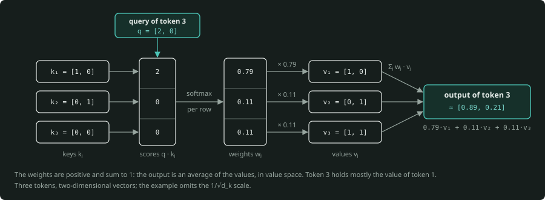
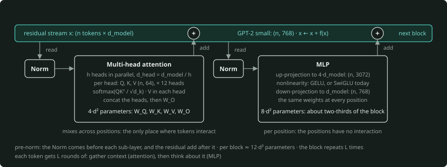
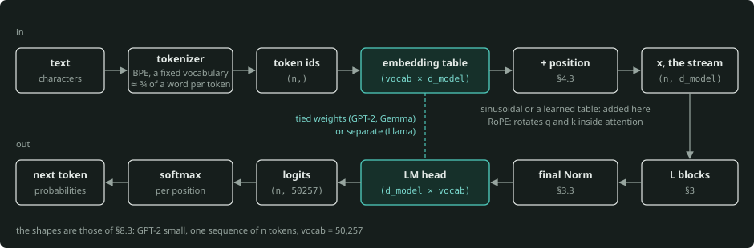
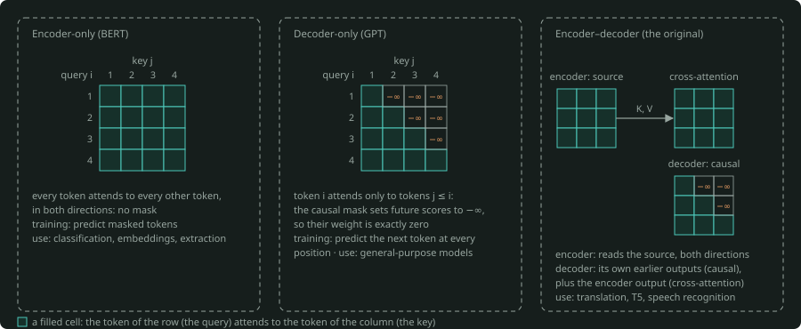
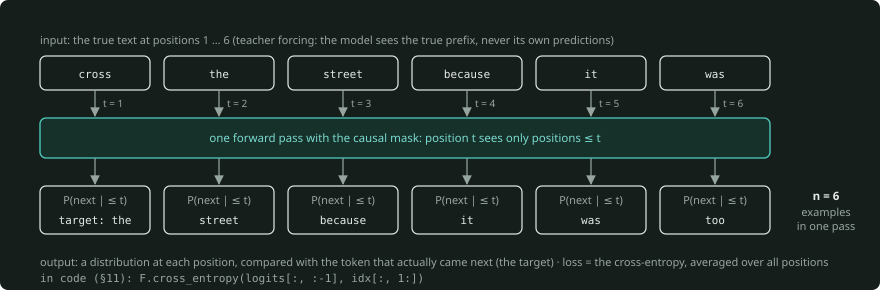
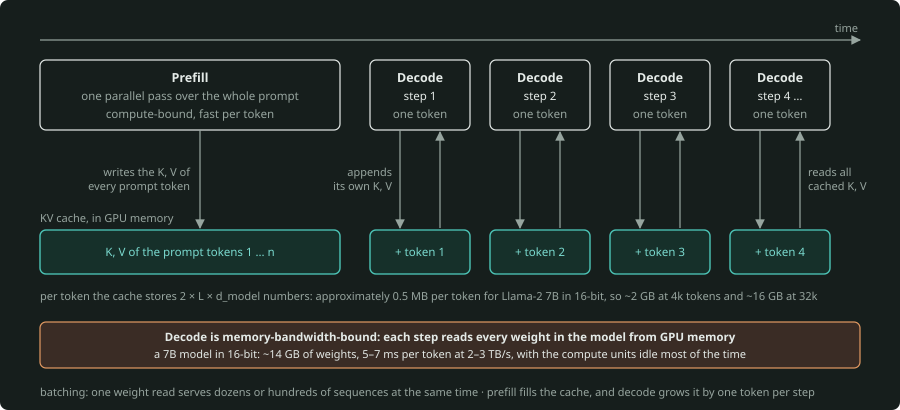

# Transformers: A Practitioner's Primer

*This primer is for readers who know what a neural network is and who trained a model or two. These readers cannot draw a Transformer from memory, or tell why its design is as it is.*

**How to read this.** Sections 1–5 build the architecture outward from one idea. Sections 6–7 are about training and inference. Most of the intuition of a practitioner is in these two sections. Section 8 and the sections after it are reference material: numbers, modern variants, intuitions that practitioners learn from hard experience, and an implementation that works. If you read only one part, read Section 3 and the mental model at its end.

---

## 1. The problem: a token's meaning depends on its context

Language, code, protein sequences and audio are all sequences of discrete symbols. What each symbol means depends on the symbols around it. The word "Bank" alone can mean more than one thing. The word "bank" three words after "river" means only one thing. The job of a sequence model is to change each symbol into a vector. That vector holds what the symbol means *here*, with all the symbols around it as context.

Until 2017, the standard answer was the recurrent network (RNN, LSTM). It reads tokens one at a time, and it moves a hidden state forward from each token to the next. This design has two problems. First, information from far back must go through many sequential updates, and it loses quality. Thus, long-range dependencies were hard to learn.

The second problem is more decisive. Step $t$ cannot start until step ${t-1}$ is complete. Thus, training cannot run in parallel across the sequence. GPUs are throughput machines, and a model that forces serial computation wastes them. Convolutions run in parallel, but each layer sees only a fixed local window.

The Transformer (Vaswani et al., 2017, "Attention Is All You Need") removed recurrence completely. Each token looks directly at every other token in one step. The model calculates every position in parallel. That is the full trick. All the other parts of the architecture are a support structure that makes it possible to train the trick at scale.

## 2. The one idea: attention is a soft lookup

### 2.1 Intuition

A dictionary lookup takes a **query** and compares it with the **keys**. Then it returns the **value** that the dictionary keeps under the key that matches. Attention is the differentiable version of this lookup. It does not return one value. It returns a weighted average of *all* values. The weight of each value is how well the query matches the key of that value.

Each token gets three vectors from its current representation, through three learned linear maps:

- **Query ($Q$):** what do I look for?
- **Key ($K$):** what do I contain, for the purpose of a match?
- **Value ($V$):** what do I give if something attends to me?

Take "it" in *"The animal didn't cross the street because it was too tired."*

For example, a useful query for "it" can encode a description such as "pronoun, needs an antecedent." The key for "animal" matches that query well. The key for "street" does not. The token "it" receives a mixture of values, with most of the weight on "animal". Its representation now holds "refers to the animal." Nobody writes this into a program. It comes out of training.

### 2.2 The formula, term by term

For $n$ tokens with the query, key and value matrices $Q$, $K$, $V$ (each is $n \times d_k$, where $d_k$ is the per-head dimension):

$$
\operatorname{Attention}(Q, K, V) = \operatorname{softmax}\left(\frac{QK^\top}{\sqrt{d_k}}\right) \cdot V
$$

- **$QK^\top$** is an $n \times n$ matrix of dot products. It gives the raw compatibility of each query with each key. Row $i$ tells how much token $i$ wants each token $j$.
- **$/\sqrt{d_k}$** prevents an increase of those dot products with the dimension. Dot products of random $d_k$-dimensional vectors have a variance proportional to $d_k$. Without the scale, the softmax saturates toward one-hot outputs, and the gradients vanish. This is a small detail, but it has a large effect in practice.
- **softmax** operates on each row. It changes each row into positive weights with a sum of 1. This makes the lookup *soft*: the result is an average, not a selection.
- **$\cdot V$** calculates the weighted average of the value vectors. The output of token $i$ is $\sum_j w_{ij} \cdot v_j$.

### 2.3 A toy calculation

This example has three tokens and two-dimensional vectors. It omits the scale to make the example easier to read. The query of token 3 is $q$ = [2, 0]. The keys are $k_1$ = [1, 0], $k_2$ = [0, 1], $k_3$ = [0, 0]. The values are $v_1$ = [1, 0], $v_2$ = [0, 1], $v_3$ = [1, 1].

$$
\begin{aligned}
\text{scores} &= [q \cdot k_1,\ q \cdot k_2,\ q \cdot k_3] = [2, 0, 0] \\
\text{weights} &= \operatorname{softmax}([2, 0, 0]) \approx [0.79, 0.11, 0.11] \\
\text{output} &= 0.79 \cdot v_1 + 0.11 \cdot v_2 + 0.11 \cdot v_3 \approx [0.89, 0.21]
\end{aligned}
$$



*The toy calculation of §2.3 as a lookup. The query of token 3 meets each key, and the dot products give the scores. The softmax changes the scores into positive weights with a sum of 1. The weighted sum of the values is the output of token 3, in value space.*

At the end, token 3 holds mostly the value of token 1, with a small part of each other value. Note two things. First, the weights are a convex combination. Thus, attention calculates an average of the values, and it does not make one value larger. Second, the output is in value space. What a token *receives* comes from $W_V$, not from the raw embedding of the token that it attends to.

### 2.4 Self-attention and cross-attention

When $Q$, $K$, $V$ all come from the same sequence, the operation is **self-attention**. The tokens give context to each other. When $Q$ comes from one sequence and $K$, $V$ come from a different sequence, the operation is **cross-attention**. Two examples are a decoder that reads the output of an encoder, and a language model that reads image features. The math is the same, and the inputs are different. Decoder-only LLMs use only self-attention.

## 3. Anatomy of a Transformer block

A Transformer is a stack of $L$ identical blocks. Each block has two sub-layers. Each sub-layer has a normalization and a residual connection around it:

```
token ids
    │
    ▼
embedding lookup (+ positional information)
    │
    ▼
x : the residual stream, shape (n tokens × d_model)
    │
    ▼
┌── one block, repeated L times ─────────────────────────────┐
│                                                            │
│   x = x + Attention(Norm(x))   ← mixes across positions    │
│   x = x + MLP(Norm(x))         ← computes per position     │
│                                                            │
└────────────────────────────────────────────────────────────┘
    │
    ▼
final Norm ──► unembed (linear) ──► softmax ──► P(next token | context)
```

The matrix that flows through the stack has the shape ($n$ tokens × $d_{\text{model}}$). The width $d_{\text{model}}$ is 768 for GPT-2 small, 4096 for a 7B-class model and 12,288 for GPT-3 175B. Each block reads this matrix and adds an update back into it.

### 3.1 Multi-head attention

One attention operation calculates one $n \times n$ pattern of relations. But a token has several kinds of relation that are useful to track at the same time:

- syntactic (what is my subject?)
- positional (what came immediately before me?)
- semantic (which earlier word means the same as me?)

Thus, a block does not use one attention with $d_{\text{model}}$-dimensional $Q$/$K$/$V$. It runs $h$ **heads** in parallel, each of dimension $d_{\text{head}} = d_{\text{model}} / h$. Then it concatenates their outputs and applies a final linear map $W_O$.

GPT-2 small has 12 heads of 64 dimensions. Llama-2 7B has 32 heads of 128. The head dimension is almost always 64 or 128. The number of heads is what increases with the model size.

**Practitioner note.** Heads add no cost. One weight matrix of shape $(d_{\text{model}}, 3 \cdot d_{\text{model}})$ makes $Q$, $K$, $V$ for all heads in a single matmul. Then a reshape divides them. Attention has $4 \cdot d_{\text{model}}^2$ parameters per block ($W_Q$, $W_K$, $W_V$, $W_O$), and this number does not change with $h$.

### 3.2 The MLP

After attention, the vector of each token goes independently through a two-layer feed-forward network. The network does three steps:

1. It expands the vector to approximately $4 \cdot d_{\text{model}}$ (or ~2.7× with modern gated variants).
2. It applies a nonlinearity (GELU, or SwiGLU today).
3. It projects the vector back down to $d_{\text{model}}$.

The weights are the same at each position. The positions have no interaction.

It is easy to forget this sub-layer, but it holds approximately two-thirds of the parameters. Interpretability work suggests that much of the factual knowledge is in it. The up-projection asks a large bank of "is pattern X present?" questions. The nonlinearity acts as a gate on them. The down-projection writes the results back into the representation of the token. A useful short form: **attention decides where to look, and the MLP decides what it means.**

### 3.3 Residual connections and normalization

Each sub-layer *adds* its output to its input, and does not replace the input: $x \leftarrow x + f(x)$. This has two results.

First, you can train deep stacks. Gradients flow directly back through the additions. Thus, a 100-block model does not get the vanishing gradients that limited deep networks before ResNets.

Second, a single **residual stream** goes through the full network. Each block reads from it and writes a small increment. This picture of one shared stream is the mental model that experienced practitioners actually use. The stream is a shared workspace, $d_{\text{model}}$ wide, in which the representation of a token builds up. Early blocks usually write syntactic and positional features, and later blocks write more abstract features. The final representation is the sum of the contributions of all blocks.

**Normalization** (LayerNorm, or now more frequently RMSNorm) scales the vector of each token to unit scale before each sub-layer. It keeps activations in a numerically comfortable range. It also makes training much less sensitive to the learning rate.

The original paper normalized *after* the residual addition ("post-norm"). Almost all designs since GPT-2 normalize *before* the sub-layer ("pre-norm"). Pre-norm trains stably at large scale without a delicate warmup. This is one of the few architectural changes since 2017 that everyone adopted.

### 3.4 The mental model

A Transformer block does exactly two things:

1. **Attention moves information between positions.** It is the only place where tokens interact. It reads from the residual streams of other tokens and writes into the stream of this token.
2. **The MLP processes information within a position.** It changes the contents of the stream of this token. It does not look at any other stream.

If you put $L$ blocks in a stack, each token gets $L$ rounds of "gather context, then think about it." That is the architecture. The rest of this document tells how sequences go in and out. It also tells what occurs when you train and run the model.



*One pre-norm block, in the view of §3.4. The residual stream goes through the block, and each sub-layer reads from it after a Norm and adds its output back. Attention mixes information across positions, and the MLP processes each position on its own. The shapes are those of GPT-2 small (§8.3).*

## 4. Getting sequences in and out

### 4.1 Tokens, not words

Models do not see characters or words. They see **tokens** from a fixed vocabulary. Usually, byte-pair encoding (BPE) builds this vocabulary. Common words are single tokens, and the tokenizer divides rare words into pieces. Vocabularies go from ~32k (Llama 2) to 128k–200k (recent models). In English, a token is approximately three-quarters of a word on average.

**Practitioner note.** Tokenization causes more of the unusual behaviors of models than you expect. Arithmetic is hard partly because the tokenizer divides numbers in ways that are not consistent. It is hard to spell words and to count letters, because the model never sees letters. Text that is not in English costs more tokens, and thus more money and context, because vocabularies favor English. When a model cannot count the r's in "strawberry", the cause is tokenization, not stupidity.

### 4.2 Embeddings

A learned table of shape $(\text{vocab} \times d_{\text{model}})$ maps each token id to its initial vector. This vector is the initial contents of the residual stream of that token. At the output, a linear map of shape $(d_{\text{model}} \times \text{vocab})$ changes the final stream into a score (logit) for each vocabulary entry. This map is the "unembedding", or LM head. Softmax changes those scores into next-token probabilities. Some models share the two matrices (GPT-2, Gemma), and the Llama family keeps them separate.



*The path in and out of the model (§4). The tokenizer makes token ids, the embedding table gives each id its first vector, and the position goes in before the blocks. At the output, the LM head changes the final stream into one logit per vocabulary entry, and the softmax gives the next-token probabilities. Some models tie the two matrices.*

### 4.3 Position: attention has no sense of order

Nothing in Sections 2 or 3 depends on the token order. Attention is a weighted average over a *set*. If you shuffle the input tokens, the outputs shuffle in the same way. A Transformer without positional information is a bag-of-words model.

Thus, the design must inject the position. There are three generations of solutions:

- **Sinusoidal encodings** (original paper): this method adds a fixed vector of sines and cosines at different frequencies to the embedding of each token. The vector is unique for each position, and similar for positions that are near.
- **Learned absolute positions** (GPT-2, BERT): an embedding table with the position as its index. This method is simple and effective, but it has no definition after the training length.
- **Rotary position embeddings, RoPE** (Su et al., 2021, and used by Llama and most current open models): this method adds nothing to the embedding. It rotates each query and key vector through an angle proportional to its position. The method sets the angles so that $q \cdot k$ depends only on the *relative* distance between the two tokens. What attention uses is "how far apart", not "where in absolute terms". When the method encodes that directly, it extrapolates better to longer contexts (with some frequency-scaling tricks).

You do not need the trigonometry of RoPE. You must know two things. First, position is a design choice, bolted on to a core that is blind to order. Second, that choice controls how well a model handles lengths that its training did not include.

## 5. Three flavors, and why one won

The original Transformer had an **encoder** and a **decoder**. The encoder reads the source sentence, and each token attends to every other token. The decoder generates the target one token at a time. It attends to the output of the encoder and to its own earlier outputs. The designers built this encoder-decoder shape for translation.

Two simplifications came after it:

- **Encoder-only** (BERT, 2018): only the encoder. Its training masks random tokens, and the model predicts them. Each token sees every other token, in the two directions. It is excellent for classification, embeddings and extraction: for anything where you have the full input and want a representation of it.
- **Decoder-only** (GPT, 2018 onward): only the self-attention of the decoder, with training to predict the next token. Each token can attend only to tokens *before* it. The **causal mask** enforces this rule. It sets the score for each future position to $-\infty$ before the softmax, so that the weight of that position is exactly zero.



*The three flavors of §5 as attention patterns. Each cell says if the token of the row attends to the token of the column. The encoder sees both directions, the decoder sees only the tokens before it, and the encoder-decoder adds cross-attention from the decoder to the encoder output.*

Decoder-only won the scaling race, and the reason is important. Next-token prediction gives a training signal at *every* position of *every* sequence. It needs no labels, and it makes no distinction between input and output. You can write any task as "here is some text; continue it." This is true for translation, summarization, classification and code. The result is one objective, one architecture and data with effectively no limit.

Encoder-decoder models stay excellent when the task has a clear structure from input to output. Examples are T5 and the systems behind most machine translation and speech recognition. For general-purpose models, decoder-only is the default.

In the rest of this primer, "Transformer" means decoder-only, unless the text says otherwise.

## 6. Training

### 6.1 The objective

Take a long sequence of tokens. At each position $t$, the model outputs a distribution over the token at ${t+1}$. The loss is the cross-entropy against the token that actually came next, averaged over all positions. Pretraining of an LLM runs this over trillions of tokens. Distillation trains on the same cross-entropy. Its target is the whole next-token distribution of a larger model, not the one-hot next token ([distillation primer §2](../../distillation/PRIMER.md#2-soft-targets-temperature-and-the-choice-of-divergence)).

The causal mask makes this efficient. Position $t$ sees only positions $\le t$. Thus, one forward pass over a sequence of length $n$ makes $n$ next-token predictions, each conditioned on exactly the correct prefix. You get $n$ training examples for the price of one pass, and the model calculates them in parallel. During training, the model always sees the true prefix and never its own predictions. This is "teacher forcing."



*Next-token training on six tokens of the sentence of §2.1 (§6.1). One forward pass with the causal mask gives a prediction at every position. The loss compares each prediction with the token that actually came next. Thus one pass gives $n$ training examples, and the model sees the true prefix at each position.*

An RNN gives the same $n$ examples, but it calculates them serially. This parallelism, more than any representational advantage, is the reason why Transformers scaled and RNNs did not.

### 6.2 What "scale" means

Three quantities set what a pretrained model can do:

- **$N$**, the parameters. Its value comes from $d_{\text{model}}$, $L$ and the vocabulary size.
- **$D$**, the training tokens.
- **$C$**, the compute. **$C \approx 6 \cdot N \cdot D$** FLOPs is a good approximation of it: 2 per parameter per token for the forward pass, and 4 for the backward pass.

Scaling laws (Kaplan et al., 2020, and Hoffmann et al., "Chinchilla", 2022) showed two things. First, the loss decreases as a smooth power law in each quantity. Second, for a fixed compute budget, there is an optimal balance. This balance is roughly 20 tokens per parameter, if the training cost is the only thing that is important to you.

In practice, the training of models now goes far past that point (Llama-3 8B on ~15 trillion tokens, nearly 2,000 per parameter). The reason is that a smaller model with longer training costs less to *serve*. Also, over the life of a model, the cost to serve it is the largest cost.

**Practitioner note.** This is why people who train large models feel that architecture debates have low stakes. The block changed in details since 2017 (Section 9), but not in kind. Nearly all the capability gain came from $N$, $D$, data quality and the training procedure. The first question about a proposed architectural change is this: does it move the scaling curve, or only the constant in front of it?

### 6.3 Post-training is not architecture

None of these behaviors is architectural: instruction following, chat behavior, refusals and tool use. They come from more training of the same network:

1. Supervised fine-tuning on curated examples.
2. Then, preference optimization (RLHF, DPO and their successors).
3. More and more, reinforcement learning on tasks with answers that you can examine for correctness.

The pretrained model is a document-continuation engine. Post-training shapes what it continues into. Keep the two separate in your mind. When you do this, much of the confusion about what a model "knows" and what it "does" goes away. The [RL and thinking-models primer](../../rl-and-thinking-models/PRIMER.md#1-from-pretraining-to-post-training) tells, in §1–4, how those post-training steps work: policy gradients, reward models and DPO, and GRPO with verifiable rewards.

## 7. Inference: where practitioner intuition matters most

### 7.1 Autoregressive decoding

At inference, the model generates one token at a time. It runs the forward pass on the prompt and samples a token from the distribution at the last position. Then it appends the token and runs again. Between calls, there is no internal state other than the tokens themselves. The memory of the model is its context window and nothing else.

### 7.2 The KV cache, and why decoding is slow

In a simple design, to generate token 1000 you run attention again over all 1000 tokens. But the model already calculated the keys and values for tokens 1–999 in the last step. Thus, you cache them. Each new token calculates only its own $Q$, $K$, $V$. Its query attends over the cached $K$ and $V$ of all the tokens before it. Its own $K$ and $V$ go into the cache.

This divides generation into two phases with large differences:

- **Prefill:** the model processes the full prompt in one parallel pass and fills the cache. This phase is compute-bound, and it is fast per token.
- **Decode:** the model makes one token per forward pass. To make a single token, each step must read *every weight in the model* from GPU memory. This is a matmul with batch size 1, and it has a terrible arithmetic intensity. Decode is **memory-bandwidth-bound**, not compute-bound.

As a concrete example, a 7B-parameter model in 16-bit precision has ~14 GB of weights. To generate one token, the GPU must move those 14 GB through the memory bus. At 2–3 TB/s, that is 5–7 ms per token for a single sequence, and the compute units are idle most of the time. Systems that serve models get efficiency back with **batching**: one weight read serves dozens or hundreds of sequences at the same time.



*Prefill and decode on a time line (§7.2). Prefill reads the whole prompt in one parallel pass and writes the K and V of every prompt token into the cache. Each decode step then makes one token. It reads all cached K and V and every weight of the model, and it appends its own K and V.*

This single fact explains most of the economics of LLM serving. It explains these things:

- why the price of output tokens is well above the price of input tokens
- why throughput increases steeply with batch size
- why quantization of weights to 8 or 4 bits makes decode faster, but does not decrease the FLOPs
- why time-to-first-token and tokens-per-second are separate metrics with separate bottlenecks
- why speculative decoding works: a forward pass over five draft tokens costs approximately the same as a pass over one. Thus, a small model can propose tokens, and the large model can verify them in a single pass.

### 7.3 The cost of context

The KV cache has a cost. For each token, it stores $2 \times L \times d_{\text{model}}$ numbers (one key vector and one value vector per layer). For Llama-2 7B in 16-bit, that is approximately 0.5 MB per token. Thus, a 4k-token conversation costs ~2 GB of GPU memory, and 32k costs ~16 GB, which is comparable to the weights themselves. That memory competes directly with the batch size. Grouped-query attention (Section 9) exists mostly to make this number smaller.

The attention compute also increases with $n^2$ in sequence length. The value of $n$ relative to $d_{\text{model}}$ decides if the quadratic term is the largest term. Take a 4096-wide model. There, the linear-in-$n$ matmuls (projections and MLP) cost more than the $n^2$ score computation. This stays true until sequences reach the tens of thousands of tokens. The limit that you meet earlier is memory: the $n \times n$ score matrix per head per layer.

FlashAttention (2022) calculates attention in tiles, and it never materializes that matrix. This is what made long contexts practical. The math did not change, but the memory-access pattern changed.

### 7.4 Decoding settings are not the model

Temperature, top-p, top-k and repetition penalties act on the output distribution *after* the architecture completes its work. Temperature divides the logits before the softmax. A lower temperature makes the distribution sharper, and a higher temperature makes it flatter. None of these settings changes what the model calculated. When the output quality changes with these settings, you changed the sampling, not the model.

## 8. Where the numbers go

### 8.1 Parameter accounting

Per block, if you do not count biases and norms (both are negligible):

| Component | Parameters |
|---|---|
| Attention: $W_Q$, $W_K$, $W_V$, $W_O$ | $4 \cdot d^2$ |
| MLP with 4× expansion: $W_{\text{up}}$, $W_{\text{down}}$ | $8 \cdot d^2$ |
| **Per block** | **$\approx 12 \cdot d^2$** |

Add the embeddings: $\text{vocab} \times d$. Double this number if the input and output embeddings are not tied.

Do a check against GPT-2 small ($d$ = 768, $L$ = 12, vocab = 50,257, tied embeddings, learned positions). The terms are 12 × 12 × 768² ≈ 85M, plus 50,257 × 768 ≈ 39M, plus 1,024 × 768 positions ≈ 0.8M. Total ≈ 124M. ✓

Llama-2 7B has $d$ = 4096 and $L$ = 32. It has a SwiGLU MLP with hidden size 11,008, and thus three matrices. It has untied embeddings and vocab = 32,000. Attention is 4 × 4096² ≈ 67M, and the MLP is 3 × 4096 × 11,008 ≈ 135M. Thus, the sum is ≈ 202M per block, × 32 ≈ 6.5B, plus 2 × 32,000 × 4096 ≈ 0.26B. Total ≈ 6.7B. ✓

To do this from a config file is a real skill. It gives you three things:

- the memory footprint (parameters × bytes per parameter)
- the inference cost ($\approx 2 \cdot N$ FLOPs per token, plus attention)
- a sense of where the capacity of a model is.

### 8.2 Reading a model config

The fields of the Hugging Face `config.json` map directly onto this primer:

| Field | Meaning |
|---|---|
| `hidden_size` | $d_{\text{model}}$, the residual stream width |
| `num_hidden_layers` | $L$, the number of blocks |
| `num_attention_heads` | $h$. Head dimension = `hidden_size` / $h$. |
| `num_key_value_heads` | K/V heads for GQA. It equals $h$ for standard attention. |
| `intermediate_size` | MLP hidden width |
| `vocab_size` | rows in the embedding table |
| `max_position_embeddings` | the context length of the training |
| `rope_theta` | RoPE base frequency. Long-context variants have larger values. |
| `tie_word_embeddings` | if the input and output embeddings share weights |

### 8.3 Shapes through one forward pass

This is GPT-2 small, with one sequence of $n$ tokens:

    token ids                     (n,)
    embeddings + positions        (n, 768)
    per head: Q, K, V             (n, 64)        × 12 heads
    per head: attention scores    (n, n)         × 12 heads
    attention output (concat)     (n, 768)
    MLP hidden                    (n, 3072)
    block output                  (n, 768)       same shape in and out, × 12 blocks
    logits                        (n, 50257)

The shape of the residual stream never changes. Each block is a function from ${(n, d)}$ to ${(n, d)}$. Thus, it is easy to put any number of blocks in a stack.

## 9. Modern variants and why each exists

You can still recognize the 2017 design in every frontier model. The changes are a set of refinements, and each refinement repairs one specific problem:

| Change | Replaces | Why |
|---|---|---|
| Pre-norm | Post-norm | Stable training at depth without fragile warmup |
| RMSNorm | LayerNorm | Same effect. It removes the mean-centering and costs less. |
| RoPE | Learned absolute positions | Relative position, better length extrapolation |
| SwiGLU / GeGLU | ReLU or GELU MLP | Gated activation gets a lower loss at equal compute. Three matrices with ~2.7× hidden width keep the parameter count equal. |
| No bias terms | Biases everywhere | Slightly more stable at scale, fewer parameters, no measurable loss |
| Grouped-query attention (GQA) | One K/V pair per head | Several query heads share one K/V head. This decreases the KV cache 4–8× at a small quality cost. Multi-query (MQA) is the extreme: one K/V for all heads |
| FlashAttention | Simple attention kernel | Identical math. It uses tiles and does not materialize the $n \times n$ matrix. It gives large gains in speed and memory. |
| Mixture of Experts (MoE) | One MLP per block | $E$ MLPs per block, and a router that sends each token to the top-$k$. The parameters increase ~$E$×, but the compute per token almost does not change. It gives more knowledge per FLOP, but it costs memory and serving complexity. [mixture-of-experts](../../mixture-of-experts/PRIMER.md) explains it in depth. |
| Sliding-window attention | Full attention in every layer | Some layers attend only to the last $w$ tokens, often interleaved with full-attention layers. This puts a limit on the cost of long inputs. |
| Latent / compressed K/V (for example, multi-head latent attention) | Standard K/V | Project $K$ and $V$ through a low-rank bottleneck. This decreases the KV cache more. |

A "Llama-style" model has pre-norm RMSNorm, RoPE, SwiGLU, GQA, no biases and a BPE tokenizer. Most open-weight models use this recipe. If you can read one of those models, you can read nearly all of them.

**Beyond text.** The same block handles images. It cuts an image into patches and flattens each patch into a vector. Then it uses the patches as tokens (Vision Transformer, 2020). Audio, video and protein sequences work in the same way. Most multimodal LLMs attach an encoder to a text model, and feed the outputs of the encoder in as extra tokens.

The property that defines the Transformer is not that it understands language. The property is that it is a general-purpose, parallelizable set-to-set function that scales. It can model anything that you can tokenize.

## 10. Intuitions practitioners learn the hard way

**Attention weights are not explanations.** They are the coefficients of a mixture in one head of one layer. If a head attends strongly to a token, this does not mean that the model is "reasoning about" that token. Also, heads with diffuse patterns can be more important than sharp ones. Use attention maps as a diagnostic, not as a rationale.

**The model is stateless.** Each call is a new forward pass over the contents of the context. The model has no memory across calls, and it does not learn at inference time. The KV cache is a cache of computation, not a memory system. Anything that you want the model to use at inference time must be in the weights or in the context window.

**Depth is a fixed compute budget per token.** With $L$ blocks, each token gets exactly $L$ sequential steps of computation, and the difficulty of the question does not change this. This is why chain-of-thought helps. When the model writes intermediate tokens, it can spend more forward passes, and more attention over its own scratch work, on one problem. "Thinking" models make the same move a standard part of the method.

A model can fail a task in one step that it can do in ten. In that case, the limit is often this fixed depth, not a lack of knowledge.

**In-context learning is a learned circuit, not a magic property.** The best-studied example is the *induction head*. An induction head is a pair of attention heads that together implement "find the last time this token appeared and copy what followed it". It comes out early in training. It explains much of the ability of a model to learn patterns from a few examples in the prompt.

The architecture does not contain this circuit, but training finds it. Much of what looks like reasoning is a stack of learned circuits like this one.

**Long context is neither free nor fully used.** If you double the window, the KV memory doubles and the attention cost increases. Also, models do not attend to all of the window equally. They often give more weight to the start and the end ("lost in the middle"). A 128k window is a capacity, not a promise that 128k tokens carry equal weight.

**Tokens are the unit of everything.** Cost, context, latency and a complete class of failure modes all have tokens as their unit. Learn to think in tokens.

**The architecture is rarely the interesting variable.** In most applied work, data, post-training, prompts, retrieval and the decoding strategy have the largest effect on the outcomes. Knowledge of the architecture is important because it tells you what is *possible* and what things *cost*, not because you will change it.

## 11. A working implementation

This is the architecture of GPT-2 in about fifty lines of PyTorch, without dropout and initialization details. It runs. If you read it once, slowly, you learn more than if you read this primer twice.

```python
import torch, torch.nn as nn, torch.nn.functional as F

class Attention(nn.Module):
    def __init__(self, d, n_heads):
        super().__init__()
        self.h, self.dh = n_heads, d // n_heads
        self.qkv = nn.Linear(d, 3 * d, bias=False)   # W_q, W_k, W_v fused into one matmul
        self.out = nn.Linear(d, d, bias=False)        # W_o

    def forward(self, x):                             # x: (B, T, d)
        B, T, d = x.shape
        q, k, v = self.qkv(x).split(d, dim=-1)
        # (B, T, d) -> (B, h, T, dh): each head gets a slice of the features
        q, k, v = (t.view(B, T, self.h, self.dh).transpose(1, 2) for t in (q, k, v))
        scores = q @ k.transpose(-2, -1) / self.dh ** 0.5           # (B, h, T, T)
        mask = torch.tril(torch.ones(T, T, dtype=torch.bool, device=x.device))
        scores = scores.masked_fill(~mask, float("-inf"))           # causal: no looking ahead
        w = F.softmax(scores, dim=-1)
        y = (w @ v).transpose(1, 2).reshape(B, T, d)                # concatenate heads
        return self.out(y)

class MLP(nn.Module):
    def __init__(self, d):
        super().__init__()
        self.up, self.down = nn.Linear(d, 4 * d), nn.Linear(4 * d, d)

    def forward(self, x):
        return self.down(F.gelu(self.up(x)))

class Block(nn.Module):
    def __init__(self, d, n_heads):
        super().__init__()
        self.ln1, self.ln2 = nn.LayerNorm(d), nn.LayerNorm(d)
        self.attn, self.mlp = Attention(d, n_heads), MLP(d)

    def forward(self, x):
        x = x + self.attn(self.ln1(x))    # pre-norm, then residual add
        x = x + self.mlp(self.ln2(x))
        return x

class GPT(nn.Module):
    def __init__(self, vocab, d=768, n_layers=12, n_heads=12, max_len=1024):
        super().__init__()
        self.tok = nn.Embedding(vocab, d)
        self.pos = nn.Embedding(max_len, d)
        self.blocks = nn.ModuleList(Block(d, n_heads) for _ in range(n_layers))
        self.ln_f = nn.LayerNorm(d)
        self.head = nn.Linear(d, vocab, bias=False)
        self.head.weight = self.tok.weight    # weight tying

    def forward(self, idx):                   # idx: (B, T) token ids
        T = idx.shape[1]
        x = self.tok(idx) + self.pos(torch.arange(T, device=idx.device))
        for blk in self.blocks:
            x = blk(x)
        return self.head(self.ln_f(x))        # logits: (B, T, vocab)
```

`GPT(vocab=50257)` has 124.4M parameters. This is GPT-2 small. Training is one more line. For a batch of token ids `idx` of shape (B, T):

```python
logits = model(idx)
loss = F.cross_entropy(logits[:, :-1].reshape(-1, logits.size(-1)),
                       idx[:, 1:].reshape(-1))
```

The loss compares the prediction of each position with the token that actually came next. Note one practical detail. With the default initialization of PyTorch, the initial loss is far above $\ln(\text{vocab}) \approx 10.8$. GPT-2 initializes weights with standard deviation 0.02, and this brings the initial loss to roughly that value. At the start, a well-initialized language model predicts a near-uniform distribution. An initial loss far from $\ln(\text{vocab})$ is a common early signal of a bug.

Replace `nn.LayerNorm` with RMSNorm, the position table with RoPE and the MLP with SwiGLU. Then share K/V across groups of heads. The result is a modern open-weight model.

## 12. Glossary

- **Residual stream**: the $(n \times d_{\text{model}})$ matrix that flows through the network. Each block adds to it.
- **Head**: one independent attention pattern. A block runs $h$ of them in parallel.
- **Causal mask**: position $t$ attends only to positions $\le t$. This makes next-token training parallel and generation consistent.
- **Logits**: raw, pre-softmax scores over the vocabulary.
- **KV cache**: the stored keys and values from earlier positions. With it, decode does not calculate them again.
- **Prefill / decode**: the parallel phase that processes the prompt, and the generation phase that makes one token at a time.
- **Context window**: the maximum sequence length that the training prepared the model to handle.
- **Pretraining / post-training**: next-token prediction on raw text, then fine-tuning to shape behavior.
- **GQA / MQA**: attention variants that share key/value heads to make the KV cache smaller.
- **MoE**: mixture of experts. A block has several MLPs, and a router selects a few of them for each token.
- **RoPE**: rotary position embedding. It encodes relative position with a rotation of $Q$ and $K$.

## 13. Further reading, in order

1. Jay Alammar, *The Illustrated Transformer*: the standard visual walkthrough.
2. Andrej Karpathy, *Let's build GPT: from scratch, in code, spelled out* (video) and the `nanoGPT` repository: Section 11, expanded into a full training run.
3. Vaswani et al., *Attention Is All You Need* (2017): short, and easy to read after you have the picture.
4. Harvard NLP, *The Annotated Transformer*: the paper as executable code.
5. Hoffmann et al., *Training Compute-Optimal Large Language Models* (Chinchilla, 2022): the scaling intuitions in Section 6.
6. Dao et al., *FlashAttention* (2022): why memory access, not FLOPs, controls the attention cost.
7. Olsson et al., *In-context Learning and Induction Heads* (2022): what a learned circuit looks like in detail.
8. Touvron et al., *Llama 2* (2023): a complete, documented modern recipe.
