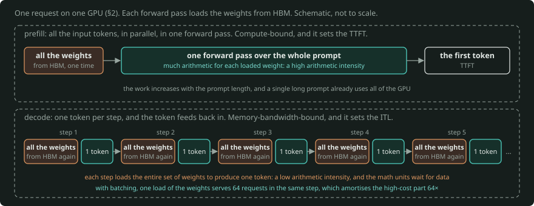
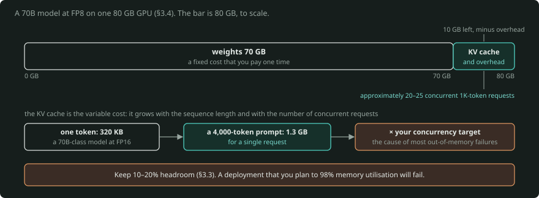
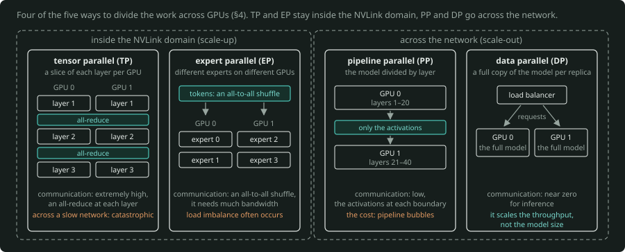
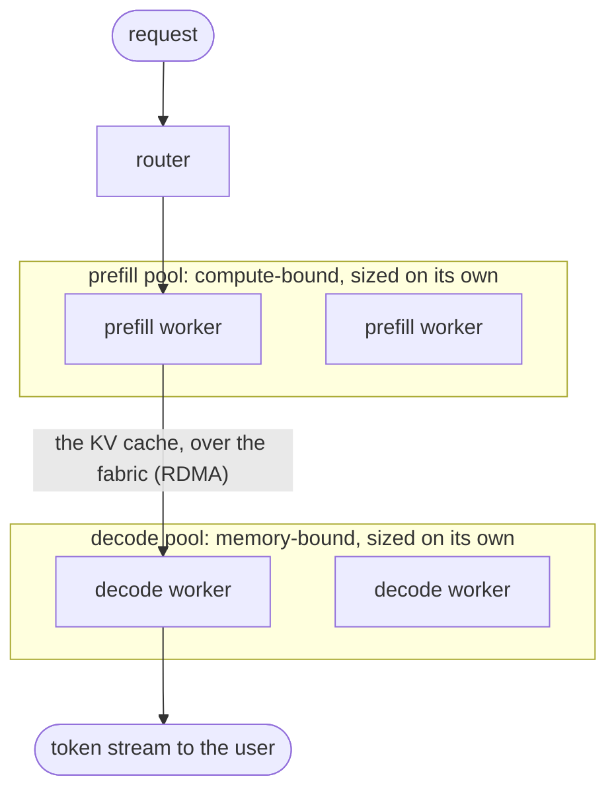

# GPU Deployment Architecture for LLM Scale-Up

**A primer for people who understand models but not the machines that the models run on.**

*Written August 2026. The hardware details change fast. The physics and the mental models do not change.*

---

## 0. First, a terminology trap

The term "scale-up" has two meanings. In this field, the two meanings come into conflict all the time.

**In everyday use**, it means "make the deployment bigger": serve more users and run larger models.

**Technically**, in GPU infrastructure, scale-up has an exact definition. It is the opposite of scale-out:

- **Scale-up network**: the fabric that connects GPUs *inside* one tightly-coupled domain (one server, or one rack). The NVIDIA version is NVLink/NVSwitch. It operates like memory. A GPU can read the memory of another GPU almost as if that memory is local.
- **Scale-out network**: the fabric that connects the *domains* to each other across the data centre. It is InfiniBand or RDMA-over-Ethernet. It operates like a network. You send messages. Each GPU gets about 9× less bandwidth per direction than over NVLink (§5), and the latency is higher.

Almost every architecture decision in this document is an answer to one question: **which side of that boundary does this piece of work live on?**

The standard pattern is: scale up first, then scale out. Build the largest tightly-coupled domain that you can. Then replicate it.

---

## 1. Why GPUs at all

Most of an LLM forward pass is a long sequence of large matrix multiplications. Each output element is independent of the other elements. Thus the work is embarrassingly parallel.

A CPU has tens of powerful, general-purpose cores. A GPU has thousands of simple cores, and also dedicated matrix-multiply hardware. NVIDIA calls these units *Tensor Cores*. For this specific shape of work, a GPU is 10–100× faster.

But usually the raw arithmetic is not the bottleneck. When you serve an LLM, **memory** is the thing that actually limits the performance. Two properties of memory set the limit: how much memory you have and how fast you can read it.

Modern accelerators use **HBM** (High Bandwidth Memory). HBM is a set of DRAM stacks on the same package as the compute die. An extremely wide bus connects the stacks to the die. HBM is the reason for the cost of a data centre GPU. At this time, the HBM supply is also the binding constraint on the whole industry.

---

## 2. The single most important mental model: prefill vs decode

The generation of a response has two phases with **opposite** hardware characteristics. If you learn this fully, most deployment decisions become obvious.



*Prefill (top) reads all the input tokens in one forward pass, and it uses each loaded weight for much arithmetic: compute-bound. Decode (bottom) loads the entire set of weights from HBM at each step to produce one token: memory-bandwidth-bound. With batching, the same loaded weights serve 64 requests in one step, which amortises the high-cost part 64× (§2).*

### Prefill (processing the prompt)

The model reads all input tokens at the same time, in parallel, in a single forward pass. The model uses each weight that it loads for much arithmetic.

- **Compute-bound.** The math units of the GPU set the limit.
- The work increases with the prompt length.
- Prefill sets the **TTFT** (time to first token).
- Large batches do not help much. A single long prompt already uses all of the GPU.

### Decode (generating tokens)

The model generates one token. Then it feeds that token back in and generates the next token. Each step must load *the entire set of model weights* from HBM to produce *one token*.

- **Memory-bandwidth-bound.** The math units are idle most of the time. They wait for data.
- Decode sets the **ITL** (inter-token latency). Users see the ITL as the speed of the generation.
- Batching gives an extremely large improvement. If you load the weights one time and use them for 64 requests at the same time, you amortise the high-cost part 64×.

### Why this matters

These two phases need different things from the hardware and different things from a scheduler. If they run on the same GPU, they interfere. A long prefill blocks decode steps, and the output stutters. This conflict is the reason for most of the interesting architecture in section 8.

A useful shorthand here is **arithmetic intensity**: the ratio of the FLOPs done to the bytes moved. Prefill has a high arithmetic intensity. Decode has an extremely low arithmetic intensity. Almost every optimisation for the inference of an LLM is an attempt to increase the arithmetic intensity of decode.

---

## 3. Sizing: does the model fit?

Three things use GPU memory.

### 3.1 Weights

$$
\text{weight memory} = \text{parameters} \times \text{bytes per parameter}
$$

| Precision | Bytes/param | 70B model | 405B model |
|---|---|---|---|
| FP32 | 4 | 280 GB | 1.6 TB |
| FP16 / BF16 | 2 | 140 GB | 810 GB |
| FP8 | 1 | 70 GB | 405 GB |
| FP4 / INT4 | 0.5 | 35 GB | 203 GB |

**The general rule: at BF16, a model needs approximately 2 GB per billion parameters only for the weights.**

Quantisation (the use of a lower precision) is the single largest lever that you have. Current-generation hardware has native FP4 support. This is why 4-bit inference changed from a research curiosity to the production default.

### 3.2 KV cache

During decode, the model caches the key and value vectors for each token that it already saw. Thus it does not recompute them at each step. This cache increases linearly with the sequence length **and** with the number of concurrent requests.

$$
\text{KV bytes per token} = \text{layers} \times \text{kv_heads} \times \text{head_dim} \times 2\ (K \text{ and } V) \times \text{bytes_per_element}
$$

A worked example, for approximately a 70B-class model at FP16:

$$
80\ \text{layers} \times 8\ \text{KV heads} \times 128\ \text{dims} \times 2 \times 2\ \text{bytes} \approx 320\ \text{KB per token}
$$

Thus a 4,000-token prompt costs about **1.3 GB of KV cache for a single request**. Multiply this value by your concurrency target.

This is the number that surprises people. The weights are a fixed cost that you pay one time. **KV cache is the variable cost that sets how many users you can actually serve.** It is also the cause of most out-of-memory failures in production.

The levers on KV cache are: grouped-query or multi-query attention (fewer KV heads), FP8 KV cache (it halves the cache), paged allocation, and prefix caching.

### 3.3 Everything else

Activations, CUDA graphs, communication buffers, fragmentation and the framework itself also use memory. **Keep 10–20% headroom.** A deployment that you plan to 98% memory utilisation will fail.

### 3.4 Putting it together

Think about a 70B model at FP8 on one 80 GB GPU. The 70 GB of weights leaves 10 GB, minus overhead, for KV cache. That is approximately 20–25 concurrent 1K-token requests. This is satisfactory for a demo, but not for production. This is the reason that you find that you need multiple GPUs, even when the model technically "fits".



*The bar is one 80 GB GPU with a 70B model at FP8 (§3.4). The weights take 70 GB, and the 10 GB that stay, minus overhead, hold the KV cache for approximately 20–25 concurrent 1K-token requests. The strip below is the variable cost. A 70B-class model at FP16 needs 320 KB of KV cache per token, about 1.3 GB for a 4,000-token request, multiplied by your concurrency target.*

---

## 4. When one GPU isn't enough: the parallelism menu

There are five ways to divide work across GPUs. You can combine them. Actual deployments use two or three at the same time.



*Tensor parallelism gives each GPU a slice of each layer, with an all-reduce at each layer. Expert parallelism puts the experts on different GPUs, with an all-to-all shuffle of the tokens. Both stay inside the NVLink domain. Pipeline parallelism passes only the activations at each boundary, and data parallelism gives each replica a full copy, so both go across the network (§4).*

### Tensor parallelism (TP)
Divide the matrices of each individual layer across GPUs. Each GPU holds a slice of each layer.

- **Communication: extremely high.** The GPUs must synchronise (all-reduce) at each layer, many times per token.
- **Thus: only inside the scale-up domain.** TP across a slow network is catastrophic.
- Use TP when the model does not fit on one GPU, or to decrease latency.

### Pipeline parallelism (PP)
Divide the model by layer. GPU 0 holds layers 1–20, GPU 1 holds layers 21–40, and so on.

- **Communication: low.** The GPUs pass only the activations at each boundary.
- **Thus: satisfactory across the scale-out network.**
- The cost is "pipeline bubbles": GPUs are idle while they wait for the previous stage. To decrease this cost, divide the batches into micro-batches.

### Data parallelism (DP) / replication
Put a full copy of the model on each GPU or group. Use a load balancer to divide the requests across the replicas.

- **Communication: near zero for inference.** For training, the GPUs must do an all-reduce of the gradients. This all-reduce is the dominant traffic in a training cluster.
- DP scales the throughput, not the model size. This is your horizontal autoscaling axis.

### Expert parallelism (EP)
For Mixture-of-Experts models, put different experts on different GPUs and route the tokens to them. The communication is an all-to-all shuffle. This shuffle needs much bandwidth, and load imbalance often occurs in it. MoE is now standard for frontier models. Thus EP is more important now than it was before.

### Sequence / context parallelism
Divide a single long sequence across GPUs. This is necessary for extremely long context windows, where the KV cache for one request is too large for one GPU.

### The rule that follows from all of this

> **Tensor and expert parallelism go inside the NVLink domain. Pipeline and data parallelism go across the network.**

The interconnect hierarchy sets how you partition the work. The partition of the work does not set the hierarchy.

---

## 5. The interconnect hierarchy

This is the actual "architecture" in GPU deployment architecture. These are order-of-magnitude numbers for the current generation:

| Link | Where | Rough bandwidth |
|---|---|---|
| HBM (on-package memory) | Between the GPU and its own memory | 3.4 TB/s (H100), then 8 TB/s (Blackwell), then 22 TB/s (Rubin) |
| **NVLink / NVSwitch** (scale-up) | Between two GPUs in the same node/rack | 900 GB/s (H100), then 1.8 TB/s (Blackwell), then 3.6 TB/s (Rubin). These are bidirectional totals: half in each direction. |
| PCIe Gen5 ×16 | Between the GPU and the CPU/NIC | ~64 GB/s |
| **InfiniBand / RoCE** (scale-out) | Between two nodes | ~50–100 GB/s per NIC per direction (400–800 Gb/s) |
| Storage / general Ethernet | Between the cluster and the storage | ~1–12 GB/s |

Note the cliff. Compare like with like. The vendor markets the NVLink figures as the sum of the two directions, but the NIC figures are per direction.

Per direction and in one generation, the NVLink of a GPU carries about **9×** the bandwidth of its NIC. For H100 with a 400 Gb/s NIC, the figures are 450 against 50 GB/s. For Blackwell with an 800 Gb/s NIC, they are 900 against 100 GB/s. The [roofline primer's link ladder, §5.1](../roofline-and-fabric/PRIMER.md#51-the-link-ladder), calculates these figures in `roofline.fabric.LINKS`.

If you divide a bidirectional NVLink total by a one-way NIC rate, you get 18×. That value counts NVLink two times. The latency is also different: a hop through NVSwitch costs less than a hop through a NIC and a network switch.


*Per direction and in one generation, the NVLink of a GPU carries about 9× the bandwidth of its NIC. The figures are 450 against 50 GB/s for an H100 (400 Gb/s NIC) and 900 against 100 GB/s for Blackwell (800 Gb/s NIC). The vendor markets the NVLink figures as the sum of the two directions. A division of that total by the one-way NIC rate gives 18×, and it counts NVLink two times (§5).*

There are two practical consequences:

1. **Never let a tightly-coupled collective operation cross the cliff.** A tensor-parallel all-reduce across nodes will destroy your throughput.
2. **The size of the scale-up domain is the single most important property of your hardware platform.** An 8-GPU server gives you an 8-GPU domain. A rack-scale system gives you 72.

---

## 6. The rack is the new unit of deployment

The most significant recent change is this: the *rack*, not the server, is now the atomic unit for large deployments.

The NVIDIA NVL72 systems put 72 GPUs into a single NVLink domain in one liquid-cooled cabinet. Thus you can use all 72 as one large pool of memory for tensor parallelism. This is what makes it practical to serve a 671B-parameter MoE model with low latency.

The current landscape as of mid-2026:

- **Hopper (H100 80 GB, H200 141 GB)**: still in use everywhere. It is still the price/performance workhorse for most enterprise workloads.
- **Blackwell Ultra (B300 / GB300 NVL72)**: 288 GB HBM3e at 8 TB/s, ~1,400 W per GPU. It is the volume production part.
- **Vera Rubin (R100 / VR200)**: it went into production in June 2026, and it is available from OEMs and clouds in H2 2026 (verify). It has 288 GB of HBM4 at 22 TB/s, and NVLink 6 at 3.6 TB/s per GPU. The TSMC 3nm supply and the HBM4 supply limit its availability.
- **AMD**: MI300X/MI325X are mature in production. At this time, the production volume of MI400/MI450 increases. AMD is credible, especially on memory capacity per GPU. ROCm is the software risk.
- **Custom silicon**: Google TPU, AWS Trainium/Inferentia, Microsoft Maia, Meta MTIA. The volumes are large, and most of this silicon is captive to internal hyperscaler workloads.

### The facilities constraint nobody plans for

Power density increased from ~10 kW/rack for conventional compute to 40 kW+ for Blackwell. Rubin-class racks need 100% direct-to-chip liquid cooling, with no air-cooled option. If you operate your own data centre, cooling and power delivery will control your schedule. GPU procurement will not. The lead times for allocation are 6–12 months.

For most teams, this is a reason to use cloud or neocloud capacity, not owned infrastructure. But this reason does not apply if you have a sustained utilisation above approximately 60–70%.

---

## 7. The software stack, layer by layer

```
┌─────────────────────────────────────────┐
│  Application / agent framework          │
├─────────────────────────────────────────┤
│  Gateway: auth, rate limits, routing,   │
│  quotas, observability, cost accounting │
├─────────────────────────────────────────┤
│  Orchestrator: Dynamo, llm-d, Ray Serve │
│  (routing, autoscaling, disaggregation) │
├─────────────────────────────────────────┤
│  Inference engine: vLLM / SGLang /      │
│  TensorRT-LLM                           │
├─────────────────────────────────────────┤
│  Kubernetes + GPU Operator + scheduler  │
├─────────────────────────────────────────┤
│  Container runtime, NCCL, CUDA, driver  │
├─────────────────────────────────────────┤
│  GPUs, NVLink, NICs, storage, cooling   │
└─────────────────────────────────────────┘
```

### The inference engine is where most of the value lives

Do not write your own loop to serve the model. The engines implement a set of techniques. Together, these techniques give 10–20× over a simple `model.generate()`:

- **Continuous batching**: do not wait for a whole batch to finish. At each step, evict the completed sequences and admit new ones. This keeps the GPU busy. It is the largest single win.
- **PagedAttention**: allocate the KV cache in fixed-size blocks, as OS virtual memory does. Do not make one contiguous reservation per request. This removes fragmentation. Typically, it gives 2–4× more concurrent requests from the same memory.
- **Prefix caching**: use the KV cache again for shared prefixes. If 10,000 requests share a 2,000-token system prompt, you compute that prompt one time. The gain is extremely large for agentic workloads with long, stable system prompts.
- **Chunked prefill**: divide long prefills into chunks, and interleave the chunks with decode steps. Thus one long prompt does not block the token streams of all the other users.
- **Speculative decoding**: a small draft model proposes several tokens. Then the large model verifies them in one pass. This uses spare compute to get a lower latency. It works because decode is memory-bound and has spare compute.
- **Quantisation**: FP8 or FP4 weights and KV cache.

Which engine to select: **vLLM** is the default open-source choice, with the broadest model coverage. **SGLang** is strong on structured output and on prefix-heavy workloads. Its RadixAttention prefix cache is excellent. **TensorRT-LLM** gives the best raw performance on NVIDIA hardware. The cost is a compilation step and less flexibility.

### Kubernetes specifics

For a scheduler, GPUs are not like CPUs. GPUs are indivisible, high-cost and topology-sensitive.

- **NVIDIA GPU Operator** controls the drivers, the device plugin and monitoring as one managed lifecycle.
- **Topology awareness matters.** A pod that requests 8 GPUs must get 8 GPUs on the same NVLink domain, not 8 GPUs spread across a cluster.
- **Gang scheduling**: a distributed job needs all of its workers or none of them. A partial allocation causes a deadlock in the cluster.
- **Node pools by GPU type**, with taints and tolerations: they keep batch jobs off latency-critical inference nodes.
- **The time to load the model is a real bottleneck.** A 405B model checkpoint is hundreds of GB. If you do not plan for fast storage, caching or pre-warmed replicas, cold-start times of 10+ minutes will destroy your autoscaling story.

---

## 8. Prefill/decode disaggregation

This is the current frontier of architecture. It is a direct consequence of section 2.

You do not run the two phases on the same GPUs. You run **separate pools**: prefill workers and decode workers. When prefill finishes, the system transfers the KV cache over the fabric to a decode worker. The decode worker starts to generate tokens immediately.



*The router sends a request to a prefill worker, which processes the whole prompt in one pass. When prefill finishes, the system transfers the KV cache over the fabric to a decode worker, and the decode worker starts to generate tokens immediately. For a 4K-token request, the transfer is about 1.3 GB and must complete in a couple hundred milliseconds for a TTFT under 500 ms (§8).*

**Why it helps:**

- You can size, adjust and parallelise each pool independently.
- Decode never interrupts the prefill workers. Thus TTFT decreases sharply.
- Long prefills never block the decode workers. Thus the token streams stay smooth.
- You can even use different hardware for each phase.

**Why it is hard:** you must move the KV cache sufficiently fast that the decode worker is not idle. Think about a request of 4K tokens with approximately 1.3 GB of KV cache, and a TTFT budget under 500 ms. For this request, the transfer must complete in a couple hundred milliseconds. This needs RDMA and careful design work.

**Tools:** NVIDIA **Dynamo** is an orchestration layer above the engines. It has a smart router, a planner, and NIXL for transfers. Its Kubernetes-native equivalent, built on vLLM, is **llm-d** (Red Hat/IBM/Google, donated to CNCF in March 2026). Both vLLM and SGLang support disaggregation directly.

**The order of the work:** first, make continuous batching, paged attention, prefix caching and FP8 KV cache work. These are the largest wins for most workloads. The sensible next step is same-node disaggregation across NVLink. Multi-node disaggregation is worth the effort at scale, and mostly not before.

---

## 9. Training clusters vs inference clusters

Training clusters and inference clusters have greatly different shapes. If you confuse the two, you make high-cost mistakes.

| | Training | Inference |
|---|---|---|
| Coupling | One synchronous job across all GPUs | Many independent replicas |
| Failure impact | One failed GPU stops everything | One failed replica sheds some traffic |
| Network | All-reduce is the dominant traffic. It needs a full-bisection fabric. | Mostly north-south traffic, modest east-west traffic |
| Storage | Extremely large checkpoints, high write bandwidth | Mostly reads, when the replicas load the model |
| Unit of scale | The whole cluster | The replica |
| Key metric | MFU (Model FLOPs Utilisation) | Tokens/sec/GPU, $/M tokens, latency SLOs |
| Elasticity | Poor. The allocation does not change for weeks. | Good. It autoscales on queue depth. |

Training needs checkpoints and fault tolerance as first-class concerns, because at 10,000 GPUs something fails constantly. Inference needs the opposite: fast, independent, low-cost replicas.

---

## 10. The numbers to hold yourself to

**Latency**

- **TTFT**: time to first token. Prefill and the wait in the queue are the largest parts of it. The target is under ~500 ms for interactive use.
- **ITL / TPOT**: inter-token latency. Decode is the largest part of it. Under ~50 ms, the output seems faster than the speed at which people read.
- Always report **p50, p95 and p99**. Averages hide everything that is important.

**Throughput**

- Output tokens/sec/GPU is the honest efficiency number.
- **Goodput**: the requests/sec that actually met their SLO. It is better than raw throughput, because a throughput that you measure with a 10-second TTFT is a lie.

**Efficiency**

- **MFU**: the fraction of the theoretical FLOPs that you get. 40–50% is good for training. Inference decode is memory-bound, so MFU is naturally low. Measure the bandwidth utilisation instead.
- **$/million tokens**: the number that your finance team cares about. It is also the honest basis for build-vs-buy.

**The tradeoff you cannot escape:** larger batches increase throughput and decrease the cost per token, but they increase latency. No configuration optimises both. Select your SLO first. Then maximise the throughput within the limit of that SLO.

---

## 11. Three reference architectures

### A. Single node (1–8 GPUs)
This architecture is one 8×H100/H200 server. The model fits with tensor parallelism inside the node. The stack is vLLM, one process and a load balancer in front. It is good up to approximately tens of requests/sec.
*Use it for: most enterprise deployments, 7B–70B models, internal tools.*

### B. Kubernetes cluster (tens to hundreds of GPUs)
This architecture has multiple nodes and GPU Operator, with TP in the nodes and DP across them. It autoscales horizontally on queue depth. Prefix caching is on. It has separate node pools per model and per workload class. A gateway does the routing, the quotas and the per-tenant cost accounting.
*Use it for: multi-tenant platforms, several models, production SLOs.*

### C. Rack-scale disaggregated (hundreds to thousands of GPUs)
This architecture uses NVL72-class systems. It has disaggregated prefill and decode pools through Dynamo or llm-d. The workers share a distributed KV cache pool. It uses FP4 quantisation and topology-aware scheduling. It is multi-region for availability.
*Use it for: frontier-scale MoE models that you serve, or inference at genuine platform volume.*

For most organisations, the correct start is A. Most of them are incorrect when they think that they need C.

---

## 12. Failure modes to design against

- **KV cache OOM under load.** The deployment works in a test at concurrency 10 and fails at 100. The cause: the capacity plan used only the weights. The solution: plan on KV cache, set an explicit cap on max concurrency, and turn on paged attention.
- **Tensor parallelism across the scale-out fabric.** Someone sets TP=16 on 2×8-GPU nodes. The throughput collapses. The solution: TP in the NVLink domain, PP or DP across it.
- **Cold-start latency.** If autoscaling takes 12 minutes to load a checkpoint, it is not autoscaling. The solution: pre-warmed replicas, fast local storage, tiered scaling.
- **Long prefills that block decode.** When someone submits a 100K-token document, users see output that stutters. The solution: chunked prefill, then disaggregation.
- **Fragmentation.** Memory is "free", but allocations fail. The solution: paged KV cache.
- **NCCL hangs.** A distributed job stops and gives no signal. The cause is usually topology, MTU, or driver mismatch. The solution: pin the driver/CUDA/NCCL/engine versions together. Do a test of the collective path before the model.
- **Version drift.** The disaggregation and scheduling APIs still change fast. Pin everything. Upgrade deliberately.
- **A plan for GPUs that you cannot get.** The allocation lead times are 6–12 months for current-generation hardware. Design for the hardware that you can actually procure.

---

## 13. Glossary

| Term | Definition |
|---|---|
| **HBM** | High Bandwidth Memory: the on-package memory of the GPU. Capacity and bandwidth both matter. |
| **NVLink / NVSwitch** | The NVIDIA scale-up interconnect. GPU-to-GPU in a node or rack. |
| **InfiniBand / RoCE** | Scale-out fabrics. Node-to-node, RDMA-based. |
| **RDMA** | Remote Direct Memory Access. Network transfers that bypass the CPU. |
| **NCCL** | The NVIDIA collective communications library. All-reduce, all-gather and other collectives. |
| **KV cache** | The cached attention keys/values for the previous tokens. The dominant variable memory cost. |
| **Prefill / decode** | Prefill processes the prompt (compute-bound). Decode generates the tokens (memory-bound). |
| **TP / PP / DP / EP** | Tensor / pipeline / data / expert parallelism. |
| **TTFT / ITL** | Time to first token / inter-token latency. |
| **MFU** | Model FLOPs Utilisation: the achieved value against the theoretical peak. |
| **Continuous batching** | The admission and the eviction of requests at each decode step. |
| **PagedAttention** | Block-based KV cache allocation, borrowed from OS virtual memory. |
| **Quantisation** | The use of a lower precision (FP8, FP4, INT4) for weights/activations. |
| **MoE** | Mixture of Experts. Only some parameters activate per token. |
| **Disaggregation** | The separation of prefill and decode onto different GPU pools. |
| **MIG** | Multi-Instance GPU: the partition of one GPU into isolated slices. |

---

## 14. Where to go next

**Do these in order:**

1. Run vLLM on a single GPU with a 7B model. Monitor `nvidia-smi`. Change the batch size. Then look at the throughput/latency curve yourself.
2. Do the memory arithmetic by hand for a model that is important to you. Then compare it with what the engine actually allocates.
3. Do a benchmark with a realistic request distribution, not a uniform distribution. Your prompt-length distribution controls everything.
4. Only after these steps, use a multi-node deployment. Only after that, use disaggregation.

**Documents to read:**

- vLLM docs and the PagedAttention paper (Kwon et al., 2023)
- Sarathi-Serve on chunked prefill (Agrawal et al., 2024)
- DistServe and Splitwise on disaggregation (2024)
- NVIDIA Dynamo and llm-d documentation
- NVIDIA's own material on scale-up networks, for the interconnect view

**Sources consulted for the 2026 hardware and stack picture:**

- https://ai-infrastructure.net/nvidia-gpu-roadmap/
- https://vrlatech.com/nvidia-gpu-roadmap-2026-2030/
- https://developer.nvidia.com/blog/nvidia-nvlink-the-scale-up-network-for-ai-factories/
- https://www.naddod.com/blog/scale-up-vs-scale-out-in-ai-infrastructure
- https://llm-d.ai/docs/architecture/advanced/disaggregation
- https://blog.prompt20.com/posts/disaggregated-inference/
- https://www.arccompute.io/resources/arc-blog/beyond-blackwell-preparing-enterprise-data-centers-for-the-nvidia-rubin-architecture-and-the-hbm-crunch

---

## The five things to remember

1. **Decode is memory-bandwidth-bound, prefill is compute-bound.** Almost every design decision comes from this.
2. **KV cache, not weights, sets how many users you can serve.**
3. **Tensor parallelism inside the NVLink domain, pipeline and data parallelism across the network.** The interconnect hierarchy sets the partition of the work.
4. **Use an inference engine that is already available.** Continuous batching, paged attention and prefix caching are worth an order of magnitude. If you implement them again yourself, you will not do it well.
5. **Select your latency SLO before you adjust throughput.** You cannot optimise both.
