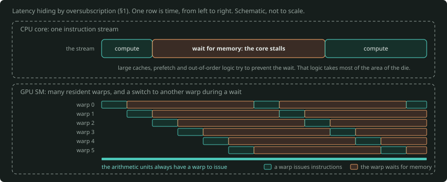
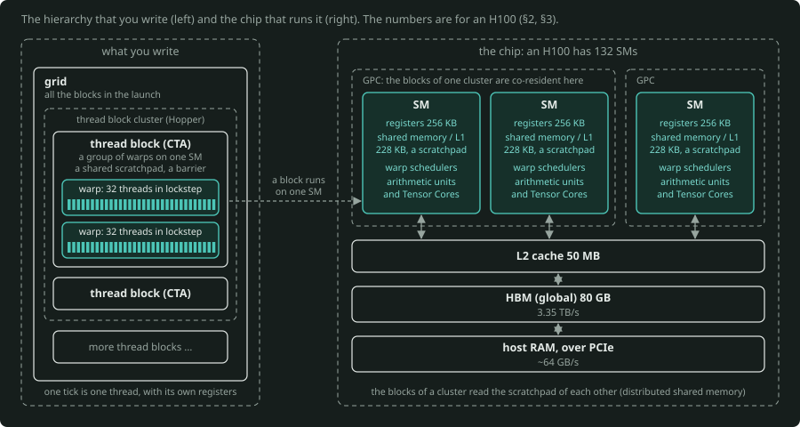
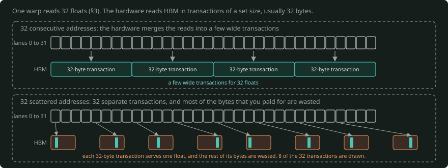
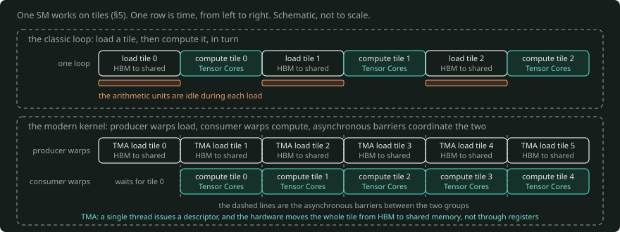
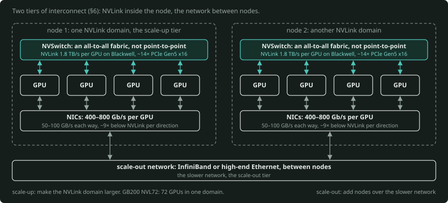

# A GPU Primer

*From first principles to the state of the art in August 2026.*

---

## 1. Why a GPU is shaped the way it is

Start with the transistor budget. If you build a CPU core from gates, the arithmetic units are a small fraction of the die. Most of the area makes a *single* instruction stream finish fast. That area holds branch predictors, out-of-order scheduling, register renaming, and three levels of cache. That design optimises latency. It assumes that one thread is important and that you want its answer now.

A GPU takes the opposite risk. It assumes that you have tens of thousands of independent pieces of work. It also assumes that only the total work per second is important to you. Thus it removes almost all of the control logic. It shares the logic that stays among many arithmetic lanes to decrease the cost for each lane. It uses the area that it gets back for ALUs and memory bandwidth.

That one trade-off explains almost everything else:

| | CPU | GPU |
|---|---|---|
| Optimises | latency of one stream | throughput of many |
| Cores | tens of complex cores | thousands of simple lanes |
| Hides memory latency with | large caches, prefetch, OoO | a switch to another thread |
| Fails badly when | the work is embarrassingly parallel | the work has many branches and is serial |

The key phrase is **latency hiding by oversubscription**. A CPU tries to prevent waits for memory. A GPU accepts the wait. It keeps thousands of other threads resident, so that it always has other work to issue. This is why "occupancy" is a GPU concept and not a CPU concept.



*One CPU core (top) has one instruction stream, and a wait for memory stalls it. One GPU SM (bottom) keeps many warps resident, and when a warp waits for memory, the warp scheduler issues another warp. Thus the arithmetic units always have work, and this is why occupancy is a GPU concept (§1).*

---

## 2. The execution model

### The hierarchy

You write a **kernel**, a function that one thread runs. You launch it over a grid:

```
grid  →  thread blocks  →  warps (32 threads)  →  threads
```

- **Thread**: one lane of execution, with its own registers.
- **Warp**: 32 threads that execute *in lockstep*. This is the real unit of scheduling. AMD calls its equivalent a *wavefront* (64 lanes, or 32 on RDNA).
- **Thread block** (CTA): a group of warps. The hardware makes sure that these warps run on the same physical core. The warps can share fast scratchpad memory, and they can synchronise at a barrier.
- **Grid**: all the blocks in the launch.

Physically, the chip is a set of **SMs** (Streaming Multiprocessors). An H100 has 132. Each SM has its own register file, scratchpad, warp schedulers, and arithmetic units. The hardware assigns a block to exactly one SM. The block stays on that SM until it finishes.



*On the left is the hierarchy that you write: a grid of thread blocks, each a group of warps of 32 threads in lockstep. On the right is the chip: SMs with a register file, a scratchpad, warp schedulers and arithmetic units, then the L2 cache and the HBM. The hardware assigns a block to exactly one SM, and the blocks of a cluster are co-resident on one GPC (§2).*

### SIMT, and why divergence hurts

NVIDIA calls the model **SIMT**: Single Instruction, Multiple Threads. In practice, it is SIMD hardware with a scalar programming model on top. All 32 lanes of a warp share one instruction pointer.

Look at this code:

```cuda
if (threadIdx.x % 2 == 0) { A(); } else { B(); }
```

This code does not run A and B in parallel. The warp first executes A, with the odd lanes masked off. Then it executes B, with the even lanes masked off. You pay for both. This is **warp divergence**. It is the first performance trap that everyone finds.

Since Volta (2017), each thread has its own program counter. Thus divergent threads can make independent forward progress and converge again. The cost model did not change, but a class of deadlocks disappeared.

### What changed recently

**Thread block clusters** (Hopper, 2022) added a level between block and grid. A cluster is a group of blocks. The hardware makes sure that these blocks are co-resident on the same GPC. Thus each block can read the scratchpad of the other blocks directly. This feature has the name **distributed shared memory**. It is a new tier, and it did not exist when people taught CUDA as grid/block/thread.

---

## 3. Memory is the whole game

If you learn only one section, learn this one.

### The hierarchy, with rough H100 numbers

| Level | Size | Bandwidth | Latency |
|---|---|---|---|
| Registers | 256 KB per SM | ~100 TB/s | ~1 cycle |
| Shared memory / L1 | 228 KB per SM | ~20 TB/s | ~30 cycles |
| L2 cache | 50 MB | ~5 TB/s | ~200 cycles |
| HBM (global) | 80 GB | 3.35 TB/s | ~500 cycles |
| Host RAM over PCIe | ~TB | ~64 GB/s | ~microseconds |

Two things are important. First, each step down is approximately an order of magnitude worse. Second, **shared memory is a software-managed scratchpad**, not a cache. You move data into it explicitly. CPUs have nothing equivalent. Most of the work of "optimising a CUDA kernel" is to learn to use this scratchpad well.

### Coalescing

The hardware reads HBM in transactions of a set size (usually 32 bytes). If the 32 lanes of a warp read 32 consecutive floats, the hardware merges them into a few wide transactions. If the lanes read 32 scattered addresses, you issue 32 separate transactions. Thus you waste most of the bytes that you paid for. The access pattern is more important than the instruction count.



*In the top panel, the 32 lanes of a warp read 32 consecutive floats, and the hardware merges the reads into a few wide transactions. In the bottom panel, the lanes read 32 scattered addresses, so the warp issues 32 separate transactions and wastes most of their bytes (§3).*

### The roofline model

This mental model lets you predict GPU performance.

Define **arithmetic intensity** as the FLOPs that a kernel does for each byte that it moves from HBM. Every kernel has a position on this curve:

$$
\text{achievable FLOP/s} = \min(\text{peak FLOP/s},\ \text{arithmetic intensity} \times \text{memory bandwidth})
$$

For an H100, the peak BF16 tensor throughput is approximately 990 TFLOP/s, and the bandwidth is 3.35 TB/s. The crossover is at approximately **295 FLOPs per byte**. Below that intensity, you are memory-bound. Thus the ALUs are idle, whatever you do.

These are the positions of common operations:

- **Elementwise ops** (ReLU, add, layernorm): the intensity is near 1. These ops are memory-bound to an extreme degree. This is why kernel *fusion* is the one optimisation with the highest leverage in deep learning, because fusion removes round trips to HBM.
- **Attention, in a simple implementation**: it creates a full $N \times N$ score matrix in HBM. It is memory-bound, and its memory use is quadratic. FlashAttention solves exactly this problem. It tiles the computation, so the score matrix never leaves shared memory.
- **Large dense matmul**: the intensity increases with the tile size. This is the one operation that saturates the ALUs.
- **LLM decoding, batch size 1**: you read every weight in the model to make one token. At 2 FLOPs per parameter and 2 bytes per parameter, the intensity is **1 FLOP per byte** at BF16 (2 at FP8, 4 at FP4). This operation is memory-bound to an extreme degree. This memory limit is the reason that a 70B model at batch 1 runs at a fraction of a percent of peak FLOPS.

Think about that last point carefully. **Most inference is bandwidth-bound, not compute-bound.** This is why HBM capacity and bandwidth, not TFLOPS, are the headline numbers on modern accelerators. It is also why batching, quantisation, and KV-cache compression are the levers that change throughput in practice.

---

## 4. Tensor Cores: the biggest change since you last looked

If you learned CUDA before approximately 2018, you learned a machine whose basic operation was the fused multiply-add on a scalar lane. That machine no longer shows where the performance is.

From Volta onward, each SM contains **Tensor Cores**. These units do only one job. They take small matrix tiles as input, and they produce a matrix multiply-accumulate in a few cycles, $D = A \times B + C$. A whole warp (or, on Hopper and later, a warpgroup of four warps) supplies their input as a team. Individual threads do not.

The size of the change:

| Unit | H100 throughput |
|---|---|
| FP32 "CUDA core" | ~67 TFLOP/s |
| BF16 Tensor Core | ~990 TFLOP/s |
| FP8 Tensor Core | ~1,980 TFLOP/s |

A kernel that does not use Tensor Cores leaves approximately 95% of the chip unused. This is the main reason that hand-written CUDA from the pre-Volta era is no longer competitive with library code. It is also the reason that almost nobody writes matmuls from scratch now.

### The precision ladder

Each generation added a narrower number format. The reason is that neural networks tolerate low precision much better than scientific computing does:

- **FP32**: the baseline.
- **TF32** (Ampere): a 19-bit internal format. It is a drop-in replacement for FP32 matmul, and it is ~8× faster.
- **FP16 / BF16** (Volta / Ampere): BF16 keeps the exponent range of FP32 and gives up mantissa. This makes it much more robust in training. BF16 won.
- **FP8** (Hopper): two variants, E4M3 for weights and activations, and E5M2 for gradients. FP8 needs per-tensor scaling to control the range. The "Transformer Engine" does this scaling automatically.
- **FP4 / MXFP4** (Blackwell): a 4-bit format with a shared exponent for each small block of values. The name of this method is *microscaling*. The headline inference numbers of Blackwell are FP4 numbers.

The pattern is consistent. When the precision halves, the throughput approximately doubles and the memory traffic halves. You are usually memory-bound. Thus the second effect often has more importance than the first.

### A caveat relevant to scientific ML

All of this trend aims at low-precision dense linear algebra. Some workloads need FP64 (traditional HPC, stiff PDE solvers). In other workloads (GNNs, sparse meshes, neighbour lists), irregular gather/scatter is the largest part of the work. Both groups of workloads get much less benefit. GNN message passing, in particular, is memory-latency-bound and does not map cleanly to Tensor Cores.

AMD made this split explicit. From the MI400 generation, AMD divides its line into an AI part (FP4/FP8/BF16) and an HPC part (FP32/FP64). It removes the logic of the other part from each die to get the area back. If you work on physics-informed models, monitor this divergence in the hardware roadmap. The reason is that the FP64 story becomes worse on the AI parts, without much notice.

---

## 5. The modern kernel: asynchrony and specialisation

The other large change since the classic CUDA era is about the structure of a fast kernel. A fast kernel is now an explicitly *pipelined* program, not a loop that loads and computes.

- **Async copy** (Ampere): a copy from HBM to shared memory that does not go through registers. Thus the compute on tile $n$ overlaps with the load of tile ${n+1}$.
- **TMA, the Tensor Memory Accelerator** (Hopper): a dedicated DMA engine. A single thread issues a descriptor. Then the hardware moves a full multidimensional tile, and it controls the addresses and the boundary conditions. This removes a large quantity of index arithmetic from the inner loop.
- **Warp specialisation**: the warps do not all do the same thing. Some warps become *producers* that only issue TMA loads. Other warps become *consumers* that only issue Tensor Core instructions. Asynchronous barriers coordinate the two groups. The SM starts to look like a small dataflow machine.



*In the top row, one loop loads a tile and then computes it, so the arithmetic units are idle during each load. In the bottom row, producer warps issue the TMA load of tile ${n+1}$ while consumer warps compute tile $n$ on the Tensor Cores. Asynchronous barriers coordinate the two groups (§5).*

**FlashAttention** is the canonical worked example of all of this. It is not a better algorithm when you count FLOPs. It does slightly more arithmetic. It is faster because it is *IO-aware*:

- It tiles the computation, so intermediate results stay in shared memory.
- It uses an online-softmax reformulation, so it never needs the full score matrix.
- On Hopper, it overlaps TMA loads with warpgroup matmuls in a pipeline.

FlashAttention made long-context transformers practical. It is the best single case study of the modern way to think about a GPU.

---

## 6. When one GPU is not enough

Modern frontier work does not use a GPU as the unit of compute. The unit is a rack.

### Interconnect tiers

- **Within a node**: **NVLink**. These are direct GPU-to-GPU links at 1.8 TB/s per GPU on Blackwell. That is approximately 14× a PCIe Gen5 x16 slot. NVSwitch chips make NVLink an all-to-all fabric, not point-to-point.
- **Across nodes**: InfiniBand or high-end Ethernet, at approximately 400–800 Gb/s per GPU, 50–100 GB/s each way. Per direction and within one generation, that is approximately 9× below NVLink. The 1.8 TB/s of NVLink is the sum of both directions. Refer to the [roofline primer §5.1](../roofline-and-fabric/PRIMER.md#51-the-link-ladder).

That gap defines the standard vocabulary. **Scale-up** means to make the NVLink domain larger. The NVLink domain is the set of GPUs that can use the memory of each other as almost local memory. **Scale-out** means to add nodes over the slower network.

The main hardware trend of the last two years is that scale-up domains become much larger. GB200 NVL72 puts 72 GPUs in one liquid-cooled NVLink domain. Vera Rubin NVL144 goes further than that. AMD works toward the same idea with its Helios rack, and with the open UALink standard as an alternative to NVLink.



*Inside a node, NVSwitch makes NVLink an all-to-all fabric between the GPUs: that set of GPUs is the NVLink domain. Between nodes, the NICs carry approximately 9× less bandwidth per direction over InfiniBand or high-end Ethernet. Scale-up makes the NVLink domain larger, and scale-out adds nodes over the slower network (§6).*

### Parallelism strategies

You divide a model across GPUs along different axes. Each choice causes a different type of communication:

| Strategy | What you divide | Communication |
|---|---|---|
| **Data parallel** | the batch | all-reduce of gradients at each step |
| **Tensor parallel** | individual matrices | all-reduce *inside* every layer, so it needs NVLink |
| **Pipeline parallel** | layers across devices | point-to-point, but it causes bubbles |
| **Expert parallel** | MoE experts | all-to-all routing of tokens |
| **Context parallel** | the sequence | for attention on an extremely long context |

In practice, training runs use three or four of these strategies together. **NCCL** implements the collective operations themselves (all-reduce, all-gather, reduce-scatter, all-to-all). To adjust NCCL is a real part of the work in large-scale training.

---

## 7. The software stack in 2026

The layers, from highest to lowest:

1. **PyTorch eager.** Most work still starts here. Every operation dispatches to a pre-written kernel. The cost is a round trip to HBM between operations.
2. **`torch.compile`.** It traces your model and generates fused kernels through the Inductor backend, which emits Triton. It is usually the first thing to try. It often gets a large fraction of the available gain for no effort.
3. **Triton.** A Python DSL. In it, you write kernels at the level of *blocks of elements*, not individual threads. The compiler does the coalescing, the shared memory allocation, and the scheduling in a block. Most custom kernel work occurs here today. Triton is a much easier start than CUDA C++.
4. **CUTLASS / CuTe.** The C++ template library of NVIDIA for matmul-shaped problems. The layout algebra of CuTe is the serious tool to express tiling and data movement. CUTLASS and CuTe are difficult to learn. But engineers build production matmul and attention kernels from them.
5. **CUDA C++ with inline PTX.** This is still the lowest level when you need something that the higher layers do not express.

### CUDA Tile, the notable new arrival

With CUDA 13.0 (August 2025), NVIDIA started to build **CUDA Tile**, a *second* programming model next to SIMT. This work continues. You do not describe what one thread does. Instead, you describe operations on tiles and arrays, in NumPy style. The compiler does the thread mapping, the memory movement, the asynchrony, and the Tensor Core selection.

NVIDIA ships CUDA Tile as **cuTile** for Python. Since CUDA 13.3, cuTile is also available for C++. A new Tile IR supports cuTile, and other compilers can target this IR. CUDA 13.2 extended Tile support back to Ampere and Ada.

CUDA Tile is important for you specifically. It is the first structural change to the CUDA programming model in twenty years. It targets exactly the gap between "PyTorch is too slow here" and "I do not want to hand-write warp-level PTX". In concept, it comes near to Triton. That is a reasonable sign that kernel programming moves toward block/tile-level abstraction as its stable level.

### Serving and inference

- **vLLM** and **SGLang** are the standard serving engines. Their central innovation is PagedAttention. PagedAttention applies virtual-memory paging to the KV cache to remove fragmentation.
- **TensorRT-LLM** is NVIDIA's own engine. It is faster on NVIDIA hardware and less flexible.
- **Disaggregated serving** is the current architectural direction. It runs *prefill* (compute-bound, processes the whole prompt) and *decode* (memory-bound, one token at a time) on separate pools of hardware. The reason is that the two phases have opposite bottlenecks. NVIDIA even builds a distinct SKU for this, Rubin CPX. Rubin CPX aims at prefill with extremely large contexts.

### Non-NVIDIA

**ROCm** is the stack of AMD. It is much better than its reputation. PyTorch, JAX, Triton, vLLM, and FlashAttention all work on it. HIP gives you an almost mechanical port path from CUDA. The gap now is less about basic support. It is more about the depth of tuned kernels and the long tail of libraries.

Google's **TPUs** (compiled through XLA, programmed through JAX) and Amazon's **Trainium** are the other volume alternatives. Both are systolic-array designs. Their approach puts the compiler first, not the kernel.

---

## 8. The hardware landscape, as of August 2026

**NVIDIA datacenter line:**

| Generation | Parts | Memory | Notes |
|---|---|---|---|
| Hopper (2022) | H100, H200 | 80 GB HBM3 / 141 GB HBM3e | FP8, TMA, thread block clusters |
| Blackwell (2024–25) | B200, GB200 | 192 GB HBM3e physical. 180 GB usable per B200 in HGX, 186 GB per GB200 GPU (verify, 2026-09) | FP4, dual-die, NVL72 racks |
| Blackwell Ultra (2025) | B300, GB300 | 288 GB HBM3e | current volume part |
| **Rubin** (2026) | Rubin + Vera CPU | 288 GB HBM4 | in production, volume H2 2026 |
| Rubin CPX | long-context prefill SKU | — | expected end of 2026 |
| Rubin Ultra, then Feynman | 2027+ | — | announced roadmap only |

The usable figures are the figures that the [roofline primer's catalogue](../roofline-and-fabric/PRIMER.md#9-the-accelerator-landscape-september-2026-snapshot) (`roofline.specs`) uses in its plans. Use these figures when you calculate how much memory a deployment needs, not the physical stack count.

Rubin entered full production at approximately the time of CES 2026. Volume shipments target the second half of this year. Thus Rubin arrives now, but HBM4 yields and TSMC N3 capacity limit the supply. Hyperscalers get most of the early allocation. NVIDIA claims gains over Blackwell of approximately 3.5× in training and 5× in inference per GPU, with a 10× decrease in cost per token. Treat vendor multipliers as sales claims until MLPerf results arrive, but the direction is real.

**AMD:** MI355X (CDNA 4) ships now. The MI400 series comes in 2026. It divides into MI450X for AI and MI430X for HPC, with rack-scale Helios systems and UALink. AMD announced MI500 for 2027.

**Consumer and desk-side:** RTX 50-series stays the current GeForce generation, and there is no announced successor. The RTX PRO 6000 Blackwell (96 GB) is the top workstation card. DGX Spark is the small Arm-based desk-side box of NVIDIA. CUDA 13 unified the Arm toolkit, partly to support DGX Spark.

**Practical note for a home cluster:** the limit that you will meet is not FLOPS. It is VRAM and interconnect. From the 40-series onward, consumer cards have no NVLink. Thus multi-GPU work must use PCIe. This gives tensor parallelism a high cost, and it moves you toward pipeline parallelism, offloading, or smaller models. Quantisation gives you capacity and bandwidth at the same time, and thus it has an unusually large effect on hobbyist hardware.

---

## 9. Numbers worth memorising

**Model memory:**

- Weights: 2 bytes per parameter at BF16. A 70B model needs 140 GB, so it does not fit on one 80 GB H100.
- Training: approximately 16 bytes per parameter with Adam (weights, gradients, and two optimiser moments in FP32), before activations. This is why training needs an order of magnitude more memory than inference.
- KV cache: `2 × layers × kv_heads × head_dim × seq_len × batch × 2 bytes`. At long context and high batch, this is more than the weights. This fact is the reason for MQA, GQA, and MLA.

**General rules:**

- A forward pass costs approximately 2 FLOPs per parameter per token. A training step costs approximately 6.
- If the arithmetic intensity is below ~300 FLOP/byte on modern hardware, you are memory-bound. Then stop the optimisation of arithmetic.
- On a large training run, 40–50% of peak FLOPS (Model FLOPs Utilisation) is a good result. More than 50% is an excellent result.

---

## 10. A path in, if you want to go deeper

Approximately in order of leverage:

1. Read the **FlashAttention** paper (v1 for the idea, v3 for the Hopper mechanics). It teaches the roofline model, tiling, and asynchrony in one document.
2. Do the **Triton tutorials**. Then write a fused kernel for something in your own stack. Use this order: vector add, then softmax, then a fused layernorm, then attention.
3. Learn to read a **Nsight Compute** profile. Find the fraction of peak memory bandwidth that you get, and the fraction of peak Tensor Core throughput. Then find which of those two is the ceiling. Most optimisation intuition comes from this loop, not from the text that you read.
4. Do a fast read of the **CUTLASS/CuTe** layout algebra, even if you never write it. The reason is that it is the vocabulary that people use to describe production kernels.
5. Try **cuTile**. The reason is that it is new, so early familiarity has a low cost. Also, it is a reasonable possibility that the CUDA programming model moves in the direction of cuTile.
6. For distributed work, read the **Megatron-LM** and **ZeRO** papers. Then run a multi-GPU job and examine the NCCL traces.

The most important change in your view is this. Do not think of a GPU as a fast calculator. Think of it as a memory system with arithmetic attached.
