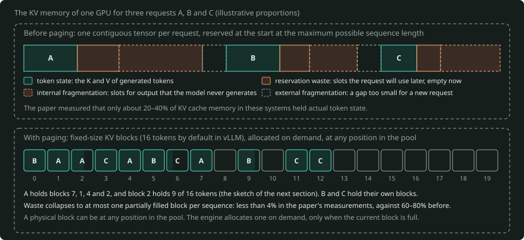
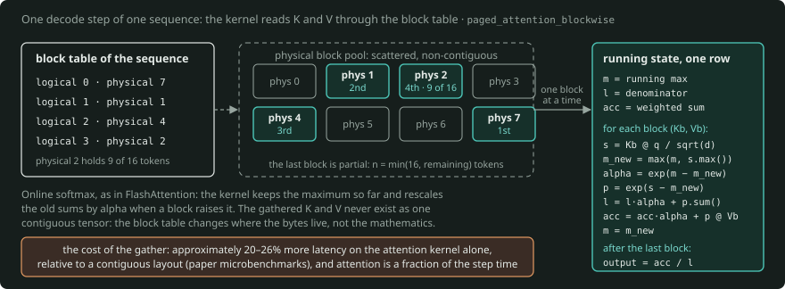

# PagedAttention: A Primer

## Why the KV cache is the problem

To first order, the throughput of an engine that serves autoregressive LLMs is a batching problem. Decode is memory-bandwidth-bound, because each step reads all the weights and every cached K and V to make one token per sequence. Thus the tensor cores are idle most of the time, unless many sequences share each forward pass. The constraint that sets the limit on batch size is memory.

The weights are static and the activations are small. Thus the KV cache is the dynamic user of memory. During decode, each new token attends over the keys and values of every token before it. If the engine calculates those projections again at each step, generation becomes quadratic in sequence length. Thus the engines that serve LLMs cache them.

At each step, the cache increases by the K and V of one token, per layer. The cache stays for the full request. Its final size is unknown at the start, because you do not know how many tokens the model will generate.

The footprint is large. Per token, the cache costs `2 × n_layers × n_kv_heads × d_head × bytes_per_element` (the 2 is for K and V). LLaMA-13B in FP16 has 40 layers and 40 heads of dimension 128. For this model, the formula works out to 800 KiB per token. Thus a single 2,048-token sequence occupies about 1.56 GiB (1.68 GB).

On a 40 GB A100, the FP16 weights already take 26 GB, leaving room for only a handful of max-length sequences. This count applies if each sequence gets a full reservation. It is exactly this arithmetic that sets the limit on batch size, and thus on throughput.

Before vLLM, production systems (FasterTransformer, Orca) kept the KV cache of each request as a single contiguous tensor. They reserved this tensor at the start, at the maximum possible sequence length. Contiguity and unknown lengths together cause three different kinds of waste.

- Internal fragmentation: reserved slots for output that the model never generates, because most requests stop at a length much less than the maximum.
- Reservation waste: slots that the request will use later, but that are empty now. Until the request uses them, no other request can use them.
- External fragmentation: gaps between contiguous allocations of variable size. Each gap is too small for a new request.

The PagedAttention paper measured that only about 20–40% of KV cache memory in these systems held actual token state. This memory is the most limited resource on the GPU, and most of it held only reservations and no data.



*The top row shows three requests with contiguous reservations. Each reservation holds token state, reservation waste and internal fragmentation, and the gaps between reservations are external fragmentation. The proportions are illustrative. The bottom row shows the same three requests in KV blocks of one constant size, at any position in the pool. The waste is at most one partially filled block per sequence.*

## The core idea: virtual memory, applied to attention

PagedAttention (Kwon et al., SOSP 2023, the paper that introduced vLLM) applies the method of operating systems. In an operating system, each process sees a contiguous virtual address space. The operating system divides physical memory into fixed-size frames. A page table maps the virtual addresses to the frames. The observation is that nothing in attention needs the KV cache to be physically contiguous. Contiguity made the implementation easier, and it came from dense tensor frameworks.

In detail, the engine divides the KV cache into fixed-size **KV blocks**. Each block holds the keys and values for a small, constant number of tokens (16 by default in vLLM). A sequence sees an ordered list of logical blocks. Each sequence has a **block table** that maps each logical block to a physical block in a large pre-allocated pool on the GPU.

A physical block can be at any position in the pool. The engine allocates physical blocks on demand. It takes a new physical block only when the current block is full.

```
Logical view (one sequence)       Block table         Physical block pool
[ blk0 ][ blk1 ][ blk2 ][ blk3 ]  blk0 -> phys 7      [0][1][2][3][4][5][6][7]...
  full    full    full   9/16     blk1 -> phys 1       scattered, non-contiguous,
                                  blk2 -> phys 4       shared across sequences
                                  blk3 -> phys 2
```

This design has two results. First, waste collapses to at most one partially filled block per sequence. In the paper's measurements, this waste is less than 4%, against 60–80% before. The second result is of more interest. The indirection separates the memory layout from the identity of the sequence. This separation is what makes it possible to share blocks and to schedule flexibly.

## The kernel

Without contiguity, there is a cost: the attention kernel can no longer read K and V as one strided tensor. The PagedAttention kernel does these steps:

- It takes the block table as an input.
- It goes through the logical blocks of each sequence.
- It gathers the physical blocks that the block table maps them to.
- It calculates the attention scores block by block.
- It combines the partial results with an online-softmax accumulation.

This accumulation is the same numerically stable method that FlashAttention uses for tiling: it keeps the maximum so far and rescales. Here, the kernel applies it to an access pattern that gathers from blocks. In the paper's microbenchmarks, the paged layout costs approximately 20–26% more latency on the attention kernel alone, relative to a contiguous layout. But attention is only a fraction of the end-to-end step time. The batching gains that paging makes possible are larger than this cost by a wide margin.



*The kernel takes the block table of the sketch above and visits physical blocks 7, 1, 4 and 2 in logical order. For each block, it calculates the scores, keeps the maximum so far, rescales the old sums by `alpha` and adds the block. After the last block, it divides the sum by the denominator once. `kerncore.paged.paged_attention_blockwise` is this loop in numpy, and the FlashAttention primer draws the same accumulator in its §5.*

It is useful to be precise about the relation to FlashAttention, because people often confuse the two. FlashAttention is about how to *calculate* attention with efficient IO: it never puts the full score matrix in HBM. PagedAttention is about how to *store* the KV cache flexibly. The two are orthogonal, and you can use them together. Modern kernels (FlashAttention-2/3, FlashInfer) accept paged KV layouts natively. Also, "paged KV" is now the standard interface contract for attention kernels in the software stacks that serve LLMs.

## Sharing and copy-on-write

The indirection of the block table makes it almost free to share the KV cache. Each physical block has a reference count. The block tables of two or more sequences can point to the same physical block. If a sequence must write into a block whose refcount is more than one, the engine does a copy-on-write at block granularity. It allocates a new block, copies the contents, decreases the old refcount and points the block table to the new block.


*Two sequences A and B share the two blocks of one prompt after a fork, and each block has refcount 2. In the right panel, B writes into the partial block. The engine allocates a new block, copies the contents, decreases the old refcount and points the block table of B to the new block. The full block stays shared. `kerncore.paged.PagedSequence.fork` and `append` do the same steps.*

Three workloads get a benefit.

- In parallel sampling ($n$ completions from one prompt), all samples share the blocks of the prompt. The samples are different only in their generated suffixes. Thus the engine copies, at most, the last block of the prompt. The savings are small, because the samples share only the prompt. The paper gives approximately 6–10%.
- In beam search, beams fork from shared ancestors all the time. Thus the beams share large fractions of the cache, and these fractions change dynamically. The paper measured up to ~55% memory savings at wide beam widths. With contiguous allocation, it is almost impossible to implement this pattern of shared blocks.
- Across requests, identical prefixes (system prompts, few-shot exemplars) can map to the same physical blocks. This is the mechanism under prefix caching. Later, SGLang's RadixAttention made this mechanism more general. RadixAttention keeps cached prefixes in a radix tree over the paged pool. The prompt-caching products that frontier-lab APIs now supply are the commercial form of the same block-reuse idea.

## Scheduling: continuous batching and preemption

The engine allocates memory block by block as sequences grow. Thus the scheduler no longer needs to know the output lengths to admit requests. It admits requests until few free blocks stay in the physical pool.

Paging combines with continuous (iteration-level) batching from Orca. In continuous batching, finished sequences leave the batch immediately, and sequences that wait can join at any step. Together, the two increase the effective batch size by a large factor. For example, vLLM reported 2–4× throughput over FasterTransformer and Orca at equivalent latency. The gains were larger for long sequences, large models and complex decoding.

A design question of interest is this: what occurs when no free blocks stay in the pool while requests are in progress? The engine promised the blocks optimistically, so this can occur. vLLM preempts victim sequences with one of two mechanisms.

Swapping copies the blocks of a sequence out to CPU RAM, and later back. PCIe bandwidth sets the limit on its speed. Recomputation frees the blocks. When the scheduler schedules the sequence again, the engine replays its full prompt-plus-generated-so-far as a single prefill. Recomputation often takes less time than swapping. The reason is that prefill is one large parallel pass, but swapping moves many small blocks over a slow bus.

Eviction is all-or-nothing per sequence. Each step uses every block of a sequence. Thus partial residency is of no use. Which mechanism is better depends on block size and hardware. Small blocks favor recomputation, and large blocks favor swapping.

## Design trade-offs worth knowing

Block size is the central parameter to adjust. With smaller blocks, sequences can share memory at a finer granularity, and each sequence has less internal waste. But smaller blocks also give larger block tables, more gather overhead and worse memory coalescing in the kernel. Larger blocks give the opposite of all of these. Sixteen tokens is the empirical middle point. It has stayed the default for a long time, and it is still the default.

Paging is also orthogonal to all the methods that make the cache itself smaller, and the effects multiply. GQA and MQA decrease `n_kv_heads`. DeepSeek-style MLA compresses K and V into a low-rank latent. FP8/INT8 KV quantization divides the bytes per element by two or by four. All of these methods decrease the size of the contents of each block. But paging controls how the engine places, shares and evicts the blocks.

The strongest critique came from vAttention (2024). vAttention says that PagedAttention implements virtual memory again in user space, with software block tables and rewritten kernels. But, as vAttention says, CUDA's virtual memory management APIs can keep the cache virtually contiguous, with physical pages under it. With those APIs, unmodified kernels can run.

The critique from vAttention is a fair architectural point, but in practice the paged model won. TensorRT-LLM, HF TGI, SGLang, and LMDeploy all started to use paged KV caches. Newer KV-centric architectures also build directly on block-managed caches as the unit of transfer. Disaggregated prefill/decode systems like Mooncake and DistServe are examples. These systems send KV blocks between prefill and decode workers.

## Numbers to keep in your pocket

Remember these numbers:

- A 13B FP16 model costs 800 KiB of KV cache per token, so ~1.56 GiB (1.68 GB) per 2K-token sequence.
- Systems before paging got only 20–40% KV memory utilization, against >96% with paging.
- The default block holds 16 tokens.
- The kernel pays ~20–26% overhead on attention in isolation.
- The headline result is 2–4× the throughput of FasterTransformer and Orca at matched latency.

## Sources

The primary source is Kwon et al., "Efficient Memory Management for Large Language Model Serving with PagedAttention," SOSP 2023 (arXiv:2309.06180). It is unusually easy to read. For continuous batching, read Yu et al., "Orca," OSDI 2022. For RadixAttention, read Zheng et al., "SGLang" (arXiv:2312.07104). For the counter-argument, read Prabhu et al., "vAttention" (arXiv:2405.04437). For the complement on the compute side, read Dao et al., FlashAttention 1/2.

**Code and tests.** [`kernel-core`](../kernel-core/README.md) puts [`paged_attention_minimal.py`](paged_attention_minimal.py) in a package as `kerncore.paged` (a pool object with refcounts, copy-on-write and the blockwise online softmax). The test file `kernel-core/tests/test_paged.py` makes sure that the two agree. The test file `kernel-core/tests/test_primer_numbers.py` calculates the per-token and per-sequence sizes of this page again. Both run in about a second on any CPU.

## Verify list (dated 2026-09-26)

This table lists the paper and product facts that this primer states. This primer did not measure any of them again.

| Item | Value used | Why it needs checking |
|---|---|---|
| LLaMA-13B shape and memory | The model has 40 layers and 40 heads of dimension 128. The FP16 KV is 800 KiB per token. The FP16 weights are 26 GB on a 40 GB A100. | model config and the paper's setup |
| KV utilization before and after paging | 20–40% of KV memory held token state before. Waste was 60–80% before and under 4% with paging. | PagedAttention paper (Kwon et al., SOSP 2023) |
| Kernel overhead | 20–26% extra attention-kernel latency, relative to a contiguous layout | paper microbenchmark, on the paper's GPUs and kernel |
| Sharing savings | ~6–10% for parallel sampling, up to ~55% for wide beam search | paper figures |
| Throughput | 2–4× over FasterTransformer and Orca at matched latency | paper figure, and engines have changed a lot since then |
| Default block size | 16 tokens in vLLM | engine default, and attention backends can select another size |
| Adoption | TensorRT-LLM, HF TGI, SGLang and LMDeploy use paged KV caches. FlashAttention-2/3 and FlashInfer accept paged layouts. | project docs at the release in use |
