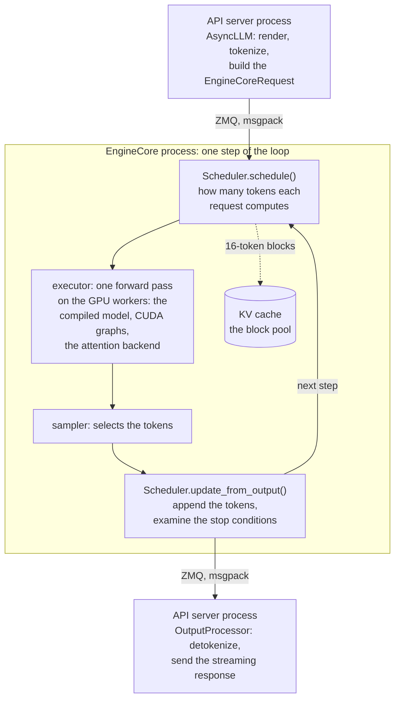
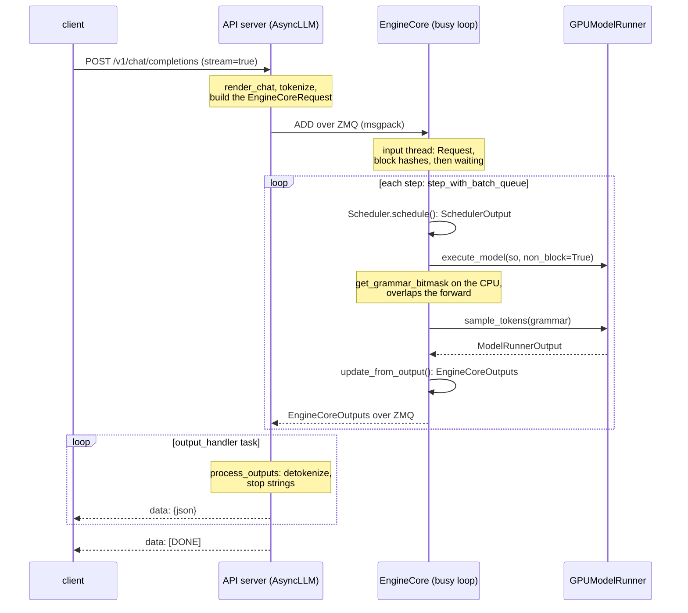
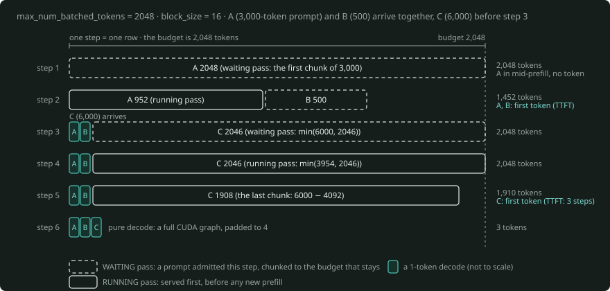
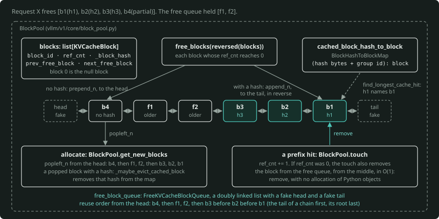
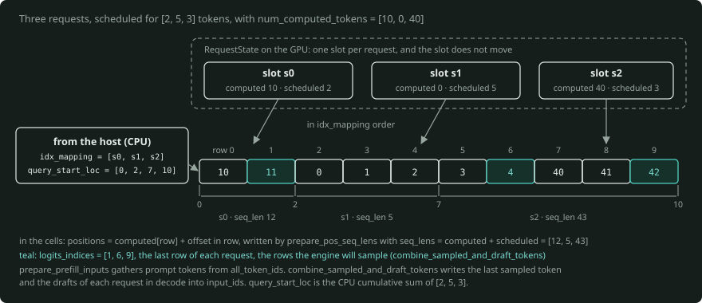
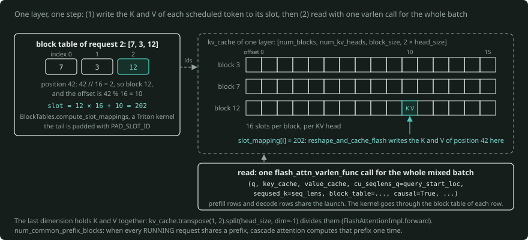
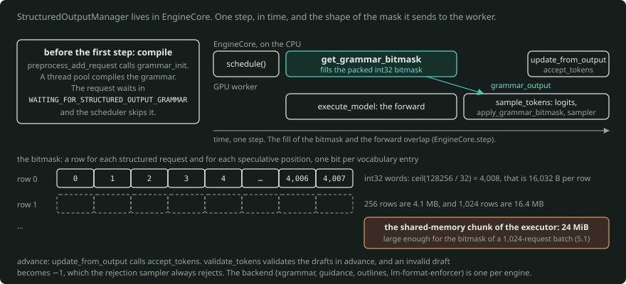
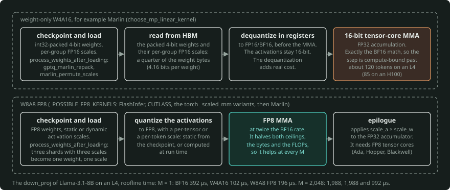
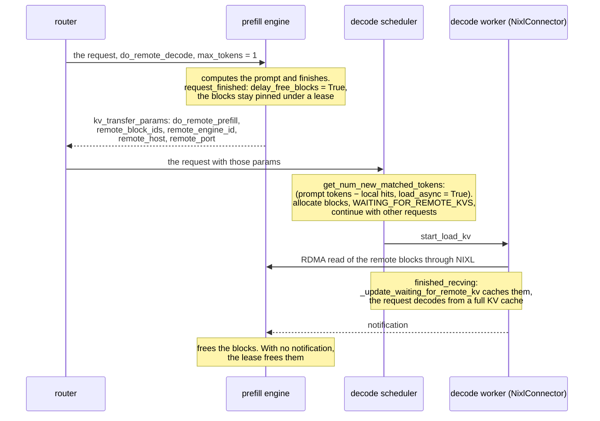

# vLLM internals: a source-level primer

This primer traces a request through vLLM. It connects each mechanism to the file and the function that
implement it. The reader is an engineer who must explain an inference engine in a design review, and these things in
particular:

- why a request waited,
- where its time went,
- why the KV cache holds the number of tokens that it holds,
- which flag moves which number.

The serving-engine primer ([`../serving-engine/PRIMER.md`](../serving-engine/PRIMER.md)) introduces the engine
concepts themselves: continuous batching, chunked prefill, prefix caching and speculation. This primer is the
"now read the real code" companion to it. To run the mechanisms of this primer on a GPU, use
[`../serving-engine/vllm-serving-lab/`](../serving-engine/vllm-serving-lab/).

**State of the source.** The source is vLLM `main` at commit `5840d95` (2026-09-25). The fetch from
`raw.githubusercontent.com/vllm-project/vllm/main` occurred on 2026-09-26. The version string comes from git tags
through `setuptools_scm` (`vllm/version.py`, `pyproject.toml`). Thus `main` has no set version number.

At fetch time, the latest PyPI release was **0.30.0** (2026-09-22), and `pyproject.toml` pins `torch == 2.13.0`
for the build. The author examined the paths at that commit and marked with `(verify)` each item that the source
did not confirm.

**Conventions.** `(path: Class.method)` means "read it there". Paths are relative to the root of the vLLM
repository. [`source-map.md`](source-map.md) lists the same files with line numbers at `5840d95`. It also gives a
plan to read them in four sessions of about two hours.

**Tier:** you read this primer and the source at **T0** (no GPU). You observe the behaviour (metrics, log lines,
preemptions) at **T1**, in the serving lab.

---

## The one-minute version

vLLM divides serving into two kinds of processes.

- An **API server** (FastAPI on asyncio) renders the chat template, tokenizes the prompt and builds an
  `EngineCoreRequest`. Later, it detokenizes the output and sends the streaming response.
- An **EngineCore** process runs a tight loop. In each step, `Scheduler.schedule()` decides how many tokens each
  request computes. Then the executor runs one forward pass on the GPU workers, and the sampler selects tokens.
  Then `Scheduler.update_from_output()` appends the tokens and examines the stop conditions. The two sides
  communicate over ZMQ with msgpack. Thus tokenization and HTTP never take time from the GPU loop.
- The **scheduler** has no prefill phase and no decode phase. Each request has `num_computed_tokens` and a target
  length. Each step gives a token budget (`max_num_batched_tokens`) first to the RUNNING requests, then to the
  WAITING requests. A decode is a request that is one token behind. A prefill is a request that is many tokens
  behind, and the scheduler divides it into chunks that fit.
- The **KV cache** is a pool of 16-token blocks. A hash chained over the whole prefix names each full block. Thus
  each request that starts with the same tokens uses those blocks again. A freed block stays in the cache until the
  pool allocates it again, and the pool evicts the tail of each chain first. The pool is what stays of
  `gpu_memory_utilization × memory` after the weights, a profiled activation peak and the CUDA graphs.
- **On the GPU**, `torch.compile` compiles the model into pieces, divided at attention. The engine replays the
  pieces as CUDA graphs: full graphs for pure-decode batches, piecewise graphs for mixed batches. Attention is a
  pluggable backend, and the engine selects it for each GPU generation.



*The two kinds of processes and one step of the loop. The API server renders, tokenizes and builds an `EngineCoreRequest`. In EngineCore, `Scheduler.schedule()` gives out the token budget, the executor runs one forward pass, the sampler selects the tokens and `Scheduler.update_from_output()` appends them. The two sides communicate over ZMQ with msgpack (§1.3, §2).*

After this primer, you will be able to do these tasks:

- trace a request through those classes,
- calculate a KV block budget by hand,
- predict when preemption occurs,
- tell which engine argument trades TTFT against inter-token latency against memory.

---

## 1. Why vLLM and what "V1" changed

### 1.1 The problem

Two things limit an LLM server. During decode, HBM bandwidth limits it, because each step reads the weights and the
KV cache again. HBM capacity for the KV cache also limits it, because that capacity decides how many sequences can
be in flight. [`../kv-cache/kv-cache-primer.md`](../kv-cache/kv-cache-primer.md) and
[`../paged-attention/paged-attention-primer.md`](../paged-attention/paged-attention-primer.md) give the arithmetic
and the paging idea. vLLM started as the reference implementation of PagedAttention (Kwon et al., SOSP 2023). On
top of paging, the engine adds three things:

- a scheduler that keeps the batch full,
- a cache that shares blocks across requests,
- a GPU execution path with almost no host overhead per step.

### 1.2 What V1 is

"V1" is the new architecture of vLLM, and it is now the only engine in the tree. `VLLM_USE_V1` no longer exists in
`vllm/envs.py`. V0 stays only in comparisons in docstrings ("This is different from the V0 sampler",
`vllm/v1/sample/sampler.py: Sampler.forward`). The release that removed V0 is `(verify)`.

| Choice | What it means | Where |
|---|---|---|
| Process split | API server(s) and EngineCore in separate processes, with ZMQ + msgpack between them | `vllm/v1/engine/core_client.py: AsyncMPClient`, `vllm/v1/engine/core.py: EngineCoreProc` |
| asyncio front-end | `AsyncLLM` owns tokenization, detokenization and streaming. A background task pulls the outputs. | `vllm/v1/engine/async_llm.py: AsyncLLM._run_output_handler` |
| Unified scheduler | No phases. Each request brings its `num_computed_tokens` up to its length. | the comment at the top of `vllm/v1/core/sched/scheduler.py: Scheduler.schedule` |
| Chunked prefill, prefix caching on | the defaults for decoder-only generative models | `vllm/engine/arg_utils.py: EngineArgs._set_default_chunked_prefill_and_prefix_caching_args`, `vllm/config/cache.py` |
| Async scheduling on | The scheduler schedules step N+1 while step N runs on the GPU. | `vllm/config/vllm.py`, `vllm/v1/core/sched/async_scheduler.py` |
| Persistent GPU-side request state | Only the deltas of each step go to the workers. | `vllm/v1/worker/gpu_input_batch.py: InputBatch`, `vllm/v1/worker/gpu/states.py: RequestState` |
| torch.compile + CUDA graphs | `CompilationMode.VLLM_COMPILE` and `CUDAGraphMode.FULL_AND_PIECEWISE` by default | `vllm/config/compilation.py` |
| Symmetric workers | The scheduler lives in EngineCore. Every worker receives the same `SchedulerOutput`. | `vllm/v1/executor/multiproc_executor.py: MultiprocExecutor.collective_rpc` |

### 1.3 The process map

```
  clients ──HTTP──▶ API server process(es)            EngineCore process                     GPU worker process(es)
                    (uvloop + FastAPI)                (one per data-parallel rank)           (one per TP×PP rank; none if TP=PP=1)
                    ┌──────────────────────────┐     ┌──────────────────────────────────┐    ┌──────────────────────────┐
                    │ OpenAIServingChat        │     │ input thread  (ZMQ DEALER recv)  │    │ Worker                   │
                    │ AsyncLLM                 │ ZMQ │   preprocess_add_request         │    │  GPUModelRunner          │
                    │  InputProcessor ─────────┼────▶│ busy loop (main thread)          │shm │   (V1 or V2 runner)      │
                    │  OutputProcessor ◀───────┼─────│   Scheduler + KVCacheManager     │───▶│  model (compiled)        │
                    │  output_handler task     │     │   Executor ──────────────────────┼───▶│  attention backend       │
                    └──────────────────────────┘     │ output thread (ZMQ PUSH send)    │    │  Sampler                 │
                                                     └──────────────────────────────────┘    └──────────────────────────┘
```

With one GPU, the executor is `UniProcExecutor`, and the worker runs **inside** EngineCore. With TP×PP > 1 on one
node, the executor is `MultiprocExecutor`, with one process for each GPU. The engine uses Ray for placement groups or
when you ask for it (`vllm/config/parallel.py: ParallelConfig.__post_init__`,
`vllm/v1/executor/abstract.py: Executor.get_class`).

By default, `vllm serve` starts one API server. With the internal load balance, `--api-server-count` defaults to the
DP size. `--headless` runs engines with no API server (`vllm/entrypoints/cli/serve.py:
ServeSubcommand.cmd`). Inside EngineCore, socket I/O and msgpack run on two daemon threads, so they overlap the
GPU step (`EngineCoreProc.__init__`, `process_input_sockets`, `process_output_sockets`).

### 1.4 Which model runner

`main` has two GPU model runners. `vllm/v1/worker/gpu_model_runner.py: GPUModelRunner` ("MRV1") keeps a
persistent `InputBatch` and builds inputs on the CPU. `vllm/v1/worker/gpu/model_runner.py: GPUModelRunner`
("MRV2") keeps request state in GPU slots that do not move, and builds inputs with Triton kernels.

The README of MRV2 still says "[Experimental]". But `VllmConfig.use_v2_model_runner` (`vllm/config/vllm.py`)
returns **True by default** when Triton is available and the configuration asks for nothing unsupported. For these
features, among others, vLLM uses MRV1 instead (`_get_v2_model_runner_unsupported_features`):

- the `ngram`, `ngram_gpu`, `draft_model`, `suffix` and `medusa` speculative methods,
- stock `torch.compile`,
- sequence parallelism with TP > 1.

There are three exceptions to "default":

- On ROCm, the architectures in `ROCM_DEFAULT_MRV1_ARCHITECTURES` (DeepSeek-V3.2, DeepSeek-V4, GLM-MoE-DSA)
  default to MRV1 ("Defaulting to V1 model runner on ROCm"). They do so if MRV1 can serve the configuration.
- HiSparse attention must have MRV2, and it rejects `VLLM_USE_V2_MODEL_RUNNER=0`.
- The watermark feature forces MRV2, also when `VLLM_USE_V2_MODEL_RUNNER=0` is set.

In all other cases, `VLLM_USE_V2_MODEL_RUNNER=0|1` forces the choice. The worker logs "Using V2 Model Runner"
(`vllm/v1/worker/gpu_worker.py`), or the config logs the reason for the fallback.

A source comment in `_get_v1_model_runner_unsupported_features` already calls MRV1 "deprecated". **This primer
traces the default, MRV2**. Where MRV1 is different, the primer names the MRV1 equivalent. Section 5.3 covers MRV2,
and 5.4 keeps MRV1 as the contrast.

---

## 2. A request's life, end to end

### 2.1 Sequence diagram

This diagram shows a streaming `POST /v1/chat/completions` on a single-GPU `vllm serve`:

```
client      API server process                                EngineCore process                        GPU (same process when TP=1)
  │ POST /v1/chat/completions (stream=true)
  ├────────▶ create_chat_completion           [chat_completion/api_router.py]
  │          OpenAIServingChat._create_chat_completion [chat_completion/serving.py]
  │           ├ render_chat_request → OnlineRenderer.render_chat   (chat template + tokenize → EngineInput)
  │           ├ request.to_sampling_params(max_tokens, defaults)
  │           └ engine_client.generate(...)  = AsyncLLM.generate  [v1/engine/async_llm.py]
  │               AsyncLLM.add_request
  │                ├ InputProcessor.process_inputs → EngineCoreRequest   [v1/engine/input_processor.py]
  │                ├ OutputProcessor.add_request (RequestState + IncrementalDetokenizer)
  │                └ AsyncMPClient.add_request_async ──ZMQ ROUTER, (ADD, msgpack)──▶ input thread: process_input_sockets
  │                                                                          preprocess_add_request → Request
  │                                                                            (block hashes computed here)
  │                                                                          input_queue.put
  │                                                                        busy loop: run_busy_loop
  │                                                                          _process_input_queue → Scheduler.add_request (waiting)
  │                                                                          step_with_batch_queue (async scheduling):
  │                                                                           Scheduler.schedule() → SchedulerOutput
  │                                                                           Executor.execute_model(so, non_block=True) ──▶ Worker.execute_model
  │                                                                           Scheduler.get_grammar_bitmask(so)               GPUModelRunner.execute_model [MRV2]:
  │                                                                             (CPU, overlaps the forward)                    add_requests, update_requests,
  │                                                                                                                            prepare_inputs, prepare_attn,
  │                                                                                                                            forward → hidden states (kept)
  │                                                                           Executor.sample_tokens(grammar) ─────────────▶ GPUModelRunner.sample_tokens:
  │                                                                                                                            sample: logits, bitmask, Sampler or
  │                                                                                                                            RejectionSampler; postprocess_sampled;
  │                                                                           ◀──────────── ModelRunnerOutput ──────────────── speculator.propose (drafts)
  │                                                                           Scheduler.update_from_output → EngineCoreOutputs
  │                                                                             (append tokens, check_stop, free finished)
  │                                                                          output_queue → output thread: process_output_sockets
  │                ◀────────────────── ZMQ PUSH→PULL, EngineCoreOutputs (msgpack) ─────
  │               output_handler task: AsyncMPClient.get_output_async
  │                OutputProcessor.process_outputs: detokenize (IncrementalDetokenizer.update),
  │                  stop strings, logprobs, RequestOutput → per-request RequestOutputCollector
  │                  (stop string hit → engine_core.abort_requests_async)
  │               AsyncLLM.generate yields RequestOutput
  │              chat_completion_stream_generator → "data: {json}\n\n"
  │◀──────── StreamingResponse(media_type="text/event-stream") ... "data: [DONE]\n\n"
```



*The same path in time, with its two loops. The busy loop of EngineCore runs one step at a time: `schedule`, `execute_model`, `sample_tokens` and `update_from_output`. The output handler task of the API server detokenizes each `EngineCoreOutputs` and sends the SSE deltas (§2.2, row 12).*

### 2.2 The same path as a table

| # | Process | Class.function | What occurs | Shows up in |
|---|---|---|---|---|
| 1 | API | `create_chat_completion` (`vllm/entrypoints/openai/chat_completion/api_router.py`) | the FastAPI route, a `StreamingResponse` with SSE keep-alive | HTTP |
| 2 | API | `OpenAIServingChat.render_chat_request`, then `OnlineRenderer.render_chat` (`.../chat_completion/serving.py`, `vllm/renderers/`) | chat template + tokenization | front-end CPU |
| 3 | API | `AsyncLLM.add_request`, then `InputProcessor.process_inputs` (`vllm/v1/engine/input_processor.py`) | Raw prompts run on the thread pool of the renderer (`process_inputs_async`). `process_inputs` validates the params and the LoRA and clones `SamplingParams`. If the request does not set `max_tokens`, `process_inputs` sets `max_tokens = max_model_len − prompt_len`. With `n > 1`, the request becomes a fan-out of child requests (`vllm/v1/engine/parallel_sampling.py: ParentRequest`). | TTFT |
| 4 | API to Core | `AsyncMPClient._send_input` (`vllm/v1/engine/core_client.py`) | a ROUTER socket, with frames = (request-type byte, msgpack payload) | IPC |
| 5 | Core, input thread | `EngineCoreProc.process_input_sockets`, then `EngineCore.preprocess_add_request` (`vllm/v1/engine/core.py`) | It builds the `Request`, which computes the prompt block hashes. It starts the async grammar compile. | overlaps the GPU step |
| 6 | Core | `run_busy_loop`, then `_process_input_queue`, then `Scheduler.add_request` | The request goes into `waiting`, with a `QUEUED` event. | queue time |
| 7 | Core | `Scheduler.schedule` (`vllm/v1/core/sched/scheduler.py`) | Budget, prefix lookup, block allocation and preemption make the `SchedulerOutput`. | queue time, TTFT |
| 8 | Core to GPU | `Executor.execute_model(so, non_block=True)`, then `GPUModelRunner.execute_model` (`vllm/v1/worker/gpu/model_runner.py`, MRV2) | It applies the `SchedulerOutput` delta to the GPU request slots and builds the inputs and slot mappings. It runs the forward pass to the hidden states. | step time |
| 9 | Core | `Scheduler.get_grammar_bitmask` | It builds the structured-output mask on the CPU during step 8 (`EngineCore.step`). | hidden |
| 10 | GPU | `GPUModelRunner.sample_tokens(grammar_output)`, then `sample` | It computes logits for the sampled rows only and applies the bitmask. It samples or rejection-samples, updates the GPU state (`postprocess_sampled`) and proposes drafts. | step time |
| 11 | Core | `Scheduler.update_from_output` | It appends tokens, rolls back rejected drafts, runs `check_stop` and frees finished requests. The output thread encodes and pushes the outputs. | step time |
| 12 | API | `AsyncLLM._run_output_handler`, then `OutputProcessor.process_outputs` (`vllm/v1/engine/output_processor.py`), then `chat_completion_stream_generator` | The one loop over all outputs: stats, incremental detokenization, stop strings, logprobs. It works in chunks of `VLLM_V1_OUTPUT_PROC_CHUNK_SIZE`, with `await asyncio.sleep(0)` between them. It sends SSE deltas, then `data: [DONE]`. | ITL jitter under load |

This path has two consequences for a review.

**The API server, not the engine, detects stop strings**. `IncrementalDetokenizer.update` returns the matched string
(`vllm/v1/engine/detokenizer.py`). Then `process_outputs` adds the request to `reqs_to_abort`, and `AsyncLLM`
aborts the request in the engine. It is possible that the engine has already computed a token or two past the stop
string. In the engine, `check_stop` (`vllm/v1/core/sched/utils.py`) examines EOS, `stop_token_ids`, `max_tokens`
and `max_model_len`.

**A client disconnect is an abort**. When a cancellation stops the SSE generator, `AsyncLLM.generate` catches
`CancelledError`/`GeneratorExit` and calls `abort`. `abort` frees the blocks of the request.

### 2.3 The four messages that matter

| Message | Direction | Key fields | Defined in |
|---|---|---|---|
| `EngineCoreRequest` | API to Core | `request_id`, `prompt_token_ids`, `mm_features`, `sampling_params`, `lora_request`, `cache_salt`, `priority`, `arrival_time`, `data_parallel_rank`. `kv_transfer_params` goes in `sampling_params.extra_args`, and `Request.__init__` (`vllm/v1/request.py`) takes it out. | `vllm/v1/engine/__init__.py` |
| `SchedulerOutput` | Core to workers | `scheduled_new_reqs` (full data one time), `scheduled_cached_reqs` (deltas: new token ids, new block ids), `num_scheduled_tokens` per request, `total_num_scheduled_tokens`, `scheduled_spec_decode_tokens`, `scheduled_encoder_inputs`, `num_common_prefix_blocks`, `finished_req_ids`, `preempted_req_ids`, `kv_connector_metadata` | `vllm/v1/core/sched/output.py` |
| `ModelRunnerOutput` | workers to Core | `req_ids`, `req_id_to_index`, `sampled_token_ids` (several per request when the engine accepts drafts), `logprobs`, `prompt_logprobs_dict`, `kv_connector_output` | `vllm/v1/outputs.py` |
| `EngineCoreOutputs` | Core to API | For each request: `new_token_ids`, `finish_reason` (`STOP`/`LENGTH`/`ABORT`/`ERROR`/`REPETITION`), `new_logprobs`, `events` (QUEUED/SCHEDULED/PREEMPTED timestamps), `kv_transfer_params`. For each batch: `scheduler_stats`, `timestamp`. | `vllm/v1/engine/__init__.py` |

`SchedulerOutput` is a diff by design. After the first step of a request, the workers get only its new tokens and
new block ids. This is because the workers keep the rest in their persistent state (Section 5).

### 2.4 Where TTFT goes

The front-end measures TTFT from `arrival_time` to the iteration in which the engine processes the first token
(`vllm/v1/metrics/stats.py: IterationStats.update_from_output`). `InputProcessor.process_inputs` sets
`arrival_time`. Engine events divide this time further (`IterationStats.update_from_finished_request`):

```
arrival ──render/tokenize──▶ QUEUED ──queue──▶ SCHEDULED ──prefill (all chunks)──▶ first token ──decode──▶ last token
          (front-end CPU)            vllm:request_queue_time_seconds    vllm:request_prefill_time_seconds      vllm:request_decode_time_seconds
◀──────────────────────────── vllm:time_to_first_token_seconds ────────────────────▶
```

`vllm:request_time_per_output_token_seconds` is `decode_time / (num_generation_tokens − 1)` for each request. The
engine records one `vllm:inter_token_latency_seconds` observation for each iteration. Read the metrics as follows:

- High TTFT with high queue time means that the engine is saturated (Section 3).
- High TTFT with high prefill time means long prompts or prompts with many chunks.
- If both are low, look at the front-end (tokenization, multimodal preprocessing, `--api-server-count`).

---

## 3. The scheduler

### 3.1 One idea: tokens to compute

The comment at the top of `Scheduler.schedule` (`vllm/v1/core/sched/scheduler.py`) states the design:

> There's no "decoding phase" nor "prefill phase" in the scheduler. Each request just has the
> num_computed_tokens and num_tokens_with_spec. [...] At each step, the scheduler tries to assign tokens to
> the requests so that each request's num_computed_tokens can catch up its num_tokens_with_spec.

In `vllm/v1/request.py`, `num_tokens_with_spec = len(prompt) + len(output) + len(spec_token_ids)`. A new request is
3,000 tokens behind. A request in decode is 1 behind (the token sampled in the last step). A request with 3 draft
tokens is 4 behind. Chunked prefill, prefix caching and speculative decoding are the same operation. Prefix caching
advances `num_computed_tokens` with no compute.

### 3.2 The budgets

| Budget | Source | Default for `vllm serve` | Enforced in |
|---|---|---|---|
| tokens per step | `--max-num-batched-tokens`. `max_num_scheduled_tokens` defaults to it. | 2048 on GPUs under 70 GiB and on A100. 8192 on ≥ 70 GiB non-A100 (H100/H200). 16384 on ≥ 160 GiB (B200/B300). `--performance-mode throughput` doubles the value. | `Scheduler.schedule` (`token_budget`) |
| requests in RUNNING | `--max-num-seqs`. `--max-num-active-seqs` (main after 0.30.0, verify) lowers only the admission limit. | 256 below 70 GiB and on A100, 1024 above | WAITING pass |
| per-request chunk | `--long-prefill-token-threshold` | 0 (off). The scheduler ignores it when one request is eligible. | both passes |
| encoder tokens per step | `MultiModalBudget.encoder_compute_budget` | derived | `_try_schedule_encoder_inputs` |
| distinct LoRAs per step | `--max-loras` | 1 | WAITING pass |

The defaults that depend on the GPU come from `EngineArgs.get_batch_defaults` (`vllm/engine/arg_utils.py`). Their
keys are the device memory and the device name. A comment there explains the A100 exception: large budgets decrease
its throughput. `SchedulerConfig.verify_max_model_len` (`vllm/config/scheduler.py`) makes sure that
`max_num_batched_tokens >= max_num_seqs`. When chunked prefill is off, the value must also be `>= max_model_len`.

### 3.3 The algorithm

This is a short form of `Scheduler.schedule`. It omits the details for the encoder, the Mamba alignment, the KV
connector and the DP load balance:

```
token_budget = max_num_scheduled_tokens
lpt = long_prefill_token_threshold if len(running)+len(waiting)+len(skipped_waiting) > 1 else 0

# (1) RUNNING requests, in list order
for req in running:
    n = req.num_tokens_with_spec + req.num_output_placeholders - req.num_computed_tokens
    if 0 < lpt < n:  n = lpt
    n = min(n, token_budget, max_model_len - req.num_computed_tokens - 1)
    if n == 0: continue                       # skip, do not stop (not strict FCFS)
    while (new_blocks := kv_cache_manager.allocate_slots(req, n, num_lookahead_tokens)) is None:
        victim = running[-1]                  # FCFS; with --scheduling-policy priority:
                                              #   max(running, key=(priority, arrival_time))
        _preempt_request(victim)              # free blocks, num_computed_tokens=0, prepend to waiting
        if victim is req: break
    if new_blocks is None: break
    schedule(req, n); token_budget -= n

# (2) WAITING requests, only if nothing was preempted in (1)
if not preempted_reqs:
    # max_num_active_seqs: main after 0.30.0 (verify); in the 0.30.0 wheel the cap is max_num_seqs
    while (waiting or skipped_waiting) and token_budget > 0 and len(running) < max_num_active_seqs:
        req = queue.peek_request()            # deque (fcfs) or heap on (priority, arrival, id)
        if blocked (grammar compiling, remote KV pending, LoRA cap): move to skipped; continue
        if req.num_computed_tokens == 0:
            hit_blocks, hit_tokens = kv_cache_manager.get_computed_blocks(req)
            (+ connector.get_num_new_matched_tokens for external hits)
        n = req.num_tokens - computed;  apply lpt;  n = min(n, token_budget)
        new_blocks = kv_cache_manager.allocate_slots(req, n, hit_tokens, hit_blocks,
                                                     full_sequence_must_fit=True, ...)
        if new_blocks is None: break          # head of the queue waits; nothing jumps ahead
        running.append(req); schedule(req, n); token_budget -= n

output = SchedulerOutput(...);  _update_after_schedule(output)   # advance num_computed_tokens now
```

These results of the algorithm matter in a review:

- **Decodes first.** RUNNING requests take budget before any new prefill. Thus a new admission never leaves the
  active streams without budget.
- **Chunking is automatic.** A WAITING request gets `min(remaining, token_budget)`.
- **Not strictly FCFS.** The scheduler skips a RUNNING request that cannot take tokens, with `continue` ("we do not
  strictly follow the FCFS scheduling policy"). It also moves into `skipped_waiting` the WAITING requests that
  wait for grammar compilation or remote KV. But a WAITING request that does not fit stops the pass
  (`break`).
- **No admissions in a step with a preemption** (`if not preempted_reqs`).
- **Priority order** is `Request.__lt__`: a lower `priority` first, then an earlier `arrival_time`, then
  `request_id` (`vllm/v1/core/sched/request_queue.py: PriorityRequestQueue`).
- **`num_computed_tokens` advances at schedule time** (`_update_after_schedule`). Thus the scheduler can schedule
  the next chunk immediately. Later, `update_from_output` subtracts the rejected drafts.

### 3.4 Chunked prefill and `long_prefill_token_threshold`

Chunked prefill is the `min(n, token_budget)` in the algorithm of Section 3.3. It is not a separate code path. The
serving-engine primer gives the Sarathi-Serve argument for it: a bounded step time keeps the ITL of co-scheduled
decodes steady.

Two settings control the shape of the chunks. `--max-num-batched-tokens` sets the step size, and each decode that
shares a step waits for all of the step. `--long-prefill-token-threshold` sets a cap on the chunk of one request.
At the default 0, a long prompt can take all of the budget that stays. At 512, two concurrent long prompts each
advance 512 per step, and one prompt does not block the other.

The scheduler removes the cap when only one request is eligible. `--long-prefill-token-threshold-adaptive` (main
after 0.30.0, verify) sets a lower limit for the cap at `max_num_batched_tokens / num_requests` (`SchedulerConfig`).

A chunk that ends in the middle of the prompt still gets a logits row and a draw, and the engine then discards the
draw. In MRV2, `get_num_sampled_and_rejected` (`vllm/v1/worker/gpu/input_batch.py`) sets `num_sampled = 0` for each
row with `seq_len < prefill_len`. Thus `postprocess_sampled` records nothing for that row. MRV1 does the same with
`discard_request_mask` in `GPUModelRunner._prepare_inputs` (`vllm/v1/worker/gpu_model_runner.py`).

### 3.5 Worked example: four requests through six steps

The setup is `vllm serve` on an L4: `max_num_batched_tokens = 2048`, `max_num_seqs = 256`, `block_size = 16`,
`long_prefill_token_threshold = 0`, an empty prefix cache and sufficient free blocks. A (3,000-token prompt) and B
(500) arrive together. C (6,000) arrives before step 3. The number of blocks is `ceil(tokens / 16)`: A 188, B 32,
C 375.



*The worked example of this section, one row per step (not to scale). The RUNNING requests take their tokens first, and a WAITING request gets `min(remaining, token_budget)`. A takes two steps, B fits beside the second chunk of A, and C takes three, while A and B make one token per step.*

| Step | Running pass (decodes first) | Waiting pass | Tokens | New blocks | Real tokens sampled |
|---|---|---|---|---|---|
| 1 | — | A: `min(3000, 2048) = 2048` (the admission check found that all 188 blocks fit). B does not fit (budget 0). | 2,048 | A +128 | none (A is in mid-prefill) |
| 2 | A: `3000 − 2048 = 952` | B: 500 fits in the 1,096 that stay | 1,452 | A +60, B +32 | A, B (their TTFT) |
| 3 | A: 1, B: 1 | C: `min(6000, 2046) = 2046` | 2,048 | C +128 (A's position 3000 is in block 187, already held, and B's 500 is in block 31) | A, B |
| 4 | A: 1, B: 1, C: `min(3954, 2046) = 2046` | — | 2,048 | C +128 | A, B |
| 5 | A: 1, B: 1, C: `6000 − 4092 = 1908` | — | 1,910 | C +119 | A, B, C (C's TTFT: 3 steps) |
| 6 | A: 1, B: 1, C: 1 | — | 3 | C +1 (position 6000 opens block 375, and A's 3003 and B's 503 fit in held blocks) | A, B, C (pure decode: full CUDA graph, padded to 4) |

This is the rule behind the "New blocks" column. `allocate_slots` needs `ceil((num_computed_tokens + n) / 16)`
blocks. Thus a decode takes a new block exactly when `num_computed_tokens` is a multiple of 16. C's prompt fills
exactly 375 blocks (6,000 = 375 × 16, block indices 0–374). Thus its first decode needs a 376th block (index 375). A
and B took their partial last blocks at admission, and they next need a new block at positions 3,008 and 512.

A and B continue to make one token per step while C prefills. But steps 3–5 each carry ~2,048 tokens. Thus their
ITL during C's prefill is the time of a 2,048-token step, not of a 6,000-token step. If you increase the budget to
8,192, C finishes in one step (better TTFT for C). But with that budget, the step is also four times longer for A and B (worse ITL).
That is the TTFT-versus-ITL dial.

### 3.6 Admission control inside the engine

`allocate_slots` admits a WAITING request only if its **whole** sequence fits, not only its first chunk. The
scheduler passes `full_sequence_must_fit = scheduler_reserve_full_isl` (default `True`). Then
`KVCacheManager.allocate_slots` compares the blocks for `min(num_tokens, max_model_len)` plus the watermark with
`BlockPool.get_num_free_blocks()`. The mini engine calls the same gate `admit_whole_prompt`
(`../serving-engine/mini-engine-core/minengine/kv.py`).

`num_tokens` is the *current* length: the prompt plus all outputs until now. Thus a resumed request must fit all the
tokens that it generated. Nothing reserves space for `max_tokens`. Thus admitted requests can still grow larger
than the pool later (Section 3.7).

Prefix hits in the free queue count as necessary capacity, because the touch operation removes them from the free
pool. `vllm/v1/core/single_type_kv_cache_manager.py: SingleTypeKVCacheManager.get_num_blocks_to_allocate` says: "If a
computed block is an eviction candidate ... we must count it in the free-capacity check". This is the calculation:

```
required = ceil(num_tokens / 16) − len(hits)          # new blocks
         + #(hits with ref_cnt == 0)                   # evictable hits: leaving the free queue
         + watermark_blocks                            # waiting/preempted requests only
admit iff required ≤ get_num_free_blocks()             # free count includes cached, unreferenced blocks
```

`--watermark` (default 0.0) holds back `int(watermark × num_blocks)` blocks. It does this when the scheduler admits
WAITING or preempted requests while something else runs. The queue of the engine has no limit. The limits are in the
API server (`--max-num-queued-reqs`, `--max-num-queued-tokens`, HTTP 503 when full, `vllm/config/scheduler.py`).

### 3.7 Preemption: who, how, and what it costs

When a RUNNING request needs a block and no block is free, `Scheduler._preempt_request` runs on a victim. Under
FCFS, the victim is `running[-1]` (the request that the scheduler admitted or resumed most recently). Under priority
scheduling, the victim is the request with the maximum `(priority, arrival_time)`. If the scheduler already scheduled that victim in
this step, its tokens go back to the budget. `_preempt_request` then does these actions:

- It frees all the victim's blocks and encoder-cache entries.
- It sets `status = PREEMPTED` and `num_computed_tokens = 0`.
- It removes the drafts.
- It increments `num_preemptions`.
- It records a `PREEMPTED` event.
- It **prepends** the victim to `waiting`.

The V1 scheduler has no swap-to-CPU path (`CacheConfig` has no `swap_space`). The request keeps its token ids, and
the engine computes the KV for them again. Its full blocks go back to the free queue **with their hashes** (Section 4.6). Thus a
later re-admission hits again each block that the pool did not allocate again in the meantime. The admission rule of
Section 3.6 decides when that occurs. The worked example shows that it often does not occur soon.

This worked example uses `--num-gpu-blocks-override 300`. `CacheConfig` documents this setting as "used for testing
preemption". There are 299 usable blocks, because block 0 is the null block. Two requests have 2,000-token prompts
and long `max_tokens`, with FCFS. The counts use synchronous accounting. Under the default async scheduling, the
one in-flight token changes some counts by one.

Async scheduling has a second effect. Until the engine processes the in-flight output of R2 (a step), the WAITING
pass moves R2 into `skipped_waiting` with `continue` (the `num_stale_output_tokens` check). This can let the
admissions of that step go past R2. The outcome is the same.

"Free" is `get_num_free_blocks()`, which counts cached, unreferenced blocks.

| Moment | R1 | R2 | Free |
|---|---|---|---|
| both prefilled | 125 blocks | 125 blocks | 49 |
| lockstep decode, one block each per 16 tokens | +24, to 149 | +24, to 149 | 1 |
| next boundary (both at position 2,384) | takes the last free block (150 held) | `allocate_slots` returns `None`. R2 is `running[-1]`, so it preempts itself. Its 149 full, hashed blocks go to the free-queue tail in reverse order (its block 149 nearest the head). `num_computed_tokens = 0`, and the scheduler prepends R2 to `waiting`. No admissions in this step. | 149 |
| next step | decodes (no new block for 15 tokens) | At the head of `waiting`, the hit = `(2385 − 1) // 16` = 149 blocks. But the full-sequence check needs `ceil(2385 / 16)` = 150 = 1 new + 149 evictable hits > 149 free. The result is `None`, then `break`. | 149 |
| 16 tokens later | It needs block 151. `get_new_blocks` pops the queue head, R2's block 149, and evicts its hash. | The hit decreases to 148 blocks. It still needs 150 against 148 free. | 148 |
| every further 16 tokens | +1 block | It loses its current tail block. The scheduler still refuses it. | −1 |
| R1 finishes. It took $j$ blocks after the preemption. | frees 150 + $j$ blocks | re-admitted. It hits the 149 − $j$ blocks that survive and computes $16j + 1$ tokens again. | 299, then 149 when R2 holds 150 |

Thus there is one preemption and no ping-pong. The victim cannot come back while the request that displaced it
runs, for two reasons. First, the victim needs 150 blocks, and at most 149 exist outside that request (one fewer
each time R1 grows). Second, each block that the survivor takes comes from the cached tail of the victim.

During this time, the victim stays at the head of `waiting`. The WAITING pass stops at the first request that does
not fit (`break`). Thus **the scheduler admits no request behind the victim either**. All the queued work waits for R1, and the TTFT of
each queued request increases by the decode time that R1 still needs. The notebook replays this at small scale
([`notebooks/01_block_hashes_and_eviction.ipynb`](notebooks/01_block_hashes_and_eviction.ipynb), exercise 4).

`vllm:num_preemptions` increases under a different pattern. The scheduler admits many requests because their
*current* length fits (Section 3.6 reserves nothing for `max_tokens`). Then all of them grow. Each time a RUNNING
request finds no free block, the scheduler preempts the newest RUNNING request. The scheduler admits the victims
again when other requests finish, and the cycle repeats.

The solutions are capacity (FP8 KV, fewer concurrent sequences through `--max-num-seqs`, a shorter
`max_model_len`, more GPUs) or admission headroom (`--watermark`). A larger token budget is not a solution.

### 3.8 Async scheduling and the batch queue

Async scheduling is the default when it is compatible. `VllmConfig` leaves it off in these cases:

- for pooling models,
- for speculative methods other than the EAGLE/MTP family, `ngram_gpu`, `draft_model`, DFlash and DSpark,
- for executors that do not support it.

With async scheduling, `SchedulerConfig.get_scheduler_cls` returns `AsyncScheduler`.
`VllmConfig.max_concurrent_batches` is 2 (V1 runner, PP=1) or `pp_size + 1` (V2 runner). Thus EngineCore uses
`step_with_batch_queue` instead of `step` (`vllm/v1/engine/core.py: EngineCore.__init__`):

```
step N:   schedule(N) ─▶ execute_model(N) (non-blocking) ─▶ sample_tokens(N) (non-blocking) ─▶ return early
step N+1: schedule(N+1) while GPU runs N ─▶ enqueue ─▶ block on N's result ─▶ update_from_output(N)
```

The scheduler must schedule a decode for a token that it has not seen. `AsyncScheduler._update_after_schedule` adds
`num_output_placeholders` and `-1` placeholder draft ids. The runner writes the real ids on the GPU. In MRV2,
`postprocess_sampled` writes the sampled token of each request into `RequestState.last_sampled_tokens`. In the next
step, the `combine_sampled_and_draft_tokens` kernel (`vllm/v1/worker/gpu/input_batch.py`) copies that token and all
drafts into `input_ids`. Thus the token never goes to the host (MRV1: `GPUModelRunner._prepare_input_ids` with
`prev_sampled_token_ids`).

When the outputs arrive, `AsyncScheduler._update_request_with_output` removes the placeholders and calls
`cache_blocks`. The cost: it is possible that a request that stops on EOS already has one more scheduled step. The
engine discards the output of that step. The RUNNING pass does not schedule that extra step when
`max_tokens` makes the stop predictable. The benefit: the CPU scheduling time is no longer part of the step time.

### 3.9 `update_from_output`

`Scheduler.update_from_output` processes each scheduled request.
With speculation, it subtracts `num_rejected = num_draft −
num_accepted` from `num_computed_tokens`. Later steps write over the rejected positions. Then
`_update_request_with_output` appends the tokens one at a time and calls `check_stop`
(`vllm/v1/core/sched/utils.py`).

The results of `check_stop` are these. EOS or a `stop_token_ids` hit gives `FINISHED_STOPPED`. `num_tokens >=
max_model_len` or `num_output_tokens >= max_tokens` gives `FINISHED_LENGTH_CAPPED`. The optional repetition
detection gives `FINISHED_REPETITION`. A logits processor applies `min_tokens` earlier (Section 7.1).

The grammar advances with `accept_tokens`, and a rejection ends the request with `FINISHED_ERROR`. `_free_request`
frees the finished requests, but a KV connector can delay the free (Section 10).

---

## 4. KV cache management

### 4.1 Object model

```
Scheduler
 └─ KVCacheManager                      vllm/v1/core/kv_cache_manager.py
     └─ KVCacheCoordinator              vllm/v1/core/kv_cache_coordinator.py
         │   Unitary (1 group) | Hybrid (several groups) | NoPrefixCache
         ├─ SingleTypeKVCacheManager ×  one per KV cache group      vllm/v1/core/single_type_kv_cache_manager.py
         │   FullAttentionManager, SlidingWindowManager, MambaManager, CrossAttentionManager, ...
         └─ BlockPool (shared by all groups)                         vllm/v1/core/block_pool.py
             ├─ blocks: list[KVCacheBlock]  (block_id, ref_cnt, _block_hash, prev/next_free_block)
             ├─ free_block_queue: FreeKVCacheBlockQueue (doubly linked, eviction order)
             └─ cached_block_hash_to_block: BlockHashToBlockMap (hash+group_id → block)
```

The cache on the scheduler side is only a set of records on the CPU. The KV tensors live on the workers. The scheduler gives
the workers block ids, and the runner changes those ids into a block table and a slot mapping (Section 5.3).

The mini engine of this repository builds the same structure from zero
([`../serving-engine/mini-engine-core/minengine/kv.py`](../serving-engine/mini-engine-core/minengine/kv.py), with
its notebook `03_prefix_caching`). If the idea is new to you, read it first. This section and the notebook focus on
the differences between the two:

| Concern | mini engine (`minengine/kv.py`) | vLLM (`vllm/v1/core/`) |
|---|---|---|
| free queue | `OrderedDict` of block ids, `popitem(last=False)` | `FreeKVCacheBlockQueue`, intrusive doubly linked list, O(1) `remove` |
| the free operation | every ref-0 block to the back, tail first | cached blocks to the back, **uncached (partial) blocks to the front** (4.6) |
| reserved block | None. Usage is `1 − free / num_blocks`. | Block 0 is the null block. Usage is `1 − free / (num_blocks − 1)`. |
| when the engine names a block | after the step that computed it (`cache_blocks`) | at scheduling time, inside `allocate_slots` (4.5) |
| duplicate full blocks | The second copy stays unpublished. | The map keeps both under the same hash (`BlockHashToBlockMap`, no deduplication). |
| extra keys | one `extra` value on every block | LoRA name on every block, `cache_salt` on the first only, MM offsets, group id in the key (4.3) |
| admission gate | `allocate_slots(..., admit_whole_prompt=True)`, and revived hits count | `allocate_slots(..., full_sequence_must_fit=scheduler_reserve_full_isl)`, and evictable hits count (3.6) |
| hit cap | `(len − 1) // block_size` blocks | the same, through `max_cache_hit_length = num_tokens − 1` (4.4) |

### 4.2 Blocks and the free queue

`KVCacheBlock` (`vllm/v1/core/kv_cache_utils.py`) holds `block_id`, `ref_cnt`, `_block_hash` (set only when the block
is full and cached) and `prev_free_block`/`next_free_block`. `FreeKVCacheBlockQueue` connects those pointers into a
doubly linked list with a fake head and a fake tail. It does not use `collections.deque`. Thus, when a prefix hit
touches a block in the middle, the queue can remove that block in O(1). It does this with no allocation of Python
objects (class docstring). The operations are these:

- `popleft_n` allocates,
- `remove` touches,
- `append_n` frees cached blocks to the tail,
- `prepend_n` frees uncached blocks to the head.

`BlockPool.__init__` pops block 0 as the `is_null` placeholder. vLLM uses it, for example, for positions outside a
sliding window. The usable capacity is `num_gpu_blocks − 1`, and `BlockPool.get_usage` is
`1 − free / (num_gpu_blocks − 1)`.

### 4.3 Block hashes: a chain over the prefix

The hash of each full block depends on **all tokens before it** (`hash_block_tokens`, `get_request_block_hasher`):

```
NONE_HASH = H(seed)                                   # init_none_hash
h0 = H( (NONE_HASH, (t0 … t15),  extra_keys_0) )      # hash_block_tokens(parent=None → NONE_HASH)
h1 = H( (h0,        (t16 … t31), extra_keys_1) )
h2 = H( (h1,        (t32 … t47), extra_keys_2) )      # H = sha256(pickle.dumps(x)) by default
```

- **Function**: `--prefix-caching-hash-algo` defaults to `sha256`, which pickles the tuple
  (`vllm/utils/hashing.py: sha256`). `sha256_cbor` is reproducible across languages. The `xxhash` variants are
  faster and not cryptographic (`vllm/config/cache.py`).
- **Seed**: For cryptographic hashes, `NONE_HASH` comes from a constant seed (`"vllm-none-hash"`). Thus separate
  processes agree, and they can share KV across nodes. For xxhash, `NONE_HASH` is random for each process if you do
  not set `PYTHONHASHSEED`. Thus it is not possible to calculate collisions in advance (`resolve_none_hash_seed`,
  `init_none_hash`).
- **Extra keys** (`generate_block_hash_extra_keys`):
    - The LoRA name on every block. Adapters never share KV.
    - `(mm identifier, offset within the block)` for each multimodal item that overlaps the block.
    - `cache_salt` on the **first block only**. This isolates tenants, because the chain carries it into each
      later hash.
    - A digest of prompt embeddings, when the request uses them.
- **When**: vLLM computes the hashes when the tokens become known. For the prompt, it computes them in
  `Request.__init__` (in the EngineCore input thread). Later, it computes them when output tokens fill blocks. It
  hashes only full blocks.
- **Keys**: The index of the map is the hash bytes plus a 4-byte group id (`make_block_hash_with_group_id`). This is
  because hybrid models keep one physical block per group per logical block. When the engine computes identical
  blocks concurrently, the map keeps both (no deduplication, `BlockHashToBlockMap` NOTE #1). Thus block tables stay
  append-only.

Because each hash includes its parent, the longest cached prefix is a scan that stops at the first miss.

### 4.4 Lookup: `get_computed_blocks`

`KVCacheManager.get_computed_blocks` returns an empty hit in two cases: prefix caching is off, or the request skips
cache reads. When a request asks for `prompt_logprobs`, `SamplingParams` sets `skip_reading_prefix_cache`
automatically (`vllm/sampling_params.py`). The reason is that a hit leaves those positions without logits. In all
other cases, the function calls
`coordinator.find_longest_cache_hit(request.block_hashes, max_cache_hit_length = request.num_tokens − 1)`. The
`− 1` is there because the last prompt token must go through the model to make logits.
`FullAttentionManager.find_longest_cache_hit` goes through `max_length // block_size` hashes until the first miss.

| Prompt (`block_size = 16`) | Cached | Hit | Computed | Saved |
|---|---|---|---|---|
| 1,000-token system prompt + 200-token user turn, second user | the blocks of the first request | 62 blocks = 992 tokens (block 63 contains both system and user tokens) | 208 | 82.7% |
| the identical 1,200-token prompt again | all 75 blocks | `(1199 // 16) × 16 = 1,184` | 16 (hits are block-aligned) | 98.7% |

The rule for prompt design is as follows. Put all shared content first and byte-identical (system prompt, tool
schemas, few-shot examples, documents). Put all content that is different for each request after it (timestamps,
user ids). One changed token early in the prompt changes every later hash.

At admission, `record_prefix_cache_stats` adds `request.num_tokens` to the queries and the hit length to the hits.
Thus `vllm:prefix_cache_hits / vllm:prefix_cache_queries` is a **token-weighted** hit rate
(`vllm/v1/metrics/stats.py: PrefixCacheStats.record`). It covers **first admissions only**. vLLM calls `record` with
`preempted = request.num_preemptions > 0`, and a re-admission after preemption goes to separate
`preempted_queries`/`preempted_hits` fields. `PrometheusStatLogger` does not export those fields. Thus the re-hits of
Section 3.7 never show in this ratio.

### 4.5 Allocation: `allocate_slots`

The docstring of `KVCacheManager.allocate_slots` shows the layout:

```
| < comp > | < new_comp > | < ext_comp > | < new > | < lookahead > |
 already    prefix-cache   from a KV      tokens to   slots for draft
 held       hits (local)   connector      compute     tokens (EAGLE etc.)
```

`allocate_slots` has three stages:

1. It frees the blocks that it no longer needs (outside a sliding window). It returns `None` if
   `required + watermark > free − reserved`.
2. It attaches the hit blocks (`BlockPool.touch`: `ref_cnt += 1`). If `ref_cnt` was 0, the touch also removes the
   block from the free queue.
3. It allocates `new + lookahead` blocks with `BlockPool.get_new_blocks`. This function pops blocks from the
   free-queue head. If a popped block still has a hash, it first evicts that hash (`_maybe_evict_cached_block`).

It then **caches immediately**. `coordinator.cache_blocks(request, min(computed + new, request.num_tokens))` hashes
each block that will be full after this step runs. It does this before the forward pass. The cap at `num_tokens`
keeps unverified drafts out. A consequence `(verify)`: a later request in the same `schedule()` call can already hit
those blocks. This consequence depends on one condition: in each layer, the forward pass writes the KV before it
reads it.

### 4.6 Free and eviction order

`SingleTypeKVCacheManager.free` calls `block_pool.free_blocks(reversed(blocks))`. `BlockPool.free_blocks` sends each
block whose `ref_cnt` reaches 0 to one end of the free queue. A block **without a hash** (the partial last block) goes
to the head ("LIFO reuse of non-cached blocks for better GPU locality"). A block **with a hash** goes to the tail
("FIFO reuse of cached blocks for LRU eviction behavior").

For example, request X holds `[b1(h1), b2(h2), b3(h3), b4(partial)]`. It finishes while the free queue holds older
`[f1, f2]`:

```
before:   head → f1 → f2 → tail
reversed: b4, b3, b2, b1
after:    head → b4 → f1 → f2 → b3 → b2 → b1 → tail
```

Allocation takes `b4` first (nothing is lost). Then it takes `f1` and `f2`, then `b3` before `b2` before `b1`. In a
chain, the **tail goes first** and the root goes last, because the next request most probably shares the root. The
`FreeKVCacheBlockQueue` docstring states this order. A later hit on `b1` removes it from the middle in O(1).



*After that free, `b4` has no hash and goes to the head (`prepend_n`), and the hashed chain goes to the tail in reverse (`append_n`). `get_new_blocks` pops from the head, so `b3` goes before `b1`, and it evicts the hash of each cached block that it pops (§4.5). A hit in `cached_block_hash_to_block` touches the block and removes it from the middle in O(1) (§4.2).*

Thus `vllm:kv_cache_usage_perc` measures the blocks **referenced by live requests**. Cached blocks in the free queue
count as free. A replica at 30% usage can hold a large, useful prefix cache. A router that wants cache affinity
needs hashes, not this gauge (Section 12, and orchestration in [`../../05-orchestrator/`](../../05-orchestrator/)).

### 4.7 Sizing the pool: from `gpu_memory_utilization` to `num_gpu_blocks`

`EngineCore._initialize_kv_caches` (`vllm/v1/engine/core.py`) collects the KV specs of each worker. It calls
`Worker.determine_available_memory` (`vllm/v1/worker/gpu_worker.py`) and `get_kv_cache_configs`
(`vllm/v1/core/kv_cache_utils.py`). Then it allocates the cache, and it compiles the model and captures the graphs
(`initialize_from_config`, `compile_or_warm_up_model`):

```
requested       = ceil(total_gpu_memory × gpu_memory_utilization)
                  # request_memory (vllm/v1/worker/utils.py)
non_kv          = weights + transient activation peak + non-torch growth
                  # memory_profiling (vllm/utils/mem_utils.py)
available_kv    = requested − non_kv − cudagraph_estimate
                  # determine_available_memory
page_bytes      = num_kv_heads × block_size × (head_size + head_size_v) × dtype_bytes
                  # AttentionSpec.page_size_bytes, per layer
bytes_per_block = Σ over the group's layers of page_bytes
                  # _get_kv_cache_bytes_per_block
num_blocks      = available_kv // bytes_per_block
                  # get_kv_cache_config_from_groups
```

The activation peak comes from a profiling forward of `max_num_batched_tokens` tokens, plus a dummy sampler run over
`max_num_seqs` rows (`GPUModelRunner.profile_run`). Thus larger budgets make the pool smaller.
`profile_cudagraph_memory` estimates the CUDA-graph memory, and vLLM subtracts it while
`VLLM_MEMORY_PROFILER_ESTIMATE_CUDAGRAPHS` is on. That environment variable is on by default "since v0.21.0", as the log line says. The log
line also suggests how much to increase `--gpu-memory-utilization` to keep the old KV size.

`--kv-cache-memory-bytes` skips profiling. `--num-gpu-blocks-override` forces the count. If free memory at startup is
below `requested`, startup fails in `request_memory`.

**Worked budget: Llama-3.1-8B-Instruct, BF16.** The model has 32 layers, 32 query heads, 8 KV heads, head_dim 128,
hidden 4,096 and vocab 128,256. It has 8,030,261,248 parameters (computed from the config shape).

```
weights          = 8,030,261,248 × 2 B                       = 16.06 GB = 14.96 GiB
KV per token     = 2 (K,V) × 32 layers × 8 heads × 128 × 2 B  = 131,072 B = 128 KiB
page per layer   = 8 heads × 16 tokens × (128 + 128) × 2 B     = 65,536 B = 64 KiB
bytes_per_block  = 32 layers × 64 KiB                         = 2 MiB per 16 tokens
```

The non-KV overheads are estimates. This table uses the estimator of the serving lab, so that the two documents give
the same numbers. The calls are `servelab.sizing.size("llama-3.1-8b-instruct", "L4", max_model_len=8192)` and
`size(..., "H100-80GB", max_num_batched_tokens=8192, max_num_seqs=1024)`
([`../serving-engine/vllm-serving-lab/servelab/sizing.py`](../serving-engine/vllm-serving-lab/servelab/sizing.py)).
`overhead_estimate` models the MLP activations of the profiling forward plus FP32 sampler logits, 0.5 GiB of graphs
and 0.2 GiB of non-torch memory.

The last section of the notebook calculates again every number in the rest of this section. It fails if the primer
and the lab no longer agree. Your `Available KV cache memory: … GiB` log line replaces all of the estimates.

| | L4 24 GB | H100 80 GB (SXM) |
|---|---|---|
| total memory seen by CUDA (lab GPU table) | 22.49 GiB `(verify)` | 79.65 GiB `(verify)` |
| `requested` at 0.92 | 20.69 GiB | 73.28 GiB |
| weights | 14.96 GiB | 14.96 GiB |
| activations of the profiling pass + sampler logits (estimate) | 0.42 GiB (2,048-token profile, 256-row sampler) | 1.67 GiB (8,192-token profile, 1,024-row sampler) |
| CUDA graphs + non-torch (estimate) | 0.5 + 0.2 GiB | 0.5 + 0.2 GiB |
| **available KV** | **4.62 GiB** | **55.95 GiB** |
| `num_blocks` (÷ 2 MiB) | 2,363 | 28,648 |
| token capacity (× 16) | 37,808 | 458,368 |
| max concurrency at `max_model_len` 8,192 (512 blocks each) | 4.62× | 55.95× |
| at 32,768 (2,048 blocks) | 1.15× | 13.99× |
| at 131,072, the model default (8,192 blocks = 16 GiB) | **does not start** | 3.50× |
| with `--kv-cache-dtype fp8` (1 MiB per block) | 4,727 blocks, 75,632 tokens | 57,297 blocks, 916,752 tokens |

The L4 row shows the most common failure of a first deployment. With no `--max-model-len`, one 131,072-token request
needs 16 GiB of KV. Then `_check_enough_kv_cache_memory` raises "To serve at least one request with the model's max
seq len (131072), (16.00 GiB KV cache is needed, which is larger than the available KV cache memory (…)". To repair
it, use one of these:

- `--max-model-len 16384` (2.31×).
- `--max-model-len auto` (`-1`). `_auto_fit_max_model_len` does a binary search for the largest length that fits:
  about 37.8k tokens with the estimates in the table.
- FP8 KV.
- A larger GPU.

`update_kv_cache_capacity` logs the result as "GPU KV cache size: N tokens, Maximum concurrency for M tokens per
request: X.XXx". That concurrency is `num_blocks / ceil(max_model_len / block_size)`
(`get_max_concurrency_for_kv_cache_config`). It is a worst case, because real requests are shorter, and a shared
prefix increases it more.

### 4.8 Hybrid models: several KV cache groups

When layers need different cache behaviour (full attention, sliding window, Mamba state, cross-attention),
`get_kv_cache_groups` divides them into groups by the layer pattern. The example in
`_get_kv_cache_groups_uniform_page_size` has 10 full-attention and 20 sliding-window layers. They form the pattern
(1 × full, 2 × sw). Thus there are 3 groups of 10 layers, each with its own block table. All the groups take ids
from one pool with unified page sizes (`unify_kv_cache_spec_page_size`).

`SlidingWindowManager` needs only `ceil((window − 1) / block_size)` contiguous blocks for a hit. It replaces
out-of-window blocks with the null block (`remove_skipped_blocks`). The window plus the in-flight tokens set the
limit for admission (`SlidingWindowSpec.max_admission_blocks_per_request`).

`MambaManager` stores the recurrent state. With `mamba_cache_mode = "align"` (`CacheConfig`), it writes a checkpoint
of that state at block boundaries for prefix caching.

`HybridKVCacheCoordinator.find_longest_cache_hit` iterates to a fixed point where every group accepts the hit length.
`--disable-hybrid-kv-cache-manager` allocates every layer as full attention (simpler, more memory).

---

## 5. The model runner and the executor

### 5.1 Executors: how a `SchedulerOutput` reaches the GPUs

`Executor.get_class` (`vllm/v1/executor/abstract.py`) maps `--distributed-executor-backend` to a class.
`ParallelConfig.__post_init__` (`vllm/config/parallel.py`) selects the default:

| Backend | Chosen when | Topology | Transport |
|---|---|---|---|
| `uni`: `UniProcExecutor` | world size 1 | worker inside the EngineCore process | direct call |
| `mp`: `MultiprocExecutor` | world size > 1 on CUDA, and it fits on the node (or `--nnodes` set) | one `WorkerProc` per GPU | shared-memory `MessageQueue` broadcast |
| `ray`: `RayExecutorV2` (default), or `RayDistributedExecutor` with `VLLM_USE_RAY_V2_EXECUTOR_BACKEND=0` | in a Ray placement group, `--data-parallel-backend ray`, or explicit | one `RayWorkerProc` actor per GPU, placed by a placement group, any number of nodes | V2: the same `MessageQueue` as `mp` (shared memory on the driver's node, TCP to other nodes). Legacy: Ray compiled DAG (`_compiled_ray_dag`). |
| `external_launcher` | `torchrun`-style launch (RL, SPMD) | The caller owns the processes. | — |

The Ray default comes from `vllm/envs.py` and `Executor.get_class`. In `vllm/envs.py`,
`VLLM_USE_RAY_V2_EXECUTOR_BACKEND` defaults to `"1"`, with the comment "use RayExecutorV2 (MQ-based) instead of
RayDistributedExecutor (compiled-graph backend)".

`MultiprocExecutor.collective_rpc` enqueues `(method, args, kwargs, output_rank)` on one `MessageQueue`
(`vllm/distributed/device_communicators/shm_broadcast.py`). The queue has two parts:

- a shared-memory ring buffer for readers on the node (default chunk 24 MiB, "large enough to accommodate grammar
  bitmask tensors for large batches (1024 requests)"),
- a ZMQ XPUB socket for remote readers.

Every worker executes the same `SchedulerOutput`, but only one worker replies. `_get_output_rank` returns the first
tensor-parallel rank of the last pipeline stage.

**Ray or multiprocessing.** `RayExecutorV2` is a subclass of `MultiprocExecutor`
(`vllm/v1/executor/ray_executor_v2.py`: "Inherits from MultiprocExecutor to reuse the MQ-based control plane and
NCCL data plane. Workers are Ray actors."). Thus the path of each step is the same in both: one `MessageQueue`
broadcast of the `SchedulerOutput`, and NCCL for the tensors. The difference is which component creates, places and
monitors the worker processes:

| | `mp` | `ray` (`RayExecutorV2`) |
|---|---|---|
| default when (`ParallelConfig.__post_init__`) | world size > 1 and it fits on this node, or `--nnodes > 1` on CUDA | already inside a Ray placement group, `--data-parallel-backend ray`, or `--distributed-executor-backend ray`. It is the only option on TPU, as the config docstring says. |
| multi-node | You start `vllm serve` on every node with `--nnodes`, `--node-rank`, `--master-addr`, `--master-port`. Something else (a script, Kubernetes LeaderWorkerSet) owns the processes. | `initialize_ray_cluster` creates a placement group, or uses one that already exists. Ray starts one actor per bundle on the nodes that hold the GPUs. |
| GPU assignment | On each node, the local rank selects the device. | `RayWorkerProc` finds the physical GPU that Ray bound to its bundle. It never changes `CUDA_VISIBLE_DEVICES`. Thus several engines can share a node through externally managed placement groups (class docstring). |
| failures | `start_worker_monitor` waits on the sentinels of the local worker processes. When a worker stops, the executor shuts down and the engine fails. | The same policy. But the monitor thread calls `ray.wait` on the `run()` reference of every actor. Thus it also sees workers on other nodes (`RayExecutorV2.start_worker_monitor`). |
| costs | nothing extra | a Ray installation and a Ray cluster, actor start-up before model load, logs and stack traces spread across the per-actor logs of Ray |

Select `mp` for one node. Also select `mp` for multi-node when an orchestrator already places the pods. Select Ray
when a Ray cluster is already the unit of scheduling (Ray Serve, RL frameworks that place engines themselves). Both
now share the `MessageQueue` control plane. Thus the extra latency per step of Ray over `mp`, if any, is
`(verify: measure)`.

### 5.2 A worker's life

`EngineCore.__init__` and `_initialize_kv_caches` drive the `Worker` (`vllm/v1/worker/gpu_worker.py`) through these
stages:

1. `init_device`: It sets the device and initializes the distributed state and the model-parallel groups. It takes a
   snapshot of the memory and computes `requested_memory`.
2. `load_model`: It calls `GPUModelRunner.load_model`, which calls the model loader (Section 8). It logs "Model
   loading took X GiB memory and Y seconds".
3. `get_kv_cache_spec`: It gives one `KVCacheSpec` per attention layer (`FullAttentionSpec`, `SlidingWindowSpec`,
   `MLAAttentionSpec`, `MambaSpec`, ..., in `vllm/v1/kv_cache_interface.py`).
4. `determine_available_memory`: It runs the profiling forward and the CUDA-graph estimate (Section 4.7).
5. `initialize_from_config(kv_cache_config)`: It allocates the KV tensors and binds them to the layers. It builds
   the attention metadata builders.
6. `compile_or_warm_up_model`: It compiles extra sizes and does a warmup for them. Then it runs `kernel_warmup` and
   `capture_model`. `capture_model` captures the largest shapes first, "so that the smaller shapes can reuse the
   memory pool". Then it does a warmup of the sampler at maximum shape. It logs "Graph capturing finished in N secs,
   took X GiB". EngineCore logs "init engine (profile, create kv cache, warmup model) took N s".

At runtime, each step is two RPCs: `execute_model(scheduler_output)`, then `sample_tokens(grammar_output)`. Thus
EngineCore can compute the structured-output bitmask while the forward runs (`EngineCore.step`).

### 5.3 Model runner V2, the default: one step in order

`vllm/v1/worker/gpu/model_runner.py: GPUModelRunner` keeps each request in a **slot** of GPU-side state, and that
slot does not change. `RequestState` (`vllm/v1/worker/gpu/states.py`) holds these fields:

- `all_token_ids` (`max_num_reqs × max_model_len`). It is in UVA host memory because it "can be extremely large".
- `prompt_len`.
- `prefill_len` (the prompt plus all outputs replayed after a preemption).
- `total_len`.
- `num_computed_tokens`.
- `last_sampled_tokens`.
- `draft_tokens`.

`RequestState` uses free slot indices again. The batch of a step is an `idx_mapping` from batch rows to slots. The
file header gives a rule for contributors: shared code only, "Be paranoid about changing this file". This is one
step, as `execute_model` and `sample_tokens` run it:

1. **Apply the diff.** `finish_requests` frees the slots of finished and preempted requests. `add_requests` copies
   the tokens of each new or resumed request into its slot (`RequestState.add_request`). It also appends the block
   ids of the request (`BlockTables.append_block_ids`) and registers its sampling parameters. `update_requests`
   appends new block ids and `num_computed_tokens` for the requests that continue. `apply_staged_writes` flushes the
   staged writes to the GPU in one operation.
2. **Order and pad.** `gather_batch_req_state` sorts the scheduled requests: decode/verification first, then short
   extends, then prefills (`sort_batch_req_ids`: "split_decodes_and_prefills relies on decode-like requests
   leading"). `dispatch_cg_and_sync_dp` selects the CUDA-graph mode and the padded size for the batch (Section 5.5).
   The mode is FULL for a uniform decode batch and PIECEWISE for all other batches. All data-parallel ranks agree on
   this choice.
3. **Inputs, on the GPU** (`prepare_inputs`). Not much data comes from the host, other than `idx_mapping` and
   `query_start_loc` (a CPU cumulative sum of scheduled tokens). Three Triton kernels in
   `vllm/v1/worker/gpu/input_batch.py` do the rest:
    - `prepare_prefill_inputs` gathers prompt tokens from `all_token_ids`.
    - `prepare_pos_seq_lens` writes positions and sequence lengths.
    - `combine_sampled_and_draft_tokens` writes the last sampled token and the drafts of each request in decode
      into `input_ids`. It returns `logits_indices`, the rows that the engine will sample.

    The example in the MRV1 source comments has three requests, scheduled for `[2, 5, 3]` tokens, with
    `num_computed_tokens = [10, 0, 40]`. With positions added to that example, the kernels produce this result:

```
row → slot     idx_mapping   = [s0, s1, s2]             (whatever slots the three requests occupy)
query_start_loc              = [0, 2, 7, 10]            cumsum of [2, 5, 3]
positions      = computed[row] + offset in row = [10, 11, 0, 1, 2, 3, 4, 40, 41, 42]
seq_lens       = computed + scheduled = [12, 5, 43]
logits_indices = last row of each request = [1, 6, 9]   (one per request without drafts)
```

4. **Where K/V go** (`prepare_attn`). `BlockTables.gather_block_tables` builds the block tables of this batch from the
   slots. The Triton kernel behind `BlockTables.compute_slot_mappings` (`vllm/v1/worker/gpu/block_table.py`) computes
   `slot = block_table[row, pos // block_size] × block_size + pos % block_size`. It pads the tail with
   `PAD_SLOT_ID`, so that the CUDA-graph shapes stay constant. If request 2 has the block table `[7, 3, 12]`,
   position 42 goes in block 12 (42 // 16 = 2) at offset 10. That is slot `12 × 16 + 10 = 202`. Then
   `model_state.prepare_attn` makes the attention metadata of each layer group (Section 6.1). Its inputs are
   `query_start_loc`, `seq_lens`, the block tables and the slot mappings.
5. **Forward.** A FULL batch replays its graph with `cudagraph_manager.run_fullgraph`. The inputs are already in the
   static buffers of the graph. PIECEWISE runs `run_pw_graph`, and NONE (eager, `--enforce-eager`) calls
   `self.model(...)`. The last two run under `set_forward_context(attn_metadata, ..., slot_mapping=...)`
   (`vllm/forward_context.py`). The `Attention` layers read their metadata inside the custom ops
   `vllm::unified_kv_cache_update` and `vllm::unified_attention_with_output`
   (`vllm/model_executor/layers/attention/attention.py`). `execute_model` keeps the hidden states in
   `execute_model_state` and returns `None`.
6. **Sample** (`sample_tokens`, then `sample`). The runner computes logits only for `hidden_states[logits_indices]`.
   `StructuredOutputsWorker.apply_grammar_bitmask` masks them. `Sampler` or `RejectionSampler` (Section 7) draws the
   tokens. An `AsyncOutput` starts the device-to-host copy on a side stream. `postprocess_sampled` runs the
   `post_update` kernel, which advances `num_computed_tokens`, stores `last_sampled_tokens` and appends to
   `all_token_ids` on the GPU. Then the speculator, if there is one, proposes the next drafts.

Sampled and draft tokens never leave the device between steps. This is what lets async scheduling and speculative
decoding work together without host syncs.



*Step 3 of this section, for the three requests of the example. The host sends only `idx_mapping` and `query_start_loc`. The Triton kernels of `prepare_inputs` write the positions, `seq_lens` and `logits_indices` from the slot state in `RequestState`.*

### 5.4 Model runner V1: the persistent batch (fallback and contrast)

`vllm/v1/worker/gpu_model_runner.py: GPUModelRunner` runs when MRV2 refuses a configuration (Section 1.4) or when
`VLLM_USE_V2_MODEL_RUNNER=0`. It keeps an `InputBatch` (`vllm/v1/worker/gpu_input_batch.py`). This is a set of
arrays with a constant capacity and one row for each request. They include `token_ids_cpu_tensor`
(`max_num_reqs × max_model_len`), `num_computed_tokens_cpu_tensor`, a `MultiGroupBlockTable` (one block table per
KV cache group) and the sampling parameters as tensors. The design depends on this assumption, in the words of
`_update_states`: "consecutive batches contain mostly the same requests". The step has the same six stages, with different machinery:

| Stage | MRV1 | MRV2 |
|---|---|---|
| apply the diff | `_update_states`. It drops finished requests, keeps the state of unscheduled rows and adds new/resumed requests. It appends token and block ids and runs `condense()` on the gaps. | per-slot writes, with nothing to condense |
| order | `reorder_batch_to_split_decodes_and_prefills` (`vllm/v1/attention/backends/utils.py`) moves rows in the persistent batch. | `sort_batch_req_ids` orders `idx_mapping`. Slots never move. |
| inputs | `_prepare_inputs` on the CPU with NumPy: `np.repeat` for `req_indices`, `input_ids = token_ids_cpu.flatten()[positions + req_indices × max_model_len]`, then copies to the GPU. Under async scheduling, `_prepare_input_ids` puts in the sampled ids of the last step. | Triton kernels over GPU state |
| slots, metadata | `BlockTable.compute_slot_mapping` (`vllm/v1/worker/block_table.py`). `_build_attention_metadata` builds a `CommonAttentionMetadata`, then uses the `AttentionMetadataBuilder.build` of each group. | `BlockTables.compute_slot_mappings`, `model_state.prepare_attn` |
| graph choice | `_determine_batch_execution_and_padding` asks the `CudagraphDispatcher` (`vllm/v1/cudagraph_dispatcher.py`). | `dispatch_cg_and_sync_dp` |
| logits | computed in `execute_model` for the rows to sample | computed in `sample_tokens` |
| sampling | `vllm/v1/sample/sampler.py: Sampler`, `vllm/v1/sample/rejection_sampler.py: RejectionSampler`. `AsyncGPUModelRunnerOutput` copies on a side stream. | `vllm/v1/worker/gpu/sample/sampler.py`, `vllm/v1/worker/gpu/spec_decode/rejection_sampler.py` |

### 5.5 torch.compile and CUDA graphs

The two are independent of each other (orthogonal). The `CompilationConfig.cudagraph_mode` docstring says so.

**Compilation.** `CompilationMode.VLLM_COMPILE` (3) is the default. A model must have the `@support_torch_compile`
decorator (`vllm/compilation/decorators.py`) to use this compilation mode. Dynamo traces the forward one time with a symbolic batch size.
`VllmBackend` (`vllm/compilation/backends.py`) runs custom Inductor passes (norm/activation/quantization fusions,
collective fusions).

Then `split_graph` cuts the FX graph at the **splitting ops**. By default, these are the attention-like custom ops
(`vllm::unified_attention_with_output`, `vllm::unified_mla_attention_with_output`, Mamba mixers, ..., in
`CompilationConfig._attention_ops`). A `PiecewiseBackend` (`vllm/compilation/piecewise_backend.py`) compiles each
piece and caches it on disk. Thus a restart with the same model and config logs "Directly load the compiled graph(s)
..." and does not compile again (`CompilerManager`).

**CUDA graphs.** `CUDAGraphMode` (`vllm/config/compilation.py`) has these modes:

| Mode | Captured | Use |
|---|---|---|
| `NONE` | nothing | debug, `--enforce-eager` |
| `PIECEWISE` | compiled pieces between attention ops, with eager attention | any batch, any backend |
| `FULL` | the whole forward, attention included | backends with `AttentionCGSupport.ALWAYS` |
| `FULL_DECODE_ONLY` | full graphs for uniform decode batches, eager for all other batches | decode instances in P/D |
| `FULL_AND_PIECEWISE` (default) | full for uniform decode batches, piecewise for mixed | "the most performant mode for most models" |

The `AttentionCGSupport` of the backend (`ALWAYS`, `UNIFORM_BATCH`, `UNIFORM_SINGLE_TOKEN_DECODE`, `NEVER`) decides
if a full graph can contain attention. FA3 and Triton report `ALWAYS`, and FA2 reports `UNIFORM_BATCH`. FlashInfer
reports `UNIFORM_BATCH` or `UNIFORM_SINGLE_TOKEN_DECODE`, and the choice depends on its TRT-LLM decode kernels
(`get_cudagraph_support` in each backend). If you do not give `--cudagraph-capture-sizes`,
`VllmConfig._set_cudagraph_sizes` builds this list:

```
q           = uniform_decode_query_len = 1 + num_speculative_tokens
max_capture = min(max_num_batched_tokens, min(max_num_seqs × q × 2, 512))
              # 1024 on data-center Blackwell (SM100 family)
sizes       = [1, 2, 4] + range(8, 256, 8) + range(256, max_capture + 1, 16)
            (+ max_num_batched_tokens if ≤ max_capture)
            + uniform-decode sizes (below)
```

With `max_num_seqs = 256` and no speculation, `min(2048, min(512, 512)) = 512`. Thus there are 3 + 31 + 17 =
**51 sizes** (1, 2, 4, 8, …, 248, 256, 272, …, 512). The uniform-decode size is `max_num_seqs` itself, 256, and it
is already in the grid.

With $k$ drafts, vLLM does **not** rescale the token grid. It appends $n \times q$ for a request-count grid
$n \in \lbrace 1, 2, 4, 8, 16, \ldots \rbrace$, wherever $n \times q$ fits under the ceiling. The reason is that a
uniform decode batch can only replay a graph whose size is an exact multiple of $q$. The example in the source: at
$q = 17$, a captured 560 is of no use, because the batch needs 561.

With $k = 2$ ($q = 3$), the appended sizes are 3, 6, 12, 24, 48, …, 504. Nine of them are new (3, 6, 12, 264, 312,
360, 408, 456, 504), and the total is 60 sizes. With $k = 3$, every $n \times 4$ is already on the grid. With
dynamic speculation, the $q$ of each tier gets its own list (`_set_cudagraph_sizes`).

A batch of $n$ tokens replays the next captured size up (a 3-token decode replays size 4). Larger batches run
without graphs. `--performance-mode interactivity` captures every size 1–32 to decrease the padding.

The optimization levels (`vllm/config/vllm.py: OptimizationLevel`) are these:

- `-O0`: no compilation and no graphs.
- `-O1`: compilation plus piecewise graphs.
- `-O2` (default): adds full graphs.
- `-O3`: currently equals `-O2`.

`--enforce-eager` turns off both.

Why it matters: the decode step of a small model is dozens of kernel launches per layer. Each launch takes several
microseconds. Thus a 32-layer model uses milliseconds for the launches alone.
One graph replay replaces all of these launches.
Thus `--enforce-eager` usually costs much more ITL on small models than on large models `(verify: measure)`.

### 5.6 Parallelism inside one engine

- **Tensor parallelism** (`--tensor-parallel-size`): vLLM divides the linear layers by column or by row, with two
  all-reduces per layer (attention output, MLP). It divides the KV heads across the ranks, and thus the block budget of
  Section 4.7 is per GPU, with `num_kv_heads / tp` heads. `initialize_model_parallel`
  (`vllm/distributed/parallel_state.py`) builds the groups. Its example: 8 GPUs with TP=2 and PP=4 give TP groups
  `[g0,g1] [g2,g3] [g4,g5] [g6,g7]` and PP groups `[g0,g2,g4,g6] [g1,g3,g5,g7]`. For each call,
  `CudaCommunicator.all_reduce` (`.../device_communicators/cuda_communicator.py`) selects an implementation by
  availability and message size. The options are FlashInfer all-reduce, NCCL symmetric memory, quick all-reduce,
  custom IPC all-reduce, torch symmetric memory and PyNCCL.
- **Pipeline parallelism** (`--pipeline-parallel-size`): The layers go into stages. EngineCore keeps `pp_size`
  batches in flight through its batch queue (`VllmConfig.max_concurrent_batches`, `step_with_batch_queue`).
- **Data parallelism** (`--data-parallel-size`): Each rank is an independent EngineCore with its own scheduler and KV cache.
  The client balances the load (`DPLBAsyncMPClient`), or an external balancer selects the rank (`DPAsyncMPClient`,
  `EngineCoreClient.make_async_mp_client`). For MoE, the DP ranks run in lockstep (`DPEngineCoreProc`), so that the
  expert-parallel collectives align.

[`../../01-hardware-gpu-fabric/gpu-deployment/gpu-deployment-primer.md`](../../01-hardware-gpu-fabric/gpu-deployment/gpu-deployment-primer.md)
explains when TP is worth its cost, and compares NVLink with PCIe.

---

## 6. Attention backends

### 6.1 The interface

Each backend has three classes (`vllm/v1/attention/backend.py`):

| Class | Responsibility | Key methods |
|---|---|---|
| `AttentionBackend` | a static description, capability checks | `get_impl_cls`, `get_builder_cls`, `get_supported_kernel_block_sizes`, `supports_head_size/dtype/kv_cache_dtype/compute_capability`, `is_mla`, `validate_configuration` |
| `AttentionMetadataBuilder` | the backend metadata (FA3 scheduler metadata, FlashInfer `plan()`), made from the `CommonAttentionMetadata` of the step | `build`, `build_for_cudagraph_capture`, `get_cudagraph_support`, `use_cascade_attention` |
| `AttentionImpl` | the kernel calls | `forward(layer, query, key, value, kv_cache, attn_metadata, output)` |

Model code never names a backend. The `Attention` layers call the registered custom ops. The runner gives the
per-layer metadata through the forward context (Section 5.3).

### 6.2 The paged layout, concretely

For FlashAttention, the KV tensor of each layer is `[num_blocks, num_kv_heads, block_size, 2 × head_size]`. The
last dimension holds K and V together, and `kv_cache.transpose(1, 2).split(head_size, dim=-1)` divides them
(`vllm/v1/attention/backends/flash_attn.py: FlashAttentionImpl.forward`). Other layouts are `KVCacheLayout` values.
EngineCore resolves the layout one time, before profiling (`resolve_kv_cache_layout`).

In each step, each layer does two operations. (1) It **writes** the K and V of each scheduled token to
`slot_mapping[i]`. `reshape_and_cache_flash` does this write, or a fused RoPE/norm kernel does it where vLLM
supports that fusion. (2) It **reads** with one varlen call for the whole mixed batch,
`flash_attn_varlen_func(q, key_cache, value_cache, cu_seqlens_q=query_start_loc, seqused_k=seq_lens,
block_table=..., causal=True, ...)`. Prefill rows and decode rows share the launch. The kernel goes through the
block table of each row.



*One layer in one step. The slot mapping of §5.3 sends position 42 of request 2 to slot 202 in block 12, where `reshape_and_cache_flash` writes its K and V. Then one `flash_attn_varlen_func` call reads the whole mixed batch through the block table of each row.*

`num_common_prefix_blocks` lets the backend use **cascade attention**. When every RUNNING request shares a prefix,
the kernel computes attention over that prefix one time. Then it merges the result with the suffix of each request
(`use_cascade_attention`, `_compute_cascade_attn_prefix_len`). Cascade attention is off with async speculative
decoding and with `--disable-cascade-attn`.

### 6.3 How a backend is chosen

`get_attn_backend` (`vllm/v1/attention/selector.py`) collects the head size, dtype, KV dtype, MLA, sinks, sliding
window and any block size that the user sets. Then it asks the platform.

`CudaPlatformBase.get_attn_backend_cls` (`vllm/platforms/cuda.py`) does one of two things. If
`--attention-backend` names a backend, it validates that backend, and an invalid backend causes an error. If not,
it goes through `_get_backend_priorities` in sequence. It takes the first backend whose `validate_configuration`
returns no reasons. `VLLM_ATTENTION_BACKEND` no longer exists in `vllm/envs.py`.

| GPU | Capability | Standard attention, in priority order | MLA models |
|---|---|---|---|
| T4 | 7.5 | FlashAttention needs ≥ 8.0, and the floor of FlashInfer is 8.0. Thus the selector uses **Triton attention**. | Triton MLA |
| A100 / L4 | 8.0 / 8.9 | **FlashAttention (FA2)**, then FlashInfer, then Triton, then FlexAttention | FA MLA, then FlashMLA (SM 9.x/10.x only), then FlashInfer MLA, then Triton MLA |
| H100 / H200 | 9.0 | **FlashAttention (FA3)**, then FlashInfer, then Triton, then FlexAttention | the same list |
| B200 / GB200 | 10.0 | **FlashInfer** (TRT-LLM kernels), then FlashAttention (FA4 if there is support for it), then Triton, then FlexAttention | FlashInfer MLA, then TokenSpeed MLA, then CUTLASS MLA, then FA MLA, then FlashMLA, then Triton MLA |
| RTX PRO 6000 / 5090 | 12.0 | FlashAttention, then FlashInfer, then Triton | Triton MLA |

The floors come from the `supports_compute_capability` of each backend:

- `flash_attn.py`: ≥ 8.0.
- `flashinfer.py`: 8.0–12.1, with the SM75 bug reference.
- `triton_attn.py`: any.
- `mla/flashmla.py`: major 9 or 10.

The FA version comes from `get_flash_attn_version` (`fa_utils.py`). It is FA3 on SM90, FA4 on SM100 when there is
support for it, and FA2 in all other cases. You can override it. If `--block-size` excludes a backend with a higher
priority, the selector gives a warning. It suggests that you remove the flag.

**In one line each.**

- *FlashAttention* (vLLM's fork, `vllm.vllm_flash_attn`): one varlen kernel for mixed batches, paged KV through
  `block_table`, and block sizes in multiples of 16. It supports FP8 KV with descales only with FA3 on SM 9.0 or
  FA4 on SM 10.x (`flash_attn_supports_kv_cache_dtype` in `fa_utils.py`). On an L4 or A100, `--kv-cache-dtype fp8`
  makes the selector skip FlashAttention and use FlashInfer. FlashAttention also supports sliding windows. FA3 supports CUDA
  graphs of mixed batches, and FA2 only of uniform batches (the algorithm is in
  [`../flash-attention/`](../flash-attention/)).
- *FlashInfer* (`flashinfer.py`): `BatchPrefillWithPagedKVCacheWrapper` / `BatchDecodeWithPagedKVCacheWrapper`
  with a `plan()` for each batch. On SM100, it also uses TRT-LLM-generated kernels
  (`trtllm_batch_decode_with_kv_cache`, `trtllm_batch_context_with_kv_cache`).
- *Triton* (`triton_attn.py`, `vllm/v1/attention/ops/`): portable, any capability, `ALWAYS` graph support.
- *MLA backends* (`vllm/v1/attention/backends/mla/`): Section 6.4.

### 6.4 GQA and MLA change the bytes, not the paging

With grouped-query attention, `num_kv_heads < num_heads`. In Llama-3.1-8B, 32 query heads share 8 KV heads. Thus
the KV is 4× smaller than in the 32-head equivalent, and the kernel handles the shared heads. With MLA,
`MLAAttentionSpec` stores one latent vector per token per layer (`head_size_v = 0`, one "head",
`vllm/v1/kv_cache_interface.py`). The numbers for DeepSeek-V3 (61 layers, latent 512 + RoPE 64 = 576 values,
config `(verify)`) are these:

```
MLA, BF16:        61 × 576 × 2 B                  =  70,272 B/token ≈ 68.6 KiB
MHA equivalent:   61 × 128 heads × 128 × 2 × 2 B  ≈  4.0 MB/token          (57× more)
```

The 57× assumes 128-dim keys and values. But the MHA-style heads of DeepSeek-V3 use 192-dim keys (128 + 64 RoPE)
and 128-dim values. Thus the like-for-like figure is 61 × 128 × (192 + 128) × 2 B ≈ 5.0 MB/token, 71× the latent
cache.

This is why MLA has its own kernels (FlashMLA, CUTLASS MLA, FlashInfer MLA) and its own KV dtypes (`fp8_ds_mla`,
`nvfp4_ds_mla`).

---

## 7. Sampling and structured output

### 7.1 The sampler's order of operations

The `Sampler` of MRV2 (`vllm/v1/worker/gpu/sample/sampler.py`, `__call__`, then `sample`, then
`apply_sampling_params`) keeps every sampling parameter as GPU state for each slot. In each step, it does these
operations in this order:

1. As an option, it counts the NaN logits (`VLLM_COMPUTE_NANS_IN_LOGITS`), before any operation changes them.
2. If no row in the batch needs a change, it keeps the logits as they are. If a row needs a change, it copies the
   logits to a new FP32 tensor.
3. It applies the logits processors in pipeline order ("bias adds, penalties scale, so the two do not commute"):
    - `LogitBiasState`: `logit_bias`, `allowed_token_ids`, and the mask on stop tokens until `min_tokens`,
    - `PenaltiesState`: repetition, frequency, presence,
    - `BadWordsState`,
    - then any custom processors.

    After them, it applies the forced tokens of the thinking budget. This step is last, so that nothing can undo it.
4. It applies the temperature, then `min_p`, in place.
5. It applies top-k/top-p and draws the token. It uses the fused sampler of FlashInfer when the batch meets these
   conditions:
    - some row uses top-k or top-p,
    - no row is greedy,
    - no request has its own seed,
    - no request asks for processed logprobs.

    In other cases, it uses `apply_top_k_top_p` and then `gumbel_sample` (Section 7.2). Greedy rows (temperature 0)
    take the plain argmax.
6. By default, it computes the logprobs from the **raw** logits (`logprobs_mode = "raw_logprobs"`: before penalties
   and temperature). In the `processed_*` modes, it computes them from the processed logits.
7. It sets `num_sampled` to 0 for rows that are still mid-prefill (Section 3.4).

`Sampler.forward` of MRV1 (`vllm/v1/sample/sampler.py`) documents the same pipeline as nine steps. It implements the
sampling parameters as **batch-level logits-processor classes** (`MinTokensLogitsProcessor`,
`LogitBiasLogitsProcessor`, `MinPLogitsProcessor`, in `vllm/v1/sample/logits_processor/interface.py` and
`builtin.py`). Each class declares `is_argmax_invariant`. Each class also updates its state from a `BatchUpdate` when
rows move in the persistent batch. MRV2 does not need these updates for row movements, because its slots do not
move. Custom processors load through `--logits-processors`.

### 7.2 Drawing a token without a host sync

`torch.multinomial` forces a CPU-GPU sync. Thus neither runner uses it. MRV2 draws with the **Gumbel-max trick**:
$\operatorname{argmax}(\text{logits}/T + g)$ with $g = -\log(-\log u)$ is an exact sample from
$\operatorname{softmax}(\text{logits}/T)$.

The uniform $u$ does not come from a random-number generator. The kernel computes it as a **counter-based hash**:
murmur3 of `(seed, position, token id)` (`vllm/v1/worker/gpu/sample/gumbel.py: gumbel_noised_argmax`, through
`murmur3_uniform32/64`). The docstring gives the reason: "`keys` indexes the noise, so the same token draws the
same noise wherever it appears; `pos` and `seed` place the draw in the request's stream, which is what lets a draft
and its verification agree." The hash also makes seeded requests free. A seed is only a number for each slot, with
no `torch.Generator` for each request. Philox, through `tl.rand` in `tl_rand32`, stays in use for the uniform of the
rejection test (Section 7.4) and in the sampler of the watermark feature.

`random_sample` of MRV1 (`vllm/v1/sample/ops/topk_topp_sampler.py`) uses the exponential-race form of the same
trick, $\operatorname{argmax}(\text{probs}/q)$ with $q \sim \operatorname{Exp}(1)$. Each seeded request gets its own
`torch.Generator`, which the sampler applies row by row ("This can be slow").

In both runners, top-k/top-p rows go by default to the rejection-based sampler of FlashInfer, when the GPU supports
it. The conditions are SM 8.0–12.1 and more than 16 SMs. vLLM logs "Using FlashInfer for top-p & top-k
sampling." when it uses this sampler. `VLLM_USE_FLASHINFER_SAMPLER=0` turns the FlashInfer sampler off
(`flashinfer_sampler_supported`). The output of the FlashInfer sampler is statistically equivalent, but not
bit-identical.

### 7.3 Structured output

`StructuredOutputManager` (`vllm/v1/structured_output/__init__.py`) lives in EngineCore. Its work has four parts:

1. **Compile**: `preprocess_add_request` calls `grammar_init` in the input thread. `grammar_init` sends the
   compilation to a thread pool. The request waits in `WAITING_FOR_STRUCTURED_OUTPUT_GRAMMAR`. During that time,
   the scheduler skips it (`Scheduler._try_promote_blocked_waiting_request`).
2. **Backend**: `--structured-outputs-config` sets `backend = auto` (default), `xgrammar`, `guidance`, `outlines`
   or `lm-format-enforcer` (`vllm/config/structured_outputs.py`). There is one backend for each engine ("We do NOT
   support different backends on a per-request basis in V1"). The constraints come from
   `SamplingParams.structured_outputs` (`json`, `regex`, `choice`, `grammar`, `json_object`, `structural_tag`).
3. **Mask**: in each step, `Scheduler.get_grammar_bitmask` and then `grammar_bitmask` fill a packed int32
   bitmask, while the GPU runs the forward (`EngineCore.step`). The bitmask has one bit for each vocabulary entry.
   It has a row for each structured request and for each speculative position. The worker applies the bitmask to
   the logits before sampling. In MRV2, a Triton kernel does this
   (`vllm/v1/worker/gpu/structured_outputs.py: StructuredOutputsWorker.apply_grammar_bitmask`, called from
   `GPUModelRunner.sample`). In MRV1, `apply_grammar_bitmask` does it (`vllm/v1/structured_output/utils.py`).
4. **Advance**: `update_from_output` calls `accept_tokens`. `validate_tokens` validates the drafts in advance. An
   invalid draft becomes `-1`, and the rejection sampler always rejects `-1`.

Size: a 128,256-token vocabulary needs `ceil(128256 / 32) = 4,008` int32 words = 16,032 B per row. 256 rows are
4.1 MB, and 1,024 rows are 16.4 MB. This is why the shared-memory chunk of the executor defaults to 24 MiB
(Section 5.1).



*The four parts of this section in one step. `get_grammar_bitmask` fills the bitmask on the CPU while the GPU runs the forward, and `apply_grammar_bitmask` masks the logits before the sampler draws. One row of the bitmask is 4,008 int32 words, and the 24 MiB shared-memory chunk of §5.1 holds the rows of a 1,024-request batch.*

### 7.4 Speculative decoding

**Methods** (`--speculative-config '{"method": ..., "num_speculative_tokens": k}'`, `vllm/config/speculative.py`):

- `ngram`: a prompt lookup on the CPU, a Numba KMP search for the longest suffix that matches
  (`vllm/v1/spec_decode/ngram_proposer.py`).
- `ngram_gpu`, `draft_model`.
- `eagle` and `eagle3`: a light head that receives the hidden states of the target. EAGLE-3 uses auxiliary hidden
  states from several layers (`vllm/v1/spec_decode/eagle.py`, `llm_base_proposer.py`).
- many model-specific **MTP** types (`deepseek_mtp`, `qwen3_next_mtp`, `glm4_moe_mtp`, …, in `MTPModelTypes`).
  They use the multi-token-prediction layers of the checkpoint again.
- also `medusa`, `mlp_speculator`, `suffix`, `dflash`, `dspark`, `custom_class`.

**Scheduling.** Drafts are only more tokens to compute. The sequence is this:

1. After step $N$, the drafter proposes $k$ tokens. In MRV2, `speculator.propose` does this at the end of
   `sample_tokens`. It stores the drafts in `RequestState.draft_tokens` on the GPU. The
   `combine_sampled_and_draft_tokens` of the next step reads them. In MRV1,
   `GPUModelRunner.propose_draft_token_ids` does this.
2. Step $N+1$ schedules $1 + k$ tokens for the request.
3. `allocate_slots` reserves `num_lookahead_tokens` slots.
4. `update_from_output` rolls back the rejected tokens.

The scheduler pads new decodes to $1 + k$ rows, so that uniform-decode full graphs still apply (`pad_spec_decode` in
`schedule`).

**Verification** uses the algorithm of Leviathan et al. It accepts draft $x$ with probability
$\min(1, p(x)/q(x))$. At the first rejection, it samples a recovered token from
$\operatorname{normalize}(\max(p - q, 0))$. If all $k$ drafts pass, it appends a **bonus** token from the target.

In MRV2, `RejectionSampler` (`vllm/v1/worker/gpu/spec_decode/rejection_sampler.py`) applies the sampling parameters
to the target logits. Then it calls `rejection_sample` (`vllm/v1/worker/gpu/spec_decode/rejection_sampler_utils.py`).
Its `_rejection_kernel` examines the drafts of each request in order, and it stops at the first rejection:

- Greedy target (temperature 0): the kernel accepts a draft if and only if it equals the target argmax. The kernel
  stores the argmax directly, so a rejection needs no second sample.
- Other targets: the kernel does the ratio test in log space, $\log p(x) > \log u + \log q(x)$, with $u$ from
  Philox (`tl_rand32(seed,
  pos)`). With the default `draft_sample_method = "greedy"`, the draft is a point mass ($q(x) = 1$). Thus the test
  is $p(x) > u$. `_resample_kernel` draws the recovered token from $p$ with $x$ removed (the one-hot residual). It
  uses the same position-keyed Gumbel noise as ordinary sampling.

`rejection_sample_method` (`SpeculativeConfig`) defaults to `"standard"`. `"block"` does the verification of the drafts
as a group (block verification, Sun et al., arXiv:2403.10444). `"synthetic"` accepts drafts at configured rates, for
benchmarks without a real drafter. The MRV1 `vllm/v1/sample/rejection_sampler.py: RejectionSampler` "strictly
follows" the same algorithm, with `rejection_random_sample_kernel` and `sample_recovered_tokens_kernel`. Their
`NO_DRAFT_PROBS` paths are the greedy-draft case.

The output distribution is the distribution of the target. Speculation changes the speed, not the quality.

**Worked expectation.** Let $k = 3$, and let the per-token acceptance be $\alpha = 0.7$ (with the assumption of
independence). Then the tokens per target step = $(1 - \alpha^{k+1})/(1 - \alpha)$ =
`(1 − 0.2401) / 0.3 = 2.53`. At small batch, a 4-token verification step costs about the same as a 1-token step, because
decode is bandwidth-bound. Thus ITL decreases approximately 2.5×, minus the cost of the drafter.

At large batch, the step is compute-bound, and the gain decreases or becomes a loss.
`num_speculative_tokens_per_batch_size` is for this case: it changes $k$ with the batch size (`dynamic_sd_lookup` in
`Scheduler.__init__`).

Measure the acceptance with `vllm:spec_decode_num_drafts`, `_num_draft_tokens`, `_num_accepted_tokens`,
`_num_accepted_tokens_per_pos` and the "Mean acceptance length" log line (`vllm/v1/spec_decode/metrics.py`). The
mean acceptance length is the measured counterpart of the 2.53. The per-position counts are a test of the
independence assumption. Under that assumption, the accepted count at each position is $\alpha$ times the count at
the previous position (0.7, 0.49, 0.34 of the drafts here).

---

## 8. Quantization and weight loading

### 8.1 How a quantization method is chosen

`--quantization` is optional. `ModelConfig` first reads `quantization_config` from the `config.json` of the
checkpoint. If there is none, it treats the weights as unquantized, in `--dtype` (`vllm/config/model.py`).
`get_quantization_config` (`vllm/model_executor/layers/quantization/__init__.py`) maps each accepted name to a
`QuantizationConfig` class:

| Family | Names | Config class | Notes from source |
|---|---|---|---|
| FP8 checkpoints | `fp8` | `Fp8Config` (`fp8.py`) | serialized FP8 weights, static or dynamic activation scales, optional block scales. It **no longer quantizes online**. It raises an error that points to `fp8_per_tensor`. |
| online, at load time | `fp8_per_tensor`, `fp8_per_block`, `fp8_per_channel`, `mxfp8`, `mxfp4`, `int8_per_channel_weight_only`, `nvfp4_per_token` | `OnlineQuantizationConfig` (`vllm/config/quantization.py: _ONLINE_SHORTHANDS`) | vLLM quantizes a BF16 checkpoint while it reads the weights. |
| GPTQ / AWQ | `gptq`, `gptq_marlin`, `auto_gptq` / `awq`, `awq_marlin`, `auto_awq` | `AutoGPTQConfig` ("using Marlin kernels"), `AutoAWQConfig` (Triton, Marlin, XPU, with min capability 7.5) | |
| llm-compressor | `compressed-tensors` | `CompressedTensorsConfig` | the schemes W8A8 FP8/INT8, W8A16 FP8, W4A16, W4A8, W4A4 NVFP4/MXFP4 (`compressed_tensors/schemes/`) |
| vendor formats | `modelopt*`, `quark`, `torchao`, `inc`, `mxfp4`, `gpt_oss_mxfp4`, `moe_wna16`, `experts_int8`, … | various | deprecated: `fbgemm_fp8`, `fp_quant` |

vLLM selects the kernels for each layer. Weight-only int4/int8 layers go through `choose_mp_linear_kernel`. Its CUDA
list is `CutlassW4A8`, `Machete` (Hopper only), `Marlin` (capability ≥ 7.5), `Conch`, `Exllama`, `TritonW4A16`,
`Humming` (`vllm/model_executor/kernels/linear/__init__.py: _POSSIBLE_KERNELS`). FP8 GEMMs try FlashInfer, CUTLASS,
the torch `_scaled_mm` variants, then Marlin (`_POSSIBLE_FP8_KERNELS`). On GPUs without FP8 tensor cores,
`Fp8LinearMethod` falls back to Marlin weight-only FP8 (`fp8.py`). vLLM logs the choice one time ("Using
MarlinLinearKernel for AutoGPTQLinearMethod").

**What the two kernel families do differently.** A weight-only (W4A16) kernel, for example Marlin, reads packed
4-bit weights and their per-group FP16 scales from HBM. It dequantizes them to FP16/BF16 **in registers**. Then it
sends them to the usual 16-bit tensor-core MMA. The activations stay 16-bit, and the accumulation is FP32. Thus the
kernel moves a quarter of the weight bytes, but it does exactly the BF16 math.

A W8A8 FP8 kernel also quantizes the activations to FP8. It uses a per-tensor or a per-token scale, which is static
from the checkpoint or which the kernel computes at run time. It runs FP8 MMA at twice the BF16 rate. In the
epilogue, it applies `scale_a × scale_w` to the FP32 accumulator.

Each method prepares its layout in `process_weights_after_loading`. The Marlin path repacks the int32-packed weights
of the checkpoint into the tile order of Marlin (`ops.gptq_marlin_repack`). It also permutes the scales to match
(`marlin_permute_scales`, `vllm/model_executor/kernels/linear/mixed_precision/marlin.py`). In the FP8 path, a fused
layer, for example `qkv_proj`, can arrive as three shards with three per-tensor scales. Then the path requantizes
them as one weight with one scale ("torch._scaled_mm needs per tensor", `process_fp8_weight_tensor_strategy` in
`fp8.py`).



*The two kernel families of this section. A weight-only W4A16 kernel reads a quarter of the weight bytes and dequantizes them in registers, but it does the BF16 math. A W8A8 FP8 kernel also quantizes the activations and runs FP8 MMA at twice the BF16 rate, so it halves both ceilings.*

Take the roofline time of one GEMM, the `down_proj` of Llama-3.1-8B ($K$ = 14,336, $N$ = 4,096, 58.7 M weights),
for $M$ tokens in the step. The FLOPs are $2 \cdot M \cdot K \cdot N$. The bytes are
$K \cdot N \cdot w + M \cdot K \cdot a + M \cdot N \cdot 2$, with $w$, $a$ the weight and activation bytes. W4A16
counts the group scales: 4.16 bits per weight. The peaks come from `roofline.specs` in
[`../../01-hardware-gpu-fabric/roofline-and-fabric/`](../../01-hardware-gpu-fabric/roofline-and-fabric/) (L4: 0.30
TB/s, 121 BF16 and 242.5 FP8 dense TFLOP/s `(verify)`). The time is
$\max(\text{FLOPs}/\text{peak}, \text{bytes}/\text{bandwidth})$:

| $M$ (tokens in the step) | BF16 | W4A16 (Marlin) | W8A8 FP8 | bound |
|---|---|---|---|---|
| 1 (one decode) | 392 µs | 102 µs | 196 µs | memory, all three |
| 256 (a full decode batch) | 423 µs | 248 µs | 215 µs | BF16 and FP8: memory. W4A16: compute (BF16 math). |
| 2,048 (a prefill chunk) | 1,988 µs | 1,988 µs | 992 µs | compute, all three |

The advantage of W4A16 is the byte ratio (3.85× at $M = 1$). This advantage disappears when the step carries more
than about 120 tokens on an L4 (85 on an H100). There, the BF16 math becomes the ceiling. Dequantization also
adds real cost. This is why weight-only INT4 can be *slower* than BF16 in large prefills.

FP8 W8A8 halves both ceilings, so it helps at every $M$. It needs FP8 tensor cores (Ada, Hopper, Blackwell). The
last section of the notebook recomputes this table.

### 8.2 What quantization buys, worked

Decode reads every weight again in each step, except the input embedding, which the engine only gathers by row.
Thus the bytes that each step reads set a floor on ITL.

Typical FP8 and GPTQ/AWQ checkpoints quantize only the linear layers. They keep `embed_tokens`, `lm_head` and the
norms in BF16. The llm-compressor recipes list `lm_head` under `ignore` `(verify)`. Embeddings are not linear
layers. Examine the `quantization_config` of your checkpoint.

For Llama-3.1-8B, this leaves 1.05 B of the 8.03 B parameters in BF16. The byte counts come from
`servelab.sizing.weight_bytes` (INT4 at 4.16 bits per weight with group-128 scales and zero points). The freed
blocks come from `size(...).num_blocks`, against the BF16 row of Section 4.7:

| Llama-3.1-8B weights | Bytes | Streamed per decode step | Floor, L4 (300 GB/s `(verify)`) | H100 SXM (3.35 TB/s `(verify)`) | KV blocks freed on L4 |
|---|---|---|---|---|---|
| BF16 | 16.06 GB | 15.01 GB | 50.0 ms | 4.48 ms | — |
| FP8 (W8A8) linear layers | 9.08 GB | 8.03 GB | 26.8 ms | 2.40 ms | +3,328 (53,248 tokens) |
| INT4 group-128 linear layers | 5.73 GB | 4.68 GB | 15.6 ms | 1.40 ms | +4,927 (78,832 tokens) |

A faster decode and a larger KV pool combine their gains. On a 24 GB card, the pool often gives the larger gain (FP8
weights more than double the 2,363 blocks of the L4). Prefill is compute-bound. W8A8 FP8 makes it faster on
Ada/Hopper/Blackwell tensor cores, but weight-only INT4 does not decrease the FLOPs (the table in Section 8.1).
`--kv-cache-dtype fp8` is independent, and it halves the KV bytes (Section 4.7). You must measure the accuracy for
each model and task (serving-engine primer).

### 8.3 The loading path

```
LoadConfig.load_format ("auto")                                   vllm/config/load.py
 → get_model_loader → DefaultModelLoader                          vllm/model_executor/model_loader/__init__.py, default_loader.py
   → BaseModelLoader.load_model                                   base_loader.py
       with set_default_torch_dtype(dtype), with target_device:
           model = create_model(...)          # modules allocated on the GPU, each with a quant_method
       load_weights(model):
           _prepare_weights → download_weights_from_hf (safetensors preferred; .bin fallback)
           iterator: safetensors_weights_iterator (mmap, "lazy") | multi_thread_... | fastsafetensors_...
           model.load_weights(iterator)       # per-model name mapping; each parameter's weight_loader
                                              # stacks q/k/v into qkv_proj and slices its TP shard
       process_weights_after_loading(...)     # repack for the kernel (e.g. Marlin layout), fuse scales
```

The other `load_format`s are these:

- `runai_streamer` (object storage),
- `tensorizer`,
- `sharded_state` (pre-sharded per TP rank),
- `instanttensor`,
- `ipc_cache` (it maps already-quantized weights from a local daemon that `vllm preload` started),
- `modelexpress`, `mistral`, `npcache`, `dummy`,
- plugins.

GGUF and bitsandbytes are not in the registry at this commit. The reason is that both moved to out-of-tree plugins,
`vllm-gguf-plugin` and `vllm-bnb-plugin` (the Verify list of the
[quantization primer](../quantization/PRIMER.md#verify-list), `(verify, 2026-09-26)`).
`--safetensors-load-strategy` defaults to lazy memory mapping. On NFS, it turns on prefetch automatically when the
checkpoint fits in 90% of RAM (`LoadConfig`).

These log lines show the cold start:

- "Loading weights took X seconds" (I/O and copies),
- "Model loading took X GiB memory and Y seconds",
- the compile ("Compiling a graph for compile range … takes X s", or a cache hit),
- "Graph capturing finished in N secs",
- "init engine (…) took N s".

The I/O floor is the bytes divided by the read bandwidth. 16 GB at an *assumed* 2 GB/s (one fast NVMe drive or a
good network volume) is 8 s. Measure your own rate. Section 6 of
[`../../01-hardware-gpu-fabric/roofline-and-fabric/PRIMER.md`](../../01-hardware-gpu-fabric/roofline-and-fabric/PRIMER.md)
covers storage tiers and cold start.

---

## 9. Multi-LoRA, multimodal and hybrid models in brief

**Multi-LoRA.** `LoRAConfig` (`vllm/config/lora.py`) has these flags: `--enable-lora`, `--max-loras` (default **1**
adapter per batch), `--max-lora-rank` (16), `--max-cpu-loras` (host cache), `--fully-sharded-loras`,
`--lora-target-modules`. Requests carry `LoRARequest(lora_name, lora_int_id, lora_path)`. The source says that
`lora_int_id` "must be globally unique ... This is currently not enforced" (`vllm/lora/request.py`).

The scheduler applies the cap **only at admission**. After the RUNNING pass, `scheduled_loras` collects the adapters
of the RUNNING requests. If the adapter of a WAITING request makes the count go above `max_loras`, the WAITING pass
puts that request in `skipped_waiting`. It uses `continue`, not `break` (`Scheduler.schedule`). The cap never puts a
RUNNING request aside.

Take the default of 1, and let the requests of adapter A run. Then the scheduler does not admit a request for adapter
B until **no** A request is RUNNING. But the scheduler continues to admit newer A requests that are behind the B request. Thus B waits for whole A
generations, and B can starve under a steady stream of A requests. B shows as `deferred` in
`vllm:num_requests_waiting_by_reason`. Set `--max-loras` to the number of adapters that you must serve at the same
time.

`LRUCacheLoRAModelManager` keeps `max_loras` adapters in GPU slots and more adapters on the host
(`vllm/lora/model_manager.py`, `worker_manager.py`). The base GEMM runs one time for each batch. Triton
`lora_shrink`/`lora_expand` kernels add the per-token deltas by adapter slot (`vllm/lora/punica_wrapper/punica_gpu.py:
PunicaWrapperGPU`). `cudagraph_specialize_lora` (default True) captures graphs with and without active adapters.
The adapter name is in every block hash, so adapters never share KV. `POST /v1/load_lora_adapter` /
`/v1/unload_lora_adapter` exist only with `VLLM_ALLOW_RUNTIME_LORA_UPDATING`
(`vllm/entrypoints/serve/lora/api_router.py`).

**Multimodal.** The renderer changes images, audio or video into placeholder tokens, processed tensors and a content
hash for each item (`vllm/multimodal/hasher.py: MultiModalHasher`). The front-end can cache processed items, and
EngineCore can keep a mirror copy of them. Thus the front-end does not send repeated images again
(`mm_receiver_cache`, `--mm-processor-cache-gb`).

The scheduler schedules encoder runs like tokens. `_try_schedule_encoder_inputs` uses an encoder compute budget and
space in the `EncoderCacheManager`. That manager caches outputs by item hash and shares them across requests. It
evicts unreferenced entries, oldest first (`vllm/v1/core/encoder_cache_manager.py`).

Chunked prefill can divide the placeholders of an image, unless you set `--disable-chunked-mm-input`. Block hashes
include the item id and offset, so the same text with a different image never gets a hit. The profiling run uses the
worst case of the encoder. Thus large `--limit-mm-per-prompt` values make the KV pool smaller.

**Hybrid and sliding-window models**: Section 4.8 covers them. At startup, vLLM decides if a hybrid model can use
Model Runner V2 or prefix caching, and it logs the decision.

**MoE models**: [MoE primer §6](../../00-foundations/mixture-of-experts/PRIMER.md#6-running-moe-on-gpus) gives worked
examples of fused MoE kernels, `--enable-expert-parallel`, the all-to-all backends and EPLB.

**Thinking models**: `--reasoning-parser` divides the output into `reasoning` and `content`.
`thinking_token_budget` sets a cap on the reasoning.
[RL and thinking-models §7](../../00-foundations/rl-and-thinking-models/PRIMER.md#7-what-thinking-does-to-serving)
covers both, and what long outputs do to the KV pool.

---

## 10. Disaggregation and KV transfer

### 10.1 The connector interface

vLLM instantiates `KVConnectorBase_V1` (`vllm/distributed/kv_transfer/kv_connector/v1/base.py`) with
`KVConnectorRole.SCHEDULER` inside the scheduler, and with `KVConnectorRole.WORKER` in each worker:

| Side | Method | Called from |
|---|---|---|
| scheduler | `get_num_new_matched_tokens(request, num_computed_tokens)`, which returns (external tokens, load async?) | the WAITING pass, after the local prefix lookup |
| scheduler | `update_state_after_alloc(request, blocks, num_external_tokens)` | after `allocate_slots` |
| scheduler | `build_connector_meta(scheduler_output)` | the end of `schedule()`. The result goes into `kv_connector_metadata`. |
| scheduler | `request_finished(request, block_ids)`, which returns (delay free?, `kv_transfer_params`) | `_free_request` |
| worker | Load: `start_load_kv`, `wait_for_layer_load(layer)`. Save: `save_kv_layer`, `wait_for_save`. | around and inside the forward |
| worker | `get_finished` / `get_transfer_results` | The results go back in `kv_connector_output`. |

Configure the KV connector with `--kv-transfer-config '{"kv_connector": "...", "kv_role": "kv_producer" | "kv_consumer" |
"kv_both"}'` (`vllm/config/kv_transfer.py`). The registered connectors (`kv_connector/factory.py`) are
`NixlConnector` (alias of `NixlPullConnector`), `NixlPushConnector`, `LMCacheConnectorV1`, `LMCacheMPConnector`,
`MooncakeConnector`, `MooncakeStoreConnector`, `OffloadingConnector`, `SimpleCPUOffloadConnector`,
`FlexKVConnectorV1`, `HF3FSKVConnector`, `MoRIIOConnector`, `MultiConnector` (it chains several). There are also
example and bench connectors.

### 10.2 Prefill/decode disaggregation with NIXL, step by step

These steps come from `vllm/distributed/kv_transfer/kv_connector/v1/nixl/pull_scheduler.py` (pull mode, the
`NixlConnector` default):

1. A router sends the request to a **prefill** instance with `kv_transfer_params = {"do_remote_decode": true}`
   and `max_tokens = 1` `(verify: the proxy's exact convention)`.
2. The prefill engine computes the prompt and finishes. `request_finished` returns `delay_free_blocks = True`
   and params with `do_remote_prefill`, `remote_block_ids`, `remote_engine_id`, `remote_host`, `remote_port`.
   The engine does not free the blocks. They stay pinned under a lease (`_kv_lease_duration`).
3. The router forwards those params to a **decode** instance. There, `get_num_new_matched_tokens` returns
   `(prompt tokens − local hits, load_async = True)`. The scheduler allocates blocks and marks the request
   `WAITING_FOR_REMOTE_KVS`. Then it continues with other requests (Section 3.3).
4. The connector of the decode worker does an RDMA **read** of the remote blocks through NIXL. On
   `finished_recving`, `_update_waiting_for_remote_kv` caches them. Then the request starts to decode from a full
   KV cache.
5. The decode side sends a notification to the prefill side, and the prefill side frees the blocks. If no
   notification arrives, the lease frees them anyway. `kv_load_failure_policy` controls failed loads, and the
   default is recompute (`Scheduler._handle_invalid_blocks`). `nixl/tp_mapping.py` maps different TP layouts on the
   two sides.



*The five steps in time: the prefill engine keeps the blocks of a finished request under a lease and returns the `kv_transfer_params`. The decode scheduler allocates blocks and marks the request `WAITING_FOR_REMOTE_KVS`. The decode worker reads the remote blocks through NIXL, and a notification frees them on the prefill side.*

Routing, P:D ratios and the conditions in which disaggregation is worth its cost belong to
[`../../05-orchestrator/`](../../05-orchestrator/).

### 10.3 Offloading, shared caches, and whether a transfer is worth it

`--kv-offloading-size <GiB>` with `--kv-offloading-backend native|lmcache` adds a CPU KV tier through the same
connector hooks (`CacheConfig.kv_offloading_size`). `OffloadingConnector` and `LMCacheConnectorV1` report external
hits through `get_num_new_matched_tokens`. `vllm:external_prefix_cache_queries/_hits` counts these hits. The
worked numbers for Llama-3.1-8B, a 4,000-token prompt and BF16 KV, are these:

```
KV to move       = 4,000 × 131,072 B = 524 MB (500 MiB)
prefill compute  ≈ 2 × 8.03e9 × 4,000 = 64 TFLOP ≈ 107 ms at an assumed 600 TFLOP/s (H100)
transfer at link peak:
  450 GB/s  H100 NVLink 4, one direction (900 GB/s is both directions) (verify)     1.2 ms
   50 GB/s  one 400 Gb/s RDMA NIC                                                   10.5 ms
 12.5 GB/s  100 Gb/s                                                                41.9 ms
 1.25 GB/s  10 Gb/s TCP                                                              419 ms
```

These are peak link rates. The copy bandwidth that you get is lower, and you must measure it. Section 5 of the
[`PRIMER.md`](../../01-hardware-gpu-fabric/roofline-and-fabric/PRIMER.md) of the 01 layer covers links and the
$\alpha$-$\beta$ model.

Inside an NVLink node, the transfer is about 1% of the prefill. Over RDMA, it is a tenth of the prefill, and it
overlaps other work. Over commodity TCP, it is four times the prefill that it saves. FP8 KV halves every transfer.

---

## 11. Engine arguments that matter, and what each trades

The defaults are for `vllm serve` at `5840d95`. "GPU-dependent" values come from `EngineArgs.get_batch_defaults`
(Section 3.2).

| Flag | Default | Mechanism | TTFT | ITL | Throughput | Memory |
|---|---|---|---|---|---|---|
| `--gpu-memory-utilization` | 0.92 | `requested = total × util`. KV gets the rest (Section 4.7). | — | — | more concurrency | more OOM risk with co-tenants |
| `--kv-cache-memory-bytes` | unset | sets the KV bytes directly, skips profiling | — | — | — | exact control |
| `--max-model-len` | model maximum. `-1`/`auto` fits the length to memory. | per-request cap. One max-length request must fit. | — | — | — | A lower value lets small GPUs start. |
| `--max-num-batched-tokens` | 2048 / 8192 / 16384 (GPU-dependent) | per-step budget, profiling size | lower under load | higher (longer mixed steps) | higher | more activations, thus less KV |
| `--max-num-seqs` | 256 / 1024 | slots for RUNNING requests, sampler buffers, graph-size ceiling | — | higher at high occupancy | higher | more buffers |
| `--max-num-active-seqs` (main after 0.30.0, verify) | = max-num-seqs | admission-only cap | more time in the queue | lower | lower | — |
| `--long-prefill-token-threshold` | 0 (off) | per-request chunk cap | lower for short prompts behind long ones | fewer spikes | about the same | — |
| `--enable-chunked-prefill` | on (decoders) | divides prompts across steps | about the same | lower | higher | — |
| `--enable-prefix-caching` | on | block-hash reuse (Section 4) | much lower on shared prefixes | — | higher | CPU for the block hashes |
| `--prefix-caching-hash-algo` | `sha256` | hash function | — | — | xxhash is faster | — |
| `--block-size` | 16 (the backend can select another) | tokens per block | hit granularity | — | — | waste ≤ 15 tokens/request. It can exclude backends. |
| `--kv-cache-dtype` | `auto` (model dtype) | `fp8` halves KV bytes | — | slightly lower | higher (2× blocks) | lower. Measure the accuracy. |
| `--dtype` | `auto`: the dtype of the checkpoint. FP32 checkpoints go down to the preferred 16-bit type of the platform. FP16 where the GPU does not support BF16 (`_resolve_auto_dtype`). | weights/activations dtype | — | — | — | — |
| `--quantization` | from the checkpoint | weight format and kernels (Section 8) | lower with FP8 | lower | higher | smaller weights, thus more KV |
| `--tensor-parallel-size` | 1 | shards layers, 2 all-reduces/layer | lower | lower on fast links | lower per GPU | divides weights and KV |
| `--pipeline-parallel-size` | 1 | layer stages, `pp_size` batches in flight | higher | higher | higher | divides weights |
| `--data-parallel-size` | 1 | independent engines | less time in the queue | — | higher | per-engine copies |
| `--async-scheduling` | on when compatible | overlaps CPU scheduling and the GPU (Section 3.8) | lower | lower | higher | — |
| `--scheduling-policy` | `fcfs` | `priority` orders and preempts by `priority` | per class | per class | — | — |
| `--watermark` | 0.0 | free-block headroom at admission | more time in the queue | less preemption churn | about the same | — |
| `--scheduler-reserve-full-isl` | true | admits a request only if its whole current sequence fits (the prompt, plus the outputs for a resumed request) | slightly higher | less mid-prefill preemption | about the same | — |
| `--enforce-eager` / `-O` | off / `-O2` | no compile, no graphs | much shorter startup | more launch overhead | lower | less graph memory |
| `--cudagraph-capture-sizes`, `--max-cudagraph-capture-size` | formula (5.5) | batch sizes that replay graphs | — | lower inside the range | — | more memory, longer startup |
| `--performance-mode` | `balanced` | `throughput` doubles the batch defaults. `interactivity` captures graphs for 1–32. | — | `interactivity`: lower | `throughput`: higher | — |
| `--speculative-config` | unset | draft and verification (Section 7.4) | — | lower at low batch | lower at high batch | drafter weights and KV |
| `--stream-interval` | 1 | tokens per streamed chunk | — | smoother at 1 | higher when larger | — |
| `--max-num-queued-reqs`, `--max-num-queued-tokens` | unset | API-server admission, 503 when full | bounded | — | — | — |
| `--api-server-count` | 1 (DP size with internal LB) | more front-end processes | lower if tokenization-bound | lower | higher | CPU |
| `--enable-lora`, `--max-loras`, `--max-lora-rank` | off, 1, 16 | Section 9 | — | higher (LoRA kernels) | adapter mix | slots |
| `--kv-offloading-size` / `--kv-transfer-config` | unset | CPU tier / P/D connector (Section 10) | lower on reuse | less interference (P/D) | higher hit rate | host RAM |
| `--attention-backend` | auto (Section 6.3) | forces a backend | — | — | — | — |

A reviewer expects this one-line summary:

- **capacity** is `gpu_memory_utilization`, the weight and KV dtypes and `max_model_len`,
- **latency shape** is `max_num_batched_tokens`, `long_prefill_token_threshold` and speculation,
- **concurrency** is `max_num_seqs`, bounded by capacity,
- **host overhead** is async scheduling, CUDA graphs, `stream_interval` and the API-server count.

---

## 12. Observability

### 12.1 Prometheus metrics

`vllm/v1/metrics/loggers.py: PrometheusStatLogger` defines these metrics (the names match `FACTS.md`). Their labels
are `model_name` and `engine`. `prometheus_client` exposes the counters with a `_total` suffix.

| Metric | Type | Meaning (from the source) | Use it for |
|---|---|---|---|
| `vllm:num_requests_running` | gauge | requests in model execution batches | occupancy against `max_num_seqs` |
| `vllm:num_requests_waiting` (+ `_by_reason`: `capacity`/`deferred`) | gauge | the requests in the `waiting` and `skipped_waiting` queues. The deferred reasons are LoRA budget, KV transfer, blocked status. | saturation against blocked requests, autoscaling |
| `vllm:kv_cache_usage_perc` | gauge 0–1 | `BlockPool.get_usage`: referenced blocks only | headroom, not cache fullness (4.6) |
| `vllm:prefix_cache_queries`, `vllm:prefix_cache_hits` | counters (tokens) | token-weighted lookups and hits at first admission (the counters do not count re-admissions after preemption, 4.4) | hit rate |
| `vllm:external_prefix_cache_queries/_hits` | counters (tokens) | hits that a KV connector serves | offload value |
| `vllm:num_preemptions` | counter | cumulative preemptions | KV pressure (3.7) |
| `vllm:prompt_tokens`, `vllm:generation_tokens`, `vllm:prompt_tokens_by_source`, `vllm:prompt_tokens_cached` | counters | prefill and generated tokens, prompt tokens by computed/local-cache/external | throughput, effective prefill work |
| `vllm:iteration_tokens_total` | histogram | tokens per engine step | step fullness against the budget |
| `vllm:time_to_first_token_seconds`, `vllm:inter_token_latency_seconds`, `vllm:request_time_per_output_token_seconds`, `vllm:e2e_request_latency_seconds` | histograms | TTFT (front-end), per-iteration ITL, per-request TPOT, end-to-end | SLOs |
| `vllm:request_queue_time_seconds`, `_prefill_time_`, `_decode_time_`, `_inference_time_` | histograms | phase durations from engine events (2.4) | where TTFT goes |
| `vllm:request_prompt_tokens`, `_generation_tokens`, `_params_max_tokens`, `_params_n`, `_max_num_generation_tokens`, `_prefill_kv_computed_tokens`, `_num_preemptions` | histograms | per-request shape, real prefill cost, preemptions per request | workload characterization, tail causes |
| `vllm:request_success` (`finished_reason`) | counter | requests finished by `stop`/`length`/`abort`/`error`/`repetition` | error and truncation rates |
| `vllm:spec_decode_num_drafts`, `_num_draft_tokens`, `_num_accepted_tokens`, `_num_accepted_tokens_per_pos` | counters | proposals and acceptances (`vllm/v1/spec_decode/metrics.py`) | acceptance length |
| `vllm:kv_block_lifetime_seconds`, `_idle_before_evict_`, `_reuse_gap_` | histograms | sampled block residency (`--kv-cache-metrics`) | the cache size for reuse |
| `vllm:mm_cache_queries/_hits`, `vllm:lora_requests_info`, `vllm:cache_config_info`, `vllm:corrupted_requests`, `vllm:engine_sleep_state` | various | MM cache, LoRA mix, `CacheConfig` as labels (a gauge set to 1 that emulates Info), NaN logits, sleep level | configuration and faults |

Keep these queries:

- hit rate `rate(vllm:prefix_cache_hits_total[5m]) / rate(vllm:prefix_cache_queries_total[5m])`,
- TTFT p99 `histogram_quantile(0.99, sum by (le) (rate(vllm:time_to_first_token_seconds_bucket[5m])))`,
- preemption rate `rate(vllm:num_preemptions_total[5m])`.

### 12.2 Log lines to read

| Line | Source | Tells you |
|---|---|---|
| `Initializing a V1 LLM engine (v…) with config: …` | `EngineCore.__init__` | the resolved config |
| `Using V2 Model Runner`, or `Model Runner V2 does not yet support …; using the V1 model runner instead` | `Worker`, `VllmConfig.use_v2_model_runner` | which runner |
| `Using … attention backend out of potential backends: …` (`Using … backend.` when you force a backend) | `CudaPlatformBase.get_attn_backend_cls` | attention backend |
| `Chunked prefill is enabled with max_num_batched_tokens=…` | `SchedulerConfig.__post_init__` | step budget |
| `Loading weights took … seconds`, `Model loading took … GiB memory and … seconds` | loader, `GPUModelRunner.load_model` (both runners) | cold-start split |
| `Compiling a graph for compile range … takes … s` / `Directly load the compiled graph(s) …` | `vllm/compilation/backends.py` | compile cost, cache hit |
| `Available KV cache memory: … GiB` | `Worker.determine_available_memory` | the number that Section 4.7 predicts |
| `GPU KV cache size: … tokens, Maximum concurrency for … tokens per request: …x` | `update_kv_cache_capacity` | capacity |
| `Graph capturing finished in … secs, took … GiB` | `GPUModelRunner.capture_model` | graph cost |
| `init engine (profile, create kv cache, warmup model) took … s` | `EngineCore._initialize_kv_caches` | total startup |

At runtime, `LoggingStatLogger.log` writes this line every `VLLM_LOG_STATS_INTERVAL` seconds (default 10.0, off
with `--disable-log-stats`): `Avg prompt throughput: X tokens/s, Avg generation throughput: Y tokens/s, Running: R
reqs, Waiting: W reqs, [Deferred: D reqs,] [Preemptions: P,] GPU KV cache usage: U%, Prefix cache hit rate: H%`.
It also writes acceptance lines when speculation is on.

Waiting > 0 with KV usage near 100% means that the engine is capacity-bound. Waiting > 0 with low usage means that
it is budget-bound (`max_num_seqs`, `max_num_batched_tokens`) or blocked (examine Deferred). Nonzero Preemptions
means that the pool is too small for the admitted mix.

---

## 13. Reading and debugging vLLM

### 13.1 Where to run this

| Tier | What | Where (prices and obtainability: [`COMPUTE.md`](../../COMPUTE.md)) |
|---|---|---|
| T0 | this primer, `source-map.md`, the notebook | any laptop or a Colab/Kaggle CPU runtime |
| T1 | the one-process recipe in Section 13.2, the serving lab, metrics, preemption, spec-decode acceptance | A free Colab or Kaggle T4 (16 GB, SM 7.5). On it, `--dtype auto` falls back to FP16, attention runs on Triton, and there is no FP8 path (Section 13.6). Or any rented 24 GB card (L4, RTX 4090 on RunPod or Vast.ai). Or a GCP `g2-standard-4` L4 on Spot. |
| T2 | tensor/pipeline parallelism (5.6), P/D disaggregation (10) | The free 2×T4 of Kaggle (PCIe, no NVLink) for the mechanics. For realistic numbers, a RunPod/Vast/Lambda 2–8× A100/H100 NVLink box, or GCP A3. |

### 13.2 Put everything in one process

The fastest way to understand a mechanism is to stop inside it. Three settings put all of vLLM into one process that
you can debug (T1: it needs a GPU, and a 0.6B model fits anywhere):

```python
# debug_one_process.py  (T1)
import os
os.environ["VLLM_ENABLE_V1_MULTIPROCESSING"] = "0"   # LLMEngine uses InprocClient: EngineCore in this process
os.environ["VLLM_LOGGING_LEVEL"] = "DEBUG"           # default INFO
from vllm import LLM, SamplingParams

llm = LLM(model="Qwen/Qwen3-0.6B", enforce_eager=True,   # no torch.compile, no CUDA graphs: steppable model code
          max_model_len=2048, gpu_memory_utilization=0.5)  # TP=1 → UniProcExecutor: the worker is in-process too
out = llm.generate(["The capital of France is"], SamplingParams(max_tokens=8, temperature=0))
print(out[0].outputs[0].text)
```

The multiprocess mode is on by default (`VLLM_ENABLE_V1_MULTIPROCESSING` defaults to 1). When you set it to 0,
`LLMEngine.from_engine_args` passes `multiprocess_mode=False`. Then `EngineCoreClient.make_client` returns an
`InprocClient` (`vllm/v1/engine/llm_engine.py`, `core_client.py`). The server path cannot do this ("Running
EngineCore in asyncio without multiprocessing is not currently supported", `make_client`). Thus, debug the server
with logs and profiles, and debug the engine with this script.

The recipe runs the default runner, MRV2, whose input preparation is Triton kernels. Thus you examine the tensors
that the kernels make, and you do not step through the arithmetic. To step through the input build line by line in
NumPy, add `os.environ["VLLM_USE_V2_MODEL_RUNNER"] = "0"`. Then use the MRV1 breakpoints in Section 13.3.

### 13.3 Where to put breakpoints

| Question | Breakpoint |
|---|---|
| Why is my request still WAITING? | `Scheduler.schedule` (the WAITING loop), `KVCacheManager.allocate_slots` when it returns `None`, `Scheduler._try_promote_blocked_waiting_request` |
| What did the prefix cache find, and which blocks did the block pool evict? | `KVCacheManager.get_computed_blocks`, `FullAttentionManager.find_longest_cache_hit`, `BlockPool.get_new_blocks`, then `_maybe_evict_cached_block` |
| Which request did the scheduler preempt? | `Scheduler._preempt_request` |
| What exactly goes to the GPU? | MRV2 (default): `GPUModelRunner.execute_model` after `prepare_inputs` and `prepare_attn` return (examine `input_batch.positions`, `input_batch.logits_indices`, `slot_mappings`), and `BlockTables.compute_slot_mappings`. MRV1 (`VLLM_USE_V2_MODEL_RUNNER=0`): `GPUModelRunner._prepare_inputs`, `_build_attention_metadata`, `BlockTable.compute_slot_mapping` |
| What did the sampler do? | MRV2: `GPUModelRunner.sample`, `vllm/v1/worker/gpu/sample/sampler.py: Sampler.__call__`, `RejectionSampler.__call__` (`vllm/v1/worker/gpu/spec_decode/`). MRV1: `vllm/v1/sample/sampler.py: Sampler.forward` |
| Which attention or GEMM kernel? | `CudaPlatformBase.get_attn_backend_cls`, `choose_mp_linear_kernel` |
| Why did generation stop, or why does vLLM mask a token? | Stop: `check_stop`, `IncrementalDetokenizer.update`. Mask: `Scheduler.get_grammar_bitmask`, then `StructuredOutputsWorker.apply_grammar_bitmask` (MRV2) or `structured_output/utils.py: apply_grammar_bitmask` (MRV1). |
| Where did startup memory go? | `Worker.determine_available_memory`, `get_kv_cache_configs` |

Two cautions:

- In a multi-process setup, long pauses can go past `VLLM_ENGINE_ITERATION_TIMEOUT_S` (default 60).
- Code inside compiled, graph-captured regions runs at capture, and then the graph replays it. Thus breakpoints
  there stop the program during warm-up, not during serving.

### 13.4 Environment variables that matter (and ones that no longer exist)

| Variable | Effect (`vllm/envs.py`) |
|---|---|
| `VLLM_LOGGING_LEVEL` | default `INFO`. `DEBUG` adds scheduler/executor detail and the per-backend rejection reasons of the attention selector. |
| `VLLM_ENABLE_V1_MULTIPROCESSING` | default 1. 0 runs EngineCore in-process for the offline `LLM` class. |
| `VLLM_USE_V2_MODEL_RUNNER` | unset = config default. 0/1 forces the runner (Section 1.4). |
| `VLLM_MEMORY_PROFILER_ESTIMATE_CUDAGRAPHS` | 0 stops the subtraction of the estimated graph memory from the KV budget |
| `VLLM_LOG_STATS_INTERVAL` | seconds between stats lines (default 10.0) |
| `VLLM_COMPUTE_NANS_IN_LOGITS` | counts NaN logits per request (`vllm:corrupted_requests`), at some cost |
| `VLLM_TRACE_FUNCTION` | 1 traces every Python call (much slower, for hangs) |
| `VLLM_USE_FLASHINFER_SAMPLER` | 0 forces the PyTorch/Triton sampling path |
| `CUDA_LAUNCH_BLOCKING=1` | CUDA, not vLLM: synchronous launches, so that errors name the correct kernel. Use it with `--enforce-eager`. |
| `VLLM_USE_V1`, `VLLM_ATTENTION_BACKEND`, `VLLM_TORCH_PROFILER_DIR` | **gone**: V1 is the only engine. Use `--attention-backend`. Use `--profiler-config`. |

### 13.5 Profiling

To profile, do these steps:

1. Start `vllm serve MODEL --profiler-config '{"profiler": "torch", "torch_profiler_dir": "/abs/path"}'`.
2. Run `curl -X POST
   localhost:8000/start_profile`.
3. Send load.
4. Run `curl -X POST localhost:8000/stop_profile`.

The profiler writes traces for the API server (CPU) and for each worker (CPU and CUDA)
(`vllm/config/profiler.py: ProfilerConfig`). The routes in `vllm/entrypoints/serve/profile/api_router.py` exist
only when you configure a profiler. In Perfetto, look for gaps between GPU kernels (host overhead) and for the
`execute_model`/`sample_tokens` split. For Nsight Systems, add `--enable-layerwise-nvtx-tracing` (per-layer NVTX
ranges, `GPUModelRunner._register_layerwise_nvtx_hooks`). Then run under `nsys profile -t cuda,nvtx`.
`profiler: "cuda"` and `"proton"` are the other options.

### 13.6 Common errors

| Symptom | Cause | Fix | Message source |
|---|---|---|---|
| `To serve at least one request with the model's max seq len (N), (X GiB KV cache is needed, which is larger than the available KV cache memory (Y GiB)` | The default `max_model_len` is too long for the pool (4.7). | Decrease `--max-model-len`, or set it to `auto`. Or use FP8 KV, quantized weights, a larger GPU or TP. | `_check_enough_kv_cache_memory` |
| `No available memory for the cache blocks` | The weights and the activations are more than `requested`. | Increase `--gpu-memory-utilization`. Decrease `--max-num-batched-tokens`/`--max-num-seqs`. Quantize the weights. | same |
| `Free memory on device ... on startup is less than desired GPU memory utilization` | Another process holds GPU memory. | Decrease the utilization, or isolate the GPU. | `request_memory` |
| `Error in memory profiling. Initial free memory ..., current free memory ...` | Another process released memory during profiling. | Run vLLM in its own container. | `determine_available_memory` |
| CUDA OOM during graph capture or the first requests | The estimates are too tight. | Decrease the utilization slightly. Set a cap on `--max-cudagraph-capture-size`. Use `--enforce-eager` to make sure of the cause. | — |
| `no kernel image is available for execution on the device` | There is no SASS/PTX for your compute capability. The official image builds `TORCH_CUDA_ARCH_LIST='7.5 8.0 8.6 8.9 9.0 10.0 11.0 12.0'` with CUDA 13.0.3 (`docker/Dockerfile`), so SM 7.0 (V100) is absent. Or the wheel is older than your GPU. | Use a build that includes your arch, or build from source with `TORCH_CUDA_ARCH_LIST`. Compare `torch.cuda.get_device_capability()` with `torch.cuda.get_arch_list()`. | CUDA runtime |
| T4: `Your device ... doesn't support torch.bfloat16. Falling back to torch.float16` | SM 7.5 has no BF16 (`supported_dtypes`). | This is the expected result with `--dtype auto`. `--dtype bfloat16` raises "Bfloat16 is only supported on GPUs with compute capability of at least 8.0 ... --dtype=half". | `_resolve_auto_dtype`, `CudaPlatformBase.check_if_supports_dtype` |
| T4: attention is slower than expected | FlashAttention needs SM ≥ 8.0, and the floor of FlashInfer is 8.0. Thus the selector uses Triton attention (6.3). | This is the expected result. FP8 also has no hardware path (Marlin weight-only fallback). | the `supports_compute_capability` of the backends |
| Waiting increases, KV usage ≈ 1, preemptions increase | There are too few blocks for the admitted mix (3.7). | Increase the capacity (FP8 KV, shorter context, more GPUs). Decrease `max_num_seqs`. Set `--watermark`. | metrics |
| Waiting increases, KV usage is low | The engine is budget-bound or blocked (LoRA cap, grammar compile, remote KV). | Read `num_requests_waiting_by_reason`. Increase `--max-num-seqs`/`--max-loras`. | metrics |
| The first request after start is slow | The causes are a lazy JIT/compile and cold caches. | Send warm-up requests. Keep the compile cache on persistent storage. | logs |

---

## 14. vLLM vs SGLang vs TensorRT-LLM

All three now share the core ideas (paged KV, continuous batching with chunked prefill, CUDA graphs, speculative
decoding, P/D disaggregation, FP8/FP4). Thus the useful comparison is about architecture. The vLLM facts come from
this primer. The SGLang and TensorRT-LLM facts come from their READMEs (`sgl-project/sglang`, `NVIDIA/TensorRT-LLM`,
fetched 2026-09-26). Anything more specific is `(verify)`.

| Dimension | vLLM | SGLang | TensorRT-LLM |
|---|---|---|---|
| Execution | PyTorch model code, `torch.compile` pieces + CUDA graphs, custom CUDA/Triton kernels | PyTorch runtime with a "zero-overhead CPU scheduler" (README) | "Architected on PyTorch", with a Python LLM API. Custom attention/GEMM/MoE kernels (README). In the past, ahead-of-time TensorRT engines. |
| Prefix reuse | block-hash chain, LRU free queue (Section 4) | RadixAttention, a radix tree over token sequences (README, SGLang paper) | "KV cache reuse" (README news). The structure is `(verify)`. |
| Structured output | an xgrammar/guidance/outlines bitmask that overlaps the forward | "compressed finite state machine" (README news, 2024). The current backends are `(verify)`. | guided decoding together with speculation (README news) |
| Disaggregation | KV connector API: NIXL, LMCache, Mooncake, … | P/D disaggregation, large-scale EP (README) | disaggregated serving, wide EP (README) |
| Hardware | NVIDIA, AMD, TPU, CPU, XPU, platform plugins | NVIDIA, AMD, Intel Xeon, Google TPU, Ascend (README) | NVIDIA only |
| Serving entry | `vllm serve` (OpenAI-compatible) | OpenAI-compatible server | `trtllm-serve`. It integrates with Dynamo and Triton Inference Server (README). |

This is what the rows mean as mechanisms:

- **Prefix reuse: hash chain versus radix tree.** vLLM hashes each full 16-token block one time, when the tokens
  arrive (in the EngineCore input thread). A lookup is one dictionary probe for each block, until the first miss.
  Thus the cost is proportional to the block count of the prompt, and the reuse is in whole blocks. The engine
  always recomputes the last partial block (Section 4.4).

    The radix tree of the SGLang paper (arXiv:2312.07104) matches token by token along its edges. Thus the reuse is
    exact to the token, and the structure of the shared parts is explicit: every child shares the prefix of its
    parent. Its cost is a tree walk, and node splits on insert, on the CPU path of the scheduler.

    Eviction is LRU over leaves. This gives the same "tail before root" order as in vLLM. In vLLM, that order
    comes from the way it frees each chain: in reverse, onto an LRU queue. It is `(verify)` if current SGLang still
    uses pages of one token.

- **Structured output: overlap versus skip.** The lever of vLLM is overlap. The CPU computes the bitmask while
  the GPU runs the forward (Section 7.3). Thus a grammar costs almost nothing per step if the mask is ready in time.
  The compressed-FSM idea from the SGLang paper adds a skip. Where the grammar permits only one continuation (a
  constant key name, a bracket), the engine appends several tokens without a model step. The current SGLang backends,
  and if they still jump forward, are `(verify)`.
- **Execution: JIT versus ahead-of-time.** vLLM compiles with `torch.compile` at startup and caches the result
  (Section 5.5). In the past, TensorRT-LLM built a TensorRT engine ahead of time for each model, parallel layout and
  GPU. The result was fast fused kernels, a long build, and a new build after any change. Its README now puts a
  PyTorch-based architecture first. How much of the engine-build path stays in a typical deployment is `(verify)`.
- **Disaggregation: where the transfer hooks live.** In vLLM, the KV transfer is a plugin with a scheduler half and a
  worker half (Section 10.1). Thus the same engine binary serves prefill, decode or both, as the configuration sets.
  The equivalent interfaces in SGLang and TensorRT-LLM are `(verify)`.

As a design argument, not a benchmark claim:

- Select **vLLM** for breadth: models, hardware, a stable OpenAI surface, and integration points for routers and
  caches. Examples of these points are KV events, connectors and metrics. Also select it for a codebase that you can
  read and patch in Python. llm-d, Dynamo and KServe all integrate it
  `(verify: each project's current support matrix)`.
- Select **SGLang** when requests share much structure (agents, multi-turn, tree search, many structured calls).
  There, a radix tree makes partial-prefix reuse natural. SGLang also has wide use for RL rollouts (README).
- Select **TensorRT-LLM** on an NVIDIA-only fleet, when the last increment of per-GPU performance is worth a
  vendor-tied stack `(verify on your workload)`.

Rankings change from release to release. Measure with the harness of the serving lab
([`../serving-engine/vllm-serving-lab/`](../serving-engine/vllm-serving-lab/)). It targets any OpenAI-compatible
endpoint.

---

## In a design review

### The two-minute walkthrough

"A request comes to the API server. The API server applies the chat template, tokenizes the request and sends an
`EngineCoreRequest` over ZMQ to the EngineCore process. The input thread of EngineCore builds a `Request` and hashes
its prompt in 16-token blocks. The hashes make a chain: each hash contains the previous hash. Thus the hash of block
$k$ names the whole prefix up to $k$.

"In each step, the scheduler gives out a token budget, 2,048 tokens by default on a 24 GB card. RUNNING requests go
first, and most of them are decodes that need one token. The rest of the budget goes to WAITING requests. For each
one, we look up the longest cached prefix and make sure that the whole prompt fits in free blocks. Then we schedule
as many tokens as the budget permits. We call that chunked prefill: there are no phases, only requests that catch
up to their length.

"If a RUNNING request needs a block and no block is free, we preempt the request that we admitted last. We free its
blocks and put it back at the head of the queue. It comes back only when its whole sequence fits again. Until then,
we admit nothing that is in the queue behind it.

"Freed blocks keep their hashes in an LRU free list, and the tail of each chain is first in line for reuse. Thus a
repeated prompt finds its blocks again. A preempted request finds the blocks that the RUNNING requests did not reuse
in the meantime.

"The GPU side gets only a diff: new requests, new tokens, new block ids. It builds positions and a slot mapping. It
runs a compiled model that replays CUDA graphs: full graphs for pure-decode batches, and piecewise graphs around
attention for other batches. It makes one varlen attention call per layer over the paged cache.

"Sampling is a second call, so that the CPU can build grammar masks during the forward. The scheduler appends tokens
and examines EOS and length. The API server detokenizes, examines stop strings and sends the SSE stream.

"Capacity is gpu_memory_utilization times memory, minus weights, activations and graphs, divided by bytes per block.
That is about 2,360 blocks, 38k tokens, for an 8B BF16 model on an L4. Latency shape is the token budget.
Concurrency is max_num_seqs, bounded by that capacity."

### Drill questions

1. **We doubled `--max-num-batched-tokens` and p99 ITL got worse. Why?**

    Decodes share steps with prefill chunks. Thus a larger budget gives longer mixed steps, and every co-scheduled
    decode waits for the whole step. The profiling pass also ran larger, so the KV pool became smaller. It is
    possible that preemptions increased. Decrease the budget, set `--long-prefill-token-threshold`, or move prefill
    to separate instances.

2. **KV usage reads 35% but the prefix hit rate decreased after we added replicas. Is the gauge incorrect?**

    No. `kv_cache_usage_perc` counts only the blocks that live requests reference. Cached blocks in the free queue
    count as free. The hit rate decreased because traffic spreads over more caches, and each cache sees fewer repeats. The
    solution is prefix-aware routing, not memory.

3. **Estimate KV capacity for Llama-3.1-8B BF16 on an L4 at defaults.**

    2 × 32 × 8 × 128 × 2 B = 128 KiB per token, 2 MiB per block. 22.5 GiB × 0.92 = 20.7 GiB. Subtract 15.0 GiB
    weights and ~1.1 GiB of activations, graphs and non-torch memory (the lab's estimate). This leaves ~4.6 GiB:
    ~2,363 blocks, ~38k tokens.

    The 131k default context needs 16 GiB for one request. Thus the engine refuses to start until you decrease
    `--max-model-len` (16k gives 2.3× concurrency). The log line `Available KV cache memory` replaces the estimate.

4. **Why recompute on preemption instead of swapping, and how much does it cost?**

    The V1 scheduler has no swap path. A CPU tier exists as a connector (`--kv-offloading-size`), not as preemption.
    The victim keeps its token ids. Its full blocks go to the free queue with their hashes, and the tail is first in
    line.

    But the re-admission of the victim needs its whole current sequence to fit, and its own cached blocks count as
    needed capacity. Thus, under the pressure that caused the preemption, the victim usually waits at the head of the
    queue. There it blocks every admission behind it, while the RUNNING requests reuse its blocks from the tail. Then
    the victim recomputes the blocks that the RUNNING requests took: a small part if a request finished soon, most of
    its context if not (Section 3.7).

5. **A prompt is fully cached. Why are 16 tokens still computed?**

    The last prompt token must run to produce logits. Thus the cap on the hit is `num_tokens − 1`. Hits are whole
    blocks, so the engine recomputes the final block.

6. **Where are stop conditions checked?**

    The engine examines EOS, `stop_token_ids`, `max_tokens` and `max_model_len` (`check_stop`). The detokenizer of
    the API server examines stop strings, and then it aborts the request. It is possible that the engine computes a
    token or two past a stop string.

7. **Two tenants share a system prompt but use different LoRA adapters. Do they share KV?**

    No. The adapter name is an extra key in every block hash. With the default `--max-loras 1`, they cannot even
    share a step. The scheduler does not admit the requests of the second adapter while any request on the first is
    RUNNING. Thus their TTFT includes whole generations of the other tenant. They can starve under steady
    first-tenant traffic.

8. **Does speculative decoding change outputs?**

    No. Acceptance with probability $\min(1, p/q)$ and a new sample from the residual keep the target distribution.
    Greedy drafts make $q$ one-hot, and greedy targets reduce to exact match. Speculative decoding changes the speed.
    The gain is good at small batch, and it decreases at large batch, where the verification FLOPs cost.

---

## Glossary

| Term | Meaning here |
|---|---|
| API server | the front-end process: FastAPI routes, `AsyncLLM`, tokenization, detokenization, SSE |
| EngineCore | the process that runs the scheduler, the KV cache manager and the executor (`vllm/v1/engine/core.py`) |
| `SchedulerOutput` | the per-step plan that goes to the workers: new requests, deltas, tokens per request |
| token budget | `max_num_batched_tokens`: the tokens that the engine computes per step across all requests |
| `num_computed_tokens` | how far the engine has computed the KV of a request. The scheduler moves it toward `num_tokens_with_spec`. |
| chunked prefill | the computation of a prompt over several steps, within the budget |
| preemption | the release of the blocks of a RUNNING request and the return of that request to the queue, for recompute |
| KV block / null block | `block_size` token slots (default 16) per layer of a group / block 0, a placeholder |
| block hash, extra keys | the hash of (parent hash, block tokens, extra keys: LoRA name, MM item id and offset, cache salt, prompt-embeds digest) |
| free block queue | a doubly linked list of free blocks in reuse order. Cached blocks are at the tail. |
| KV cache group | layers that share a cache type and a block table (hybrid models have several) |
| slot mapping | for each token, `block_id × block_size + offset`, the location where the engine writes its K/V |
| persistent batch / Model Runner V2 | the incrementally updated `InputBatch` of MRV1 / slot-based GPU request state with Triton input preparation |
| piecewise / full CUDA graph | graphs over compiled pieces between attention ops / one graph for the whole forward |
| capture size | a token count that has a captured graph. The engine pads a batch up to one. |
| async scheduling | the schedule of step $N+1$ while step $N$ runs, with output placeholders |
| attention backend | a pluggable kernel family (FlashAttention, FlashInfer, Triton, MLA variants) |
| cascade attention | attention over a shared prefix one time, then a merge with per-request suffixes |
| logits processor | a batch-level class that changes logits (min tokens, logit bias, min-p, custom) |
| bitmask | a packed permitted-token mask from a grammar, a row per structured request and position |
| rejection sampler, bonus token | the component that does the verification of drafts against the target / the extra target token when all drafts pass |
| KV connector | a plugin that loads/saves KV outside the local pool (P/D transfer, offload, shared caches) |

---

## Sources

**vLLM source read for this primer**: repository `vllm-project/vllm`, `main` at `5840d95` (2026-09-25), fetched
2026-09-26. [`source-map.md`](source-map.md) lists every file that the author read, grouped by concept, with line
numbers. The main files are these:

- `vllm/v1/engine/{core,core_client,async_llm,llm_engine,input_processor,output_processor,detokenizer}.py`,
- `vllm/v1/core/sched/{scheduler,async_scheduler,output,request_queue,utils}.py`,
- `vllm/v1/request.py`,
- `vllm/v1/core/{kv_cache_manager,block_pool,kv_cache_utils,single_type_kv_cache_manager,kv_cache_coordinator}.py`,
- `vllm/v1/kv_cache_interface.py`,
- `vllm/v1/worker/{gpu_worker,gpu_model_runner,gpu_input_batch,block_table}.py`,
- `vllm/v1/worker/gpu/`, `vllm/v1/executor/`, `vllm/compilation/`, `vllm/v1/attention/`, `vllm/platforms/cuda.py`,
- `vllm/v1/sample/`, `vllm/v1/structured_output/`, `vllm/v1/spec_decode/`,
- `vllm/model_executor/layers/quantization/`, `vllm/model_executor/model_loader/`, `vllm/lora/`,
- `vllm/distributed/kv_transfer/`, `vllm/config/`, `vllm/engine/arg_utils.py`, `vllm/envs.py`,
- `vllm/v1/metrics/{loggers,stats}.py`, `vllm/entrypoints/`, `docker/Dockerfile`.

Other engines: the `README.md` of `sgl-project/sglang` and of `NVIDIA/TensorRT-LLM` (main, fetched 2026-09-26).

**Papers**:

- Kwon et al., PagedAttention, SOSP 2023, arXiv:2309.06180.
- Yu et al., Orca, OSDI 2022.
- Agrawal et al., Sarathi-Serve, OSDI 2024, arXiv:2403.02310.
- Leviathan, Kalman, Matias, speculative decoding, ICML 2023, arXiv:2211.17192. Chen et al., arXiv:2302.01318.
- Li et al., EAGLE, arXiv:2401.15077, and EAGLE-3, arXiv:2503.01840. Cai et al., Medusa, arXiv:2401.10774.
- Zheng et al., SGLang, arXiv:2312.07104.
- Zhong et al., DistServe, arXiv:2401.09670. Patel et al., Splitwise, arXiv:2311.18677. Qin et al., Mooncake,
  arXiv:2407.00079.
- Dao, FlashAttention-2, arXiv:2307.08691. Shah et al., FlashAttention-3, arXiv:2407.08608. Ye et al., FlashInfer,
  arXiv:2501.01005.
- DeepSeek-AI, DeepSeek-V2 (MLA), arXiv:2405.04434.
- Dong et al., XGrammar, arXiv:2411.15100.
- Frantar et al., GPTQ, arXiv:2210.17323. Lin et al., AWQ, arXiv:2306.00978. Frantar et al., MARLIN,
  arXiv:2408.11743.
- Sun et al., block verification for speculative decoding, arXiv:2403.10444.

**In this repo**:

- [`../serving-engine/PRIMER.md`](../serving-engine/PRIMER.md),
- [`../serving-engine/mini-engine-core/minengine/kv.py`](../serving-engine/mini-engine-core/minengine/kv.py) (the
  same cache, built from scratch),
- [`../serving-engine/vllm-serving-lab/servelab/sizing.py`](../serving-engine/vllm-serving-lab/servelab/sizing.py)
  (the budgets of 4.7 and 8.2),
- [`../../01-hardware-gpu-fabric/roofline-and-fabric/PRIMER.md`](../../01-hardware-gpu-fabric/roofline-and-fabric/PRIMER.md)
  (rooflines, links, storage),
- [`../kv-cache/kv-cache-primer.md`](../kv-cache/kv-cache-primer.md),
- [`../paged-attention/paged-attention-primer.md`](../paged-attention/paged-attention-primer.md),
- [`../flash-attention/flash-attention-primer.md`](../flash-attention/flash-attention-primer.md),
- [`../../00-foundations/gpu-capacity-planning/PRIMER.md`](../../00-foundations/gpu-capacity-planning/PRIMER.md).

---

## Verify list (dated 2026-09-26)

| Item | Value used | Why it needs checking |
|---|---|---|
| vLLM state | `main` at `5840d95` (2026-09-25), PyPI latest 0.30.0 (2026-09-22), `torch == 2.13.0` build pin | `main` moves daily. The line numbers in `source-map.md` go out of date. |
| Flags newer than the wheel | `--max-num-active-seqs` and `--long-prefill-token-threshold-adaptive` are in `SchedulerConfig`/`EngineArgs` at `5840d95` but not at the `v0.30.0` tag | `vllm serve` from the 0.30.0 wheel rejects them. Read the release notes of the next release. |
| Model Runner V2 | the default when vLLM supports the configuration. The README still says "[Experimental]". | The defaults and the unsupported-feature list change often. |
| V0 removal | V1 is the only engine. `VLLM_USE_V1` is absent. | This primer does not record the release that removed V0. |
| GPU memory seen by CUDA | L4 22.49 GiB, H100 80 GB 79.65 GiB (the `sizing.GPUS` table of the serving lab) | typical driver-reported totals, not measured in this session |
| Memory bandwidth and peaks | L4 300 GB/s, 121 BF16 / 242.5 FP8 dense TFLOP/s. H100 SXM 3.35 TB/s, 989 / 1,979. | spec sheets (`roofline.specs` in layer 01). The primer uses them only for floors and roofline times. |
| Non-KV overheads in 4.7 | L4 0.42 + 0.5 + 0.2 GiB, H100 1.67 + 0.5 + 0.2 GiB (`servelab.sizing.overhead_estimate`) | estimates. Read `Available KV cache memory` and the graph-capture lines from the logs. |
| Quantized checkpoint layout | FP8 and GPTQ/AWQ keep `embed_tokens`, `lm_head` and norms in BF16. INT4 at 4.16 bits per weight. | typical of llm-compressor, GPTQ and AWQ exports. Examine the `quantization_config` of the checkpoint. |
| Link and storage rates | NVLink 4 450 GB/s per direction, storage read 2 GB/s (assumed) | datasheet peak and an assumption. Measure the rates that you get. |
| Ray against `mp` step overhead | the same `MessageQueue` control plane since `RayExecutorV2` | This primer has no measurement. |
| Same-step prefix hits | vLLM hashes blocks at allocation. Thus a later request in the same `schedule()` can get a hit on them. | inferred from `allocate_slots`. Do a test to make sure. |
| DeepSeek-V3 MLA shape | 61 layers, latent 512 + RoPE 64 | This primer did not fetch the model config. |
| NIXL proxy convention | the prefill request with `max_tokens = 1` and `do_remote_decode` | Proxy and router implementations are different. |
| GGUF and bitsandbytes loading | not in the loader registry at this commit: out-of-tree plugins `vllm-gguf-plugin` 0.0.5 and `vllm-bnb-plugin` 0.0.3 (the quantization topic read them, 2026-09-26) | plugin versions, and if either returns in-tree |
| `--enforce-eager` ITL cost | larger on small models than on large ones | Measure it in the serving lab. |
| SGLang and TensorRT-LLM specifics marked `(verify)` | from READMEs and the SGLang paper only | Examine their docs and code before a decision. |
| Orchestrator support | llm-d, Dynamo and KServe integrate vLLM | from FACTS.md (Dynamo) and project descriptions. Examine each support matrix. |
