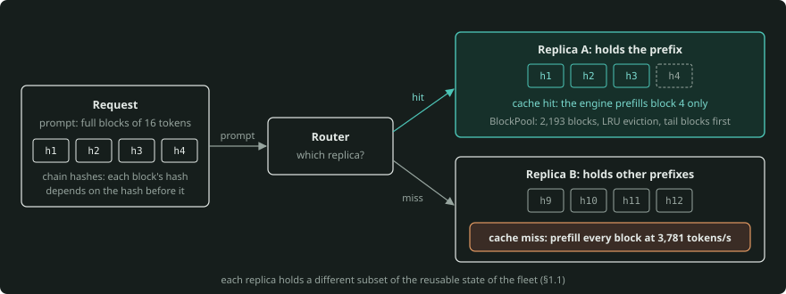
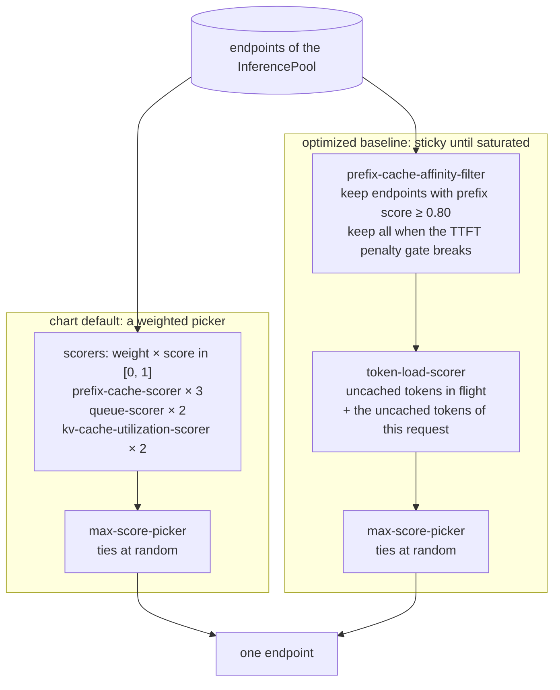
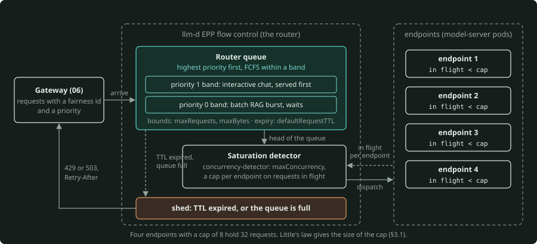
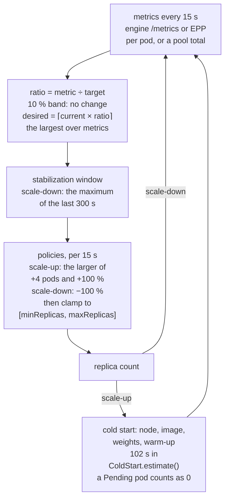
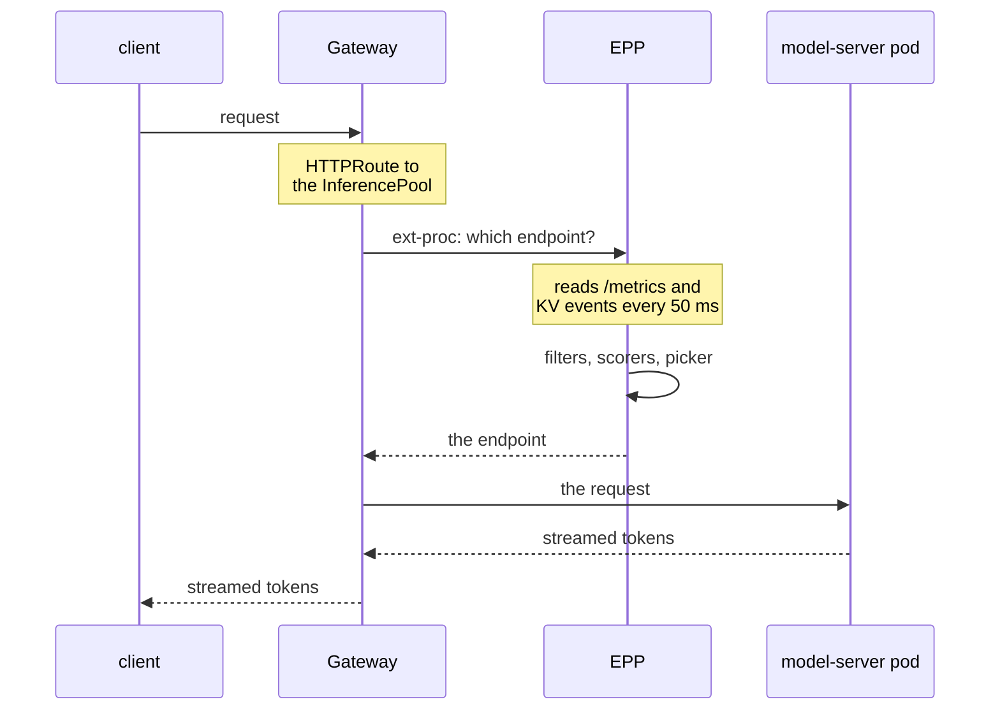

# Orchestrating a fleet of engines: routing, autoscaling, disaggregation and KV-cache tiers

*This is the primer for layer 05 of the stack. The date of the fact check is 26 September 2026. The
[Verify list](#verify-list) collects the product details that change.*

*[`orchestrator-core`](orchestrator-core/) (package `fleetsim`) calculates each number here, or the primer cites a
source for it. When the core calculates a number, the name of the function is next to the number. The numbers from
the simulator have the label **simulated**. They come from an engine model that uses spec-sheet arithmetic, not from
a GPU.*

One inference engine (vLLM, SGLang, TensorRT-LLM) makes a GPU into a token server. Layer 04 (the `serving-engine`
topic, [`04-inference-engine/serving-engine/`](../../04-inference-engine/serving-engine/)) is about what occurs
inside the engine. This layer is about many engines. It answers three questions:

- Which replica gets a request?
- How many replicas are there?
- Is it necessary that the prefill and the decode of one request run on the same GPU at all?

The primer covers these topics:

- routing signals and algorithms,
- flow control,
- autoscaling,
- prefill/decode disaggregation,
- KV-cache tiers beyond HBM,
- multi-model and LoRA routing,
- the Kubernetes-native stack that implements all of it in 2026 (Gateway API Inference Extension, the llm-d Router,
  GKE Inference Gateway, NVIDIA Dynamo).

The primer assumes that you know the engine basics: prefill against decode, TTFT and TPOT, the KV cache and paged
blocks. These basics are in [`00-foundations/gpu-capacity-planning/PRIMER.md`](../../00-foundations/gpu-capacity-planning/PRIMER.md),
[`04-inference-engine/kv-cache/kv-cache-primer.md`](../../04-inference-engine/kv-cache/kv-cache-primer.md) and
[`04-inference-engine/paged-attention/paged-attention-primer.md`](../../04-inference-engine/paged-attention/paged-attention-primer.md).

---

## The one-minute version

- **A replica is a stateful cache, not a stateless server.** The replica that gets a request changes the cost of
  the request. The replica that already holds the prefix of the request does not do most of the prefill. Also,
  requests differ by one to two orders of magnitude in prefill work, KV memory and residency time. Thus a count of
  requests (round-robin, least-connections) does not balance the work.
- **Routing is a knob between locality and load.** Prefix affinity increases the hit rate until a hot prefix
  overloads its replica. A router that balances load spreads the work, but the replicas must prefill everything
  again. Production routers (the llm-d endpoint picker) filter the endpoints. Then they score prefix match, queue
  depth and KV use with weights, and they select the maximum. Or they stay sticky until an estimated TTFT penalty
  tells them to spread the work.
- **Autoscale on work in flight, not GPU utilisation.**
    - The rule of the HPA is $\lceil \text{current} \times \text{metric} / \text{target} \rceil$. It has a 10 %
      band, a 5-minute scale-down memory and a rate limit on scale-up.
    - Continuous batching puts "GPU util" at its maximum when the replica uses only a fraction of its capacity.
      Queue depth alone shows zero until the cliff. A request count is correct only while the requests are alike.
      Thus mixed traffic needs seconds of prefill backlog plus KV occupancy.
    - The cold start (node, image, weights, warm-up) decides the tail of a traffic step. Thus headroom is part of
      the design.
- **Disaggregate prefill from decode only when the numbers say so.** Disaggregation removes the stall that a
  prefill chunk puts on every decode. Its cost is a KV transfer
  $(\text{prompt tokens} \times \text{KV bytes/token} \div \text{link bandwidth})$ plus two pools that must match
  the input/output mix of the traffic. The first thing to try is a smaller prefill chunk.
- **Agent sessions need KV beyond HBM.** Their working set
  $(\text{sessions} \times \text{context} \times \text{KV bytes/token})$ is much larger than HBM. An offload to
  DRAM/NVMe/remote tiers is better whenever the tier is faster than the rate at which prefill makes KV. Sticky
  routing or a shared tier keeps a session near its KV.

---

## 1. Why a layer above the engine

### 1.1 Replicas are stateful caches

In HBM, an engine keeps the KV cache of each request that runs. With prefix caching, the engine also keeps the
freed blocks. The engine records each full block of 16 tokens under a chain hash
$h_i = H(h_{i-1}, \text{tokens of block } i)$. A later request whose prompt starts with the same tokens uses those
blocks again, and the engine does not compute them again (`fleetsim.replica.BlockPool`). This is the same scheme as
the automatic prefix caching of vLLM. The engine evicts the freed blocks in LRU order, the tail blocks of a request
first.

Thus each replica holds a different subset of the reusable state of the fleet, and this subset changes all the
time. The router decides which subset a request can use.



*The same request costs a different prefill on each replica. Replica A holds the first three block hashes and prefills only the last block. Replica B holds other prefixes, so the engine prefills every block again at 3,781 tokens/s (§1.1, `fleetsim.replica.BlockPool`).*

This primer uses one engine model in all sections (`fleetsim.replica.engine_profile()`). The example is an 8B bf16
model on one L4:

- The weights are 16 GB.
- The KV pool is `(0.9 × 24 GB − 16 GB − 1 GB) ÷ (131,072 B/token × 16)` = **2,193 blocks = 35,088 tokens**.
- Each step reads all the weights one time (**53.3 ms** at 0.3 TB/s).
- Prefill runs at `121 TFLOP/s × 0.5 MFU ÷ (2 × 8 B)` = **3,781 tokens/s**.

The cost of one step is (`fleetsim.replica.step_time()`):

$$
\text{overhead} + \max\left(\frac{\text{tokens}}{\text{prefill speed}}, \text{weight read} + \text{context tokens} \times \text{KV read time}\right)
$$

| One engine step (simulated, 8B on an L4) | Time |
|---|---|
| decode, 16 requests at 2,000 tokens of context | 70.3 ms |
| a 2,048-token prefill chunk | 545 ms |
| the same on an H100 (`H100_8B`): decode 16 / chunk 2,048 | 9.0 ms / 69 ms |

Decode is memory-bound. Thus batching costs almost nothing. Prefill is compute-bound, and each decode in the same
step waits for the prefill. Layer 01 ([roofline](../../01-hardware-gpu-fabric/roofline-and-fabric/PRIMER.md) §3)
shows where the two regimes come from, and this layer uses them.

The model leaves out two things:

- The prefill compute is linear in tokens. The model omits the
  ${\sim}4 \times \text{layers} \times d_{\text{model}} \times \text{context}$ FLOPs per token of attention. These
  FLOPs add about +10 % for a 6,000-token prompt on the 8B model, +16 % at 10,000 and +50 % at 30,000.
- A small prefill chunk costs no more per token than a large one.

Thus each long-context prefill time and recompute time in the sections after this one is optimistic, by those
amounts.

### 1.2 Why round-robin and least-connections fail

Web load balancers assume small, similar, stateless requests. LLM requests are not small, not similar and not
stateless:

- **Cost spread.** A request uses a replica in three currencies: prefill compute, KV blocks and residency time.
  A 6,000-token RAG prompt has 5× the prefill of a 1,200-token chat turn and 8× its KV-block-seconds. Across a
  realistic chat + RAG mix, the p99 request costs about **30×** the p1 request (simulated, notebook 01). The output
  length is unknown until the generation stops.
- **Capacity is memory.** A replica is full when its KV blocks are full. An overload shows as queues and
  preemption, not as CPU pressure. The number of requests that fit is a KV question
  ([capacity planning](../../00-foundations/gpu-capacity-planning/PRIMER.md), formula 2).
- **Connections are not work.** A streaming response holds its connection for the full decode, 0.3 s or 30 s.

The test used four L4 replicas near saturation with that chat + RAG mix (simulated, notebook 01). The p95 TTFT was
6.3 s for random choice, 4.1 s for round-robin and 1.9 s for power-of-two. It was 1.7 s for least-outstanding and
1.3 s for least-waiting (the scraped engine queue). The cause of TTFT is the requests that wait in the engine. The
nearer the signal is to that cause, the better the tail.

### 1.3 The three decisions

```
                  ┌──────────────────────── the orchestration layer ─────────────────────────┐
 request ──►  gateway (06)  ──►  which replica?        how many replicas?      how to split the work?
               auth, quotas       router / endpoint     autoscaler on a         prefill pool ─KV─► decode pool
               admission          picker (§2, §3)       fleet signal (§4)       KV tiers beyond HBM (§5, §6)
                                        │                       │                          │
                                        ▼                       ▼                          ▼
                               ┌─ engine ─┐ ┌─ engine ─┐ ┌─ engine ─┐   (layer 04: batching, prefix cache)
                               └──────────┘ └──────────┘ └──────────┘   (layer 03: pods, nodes, GPUs)
```

The router decides **which replica** for each request, in milliseconds. The autoscaler decides **how many** every
15 s to minutes. You decide **how to split** at design time, and you adjust the split again when the traffic mix
changes. Admission control and per-tenant rate limits are one layer up, in the gateway
([06 scaling primer](../../06-gateway/scaling-admission-cost/agentic-scaling-lab/docs/01-scaling-primer.md) §5.3).

---

## 2. Routing signals and algorithms

### 2.1 The signals

| Signal | Source | Fresh? | What it predicts |
|---|---|---|---|
| requests in flight to each replica | the router's own counters | always | concurrency, not size |
| in-flight **tokens** (uncached prompt tokens sent, not yet prefilled) | the router's own counters | always | prefill backlog, and thus TTFT |
| `vllm:num_requests_waiting` | engine `/metrics` | scrape age | queues, and thus TTFT, directly |
| `vllm:num_requests_running` | engine `/metrics` | scrape age | batch size, and thus ITL |
| `vllm:kv_cache_usage_perc` (0–1) | engine `/metrics` | scrape age | memory headroom, and thus preemption risk |
| prefix match, **approximate** | router's record of what it sent | never sees evictions | cache hit, if the blocks are still resident |
| prefix match, **precise** | engine KV events (blocks stored/removed, over ZMQ) | event lag | cache hit |
| adapter resident, session id | `vllm:lora_requests_info`, headers | scrape age / exact | adapter swaps, session locality |

By default, the llm-d endpoint picker reads the engine metrics again every 50 ms. A router that gets its data from
a 15-second Prometheus scrape sees much older data. The metric names are those of vLLM V1
(`vllm/v1/metrics/loggers.py`). When the engine exposes a counter, the counter gets a `_total` suffix.

### 2.2 Load-only algorithms

- **Round-robin.** It is fair in count, but it is blind to cost and cache (`fleetsim.routers.RoundRobin`).
- **Least outstanding.** It selects the argmin of what the router has in flight (`LeastOutstanding`). It is exact
  while one router sees all the traffic. With several router replicas, each replica sees only its share.
- **Power of two choices.** It samples two replicas at random and takes the less loaded one (`PowerOfTwo`).
    - If $n$ requests go to $n$ servers at random, the maximum load is about $\ln n / \ln \ln n$. With two choices,
      it decreases to about $\ln \ln n / \ln 2$ (the papers of Azar, Broder, Karlin and Upfal, and of
      Mitzenmacher).
    - It needs no global scan, and stale data has only a small effect on it. The router selects the idle replica
      only when it samples that replica. The probability that the router samples the idle replica is $1 - C(n-1,\,2)/C(n,\,2)$ = 1/2 for 4
      replicas, and $2/{n}$ in general. Thus a burst cannot all go to one stale minimum.
    - The `LEAST_REQUEST` balancer of Envoy is this algorithm (two choices by default).

**Herding** is the failure that P2C prevents. In one test, bursts of 16 req/s went to a router that selected the
argmin of scraped `num_requests_running` (simulated, notebook 01). The p95 TTFT increased from 0.28 s (50 ms-old
metrics) to 0.91 s (2 s) and 1.62 s (10 s). P2C on the same stale data stayed at 0.27–0.39 s. The router's own
counters were immune.

### 2.3 Locality: prefix hashing, session affinity, bounded loads

**Prefix hashing** puts the hash of the first $k$ blocks of a request on a consistent-hash ring. Each replica owns
~64 virtual points. When you add one of $n$ replicas, only ${\sim}1/n$ of the keys move
(`fleetsim.routers.HashRing`, tested). Each request with the same system prompt goes to the same replica. This
gives maximum locality and no load awareness. A hash of the **session id** gives agent-session affinity instead.

**Consistent hashing with bounded loads** (Mirrokni, Thorup, Zadimoghaddam, SODA 2018) sets this cap on each
replica:

$$
\text{capacity} = \left\lceil \frac{(1 + \varepsilon) \times (m + 1)}{n} \right\rceil
$$

Here $m$ is the number of requests in flight, and $n$ is the number of replicas. The +1 is for the request that the
router places now. The router goes clockwise past full replicas (`ConsistentHashBoundedLoad.capacity()`). With
$\varepsilon$ = 0.25, $n$ = 4 and $m$ = 7, the cap is $\lceil 1.25 \times 8 \div 4 \rceil = 3$. For 100 requests
with one key, no replica ever holds more than 32. Pure hashing puts all 100 on one replica.

$\varepsilon$ is the locality/balance knob, and it has a hard guarantee. Envoy and HAProxy expose the same idea as a
hash balance factor (verify the field names for your version).

### 2.4 The endpoint picker: filters → scorers → picker

The endpoint picker (EPP) of the llm-d Router runs a **scheduling profile** for each request. The profile has
three parts:

- a chain of **filters**, which remove endpoints,
- weighted **scorers**, each of which returns a score clamped to [0, 1],
- a **picker** (by default `max-score-picker`), which breaks ties at random.

`fleetsim.routers.WeightedScorer` copies that shape. Its scorers use the upstream plugin definitions:

| Plugin | Score or rule | fleetsim |
|---|---|---|
| `prefix-cache-scorer` | $\text{matched prefix blocks} \div \text{total prompt blocks}$ (as an option, blended with a squared match-length term) | `PrefixCacheScorer` |
| `queue-scorer` | $(\mathrm{maxQ} - q) \div (\mathrm{maxQ} - \mathrm{minQ})$ over wait-queue length. If all lengths are equal, all get 1.0. | `QueueScorer` |
| `kv-cache-utilization-scorer` | `1 − kv_cache_usage` | `KVCacheUtilizationScorer` |
| `token-load-scorer` | $1 - \min(1, \text{tokens} \div \text{queueThresholdTokens})$ (default 4,194,304). Here tokens = the endpoint's uncached prompt tokens in flight + the tokens of this request that the endpoint has not cached. | `TokenLoadScorer` |
| `prefix-cache-affinity-filter` | Keep endpoints with prefix score ≥ 0.80. The estimated TTFT of an endpoint is its uncached in-flight tokens ÷ `peakPrefillThroughput`. If the estimate of the best sticky endpoint is more than `maxTTFTPenaltyMs` above that of the best non-sticky one, keep all. The value of `maxTTFTPenaltyMs` is 18,000, and 0 = always stick. | `PrefixAffinityFilter` (counts its gate breaks) |
| LoRA affinity | Keep endpoints with the adapter loaded. If there are none, keep those with a free adapter slot. | `LoraAffinityFilter` |

A configuration names the plugin instances and puts them together into profiles:

```yaml
apiVersion: llm-d.ai/v1
kind: EndpointPickerConfig
plugins:
- type: prefix-cache-scorer
- type: queue-scorer
- type: kv-cache-utilization-scorer
schedulingProfiles:
- name: default
  plugins:
  - pluginRef: prefix-cache-scorer
    weight: 3                      # the llm-d-router Helm chart's default; tune on your traffic (notebook 02)
  - pluginRef: queue-scorer
    weight: 2
  - pluginRef: kv-cache-utilization-scorer
    weight: 2
```

The 3:2:2 weights are not a random example. They are the default profile that the llm-d-router Helm chart installs
(`default-plugins.yaml` in v0.10.0, when its latency predictor is off) `(verify)`. The `default-weighted` preset of
the lab has the same weights. A default is a start point, not the result of an adjustment. §2.5 shows that the optimum moves with
the workload.

If a configuration omits a piece, a default goes in its place (a `max-score-picker`, a `single-profile-handler`,
weight 1.0). In September 2026, the llm-d *optimized baseline* uses a different composition:
`prefix-cache-affinity-filter` plus `token-load-scorer`, "sticky until saturated"
(`fleetsim.routers.sticky_until_saturated()`). The README of the filter gives the reason. A weighted prefix scorer
with a max-score picker makes hot spots of popular prefixes. But a filter with an explicit load gate states the
trade-off in one number, in TTFT seconds.



*Two compositions of the EPP scheduling profile (§2.4). The chart default adds the weighted scores and takes the maximum. The optimized baseline filters first: it keeps the sticky endpoints until the TTFT penalty gate breaks, then the token-load scorer decides.*

Two details are important. First, the load scorer after the filter counts the *uncached* tokens of this request on
each endpoint. Thus a warm cache decreases the cost of a warm endpoint, in the same units as the load that the
scorer compares. A fully warm endpoint with 2,097,152 tokens in flight gets a score of exactly 0.5. A cold endpoint
with 100 fewer tokens in flight gets a lower score. The cause is that the uncached tokens of this 160-token request
count against the cold endpoint (`TokenLoadScorer`, tested).

Second, the gate sees only the **prefill backlog**: the in-flight uncached tokens ÷ `peakPrefillThroughput`. Thus
the gate is for prefill-bound traffic. For decode-bound traffic, upstream uses the filter together with
`active-request-scorer`. The default `peakPrefillThroughput` is 15,928 tokens/s, a measurement for Qwen3-32B on two
H100s (TP=2). This value is specific to the hardware, and you must calibrate it again on other hardware.

The KV router of NVIDIA Dynamo gives the same trade-off as a cost in block units:
`cost = prefill_load_scale × (prefill blocks − overlap credit × cached blocks) + decode blocks`. The lowest cost
wins. As an option, the router samples with a temperature. Both routers arrived at the same idea. They count the
load in the *same units* as the work that the cache saves, that is, the tokens or blocks still to compute.

### 2.5 The locality-vs-load tension, in numbers

The workload is agent sessions from six agents with 2,000-token system prompts. The agents are Zipf-popular: the top
agent sends ~40 % of sessions. Each turn sends its history again. The fleet is four L4 replicas (simulated,
notebook 02). The SLO is TTFT ≤ 1 s and TPOT ≤ 150 ms:

| Router | Hit rate | TTFT p95 | Imbalance (max/mean tokens) | SLO attainment |
|---|---|---|---|---|
| round-robin | 0.52 | 4.35 s | 1.16 | 0.68 |
| power-of-two | 0.51 | 3.38 s | 1.04 | 0.61 |
| prefix hash on the system prompt | 0.63 | 48.7 s | 2.65 | 0.41 |
| prefix hash on the session | 0.84 | 1.01 s | 1.27 | 0.95 |
| bounded-load hash, $\varepsilon$ = 0.25 | 0.73 | 1.52 s | 1.48 | 0.86 |
| EPP 3:2:2 (prefix : queue : KV), approximate index | 0.87 | 0.37 s | 1.18 | 0.99 |
| affinity filter + token load, 18 s gate (the optimized baseline, peak prefill recalibrated to the L4) | 0.84 | 1.13 s | 1.44 | 0.94 |
| the same with a 0.5 s gate | 0.85 | 0.68 s | 1.21 | 0.97 |

A sweep of only the prefix weight (queue and KV at 2) shows the tension:

- weight 0: hit rate 0.55, p95 1.9 s,
- weight 3: 0.87, 0.37 s,
- weight 30: 0.82, 3.4 s with imbalance 2.3.

The hit rate saturates early, but the imbalance continues to increase. With a hotter prefix (Zipf 2.0, the top
agent sends two thirds of the sessions), the p95 of pure prefix hashing reached 81 s. The EPP held 0.47 s (the
affinity filter: 1.37 s). The knob has an optimum that depends on the workload. Thus adjust the knob on a replay of
real traffic, and monitor the hit rate *and* the per-replica load.

On this workload, the optimized-baseline rows are behind the 3:2:2 chart default. The reason is what their gate can
see. With the upstream 18 s penalty and with 2 s, the gate broke stickiness **0 times in 710** routing decisions
with a sticky endpoint. The hot replicas here become slow because of KV pressure and decode residency
(see the preemptions), not because of a prefill backlog. Thus the estimate stays small, and the router is only
sticky with a token-load tie-break. A 0.5 s gate broke 14 times and recovered most of the gap.

The filter gives robustness without an adjustment of the weights, and one knob in TTFT units. Before you rely on
the filter, make sure that the prefill backlog is what makes your hot replicas slow. Also monitor the break counter
(`llm_d_epp_prefix_cache_affinity_filter_decisions_total{outcome="load_override"}`).

**The ranking itself is not portable.** The order changes with the point where the engine has contention, and
with the workload. The lab ([`inference-gateway-lab`](inference-gateway-lab/), notebook
[`02_scorer_weights_and_hot_prefixes`](inference-gateway-lab/notebooks/02_scorer_weights_and_hot_prefixes.ipynb))
runs the two compositions on a hot-prefix agent workload. Its emulated backends prefill one request at a time on
each replica, so the tokens that wait for prefill *are* the delay. The affinity gate and the token-load scorer
measure exactly these tokens. In that lab, sticky-until-saturated is better than 3:2:2 on TTFT p90 (the notebook
asserts that order).

On an engine that becomes slow because of KV pressure and decode residency, as in the table of this section, the
order reverses. Chunked prefill, other prompt lengths or a hotter prefix can move it again. Thus compare routers on
a replay of your own traffic against your own engine. Never compare them on a table that someone else made.

### 2.6 Approximate vs precise prefix indexes

An **approximate** index records the prompt blocks of each request that the router sends to each replica, with an
LRU bound (`ApproxPrefixIndex`). It never learns about evictions. A **precise** index gets its data from the KV
events of the engines (`PreciseIndex`). The llm-d counterpart of a precise index is the `precise-prefix-cache-producer`. Its
block size must match the `--block-size` of the engine.

In the simulations here, the approximate index stays within noise of the precise one. The approximate index stayed within noise even when its
size was 15× too large and 73 % of its entries were phantoms. The cause is that agent turns come back within
seconds, and the entries that the router actually reads are fresh.

The difference is important in two cases. The first case is a distant reuse (long tool pauses, many tenants,
small caches). In that case, the KV is also gone, and only tiers help (§6). In the second case, you want the router
to see offloaded tiers, or to share one view across router replicas.

---

## 3. Flow control and priorities

### 3.1 Why queue in the router

When a request is in the wait queue of an engine, it must stay on that replica, even if another replica becomes
free first. The **flow control** of the llm-d EPP holds requests in the router instead. Its feature gate is
`flowControl`, which is off by default in v0.10.0 (§3.2 tells what priority does without it). Flow control sends a
request to an endpoint when a **saturation detector** says that the endpoint has room. This is "no-regret
scheduling": the router makes the decision with the latest information. A burst waits in one place, where the
router can put its requests in order, give them priorities and shed them.

The default detector is `utilization-detector`. To prevent telemetry lag, the flow-control guide recommends
`concurrency-detector`. This detector is a per-endpoint cap on in-flight requests or tokens. The upstream default
is `maxConcurrency` 100, and the example of the optimized-baseline guide uses `maxConcurrency: 8`. The values of the
flow-control guide, adjusted for Qwen3-32B on 16 H100s, use 132. The queue has bounds (`maxRequests`, `maxBytes`), and
requests expire (`defaultRequestTTL`).

`fleetsim.FlowControl` models the concurrency-detector path. It sends a request only to an endpoint under its cap.
If no endpoint is under its cap, it holds the request in the router, highest priority first and FCFS within a
priority. It counts the TTL rejections and the queue-bound rejections as `shed`.



*Flow control holds a burst in the router, with the higher priority band first and FCFS within a band (§3.1). The router sends a request only to an endpoint under its cap (the concurrency-detector). The router sheds a request after its TTL, or when the queue is full, and the gateway returns 429 or 503.*

Little's law gives the size of the cap:

$$
\text{in-flight} = \text{arrival rate} \times \text{time in system}
$$

Four endpoints with a cap of 8 hold 32 requests. If each request takes 10 s end to end, the pool completes 3.2 req/s
at the most. All traffic above that waits in the router. A cap that is too low does not give the GPUs sufficient
work. A cap that is too high never makes a queue, so the router puts nothing in a new order.

The test used four L4 replicas with two flows. One is an interactive chat flow (1 req/s, priority 1). The other is a
batch RAG burst (from 0.2 to 1.6 req/s for two minutes, priority 0). The SLO was TTFT ≤ 2 s (simulated, notebook
01):

| Dispatch | Interactive TTFT p95 | Batch TTFT p95 | Preemptions | Router queue (max) | SLO attainment |
|---|---|---|---|---|---|
| immediately (queue in the engines) | 2.87 s | 8.75 s | 56 | 0 | 0.83 |
| router queue, cap 4, priorities | 2.75 s | 180 s | 0 | 132 | 0.51 |
| router queue, cap 32, priorities | 2.87 s | 8.75 s | 56 | 0 | 0.83 |
| router queue, cap 13 (Little's law), priorities | 1.50 s | 7.16 s | 48 | 8 | 0.84 |

The burst puts 2.52 req/s × 19.9 s ≈ 50 requests in flight (the simulator saw 46). That is 12.5 per endpoint, so
the cap is 13. The interactive flow goes to the front of the router queue. The batch flow waits there, and not
behind other prompts inside an engine. A cap that also limits the KV demand (4 here) removes preemption, but the
cost is idle capacity.

### 3.2 Priorities: `InferenceObjective`

A fairness id and a priority put each request in a flow. The `InferenceObjective` resource (`llm-d.ai/v1alpha2`,
with `spec.poolRef` and `spec.priority` as an int32) sets the priority for a workload on a pool. A negative value is
valid, and an unset priority counts as 0. The effect of the number depends on the `flowControl` feature gate:

- **Gate on (flow control):** requests wait in the router by priority band, and the router always serves a higher
  band first. The router enforces fairness only *within* a band (the default ordering is global FCFS). The API
  documentation of the resource describes this behaviour, and `fleetsim.FlowControl` models it (the table in §3.1).
- **Gate off (the llm-d-router v0.10.0 default):** there is no router queue and no ordering. The legacy admission
  check only marks negative-priority objectives as *sheddable*. While the saturation detector reports saturation of
  the pool, the router rejects their requests with HTTP 429. It admits and routes each request at priority 0 or
  above as usual. Strict priority ordering needs the gate on `(verify)`. The router of the lab implements this
  legacy path (`inference-gateway-lab`, `igwlab/router/server.py`).

Priority is important only when requests wait in a queue, that is, exactly when the pool is at saturation. Thus
priority is the tool for "the interactive agent before the nightly eval" (in `fleetsim`, `Request.priority`). With
the gate off, the only lever is a negative priority for the nightly eval. Thus the router refuses the eval at
saturation, and does not delay it.

### 3.3 Saturation, shedding and where admission lives

Router-side queues put a limit on latency only if something says no at some time. The router rejects requests after
their TTL, and a full queue rejects new arrivals. The gateway changes these rejections into `429` or `503` with
`Retry-After`. The table shows which layer decides what:

| Question | Layer | Mechanism |
|---|---|---|
| Is this tenant within budget? Is it necessary to degrade or shed? | 06 gateway | token buckets, in-flight caps, degrade levels, in [`scalelab/admission.py`](../../06-gateway/scaling-admission-cost/agentic-scaling-lab/scalelab/admission.py) |
| Which request goes next, and to which replica, when replicas are busy? | 05 router | flow control, priorities, saturation detection |
| Which requests share the next engine step? | 04 engine | continuous batching, token budget, preemption |

The first two rows absorb a burst in milliseconds. Autoscaling (§4) restores the capacity minutes later.

---

## 4. Autoscaling



*The HPA loop of §4.1 to §4.3. Every 15 s the controller turns a metric into a replica count through the band, the stabilization window, the policies and the clamp. A scale-up becomes capacity only after the cold start, and the new pod counts as 0 while it is Pending.*

### 4.1 The HPA algorithm, exactly

In each sync period (15 s), the Horizontal Pod Autoscaler does this calculation for each metric (`fleetsim.autoscale`
copies `pkg/controller/podautoscaler` of `kube-controller-manager`):

$$
\begin{aligned}
\text{ratio} &= \frac{\text{currentMetricValue}}{\text{desiredMetricValue}} \\
\text{desired} &= \lceil \text{currentReplicas} \times \text{ratio} \rceil \quad \text{unless} \quad 1 - \text{tol}_{\text{down}} \le \text{ratio} \le 1 + \text{tol}_{\text{up}}
\end{aligned}
$$

Here the ratio is a per-pod average, in milli-units, and the tolerance is 0.1 in each direction.

Worked examples (`pods_metric_replicas()`):

- 3 pods at 200m against a 100m target give 6.
- 4 pods at 50m give 2.
- 5 pods at a ratio of 1.08 give 5 (inside the band).

Then:

1. **Pods without a sample.** For a Pods metric other than CPU, the controller sorts pods by phase, not by
   readiness. A *Pending* pod (scheduling, image pull) counts as 0 on a scale-up. On a scale-down, the controller
   drops it. A *Running* pod with no sample yet is *missing*. For example, a vLLM that still loads weights exports
   no `/metrics`. A missing pod counts as 0 on a scale-up and as the target on a scale-down. (The controller
   examines the Ready condition only for CPU.)
    - On a scale-down, the target fill-ins make the controller more cautious. Two pods at half the target, with two
      missing, give $\lceil 0.75 \times 4 \rceil = 3$, not 1.
    - On a scale-up, the zeros never increase the answer. The answer is
      $\lceil \text{sum of the samples} \div \text{target} \rceil$ in both cases. The zeros only cause the
      controller to skip a change that ends inside the band, or that reverses direction.
    - Two ready pods with 10 queued requests each (target 2) ask for $\lceil 20 \div 2 \rceil = 10$. The answer is
      not 50 (10 current replicas × a ratio of 5), because the ratio multiplies the pods that *reported*. With 8
      Pending, $(10 + 10 + 0 \times 8) \div 10 \div 2 = 1.0$ holds at 10. At 10.5 each (1.05), it still holds. A
      calculation that ignores the Pending pods gives 11.
    - The other side of this: a capped metric increases the fleet by a factor of cap/target at the most for each
      cold start (§4.2). While a replica starts, `fleetsim` counts it as Pending for its full cold start (the
      same on a scale-up).
2. **Multiple metrics:** calculate each one, then use the largest.
3. **Stabilization** (`HPA.step()`): scale-down uses the **maximum** recommendation of the last
   `stabilizationWindowSeconds` (default 300). Scale-up uses the minimum over its window (default 0).
4. **Policies**: in each `periodSeconds`, each policy permits `Pods: +value` or `Percent: ×(1 ± value/100)`. Both
   are relative to the replica count at the start of the period. `selectPolicy: Max` (default) selects the policy
   that permits the most change. `Min` selects the least change, and `Disabled` permits no change.
    - Defaults: scale-up is `max(+4 pods, +100 %)` per 15 s. From 3 replicas toward 40, this gives 7, 14, 28, 40.
      Scale-down is `−100 %` per 15 s after the window.
    - A `Percent` scale-down truncates the count that stays. At 10 % per 60 s, the count goes from 80 to 72. It
      holds while those 8 are inside the period, then it goes from 72 to 64.
5. **Clamp** to `[minReplicas, maxReplicas]`.

Per-HPA tolerances are under `behavior.scaleUp.tolerance` / `scaleDown.tolerance` (the `HPAConfigurableTolerance`
feature). Object and External metrics with an `AverageValue` target use
$\text{desired} = \lceil \text{total} \div \text{target} \rceil$. For example, `external_metric_replicas()` gives 10
for 95 queued requests against 10 per pod. This rule also works from zero replicas.

### 4.2 Which signal

The rule assumes three things about the metric:

- It **grows in proportion to load per replica**.
- It **rises before latency does**.
- It **has no cap**.

The table shows one L4 replica under a chat load that increases (simulated, notebook 03):

| req/s | "GPU util" | running | KV usage | waiting | TTFT p95 |
|---|---|---|---|---|---|
| 0.2 | 0.70 | 1.8 | 0.04 | 0 | 0.24 s |
| 0.5 | 1.00 | 4.4 | 0.09 | 0 | 0.25 s |
| 2.0 | 1.00 | 26 | 0.35 | 0.3 | 0.31 s |
| 3.5 | 1.00 | 60 | 0.75 | 0.3 | 0.64 s |

"GPU utilisation" is the fraction of time when a kernel runs. This is what `nvidia-smi` reports. It is 1.00 at a
seventh of the load that the replica can serve within a 1 s TTFT SLO. The cause is continuous batching: it always
runs a step while any request is in flight. Layer 02 §8 has the DCGM fields that measure more.

The next table shows a step from 1.5 to 7.5 req/s, with each HPA on one signal. The HPAs have min 1, max 8 and a
30 s cold start (simulated, notebook 03):

| Signal (target) | TTFT p95 | SLO attainment | GPU-hours | Behaviour |
|---|---|---|---|---|
| GPU util (0.7) | 0.26 s | 1.00 | 1.80 | scales to max early and never scales down |
| GPU util (0.95) | 428 s | 0.04 | 0.33 | never scales |
| waiting per pod (2) | 17.5 s | 0.89 | 1.63 | sawtooth: the queue empties, the HPA scales down into the next cliff |
| KV usage per pod (0.5) | 7.3 s | 0.90 | 0.80 | proportional but capped at 1.0: increases one cold start at a time |
| in-flight total, External (40 per pod) | 3.6 s | 0.94 | 0.91 | moves with the demand. The rest of its tail is the cold start. |

The targets come from the load test in the first table of §4.2. The load test gives the per-replica value at the
highest load that still meets the SLO (3.5 req/s: 60.6 requests in flight, KV 0.75). Each target is that value
minus a one-third margin for the cold start. This gives 40 in flight and KV 0.5 (`pick_target` in notebook 03).

In-flight requests are the requests that run plus the requests that wait. They also contain the requests that the
router or the gateway holds. The queue-based KEDA path of llm-d uses this signal (the EPP flow-control queue plus the
requests that run). That path needs the `flowControl` feature gate (§3.1), which is off
by default in v0.10.0. With the gate off, the EPP holds no queue, and the router of the lab has no queue either.
Thus requests wait in the engines.

In that case, the same signal is the sum over pods of the engines' own `vllm:num_requests_running` plus
`vllm:num_requests_waiting`. This sum is an External metric, as in the table. The `hpa_manifest()` of the lab also
writes the two as one Pods-metric HPA (`extra_metrics`).

In both cases, the signal counts *requests*. It is safe while the requests are alike, and it is incorrect when the
mix changes. The same 40-per-pod HPA ran on a chat + RAG step with about half the rate of the chat step. It had
~15 % of requests RAG with ~6,000-token prompts, three quarters of the prefill that the prefix cache does not cover.
Thus the RAG requests had three quarters of the uncached prefill. The HPA reached 0.69 SLO attainment (TTFT ≤ 2 s) against 0.94 on chat (simulated, notebook 03).

The **token-aware** KEDA path of llm-d measures work instead. It has two signals, and the HPA takes the larger
recommendation (`Autoscaler(..., "backlog_s", ..., also=[("kv", ...)])`):

- the prefill backlog in seconds (EPP in-flight tokens ÷ `peakPrefillThroughput`), compared with a share of the
  TTFT SLO,
- the KV occupancy, for decode.

One such HPA used 0.25 s of backlog per replica plus KV 0.5. It met both budgets without a new adjustment: 0.94 on
chat at 1.21 GPU-hours, and 0.91 on the mix.

This path needs no flow-control queue. Thus it is the path to use while the `flowControl` gate is off. The KV usage
comes from the engines. The backlog comes from `llm_d_epp_inflight_tokens` of the EPP, which its
`inflight-load-producer` plugin publishes (llm-d's token-aware guide, fetched 2026-09-26, verify). Latency-driven
variants scale on the ratio of estimated or measured TTFT to the SLO.

### 4.3 Cold start anatomy

The cold start goes from "the HPA said +1" to "the replica serves" (`fleetsim.autoscale.ColdStart`). It has four
terms:

- **node**: 0 if a GPU node is free. It is minutes if the cluster autoscaler must create one, or longer if you
  cannot get the GPU (layer 03 §7).
- **image**: serving images with CUDA libraries have a size of many gigabytes.
- **weights**: $\text{bytes} \div \text{storage bandwidth}$ (layer 01 §6).
- **engine warm-up**: KV allocation, CUDA-graph capture, compilation.

`ColdStart.estimate()` uses a free node, a 10 GB image at 0.25 GB/s, 16 GB of weights at 0.5 GB/s and 30 s of
warm-up. It gives 40 + 32 + 30 = **102 s** (these are assumptions to replace with measurements). The Kubernetes-side
solutions are in layer 03 §8: image streaming, secondary boot disks, GCS FUSE, Hyperdisk ML, startup probes.

The cold start sets how many requests wait in a queue during a step:
$\text{backlog} = (\text{peak} - \text{capacity now}) \times \text{cold start}$. The `cold_start_backlog` of
notebook 03 gives 408 requests for a 7.5 req/s step on one replica that holds the SLO to 3.5 req/s. It uses the
102 s cold start from `ColdStart.estimate()`. With the in-flight signal, the results were (simulated, notebook 03):

- cold start 0 s: TTFT p95 0.32 s,
- 30 s: 3.6 s,
- 120 s: 75 s,
- 120 s with `minReplicas: 3`: 0.29 s on *fewer* GPU-hours (0.75 against 1.36).

The last case used fewer GPU-hours because the reactive fleet scaled too far to drain its backlog. Warm headroom is
a decision about cost and latency, not a waste line.

### 4.4 Scale to zero, and KEDA

There is no pod metric to read from zero pods. Thus `minReplicas: 0` needs an Object or External metric. If the HPA
has no such metric, the API server rejects the HPA. `minReplicas: 0` also needs the `HPAScaleToZero` feature.

KEDA is the usual route. It does the activation between 0 and 1 itself, and it creates an HPA with External metrics for the range between 1 and N. Its Prometheus scaler can
read the queue metrics of the EPP directly.

The cost is that the first requests of each burst wait for the full cold start. Also, on a GPU node pool, you save
money only when the *node* goes:

- The pod goes 5 minutes after the burst (the stabilization window).
- The cluster autoscaler removes the empty node after 10 more minutes without use (layer 03 §7.1).
- The next burst waits for a new node (~300 s to allocatable GPUs, an assumption of layer 03) plus the 102 s of
  the pod.

Take six 20-minute bursts a day at 1 req/s (`scale_to_zero` in notebook 03). The cloud bills the node for
6 × 35 minutes = 3.5 hours instead of 24. This saves about $14 a day at an assumed $0.70/hour for a
`g2-standard-4` (verify). But about 2,400 requests a day wait for the 402 s cold start: 201 s on average, up to
402 s, plus the backlog drain. This is the correct choice for an internal batch tool, and the incorrect choice for a
chat that customers use.

If you scale only the pod to zero, and the node stays, you save nothing. Per-second serverless GPUs (Cloud Run)
remove the node term from the bill. But they do not remove the model load from the first request. Sleep/wake mechanisms
that keep the weights resident (the fast model actuation of llm-d) decrease the cost without a hot replica.

### 4.5 SLA planners

A planner replaces "one metric, one target" with a model of the engine. The Planner of NVIDIA Dynamo scales the
prefill and decode pools separately. Its optimisation targets are:

- `throughput` (default: queue and KV thresholds),
- `latency`,
- `load` (user thresholds on prefill queue tokens and decode KV use),
- `sla` (TTFT/ITL targets against a performance model with an online adjustment from per-iteration engine
  metrics).

The Workload Variant Autoscaler of llm-d optimised replicas across hardware variants by cost. llm-d deprecated
it, and the KEDA + EPP paths replace it.

---

## 5. Prefill/decode disaggregation

### 5.1 What it removes

A prefill chunk and the decodes in the same batch share one step. On the L4 model with a 2,048-token budget, a
decode step of ~65 ms becomes 545 ms whenever the engine prefills a long prompt. On four aggregated replicas
that serve ~6,000-token RAG prompts, ITL p50 was 64 ms and ITL p99 545 ms (simulated, notebook 04). When you move
prefill to its own pool, nothing interrupts the decode steps (ITL p99 about 72 ms for every split that §5.3
searched). Also, you can batch and parallelise each pool for its own bottleneck, or run it on different hardware.


*In llm-d, the EPP selects the decode pod first and, above `nonCachedTokens` uncached tokens, a prefill pod too (§5.4). The sidecar of the decode pod runs the prefill, then the KV pull over NIXL, then the decode (§5.5). The transfer of the KV blocks is the cost of the split (§5.2).*

The mechanism is in layer 01's [deployment primer §8](../../01-hardware-gpu-fabric/gpu-deployment/gpu-deployment-primer.md).
The systems papers are DistServe and Splitwise.

### 5.2 What it costs: the KV transfer

$$
\begin{aligned}
\text{KV bytes} &= \text{prompt tokens} \times \text{KV bytes per token} \\
\text{KV bytes per token} &= 2 \times \text{layers} \times \text{KV heads} \times \text{head dim} \times \text{bytes} \\
\text{transfer}_{\text{s}} &= \text{latency} + \frac{\text{KV bytes} \times 8}{\text{link Gb/s}} \\
&\quad (\times (1 - \text{overlap}) \text{ if streamed layer by layer})
\end{aligned}
$$

`fleetsim.disagg.transfer_s()` gives these values. A 4,096-token prompt on an 8B model (131,072 B/token) is
512 MiB. That is 10.7 ms over 400 Gb/s RDMA, 43 ms over 100 GbE and 0.43 s over 10 GbE. On a 70B model
(327,680 B/token), it is 1.34 GB and 26.8 ms at 400 Gb/s.

Compare the transfer with the prefill that it replaces. 6,000 tokens take 1.59 s to prefill on the L4 model, but
0.19 s on an H100. Thus a 10 % overhead budget admits 100 GbE for the L4, but only 400 Gb/s RDMA or NVLink-class
links for the H100 (notebook 04). A faster GPU makes the network more important.

In the simulator, the transfer adds directly to TTFT. Only the blocks that the decode replica does not have go
across the link, as with the KV connectors of vLLM. The ~6,060-token prompts of notebook 04 take up to 0.64 s to go
across 10 GbE and 16 ms to go across 400 Gb/s (`transfer_s()`).

### 5.3 Sizing the P:D ratio

$$
\begin{aligned}
\text{prefill replicas} &= \frac{\text{rate} \times \text{input tokens} \times (1 - \text{hit rate})}{\text{prefill tokens/s} \times \text{utilisation cap}} \\
\text{decode replicas} &= \frac{\text{rate} \times \text{output tokens}}{\text{batch} \div \text{decode step}} \\
&\quad \text{at the largest batch meeting the ITL SLO and KV}
\end{aligned}
$$

`fleetsim.disagg.pd_plan()` gives these values for 1.2 req/s of 6,060 input / 250 output tokens on the L4 model with an 80 ms ITL
SLO:

- Prefill: 7,272 tokens/s ÷ (3,781 × 0.7) = **2.75 replicas**.
- Decode: batch 5 (KV-bound: 6,185 tokens of context is 387 blocks each, `max_decode_batch()`). That gives 71.6
  output tokens/s per replica, thus **4.19 replicas**.

A simulation of every split of eight replicas used `search_pd()` (notebook 04, SLO TTFT ≤ 3 s, TPOT ≤ 80 ms).
**3P5D** won with 0.86 SLO attainment. Aggregated serving reached 0.68 (the chunk stall breaks the tight TPOT).
Unbalanced splits collapsed: 1P7D to a 106 s TTFT p95, and 7P1D to a 2.4 s TPOT p95.

The decode batch is the number to calculate by hand (the exercise of notebook 04). The KV pool sets a cap of
2,193 ÷ 387 = 5 on it. But if only the ITL SLO sets the limit, the batch can be 8.

### 5.4 When it hurts

- **Short prompts.** There is no stall to remove. The extra hop and the transfer are only cost.
    - Disaggregate only on a condition. On a chat + RAG mix, a 2P6D fleet reached 0.80 SLO attainment when it
      disaggregated everything. It reached 0.92 when it sent only prompts of 2,048+ uncached tokens to the prefill
      pool (simulated, notebook 04).
    - In llm-d, the EPP makes that decision for each request. It selects the decode pod first. Then its
      `prefix-based-pd-decider` sends the prompt to a prefill pod only if the uncached part of the prompt there is
      at least `nonCachedTokens`. The `fleetsim` name of this limit is `pd_threshold`. The sidecar of the decode
      pod does what the decision says.
- **Slow links** (the transfer time is near the prefill time) and **fast GPUs on ordinary networks**.
- **An incorrect ratio or a small fleet.** Two pools divide the capacity into fragments. Aggregated serving
  multiplexes the two phases on every GPU. Of the seven splits of eight L4s in §5.3, only 3P5D was better than
  aggregated serving.
- **Before you adjust the chunk budget.** With `max_num_batched_tokens` 256 instead of 2,048, the eight aggregated L4s
  reached 0.94 SLO attainment and an ITL p99 of 71 ms. This is as good as the best split, with one pool.
    - (The simulator has no per-chunk efficiency loss and no attention FLOPs. Thus this is the optimistic end.
      Larger models make decode steps shorter relative to a chunk, and there the split wins.)
    - The llm-d guide recommends P/D for medium-large models and long inputs ("10k ISL | 1k OSL, not 200 ISL |
      200 OSL").

### 5.5 The implementations

- **vLLM KV connectors** (`--kv-transfer-config`): the prefill instance is a `kv_producer`, and the decode instance
  is a `kv_consumer`. `NixlConnector` (the NIXL transfer library of NVIDIA, over UCX, RDMA or TCP) is the default of
  llm-d. It supports different TP on the two sides. `MooncakeConnector` needs equal TP.
- **llm-d**: the `disagg-profile-handler` of the EPP runs a decode profile. Then, if the P/D decider says so, it
  runs a prefill profile. A sidecar next to each decode server controls the sequence: prefill, then KV pull, then
  decode. The llm-d guide deploys `gpt-oss-120b` as 8 TP=1 prefill + 2 TP=4 decode instances. This is
  heterogeneous parallelism, **xPyD** with x = 8, y = 2. The guide adjusts the x:y ratio to the ISL/OSL mix.
- **NVIDIA Dynamo** (1.0 GA March 2026): disaggregated serving across vLLM, SGLang and TensorRT-LLM, NIXL
  transfers, the KV-aware router of §2.4 and the Planner of §4.5.

---

## 6. KV cache beyond HBM

### 6.1 The working set of agent sessions

An agent turn sends the full history again. Then it waits for a tool, a sandbox or a person before the next turn
([07 long-running agents](../../07-application-agent-framework/long-running-durable/PRIMER.md) describes the
workloads). `working_set_gb()` gives the size: 200 concurrent sessions at 30,000 tokens on an 8B model need
200 × 30,000 × 131,072 B = **786 GB** of KV. That is the KV pool of 14.6 H100s (54 GB each on `H100_8B`), before any
of the sessions generates a token.

HBM holds the requests that run. Idle sessions get the rest of the space, and LRU evicts them during their tool
call. On the four-L4 fleet of §2.5, tool pauses of 10–40 s instead of 1–4 s decreased the EPP hit rate from 0.87
to 0.57. They also increased TTFT p95 from 0.37 s to 1.7 s (simulated, notebook 05). No router can route to KV that
no longer exists.

### 6.2 Fetch or recompute?

$$
\begin{aligned}
\text{onload}_{\text{s}} &= \text{latency} + \frac{\text{tokens} \times \text{KV bytes/token}}{\text{tier bandwidth}} \\
\text{recompute}_{\text{s}} &= \frac{\text{tokens}}{\text{prefill tokens/s}}
\end{aligned}
$$

A fetch wins when $\text{tier bandwidth} > \text{KV bytes/token} \times \text{prefill tokens/s}$ (`breakeven_gb_s`).

The break-even is the rate at which prefill *produces* KV. It is **0.50 GB/s** for the 8B model on an L4, and
**4.05 GB/s** on an H100 (`breakeven_gb_s()`). For ten thousand tokens on the H100:

- recompute: 324 ms,
- fetch from host DRAM at an assumed 50 GB/s: 27 ms,
- fetch over 25 GbE: 439 ms, slower than the recompute.

Any tier helps an L4. An H100 needs PCIe DRAM, fast NVMe or RDMA. (`recompute_s` is linear in tokens. It leaves out
the attention FLOPs, which add about 16 % at 10,000 tokens and 50 % at 30,000 for the 8B model. Thus the real
long-context recompute is slower, and the fetch wins by more. The bandwidths are assumptions to measure: see
layer 01 §5–6.)


*The KV tiers below HBM, and the choice between a fetch and a recompute (§6.2, §6.3). The tier bandwidths are assumptions to measure. A fetch wins above the break-even bandwidth: 0.50 GB/s on an L4, 4.05 GB/s on an H100 (`breakeven_gb_s`).*

### 6.3 The tiers and the software

| Tier | Typical role | Software (2026) |
|---|---|---|
| HBM | requests that run + hot prefixes | the engine's prefix cache |
| host DRAM | recently idle sessions, the default offload tier | vLLM `OffloadingConnector` (llm-d's recommended native path), SGLang HiCache, LMCache |
| local NVMe / filesystem | larger, slower second tier | vLLM multi-tier offloading, LMCache, Dynamo KVBM (GPU to CPU to SSD to remote) |
| remote / shared store | shared across replicas, survives replica loss | Mooncake Store, LMCache server, llm-d P2P KV sharing (experimental) |

`fleetsim.kvtier.TieredKV` models exclusive LRU tiers, with demotion on eviction. This is a simplification. Offload
connectors store a copy in the lower tier when the engine computes the KV. Thus real tiers are approximately
inclusive, and the capacity of each tier is what counts. With a few GB of HBM for idle sessions against tens of GB
of DRAM, the difference is small. The tiered-prefix-cache guide of llm-d has a default of 100 GB of CPU offload per
Qwen3-32B replica on H100s (verify for your deployment).

### 6.4 Where the KV lives decides where the request can go

`simulate_sessions()` replays 600 agent sessions on four H100 replicas that keep ~8 GB of HBM for idle sessions (an
assumption). It measures the resumed turns (simulated, notebook 05):

| Tiers, routing | Served from HBM | from DRAM / shared | Recomputed | Prefix cost p95 |
|---|---|---|---|---|
| HBM only, sticky | 23 % | — | 77 % | 292 ms |
| + 16 GB DRAM per replica, sticky | 23 % | 77 % | ~0 % | 52 ms |
| + 64 GB DRAM per replica, random | 6 % | 56 % | 39 % | 203 ms |
| HBM + a shared 1 TB store (20 GB/s), random | 5 % | 95 % | 0 % | 86 ms |

A local tier helps only the sessions that come back to it. Thus offloading and **session-sticky routing** go
together. A **shared** tier lets any replica resume any session. This gives routing back its freedom to route by
load. The recomputed-token floor (~18 % here) is the new tool output that each turn must prefill in all cases.

---

## 7. Multi-model, multi-LoRA and model routing

- **One pool per base model.** An `InferencePool` selects the pods of one model server deployment (llm-d assumes
  one base model per pool). Several models mean several pools, and the gateway selects the pool. It uses the path,
  a header, or the model name in the body (body-based routing, now in `llm-d-inference-payload-processor`).
- **Adapters ride the base model.** LoRA adapters are small next to the base weights. Thus one replica can hold
  many. But a batch mixes only a few (vLLM `--max-loras`), and the load of an adapter takes time.
    - Thus routing prefers replicas with the adapter already resident, then replicas with a free slot
      (`LoraAffinityFilter`). On the engine side, `Replica.start_step` skips a request in the wait queue whose
      adapter has no slot, as vLLM does. It does not block on that request.
    - `vllm:lora_requests_info` reports which adapters run and which adapters wait.
    - The test used 24 Zipf-popular adapters on four L4 replicas of 4 slots each (simulated, notebook 02). It
      used 2 req/s of chat and an illustrative 0.2 s per adapter load. Without the filter, the EPP loaded adapters
      265 times and reached a 3.7 s TTFT p95. With the filter, it did 74 loads and reached 0.33 s. But the imbalance
      with the filter was 1.9 instead of 1.2, because a hot adapter pins its replica.
- **Model rewrite and canaries.** `InferenceModelRewrite` (llm-d Router) rewrites the requested model name. A
  stable public name maps to versioned adapters or models. This is how you express A/B tests and canary rollouts.
- **Model routing proper**, the selection of a lower-cost model for each request, is a gateway decision
  ([06](../../06-gateway/scaling-admission-cost/agentic-scaling-lab/docs/01-scaling-primer.md) §1.4). This layer
  routes among replicas of the model that the gateway already selected.

---

## 8. Large MoE topologies (wide-EP) in brief

Engines serve mixture-of-experts models such as DeepSeek-R1 with **expert parallelism** across many GPUs and nodes,
and with **data-parallel attention**. Each rank runs attention for its own requests, with its own KV cache. Each MoE
layer exchanges tokens with the ranks of the experts in an all-to-all. Layer 02 §5 has the collective, and layer 01
§5 has the fabric cost.

If each GPU holds only a few experts, HBM becomes free for KV, and much larger batches become possible. The wide-EP
guide of llm-d deploys DeepSeek-R1-0528 on 32 H200 or B200 GPUs. It uses 16-way data-parallel prefill plus 16-way
data-parallel decode, disaggregated with NIXL over InfiniBand or RoCE.

For the router, each DP rank is an endpoint (a multi-port model server, "DP-aware scheduling"). Thus prefix scores
and load scores apply to each rank. LeaderWorkerSet makes each multi-host group one unit for the scheduler (layer 03
§4). The load imbalance moves inside the model, to hot experts. The engine balances this load, not the router.
[MoE primer §6](../../00-foundations/mixture-of-experts/PRIMER.md#6-running-moe-on-gpus) works through dispatch and
combine, the slowest rank, the EPLB-style rebalance and the selection of a wide-EP degree.

---

## 9. The Kubernetes-native stack, September 2026

```
 client ─► Gateway (Envoy / GKE L7 LB)  ── HTTPRoute ──► InferencePool (GIE v1: selector, targetPorts, endpointPickerRef)
                       │  ext-proc                                   │
                       ▼                                             ▼
            llm-d Router's endpoint picker (EPP) ─── picks ───► model-server pods (vLLM, SGLang, ...)
            filters · scorers · picker · flow control              KV events, /metrics, P/D sidecar
            InferenceObjective (priority) · InferenceModelRewrite
```

- **Gateway API Inference Extension (GIE)** is GA. It now hosts only the `InferencePool` API, the endpoint-picker
  protocol (Envoy ext-proc), a lightweight reference EPP and conformance tests. The `InferencePool` API is
  `inference.networking.k8s.io/v1`. It needs `selector.matchLabels` and 1–8 `targetPorts`. Its
  `endpointPickerRef` has `failureMode` `FailClose` or `FailOpen`. Its `appProtocol` is `http` or
  `kubernetes.io/h2c`. Any Gateway implementation with ext-proc support becomes an inference gateway.
- **llm-d Router** (repository `llm-d/llm-d-router`) is the "Inference Scheduler" with a new name. It is the EPP
  plus the request-management APIs that moved out of GIE: `InferenceObjective` (`llm-d.ai/v1alpha2`) and
  `InferenceModelRewrite`. Its configuration is an `EndpointPickerConfig` (`llm-d.ai/v1`). It runs **standalone**
  (Helm chart, self-managed Envoy as a sidecar or a service) or in **Gateway mode** behind an InferencePool and
  HTTPRoute.
- **llm-d** (CNCF Sandbox) supplies "well-lit paths": optimized baseline, precise prefix-cache routing, tiered
  prefix cache, P/D disaggregation, wide-EP, flow control, workload autoscaling, agentic serving, batch serving.
- **GKE Inference Gateway** is the managed Gateway implementation of the same model in GKE. It has InferencePool v1
  (GKE manages the CRD from 1.34.0-gke.1626000), an EPP, `gke-l7-regional-external-managed` or internal
  GatewayClasses, a proxy-only subnet, and Managed Prometheus for autoscaling metrics.
- **NVIDIA Dynamo** (1.x) is a full serving stack with its own frontend and KV router, or an EPP behind a GIE
  gateway.
- **Ray Serve LLM** serves engines as Ray deployments, with the autoscaling and routing of Ray. It is the choice
  when the platform is Ray (GKE has a Ray operator add-on). **KServe** wraps engines in Kubernetes serving
  resources, with an LLM-specific resource built on llm-d components (verify versions).

These parts work together, and they do not compete. The Gateway API routes, the EPP selects endpoints, the engine
batches, and autoscaling (HPA/KEDA, a planner) sets the size of the pools.



*One request through the stack of §9, in time. The Gateway asks the EPP over ext-proc for an endpoint, then sends the request to that pod, which returns the tokens through the Gateway. The EPP reads the engine metrics again every 50 ms (§2.1).*

---

## 10. Where to run it

| Concept | Laptop / CI (T0) | Any GPU box (T1/T2) | GCP (T3) |
|---|---|---|---|
| routing, flow control, LoRA | `fleetsim` notebooks 01–02 (`FlowControl`, `LoraAffinityFilter`), the lab's router with fake backends | the lab's router in front of vLLM | GKE Inference Gateway + EPP |
| autoscaling | notebook 03, the lab's HPA recommender | HPA/KEDA on a kind or k3s cluster | HPA on Managed Prometheus metrics, L4 Spot pool from 0 to N |
| P/D, KV tiers | notebooks 04–05 | vLLM with NIXL on a 2-GPU box, LMCache or the offloading connector | multi-node GPUs with RDMA (A3 Ultra / A4 families) |
| the whole stack | kind + llm-d Router standalone + `llm-d-inference-sim` (no GPU) | Docker compose with real vLLM | the lab's Terraform + manifests |

[`COMPUTE.md`](../../COMPUTE.md) lists low-cost and free GPUs (Colab, Kaggle, RunPod, Vast, Lambda) and the
availability of GPUs on GCP. [`CURRICULUM.md`](../../CURRICULUM.md) gives the order in which to work through the
material. The [`inference-gateway-lab`](inference-gateway-lab/) takes these concepts to real servers.

---

## In a design review

**The two-minute walkthrough.** "Above the engines, there are three decisions.

- *Which replica*: the replicas are caches, so I route on prefix affinity and load together. I use the llm-d
  endpoint picker with a prefix-affinity filter or a prefix scorer, and a load scorer. I adjust it on replayed
  traffic, and I monitor the hit rate and the per-replica load. Flow control holds bursts in the router, with
  priorities for each workload and a per-endpoint cap from Little's law.
- *How many*: an HPA through KEDA on work in flight. If the requests are alike, the signal is the requests that run
  plus the requests that wait. This count contains the queue of the router when flow control is on. If prompt
  sizes vary, the signal is seconds of prefill backlog plus KV occupancy. The target comes from a load test at the
  SLO. I keep the 5-minute scale-down window, and I decrease the cold start term by term. Utilisation is of no use,
  because continuous batching holds it at the maximum.
- *How to split*: aggregated, with an adjusted chunk budget, until ITL p99 or the model size says otherwise. Then
  xPyD, sized from the input/output ratio, with a condition on prompt length, over RDMA.

For agent sessions, I use a DRAM offload tier on every replica and session-sticky routing. If we must rebalance
freely, I use a shared KV store instead."

**Drills**

1. *Round-robin keeps request counts perfectly even. Why is the tail still bad?*

    Requests differ by one to two orders of magnitude in prefill, KV and residency. Equal counts are unequal work,
    and round-robin ignores both queues and caches. Least-waiting or power-of-two on in-flight load decreases p95 by
    half on the notebook-01 mix.

2. *How do you keep the cache hits of a popular system prompt, and prevent the overload of its replica?*

    Use one of three tools:

    - bounded-load consistent hashing (no replica above
      $\lceil (1 + \varepsilon) \times (\text{in-flight} + 1) \div n \rceil$, about
      $(1 + \varepsilon) \times \text{the average}$),
    - a weighted picker whose load scores can win against the prefix score,
    - sticky-until-saturated with a TTFT penalty gate, if the problem of the hot replica is prefill backlog. That
      backlog is the only load that the gate sees.

    Pure prefix hashing reached 48.7 s p95 in the notebook-02 test.

3. *What does the HPA do with 2 ready pods at 10 queued each (target 2) and 8 new pods Pending?*

    It holds at 10, because $(20 + 0 \times 8) \div 10 \div 2 = 1.0$ is inside the band. The calculation without the
    band also gives $\lceil 20 \div 2 \rceil = 10$. The ratio multiplies the pods that reported. This is why the
    answer is not $10 \times 5 = 50$. The zeros only stop small changes. At 10.5 each, it still holds, where a
    calculation that ignores the Pending pods gives 11.

4. *Why not autoscale on `num_requests_waiting` alone?*

    It is ~0 whenever the capacity is sufficient. Thus the HPA scales down, the queue comes back, and the fleet
    goes up and down in a sawtooth. Use it together with the requests that run (the HPA takes the max over
    metrics), or scale on work in flight. If prompt sizes vary, count the work in tokens. In notebook 03, a request
    target adjusted for chat decreased to 0.69 SLO attainment on a chat + RAG mix.

5. *When is P/D disaggregation a bad idea?*

    It is a bad idea in these cases:

    - short prompts,
    - slow links (a 4k prompt of an 8B model is 0.43 s over 10 GbE),
    - a P:D split that does not match the input/output mix,
    - small fleets,
    - before you try a smaller prefill chunk.

6. *The TTFT of a coding agent increases every turn at peak. What do you examine?*

    Compare its KV working set $(\text{sessions} \times \text{context} \times \text{bytes/token})$ with the free HBM
    after the requests that run. Then add a DRAM offload tier. The tier is better than recompute when its
    bandwidth is more than $\text{KV bytes/token} \times \text{prefill tokens/s}$. Keep the routing session-sticky.

---

## Glossary

| Term | Meaning |
|---|---|
| **EPP** | Endpoint picker: the service that a gateway asks (Envoy ext-proc) to select the model-server endpoint for a request. |
| **InferencePool** | GIE resource that groups model-server pods and names their endpoint picker. It is the backend of an HTTPRoute. |
| **InferenceObjective** | llm-d Router resource that gives requests for a pool a priority (and future objectives). |
| **Prefix cache / hit rate** | Reuse of KV blocks for a shared token prefix. $\text{hit rate} = \text{cached prompt tokens} \div \text{prompt tokens}$. |
| **Approximate / precise index** | The router's guess of each replica's cache from what it sent / the engines' KV events. |
| **Power of two choices** | Sample two endpoints at random, and select the less loaded one. |
| **Consistent hashing with bounded loads** | Hash-ring affinity where no endpoint has more than $(1 + \varepsilon) \times \text{average load}$. |
| **Flow control** | Router-side queues per flow (fairness id, priority). The router sends their requests when the endpoints have room. |
| **Saturation detector** | The flow-control component that decides if an endpoint can take more work. `concurrency-detector` sets a cap on requests (or tokens) in flight per endpoint (`maxConcurrency`). |
| **Prefill backlog** | Uncached prompt tokens sent but not yet prefilled, in seconds of prefill. The TTFT gate of the affinity filter and the token-aware autoscaling of llm-d measure it. |
| **HPA** | Horizontal Pod Autoscaler. Its rule is $\lceil \text{current} \times \text{metric} \div \text{target} \rceil$, with tolerance, stabilization and policies. |
| **KEDA** | Event-driven autoscaler that gives External metrics to an HPA. It also scales to zero and back from zero. |
| **Cold start** | Time from scale-up decision to a serving replica: node, image, weights, warm-up. |
| **P/D disaggregation, xPyD** | Prefill and decode on separate pools. xPyD has x prefill and y decode instances. |
| **NIXL** | NVIDIA Inference Xfer Library: point-to-point KV/tensor transfer over RDMA, NVLink or TCP. |
| **KV connector** | The plug-in interface of vLLM that moves KV out of the engine (P/D transfer, offload). |
| **KV offload / tier** | Evicted KV blocks kept in DRAM, NVMe or a remote store, to fetch instead of recompute. |
| **Working set** | The KV that all live sessions need resident: $\text{sessions} \times \text{context} \times \text{bytes/token}$. |
| **Goodput** | Requests per second that meet every SLO (TTFT and TPOT here). |
| **Wide-EP** | Expert parallelism across many GPUs/nodes for large MoE models, usually with DP attention. |

---

## Sources

- Gateway API Inference Extension: README and `InferencePool` v1 CRD, `github.com/kubernetes-sigs/gateway-api-inference-extension` (fetched 2026-09-26).
- llm-d Router: README, `docs/architecture.md`, `docs/disaggregation.md` (`disagg-profile-handler`, `prefix-based-pd-decider`), and plugin READMEs (`prefix-cache-scorer`, `queue-scorer`, `kv-cache-utilization-scorer`, `token-load-scorer`, `prefix-cache-affinity-filter`, `active-request-scorer`, `load-aware-scorer`, `concurrency-detector`). Source: `scheduling/scorer/tokenload/token_load.go` (scores in-flight + this request's uncached tokens), `requestcontrol/dataproducer/inflightload/producer.go` (uncached tokens added at dispatch, released at the first streamed chunk), `scheduling/filter/prefixcacheaffinity/plugin.go`. `InferenceObjective` types and CRD, `github.com/llm-d/llm-d-router` (fetched 2026-09-26).
- llm-d guides, `github.com/llm-d/llm-d/tree/main/guides` (fetched 2026-09-26). The guides cover the optimized baseline, precise prefix-cache routing, tiered prefix cache, P/D disaggregation and flow control (and `router/flow-control.values.yaml`). They also cover workload autoscaling (queue-based, token-aware and SLO-aware KEDA paths), agentic serving and wide-EP.
- NVIDIA Dynamo: README, router design, planner guide, `github.com/ai-dynamo/dynamo` (fetched 2026-09-26).
- Kubernetes: Horizontal Pod Autoscaling (algorithm details, behavior, tolerance, scale to zero) and feature-gate pages, `github.com/kubernetes/website` (fetched 2026-09-26). Controller source `kubernetes/kubernetes` `pkg/controller/podautoscaler/replica_calculator.go` (`groupPods`, `calcPlainMetricReplicas`) and `pkg/features/kube_features.go`.
- vLLM: V1 metrics (`vllm/v1/metrics/loggers.py`), automatic prefix caching design, KV connectors / disaggregated prefill docs.
- Azar, Broder, Karlin, Upfal, "Balanced Allocations", STOC 1994 / SIAM J. Comput. 1999. Mitzenmacher, "The Power of Two Choices in Randomized Load Balancing", IEEE TPDS 2001. Mitzenmacher, "How Useful Is Old Information?", IEEE TPDS 2000.
- Mirrokni, Thorup, Zadimoghaddam, "Consistent Hashing with Bounded Loads", SODA 2018. Karger et al., "Consistent Hashing and Random Trees", STOC 1997.
- Zhong et al., "DistServe", OSDI 2024. Patel et al., "Splitwise", ISCA 2024. Agrawal et al., "Sarathi-Serve", OSDI 2024. Qin et al., "Mooncake", FAST 2025. Kwon et al., "PagedAttention", SOSP 2023. Zheng et al., "SGLang / RadixAttention", 2024.
- LMCache (`lmcache.ai`), Mooncake (`github.com/kvcache-ai/Mooncake`), KEDA (`keda.sh`), Envoy load balancers (least request, ring hash / Maglev).

## Verify list

The date of the check is 2026-09-26. Examine each item again before you rely on it.

- GIE is GA. `InferencePool` is `inference.networking.k8s.io/v1`. EPP, `InferenceObjective` (`llm-d.ai/v1alpha2`) and `InferenceModelRewrite` are in `llm-d/llm-d-router`. `EndpointPickerConfig` is `llm-d.ai/v1` (`v1alpha1` deprecated).
- GKE manages the InferencePool v1 CRD from 1.34.0-gke.1626000. The GatewayClass names are `gke-l7-regional-external-managed` and `gke-l7-rilb`. A proxy-only subnet is necessary (verify).
- llm-d-router Helm chart default profile (`default-plugins.yaml`, v0.10.0, latency predictor off): `prefix-cache-scorer` 3, `queue-scorer` 2, `kv-cache-utilization-scorer` 2.
- The llm-d optimized baseline is `prefix-cache-affinity-filter` (threshold 0.80, `maxTTFTPenaltyMs` 18,000, `peakPrefillThroughput` 15,928 for Qwen3-32B on 2× H100 TP=2 with vLLM 0.19) + `token-load-scorer` (`queueThresholdTokens` 4,194,304). The EPP metrics refresh every 50 ms.
- llm-d flow control: the feature gate is `flowControl`, off by default in v0.10.0. With the gate off, the legacy admission check only rejects priority < 0 with 429 at saturation, and there is no priority ordering. With the gate on, the defaults are `global-strict-fairness-policy`, `fcfs-ordering-policy` and `utilization-detector`. The production guidance is `concurrency-detector` (default `maxConcurrency` 100, and 132 in the values of the flow-control guide for Qwen3-32B on 16 H100s).
- llm-d workload autoscaling: the recommendation is KEDA + EPP metrics. The queue-based path (flow-control queue + the requests that run) and the saturation-based path both need the `flowControl` gate. The token-aware path uses EPP in-flight tokens ÷ calibrated `peakPrefillThroughput`, plus KV occupancy. There is also an SLO-aware path. Workload Variant Autoscaler: deprecated (final v0.9.0).
- llm-d P/D: `disagg-profile-handler` + `prefix-based-pd-decider` (`nonCachedTokens`, `promptTokens`).
- Cluster autoscaler: `--scale-down-unneeded-time` is 10 min upstream. The managed autoscaler of GKE can use a different value. A GPU node becomes allocatable in ~300 s: this is an assumption from layer 03.
- Kubernetes HPA: sync 15 s, tolerance 0.1, scale-down window 300 s, default policies as in §4.1. `HPAConfigurableTolerance`: alpha 1.33, beta 1.35, GA 1.37. `HPAScaleToZero`: alpha (off) through 1.36, beta (on by default) from 1.37. Examine the version and the feature gates of your cluster.
- NVIDIA Dynamo 1.0 GA 2026-03-16. The runtime images were at 1.5.0 at the date of this primer. Planner targets: `throughput`, `latency`, `load`, `sla`.
- vLLM metric names as in §2.1 (`vllm:kv_cache_usage_perc`, and in older releases `vllm:gpu_cache_usage_perc`). `NixlConnector` is the default P/D connector of llm-d. `MooncakeConnector` needs equal TP.
- Spec-sheet inputs to the engine profiles: L4 24 GB, 0.3 TB/s, 121 dense bf16 TFLOP/s. H100 SXM 80 GB, 3.35 TB/s, 989 dense bf16 TFLOP/s (layer 01 has the dated catalogue).
- The tier bandwidths in §6 (DRAM 50 GB/s over PCIe, NVMe 6 GB/s, 20 GB/s RDMA store) are assumptions. The L4 price ($0.70/hour on demand, `g2-standard-4`) is approximate.
- KServe's LLM resource and Ray Serve LLM feature details (P/D, prefix-aware routing): examine the current releases.
