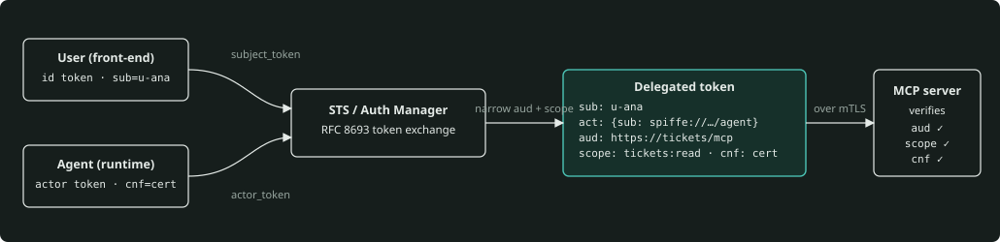
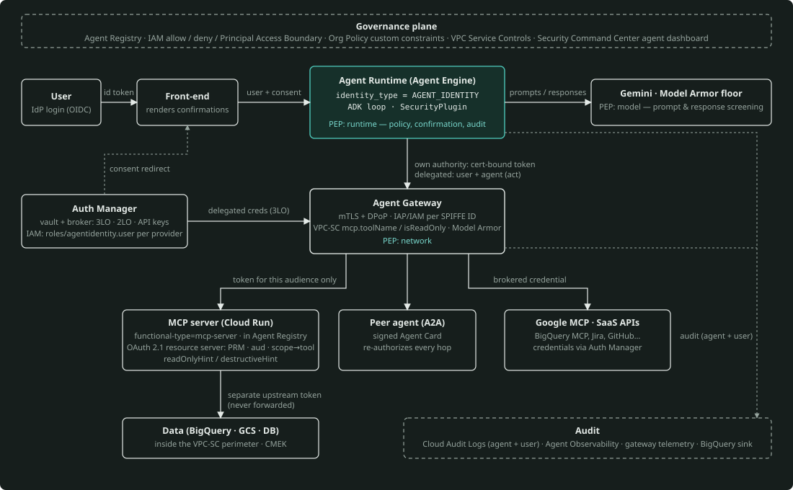

# Identity & Security for Agentic Systems — A Primer with a GCP Reference Implementation

*Written 5 September 2026 against Google Cloud's agent platform. Sections are numbered so you can drill one at a time. Every section ends with "In one sentence" (the 30-second version) and most map to a module in `src/agentsec/` and a notebook in `notebooks/`. Facts about Google Cloud products were verified against the documentation on the date above; re-check the items in the Verify list (§13) before relying on them.*

---

## 0. The mental model in one page

An agent is a **workload that turns untrusted text into privileged actions**. That single sentence generates every security problem in this primer:

- *Untrusted text* — the model reads prompts, tool results, web pages, documents, and messages from other agents, and it cannot reliably tell instructions from data. Anything the agent reads is an attack surface.
- *Privileged actions* — the agent holds credentials and calls tools. Its blast radius is the union of everything those credentials can do.
- *Workload* — it runs somewhere, under some identity, and it must be governable like any other production system: named, permissioned, observable, revocable.

Five ideas carry most of the weight. If you remember nothing else, remember these:

1. **Every agent is a first-class principal.** Not a shared service account, not "the app". One agent, one cryptographic identity, its own IAM bindings, its own audit trail. On Google Cloud this is **Agent Identity** (SPIFFE-based, certificate-bound).
2. **Two authorities, always distinguished.** An agent acts either under its *own authority* (its identity, its permissions) or *on behalf of a user* (delegated authority, the user's consent and permissions). Tokens, policy, and logs must all carry which one applies — and when delegated, both identities.
3. **Least privilege per action, not per agent.** The credential used for a tool call should be scoped to that call: narrowest audience, narrowest scope, shortest lifetime, bound to the caller. Brokers and token exchange make this cheap.
4. **Deterministic controls outrank probabilistic ones.** Prompt-level defenses (Model Armor, instructions, classifiers) reduce risk; IAM, network perimeters, allowlists, and confirmation gates *bound* it. Design so a fully hijacked model still cannot exceed the deterministic envelope.
5. **Observable by construction.** Every tool call is logged with user, agent, decision, and trace ID; every credential use is attributable; anomalies are detectable; revocation is one policy change away.

The reference implementation packages these as **four policy enforcement points (PEPs)** around the agent loop — the IAM/resource layer, the runtime callback layer (ADK plugin), the network/gateway layer (Agent Gateway + VPC Service Controls), and the model-side guardrail layer (Model Armor) — and one **identity plane** (Agent Identity + Auth Manager + token exchange) that feeds all four.

---

## 1. Why agents break classical identity assumptions

Classical IAM has two kinds of principals: **humans** (interactive, consenting, slow, MFA-protected) and **workloads** (non-interactive, deterministic, fixed code path, one service account per deployment). Agents fit neither bucket, and forcing them into one fails predictably.

| Assumption in classical IAM | What agents do instead | Consequence |
|---|---|---|
| A workload's behavior is fixed by its code | The model chooses which tools to call and with what arguments at runtime, influenced by untrusted input | You cannot enumerate what the workload "needs" — you must bound what it *may* do and gate what it *does* |
| One identity per deployment is fine | Dozens of agents may share a runtime; an agent may spawn sub-agents; one agent serves many users | Shared identities make attribution and revocation impossible; you need per-agent identity plus per-user delegation |
| Instructions come from the developer; data comes from users | Instructions and data arrive in the same channel (the context window) and the model cannot cryptographically distinguish them | Prompt injection is not a bug to patch; it is a property of the medium. Treat every input as untrusted and enforce policy outside the model |
| The caller of an API is the entity that decided to call it | The *model* decided; the *agent runtime* executed; the *user* asked for something else entirely | The "confused deputy" problem is the default state of an agent, not an edge case |
| Long-lived secrets, rotated occasionally, are acceptable for workloads | Agents run arbitrary reasoning over content that may be crafted to exfiltrate secrets from their context or environment | Long-lived credentials in an agent's reach must be assumed leakable; use short-lived, sender-constrained tokens issued just in time |

Two well-known framings are worth naming:

- **The lethal trifecta** (Simon Willison): an agent that has (a) access to private data, (b) exposure to untrusted content, and (c) a way to communicate externally can be made to exfiltrate. Remove one leg or gate it deterministically.
- **Google's three principles for secure agents** (2025): agents must have *well-defined human controllers*; agent *powers must be limited*; agent *actions and planning must be observable*. Google pairs these with a hybrid defense: deterministic runtime policy enforcement plus reasoning-based defenses (model hardening, classifiers).

**In one sentence:** "An agent is a workload whose behavior is chosen at runtime by a model reading untrusted input. So I stop trying to predict what it needs and instead bound what it may do: give it its own identity, scope each action's credential to that action, enforce policy outside the model, and log everything with both the user's and the agent's identity."

---

## 2. Threat model

Use the **OWASP Top 10 for Agentic Applications (2026)** as the shared vocabulary — customers and auditors increasingly know it — and map each risk to the control that bounds it.

| ID | Risk | Typical manifestation | Primary deterministic control | Supporting probabilistic control |
|---|---|---|---|---|
| ASI01 | Agent Goal Hijack | Prompt injection via a web page, document, ticket, or email redirects the agent's objective | Tool allowlist and confirmation gates outside the model; egress allowlist | Model Armor prompt-injection filter; instruction hierarchy |
| ASI02 | Tool Misuse & Exploitation | Legitimate tool called with malicious arguments (`send_email` to attacker; `run_query` with `DROP`) | Argument schema validation; read/write/destructive tiers; per-tool scopes; VPC-SC `mcp.tool.isReadOnly` | Output screening |
| ASI03 | Identity & Privilege Abuse | Shared service account with broad roles; user token replayed by agent for unrelated purpose | Per-agent identity; delegated tokens with audience + scope; deny policies; Principal Access Boundaries | — |
| ASI04 | Agentic Supply Chain | Malicious MCP server, poisoned tool description, compromised package | Agent Registry allowlist; gateway that only routes to registered resources; pinned dependencies; signed agent cards | Tool-description scanning |
| ASI05 | Unexpected Code Execution | Model-generated code runs with the agent's credentials | Sandboxed execution (Agent Sandbox) with no ambient credentials; separate identity for executors | — |
| ASI06 | Memory & Context Poisoning | Injected content persisted in session memory or RAG index, replayed later | Provenance tags on stored content; per-user/per-tenant memory isolation; write-gating to memory | Screening before persistence |
| ASI07 | Insecure Inter-Agent Communication | Sub-agent trusts caller without auth; A2A over plain HTTP; tokens forwarded | mTLS/DPoP-bound tokens; A2A `securitySchemes`; audience validation; no token passthrough | — |
| ASI08 | Cascading Failures | One hijacked agent triggers a chain of tool calls across agents | Per-hop authorization; budgets and rate limits; circuit breakers; human checkpoints on high-impact chains | Anomaly detection |
| ASI09 | Human-Agent Trust Exploitation | Confident, wrong summaries lead a human to approve harm | Confirmation UIs that show *what will actually execute* (tool, args), not the model's summary | — |
| ASI10 | Rogue Agents | Agent keeps operating outside policy; orphaned deployments | Central registry; identity that cannot be shared or impersonated; kill switch via IAM deny / perimeter; anomaly & threat detection | — |

Two habits make a threat model credible when you whiteboard it:

- **Draw the trust boundaries, then the data flows crossing them.** For a typical customer-support agent: user ↔ front-end; front-end ↔ agent runtime; agent ↔ model endpoint; agent ↔ MCP servers/tools; agent ↔ peer agents; agent ↔ memory/session store; agent ↔ the open internet (if any). Each crossing gets an identity, a policy, and a log.
- **Ask "what if the model is fully adversarial?"** for each tool. If the answer is "it could do X and nothing outside the model would stop it", X is your risk. Then add the deterministic control.

**In one sentence:** "I use OWASP's agentic top ten as the checklist, but the design question is always the same: assume the model has been hijacked — what's the worst it can do with the credentials and tools it holds, and which control outside the model stops it?"

---

## 3. The identity model for agents

### 3.1 Principals

An agentic system has more principals than a classical app, and you should name all of them:

- **User** — the human controller, authenticated by an IdP (Google Workspace / Cloud Identity, Okta, Entra), with consent for what the agent may do on their behalf.
- **Agent** — the workload running the agent loop. It should have its own identity: on Google Cloud, an **Agent Identity** SPIFFE ID such as `spiffe://agents.global.org-123.system.id.goog/resources/aiplatform/projects/987/locations/us-central1/reasoningEngines/support-agent`, expressed in IAM as `principal://agents.global.org-123.system.id.goog/resources/aiplatform/...`.
- **Tool / resource server** — an MCP server, an API, a database. It has its own identity (for mTLS and for its own outbound calls) and, crucially, is an OAuth **resource server** that validates tokens issued *for it*.
- **Model endpoint** — Gemini on the Agent Platform. The agent authenticates to it; policy (Model Armor floor settings) can be applied at this boundary.
- **Peer agents** — other agents called over A2A, each with their own identity and Agent Card.
- **Operators / developers** — humans with admin roles; a frequent blind spot (who can change the agent's instructions or tool list?).

### 3.2 Own authority vs delegated authority

Every action the agent takes is under one of two authorities. Make this explicit in code, tokens, and logs:

- **Own authority** — the agent uses *its* identity and *its* IAM grants. Example: writing traces to Cloud Logging, reading a shared knowledge base, calling a 2-legged-OAuth SaaS API with credentials the organization gave *the agent*. Audit logs show the agent's identity only.
- **Delegated authority (on behalf of a user)** — the agent acts with credentials *the user consented to*, typically 3-legged OAuth: reading the user's calendar, filing a ticket as the user, querying BigQuery with the user's own dataset permissions. Audit logs must show **both** the agent and the user — Google's Agent Identity does exactly this when acting through Auth Manager.

The two are not interchangeable. A very common design error is to give the agent's own identity broad permissions ("it needs to read everyone's tickets") when the correct design is delegated: the agent reads *this user's* tickets with *this user's* token. Delegation keeps the agent's own blast radius small and makes authorization decisions the resource's problem (which already knows how to authorize users).

### 3.3 What "agent identity" should mean (and how GCP implements it)

A good agent identity has these properties. Google Cloud's Agent Identity (generally available in 2026 — Agent Identity from April, Auth Manager and its APIs from August, per the IAM release notes) was designed against this list, so it doubles as your product knowledge:

| Property | Why it matters | Google Cloud implementation |
|---|---|---|
| **Unique per agent, not shared** | Attribution and revocation | One SPIFFE ID per deployed agent resource; not shared between workloads by default |
| **Strongly attested** | The runtime, not a config file, proves which agent is calling | Per-agent X.509 certificate provisioned by the runtime, 24-hour validity, auto-renewed |
| **No long-lived secrets** | Nothing to leak from a container or repo | No service-account-style keys can be generated for agent identities |
| **Cannot be impersonated** | Prevents a compromised operator/SA from "becoming" the agent | Impersonation is not supported for agent identities |
| **Sender-constrained tokens** | A stolen token is useless outside the runtime | Access tokens are cryptographically bound to the certificate (mTLS); across Agent Gateway also DPoP (RFC 9449) → "double-bound" tokens. A default Google-managed Context-Aware Access policy rejects unbound use. |
| **Governable as a group** | Policy at fleet scale | `principalSet://…/attribute.platformContainer/aiplatform/projects/PROJECT_NUMBER` (all agents in a project), `…/attribute.platform/aiplatform` (all agents in the org) |
| **Usable in all policy types** | Same controls as any principal | IAM allow and deny policies, Principal Access Boundary policies, VPC-SC ingress/egress rules |

Supported runtimes today: **Agent Runtime** (Agent Engine, resource type `reasoningEngines`), **Gemini Enterprise**, and **Cloud Run** (`gcloud beta run deploy … --functional-type=agent --identity-type=agent-identity`; MCP servers with `--functional-type=mcp-server`). Deploying with the Python SDK is `client.agent_engines.create(agent=AdkApp(agent), config={"identity_type": types.IdentityType.AGENT_IDENTITY, …})`; with ADK deploy it is `.agent_engine_config.json` → `{"identity_type": "AGENT_IDENTITY"}`. Inside the agent, Application Default Credentials transparently obtain the certificate-bound token from the metadata server, so `google.auth.default()` "just works" with the agent identity.

Two things worth knowing:

- **Migration from a service account to an agent identity creates a new principal with no inherited permissions.** Pre-grant roles (Policy Analyzer helps) before flipping `--identity-type`. Legacy bucket roles cannot be granted to agent identities.
- **The opt-out exists and is a red flag.** `GOOGLE_API_PREVENT_AGENT_TOKEN_SHARING_FOR_GCP_SERVICES=False` disables token binding; it is documented as strongly discouraged. If you see it in a customer's config, that is a finding.

### 3.4 Where the older primitives still fit

Agent Identity does not replace the rest of Google Cloud IAM; you compose them:

- **Service accounts** remain the identity for non-agent infrastructure (build pipelines, the front-end, a Cloud SQL proxy) and for Cloud Run MCP servers that choose `--identity-type=service-account`.
- **Workload Identity Federation** brings external identities (GitHub Actions OIDC, AWS/Azure workloads, on-prem SPIFFE) into IAM via STS token exchange without keys — the right way for CI to deploy agents.
- **Short-lived impersonation** (`generateAccessToken`, `generateIdToken`) and **Credential Access Boundaries** (downscoped tokens; Cloud Storage only) let a broker mint narrowly scoped, short-lived credentials for a specific tool call.
- **IAM Conditions** (CEL on resource name, time, request attributes), **deny policies**, **Principal Access Boundary policies**, and **Org Policy custom constraints** give you the "cannot exceed" envelope regardless of allow grants.

### 3.5 Delegation mechanics (standards you should be able to draw)

*Delegation as token exchange: the STS combines the user's subject token and the agent's certificate-bound actor token into one short-lived token that names both (`sub` + `act`), is scoped to one audience, and stays bound to the agent's certificate; the resource server checks all three. The lab's `TokenIssuer.exchange()` does exactly this.*

- **RFC 8693 token exchange** — the standard way to represent "agent A acting for user U": the STS takes the user's `subject_token` and the agent's `actor_token` and issues a token whose `sub` is the user and whose `act` claim identifies the agent, scoped to an `audience` and `scope`. Chains (`act.act`) represent multi-hop delegation. Google's own STS uses this grant for Workload Identity Federation.
- **RFC 9449 DPoP** — the client proves possession of a private key on every request with a signed `DPoP` header (`htm`, `htu`, `iat`, `jti`, `ath`); the token carries `cnf.jkt`. A replayed bearer token without the key fails.
- **RFC 8705 mTLS-bound tokens** — the token carries `cnf.x5t#S256` (certificate thumbprint); the resource server checks the TLS client certificate matches. This is what "certificate-bound" means for Agent Identity.
- **Credential Access Boundaries** — a downscoped Google access token restricted to specific buckets/prefixes and permissions; the pattern for "give this tool call access to exactly one prefix for five minutes".

The reference implementation contains a small local STS that performs RFC 8693 exchange with an `act` claim, mints certificate-bound (`cnf.x5t#S256`) agent tokens, and verifies DPoP proofs — so you can *show* replay failing rather than describe it.

**In one sentence:** "Each agent gets its own SPIFFE identity with a runtime-attested certificate; its tokens are bound to that certificate so theft doesn't help. Then I separate the agent's own authority from delegated authority: the agent's identity gets narrow infrastructure roles, and anything user-specific happens with a user-delegated token that names both the user and the agent, so the resource authorizes the user and the log shows both."

---

## 4. Authorization patterns

### 4.1 Four policy enforcement points

Design authorization as layers that fail closed independently:

1. **Resource layer (IAM).** The final arbiter. Bind the agent principal (or principalSet) to the narrowest roles on the narrowest resources; use IAM Conditions for time-boxing and resource-name constraints; deny policies and PAB policies for "never, regardless of allows".
2. **Runtime layer (ADK callbacks / plugin).** `before_tool_callback` sees the resolved tool name and arguments *before* execution; this is where you enforce tool allowlists, tiers (read/write/destructive), argument constraints, per-user scopes, budgets, and human confirmation. Returning a result from the callback skips the tool. The reference implementation ships a `SecurityPlugin` that does this for every agent in the runner.
3. **Network layer (Agent Gateway + VPC Service Controls).** The gateway is the single egress point for agent → tool/agent traffic; IAP enforces IAM per SPIFFE ID on resources registered in Agent Registry (unregistered destinations require `iap.resources.egressViaIAP`). VPC-SC perimeters accept agent identities in ingress/egress rules and can condition on MCP attributes: `mcp.toolName`, `mcp.method`, `mcp.tool.isReadOnly` — e.g., allow an agent to *read* from a Workspace MCP server but deny `send_email`.
4. **Model-side layer (Model Armor).** Screening of prompts and responses (and, at the gateway, tool traffic) for prompt injection/jailbreak, sensitive data, malicious URLs, and RAI categories. Apply as project **floor settings** (baseline nobody can turn off) plus per-request **templates**; the request-level template takes precedence over the floor, which takes precedence over Gemini's built-in safety filters.

The runtime layer is the one you control most as the agent developer; the resource and network layers are the ones that still hold if your code is wrong.

### 4.2 Tool tiers and deny-by-default

Classify every tool once, in policy, not in prose:

- **READ** — no side effects (`get_ticket`, `search_docs`). Allowed by default for agents bound to the policy; still scope-checked.
- **WRITE** — reversible side effects (`add_comment`, `create_draft`). Require explicit allowlisting and, when acting for a user, the user's scope.
- **DESTRUCTIVE / EXTERNAL** — irreversible, financial, or leaves the trust boundary (`issue_refund`, `send_email`, `fetch_url`). Require human confirmation unless a narrow, pre-approved argument envelope is satisfied (e.g. refund ≤ $50 on the caller's own order), and an egress allowlist for anything that takes a URL.

Unknown tool → **deny**. Policy is evaluated against a `ToolCallRequest` that carries agent principal, user, authority mode, tool, arguments, and scopes. MCP tool annotations (`readOnlyHint`, `destructiveHint`) and VPC-SC's `mcp.tool.isReadOnly` express the same tiers at the protocol and network layers — keep them consistent.

### 4.3 Scoped credential per tool call

Do not let the agent hold one wide token. Pattern:

1. The agent authenticates to a **broker** (Auth Manager, or your own STS) with its own identity.
2. The broker returns a credential scoped to *this* tool: right audience (the MCP server's canonical URI), minimal scope (`tickets:read`), short TTL, and — for delegated calls — the user's identity with the agent as actor.
3. The tool/resource server validates audience, scope, expiry, and binding; it never accepts tokens meant for someone else.

Google's **Auth Manager** is that broker for outbound tools: it vaults API keys, 2-legged OAuth client credentials, and end-user 3-legged OAuth tokens as *auth providers* (`projects/P/locations/L/authProviders/NAME`), gated by IAM (`roles/agentidentity.user` on the provider, granted to the agent principal). In ADK you register `GcpAuthProvider()` once and attach a `GcpAuthProviderScheme(name=…, scopes=[…])` to an `McpToolset` or an `AuthenticatedFunctionTool`; ADK fetches the credential per call and injects it. Every access is attributable to the agent's SPIFFE ID and, for 3LO, to the user.

### 4.4 Human-in-the-loop, done right

Confirmation is only a control if the human sees **what will execute**, not what the model *says* it will do. Surface the tool name, the exact arguments, the authority (own vs on behalf of whom), and the policy reason. ADK supports this natively: a `FunctionTool(require_confirmation=True)` or `tool_context.request_confirmation(hint=…, payload=…)` pauses the tool and emits an `adk_request_confirmation` function call; the client renders it and replies with a `ToolConfirmation(confirmed=True)`. Log the approval with the approver's identity — it is part of the delegation chain.

### 4.5 Bounding the envelope: deny, PAB, and org policy

- **IAM deny policies** — "principalSet of all agents in project X may never call `storage.objects.delete` or `iam.serviceAccounts.*`", even if an allow slips through.
- **Principal Access Boundary policies** — limit which *resources* a set of principals can access at all (e.g., agents in the sandbox folder can only reach resources in that folder).
- **Org Policy custom constraints** — e.g., require `identity_type = AGENT_IDENTITY` on `reasoningEngines`, or require Cloud Run agent services to use agent identity. (Custom constraints for Agent Identity went GA in August 2026; the exact resource fields belong on your Verify list.)

**In one sentence:** "I put policy at four layers — IAM on the resource, a callback in the runtime that sees the actual tool call, the gateway/perimeter on the network, and Model Armor on the model boundary — and I classify tools into read, write, and destructive so the runtime can deny by default and require confirmation where it matters. Each tool call gets a credential scoped to that call from a broker, never a standing wide token."

---

## 5. Secrets and credential handling

**Rules that survive every architecture:**

1. **No secrets in prompts, instructions, tool descriptions, or session state.** The context window is readable by the model and therefore by anyone who can inject into it. ADK's `tool_context.state` is session state — treat it as semi-trusted, and never park raw refresh tokens there in production.
2. **Prefer no secret at all.** Agent Identity and Workload Identity Federation give you keyless auth to Google APIs and external providers. Every place you can replace a stored secret with a runtime-attested identity, do it.
3. **When a secret is unavoidable, vault it and broker it.** API keys and OAuth client secrets live in **Auth Manager** (agent-facing) or **Secret Manager** (infrastructure-facing) with IAM on each secret, access logged, rotation scheduled. The agent's own principal gets `roles/secretmanager.secretAccessor` on exactly the secrets it needs.
4. **Short-lived, audience-bound, sender-constrained.** Minutes, not days; one audience; bound to the caller's certificate or DPoP key where the ecosystem supports it.
5. **Redact by default.** Structured logs pass through a redactor; secret values are wrapped in types whose `repr` never prints them.

**The two secret-handling paths (know this distinction cold):**

- **Direct path** — ADK intercepts the tool call, asks Auth Manager for the credential, and the agent process attaches it to the outbound request. Simple; but a compromised runtime or a successful injection could read the token from memory for its lifetime.
- **Gateway path** — end-user credentials are encrypted by Auth Manager and decrypted only at **Agent Gateway**, which injects them into the egress request. The agent code never sees the raw credential. Stronger blast-radius story; requires the gateway in the path and registered destinations.

Neither removes credential risk; they relocate it from a thousand config files into one well-defended box. Say that out loud — it is the honest framing.

**In one sentence:** "I design for no secrets first — agent identity and WIF — and vault what's left in Auth Manager or Secret Manager with per-secret IAM. Credentials are minted per call, short-lived and bound to the caller. And I decide explicitly whether the agent process may ever hold a raw user credential: if not, egress goes through Agent Gateway, which decrypts and injects at the edge."

---

## 6. Tool-call safety and prompt injection

### 6.1 The untrusted-content boundary

Everything that enters the context window from outside the developer's own instructions is data, not instructions. Operationally:

- **Screen on the way in and on the way out.** Model Armor (or an equivalent) on user prompts (injection/jailbreak, sensitive data, malicious URIs, RAI) and on model responses (data leakage, malicious URIs). Set project **floor settings** so every Gemini call in the project is screened even if a developer forgets, and use per-request templates for stricter surfaces. Start in `INSPECT_ONLY`, review findings, then move sensitive surfaces to `INSPECT_AND_BLOCK`.
- **Tag provenance.** Wrap tool results before they reach the model: source, trust level, timestamp. Keep the tag in the audit record so a later bad decision can be traced to the content that caused it.
- **Sanitize tool output.** Strip control characters and known instruction patterns from untrusted sources, and never let a tool result be interpreted as a new system instruction.
- **Validate arguments structurally.** Tool input schemas with tight types and enums; refuse free-form URLs/SQL where a constrained form will do; enforce an **egress allowlist** for any tool that takes a URL (SSRF and exfiltration are the same bug in an agent).

### 6.2 Code execution and sandboxes

Model-generated code runs with *no ambient credentials*. Google's Agent Sandbox (and Workspaces) exist for this; if you must run code elsewhere, run it under a separate, unprivileged identity, without the agent's metadata-server access, with network egress off by default. An "execute code" tool is DESTRUCTIVE-tier by definition.

### 6.3 Plan → check → act

For multi-step tasks, have the agent produce a plan (the list of tool calls it intends), run it through the same policy engine as a dry run, and only then execute step by step with per-step enforcement. Budgets (tokens, tool calls, spend) and loop detection are part of this layer — cascading failures (ASI08) are usually unbounded loops with valid credentials.

**In one sentence:** "Prompt injection is a property of the medium, so I don't rely on the model to resist it. I screen inputs and outputs with Model Armor floor settings, tag and sanitize everything that comes back from tools, constrain arguments structurally, allowlist egress, and keep destructive actions behind confirmation. If a hijacked model can only call read-only tools and a confirmation-gated refund, the injection is contained."

---

## 7. MCP and A2A security

### 7.1 MCP: the server is an OAuth 2.1 resource server

The MCP authorization specification (revision 2025-11-25; the 2026-07-28 revision keeps the same model and deprecates Dynamic Client Registration in favor of Client ID Metadata Documents) fixes the roles: the **MCP client** is an OAuth 2.1 client, the **MCP server** is a **resource server**, and an **authorization server** issues tokens. The requirements you should be able to recite:

- Servers **MUST** implement **Protected Resource Metadata** (RFC 9728) and advertise it — `WWW-Authenticate: Bearer resource_metadata="…"` on 401 and/or `/.well-known/oauth-protected-resource[/path]`. Clients discover the authorization server from it (RFC 8414 or OIDC discovery).
- Clients **MUST** use **PKCE (S256)** and refuse to proceed if the AS metadata lacks `code_challenge_methods_supported`.
- Clients **MUST** send the **`resource` parameter** (RFC 8707) — the canonical URI of the MCP server — in both authorization and token requests. Servers **MUST** validate that tokens were issued *for them* (audience).
- **No token passthrough.** A server must not accept tokens issued for other resources and must not forward the token it received to upstream APIs; if it calls upstream, it is a separate OAuth client with a separate token. This is the confused-deputy guard.
- Tokens go in `Authorization: Bearer`, never in query strings; `403 insufficient_scope` with a `scope` challenge drives step-up authorization; redirect URIs are localhost or HTTPS; short-lived access tokens; refresh-token rotation for public clients.

The reference MCP server implements exactly this with the `mcp` SDK's native auth (`TokenVerifier`, `AuthSettings(resource_server_url=…, required_scopes=…)`), maps scopes to tools (`tickets:read` vs `tickets:write`), publishes `readOnlyHint`/`destructiveHint` annotations, and optionally enforces DPoP.

On Google Cloud, hosting an MCP server on Cloud Run with `--functional-type=mcp-server` registers it in **Agent Registry**; agents reach it through **Agent Gateway**, where IAP enforces IAM on the registered MCP server resource and VPC-SC can condition on `mcp.toolName` / `mcp.tool.isReadOnly`. Google-hosted MCP endpoints (e.g., BigQuery's) are consumed from ADK via `McpToolset` with a `GcpAuthProviderScheme` so Auth Manager brokers the user's 3-legged token.

### 7.2 A2A: identity between agents

The A2A protocol (v1.0) puts authentication in the **Agent Card**: `securitySchemes` (API key, HTTP bearer, OAuth 2, OpenID Connect, mutual TLS) and `security` requirements per skill; an **authenticated extended card** can expose more skills; tasks can enter `TASK_STATE_AUTH_REQUIRED` to request credentials mid-task; all bindings (JSON-RPC, gRPC, HTTP+JSON) require TLS; cards can be **signed** (`AgentCardSignature`, JWS) so a client can verify the card wasn't tampered with.

Design rules for multi-agent systems:

- Every hop is a fresh authorization decision. Sub-agent B validates the token it receives (issuer, audience = B, scope), and if it needs to call further it exchanges — never forwards — the token.
- The delegation chain is explicit (`act` claims or equivalent) and logged at every hop; the user's consent propagates, the agent's own authority does not silently expand.
- Cards and registries are the supply-chain control: only call agents whose cards are registered (Agent Registry) and, ideally, signed.
- Budget and depth limits on agent-to-agent recursion.

**In one sentence:** "An MCP server is just an OAuth 2.1 resource server: it publishes protected-resource metadata, the client uses PKCE and the resource parameter, and the server validates audience and never passes tokens through. For A2A, the card declares the security schemes, every hop re-authorizes, and delegation is exchanged rather than forwarded. On Google Cloud I put Agent Gateway in the path so IAM and VPC-SC can enforce this per tool."

---

## 8. Data boundaries, network, and tenancy

- **Perimeters.** Put the Agent Platform, the MCP servers, Secret Manager, the Agent Identity services (`agentidentity.googleapis.com`, `agentidentitycredentials.googleapis.com`), and the data stores in a VPC-SC perimeter; use ingress/egress rules with agent principals; route Google APIs through the restricted VIP. Including Agent Platform in a perimeter automatically blocks the agents' public-internet access — which is the behavior you want by default; add explicit egress for the few destinations that are legitimate.
- **Private connectivity.** Agent Runtime supports PSC-interface network attachments and DNS peering for private tool endpoints; Cloud Run MCP servers should use internal ingress and IAM invoker bindings for the agent principal.
- **Encryption and residency.** CMEK on Agent Engine (`encryption_spec.kms_key_name`), Secret Manager, logs, and data stores; pick regions deliberately (Model Armor's Vertex integration and Agent Identity have region lists; Auth Manager vault residency is not uniform across regions — put that on the Verify list for any regulated customer).
- **Tenancy.** Decide the isolation unit: per-tenant agent deployments (strongest, most cost) vs shared agents with per-user delegation and per-tenant memory/session partitioning. Sessions and Memory Bank must be keyed by user/tenant and never searchable across tenants; RAG retrieval must be ACL-aware, i.e., run under the user's delegated identity or filter by the user's entitlements *before* content reaches the model.
- **Logs are data too.** Prompts and tool results often contain PII; apply Sensitive Data Protection to what you log and restrict log-bucket access.

**In one sentence:** "Network is the safety net for when IAM and code are wrong: the agents live in a VPC-SC perimeter that cuts public egress by default, tools are reached privately through the gateway, and each tenant's sessions, memory, and retrieval are partitioned by the user's identity rather than by hoping the model behaves."

---

## 9. Observability, audit, and governance

Minimum viable audit for an agent action — a single structured event with: trace ID, invocation ID, user (if delegated), agent SPIFFE ID, authority mode, tool, argument hash (or redacted arguments), policy decision and reasons, approver (if confirmed), result hash, latency, and the provenance tags of the inputs that led here. Emit it from the runtime layer (the plugin) so it exists even when the tool fails.

On Google Cloud this joins native signals: Cloud Audit Logs (with both identities when delegated), **Agent Observability** (traces of reasoning and tool calls), **Agent Gateway** telemetry to Cloud Logging/Trace, **Agent Anomaly Detection** and **Agent Threat Detection**, and the **Agent Security Dashboard** in Security Command Center (asset discovery, agent-model relationships, vulnerabilities). Propagate `traceparent` through MCP `_meta` and A2A calls so one trace spans user → agent → tool.

Governance loop: **register** (Agent Registry as the inventory and allowlist) → **permit** (IAM/PAB/VPC-SC on principals and principalSets) → **observe** (audit + anomaly detection) → **revoke** (deny policy or perimeter rule removes an agent's reach instantly, without redeploying) → **evaluate** (Agent Evaluation/Simulation and red-team suites run against every release, including injection corpora). Treat instructions, tool lists, and policies as versioned artifacts with review.

**In one sentence:** "I want every tool call to leave one event that answers who asked, which agent acted, under whose authority, what exactly ran, who approved it, and why the policy allowed it — then feed that into anomaly detection and keep a one-line kill switch: a deny policy on the agent's principal."

---

## 10. GCP mapping and the reference architecture

*The reference architecture. Solid arrows are request paths and carry the credential that crosses each boundary; dotted arrows are audit and consent flows. Three of the four PEPs sit on this path (runtime, network, model); the fourth, IAM on the destination resource, is the governance plane at the top.*

| Primer concept | Google Cloud control | In this repository |
|---|---|---|
| Agent as first-class principal | Agent Identity (SPIFFE, cert-bound tokens) | `agentsec.identity.AgentIdentity`, `certs.py`; Terraform `reasoning_engine.tf` (`identity_type = "AGENT_IDENTITY"`), `infra/scripts/deploy_mcp_cloud_run.sh` |
| Own vs delegated authority | ADC for own; Auth Manager 3LO for delegated; dual-identity audit logs | `identity/delegation.py`, `identity/auth_manager.py` (`LocalAuthManager` ↔ ADK `GcpAuthProvider`) |
| Scoped credential per call | Auth Manager providers + IAM; STS/impersonation; Credential Access Boundaries | `identity/tokens.py` (RFC 8693 exchange, DPoP), `identity/downscope.py` |
| Runtime PEP | ADK plugin callbacks | `policy/engine.py`, `policy/adk_plugin.py`, `policies/*.yaml` |
| Human confirmation | ADK tool confirmation | `agents/tools.py`, `runtime.py` |
| Model-side screening | Model Armor templates + floor settings | `guardrails/screening.py` (`LocalScreener` / `ModelArmorScreener`), Terraform `model_armor.tf` |
| Untrusted content boundary | Model Armor at gateway; provenance | `guardrails/sanitize.py` |
| Secrets | Auth Manager, Secret Manager, no SA keys | `secrets/store.py`, Terraform `secrets.tf`, `auth_provider.tf` |
| MCP as resource server | Cloud Run MCP server + Agent Registry + IAP | `mcp/server.py`, `mcp/client.py`, Terraform `agent_registry.tf`, `cloudrun_mcp.tf` |
| Gateway & perimeter | Agent Gateway, VPC-SC with agent principals and `mcp.*` attributes | Terraform `agent_gateway.tf`, `vpc_sc.tf` (opt-in), `infra/scripts/vpc_sc_mcp_rule.yaml` |
| Envelope | Deny policies, PAB, custom constraints | Terraform `iam.tf`, `org_policy.tf` (opt-in) |
| Audit & observability | Cloud Audit Logs, sinks, Agent Observability | `audit/log.py`, Terraform `logging.tf` |
| A2A | Agent Card securitySchemes, signatures | `a2a/card.py`, `a2a/auth.py` |

---

## 11. Design drills

### 11.1 System-design prompts (talk through, 20 minutes each)

1. *"A bank wants a support agent that can read a customer's transactions and issue refunds up to $200. Design the identity and authorization model."* — Expect: user authentication and delegated authority for reads; agent identity with minimal own roles; refund as DESTRUCTIVE with an argument envelope and confirmation above threshold; audit with both identities; kill switch; Model Armor floor.
2. *"We have 40 agents built by different teams calling 15 MCP servers. How do we govern this?"* — Expect: Agent Registry as inventory; principalSet-level policies; Agent Gateway as the chokepoint with IAP/IAM per SPIFFE ID; VPC-SC `mcp.*` conditions; per-server scopes; deny policies for the never-list; SCC dashboard.
3. *"An agent needs to call Jira and GitHub on behalf of employees."* — Expect: Auth Manager 3LO providers per SaaS; consent flow (`adk_request_credential`); scopes minimized; the direct-vs-gateway secret-handling choice; revocation on offboarding.
4. *"Our RAG agent leaked another tenant's document."* — Expect: ACL-aware retrieval under the user's identity; tenant-partitioned indexes and memory; provenance; tests.
5. *"How would you migrate a service-account-based agent to Agent Identity?"* — Expect: new principal, no inherited permissions; Policy Analyzer; pre-grant; `--no-traffic` revision; verify cert-bound tokens; remove SA keys.

### 11.2 Code-evaluation drills (spot the bug)

The `notebooks/practice/` set includes deliberately flawed snippets to find: a tool that forwards the inbound bearer token upstream (token passthrough); a verifier that checks signature but not `aud`; a policy engine that allows unknown tools; a confirmation UI that displays the model's summary instead of the actual arguments; a secret stored in `tool_context.state`; an egress check that matches on substring instead of parsed host; a DPoP verifier that skips `jti` replay tracking; a `principalSet` matcher that does prefix matching on the wrong segment.

### 11.3 Trade-offs you should be ready to argue

- Per-agent identity vs shared identity (attribution and revocation vs. operational overhead).
- Direct credential path vs gateway path (simplicity vs. runtime never holding user secrets).
- Confirmation friction vs argument envelopes (safety vs. user experience).
- `INSPECT_ONLY` vs `INSPECT_AND_BLOCK` (visibility first, then enforcement; false-positive cost).
- Sandboxed execution vs capability (what an "analysis" agent loses when it cannot reach the network).

---

## 12. Glossary (fast recall)

**Agent Identity** — Google Cloud's SPIFFE-based, certificate-bound identity for agents. **Auth Manager** — Google's vault/broker for agents' outbound credentials (API key, 2LO, 3LO). **Agent Gateway** — networking chokepoint for agent ingress/egress with mTLS, DPoP, IAP/IAM, Model Armor. **Agent Registry** — inventory of agents, MCP servers, endpoints; the allowlist the gateway enforces against. **Model Armor** — prompt/response screening (injection, sensitive data, malicious URI, RAI). **PEP** — policy enforcement point. **PRM** — OAuth Protected Resource Metadata (RFC 9728). **Resource indicator** — RFC 8707 `resource` parameter binding a token to an audience. **DPoP** — RFC 9449 proof-of-possession header. **cnf** — the confirmation claim binding a token to a key/cert. **RFC 8693** — OAuth token exchange, `act` claim for delegation. **CIMD** — Client ID Metadata Documents (URL as `client_id`). **PAB** — Principal Access Boundary policy. **VPC-SC** — VPC Service Controls perimeter. **CAB** — Credential Access Boundary (downscoped token). **WIF** — Workload Identity Federation.

---

## 13. Verify list (re-check before relying on it)

- GA/preview status and any renames of: Agent Identity, Auth Manager, Agent Gateway, Agent Registry, Agent Sandbox, Agent Anomaly/Threat Detection, IAP for agents.
- Exact `gcloud` syntax for `agent-identity auth-providers create` and `run deploy --functional-type/--identity-type`.
- Terraform provider support for `google_agent_identity_auth_provider`, `google_agent_registry_service`, `google_iap_agent_registry_mcp_server_iam_member`, `google_network_services_agent_gateway`, `google_vertex_ai_reasoning_engine.spec.identity_type` (present in provider 8.1.0 at time of writing).
- VPC-SC MCP attributes (`mcp.toolName`, `mcp.method`, `mcp.tool.isReadOnly`) availability and syntax in ingress/egress rules.
- Model Armor ↔ Vertex integration regions and file/PDF limitations; floor-setting enforcement modes.
- Current MCP spec revision in force (2025-11-25 vs 2026-07-28) and whether ADK/`mcp` SDK versions you cite support it; DCR deprecation.
- A2A version pinned by the a2a-sdk release you cite (v1.0 spec at time of writing).
- OWASP Agentic Top 10 wording (2026 edition, published December 2025).
- Auth Manager regional/data-residency notes and pricing.
