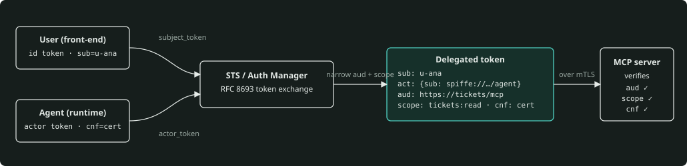
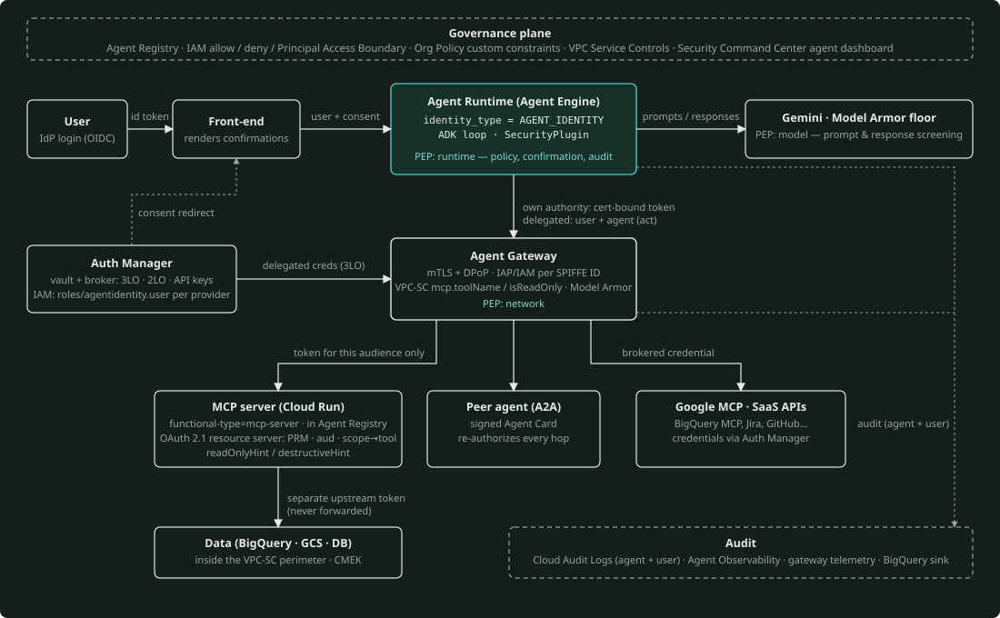

# Identity & Security for Agentic Systems — A Primer with a GCP Reference Implementation

*The author wrote this primer on 5 September 2026, for the agent platform of Google Cloud. The sections have numbers, thus you can do the drills of one section at a time. Every section ends with "In one sentence" (the 30-second version). Most sections map to a module in `src/agentsec/` and a notebook in `notebooks/`. On the date above, the author compared the facts about Google Cloud products with the documentation. Before you rely on the items in the Verify list (§13), examine them again.*

---

## 0. The mental model in one page

An agent is a **workload that turns untrusted text into privileged actions**. Every security problem in this primer comes from that one sentence:

- *Untrusted text*: the model reads prompts, tool results, web pages, documents, and messages from other agents. The model cannot reliably tell instructions from data. Anything that the agent reads is an attack surface.
- *Privileged actions*: the agent holds credentials and calls tools. Its blast radius is the union of everything that those credentials can do.
- *Workload*: it runs in some location, under some identity. You must be able to govern it like any other production system. It has a name and permissions, you can observe it, and you can revoke it.

Five ideas do most of the work. If you remember nothing else, remember these five:

1. **Every agent is a first-class principal.** It is not a shared service account, and it is not "the app". Each agent has one cryptographic identity, its own IAM bindings and its own audit trail. On Google Cloud, this is **Agent Identity** (SPIFFE-based, certificate-bound).
2. **Two authorities, always distinguished.** An agent acts under its *own authority* (its identity, its permissions). Or it acts *on behalf of a user* (delegated authority, the user's consent and permissions). Tokens, policy and logs must all show which authority applies. When the agent acts under delegated authority, they must show both identities.
3. **Least privilege per action, not per agent.** The credential for a tool call must have the scope of that call only. It has the narrowest audience, the narrowest scope and the shortest lifetime, and it is bound to the caller. Brokers and token exchange make this low-cost.
4. **Deterministic controls outrank probabilistic ones.** Prompt-level defenses (Model Armor, instructions, classifiers) decrease the risk. IAM, network perimeters, allowlists and confirmation gates *bound* the risk. Make the design so that a fully hijacked model still cannot go outside the deterministic envelope.
5. **Observable by construction.** The system logs every tool call with the user, the agent, the decision and the trace ID. You can attribute every use of a credential. You can detect anomalies. A revocation needs only one policy change.

The reference implementation puts these ideas into **four policy enforcement points (PEPs)** around the agent loop:

- the IAM/resource layer,
- the runtime callback layer (ADK plugin),
- the network/gateway layer (Agent Gateway + VPC Service Controls),
- the model-side guardrail layer (Model Armor).

It also has one **identity plane** (Agent Identity + Auth Manager + token exchange) that supplies all four.

---

## 1. Why agents break classical identity assumptions

Classical IAM has two kinds of principals. The first kind is **humans** (interactive, able to give consent, slow, MFA-protected). The second kind is **workloads** (non-interactive, deterministic, a code path that does not change, one service account per deployment). Agents are in neither group. If you force agents into one of the two groups, the design fails in ways that you can predict.

| Assumption in classical IAM | What agents do instead | Consequence |
|---|---|---|
| The code of a workload sets its behavior | At runtime, the model selects the tools to call and their arguments. Untrusted input has an effect on this selection. | You cannot list what the workload "needs". You must bound what it *can* do, and put a gate on what it *does*. |
| One identity per deployment is sufficient | Dozens of agents can share a runtime. An agent can spawn sub-agents. One agent serves many users. | Shared identities make attribution and revocation impossible. You need per-agent identity plus per-user delegation. |
| Instructions come from the developer. Data comes from users. | Instructions and data arrive in the same channel (the context window). The model cannot cryptographically tell them apart. | Prompt injection is not a bug that a patch can repair. It is a property of the medium. Treat every input as untrusted, and enforce policy outside the model. |
| The caller of an API is the entity that decided to call it | The *model* decided. The *agent runtime* did the call. The *user* asked for a fully different thing. | The "confused deputy" problem is the default state of an agent, not an edge case. |
| Long-lived secrets with an occasional rotation are acceptable for workloads | Agents do arbitrary reasoning on content. An attacker can write that content so that it exfiltrates secrets from the context or the environment of the agent. | Assume that a long-lived credential in the reach of an agent can leak. Use short-lived, sender-constrained tokens that the issuer gives just in time. |

Two well-known framings are useful here:

- **The lethal trifecta** (Simon Willison): an agent has (a) access to private data, (b) exposure to untrusted content, and (c) a way to communicate externally. An attacker can make such an agent exfiltrate data. Remove one leg, or put a deterministic gate on it.
- **Google's three principles for secure agents** (2025) are these. Agents must have *well-defined human controllers*. Agent *powers must be limited*. Agent *actions and planning must be observable*. Google uses these principles together with a hybrid defense: deterministic runtime policy enforcement plus reasoning-based defenses (model hardening, classifiers).

**In one sentence:** "An agent is a workload. At runtime, a model that reads untrusted input selects its behavior. Thus I do not try to predict what it needs. I bound what it can do: I give it its own identity, and I limit the credential of each action to that action. I enforce policy outside the model, and I log everything with the identity of the user and the identity of the agent."

---

## 2. Threat model

Use the **OWASP Top 10 for Agentic Applications (2026)** as the shared vocabulary. More and more security teams and auditors know it. Map each risk to the control that bounds it.

| ID | Risk | Typical manifestation | Primary deterministic control | Supporting probabilistic control |
|---|---|---|---|---|
| ASI01 | Agent Goal Hijack | Prompt injection through a web page, a document, a ticket or an email changes the objective of the agent | Tool allowlist and confirmation gates outside the model, egress allowlist | Model Armor prompt-injection filter, instruction hierarchy |
| ASI02 | Tool Misuse & Exploitation | A legitimate tool gets malicious arguments (`send_email` to the attacker, `run_query` with `DROP`) | Validation of the argument schema, read/write/destructive tiers, per-tool scopes, VPC-SC `mcp.tool.isReadOnly` | Output screening |
| ASI03 | Identity & Privilege Abuse | A shared service account with broad roles, a user token that the agent replays for an unrelated purpose | Per-agent identity, delegated tokens with audience + scope, deny policies, Principal Access Boundaries | — |
| ASI04 | Agentic Supply Chain | Malicious MCP server, poisoned tool description, compromised package | Agent Registry allowlist, a gateway that routes only to registered resources, pinned dependencies, signed agent cards | Scans of tool descriptions |
| ASI05 | Unexpected Code Execution | Model-generated code runs with the credentials of the agent | Sandboxed execution (Agent Sandbox) with no ambient credentials, a separate identity for executors | — |
| ASI06 | Memory & Context Poisoning | Injected content stays in session memory or a RAG index, and the agent replays it later | Provenance tags on stored content, per-user/per-tenant memory isolation, a gate on writes to memory | Screening before the agent stores the content |
| ASI07 | Insecure Inter-Agent Communication | A sub-agent trusts the caller without auth, A2A over plain HTTP, forwarded tokens | mTLS/DPoP-bound tokens, A2A `securitySchemes`, audience validation, no token passthrough | — |
| ASI08 | Cascading Failures | One hijacked agent starts a chain of tool calls across agents | Per-hop authorization, budgets and rate limits, circuit breakers, human checkpoints on high-impact chains | Anomaly detection |
| ASI09 | Human-Agent Trust Exploitation | Confident, incorrect summaries cause a person to approve harm | Confirmation UIs that show *what will actually execute* (tool, args), not the summary of the model | — |
| ASI10 | Rogue Agents | An agent continues to operate outside policy, orphaned deployments | Central registry, an identity that nobody can share or impersonate, a kill switch through IAM deny / perimeter, anomaly and threat detection | — |

Two habits make a threat model credible when you draw it on a whiteboard:

- **Draw the trust boundaries, then the data flows crossing them.** For a typical customer-support agent, data crosses these boundaries:
  - user and front-end,
  - front-end and agent runtime,
  - agent and model endpoint,
  - agent and MCP servers/tools,
  - agent and peer agents,
  - agent and memory/session store,
  - agent and the open internet (if any).

  Each flow across a boundary gets an identity, a policy and a log.
- **Ask "what if the model is fully adversarial?"** for each tool. If the answer is "it can do X, and nothing outside the model stops it", then X is your risk. Then add the deterministic control.

**In one sentence:** "I use the agentic top ten of OWASP as the checklist. But the design question is always the same. Assume that an attacker hijacked the model. What is the worst thing that it can do with the credentials and tools that it holds? Which control outside the model stops it?"

---

## 3. The identity model for agents

### 3.1 Principals

An agentic system has more principals than a classical app. Name all of them:

- **User**: the human controller. An IdP (Google Workspace / Cloud Identity, Okta, Entra) authenticates the user. The user gives consent for what the agent can do on their behalf.
- **Agent**: the workload that runs the agent loop. It must have its own identity. On Google Cloud, this is an **Agent Identity** SPIFFE ID such as `spiffe://agents.global.org-123.system.id.goog/resources/aiplatform/projects/987/locations/us-central1/reasoningEngines/support-agent`. In IAM, the form of this identity is `principal://agents.global.org-123.system.id.goog/resources/aiplatform/...`.
- **Tool / resource server**: an MCP server, an API, a database. It has its own identity (for mTLS and for its own outbound calls). Most important, it is an OAuth **resource server** that validates the tokens issued *for it*.
- **Model endpoint**: Gemini on the Agent Platform. The agent authenticates to it. You can apply policy (Model Armor floor settings) at this boundary.
- **Peer agents**: other agents that the agent calls over A2A. Each peer agent has its own identity and Agent Card.
- **Operators / developers**: people with admin roles. They are a frequent blind spot (who can change the instructions or the tool list of the agent?).

### 3.2 Own authority vs delegated authority

Every action of the agent is under one of two authorities. Make this explicit in code, tokens and logs:

- **Own authority**: the agent uses *its* identity and *its* IAM grants. Example: the agent writes traces to Cloud Logging or reads a shared knowledge base. Or it calls a 2-legged-OAuth SaaS API with credentials that the organization gave *the agent*. Audit logs show only the identity of the agent.
- **Delegated authority (on behalf of a user)**: the agent acts with credentials that *the user consented to*, typically 3-legged OAuth. Example: the agent reads the user's calendar, creates a ticket as the user, or sends a query to BigQuery with the user's own dataset permissions. Audit logs must show **both** the agent and the user. Google's Agent Identity does exactly this when it acts through Auth Manager.

You cannot use one authority in place of the other. One of the most common design errors is to give broad permissions to the agent's own identity ("it needs to read everyone's tickets"). The correct design uses delegation: the agent reads *this user's* tickets with *this user's* token. Delegation keeps the agent's own blast radius small. It also makes authorization decisions the problem of the resource, which already knows how to authorize users.

### 3.3 What "agent identity" should mean (and how GCP implements it)

A good agent identity has the properties in the table below. Google Cloud's Agent Identity became generally available in 2026: Agent Identity from April, Auth Manager and its APIs from August (per the IAM release notes). Google designed it against this list, thus the list also gives you the product knowledge:

| Property | Why it matters | Google Cloud implementation |
|---|---|---|
| **Unique per agent, not shared** | Attribution and revocation | One SPIFFE ID for each deployed agent resource. By default, workloads do not share it. |
| **Strongly attested** | The runtime, not a config file, proves which agent makes the call | A per-agent X.509 certificate that the runtime provisions, 24-hour validity, auto-renewed |
| **No long-lived secrets** | Nothing to leak from a container or repo | You cannot generate service-account-style keys for agent identities |
| **Cannot be impersonated** | A compromised operator/SA cannot "become" the agent | Agent identities do not support impersonation |
| **Sender-constrained tokens** | A stolen token is useless outside the runtime | Access tokens are cryptographically bound to the certificate (mTLS). Across Agent Gateway, they are also bound with DPoP (RFC 9449), thus they are "double-bound" tokens. A default Google-managed Context-Aware Access policy rejects unbound use. |
| **Governable as a group** | Policy at fleet scale | `principalSet://…/attribute.platformContainer/aiplatform/projects/PROJECT_NUMBER` (all agents in a project), `…/attribute.platform/aiplatform` (all agents in the org) |
| **Usable in all policy types** | Same controls as any principal | IAM allow and deny policies, Principal Access Boundary policies, VPC-SC ingress/egress rules |

The runtimes that support it today are **Agent Runtime** (Agent Engine, resource type `reasoningEngines`), **Gemini Enterprise**, and **Cloud Run** (`gcloud beta run deploy … --functional-type=agent --identity-type=agent-identity`, and MCP servers with `--functional-type=mcp-server`). To deploy with the Python SDK, use `client.agent_engines.create(agent=AdkApp(agent), config={"identity_type": types.IdentityType.AGENT_IDENTITY, …})`. To deploy with ADK deploy, put `{"identity_type": "AGENT_IDENTITY"}` in `.agent_engine_config.json`. Inside the agent, Application Default Credentials transparently get the certificate-bound token from the metadata server. Thus `google.auth.default()` works with the agent identity, and you do nothing more.

Know these two things:

- **Migration from a service account to an agent identity creates a new principal with no inherited permissions.** Grant the roles in advance (Policy Analyzer helps) before you change `--identity-type`. You cannot grant legacy bucket roles to agent identities.
- **The opt-out exists and is a red flag.** `GOOGLE_API_PREVENT_AGENT_TOKEN_SHARING_FOR_GCP_SERVICES=False` disables token binding. The documentation strongly discourages it. If you see it in the config of a deployment, that is a finding.

### 3.4 Where the older primitives still fit

Agent Identity does not replace the rest of Google Cloud IAM. You use them together:

- **Service accounts** stay the identity for non-agent infrastructure (build pipelines, the front-end, a Cloud SQL proxy). They are also the identity for Cloud Run MCP servers that select `--identity-type=service-account`.
- **Workload Identity Federation** brings external identities (GitHub Actions OIDC, AWS/Azure workloads, on-prem SPIFFE) into IAM through STS token exchange, without keys. This is the correct way for CI to deploy agents.
- **Short-lived impersonation** (`generateAccessToken`, `generateIdToken`) and **Credential Access Boundaries** (downscoped tokens, Cloud Storage only). With them, a broker can issue narrowly scoped, short-lived credentials for one specific tool call.
- **IAM Conditions** (CEL on resource name, time, request attributes), **deny policies**, **Principal Access Boundary policies**, and **Org Policy custom constraints** set the "cannot exceed" envelope. The allow grants do not change that envelope.

### 3.5 Delegation mechanics (standards you should be able to draw)

*Delegation as token exchange: the STS combines the user's subject token and the agent's certificate-bound actor token into one short-lived token. That token names both (`sub` + `act`), is scoped to one audience, and stays bound to the agent's certificate. The resource server examines all three. The lab's `TokenIssuer.exchange()` does exactly this.*

- **RFC 8693 token exchange**: the standard way to show "agent A acts for user U". The STS takes the user's `subject_token` and the agent's `actor_token`. It issues a token whose `sub` is the user and whose `act` claim identifies the agent. That token is scoped to an `audience` and `scope`.

    Before it issues anything, the STS verifies both inputs. The subject token must have an audience that the STS serves. The actor token must authenticate the agent (with the agent's own credential, not a claim in the request).

    If the subject token carries `may_act` (§4.4), only the actor that it names can act for the user. Chains (`act.act`) represent multi-hop delegation. Google's own STS uses this grant for Workload Identity Federation.
- **RFC 9449 DPoP**: on every request, the client proves that it has a private key, with a signed `DPoP` header (`htm`, `htu`, `iat`, `jti`, `ath`). The token carries `cnf.jkt`. A replayed bearer token without the key fails.
- **RFC 8705 mTLS-bound tokens**: the token carries `cnf.x5t#S256` (certificate thumbprint). The resource server makes sure that the TLS client certificate matches. This is what "certificate-bound" means for Agent Identity.
- **Credential Access Boundaries**: a downscoped Google access token, restricted to specific buckets/prefixes and permissions. It is the pattern for "give this tool call access to exactly one prefix for five minutes".

The reference implementation contains a small local STS. It does RFC 8693 exchange with an `act` claim, issues certificate-bound (`cnf.x5t#S256`) agent tokens, and verifies DPoP proofs. Thus you can *show* that a replay fails, and not only describe it.

**In one sentence:** "Each agent gets its own SPIFFE identity with a runtime-attested certificate. Its tokens are bound to that certificate, thus a token theft does not help. Then I separate the agent's own authority from delegated authority. The agent's identity gets narrow infrastructure roles. Anything user-specific occurs with a user-delegated token that names both the user and the agent. Thus the resource authorizes the user, and the log shows both."

---

## 4. Authorization patterns

### 4.1 Four policy enforcement points

Design authorization as layers. Each layer fails closed, independently of the other layers:

1. **Resource layer (IAM).** This layer makes the final decision. Bind the agent principal (or principalSet) to the narrowest roles on the narrowest resources. Use IAM Conditions for time limits and resource-name constraints. Use deny policies and PAB policies for "never, regardless of allows".
2. **Runtime layer (ADK callbacks / plugin).** `before_tool_callback` sees the resolved tool name and arguments *before* execution. In this layer, you enforce tool allowlists, tiers (read/write/destructive), argument constraints, per-user scopes, budgets and human confirmation. If the callback returns a result, the runtime skips the tool. The reference implementation has a `SecurityPlugin` that does this for every agent in the runner.
3. **Network layer (Agent Gateway + VPC Service Controls).** The gateway is the single egress point for traffic from an agent to a tool or another agent. IAP enforces IAM per SPIFFE ID on resources registered in Agent Registry (unregistered destinations must have `iap.resources.egressViaIAP`). VPC-SC perimeters accept agent identities in ingress/egress rules. They can also set conditions on MCP attributes: `mcp.toolName`, `mcp.method`, `mcp.tool.isReadOnly`. For example, let an agent *read* from a Workspace MCP server, but deny `send_email`.
4. **Model-side layer (Model Armor).** Model Armor screens prompts and responses (and, at the gateway, tool traffic). It looks for prompt injection/jailbreak, sensitive data, malicious URLs and RAI categories. Apply it as project **floor settings** (a baseline that nobody can turn off) plus per-request **templates**. The request-level template takes precedence over the floor. The floor takes precedence over Gemini's built-in safety filters.

As the agent developer, you control the runtime layer most. The resource and network layers are the layers that still hold if your code is incorrect.

### 4.2 Tool tiers and deny-by-default

Classify every tool one time, in policy, not in prose:

- **READ**: no side effects (`get_ticket`, `search_docs`). The policy permits these tools by default for the agents bound to it. It still does a scope check on them.
- **WRITE**: reversible side effects (`add_comment`, `create_draft`). These tools must be on an explicit allowlist. When the agent acts for a user, they also need the user's scope.
- **DESTRUCTIVE / EXTERNAL**: irreversible, financial, or the action goes outside the trust boundary (`issue_refund`, `send_email`, `fetch_url`). These tools need human confirmation, unless the arguments are in a narrow, pre-approved argument envelope (for example, refund ≤ $50 on the caller's own order). A tool that takes a URL also needs an egress allowlist.

If the tool is unknown, the decision is **deny**. The policy engine evaluates the policy against a `ToolCallRequest`. That request carries the agent principal, the user, the authority mode, the tool, the arguments and the scopes. MCP tool annotations (`readOnlyHint`, `destructiveHint`) and VPC-SC's `mcp.tool.isReadOnly` express the same tiers at the protocol and network layers. Keep them consistent.

### 4.3 Scoped credential per tool call

Do not let the agent hold one wide token. Use this pattern:

1. The agent authenticates to a **broker** (Auth Manager, or your own STS) with its own identity.
2. The broker returns a credential scoped to *this* tool. The credential has the correct audience (the MCP server's canonical URI). It has a minimal scope (`tickets:read`) and a short TTL. For delegated calls, it also has the user's identity, with the agent as actor.
3. The tool/resource server validates audience, scope, expiry and binding. It never accepts tokens that are for a different party.

Google's **Auth Manager** is that broker for outbound tools. It keeps API keys, 2-legged OAuth client credentials and end-user 3-legged OAuth tokens in a vault, as *auth providers* (`projects/P/locations/L/authProviders/NAME`). IAM controls the access to them (`roles/agentidentity.user` on the provider, granted to the agent principal).

In ADK, you register `GcpAuthProvider()` one time. Then you attach a `GcpAuthProviderScheme(name=…, scopes=[…])` to an `McpToolset` or an `AuthenticatedFunctionTool`. ADK gets the credential for each call and injects it. You can attribute every access to the agent's SPIFFE ID and, for 3LO, to the user.

### 4.4 Human-in-the-loop, done right

Confirmation is a control only if the person sees **what will execute**, not what the model *says* that it will do. Show the tool name, the exact arguments, the authority (own, or on behalf of whom) and the policy reason. ADK supports this natively. A `FunctionTool(require_confirmation=True)` or `tool_context.request_confirmation(hint=…, payload=…)` pauses the tool and emits an `adk_request_confirmation` function call. The client renders it and replies with a `ToolConfirmation(confirmed=True)`. Log the approval with the approver's identity, because it is part of the delegation chain.

### 4.5 Bounding the envelope: deny, PAB, and org policy

- **IAM deny policies**: "principalSet of all agents in project X can never call `storage.objects.delete` or `iam.serviceAccounts.*`", even if an allow gets through by mistake.
- **Principal Access Boundary policies**: they limit which *resources* a set of principals can access at all. For example, agents in the sandbox folder can only reach resources in that folder.
- **Org Policy custom constraints**: for example, make `identity_type = AGENT_IDENTITY` mandatory on `reasoningEngines`, or make Cloud Run agent services use agent identity. (Custom constraints for Agent Identity became GA in August 2026. The exact resource fields belong on your Verify list.)

**In one sentence:** "I put policy at four layers. IAM is on the resource. A callback in the runtime sees the actual tool call. The gateway/perimeter is on the network, and Model Armor is on the model boundary. I classify tools into read, write and destructive, thus the runtime can deny by default and ask for confirmation where it is important. Each tool call gets a credential scoped to that call from a broker, never a permanent wide token."

---

## 5. Secrets and credential handling

**Rules that survive every architecture:**

1. **No secrets in prompts, instructions, tool descriptions, or session state.** The model can read the context window. Thus anyone who can inject into the context window can also read it. ADK's `tool_context.state` is session state. Treat it as semi-trusted. In production, never put raw refresh tokens there.
2. **Prefer no secret at all.** Agent Identity and Workload Identity Federation give you keyless auth to Google APIs and external providers. Where you can replace a stored secret with a runtime-attested identity, replace it.
3. **When a secret is unavoidable, vault it and broker it.** API keys and OAuth client secrets live in **Auth Manager** (agent-facing) or **Secret Manager** (infrastructure-facing). Each secret has IAM on it, a log of each access and a scheduled rotation. The agent's own principal gets `roles/secretmanager.secretAccessor` on exactly the secrets that it needs.
4. **Short-lived, audience-bound, sender-constrained.** The lifetime is minutes, not days. The token has one audience. Where the ecosystem supports it, the token is bound to the caller's certificate or DPoP key.
5. **Redact by default.** Structured logs go through a redactor. The code wraps secret values in types whose `repr` never prints them.

**The two secret-handling paths (know this distinction cold):**

- **Direct path**: ADK intercepts the tool call and asks Auth Manager for the credential. Then the agent process attaches the credential to the outbound request. This path is simple. But a compromised runtime or a successful injection can read the token from memory for its lifetime.
- **Gateway path**: Auth Manager encrypts the end-user credentials. Only **Agent Gateway** decrypts them, and it injects them into the egress request. The agent code never sees the raw credential. The blast-radius story is stronger. This path needs the gateway in the path, and registered destinations.

Neither path removes credential risk. They move it from a thousand config files into one well-defended box. Say that aloud, because that is the honest way to describe it.

**In one sentence:** "First, I design for no secrets, with agent identity and WIF. I keep all other secrets in a vault, in Auth Manager or Secret Manager, with per-secret IAM. The broker issues a credential for each call. Each credential is short-lived and bound to the caller. I also decide explicitly if the agent process can ever hold a raw user credential. If not, egress goes through Agent Gateway, which decrypts and injects at the edge."

---

## 6. Tool-call safety and prompt injection

### 6.1 The untrusted-content boundary

Everything that enters the context window from outside the developer's own instructions is data, not instructions. In operation, this means:

- **Screen on the way in and on the way out.** Use Model Armor (or an equivalent) on user prompts (injection/jailbreak, sensitive data, malicious URIs, RAI). Also use it on model responses (data leakage, malicious URIs). Set project **floor settings**, thus Model Armor screens every Gemini call in the project, even if a developer forgets. Use per-request templates for stricter surfaces. Start in `INSPECT_ONLY` and review the findings. Then move sensitive surfaces to `INSPECT_AND_BLOCK`.
- **Tag provenance.** Wrap tool results before they reach the model, with the source, the trust level and a timestamp. Keep the tag in the audit record. Then you can trace a later bad decision to the content that caused it.
- **Sanitize tool output.** Remove control characters and known instruction patterns from untrusted sources. Never let the model interpret a tool result as a new system instruction.
- **Validate arguments structurally.** Use tool input schemas with tight types and enums. Refuse free-form URLs/SQL where a constrained form is sufficient. Enforce an **egress allowlist** for any tool that takes a URL (SSRF and exfiltration are the same bug in an agent).

### 6.2 Code execution and sandboxes

Model-generated code runs with *no ambient credentials*. Google's Agent Sandbox (and Workspaces) exist for this purpose. If you must run code in a different location, run it under a separate, unprivileged identity. Do not give it the agent's metadata-server access, and set network egress to off by default. An "execute code" tool is DESTRUCTIVE-tier by definition.

The full build of this control is in [07-application-agent-framework/sandboxed-execution](../../../../07-application-agent-framework/sandboxed-execution/README.md). It has these parts:

- the isolation ladder from a process to gVisor and a microVM,
- the execution contract,
- an egress proxy that injects credentials that the sandbox never holds,
- the Kubernetes objects that enforce it.

### 6.3 Plan → check → act

For multi-step tasks, make the agent produce a plan (the list of tool calls that it intends to make). Send the plan through the same policy engine as a dry run. Only after that, execute the plan step by step, with enforcement at each step. Budgets (tokens, tool calls, spend) and loop detection are part of this layer. Cascading failures (ASI08) are usually unbounded loops with valid credentials.

**In one sentence:** "Prompt injection is a property of the medium, thus I do not rely on the model to resist it. I screen inputs and outputs with Model Armor floor settings. I tag and sanitize everything that comes back from tools, and I constrain arguments structurally. I put egress on an allowlist, and I keep destructive actions behind confirmation. If a hijacked model can only call read-only tools and a confirmation-gated refund, the injection is contained."

---

## 7. MCP and A2A security

### 7.1 MCP: the server is an OAuth 2.1 resource server

The MCP authorization specification (revision 2025-11-25) sets the roles. The **MCP client** is an OAuth 2.1 client, the **MCP server** is a **resource server**, and an **authorization server** issues tokens. The 2026-07-28 revision keeps the same model. It deprecates Dynamic Client Registration, and recommends Client ID Metadata Documents in its place. Know these requirements well, so that you can say them from memory:

- Servers **MUST** implement **Protected Resource Metadata** (RFC 9728) and advertise it. They use `WWW-Authenticate: Bearer resource_metadata="…"` on 401 and/or `/.well-known/oauth-protected-resource[/path]`. Clients find the authorization server from it (RFC 8414 or OIDC discovery).
- Clients **MUST** use **PKCE (S256)**. If the AS metadata does not have `code_challenge_methods_supported`, they must refuse to continue.
- Clients **MUST** send the **`resource` parameter** (RFC 8707) in both authorization and token requests. Its value is the canonical URI of the MCP server. Servers **MUST** validate that tokens were issued *for them* (audience).
- **No token passthrough.** A server must not accept tokens issued for other resources. It must not forward the token that it received to upstream APIs. If it calls upstream, it is a separate OAuth client with a separate token. This is the confused-deputy guard.
- Tokens go in `Authorization: Bearer`, never in query strings. A `403 insufficient_scope` with a `scope` challenge starts step-up authorization. Redirect URIs are localhost or HTTPS. Access tokens are short-lived. Public clients use refresh-token rotation.

The reference MCP server implements exactly this with the native auth of the `mcp` SDK (`TokenVerifier`, `AuthSettings(resource_server_url=…, required_scopes=…)`). It maps scopes to tools (`tickets:read` and `tickets:write`) and publishes `readOnlyHint`/`destructiveHint` annotations. As an option, it also enforces DPoP.

On Google Cloud, you can host an MCP server on Cloud Run with `--functional-type=mcp-server`. This deployment registers the server in **Agent Registry**. Agents reach it through **Agent Gateway**. There, IAP enforces IAM on the registered MCP server resource, and VPC-SC can set conditions on `mcp.toolName` / `mcp.tool.isReadOnly`. ADK uses Google-hosted MCP endpoints (for example, BigQuery's) through `McpToolset` with a `GcpAuthProviderScheme`. Thus Auth Manager is the broker for the user's 3-legged token.

### 7.2 A2A: identity between agents

The A2A protocol (v1.0) puts authentication in the **Agent Card**. The card has `securitySchemes` (API key, HTTP bearer, OAuth 2, OpenID Connect, mutual TLS) and `security` requirements per skill. An **authenticated extended card** can expose more skills. A task can enter `TASK_STATE_AUTH_REQUIRED` to ask for credentials during the task. All bindings (JSON-RPC, gRPC, HTTP+JSON) need TLS. Cards can be **signed** (`AgentCardSignature`, JWS), thus a client can verify that nobody tampered with the card.

Design rules for multi-agent systems:

- Every hop is a new authorization decision. Sub-agent B validates the token that it receives (issuer, audience = B, scope). If B must make more calls, it exchanges the token. It never forwards the token.
- The delegation chain is explicit (`act` claims or equivalent), and every hop logs it. The user's consent propagates. The agent's own authority does not silently expand.
- Cards and registries are the supply-chain control. Call only agents whose cards are registered (Agent Registry) and, ideally, signed.
- Put budget and depth limits on agent-to-agent recursion.

**In one sentence:** "An MCP server is only an OAuth 2.1 resource server. It publishes protected-resource metadata, and the client uses PKCE and the resource parameter. The server validates audience and never passes tokens through. For A2A, the card declares the security schemes, and every hop authorizes again. Agents exchange the delegation, and do not forward it. On Google Cloud, I put Agent Gateway in the path, thus IAM and VPC-SC can enforce this per tool."

---

## 8. Data boundaries, network, and tenancy

- **Perimeters.** Put the Agent Platform, the MCP servers, Secret Manager, the Agent Identity services (`agentidentity.googleapis.com`, `agentidentitycredentials.googleapis.com`), and the data stores in a VPC-SC perimeter. Use ingress/egress rules with agent principals. Route Google APIs through the restricted VIP. When you include Agent Platform in a perimeter, the perimeter automatically blocks the agents' public-internet access. You want this behavior by default. Add explicit egress for the few destinations that are legitimate.
- **Private connectivity.** Agent Runtime supports PSC-interface network attachments and DNS peering for private tool endpoints. Cloud Run MCP servers must use internal ingress and IAM invoker bindings for the agent principal.
- **Encryption and residency.** Use CMEK on Agent Engine (`encryption_spec.kms_key_name`), Secret Manager, logs and data stores. Select regions deliberately. Model Armor's Vertex integration and Agent Identity have region lists. Auth Manager vault residency is not the same in all regions. For any regulated workload, put that on the Verify list.
- **Tenancy.** Decide the isolation unit. One option is per-tenant agent deployments (strongest, most cost). The other option is shared agents with per-user delegation and per-tenant memory/session partitions. Sessions and Memory Bank must use the user/tenant as the key, and must never be searchable across tenants. RAG retrieval must be ACL-aware. That is, it runs under the user's delegated identity, or it filters by the user's entitlements *before* content reaches the model.
- **Logs are data too.** Prompts and tool results often contain PII. Apply Sensitive Data Protection to what you log, and restrict log-bucket access.

**In one sentence:** "The network is the safety net for when IAM and code are incorrect. The agents live in a VPC-SC perimeter that cuts public egress by default. Agents reach tools privately through the gateway. The user's identity partitions each tenant's sessions, memory and retrieval. The partition does not depend on a hope that the model behaves."

---

## 9. Observability, audit, and governance

The minimum viable audit for an agent action is a single structured event. The event has these fields:

- trace ID,
- invocation ID,
- user (if delegated),
- agent SPIFFE ID,
- authority mode,
- tool,
- argument hash (or redacted arguments),
- policy decision and reasons,
- approver (if confirmed),
- result hash,
- latency,
- the provenance tags of the inputs that led to this action.

Emit it from the runtime layer (the plugin). Then the event exists even when the tool fails.

On Google Cloud, this event joins native signals:

- Cloud Audit Logs (with both identities for delegated actions),
- **Agent Observability** (traces of reasoning and tool calls),
- **Agent Gateway** telemetry to Cloud Logging/Trace,
- **Agent Anomaly Detection** and **Agent Threat Detection**,
- the **Agent Security Dashboard** in Security Command Center (asset discovery, agent-model relationships, vulnerabilities).

Propagate `traceparent` through MCP `_meta` and A2A calls. Then one trace goes from the user to the agent to the tool.

The governance loop has these steps, in this order:

1. **register** (Agent Registry as the inventory and allowlist),
2. **permit** (IAM/PAB/VPC-SC on principals and principalSets),
3. **observe** (audit + anomaly detection),
4. **revoke** (a deny policy or a perimeter rule removes the reach of an agent instantly, with no new deployment),
5. **evaluate** (Agent Evaluation/Simulation and red-team suites run against every release, with injection corpora).

Treat instructions, tool lists and policies as versioned artifacts with review.

**In one sentence:** "I want every tool call to leave one event. That event tells who asked, which agent acted, under whose authority, what exactly ran, who approved it, and why the policy permitted it. Then I send that event into anomaly detection. I keep a one-line kill switch: a deny policy on the agent's principal."

---

## 10. GCP mapping and the reference architecture

*The reference architecture. Solid arrows are request paths, and they carry the credential that crosses each boundary. Dotted arrows are audit and consent flows. Three of the four PEPs are on this path (runtime, network, model). The fourth, IAM on the destination resource, is the governance plane at the top.*

| Primer concept | Google Cloud control | In this repository |
|---|---|---|
| Agent as first-class principal | Agent Identity (SPIFFE, cert-bound tokens) | `agentsec.identity.AgentIdentity`, `certs.py`, Terraform `reasoning_engine.tf` (`identity_type = "AGENT_IDENTITY"`), `infra/scripts/deploy_mcp_cloud_run.sh` |
| Own or delegated authority | ADC for own, Auth Manager 3LO for delegated, dual-identity audit logs | `identity/delegation.py`, `identity/auth_manager.py` (`LocalAuthManager`, the local equivalent of ADK `GcpAuthProvider`) |
| Scoped credential per call | Auth Manager providers + IAM, STS/impersonation, Credential Access Boundaries | `identity/tokens.py` (RFC 8693 exchange, DPoP), `identity/downscope.py` |
| Runtime PEP | ADK plugin callbacks | `policy/engine.py`, `policy/adk_plugin.py`, `policies/*.yaml` |
| Human confirmation | ADK tool confirmation | `agents/tools.py`, `runtime.py` |
| Model-side screening | Model Armor templates + floor settings | `guardrails/screening.py` (`LocalScreener` / `ModelArmorScreener`), Terraform `model_armor.tf` |
| Untrusted content boundary | Model Armor at gateway, provenance | `guardrails/sanitize.py` |
| Secrets | Auth Manager, Secret Manager, no SA keys | `secrets/store.py`, Terraform `secrets.tf`, `auth_provider.tf` |
| MCP as resource server | Cloud Run MCP server + Agent Registry + IAP | `mcp/server.py`, `mcp/client.py`, Terraform `agent_registry.tf`, `cloudrun_mcp.tf` |
| Gateway and perimeter | Agent Gateway, VPC-SC with agent principals and `mcp.*` attributes | Terraform `agent_gateway.tf`, `vpc_sc.tf` (opt-in), `infra/scripts/vpc_sc_mcp_rule.yaml` |
| Envelope | Deny policies, PAB, custom constraints | Terraform `iam.tf`, `org_policy.tf` (opt-in) |
| Audit and observability | Cloud Audit Logs, sinks, Agent Observability | `audit/log.py`, Terraform `logging.tf` |
| A2A | Agent Card securitySchemes, signatures | `a2a/card.py`, `a2a/auth.py` |

---

## 11. Design drills

### 11.1 System-design prompts (talk through, 20 minutes each)

1. *"A bank wants a support agent that can read a customer's transactions and issue refunds up to $200. Design the identity and authorization model."* A strong design covers:
   - user authentication and delegated authority for reads,
   - agent identity with minimal own roles,
   - refund as DESTRUCTIVE, with an argument envelope and confirmation above a threshold,
   - audit with both identities,
   - kill switch,
   - Model Armor floor.
2. *"We have 40 agents built by different teams calling 15 MCP servers. How do we govern this?"* A strong design covers:
   - Agent Registry as inventory,
   - principalSet-level policies,
   - Agent Gateway as the chokepoint, with IAP/IAM per SPIFFE ID,
   - VPC-SC `mcp.*` conditions,
   - per-server scopes,
   - deny policies for the never-list,
   - SCC dashboard.
3. *"An agent needs to call Jira and GitHub on behalf of employees."* A strong design covers:
   - Auth Manager 3LO providers per SaaS,
   - consent flow (`adk_request_credential`),
   - scopes minimized,
   - the choice between the direct path and the gateway path for secrets,
   - revocation when an employee leaves.
4. *"Our RAG agent leaked another tenant's document."* A strong design covers:
   - ACL-aware retrieval under the user's identity,
   - tenant-partitioned indexes and memory,
   - provenance,
   - tests.
5. *"How would you migrate a service-account-based agent to Agent Identity?"* A strong design covers:
   - new principal, no inherited permissions,
   - Policy Analyzer,
   - grant the roles in advance,
   - `--no-traffic` revision,
   - make sure that the tokens are cert-bound,
   - remove SA keys.

### 11.2 Code-evaluation drills (spot the bug)

The practice notebooks (`notebooks/*_practice.ipynb`) include deliberately flawed snippets. Find the bug in each of these:

- a tool that forwards the inbound bearer token upstream (token passthrough),
- a verifier that examines the signature but not `aud`,
- a policy engine that permits unknown tools,
- a confirmation UI that shows the model's summary in place of the actual arguments,
- a secret stored in `tool_context.state`,
- an egress check that matches a substring in place of the parsed host,
- a DPoP verifier that does not keep a record of `jti` values to stop replays,
- a `principalSet` matcher that matches a prefix on the incorrect segment.

### 11.3 Trade-offs you should be ready to argue

- Per-agent identity against shared identity (attribution and revocation against operational overhead).
- Direct credential path against gateway path (simplicity against a runtime that never holds user secrets).
- Confirmation friction against argument envelopes (safety against user experience).
- `INSPECT_ONLY` against `INSPECT_AND_BLOCK` (visibility first, then enforcement, and the cost of false positives).
- Sandboxed execution against capability (what an "analysis" agent loses when it cannot reach the network).

---

## 12. Glossary (fast recall)

- **Agent Identity**: Google Cloud's SPIFFE-based, certificate-bound identity for agents.
- **Auth Manager**: Google's vault/broker for the outbound credentials of agents (API key, 2LO, 3LO).
- **Agent Gateway**: the network chokepoint for agent ingress/egress, with mTLS, DPoP, IAP/IAM, Model Armor.
- **Agent Registry**: the inventory of agents, MCP servers and endpoints. It is the allowlist that the gateway enforces.
- **Model Armor**: prompt/response screening (injection, sensitive data, malicious URI, RAI).
- **PEP**: policy enforcement point.
- **PRM**: OAuth Protected Resource Metadata (RFC 9728).
- **Resource indicator**: the RFC 8707 `resource` parameter, which binds a token to an audience.
- **DPoP**: RFC 9449 proof-of-possession header.
- **cnf**: the confirmation claim, which binds a token to a key/cert.
- **RFC 8693**: OAuth token exchange, with the `act` claim for delegation.
- **CIMD**: Client ID Metadata Documents (URL as `client_id`).
- **PAB**: Principal Access Boundary policy.
- **VPC-SC**: VPC Service Controls perimeter.
- **CAB**: Credential Access Boundary (downscoped token).
- **WIF**: Workload Identity Federation.

---

## 13. Verify list (re-check before relying on it)

- The GA/preview status and any renames of: Agent Identity, Auth Manager, Agent Gateway, Agent Registry, Agent Sandbox, Agent Anomaly/Threat Detection, IAP for agents.
- The exact `gcloud` syntax for `agent-identity auth-providers create` and `run deploy --functional-type/--identity-type`.
- Terraform provider support for `google_agent_identity_auth_provider`, `google_agent_registry_service`, `google_iap_agent_registry_mcp_server_iam_member`, `google_network_services_agent_gateway`, `google_vertex_ai_reasoning_engine.spec.identity_type` (present in provider 8.1.0 when the author wrote this primer).
- The availability and syntax of the VPC-SC MCP attributes (`mcp.toolName`, `mcp.method`, `mcp.tool.isReadOnly`) in ingress/egress rules.
- The regions and the file/PDF limitations of the Model Armor and Vertex integration. The enforcement modes of floor settings.
- The current MCP spec revision in force (2025-11-25 or 2026-07-28), and if the ADK/`mcp` SDK versions that you cite support it. The DCR deprecation.
- The A2A version pinned by the a2a-sdk release that you cite (v1.0 spec when the author wrote this primer).
- The text of the OWASP Agentic Top 10 (2026 edition, published December 2025).
- Auth Manager regional/data-residency notes and pricing.
