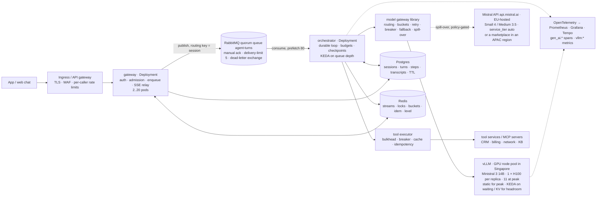

# Scaling Agentic Solutions on Mistral — a primer

*Sizing and deploying an agentic solution on Mistral models — hosted on Mistral's API or self-hosted on the customer's own GPUs — worked on a Singapore telco's support agent. Facts checked 19 September 2026; sections are numbered for drilling. Callouts: **Numbers** (anchors to keep in your head), **Verify** (facts that move), **Pitfall** (what an experienced platform team hears as inexperience).*

The code and notebooks are in the `agentic-scaling-lab-mistral` repository; every number below is computed by `python -m scalelab.capacity` (its output is `docs/03-capacity-plan.md`) or measured by `scalelab/sim.py`, so the numbers cannot drift apart. Self-hosted throughput comes from the lab's first-principles replica model (`scalelab/serving.py`) and is an estimate until `vllm bench serve` replaces it on the customer's hardware.

---

## 0. The thesis, and how the deployment conversation tests it

An agent system is scaled by bounding tokens, not by adding servers. Everything that looks like a classic capacity problem — pods, connections, queue depth, database throughput — is small and cheap next to one number: tokens per minute at the model. The design work is to make demand for that resource predictable (admission control, routing, caching, compaction), to degrade instead of collapse when it runs out (levels, shedding, fallbacks, spill-over), and to make every turn survive the failures a long, side-effecting unit of work invites (checkpoints, idempotency, at-least-once delivery).

With Mistral there are two ways to pay for those tokens, and the choice is the spine of the conversation. On Mistral's API the constraint is a rate limit — requests per second, tokens per minute and tokens per month, per model, shared by the customer's whole organisation — and the price is per token: linear in volume, zero when idle. On the customer's own GPUs, or a partner's sovereign cloud, the constraint is a fleet you sized: open-weight models on vLLM, paid for by the GPU-hour whether busy or not, with a latency that depends on how hard you load them. The API is the default until sovereignty, latency control or customisation says otherwise, and Part 3 prices that "otherwise": for the anchor scenario — a Singapore operator at 100,000 conversations a day — the API costs about $40 k a month and a peak-sized fleet about $55 k on on-demand H100s or roughly the API's price on committed ones; the fleet wins on price only below about $4.95 a GPU-hour, so residency decides, not price.

A deployment design has to answer four things: *estimation*, from "100,000 conversations a day" to tokens, in-flight turns, GPUs and dollars for both ways of paying; *trade-offs* between hosted, self-hosted and hybrid, models, and GPU terms; *robustness* — what breaks first and what the user sees; and *judgement* about which mechanisms this customer needs at their scale and where the delivery team's own assets slot in.

---

## 1. What is different about scaling agents

### 1.1 The unit of work is a turn, not a request

A web request is stateless, short and homogeneous; you scale it by adding replicas until CPU is the limit. A turn of an agent is a *loop*: a model call that plans, tool calls that fetch or change something, another model call that answers, sometimes more. Its length is decided at run time by the model, its steps are sequential, its middle steps have side effects in systems you do not own, and its context grows as the conversation goes on.

| Property | Web request | ML inference request | Agent turn |
|---|---|---|---|
| Duration | 10–200 ms | 20–500 ms | 3–30 s, variable |
| Steps | 1 | 1 | 2–8, decided at run time |
| Binding resource | CPU / DB connections | GPU seconds | tokens per minute at a shared pool — or the batch your own replicas can run at the latency you promised |
| Cost driver | requests | requests | tokens × steps × context length; or GPU-hours sized for the peak |
| State | none or a row | none | a growing transcript plus checkpoints |
| Side effects | in your DB | none | in the customer's CRM, billing, ticketing |
| Failure unit | retry the request | retry the request | resume the *step*, never repeat a write |

### 1.2 The binding constraint is model throughput — shared on the API, sized by you on a fleet

On Mistral's API limits are enforced per model in three units — requests per second, tokens per minute counting input and output, and tokens per month — and scale with the organisation's cumulative billing; the paid tiers' numbers are shown only in the console, and above the top tier you write to support. A 429 means the limit was hit, and no `Retry-After` header is documented. The limit is shared (ask whether it scopes to the workspace or the organisation; the docs disagree), so another project in the same organisation can consume the headroom you planned on; and there is no self-service purchase: the capacity plan *is* the support request, and the Priority Tier (`service_tier="auto"`, 1.75× list) is where custom per-model limits and a documented SLA live.

On your own GPUs the constraint is a fleet you sized: a vLLM replica has a KV-cache budget that bounds how many sequences it holds and an HBM bandwidth that sets how long each decode step takes. Nobody else's traffic is in it and nobody answers 429 — and nothing stops you overloading it: vLLM queues indefinitely by default, and the only sign of overload is that everyone gets slower.

> **Numbers** — Free mode 1 RPS / 500 k TPM / 1 B tokens a month; paid tiers console-only, unlocked at $20 / $100 / $500 / $2,000 of cumulative billing; then support. Priority Tier ×1.75 with a 99.5 % SLA in the docs (99.9 % on the AI Cloud page — verify). One H100 running Ministral 3 14B delivers about 1,200 output tokens a second at 20 ms per token; 20 M TPM on the API is 333 k tokens a second.

### 1.3 Latency is a sum of sequential tails — and on your GPUs the time per token is the batch you run

A turn with two tool calls has four segments on the critical path: plan call, tools, answer call, streaming. Because the segments are sequential, the turn's p95 is roughly the sum of their tails, so a tight target forces parallel tools, streaming, prefetching and a small planning model. Little's law couples latency to concurrency: at 20 turns a second, a 6-second turn is 125 turns in flight and a 10-second turn is 208. Slowdowns *are* capacity problems.

On the API, TTFT and tokens per second are whatever Mistral's fleet gives you that minute. On your own replica they are arithmetic: each decode step streams the weights (15.7 GB for Ministral 3 14B in FP8) plus every running sequence's KV cache (160 KiB per token) through an H100's 3.35 TB/s — about 10 ms per token at batch 1, 20 ms at 24, 37 ms at 64, while aggregate throughput rises from 98 to 1,200 and 1,730 tokens a second. The latency you want is the batch you can afford.

### 1.4 Cost scales with context, and context grows

The bill is tokens, and input dominates: a support turn sends 5 k tokens of prompt, tool schemas, customer context and history to receive 200 back. On Mistral Small 4 ($0.15 / $0.60 per million, cached input $0.015) the anchor call costs $0.000505 with the prefix cached, and the 2,300 uncached input tokens are 68 % of it; on Medium 3.5 ($1.50 / $7.50 / $0.15) the same call is $0.005355, 10.6 times more, so routing 10 % of calls to it makes 54 % of the planning mix's bill. Three levers change cost by integer factors — route, cache the stable prefix (10 % of the input price, 64-token blocks, `prompt_cache_key`), bound the context (compaction, tool-result truncation, output caps) — and the order matters, because each later percentage applies to the new baseline; on a fleet the same levers cut GPUs instead of dollars.

### 1.5 Side effects mean at-least-once, and at-least-once means idempotency

Somewhere in a turn the agent opens a ticket or changes a plan. The process can die between doing that and recording it: Kubernetes sends SIGTERM and waits the termination grace period (30 s by default), a node drains, a spot node is reclaimed, the model call times out, the queue redelivers. RabbitMQ quorum queues give at-least-once delivery with manual acknowledgement and nothing stronger, so the loop must be *replayable*: checkpoint every step before acting on it, key every write by turn, step and arguments, and let redelivery find the checkpoint and skip what was done.

### 1.6 The feedback loop that kills agent systems, in two forms

More load → the model slows or pushes back → retries and longer calls → longer turns → more turns in flight → the model slows further. Without a brake, the system slows for everyone until deadlines fire and users give up, having consumed the tokens anyway. On the API the loop announces itself as a 429 storm. On a fleet it is silent: vLLM never says no, the batch grows, the time per token grows with it, and nothing in the error logs changes while p50 doubles.

The load generator (`scalelab/sim.py`, notebook 04) reproduces both. Against a simulated 3 M TPM API pool, 120 users with naive retries push the p95 turn to 39 s with 394 rate-limit responses and 35 failed turns; degrade levels alone bring it to 5.5 s by moving half the turns to Ministral 3 8B once the pool passes 80 %; degrade levels plus an in-flight cap of 26 derived from the pool's token budget give 3.3 s, zero 429s and 22 % of attempts shed with a `Retry-After`. Against two Ministral 3 14B replicas the same overload produces *zero errors and zero 429s*: the batch climbs to 60 per replica and the p50 turn goes from 5.7 s to 12.3 s, p95 15.3 s; a cap of 53 from the fleet's batch budget gives a p95 of 8.8 s with 17 % shed, and the hybrid — fleet first, API as spill-over, cap 79 — 6.5 s with 4 % shed and 30 % of calls on the API. Shedding fast is kinder than queueing slowly.

### 1.7 Multi-agent multiplies everything

A coordinator with three specialists turns 2.2 model calls per turn into eight, cost by 3.6×, latency by 2× even with parallel specialists, and the probability that every hop succeeds from 0.95^2.2 ≈ 0.89 to 0.95^8 ≈ 0.66 at 95 % per hop. The multi-agent question is therefore never "how do I scale the coordinator"; it is "what measured problem justifies that multiple" — usually a tool set too large for one context, or permissions that must differ per step.

### 1.8 Sovereignty is a scaling dimension

Mistral's global endpoint hosts data in the European Union by default; the regional endpoints `api.eu.mistral.ai` and `api.us.mistral.ai` (GA 11 August 2026, +10 %) pin it to Europe or the US and drop Agents, Batch and Files — and there is no APAC endpoint. The marketplaces fill part of the gap: on Amazon Bedrock, Large 3 and Ministral 3 (not Medium 3.5 or Small 4) are in Tokyo, Mumbai and Sydney but not Singapore in the tables fetched on 19 September 2026; the Azure Foundry rows fetched for Large 3 and Medium 3.5 list Americas regions only; IBM watsonx has them in Sydney. The routes that keep data in Singapore are the customer's own GPUs (AWS p5, GCP a3 or Azure ND H200 v5 in-region) and Singtel's RE:AI sovereign AI cloud (MOU with Mistral, 27 April 2026; data centres in Singapore, Johor and Batam — two of them outside the country).

The licence is a second gate: Small 4, Large 3 and Ministral 3 are Apache 2.0; Medium 3.5's Modified MIT licence requires a commercial licence above $20 M of global monthly revenue — every telco in the region — so self-hosting it is a sales conversation. And in Singapore the driver is governance rather than law: there is no general localisation mandate; the MAS Guidelines on AI Risk Management (consulted November 2025 to January 2026) and the MAS AI Risk Management Toolkit (20 March 2026) push regulated firms toward model-risk controls, and the customer's own risk function turns "personal data stays in Singapore" into a requirement. Elsewhere the driver can be law (Indonesia and Vietnam localise certain data types; Korea's AI Basic Act took effect on 22 January 2026), which discovery must surface first.

> **Pitfall** — Two sentences that end a technical conversation early: "put it on Kubernetes with an HPA and autoscaling handles it" (a pod autoscaler cannot make tokens, and a GPU node takes three to eight minutes to arrive), and "GPUs are cheaper than the API at scale" said without the GPU price and the utilisation that make it true or false.

---

## 2. The dimensions of scale — a checklist for discovery

Run down this list in the first fifteen minutes of discovery: the question that changes the design, the number you compute, the lever you would reach for.

| Dimension | Ask | Compute | Lever |
|---|---|---|---|
| Deployment path | Hosted global (EU-hosted)? Regional (EU/US, +10 %)? An APAC marketplace region? The customer's GPUs? A partner sovereign cloud? A hybrid? | which paths the data policy permits; the cost of each | the decision itself, then the spill-over rules |
| Data policy | Which data may leave the country or reach a shared API at all? Zero data retention? Which traffic carries no personal data? | the share of traffic eligible for the API | policy-gated spill-over; redaction; a fleet for the rest |
| Volume and burstiness | Conversations per day? Peak-to-average? What does an incident do? | conv/s, turns/s, calls/s at average, peak, incident | admission control; the rate-limit request or the fleet size; degrade for incidents |
| Turn shape | Turns, calls and tool calls per turn; tokens in and out; reasoning on or off | tokens per turn; TPM; output tokens/s (what sizes GPUs) | routing, caching, compaction, output caps, `reasoning_effort` |
| Latency budget | What must the user see and when? Does 10 s with streamed progress beat 6 s? | TTFT and turn p95; on a fleet, the batch that meets the target | streaming, parallel tools, prefetch, batch target, speculative decoding |
| Concurrency | Users at once? Conversation length? | in-flight turns = turns/s × turn duration; sessions = conv/s × conversation duration | in-flight cap, per-pod concurrency |
| Model capacity | Which tier is the org on? What limit will Mistral grant? Which GPUs exist in-region, at what price and term? | demand vs limit; output tokens/s vs fleet; the GPU price against the break-even | the support request, the Priority Tier, the fleet size and GPU term |
| Model and licence | Which model per step? Self-hostable (Apache 2.0 vs Modified MIT)? Fits one GPU? | $/call by model; weights and KV per model | Small 4 by default; Medium 3.5 for escalation; Ministral 3 on the fleet |
| Tools and downstream | Which systems, their QPS limits and p95? Which calls have side effects? | tool calls/s per system vs its limit | prefetch, caching, bulkheads, breakers, idempotency keys |
| State | What must survive a crash, a node loss, a region failure? Retention? | writes/s, rows per turn, retention | checkpoints in Postgres, hot state in Redis, TTLs |
| Tenancy and fairness | One brand or many? Priorities? | per-tenant turns/min; priority classes | per-tenant buckets, priority bypass, fairness ids at the inference gateway |

---

## 3. The arithmetic, worked

The anchor scenario is a fictional Singapore mobile operator, Meridian Mobile, with a support agent in its app. The assumptions are deliberately ordinary; the method has to produce a price for both ways of paying.

### 3.1 Assumptions

| Assumption | Value |
|---|---|
| Conversations per day | 100,000 |
| Peak hour vs daily average | 3× |
| Network-incident spike vs average | 10× (an outage; 75 % of intents are "no signal") |
| Turns per conversation | 6 |
| Model calls per turn | 2.2 (plan, answer, sometimes a third) |
| Tool calls per turn | 1.3 (0.7 CRM, 0.25 billing, the rest network status and knowledge base) |
| Input tokens per model call | 5,000, of which 2,700 cached (a 3,000-token stable prefix hit 90 % of the time) |
| Output tokens per model call | 200, reasoning off: ~60-token tool-call steps, ~300-token answers |
| Turn duration (p50), hosted | 6 s, about 1 s of it tool time; users think for ~60 s between turns |
| Hosted models | Small 4 (`mistral-small-2603`) for 90 % of calls; Medium 3.5 (`mistral-medium-3-5`) for the 10 % that escalate; Ministral 3 8B as the degrade model |
| Hosted limit | 20 M TPM and 60 RPS on Small 4, assumed granted (paid-tier numbers are console-only) |
| Self-hosted model | Ministral 3 14B (FP8, Apache 2.0) on vLLM 0.29, one H100 SXM 80 GB per replica, target 20 ms per output token, never fewer than two replicas |
| GPU price | AWS p5 on-demand $6.88 per GPU-hour (US list; Singapore's to be verified), committed and neocloud prices compared |
| Downstream limits | CRM 200 QPS; billing mainframe 40 QPS |
| Residency | customer personal data stays in Singapore (the customer's risk function, citing the MAS guidelines) |

### 3.2 Rates and tokens

| Quantity | Average | Peak | Incident |
|---|---:|---:|---:|
| Conversations / s | 1.16 | 3.47 | 11.6 |
| Turns / s | 6.94 | 20.8 | 69.4 |
| Model calls / s | 15.3 | 45.8 | 153 |
| Input tokens / min | 4.58 M | 13.75 M | 45.8 M |
| … of which uncached | 2.11 M | 6.33 M | 21.1 M |
| Output tokens / min | 183 k | 550 k | 1.83 M |
| Total TPM vs the assumed 20 M limit | 0.24× | 0.72× | **2.38×** |
| Calls / s vs the requested 60 RPS | 0.25× | 0.76× | **2.55×** |

Out loud: 100,000 ÷ 86,400 ≈ 1.16 conversations a second; × 6 turns ≈ 7 a second; × 2.2 calls ≈ 15 a second; × 5,200 tokens × 60 ≈ 4.9 M tokens a minute. Peak is 14.3 M, inside a 20 M limit; an incident is 47.7 M, two and a half times the limit in tokens and in requests. Peak is a support ticket; the incident must be *shaped*, because no tier makes 48 M TPM appear in a minute and no fleet sized for the peak carries 2.3 times the peak.

> **Verify** — Whether cached tokens count at full weight against the TPM limit: the docs define it as input plus output and say nothing about cached tokens, so the lab counts them fully and treats relief as upside. Also the limit's scope (workspace or organisation) and the absence of a `Retry-After` header — trigger a 429 and read the headers.

### 3.3 Concurrency, from Little's law

In-flight turns = turns/s × turn duration: 6.9 × 6 ≈ 42 at average, 125 at peak, 417 during an incident on the hosted path. Concurrent *sessions* are eleven times larger because users think between turns: a conversation lasts 6 × (6 + 60) ≈ 400 s, so 460 / 1,400 / 4,600 sessions.

The token limit also caps concurrency: 20 M TPM ÷ 60 ≈ 333 k tokens/s; a turn consumes 2.2 × 5,200 ≈ 11.4 k tokens over 6 s ≈ 1.9 k tokens/s; so the limit sustains about 175 turns in flight, or 29 turns per second — the starting value for the admission controller's in-flight cap (`AdmissionConfig.max_inflight` in `scalelab/admission.py`), above peak demand and below the incident. On the self-hosted path the turn is longer (10 s at the batch chosen in 3.5), so in-flight turns are 69 / 208 / 692, and the cap comes from the fleet: 293 at peak.

### 3.4 Hosted: cost per conversation, and the rate-limit request

| Configuration | Per model call | Per conversation | Per month |
|---|---:|---:|---:|
| All Small 4, no caching | $0.00087 | $0.0115 | $34.9 k |
| All Small 4, prefix cached | $0.00051 | $0.0067 | $20.3 k |
| Planning mix: 90 % Small 4 + 10 % Medium 3.5, cached | $0.00099 | **$0.0131** | **$39.7 k** |
| Planning mix on the Priority Tier (×1.75) | — | $0.0229 | $69.6 k |
| Planning mix on an EU/US regional endpoint (×1.10) | — | $0.0144 | $43.7 k |
| All Large 3, cached | $0.00159 | $0.0209 | $63.6 k |
| All Medium 3.5, cached | $0.00536 | $0.0707 | $214.9 k |
| All Ministral 3 14B, cached | $0.00055 | $0.0073 | $22.2 k |

Working: a Small 4 call with 2,300 uncached input tokens at $0.15/M, 2,700 cached at $0.015/M and 200 output at $0.60/M costs $0.000345 + $0.00004 + $0.00012 ≈ $0.000505; thirteen calls a conversation ≈ $0.0067; one call in ten on Medium 3.5 at $0.005355 doubles it to $0.0131. Uncached input is two-thirds of a Small 4 call, so the prefix cache is worth more than any output cap; and the 10 % escalation share is 54 % of the mix, so the routing rule for Medium 3.5 is the most expensive line in the prompt.

The other half of the hosted plan is the request: peak demand with 30 % headroom is **60 requests per second, 19 M tokens per minute and 209 B tokens a month** on Small 4, and that goes in the ticket to Mistral support with the model id and the daily curve. The free tier covers 10 % of the average TPM, and the paid tiers are console-only, so enable pay-as-you-go on the customer's org, read the limits and file the ticket before the pilot ends.

> **Verify** — List prices on 19 September 2026: Small 4 $0.15 / $0.60 / $0.015 cached; Large 3 $0.50 / $1.50 / $0.05; Medium 3.5 $1.50 / $7.50 / $0.15; Ministral 3 14B / 8B / 3B $0.20 / $0.15 / $0.10 flat; Batch −50 %; regional +10 %; Priority ×1.75. The id `mistral-medium-3-5` is the changelog's spelling — confirm with `GET /v1/models`. Cache-write price and cache lifetime are not published.

### 3.5 Self-hosted: the replica, then the fleet

A vLLM replica is one copy of the weights across `tp` GPUs (`scalelab/serving.py`, estimates with explicit efficiency factors). *Memory decides concurrency*: an H100 at vLLM's default `gpu_memory_utilization` 0.92 gives 73.6 GB; minus 4 GB for activations and 15.7 GB of FP8 weights leaves 53.9 GB of KV cache, about 329 k tokens at 160 KiB each — with the 2,700-token prefix stored once, about 130 calls, so vLLM's default `max_num_seqs` of 128 binds. *Bandwidth decides the time per token*, as 1.3 showed. *Prefill decides TTFT*: 2,300 new tokens at two FLOPs per active parameter is 6.2 × 10¹³ FLOP, about 78 ms at 40 % of the H100's FP8 peak.

The batch you run is the latency you deliver *and* the fleet you buy. Each row is Ministral 3 14B on one H100, a 5,200-token context, 200 output tokens, 2.2 calls plus a second of tools per turn, and a fleet sized for the peak with 30 % headroom:

| Batch per replica | Time per token | Tokens/s per replica | Call | Turn | Replicas at peak | $/month, AWS on-demand |
|---:|---:|---:|---:|---:|---:|---:|
| 1 | 10.2 ms | 98 | 2.1 s | 5.7 s | 127 | $638 k |
| 4 | 11.5 ms | 348 | 2.4 s | 6.2 s | 36 | $181 k |
| 16 | 16.6 ms | 964 | 3.4 s | 8.5 s | 13 | $65 k |
| **24** | **20.0 ms** | **1,201** | **4.1 s** | **10.0 s** | **11** | **$55.2 k** |
| 64 | 36.9 ms | 1,733 | 7.5 s | 17.4 s | 7 | $35 k |

The plan's row is batch 24: 20 ms per token, 1,201 tokens a second per replica, a 4.1-second call and a 10-second turn against 6 s on the API. The fleet needs 4 / 11 / 34 replicas at average, peak and incident, one GPU each (`capacity.fleet()` takes the larger of the throughput-bound and the concurrency-bound count, adds the headroom, and never goes below two replicas, so a rollout or a node loss cannot take the fleet down). The peak-sized fleet costs **$55,246 a month on AWS on-demand**, $0.0182 per conversation, is 28 % utilised on average, spends 0.16 GPU-minutes on a conversation, can hold **293 turns in flight** — the self-hosted in-flight cap — and is 1.39× the hosted planning mix.

The other open-weight models, also as estimates: Mistral Small 4 (119 B total, 6.5 B active, 121 GB FP8, tensor parallel 2 on the model card) on a pair of H100s has a 3.7 ms step at batch 1 and about 3,700 tokens a second at batch 128, so it needs 18 GPUs at the 20 ms target and 26 for a 6-second turn against 30–46 for Ministral, because a tight latency target rewards a low active-parameter count. Medium 3.5 (134 GB FP8) is an eight-GPU replica plus a commercial licence, Large 3 (682 GB FP8) is eight H200s at about 3,900 tokens a second per node, and the L40S's 864 GB/s makes a 14 B model's step 34 ms at batch 1, whatever its hourly price.

> **Numbers** — KV per token, BF16: Ministral 3 14B 160 KiB; Small 4 22.5 KiB (MLA); Large 3 68.6 KiB (MLA); Medium 3.5 352 KiB; FP8 KV halves each. FP8 weights: Ministral 14B 15.7 GB; Small 4 121 GB; Medium 3.5 134 GB; Large 3 682 GB. H100 SXM 80 GB at 3.35 TB/s; H200 141 GB at 4.8 TB/s.

### 3.6 The break-even, and the six-second tension

Both bills grow with volume — the API linearly at $0.0131 a conversation, the fleet in replica-sized steps as the peak grows — so the break-even is not a volume but a GPU price. At 28 % average utilisation the fleet spends 0.16 GPU-minutes on a conversation, so it beats the hosted planning mix whenever an H100-hour costs less than $0.0131 ÷ (0.16 ÷ 60) ≈ **$4.95**:

| GPU price | $ / GPU-hour | Peak fleet, $ / month | $ / conversation | vs the hosted mix | Floor: conversations / day to amortise two replicas |
|---|---:|---:|---:|---:|---:|
| AWS on-demand | 6.88 | $55,246 | $0.0182 | 1.39× | 25 k |
| AWS capacity block (Tokyo/Sydney/Mumbai) | 4.72 | $37,902 | $0.0125 | 0.95× | 17 k |
| GCP 3-year commitment | 4.86 | $39,026 | $0.0128 | 0.98× | 18 k |
| Azure 3-year reservation | 5.40 | $43,362 | $0.0143 | 1.09× | 20 k |
| Neocloud | 3.75 | $30,112 | $0.0099 | 0.76× | 14 k |
| GCP on-demand | 11.06 | $88,812 | $0.0292 | 2.23× | 41 k |

So the fleet loses on on-demand H100s (about $15.5 k a month more than the API), is level on three-year commitments and APAC capacity blocks (the latter priced for Tokyo, Sydney and Mumbai, not Singapore), and wins on neocloud GPUs (about $9.6 k a month less). Volume only matters at the bottom: the fleet never runs fewer than two replicas, and that floor is amortised above about 14 k conversations a day at $3.75, 17 k at $4.72–4.86 and 25 k at $6.88; above it, the price of the GPU-hour decides, not the size of the customer. And because the fleet's cost does not fall when traffic does, the hybrid — a fleet for the base load, the API for the peak hours — is the self-hosted analogue of "provisioned throughput plus pay-as-you-go spill-over": it raises the fleet's utilisation, and with it the GPU price at which the fleet wins, provided the data policy lets the peak traffic leave.

The second tension is latency. The hosted turn is 6 s; the plan's self-hosted turn is 10 s, because 20 ms times 200 tokens is four seconds a call. A 6-second turn on the fleet needs a step of about 11 ms, which this replica delivers only at a batch of three to five — 30–46 H100s at peak instead of 11, three to four times the GPUs and $150–230 k a month on-demand. The alternatives are speculative decoding (Mistral publishes EAGLE drafts for Small 4, Medium 3.5 and Large 3; on Ministral you would test n-gram or a draft model), a model with fewer active parameters (Small 4's 26 GPUs), or streaming and accepting ten seconds, which with progress events is often right.

### 3.7 The rest of the estate

| Resource | Average | Peak | Incident | Limit / note |
|---|---:|---:|---:|---|
| Orchestrator pods (80 in-flight turns each, ×1.4 headroom, 6 s turns) | 1 | 3 | 8 | 2 / 4 / 13 at the fleet's 10 s turn; KEDA on queue depth |
| Gateway pods (250 open streams each; a stream is open only during a turn) | 2 | 2 | 3 | min 2 for warm capacity |
| Postgres writes / s (≈ 6 per turn) | 42 | 125 | 417 | a small HA instance does thousands; partition by day |
| Redis ops / s (≈ 40 per turn) | 280 | 830 | 2,800 | one node does over 100 k/s |
| RabbitMQ messages / s | 7 | 21 | 69 | 5 KB each: trivial for a three-node quorum queue |
| Billing mainframe QPS | 1.7 | 5.2 | 17.4 | limit 40: fine, but cache invoices anyway |
| CRM QPS | 4.9 | 14.6 | 48.6 | limit 200: prefetch at session start, cache the profile |

The non-GPU estate — a few dozen vCPUs of pods plus a small Postgres, Redis and RabbitMQ — is about 1 % of the model bill.

### 3.8 What breaks first

| Level | Resource | Demand vs limit | Fix |
|---|---|---:|---|
| Incident | Hosted RPS limit (60) | 2.55× | shape demand (admission, degrade); ask for burst headroom |
| Incident | Hosted TPM limit (20 M) | 2.38× | shape demand; sibling model with its own limit; cut tokens per call |
| Incident | Self-hosted fleet sized for peak (13.2 k tokens/s) | 2.31× | shed at the cap; spill over what may leave; shorter answers |
| Incident | Billing mainframe | 0.43× | cache invoices for minutes; bulkhead; degrade to cached answers |
| Incident | CRM | 0.24× | prefetch at session start; 5-minute profile cache |
| Incident | Redis, Postgres, RabbitMQ, orchestrator pods | < 0.05× | nothing |

At peak everything fits (0.76× and 0.72× on the hosted limits, 0.69× on the fleet). Kubernetes and the orchestrator pods are not on the list on either path: the model breaks first, in both of its forms, and the billing system sized for humans breaks second.

---

## 4. The reference architecture

A turn, end to end: the ingress applies the WAF and a per-caller limit; the gateway authenticates, checks the tenant's bucket and the global in-flight cap, decides a degrade level, writes the turn row to Postgres, publishes to the `agent-turns` quorum queue with the session id as routing key, and relays the turn's event stream to the client over SSE from a Redis stream. An orchestrator pod consumes the message, takes the session lock, loads any checkpointed steps, and runs the loop under a budget: a model call through the model gateway — to the fleet, or to the API when the fleet is saturated and the policy allows it — with deltas streamed into Redis; a checkpoint; tool calls in parallel; a checkpoint; repeat; finish. It writes the transcript, publishes the terminal event, decrements the in-flight gauge and acknowledges the message; compaction runs afterwards, still inside the pod.

### 4.1 Why it is shaped this way

*Gateway and orchestrator are separate Deployments* because they scale on different signals and fail differently: a streaming connection costs a coroutine and a few kilobytes, the loop costs tokens, tool calls and the memory of a full context.

*A queue sits between them even though the user is waiting* because it turns a burst into a backlog with one observable number — the age of the oldest unstarted turn — gives at-least-once execution with redelivery, and lets the token bucket or the fleet's batch, not the ingress, set the pace.

*Postgres holds the durable state and Redis the hot state* because their access patterns are opposite: a handful of row writes per turn that must survive anything, versus thousands of sub-millisecond operations per second that may be lost without harm.

*The model gateway is a library with two backends and a policy, not a service*: its state fits in Redis and vLLM's `/metrics`, and the fleet and the API are two entries in its routing table, which is what makes hosted, self-hosted and hybrid the same code with different configuration. It becomes a service when many agents share one fleet — the job of an inference gateway in front of the GPUs.

*The GPU node pool is static, sized for the peak, with autoscaling only for headroom*, because a GPU node takes three to eight minutes to join, pull the image and load weights, and the incident arrives faster; KEDA on `vllm:num_requests_waiting` and `vllm:kv_cache_usage_perc` is for the slow tail of a peak, not the cliff.

### 4.2 Alternatives and when to choose them

Plain vLLM Deployments behind a Service (this design) are right up to about ten replicas of a single-GPU model, with every setting visible and the gateway doing admission; what they lack is cache-aware routing, a prefill/decode split and priority at the GPU. llm-d or KServe's `LLMInferenceService` with the Gateway API Inference Extension add those — KV-cache-aware routing, prefill/decode disaggregation, `InferencePool` and `InferenceObjective` priority, the Workload Variant Autoscaler — at the cost of more moving parts and an alpha flow-control feature (llm-d v0.9.0 and the extension's v1.5.0; release years inferred, verify). NVIDIA NIM containers suit a customer who wants a supported, profiled container under NVIDIA AI Enterprise ($1 per GPU-hour or $4,500 per GPU-year), though H100 is absent from Small 4's profile matrix and the Large 3 NIM is flagged end-of-support. Mistral's Agents & Conversations API and the Temporal-based AI Studio Agent Runtime run the loop for you on the hosted path, with handoffs, built-in tools and MCP Connectors (public preview), but not on regional endpoints, under a `client.beta.*` label, without Ministral 3, and with less control over budgets and checkpoints. Kafka, NATS JetStream or a cloud's managed queue can replace RabbitMQ (Kafka has no per-message nack or dead-lettering, so you build the retry topic), and a single-cloud customer can swap the estate for that cloud's managed pieces. The *mechanisms* in Part 5 are the same in every case; only where they are configured differs, and the Kubernetes shape is the one a GSI can reuse across customers and clouds.

---

## 5. The scaling mechanisms

### 5.1 Quota strategy on the API, capacity strategy on the fleet

On the API, demand is shaped before it reaches the limit, in three layers. An in-flight cap at the gateway (5.3) bounds how many turns are generating tokens at once. A token bucket per model in the model gateway (`TokenBucket` in `scalelab/resilience.py`), sized to *your share* of the granted limit, spreads calls within each second (the requests-per-second limit binds first at the incident); its capacity is about six seconds of refill, and it lives in Redis as a Lua script once there is more than one pod. And the endpoint and tier are chosen per call: the global endpoint unless the data policy says EU or US; the Priority Tier (`service_tier="auto"`, which falls back to standard when exhausted and reports `service_tier` in the response) for traffic that must not queue; the Batch API at half price with a 24-hour default `timeout_hours` for offline work only.

The paperwork half belongs to the delivery team: tiers unlock on cumulative billing, so a customer's org starts in free mode at 1 RPS and climbs only by spending; the plan's request goes to support as soon as the pilot's shape is known, with a Priority Tier entitlement if the customer wants an SLA; and the workspace spending cap (none by default) is set above the plan with margin, because a cap that trips suspends the workspace's API access until the month ends.

On the fleet the strategy inverts: capacity is bought in advance — eleven H100s for the peak, on committed terms if the customer can commit — because the 3–8-minute cold start is longer than an incident takes to arrive. KEDA on `vllm:num_requests_waiting` (about 5 per replica, `sum()` with an `AverageValue` target so the threshold grows with the fleet) and `vllm:kv_cache_usage_perc` (0.8) covers the slow tail of a peak, with a long cooldown and pre-scaling before known events. What flexes fast is the API: spill-over (5.2) is the fleet's burst capacity, bought by the token and bounded by policy.

> **Numbers** — Prompt caching: 64-token blocks, 10 % of the input price, `prompt_cache_key`, hits in `usage.prompt_tokens_details.cached_tokens`, not guaranteed. Batch: −50 %, `timeout_hours` default 24, up to 1 M requests per file (100 k on the known-limitations page — the pages disagree). Cold start 3–8 min; a 121 GB Small 4 checkpoint streams in about a minute at 2 GiB/s, Large 3's 682 GB in about six.

### 5.2 Retries, jitter, breakers, fallbacks, spill-over

The `mistralai` SDK (2.10.1, 15 September 2026) does **not** retry by default; with a `RetryConfig` it retries 429 and 5xx, and its default timeout is 300 s. Keep the SDK's retries off and retry in the model gateway (`call_with_retries` in `scalelab/resilience.py`), so one place decides: exponential backoff from 0.5 s to a cap of 8 s with *full* jitter — a uniform draw between zero and the backoff, because when a shared limit throttles, every client sees the 429 at the same moment and, without jitter, retries at the same moment; a `Retry-After` honoured with jitter on top when one arrives (Mistral documents none); at most four attempts; never past the turn's deadline. Set the per-call timeout to about 30 s; the 300-second default hides a hung stream for five minutes against a 45 s turn budget.

Two kinds of pushback arrive and the gateway treats them alike (`RateLimited` and its subclass `ServerOverloaded` in `scalelab/model.py`): the API's **429** when the shared limit is hit, and vLLM's **503** when `--max-num-queued-reqs` or `--max-num-queued-tokens` is set and the queue is full — without those flags vLLM queues without limit and never says no. Both count toward the pushback ratio that drives the degrade level; a 400 that says the context overflowed goes to compaction, not to a retry.

A circuit breaker per model and per tool (`CircuitBreaker`: five failures in a 30-second window open it for 15 s, then one probe) matters more for agents than for web services, because a sick dependency pins hundreds of coroutines *with their contexts in memory* until the deadline. When a breaker opens, or two consecutive pushbacks arrive, the gateway moves to a *sibling* with its own limit or pool: Small 4 to Ministral 3 8B on the API, Medium 3.5 escalations back to Small 4, the API itself on the fleet. Model ids live in configuration, never in code, which is also how you survive a deprecation — Magistral, Devstral, Pixtral and Medium 3.1 were deprecated together on 22 May 2026, with no published notice period.

Spill-over is the fallback that is also a capacity strategy. The model gateway (`HybridBackend`) sends a call to the API when the fleet's saturation — running plus waiting sequences against the batch at which the fleet meets its latency target — passes 0.9, and records which backend served it (30 % of calls in the lab's hybrid overload run). The gate is policy: a turn is eligible when its traffic carries no personal data (the incident bulletin, a generic plan question, a knowledge-base lookup on redacted text); everything else waits for the fleet or is shed. That rule is what lets a fleet be sized for the base load in a residency-bound deployment, and the customer's risk function signs it, so write it with them.

> **Pitfall** — "We use the SDK's retries" without a deadline, or "vLLM will tell us when it's overloaded" without `--max-num-queued-reqs`. The first retries into a turn that has already timed out for the user; the second waits for a signal that never comes.

### 5.3 Admission control and graceful degradation

Admission control is the brake on the feedback loop of 1.6, in both of its forms. It sits at the gateway, before a turn has cost anything, and asks three questions in order: is this tenant within its budget; what is the system's degrade level; and would admitting this turn exceed the in-flight cap. The cap starts at the number the capacity plan derived — 175 turns from the 20 M TPM limit, 293 from the eleven-replica fleet at batch 24 — and is tuned from load tests; priority classes (an agent-assist console, a VIP tier) bypass it.

The degrade level (`AdmissionController.compute_level` in `scalelab/admission.py`) is computed from signals every pod can publish — in-flight turns, the age of the oldest queued turn, the share of model calls pushed back in the last minute, whether a breaker is open, and the backend's *saturation* — and is written to Redis so every pod degrades together. Saturation is the signal the fleet needs and the API does not: KV-cache usage plus the queue, the same two quantities the Gateway API Inference Extension's saturation detector reads with its defaults of a queue depth of 5 and KV utilisation of 0.8. Each level buys capacity by giving something up:

| Level | Trigger | What changes | Effect in the lab's runs |
|---|---|---|---|
| 0 | normal | — | Small 4 on the API; batch at or under the target on the fleet |
| 1 | in-flight ≥ 80 % of cap, queue age ≥ 10 s, pushback ratio ≥ 5 %, or saturation ≥ 0.8 | Ministral 3 8B with a shorter cap on the API, shorter answers on the fleet; optional tools withheld | hosted p95 from 39 s to 5.5 s |
| 2 | a breaker open, pushback ratio ≥ 15 %, or saturation ≥ 1.0 (a queue exists) | cheapest model; no writes and no slow tools (`get_invoice` withheld); canned incident answer | the billing mainframe untouched during an outage |
| 3 | in-flight ≥ cap, or queue age ≥ 30 s | shed everything below priority 2 with 503 and a `Retry-After` that grows with the level (20 s at level 3) | bounded latency for admitted turns: 3.3 s hosted, 8.8 s on two replicas |

Two details separate a working implementation from a diagram: levels 1 and 2 need hysteresis (the lab holds a raised level for 15 s) or the level flaps, while level 3 follows the instantaneous cap because it must switch off the moment turns drain; and `Retry-After` must be jittered by the *client*, or every shed user returns together.

### 5.4 Durable execution

The loop (`run_turn` in `scalelab/loop.py`) checkpoints every step in Postgres *before* acting on its result: the model's response after the model call, the compacted tool results after the tool step. On redelivery the orchestrator replays from the checkpoint; the tool executor keys every write by turn, step, call index and tool name (plus a hash of the arguments in production) and keeps the result under that key in Redis for a day, so a redelivered turn that already opened a ticket gets the same ticket back. The lab's crash test (notebook 02) kills the process right after the ticket is checkpointed and shows one ticket after redelivery.

The queue contract is the other half. `agent-turns` is a quorum queue; consumers acknowledge manually, with prefetch set to the pod's concurrency (80). The orchestrator acknowledges every *terminal* outcome including graceful failure — a turn that ended with "a colleague will follow up" must not be redelivered into a second bill — and rejects with requeue only for transient infrastructure trouble. The delivery limit (`x-delivery-limit`, set to 5 explicitly; check your RabbitMQ version's default) sends a message that keeps failing to the dead-letter exchange, whose queue has its own alert and replay tooling. The consumer timeout (30 minutes by default) is the ceiling for one delivery; the 45 s turn budget sits far under it. Ordering per session comes from the routing key and from a session lock in Redis with the turn id as value and a TTL of the budget plus a margin. In Postgres, `steps` rows carry a unique constraint on (turn, index) so a replayed step is an idempotent insert.

### 5.5 Context engineering for scale

The prompt is laid out for the cache: system instructions, policies and tool schemas first, byte-identical for every user and turn; then the prefetched profile; then a summary of older turns; then the last N messages verbatim; then the new message. On the API the same `prompt_cache_key` goes on every request sharing the prefix; caching works in 64-token blocks, a hit is billed at 10 % of the input price and reported in `usage.prompt_tokens_details.cached_tokens`, and the docs say a key raises the chance of a hit without guaranteeing one and publish neither the cache's lifetime nor a write price. So the prompt *version* is part of the key, and the ratio of cached to prompt tokens is a metric with an alert, because the anchor's 2,700 cached tokens are the difference between $0.0115 and $0.0067 a conversation. On the fleet, vLLM's prefix caching is on by default; the hit rate is `vllm:prefix_cache_hits_total` over `vllm:prefix_cache_queries_total`, and a replica only hits on prefixes it has seen, which is why cache-aware routing matters at more than a few replicas.

Compaction keeps input bounded: when the pending history exceeds a token threshold, everything but the verbatim tail is summarised on the cheap model *after* the turn completes. The anchor's 5,000-token call assumes it; without it each turn adds 400 to 800 tokens, so the twelfth turn's call is two to three times the first's and cost drifts by the same factor, while on a fleet the KV per call grows and the batch shrinks. Output is capped per task and reasoning is set per task with `reasoning_effort`: off for routing, extraction and support answers, on only where a measured problem needs it, because reasoning tokens are billed as output at four to five times the input price, and on a fleet they are decode steps the whole batch pays for.

### 5.6 Tools at scale

The tools are usually the real bottleneck, because the systems behind them were sized for humans. The executor (`execute_tool` and `Tools` in `scalelab/loop.py` and `scalelab/tools.py`) applies, in order: a bulkhead (a semaphore per tool per pod), a circuit breaker per tool, a result cache for pure reads (profile five minutes, invoice two, network status thirty seconds), the idempotency check for writes, a timeout, and one retry for idempotent reads only. Failures come back to the model as *structured data* — `{"error": "billing: rate limited"}` — never as exceptions that abort the turn; the model can usually answer around a missing fact, and an aborted turn is the most expensive outcome of all.

Two habits remove most tool latency from the critical path: prefetch the customer's profile when the session starts, and let the model issue independent calls in one step so they run concurrently (`parallel_tool_calls` defaults to true on the API; vLLM needs `--enable-auto-tool-choice --tool-call-parser mistral`). Tool services run as their own Deployments with their own service accounts and network policies; an MCP server over the same tools standardises discovery — Mistral's Connectors (public preview) register any MCP server as a tool for Agents on the hosted path — at the cost of a hop. Mistral's built-in tools (web search $30 per thousand calls, code execution $30) live only on the Agents API, not on regional endpoints.

### 5.7 Streaming and connections

SSE over HTTP/1.1 chunked transfer is the right transport for a chat agent behind a Kubernetes ingress: it passes every proxy and supports resume with `Last-Event-ID`. An ingress idle timeout (an NGINX ingress reads for 60 s by default, so the relay sends a keep-alive comment every 15 s) and a rolling deploy of the gateway both cut it, so clients reconnect with the last sequence id and the relay serves from the Redis stream, not from memory; Mistral's streaming idle timeout is ten minutes. Time-to-first-token as the user sees it arrives after plan → tools → answer — on the fleet the first answer token at about 2.5 s and the last at about 6.5 s — so a TTFT SLO of two seconds is only attainable by streaming *progress* events ("checking your invoice…") from the tool steps, which the event stream already carries.

### 5.8 vLLM and Kubernetes settings that matter

| Setting | Value for the anchor | Why |
|---|---|---|
| `--max-num-seqs` | 32 on the Ministral 14B replica (default 128) | caps the batch and therefore the time per token; above it, latency is traded away silently |
| `--max-model-len` | 32,768 (default 262,144) | frees KV memory reserved for contexts that never occur |
| `--max-num-batched-tokens` | 16,384 (the API-server default since 0.28) | the chunked-prefill budget per step: smaller favours inter-token latency, larger favours TTFT |
| `--gpu-memory-utilization` | 0.92 (default; Mistral's Small 4 and Medium 3.5 cards use 0.8) | headroom for activations; too high and a long prompt takes the pod out |
| `--kv-cache-dtype fp8` | on, after an evaluation on the customer's transcripts | halves KV bytes: double the resident sequences, a lighter step |
| `--max-num-queued-reqs` / `--max-num-queued-tokens` | about 2 × `max_num_seqs` / a few × 16 k | new in 0.29: a 503 when the queue is full; both default to unlimited, which is the silent collapse |
| `--tensor-parallel-size` | 1 for Ministral 3 14B; 2 for Small 4; 8 for Medium 3.5 and Large 3 | the replica's GPU count inside one node; a node loss takes the whole replica |
| `--speculative-config` | EAGLE drafts published for Small 4, Medium 3.5 and Large 3 (`num_speculative_tokens` 3); n-gram or a draft model to test on Ministral | a lower time per token at the same batch — the route to a six-second turn without four times the GPUs |
| Weight loading | `--load-format runai_streamer` or a node-local NVMe cache; `--kv-cache-memory-bytes` to skip profiling; the loading and tool-parser flags from each model card | 15.7 GB streams in about 30 s, 121 GB in about a minute at 2 GiB/s; the image pull is often the slowest part of the 3–8-minute cold start |
| KEDA | vLLM: `sum(vllm:num_requests_waiting)` at an `AverageValue` of 5 and `vllm:kv_cache_usage_perc` at 0.8, poll 15 s, cooldown 300–360 s, min = the peak fleet (11), max = the incident (34); orchestrator: queue length, about 40 messages per pod | headroom only — static capacity carries the peak because a replica takes minutes to appear |
| GPU node pool and pods | static nodes for the peak on reserved or capacity-block terms; one replica per GPU with `nvidia.com/gpu` requests equal to limits; vLLM pods with 4–8 vCPU and memory at least the weights again; orchestrator 2 vCPU / 2 GiB at concurrency 80 | no time-slicing (no memory isolation) and no MIG (no slice holds a 14 B model with useful KV) |
| PodDisruptionBudget, rollout, termination | vLLM `minAvailable` = peak fleet − 1; `maxSurge` 1 needs a spare GPU; grace 60 s on the orchestrator, 30 s on vLLM with requests drained | a drain must never take two replicas; an hour per rollout of eleven unless there is a spare |

The fleet's latency is set by `--max-num-seqs` and the replica count, not by a percentage on an autoscaler, and the values above come from the load test in notebook 04, to be re-derived from `vllm bench serve` on the real hardware.

### 5.9 State stores

Postgres for the durable rows (sessions, turns, step checkpoints, transcripts): a small highly-available instance with a synchronous replica and point-in-time recovery, day-partitioned tables, a retention job that drops partitions. Redis for the hot state — streams for the event relay, session locks (`SET NX PX`), the Lua token buckets, idempotency markers (`SET NX EX`, 24 h), the degrade level and the in-flight gauge — where one node does over 100 k operations a second against 2,800 at the incident, and a failover costs some reconnects and loses no turn. RabbitMQ as a three-node quorum queue with the oldest message's age as its one dashboard number. Retrieval sits beside these — `pgvector` in the same Postgres, with Mistral Embed or a self-hosted embedding model when the knowledge base itself must not leave.

### 5.10 Observability and SLOs

One trace per turn with a span per model call and tool call, attributes from the OpenTelemetry GenAI semantic conventions (`gen_ai.operation.name`, `gen_ai.provider.name`, `gen_ai.request.model`, `gen_ai.usage.input_tokens` and `output_tokens`, `gen_ai.conversation.id`; still "Development" status, so centralise the names), plus the backend that served the call, the `service_tier` reported, cached tokens and the degrade level. Metrics with low-cardinality labels only (model, backend, tool, tenant, outcome, level; never session or turn ids): tokens by kind, cost, latency and TTFT histograms, pushback ratio, breaker state, in-flight turns, queue age, shed count by reason, spill-over share. The fleet adds vLLM's `/metrics`: `vllm:num_requests_running` and `vllm:num_requests_waiting`, `vllm:kv_cache_usage_perc`, the `vllm:time_to_first_token_seconds`, `vllm:inter_token_latency_seconds` and `vllm:e2e_request_latency_seconds` histograms, `vllm:prefix_cache_hits_total` and `vllm:num_preemptions_total`. GPU utilisation from DCGM is a poor signal — a replica at batch 2 reads as busy — so the dashboards use the queue and the KV usage; confirm the `_total` suffixes on a live scrape.

SLIs: availability (turns that ended with an answer over turns admitted), shed rate, latency attainment (turns under 8 s on the API and 12 s on the fleet; first *progress* event under 2.5 s), cost per conversation on the API and tokens per GPU-hour on the fleet, and, in a residency-bound deployment, the API's share of calls, because a spill-over policy that leaks is a compliance incident. Alerts: queue oldest-message age above 30 s; dead-letter queue above zero; pushback ratio above 5 %; degrade level at 2 or higher for minutes; `vllm:num_requests_waiting` above 5 per replica or KV usage above 0.9 for five minutes; the cached-token share below 80 % of its baseline; the API share above the policy's ceiling; and cost per conversation more than 30 % above its seven-day baseline — the alert that catches the runaway loop before finance does.

### 5.11 Multi-agent designs and budgets

Every turn carries a budget with four independent dimensions — steps, tokens, dollars and a wall-clock deadline (the lab's `Budget`: 6 steps, 40,000 tokens, $0.25, 45 s) — because each fails differently: tool thrash burns steps, a long transcript burns tokens, a Medium 3.5 escalation burns money, a slow mainframe burns time while the user watches a spinner. A turn that exhausts a budget ends *gracefully* with a message and a terminal event; it is not retried. In multi-agent topologies the budget is hierarchical — the coordinator's bounds the sum of the specialists' — and the specialists' calls go through the same gateway and buckets, so fan-out cannot escape admission control. Mistral's Agents API offers handoffs between agents, which is convenient and also a way to lose sight of the budget, so the coordinator's deadline and cost are still enforced by the caller. A specialist is justified by a measured problem, and the design should say which metric would trigger the split.

### 5.12 Tenancy, priority, regions

Per-tenant buckets at the gateway, tenant labels on every metric and cost record, and a priority field on the turn that bypasses the in-flight cap for the classes that must never be shed. On a fleet fronted by the inference extension the same ideas exist at the GPU (a fairness id and an `InferenceObjective` priority).

Regions are where the two halves differ most. The fleet lives in Singapore: node pools across two availability zones, and a replica count that leaves the peak covered when one replica is lost. A disaster-recovery site outside the country — Johor or Batam on a partner cloud, Sydney on a hyperscaler — is a data-policy decision before it is an infrastructure one. The API half is whatever the policy permits: the global endpoint for traffic without personal data; a regional endpoint only for customers whose policy says Europe or the US; a marketplace region for customers whose policy says "in the region" rather than "in the country" — Bedrock's Sydney, Tokyo and Mumbai for Large 3 and Ministral 3, watsonx in Sydney. And the API is not a substitute for availability engineering: the status page's 90-day uptime on 19 September 2026 showed the Completion API at 99.49 %, which is why the fleet-first hybrid is the shape for a three-nines target.

> **Verify** — Bedrock's region table for Mistral models (Singapore absent on 19 September 2026; cross-region inference profiles may change the picture), Azure Foundry's APAC rows for Large 3 and Medium 3.5 (Americas-only in the fetched table), watsonx regions, and the regional endpoints' model list (`models.list` against `api.eu.mistral.ai`).

---

## 6. Failure catalogue

| Failure | Symptom | Mechanism that catches it | Mitigation |
|---|---|---|---|
| 429 storm on the API | pushback ratio climbs, turns lengthen, in-flight grows | bucket waits, breaker, degrade level 1–2 | second-level smoothing, sibling model, the rate-limit ticket, shed at level 3 |
| Silent latency collapse on the fleet | p50 from 6 s to 12 s, nothing "fails", batch at `max_num_seqs` | saturation signal, in-flight cap, `--max-num-queued-reqs` → 503 | cap the batch, shed fast, spill over what may leave |
| KV preemption and recompute | `vllm:num_preemptions_total` rising, TTFT spikes | KV usage alert | lower `--max-num-seqs` or `--max-model-len`, FP8 KV, more tensor parallel |
| A node loss takes a replica | a TP=2 replica disappears with its node during a peak | PodDisruptionBudget, N+1 sizing | spare capacity in the peak count; nodes across zones; spill-over |
| Cold start during a peak | KEDA scales out; the replica arrives eight minutes later | static capacity for the peak | pre-scale before known events; weight streaming; never scale-to-zero the primary pool |
| Spill-over leaks data it must not | API share above the policy ceiling; a turn with personal data served by the API | per-turn eligibility flag; API-share SLI; audit on the trace | policy gate in the model gateway; redaction; the rule written with the risk function |
| Model id deprecated | 4xx on a pinned id; a `-latest` alias changes behaviour | model ids in config; sibling fallback | pin dated ids; watch the changelog; no published notice period |
| Regional endpoint feature gap | Agents, Batch or Files fail on `api.eu.` / `api.us.`; a model missing regionally | integration tests per endpoint | function calling only on regional endpoints; run Batch and Agents against global with data that may go there |
| Rate-limit ticket not granted before launch | the production org sits at a lower tier than the pilot org | launch checklist | enable pay-as-you-go early, read the console limits, file the request early |
| Tool thrash / runaway loop | many steps, same tool, same arguments | step and cost budgets | structured tool errors; step cap; cost alert |
| Context overflow | tokens per call climb turn over turn; 400 from the model | compaction threshold; output caps | compaction; tool-result truncation |
| Double side effect | two tickets for one complaint | idempotency keys on writes; checkpoint before act | replay from checkpoint; marker store with 24 h TTL |
| Incident mix shift | 75 % "no signal" intents; CRM hammered | degrade level 2 with the cached incident answer | prefetch, caches, canned bulletin, spill-over of the bulletin traffic |
| GPU capacity unavailable in-region | the node pool cannot reach its count | capacity reservation; scale-out alert | reserved capacity or capacity blocks; the API as the burst; a partner sovereign cloud as the second source |

---

## 7. The growth path

| Stage | Conversations/day | What you need | What you can skip |
|---|---:|---|---|
| Pilot on the API | ≤ 1,000 | one service, a synchronous loop, budgets, structured tool errors, traces, `prompt_cache_key` and pinned model ids, pay-as-you-go on the customer's own org so the tiers start climbing | queue, Redis, admission control, GPUs, the Priority Tier |
| Production v1 on the API | 1,000–20,000 | the gateway/orchestrator split, RabbitMQ, Postgres checkpoints, idempotency, the SSE relay, per-turn budgets, dashboards, the rate-limit ticket | the fleet (below the two-replica floor of 14–25 k a day it is not amortised), multi-region, per-tenant quotas |
| Scale — the decision point | 20,000–200,000 | admission control with degrade levels, second-level smoothing, sibling fallbacks, compaction and caching; the hosted/self-hosted arithmetic on the customer's numbers (the fleet wins below about $4.95 per GPU-hour); then a negotiated limit plus the Priority Tier, or committed GPUs in-region with policy-gated spill-over | llm-d or KServe until the fleet passes about ten replicas |
| Sovereign and enterprise | > 200,000, multi-brand, hard residency | a fleet sized for the peak in-country on committed terms, an inference gateway with cache-aware routing and priority, per-tenant quotas and cost allocation, a second availability zone, a custom model when the measured problem is quality in the customer's domain or languages | — |

The order of adoption matters: durability before admission control, admission control before any capacity purchase, a capacity purchase — the ticket or the GPUs — before a second region. Each stage is triggered by a measurement, and the design should name it: the queue when the peak-hour p95 crosses the budget; the rate-limit request when the pilot's traffic shape is stable; GPUs when the residency policy says the data may not leave, or when the customer's GPU price is under the break-even and the volume clears the two-replica floor; a second zone when the availability target says so. Custom models enter late and for a different reason: Forge (17 March 2026; TCS was its first GSI in Asia-Pacific) addresses quality — a Singapore agent that must handle Singlish, Malay and Tamil, or a domain vocabulary the base model gets wrong — and changes the fleet arithmetic only in that a custom model has to be self-hosted or run on Mistral's dedicated deployments, so its GPUs are in the plan from the start.

---

## 8. The deployment conversation

### 8.1 The 45-minute flow for "size, cost and choose the path for this customer"

| Minutes | Move |
|---|---|
| 0–3 | Restate the ask; name the unit of work (the turn), the binding constraint (tokens per minute) and the decision to make (which way to pay for them). |
| 3–12 | Discovery (Part 2), data policy first: what may leave the country, what may reach a shared API, what the risk function has signed. Then volume, peak ratio, incident behaviour, turn shape, latency target. |
| 12–20 | The arithmetic (Part 3): rates → tokens → Little's law → the rate-limit request → cost per conversation → the replica table → the fleet → the break-even GPU price. Both columns, side by side. |
| 20–28 | The path: hosted, self-hosted or hybrid with the monthly number next to each; the delivery team's assets (Kubernetes practice, GPU price and term, a sovereign-cloud relationship); the licence for the escalation model. |
| 28–36 | The architecture (Part 4) with the specifics in each box; which parts are boring and which are hard. |
| 36–41 | Two deep dives chosen by risk: usually admission and degradation with the spill-over policy, and either the vLLM and Kubernetes settings or durable execution. |
| 41–44 | Failure modes, the growth path, week-one measurements, the "not in v1" list. |
| 44–45 | The decision, its price, and the one thing to validate first — `vllm bench serve` on the customer's GPUs, or a load test against the granted limit — with a date. |

### 8.2 Questions that change the design

"Which data may leave Singapore, and which may reach a shared API at all?" (the path, and the spill-over rule). "Is ten seconds with progress events acceptable, or is six seconds a contract?" (the batch target, and three to four times the GPUs if it is). "What is the daily volume?" (the two-replica floor is amortised above 14–25 k a day; above that, the GPU price decides). "What does the customer pay for an H100-hour, and on what term?" (under about $4.95 the fleet beats the API; at $6.88 on-demand it costs $15.5 k a month more). "Do you want Medium 3.5 on your own GPUs?" (a commercial licence and an eight-GPU replica). "Which organisation holds the Mistral keys, and which tier is it on?" (the limit is shared and console-only). "Do you need an SLA?" (the Priority Tier at +75 %, or the fleet). "What happens to traffic during an outage?" (the incident factor, and the traffic that may spill). "Which downstream system has the lowest QPS ceiling?" (bulkheads, caches, prefetch). "What must never happen twice?" (idempotency scope).

### 8.3 Anchors to keep in your head

The numbers to carry into a design review, all from `docs/03-capacity-plan.md`: 5 k tokens in (2.7 k cached) and 200 out per call; 15 / 46 / 153 calls a second and 4.9 / 14.3 / 47.7 M TPM at average, peak and incident; 42 / 125 / 417 turns in flight at 6 s (sessions are eleven times that); the request of 60 RPS, 19 M TPM and 209 B tokens a month; 175 turns in flight from a 20 M TPM limit; $0.0067 a conversation on cached Small 4 and $0.0131 for the planning mix ($39.7 k a month), with Medium 3.5 at 10.6× Small 4 per call so that 10 % of calls is 54 % of the bill; a Ministral 3 14B replica at 10 / 20 / 37 ms per token for batch 1 / 24 / 64 and 1,200 tokens a second at batch 24 (estimates); a fleet of 4 / 11 / 34 H100s, $55.2 k a month on-demand, 293 in flight, a 10 s turn, 28 % utilised, 0.16 GPU-minutes a conversation; the break-even GPU price of about $4.95 an hour (AWS on-demand $6.88 is 1.39× the API, capacity blocks and three-year commitments 0.95–1.09×, neoclouds 0.76×) and the two-replica floor of 14–25 k conversations a day; a six-second turn needing batch 3–5 and 30–46 GPUs, or EAGLE, or Small 4 at 26; vLLM 0.29's unlimited queueing unless `--max-num-queued-reqs` is set; the saturation thresholds of queue 5 and KV 0.8; the 3–8-minute cold start; `mistralai` 2.10.1 with retries off and a 300 s timeout; and the simulation regimes of 1.6 and sovereignty facts of 1.8.

### 8.4 Two conversations, worked in outline

**A Singapore bank, through a GSI, with a hard residency requirement.** The GSI's architect brings a retail-bank service agent at 30,000 conversations a day, "all customer data stays in Singapore" from the risk function citing the MAS guidelines, and a three-nines availability target. Settle the policy first: no personal data reaches a shared API, so the fleet is the design and the API half exists only for traffic that carries none. Then the arithmetic at 0.3× the anchor: 4.6 / 13.8 / 46 calls a second and 1.4 / 4.3 / 14.3 M TPM; the hosted mix would be $11.9 k a month. A Ministral 3 14B fleet at the 20 ms target needs 2 / 4 / 11 replicas — four H100s at peak, five with N+1 across two zones — at about $20 k a month on-demand and $14 k on a three-year commitment, 38 % utilised; the break-even price at this volume is about $4.08 a GPU-hour, so sovereignty costs the bank roughly $8 k a month on on-demand GPUs and about $2 k on committed ones, and that is the number the decision turns on. The GPUs sit in the bank's own cloud tenancy or on Singtel RE:AI, whose Johor and Batam sites the same policy rules out. Medium 3.5 on the bank's GPUs needs a commercial licence and an eight-GPU replica, so the escalation model is Small 4 on pairs of H100s under Apache 2.0 (three replicas, six GPUs at peak, about $30 k). The spill-over is the outage bulletin and knowledge-base traffic on redacted text, with the rule written with the risk function. The GSI runs the estate and the on-call; Mistral brings the models, the reference architecture, the benchmark and, later, the Forge conversation when the measured problem becomes Singlish and Malay quality. Validate first: `vllm bench serve` on the bank's GPU SKU, and the spill-over rule.

**A regional retailer with no residency requirement.** A boutique SI brings an e-commerce support agent across Singapore, Malaysia and Indonesia at 200,000 conversations a day; discovery finds that Indonesia localises certain data types by sector, so that market may carry a partial requirement — check before promising a single design. At 2× the anchor: 31 / 92 / 306 calls a second, a rate-limit request of 120 RPS and 38 M TPM, a hosted mix of $79.5 k a month against a peak fleet of 21 H100s at $105 k on-demand, $72–75 k on capacity blocks or three-year terms and $57 k on a neocloud — the break-even price at this volume is $5.19 an hour, so committed GPUs beat the API by $5–7 k a month and on-demand ones cost $26 k more. The recommendation is still API-first for the launch — Small 4 with `prompt_cache_key`, Medium 3.5 for escalations, sibling fallback to Ministral 3 8B, the ticket filed the week the pilot's shape is stable, no Priority Tier until a measured 429 rate justifies +75 % — with the fleet built in as a routing-table entry and a review once the SI can quote a committed GPU price. The failure to design for is the 429 storm at 306 calls a second against a 120 RPS limit: admission control, degrade levels, and a sale-day plan that pre-arranges burst headroom with Mistral.

### 8.5 Quick-fire

*Why not just add GPUs?* Because at on-demand prices a peak-sized fleet is 28 % utilised and costs 1.39× the API; add GPUs when residency says so or the customer's GPU price is under about $4.95 an hour and the volume clears the two-replica floor. *What does vLLM do when overloaded?* Queues forever and slows everyone down unless `--max-num-queued-reqs` is set; it never returns 429. *What limit do you ask Mistral for?* 60 RPS, 19 M TPM, 209 B tokens a month, before the pilot ends. *Can the customer self-host Medium 3.5?* Only with a commercial licence above $20 M of monthly revenue, on eight GPUs a replica. *Hosted or self-hosted?* Residency first, then the GPU price against the $4.95 break-even, then latency control and customisation; hybrid when the base load is steady and the policy lets some traffic leave. *When does Forge enter?* When the measured problem is quality in the customer's domain or languages, not capacity. *What do you measure in week one?* Pushback ratio, queue age, degrade-level minutes, p95 by step, cost per conversation, cached-token share, KV usage per replica, and the API's share of calls.

> **Pitfall** — Quoting a p95 without a step breakdown, a fleet size without the batch and time-per-token behind it, a GPU price without its term and region, a cost without the token shape behind it, or "we'll shed load" without saying what the user sees and when they can retry.

---

## 9. Mistral's stack and the customer's, mapped to the mechanisms

| Mechanism | Hosted (Mistral API / marketplace) | Self-hosted (vLLM on Kubernetes) | The setting that matters |
|---|---|---|---|
| Model capacity | per-model RPS, TPM and monthly limits by billing tier (console-only); the support request; Priority Tier via `service_tier="auto"` (×1.75, custom limits, SLA); marketplace quotas | replicas × batch at the target time per token; a static GPU pool for the peak; KEDA for headroom | the ticket (60 RPS, 19 M TPM) vs `--max-num-seqs` and the replica count |
| Pushback | 429, no documented `Retry-After` | 503 with `--max-num-queued-reqs`; silent queueing without it | pushback ratio 5 % (level 1) and 15 % (level 2) |
| Smoothing and fairness | a Lua token bucket per model in Redis; per-tenant buckets | the same, plus the inference extension's flow control (alpha) with fairness ids and priority | rate = your share of the limit; capacity ≈ 6 s |
| Caching | `prompt_cache_key`, 64-token blocks, cached input at 10 %, `usage.prompt_tokens_details.cached_tokens` | prefix caching on by default; cache-aware routing in llm-d / the inference extension | the stable prefix first; the prompt version in the key |
| SDK and client | `mistralai` 2.10.1 (`from mistralai.client import Mistral, errors`; `server="global"`, `"eu"`, `"us"`; retries off; 300 s timeout) | OpenAI-compatible `/v1/chat/completions`; `--enable-auto-tool-choice --tool-call-parser mistral` | retries in the model gateway only; a 30 s per-call timeout |
| Compute | none for the model; the estate on any Kubernetes | GPU node pools in-region (AWS p5, GCP a3, Azure ND H200 v5; Singtel RE:AI); vLLM, llm-d or KServe; NIM under NVIDIA AI Enterprise | static peak capacity; PodDisruptionBudgets; a 3–8-minute cold start |
| Governance | Agents & Conversations API (`client.beta.*`), Connectors for MCP (public preview), AI Studio's Agent Runtime and AI Registry, Moderation 2; SOC 2 Type II, ISO 27001/27701; ZDR on pay-as-you-go stateless endpoints only | the customer's own registry and network policies; the weights' licence (Apache 2.0; Modified MIT on Medium 3.5) | the ZDR scope; the licence gate |
| Delivery and cost | pinned dated model ids; the changelog; Batch at −50 %; the workspace spending cap | canary per replica; `vllm bench serve` per release; the GPU term against the $4.95 break-even | cost per conversation vs tokens per GPU-hour |
| Sovereignty | global endpoint EU-hosted; regional EU/US at +10 %; no APAC endpoint; Bedrock Tokyo/Mumbai/Sydney, watsonx Sydney | in-country GPUs; a partner sovereign cloud (Singtel RE:AI); air-gapped patterns already in the region (HTX, MINDEF) | which traffic may spill, in writing |

For a delivery team on a specific cloud the mechanisms translate one to one: token buckets and breakers are yours to write anywhere; RabbitMQ ↔ SQS, Service Bus or Pub/Sub; Postgres and Redis ↔ their managed equivalents; the GPU node pool ↔ that cloud's accelerator instances or its Mistral marketplace listing; the Priority Tier ↔ provisioned throughput on a marketplace. The design is the customer's, not the vendor's — which is the point of an open-weight model.

---

## § Sources and verify list

Official pages read on 19 September 2026: Mistral docs (models index and changelog, model pages, pricing, prompt caching, regional inference, the Priority Tier, Batch, known limitations, tier and usage-limit pages, the Agents API and Connectors, the chat endpoint reference, the Studio, AI Cloud and self-deployment pages), the Mistral help centre and status page, the `mistralai` SDK on PyPI and its source; Hugging Face model cards, configs and the Medium 3.5 licence; vLLM 0.29 release notes, source and docs and pull requests #49445, #56758 and #55812; the vLLM production-stack KEDA guide, llm-d releases, the Gateway API Inference Extension docs and the KServe 0.17 release notes; NVIDIA NIM, NGC, GPU and MIG pages and the Run:ai model-streamer post; AWS Bedrock model cards and pricing, EC2 Capacity Blocks pricing and the EKS machine-learning node-pool guidance; the Azure Retail Prices API and Foundry region table; Google Cloud accelerator pricing; Lambda, CoreWeave, RunPod and Nebius pricing; Snowflake Cortex regional availability; the ScaleOps cold-start article; press releases from Singtel, TCS, NTT DATA, Accenture and NCS; MAS on the AI risk-management guidelines and toolkit; the Pertama Partners APAC AI-regulation guide; the OpenTelemetry GenAI semantic conventions.

Re-check before relying on any of it: list prices (the pricing page carries no date), the cached-input rule, cache-write price and cache lifetime; model ids — Medium 3.5's `mistral-medium-3-5` versus the `mistral-medium-2604` spelling seen on third-party sites, and what the `-latest` aliases resolve to; paid-tier RPS and TPM numbers in the console, the tier numbering and whether the limit scopes to the workspace or the organisation; the 429 response headers; Priority Tier status (GA or public preview), its SLA (99.5 % in the docs, 99.9 % on the AI Cloud page) and eligible models; the regional endpoints' feature gaps and model list; Batch limits (1 M or 100 k requests per file); the Agents API and Connectors labels; any deprecation notice period; Bedrock's region table (Singapore) and whether Medium 3.5 or Small 4 have arrived, and Foundry's APAC rows; vLLM flags and defaults after 0.29 (`--max-num-active-seqs` and `vllm:admission_rejections_total` were pending) and the `_total` suffix on counters; the release years of llm-d v0.9.0 and the inference extension v1.5.0; GPU prices — the break-even of $4.95 per GPU-hour makes the customer's actual H100 price the fact that decides the path — in particular AWS p5 on-demand in ap-southeast-1, Azure ND H100 v5's absence from Southeast Asia and capacity-block regions; Singtel RE:AI's capacity and terms; the final status of the MAS guidelines; the `mistralai` SDK's version and import paths.
