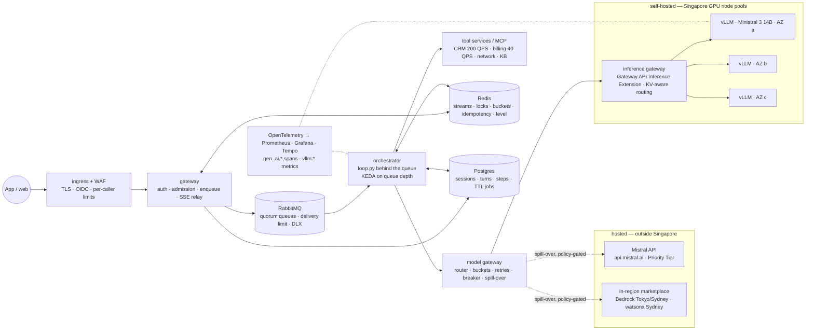
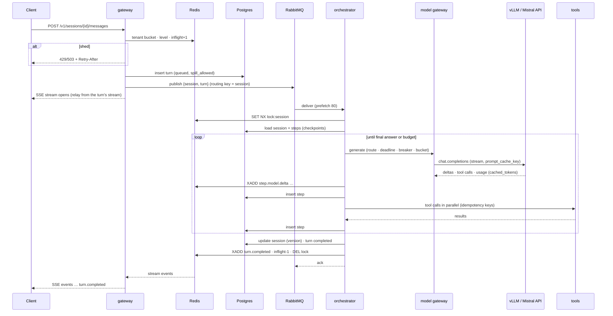

# Reference architecture — customer-support agent on Kubernetes with Mistral models

This is the production shape that the lab's core concepts (`scalelab/`) scale up to: what runs where, how
each part scales, what its limits are and why the alternatives were not chosen. The reasoning is in
`01-scaling-primer.md`; the numbers are in `03-capacity-plan.md` (computed by `python -m scalelab.capacity`,
measured by `scalelab/sim.py`); the mapping to Kubernetes, to Mistral's hosted API and to the hyperscalers is
in `04-platform-mapping.md`. Product facts were checked on 19 September 2026. The design is cloud-neutral:
AKS, EKS, GKE, an in-country GPU cloud or the operator's own cluster.

## 1. Context and requirements

**Workload.** Meridian Mobile, a Singapore mobile operator, is putting a support agent in its app and on the
web: billing, connectivity, plans, roaming and complaints, answered from the CRM, the billing system, network
operations and the help centre, with tickets and plan changes as writes; multi-turn, streamed, with a bounded
auditable transcript per session and one tenant in v1. The traffic shape is the lab's: 100,000 conversations
a day of 6 turns, 2.2 model calls per turn, 5,000 input tokens per call of which 2,700 are a stable cached
prefix, 200 output tokens with reasoning off, a 6 s hosted turn, 60 s of think time.

**The residency requirement.** Meridian's risk function has stated that customer personal data stays in
Singapore. Singapore has no general localisation mandate; the drivers are the MAS guidelines on AI risk
management (consulted November 2025 to January 2026, toolkit released 20 March 2026) and Meridian's own
governance, which is what the requirements review surfaces. The requirement decides the model path: Mistral's API is
EU-hosted by default with EU and US regional endpoints and no APAC endpoint, and the APAC marketplace rows
fetched (Bedrock Tokyo, Mumbai, Sydney; watsonx Sydney) are in region but not in Singapore. So the primary
path is a self-hosted vLLM fleet in Singapore and the hosted API is spill-over for traffic the data policy
allows to leave.

| Requirement | Target | Notes |
|---|---|---|
| Volume | 100,000 conversations/day; peak ×3; incident ×10 | 15.3 / 45.8 / 153 model calls per second |
| Latency | first event p95 ≤ 2.5 s; turn p95 ≤ 8 s hosted, ≤ 12 s self-hosted, at peak | the fleet is sized at 20 ms TPOT, a 10.0 s turn against 6 s hosted |
| Availability | 99.5 % of admitted turns end with an answer (30-day) | the Completion API's 90-day uptime was 99.49 % on Mistral's status page on 19 Sep 2026: a fallback is mandatory |
| Shed | ≤ 2 % at peak; unbounded in an incident, always with `Retry-After` | incident demand is 2.3–2.6× every model limit |
| Cost | ≤ $0.02 per conversation, model cost only | hosted planning mix $0.0131; peak fleet $0.0182 on AWS on-demand, $0.0125 on capacity blocks; the fleet wins below $4.95 per GPU-hour |
| Durability | no lost turns; no duplicated side effects | at-least-once delivery, checkpoints, idempotency keys |
| Residency | customer personal data stays in Singapore | fleet primary; spill-over policy-gated |
| Security | identity at the edge; least-privilege workload identities; guardrails on input | section 7 |
| Operability | one dashboard, seven alerts, canary by session hash, a cost kill switch | section 3.8 |

**Constraints and incident behaviour.** Kubernetes is Meridian's standard; the billing mainframe accepts
40 QPS and the CRM 200; Python 3.11. Paid-tier limits on Mistral's API are console-only, so the plan assumes
a negotiated 20 M TPM and 60 RPS (verify). At ×10 the hosted RPS limit is exceeded 2.55×, the TPM limit
2.38× and a peak-sized fleet 2.31×, so no Kubernetes scaling answers an incident: admitted turns still
complete within budget, degraded turns use the cheaper model, shorter answers and no writes, the rest are
refused at the gateway with a `Retry-After` before any compute is spent, priority classes (the agent-assist
console, outage-status traffic) go first, and no ticket is ever created twice.

## 2. System overview



Two stateless services, one queue, two stores, a model gateway and a model layer with two halves; every arrow
is authenticated (OIDC at the edge, secret-store credentials for queue and stores, mTLS between services,
workload identity to cloud APIs).

The two halves are the point of this edition. Hosted, tokens are bought from Mistral's API against a rate
limit and a price per token, and overload arrives as a 429. Self-hosted, tokens come from vLLM replicas paid
for whether busy or not, and overload arrives as latency, because vLLM queues indefinitely by default and
never returns 429. The design is the same shape either way because the unit of work is the turn and the
binding constraint is tokens per minute at the model in both cases: the gateway bounds turns in flight, the
orchestrator bounds work per turn, and the model gateway turns whatever the backend does under pressure
(429, 503, a growing queue) into one signal, the degrade level. Switching halves changes the in-flight cap
(175 hosted, 293 for the peak fleet) and the routing table, not a service boundary. Hybrid is the fleet
first and the API when the fleet is saturated, the self-hosted analogue of provisioned throughput with
pay-as-you-go spill-over, with the data policy deciding which turns may spill.

## 3. Components

### 3.1 Gateway

Authenticate; create sessions (prefetching the customer's profile so the first turn pays no CRM round-trip);
classify the turn's spill eligibility; admit or shed; enqueue; relay the turn's event stream as SSE with
resume by `Last-Event-ID`.

| Aspect | Design |
|---|---|
| API | `POST /v1/sessions`, `POST /v1/sessions/{id}/messages` (submit + stream), `GET /v1/sessions/{id}/turns/{tid}/events` (SSE resume), `/healthz`, `/readyz`, `/metrics` |
| Admission (`admission.py`) | per-tenant bucket (429) → degrade level → in-flight cap (503), both with `Retry-After`; priority 1–2 bypasses the cap; level 1 at 80 % of the cap, 5 % pushback, 10 s queue age or 0.8 backend saturation; level 2 at 15 % pushback, an open breaker or a backend queue; level 3 at the cap or 30 s queue age; the level lives in Redis (30 s TTL), levels 1–2 dwell 15 s |
| Scaling | Deployment, 1 vCPU / 512 MiB, min 2, HPA on open SSE streams (250 per pod), 60 s grace with stream hand-off through Redis |

### 3.2 Orchestrator (the lab's `loop.py`, run behind the queue)

Consume turns; run each to completion under a budget; checkpoint every step; execute tools through the
executor; stream events; persist the transcript; compact history; publish model-health signals; acknowledge
only on a terminal state.

| Aspect | Design |
|---|---|
| Queue contract | quorum queues `agent-turns.0..3` behind a consistent-hash exchange keyed on the session id, so a session's turns land on one queue in order; `x-delivery-limit` 5 and a dead-letter exchange to `agent-turns-dlq` (7 days); manual ack after the terminal event; nack with requeue on `RetryLater` |
| Loop and budget | plan call → (tool calls in parallel → answer call)* until a final answer; `Budget` 6 steps, 40 k tokens, $0.25, 45 s |
| Checkpoints and idempotency | one `steps` row per model call and per tool step, written before the next action, so a redelivered turn replays instead of re-executing; writes keyed `{turn}:{step}:{i}:{tool}:{hash(args)}` with 24 h markers in Redis, a replay returning the stored result flagged `deduplicated` |
| Concurrency | session lock in Redis (`SET NX`, TTL = budget + 15 s); prefetch 80 per pod |
| Scaling | Deployment, 2 vCPU / 2 GiB, min 2; KEDA RabbitMQ scaler on ready messages across `agent-turns.*`, 20 per pod, cooldown 120 s; 1 / 3 / 8 pods at average / peak / incident (in-flight × 1.4 ÷ 80) |

States: queued, running, completed, failed, dead-lettered. `RetryLater` (store or queue unavailable) returns a
turn to queued; anything else ends in an ack with a terminal event; the fifth delivery goes to the DLQ.

### 3.3 Model gateway (`resilience.py`, `admission.py` and the router)

A library in the orchestrator process with its shared state in Redis, so every pod sees the same buckets,
breakers and level. Per call: route (task × level × mode → model, `reasoning_effort`, output cap, backend) →
deadline check → circuit breaker → token bucket sized to this deployment's share of the model's TPM (a Lua
script per model, rate = TPM ÷ 60, burst ≈ 6 s of refill) → attempt with timeout → on 429, 503 or timeout,
full-jitter backoff bounded by the deadline (`call_with_retries`), the sibling model after two consecutive
pushbacks or an open breaker → account usage, cost, latency, cached tokens and the backend that served the
call. One breaker per model, because a sibling has its own pool and its own failure mode. Spill-over is a
routing decision (`HybridBackend`): once fleet saturation (running plus waiting over replicas × target batch)
passes 0.9, a call from a spill-eligible turn goes to the API bucket instead.

| Route | Level 0 | Level 1 | Level 2 |
|---|---|---|---|
| plan / answer, hosted | Small 4 (`mistral-small-2603`), reasoning off, 700 tokens | Ministral 3 8B, 400 tokens | Ministral 3 8B, 250 tokens, no writes |
| plan / answer, fleet | Ministral 3 14B, 700 tokens | Ministral 3 14B, 400 tokens | Ministral 3 14B, 250 tokens, no writes |
| escalate (10 % of calls) | Medium 3.5 (`mistral-medium-3-5`, id per changelog, verify), hosted, policy-gated | Small 4 | none |

Route and summarise calls use Ministral 3 8B at every level. On a fleet the level-1 lever is shorter answers
rather than a cheaper model, because the GPUs are already paid for.

### 3.4 The model layer

**Hosted path.** `api.mistral.ai` is the global endpoint (EU-hosted by default, no committed inference
location); `api.eu.` and `api.us.` are regional at +10 %, GA since 11 August 2026, with function calling as
the only regional tool and no Agents, Batch or Files. Priority Tier is +75 %, enabled per request with
`service_tier="auto"`, falls back to standard when its limits are exceeded and reports `service_tier` in the
response; the docs state a 99.5 % SLA (the AI Cloud page says 99.9 %, verify). The 2,700-token prefix is sent
first with a `prompt_cache_key` per prompt version; 64-token cached blocks are billed at 10 % and reported in
`usage.prompt_tokens_details.cached_tokens`; TTL and cache-write price are unpublished (the lab assumes
300 s). The rate-limit request is 60 RPS, 19 M TPM and 209 B tokens a month for Small 4, filed with support
once billing passes the $2,000 tier; the free tier (1 RPS, 500 k TPM, 1 B tokens a month) is 10 % of the
average TPM. The `mistralai` SDK (2.10.1) has no retries by default and a 300 s default timeout: retries stay
off so `call_with_retries` is the one place that decides, the timeout is 30 s, a 429 (`errors.SDKError`,
`status_code`) maps to `RateLimited`, and a `Retry-After` is honoured if one appears (none is documented).
Model ids are pinned to dated versions; the 22 May 2026 deprecations of Magistral, Devstral, Pixtral and
Medium 3.1 are the reminder. Zero data retention is available on pay-as-you-go stateless endpoints on request.

**Self-hosted path.** vLLM 0.29.0 (9 September 2026) serves `mistralai/Ministral-3-14B-Instruct-2512` in
FP8 (15.7 GB) on one H100 80 GB per replica with Mistral's documented flags (`--tokenizer_mode mistral
--config_format mistral --load_format mistral --enable-auto-tool-choice --tool-call-parser mistral`); prefix
caching and chunked prefill are on by default, so the shared prefix is prefilled once per replica. The lab's
replica model estimates a 54 GB KV budget at 160 KiB per token, 128 resident sequences, a TPOT of 10 ms at
batch 1 and 20 ms at batch 24, 1,201 tokens per second per replica at batch 24 and a 78 ms TTFT for a call's
2,300 new tokens, all estimates until `vllm bench serve` replaces them. The alternative primary model is
Small 4 (MoE 119B / 6.5B active, MLA KV of 22.5 KiB per token, 121 GB FP8, `--tensor-parallel-size 2` on
H100 with `--attention-backend FLASH_ATTN_MLA`; Mistral's stated minimum of 4× H100, 2× H200 or 1× B200
needs verifying as GPUs or systems). Replicas are a Deployment, or a KServe 0.17 `LLMInferenceService` on
llm-d when prefill/decode disaggregation and node-local weight caching are wanted as a package. In front
sits an inference gateway implementing the Gateway API Inference Extension (v1.5.0; Envoy Gateway, kgateway
or GKE Inference Gateway): an `InferencePool` per model, `InferenceObjective` priorities, an endpoint picker
scoring replicas on queue depth, KV utilisation and prefix affinity, and the alpha flow-control layer whose
saturation detector (queue depth 5, KV 0.8) holds low-priority requests and drops them on TTL. NIM is an
option at $1 per GPU-hour ($8 k a month on the peak fleet): `ministral-14b-instruct-2512:1.7.0` exists;
Small 4 NIM profiles cover H200 and Blackwell only (verify H100). Weights load from a node-local NVMe cache
(or KServe `LocalModelCache`) with pre-pulled images and `--kv-cache-memory-bytes` to skip profiling; the
Run:ai streamer (about 2 GiB/s from object storage) is itself a `--load-format` value and so excludes
`--load_format mistral` (verify the trade-off). Cold start is 3–8 minutes end to end, which is why the fleet
is static for peak.

### 3.5 Tool executor and tool services (`tools.py`)

The executor applies bulkhead → breaker → read cache → idempotency → timeout → retry (reads only) →
truncation, and returns structured errors (`{"error": ...}`) that the model answers around. Tools run as HTTP
services in the cluster or behind an MCP server; QPS ceilings are token buckets per backing system in Redis,
so the whole orchestrator fleet respects 40 QPS at the mainframe rather than each pod. At level 2 the
registry withholds writes and `get_invoice`.

| Tool | Idempotent | Timeout / bulkhead per pod / cache | Backing system |
|---|---|---|---|
| get_customer, list_plans | yes | 2 s / 100, 50 / 300 s, 3600 s | CRM (200 QPS, p50 120 ms) |
| get_invoice | yes | 4 s / 30 / 120 s | billing mainframe (40 QPS, p50 600 ms) |
| check_network, search_kb | yes | 1.5 s, 1 s / 200, 500 / 30 s, 600 s | network operations (500 QPS), help centre |
| create_ticket | **no** | 3 s / 50 / — | CRM |

The tools are not the constraint: at the incident the billing system sees 17.4 QPS against 40 (0.43×) and
the CRM 48.6 against 200 (0.24×).

### 3.6 State

Postgres holds everything durable; Redis everything hot. Both are the cloud's managed service or, on a
sovereign GPU cloud, the CloudNativePG operator and Redis Sentinel.

```sql
sessions(id, tenant, customer_ref, summary, context jsonb, usage jsonb, version int,
         created_at, updated_at, expires_at)                                      -- 30-day TTL
turns(id, session_id, seq, status, user_text, answer_text, degrade_level, served_by,
      spill_allowed bool, usage jsonb, cost_usd, enqueued_at, started_at, finished_at,
      expires_at, unique (session_id, seq))
steps(turn_id, idx, kind, payload jsonb, created_at, primary key (turn_id, idx))  -- 7-day TTL
```

A CronJob deletes expired rows in batches (TTL by job); optimistic versioning on `sessions.version` stops two
pods compacting the same history. Redis keys: `bucket:{model}` (Lua), `inflight` and `level` (30 s TTL),
`lock:session:{id}`, `idem:{turn}:{step}:{i}:{tool}:{hash}` (24 h), `turn:{id}:events` (Stream, 5-minute
retention), `queued` (a sorted set of turn ids by enqueue time, which yields the oldest-queued age in one
call), `cache:tool:{name}:{hash}` and `health:{model}` (pushback window, breaker state).

### 3.7 Edge

An ingress controller or Gateway API implementation with a WAF (OWASP core rule set or the cloud's WAF)
terminates TLS, validates the OIDC token, rate-limits per caller (600 requests a minute per key) and per IP,
and forwards only to the gateway. SSE needs response buffering off and a 600 s idle timeout. Nothing else has
an external address.

### 3.8 Observability

OpenTelemetry spans per turn, model call and tool call carry `gen_ai.request.model`,
`gen_ai.usage.input_tokens`, `gen_ai.usage.output_tokens` and `gen_ai.response.finish_reasons`, plus
`meridian.cached_tokens`, `meridian.served_by` (hosted, fleet, spill) and `meridian.level`; 10 % sampling to
Tempo, metrics to Prometheus, structured JSON logs. vLLM's `/metrics` is scraped per replica:
`vllm:num_requests_running`, `vllm:num_requests_waiting`, `vllm:kv_cache_usage_perc`,
`vllm:time_to_first_token_seconds`, `vllm:inter_token_latency_seconds`, `vllm:e2e_request_latency_seconds`,
`vllm:prefix_cache_hits_total` over `vllm:prefix_cache_queries_total`, `vllm:num_preemptions_total` and
`vllm:request_success_total` (confirm the `_total` suffixes on a live scrape); DCGM adds GPU utilisation and
the RabbitMQ Prometheus plugin ready and unacked messages.

| Alert | Condition | Meaning |
|---|---|---|
| vLLM queue | `sum(vllm:num_requests_waiting)` ÷ replicas > 5 for 1 min | fleet saturated; the cap is too high or KEDA is behind |
| KV usage | `avg(vllm:kv_cache_usage_perc)` > 0.8 | preemptions next |
| queue age | oldest queued turn > 30 s | the orchestrator is behind; shedding |
| pushback ratio | 429 + 503 share of model calls > 5 % over 1 min | level 1; 15 % is level 2 |
| degrade level | level ≥ 2 for 5 min, or level 3 at all | page |
| cost per conversation | rolling hour > $0.02, or spilled share above the eligible share | budget, or a policy leak |
| p95 turn | > 8 s hosted, > 12 s fleet, over 5 min | SLO burn |

## 4. A turn, end to end



In hosted mode the model gateway takes tokens from the Small 4 bucket before every call and a 429 means the
pool is contended: backoff with jitter, then the Ministral 8B sibling, then a graceful failure inside the
45 s deadline. In self-hosted mode the call goes to the inference gateway, which picks the replica whose
prefix cache already holds the session and whose queue is shortest; a 503 from `--max-num-queued-reqs` is
handled like a 429, and a growing `vllm:num_requests_waiting` raises the level before any error appears. In
hybrid mode only the routing step differs: a spill-eligible turn's call goes to the API bucket once fleet
saturation passes 0.9. Compaction runs after the ack, off the critical path. The client sees the same event
stream in all three modes.

## 5. Capacity and scaling design

The full plan is in `03-capacity-plan.md`; the settings it produces:

| Setting | Value | Derivation |
|---|---|---|
| in-flight cap, hosted / fleet | 175 / 293 | 20 M TPM ÷ 60 ÷ (11,440 tokens per turn ÷ 6 s), 29.1 turns/s sustainable; 11 replicas × batch 24 × (10.0 s turn ÷ 2.2 × 4.1 s call), following the live replica count |
| in-flight cap, hybrid | 293 on the fleet plus 175 on the API for spill-eligible turns only | two caps, because the data policy bounds the spill |
| admission thresholds | soft ratio 0.8; pushback 0.05 (0.15 for level 2); saturation 0.8; queue age 10 s / 30 s; dwell 15 s | the inference gateway's own saturation thresholds; degrade before shedding |
| bucket for `mistral-small-2603` | 20 M TPM, burst 6 s | the negotiated limit; verify in the console |
| `budget.*` | 6 steps, 40 k tokens, $0.25, 45 s | the worst turn costs ~4× the average |
| orchestrator / gateway pods | 1 / 3 / 8 (min 2); 2–3 | in-flight × 1.4 ÷ 80; streams ÷ 250 |
| vLLM replicas | 4 / 11 / 34 needed, never fewer than 2 (HA); 11 static, KEDA to 14 | ×1.3 headroom; 4 / 4 / 3 across three zonal node pools |
| `--max-num-seqs`, `--max-num-queued-reqs` | 48, 12 | TPOT ≈ 30 ms at 48 (estimate); ≈ 2 s of queue wait at batch 24 |
| KEDA on the fleet | `sum(vllm:num_requests_waiting)` > 5 per replica or `avg(vllm:kv_cache_usage_perc)` > 0.8; poll 15 s, cooldown 360 s | headroom only, never the peak |
| rate-limit request | 60 RPS, 19 M TPM, 209 B tokens/month | peak × 1.3 |

The fleet is static for peak because a replica takes 3–8 minutes to appear and a Singapore H100 may not be
available on demand at all; autoscaling adds headroom from warm nodes, and the incident is answered by
degrade levels, spill-over and shedding rather than by 34 GPUs ($171 k a month on AWS on-demand) idling for
an outage that comes twice a year. The 6-second hosted turn would need a TPOT of about 10 ms on the fleet,
so batch about 4 and roughly four times the GPUs, or EAGLE speculative decoding (drafts exist for Small 4,
Medium 3.5 and Large 3, not Ministral), or streaming and accepting 10 s.

| GPU price | $/GPU-h | Peak fleet, $/month | $/conversation | vs the hosted mix ($0.0131) | Floor to amortise two replicas, conversations/day |
|---|---:|---:|---:|---:|---:|
| AWS on-demand | 6.88 | 55.2 k | 0.0182 | 1.39× | ≈ 25 k |
| AWS capacity block (priced in Tokyo, Sydney, Mumbai; verify Singapore) | 4.72 | 37.9 k | 0.0125 | 0.95× | ≈ 17 k |
| GCP 3-year | 4.86 | 39.0 k | 0.0128 | 0.98× | ≈ 18 k |
| Azure 3-year | 5.40 | 43.4 k | 0.0143 | 1.09× | ≈ 20 k |
| neocloud | 3.75 | 30.1 k | 0.0099 | 0.76× | ≈ 14 k |
| GCP on-demand | 11.06 | 88.8 k | 0.0292 | 2.23× | ≈ 41 k |

Both bills grow with volume, the API linearly and the fleet in replica-sized steps, so the break-even is a
GPU price, not a volume: the fleet beats the hosted planning mix whenever H100s cost less than about $4.95
per GPU-hour (0.16 GPU-minutes per conversation at 28 % average utilisation). That is under AWS on-demand,
about level with 3-year commitments and AWS APAC capacity blocks, and clearly won by neoclouds. Volume matters
only at the bottom, where the two-replica HA floor is amortised above about 14 k conversations a day at
$3.75, 17 k at $4.72–4.86 and 25 k at $6.88. Residency, latency control and customisation decide the path;
the arithmetic prices the decision at about $15.5 k a month more on on-demand H100s, about level on committed
ones and about $9.6 k a month less on neocloud GPUs. The gateway scales on open streams, the orchestrator on
queue depth (bound by the model's token budget, never CPU), the hosted model on tokens per minute, the fleet
on batch per replica and then replica count, the tools on downstream QPS. What breaks first at the incident:
the hosted RPS limit at 2.55×, the hosted TPM limit at 2.38×, the peak-sized fleet at 2.31×; the billing
system reaches 0.43× and the CRM 0.24×. Kubernetes, the orchestrator pods, Redis, Postgres and RabbitMQ are
not on the list.

## 6. Failure handling

The overload loop has two forms and the lab measured both (a 3 M TPM pool or two Ministral 14B replicas,
120 users). Hosted and naive, 429s lengthen turns, more turns are in flight, more 429s follow: p95 39 s, 394
rate limits, 35 failed turns. Degrade levels alone (half the turns on Ministral 8B once the pool passes 80 %)
give p95 5.5 s with no failures; degrade plus a cap of 26 gives p95 3.3 s, 22 % shed and zero 429s.
Self-hosted and naive there are no errors at all: the batch grows to 60 and TPOT with it, p50 12.3 s, p95
15.3 s, zero 429s, the silent latency collapse. Degrade plus a cap of 53 gives p95 8.8 s at 17 % shed; a cap
of 30 gives p95 5.1 s at 33 % shed, the latency-for-throughput trade made explicit. Hybrid with a cap of 79
gives p95 6.5 s, 4 % shed and 30 % of calls on the API. Moderate load (20 users) is p50 4.5 s / p95 5.7 s
hosted and p50 5.7 s / p95 6.8 s self-hosted.

| Failure | Behaviour |
|---|---|
| Model 429 (API), 503 (vLLM queue cap) or a growing queue | full-jitter backoff within the deadline; sibling after two consecutive pushbacks; one breaker per model; `vllm:num_requests_waiting` and KV usage feed the saturation signal, so the level rises before any error; the inference gateway holds, then drops, sheddable requests |
| Turn deadline; tool timeout, error or rate limit | graceful failure, acked, never retried; structured error to the model, one retry for reads, breaker per tool, bulkhead per pod |
| Orchestrator pod dies mid-turn | RabbitMQ redelivers; checkpointed steps replay, writes deduplicate by idempotency key; the fifth delivery dead-letters with an alert |
| vLLM replica or GPU node lost | in-flight calls retry on another replica within the deadline; the cap follows the live replica count (about 27 turns per replica); a zonal pool loss removes 3–4 of 11 replicas |
| Redis or Postgres unavailable | the gateway fails closed (503 + `Retry-After`); the orchestrator cannot lock or checkpoint → `RetryLater` and redelivery |
| API model deprecated | dated ids in configuration; canary of the successor; the sibling route covers retirement day; no notice period is published (verify); self-hosted weights cannot be retired |
| Regional-endpoint gap | no APAC endpoint; EU/US are +10 % with no Agents, Batch or Files; the hosted path is spill-over only, never the residency path |
| Spill-over data policy | only turns without customer records (help-centre and plan-catalogue intents) may spill; `spill_allowed` is set at the gateway, stored on the turn and audited against `served_by`; anything that touched the CRM or billing stays on the fleet |
| Cost runaway | `max_cost_usd` per turn, the hourly cost alert, and a flag that forces level 2 |

## 7. Security

Identity terminates at the edge; the gateway trusts the validated OIDC token and never handles credentials.
Each service runs as its own ServiceAccount bound to a cloud identity (IRSA, Workload Identity or Entra
Workload ID) with minimum roles; the tool services accept only the orchestrator's identity over mTLS (a mesh
in ambient mode or cert-manager certificates) behind a default-deny `NetworkPolicy`. Secrets (the Mistral API
key, queue, Postgres and Redis credentials, the Hugging Face token used once to seed the weight cache) come
from the cloud's secret manager through the External Secrets Operator. Guardrails run before the model: on
the fleet, Shieldstral 1.0 (Apache 2.0, compact multimodal moderation) self-hosted in Singapore; on the hosted
path, Mistral Moderation 2 (`mistral-moderation-2603`, free, 128 k context, jailbreak detection). Tool results
are data, truncated and never executed; the model cannot call a tool outside the registry for its level; a
write requires the user's confirming turn. The PII policy for spill-over is enforced at admission (intent
plus a PII detector sets `spill_allowed`) and again at routing, and the audit is the `turns` table itself
(model id, prompt version, `served_by`, `spill_allowed`, level, usage), exported nightly to Meridian's
immutable log store.

## 8. Deployment

Helm charts per service, deployed by Argo CD from one repository; the NVIDIA GPU Operator on three zonal GPU
node pools tainted for vLLM, with static node counts (Karpenter or the cloud's autoscaler adds headroom nodes
only); KEDA; the inference gateway CRDs; kube-prometheus-stack and Tempo. Canary is done by the model gateway,
not the ingress: a new model version, prompt version or vLLM image gets 10 % of sessions by session-id hash,
then 50 %, then 100 %, gated on cached-token share, p95 and cost per conversation; a second `InferencePool`
carries a new vLLM build so that rollback is a routing change, and rollback of a service is the previous Helm
revision. What stays manual: the rate-limit request to Mistral's support, the GPU capacity reservation
(Capacity Blocks, an on-demand capacity reservation, a future reservation or the GPU cloud's contract), the
Priority Tier entitlement, the zero-data-retention request, the licences (NIM at $1 per GPU-hour if used; a
commercial licence for Medium 3.5, whose Modified MIT licence requires one above $20 M of monthly revenue, if
it is ever self-hosted), DNS and the IdP registration.

## 9. Alternatives considered (decisions)

| Decision | Chosen | Alternatives | Why |
|---|---|---|---|
| Runtime | Kubernetes, cloud-neutral | Mistral AI Studio managed (Agent Runtime on Temporal; dedicated or self-hosted by contract with Mistral); a hyperscaler's serverless containers | the residency path needs GPUs the operator controls; every mechanism stays visible; Studio has no public pricing (verify) |
| Queue | RabbitMQ quorum queues | Kafka; NATS JetStream; the cloud's managed queue | per-session ordering, delivery limit and DLX built in; tens of messages a second do not need Kafka; the managed queue is the swap on a single cloud |
| Durable state | Postgres | a document database | relational audit queries, `unique (session_id, seq)`, TTL by job, one operator everywhere |
| Serving stack | plain vLLM behind the Gateway API Inference Extension | llm-d / KServe `LLMInferenceService`; NIM; SGLang; TensorRT-LLM | ≤ 14 single-GPU replicas need no disaggregation; llm-d when Small 4 or a prefill/decode split arrives; NIM for a supported container; SGLang and TRT-LLM when a benchmark proves the gain |
| Self-hosted model | Ministral 3 14B, 1× H100 | Small 4 (2× H100; 9 replicas / 18 GPUs at peak, $90.4 k a month on AWS on-demand, estimate); Large 3 (8× H200); Medium 3.5 (134 GB, commercial licence) | 11 GPUs versus 18 at the same latency target; Small 4 is the upgrade when quality on billing disputes demands it; Large 3 and Medium 3.5 are hosted escalation |
| Hosted endpoint | global, spill-over only | EU/US regional (+10 %); in-region marketplace (Bedrock Tokyo, Mumbai, Sydney for Large 3 and Ministral 3; watsonx Sydney; Azure Foundry rows fetched are Americas-only) | none is in Singapore; the marketplace fits when the residency boundary is APAC rather than Singapore |
| Model capacity and overload | fleet for peak, API for policy-gated spill; degrade levels and shedding at the edge | API for everything; fleet for the incident; queue everything; scale replicas | the GPU-price break-even ($4.95 per GPU-hour), the residency requirement and the feedback loop in both forms |
| Transport | SSE | WebSockets | resume, plain requests, no affinity |

## 10. What this design does not do (v1)

No voice; no multi-region; no Agents & Conversations API (beta-labelled, stateful, absent from regional
endpoints and from zero data retention; the orchestrator owns state); no fine-tuning (the API is deprecated;
Forge is a services offering, not an API); no self-hosted Medium 3.5 or Large 3; no prefill/decode disaggregation; no
GPU sharing (MIG cannot hold Ministral 14B with useful KV; time-slicing removes isolation); no per-tenant
fleet partition; no long-term memory beyond the session summary; no autonomous multi-step writes without a
confirming turn. Each has a documented trigger in the primer's growth path.
