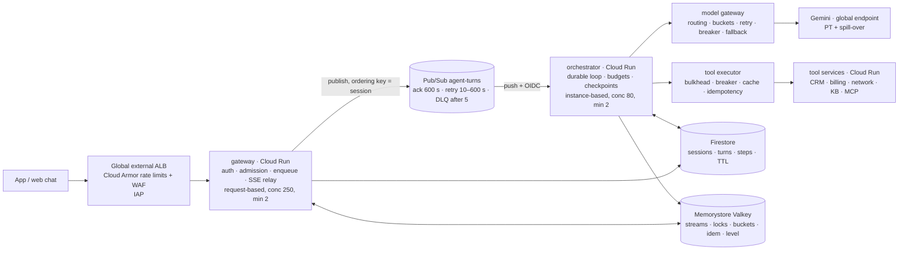

# Scaling Agentic Solutions — a primer

*Scaling an agentic solution on Google Cloud, worked on a customer-facing support agent running on Cloud Run and Gemini (Gemini Enterprise Agent Platform, formerly Vertex AI). Facts checked 5 September 2026; sections are numbered for drilling. Callouts: **In a design review** (what to say), **Numbers** (anchors to keep in your head), **Verify** (facts that move), **Pitfall** (what an experienced platform team listens for).*

The code, the capacity model and the practice notebooks that go with this primer are in the `agentic-scaling-lab` repository; every number below is computed by `python -m scalelab.capacity` or measured by its load generator (`scalelab/sim.py`) so the arithmetic in this document and in the notebooks cannot drift apart.

---

## 0. The thesis, and how the round tests it

An agent system is scaled by bounding tokens, not by adding servers. Everything that looks like a classic capacity problem — instances, connections, queue depth, database throughput — turns out to be small and cheap next to one number: tokens per minute at the model, a resource you share with your whole organisation and cannot buy by the instance. The design work is to make demand for that resource predictable (admission control, routing, caching, compaction), to make the system degrade instead of collapse when it runs out (levels, shedding, fallbacks), and to make every turn survive the failures that a long, multi-step, side-effecting unit of work invites (checkpoints, idempotency, at-least-once delivery).

A scaling design has to answer four things. *Resource estimation*: can you get from "100,000 conversations a day" to tokens per minute, in-flight turns and dollars in two minutes on a whiteboard? *Trade-offs*: provisioned throughput or pay-as-you-go, sync or queued, managed runtime or Cloud Run, degrade or shed? *Robustness*: what breaks first, what happens when it does, and how does the user experience it? *Simplicity*: which of the mechanisms below does this customer actually need at their scale, and which are premature?

> **In a design review** — Open a scaling question with the unit of work and the binding constraint: "The unit of work is a *turn*; each turn is two to three model calls of about five thousand tokens; so 100k conversations a day is about 14 million input tokens a minute at peak, which is above the Flash tier baseline — that's the constraint I'll design around. Cloud Run is not going to be the problem."

How to use this primer: Part 1 explains why agents scale differently. Part 2 is the checklist of dimensions to run through first. Part 3 is the arithmetic, worked on the anchor scenario. Part 4 is the reference architecture. Part 5 walks through each scaling mechanism with the numbers that justify it. Parts 6 and 7 are the failure catalogue and the growth path. Part 8 is how to walk the design in a review. Part 9 maps Google's stack. The verify list at the end is what to re-check before relying on any number.

---

## 1. What is different about scaling agents

### 1.1 The unit of work is a turn, not a request

A web request is stateless, short and homogeneous; you scale it by adding replicas until CPU is the limit. A turn of an agent is a *loop*: a model call that plans, tool calls that fetch or change something, another model call that answers, sometimes more. Its length is decided at run time by the model. Its steps are sequential because each depends on the last. Its middle steps have side effects in systems you do not own. And the loop's memory — the context — grows as the conversation goes on.

| Property | Web request | ML inference request | Agent turn |
|---|---|---|---|
| Duration | 10–200 ms | 20–500 ms | 3–30 s, variable |
| Steps | 1 | 1 | 2–8, decided at run time |
| Binding resource | CPU / DB connections | GPU seconds | tokens per minute at a shared model pool |
| Cost driver | requests | requests | tokens × steps × context length |
| State | none or a row | none | a growing transcript plus checkpoints |
| Side effects | in your DB | none | in the customer's CRM, billing, ticketing |
| Failure unit | retry the request | retry the request | resume the *step*, never repeat a write |

Everything in the rest of this primer follows from that last column.

### 1.2 The binding constraint is model throughput, and it is shared

On the Gemini Enterprise Agent Platform the pay-as-you-go path ("Standard PayGo", the successor of dynamic shared quota) has no fixed per-project quota. Your organisation gets a tokens-per-minute *baseline* per model family based on rolling 30-day spend — for Flash and Flash-Lite 2 M, 4 M or 10 M TPM at tiers 1, 2 and 3; for Pro 0.5 M, 1 M or 2 M — and can burst above it on a best-effort basis. A 429 does not mean "you hit a number"; it means "there is contention on the shared pool right now", and the documented reaction is exponential backoff, the global endpoint and traffic smoothing within the minute. Guaranteed capacity is a separate purchase: Provisioned Throughput in generative-scale units (GSUs), by the week, month, quarter or year, with pay-as-you-go spill-over by default.

Two consequences shape every design. First, capacity planning is a *token* budget, and you compute demand in tokens per minute before you compute anything else. Second, the pool is shared with every other team in the organisation, so your traffic shape (smooth or bursty) affects your own 429 rate and theirs; smoothing is a good-neighbour obligation as much as an optimisation.

> **Numbers** — Flash tiers 2 / 4 / 10 M TPM; Pro tiers 0.5 / 1 / 2 M TPM (org-level, spend-based). One GSU of Gemini 3.5 Flash delivers 675 burndown tokens/s (input ×1, cached input ×0.1, output ×6). PT costs $7.14 / $3.70 / $3.29 / $2.74 per GSU-hour for 1-week / 1-month / 3-month / 1-year terms (global endpoint; regional endpoints +10 %).

### 1.3 Latency is a sum of sequential tails

A turn with two tool calls has four segments on the critical path: plan call, tools, answer call, and the streaming of the answer. Model latency is time-to-first-token (which now includes *thinking* time) plus output tokens divided by tokens per second. Because the segments are sequential, the turn's p95 is roughly the sum of the segments' tails, not the tail of their sums; a 4-second p95 target forces parallel tools, streaming, prefetching and a Flash-class model on the planning step. And because turns are long, Little's law couples latency to concurrency: at 20 turns per second, a 6-second turn means 125 turns in flight, a 12-second turn means 250, each holding memory, a session lock and an open client connection. Slowdowns *are* capacity problems.

### 1.4 Cost scales with context, and context grows

The bill is tokens, and input dominates: a support turn sends 4–6 k tokens of system prompt, tool schemas, customer context and history to receive 300–400 back. Without compaction the input grows by several hundred tokens every turn, so the cost of the tenth turn is multiples of the first. Three levers change cost by integer factors: routing routine calls to a Flash-Lite-class model (3–5× cheaper per token), caching the stable prefix (cached input billed at 10 %), and keeping context bounded (compaction, tool-result truncation, output caps). The order matters: route and cache first, because every later percentage applies to the new baseline.

### 1.5 Side effects mean at-least-once, and at-least-once means idempotency

Somewhere in a turn the agent opens a ticket or changes a plan. The process can die between doing that and recording that it did (Cloud Run gives ten seconds after SIGTERM; the model call can time out; the queue can redeliver). Exactly-once delivery is not available on the push path you want (Pub/Sub exactly-once is pull-only and regional), so the loop has to be *replayable*: checkpoint every step before acting on it, key every write by turn, step and arguments, and let redelivery find the checkpoint and skip what was already done.

### 1.6 The feedback loop that kills agent systems

More load → more 429s from the shared pool → retries and longer model calls → longer turns → more turns in flight (Little's law) → more memory, more queued model calls, more retries → more 429s. Without a circuit breaker on the loop, an agent system under overload does not fail fast; it slows down for everyone until turn deadlines fire and users give up, having consumed the tokens anyway. The load generator in the lab reproduces this in a few seconds (notebook 04): 120 virtual users against a simulated 3 M TPM pool with retries only take the p95 turn from 5.8 s to about 40 s with hundreds of 429s and a few dozen hard failures; degrade levels and a breaker without a cap turn that into 120 fail-fast turns; with an in-flight cap of 30 derived from the pool's token budget no turn fails, no call is rate-limited, admitted turns finish at a p95 of 3.6 s, and 17 % of attempts are shed with a `Retry-After`. Shedding fast is kinder than queueing slowly, and it is the only way to keep the turns you do admit inside their budget.

### 1.7 Multi-agent multiplies everything

A coordinator with three specialists turns 2.2 model calls per turn into eight, cost by 3.6×, latency by 2× even with parallel specialists, and the probability that every hop succeeds from 0.95^2.2 ≈ 0.89 to 0.95^8 ≈ 0.66 at 95 % per hop. The multi-agent question in a scaling design is therefore never "how do I scale the coordinator"; it is "what measured problem justifies paying that multiple", and the answer is usually a tool set too large for one context or permissions that must differ per step.

> **Pitfall** — Describing scaling as "put it on Cloud Run with max instances 100 and autoscaling handles it". Cloud Run scales the *container*; it cannot scale the token budget, the billing mainframe behind the tools or the cost per conversation. An experienced platform team hears that sentence as "has not run one of these in production".

---

## 2. The dimensions of scale — a checklist

Run down this list in the first ten minutes. For each dimension: the question that changes the design, the number you compute, and the lever you would reach for.

| Dimension | Ask | Compute | Lever |
|---|---|---|---|
| Volume and burstiness | Conversations per day? Peak-to-average? What does an incident do to traffic (an outage floods the chat)? | conv/s, turns/s, model calls/s at average, peak, incident | admission control, PT for the base, spill-over for peaks, degrade for incidents |
| Turn shape | Turns per conversation, model calls and tool calls per turn, tokens in and out | tokens per turn; tokens per minute | routing, caching, compaction, output caps |
| Latency budget | What must the user see and when? First token? Whole answer? | TTFT p95, turn p95, and their sum over the critical path | streaming, parallel tools, prefetch, Flash on the planning step, thinking level |
| Concurrency | How many users at once? How long is a conversation? | in-flight turns = turns/s × turn duration; concurrent sessions = conv/s × conversation duration | in-flight cap, connection-cheap gateway, per-instance concurrency |
| Model capacity | Which tier is the org on? Is PT bought? Which region must the data stay in? | demand TPM vs baseline; GSUs for the base load; break-even utilisation | Standard/Priority/Flex tiers, PT term, global vs regional endpoint |
| Cost | Cost per conversation today (human contact costs dollars)? Budget? | $/conversation, $/month, and the share of each lever | route, cache, compact, batch offline work, budgets per turn |
| Tools and downstream | Which systems, their QPS limits and p95? Which calls have side effects? | tool calls/s per system vs its limit | prefetch, caching, bulkheads, circuit breakers, idempotency keys |
| State | What must survive a crash? A restart? A region failure? How long is a transcript kept? | writes/s per collection and per document, document size, retention | checkpoints in Firestore, hot state in Redis, TTLs, compaction |
| Tenancy and fairness | One customer or many brands? Priorities (VIP, agents-assist)? | per-tenant turns/min; priority classes | per-tenant buckets, priority bypass of the cap, separate quotas |
| Geography and residency | Which countries? In-region processing required? | regional +10 % price; fewer models on regional endpoints | global endpoint unless residency forbids it; multi-region services with failover |
| Change | How often do prompts, tools and models change? Model retirements? | cache invalidations per change; models with 45-day retirement clocks | prompt versioning in cache keys, model ids behind config, canary rollouts |
| Observability | What tells you it is working? What pages someone? | SLIs: availability, latency attainment, shed rate, cost/conversation | metrics with low-cardinality labels, traces per turn, burn-rate alerts |

> **In a design review** — Say the dimensions you are *not* going to design for, and why: "Single tenant, single region, residency not required, so I'll use the global endpoint and skip per-tenant quotas in v1; I'll note where they'd go."

---

## 3. The arithmetic, worked

The anchor scenario is a fictional consumer telco, Meridian Mobile, with a support agent in the app. The assumptions are deliberately ordinary; the point is the method.

### 3.1 Assumptions

| Assumption | Value |
|---|---|
| Conversations per day | 100,000 |
| Peak hour vs daily average | 3× |
| Network-incident spike vs average | 10× (an outage sends everyone to the chat at once, with an intent mix that is 75 % "no signal") |
| Turns per conversation | 6 |
| Model calls per turn | 2.2 (plan, answer, sometimes a third) |
| Tool calls per turn | 1.3 |
| Input tokens per model call | 5,000, of which 3,000 are the stable prefix (prompt, policies, tool schemas), cached 90 % of the time |
| Output tokens per model call | 350 including thinking at the LOW level |
| Turn duration (p50) | 6 s; users think for ~60 s between turns |
| Models | Gemini 3.5 Flash (standard), 3.5 Flash-Lite for 35 % of calls (routing, short answers), 3.1 Pro Preview for rare hard cases |
| Downstream limits | CRM 200 QPS; billing mainframe 40 QPS |
| Org tier | Flash tier 3: 10 M TPM baseline |

### 3.2 Rates and tokens

| Quantity | Average | Peak | Incident |
|---|---:|---:|---:|
| Conversations / s | 1.16 | 3.47 | 11.6 |
| Turns / s | 6.94 | 20.8 | 69.4 |
| Model calls / s | 15.3 | 45.8 | 153 |
| Tool calls / s | 9.0 | 27.1 | 90.3 |
| Input tokens / min | 4.58 M | 13.75 M | 45.8 M |
| … of which uncached | 2.11 M | 6.33 M | 21.1 M |
| Output tokens / min | 321 k | 963 k | 3.21 M |
| Input TPM vs 10 M baseline | 0.46× | **1.38×** | **4.58×** |

The working, out loud: 100,000 ÷ 86,400 ≈ 1.16 conversations a second; × 6 turns ≈ 7 turns a second; × 2.2 calls ≈ 15 calls a second; × 5,000 tokens × 60 ≈ 4.6 M input tokens a minute. Peak is three times that, 13.75 M, already above the tier baseline. An incident is ten times the average, 46 M — four and a half times the baseline. The conclusion is not "buy more"; it is "peak fits only if I cut tokens or buy PT, and the incident must be *shaped*, because no purchase makes 46 M TPM appear in a minute".

> **Verify** — whether cached tokens count at full weight against the PayGo TPM baseline. They count at 0.1 against Provisioned Throughput (documented); the PayGo accounting is not documented as clearly. Design as if they count fully; treat any relief as upside.

### 3.3 Concurrency, from Little's law

In-flight turns = turns/s × turn duration: 6.9 × 6 ≈ 42 at average, 125 at peak, 417 during an incident. Concurrent *sessions* are eleven times larger because users think between turns: a conversation lasts 6 × (6 + 60) ≈ 400 s, so 1.16 × 400 ≈ 460 sessions at average and 4,600 during an incident. The two numbers size different things: in-flight turns size orchestrator memory, session locks and model concurrency; concurrent sessions size open streaming connections at the gateway and the hot session state in Redis.

The token budget also caps concurrency: 10 M TPM ÷ 60 ≈ 167 k tokens/s; a turn consumes 2.2 × 5,350 ≈ 11.8 k tokens over 6 s ≈ 2 k tokens/s; so the baseline sustains about 85 turns in flight, or 14 turns per second. That is the starting value for the admission controller's in-flight cap — and it is *below* peak demand, which is the whole story of this scenario.

### 3.4 Cost per conversation

| Configuration | Per model call | Per conversation | Per month |
|---|---:|---:|---:|
| All Gemini 3.5 Flash, no caching | $0.0107 | $0.141 | $427 k |
| All 3.5 Flash, prefix cached | $0.0070 | $0.092 | $281 k |
| 35 % of calls on 3.5 Flash-Lite, prefix cached | — | **$0.068** | **$206 k** |

Working: a 3.5 Flash call with 2,000 uncached input tokens at $1.50/M, 3,000 cached at $0.15/M and 350 output at $9/M costs $0.0030 + $0.00045 + $0.00315 ≈ $0.0070; thirteen calls a conversation ≈ $0.092; routing a third of them to Flash-Lite at $0.00165 brings it to $0.068. Against a human contact at several dollars, all three rows are cheap; against each other they differ by 2×, which at this volume is $220 k a month. Notice that output tokens are the largest single line even though there are fourteen times fewer of them — output is six times the price of input on this model, which is why output caps and thinking levels are cost levers, not just latency levers.

> **Verify** — Prices are for the global endpoint on 5 September 2026: 3.5 Flash $1.50 / $9.00 per M tokens (cached input $0.15); 3.5 Flash-Lite $0.30 / $2.50; 3.1 Flash-Lite $0.25 / $1.50; 3.6–3.8 Flash $0.75 / $3.75 introductory until 31 December 2026, then $1.50 / $7.50; 3.1 Pro Preview $2 / $12 (double above 200 k context). Regional endpoints +10 %; Priority tier 1.8×; Flex and Batch 0.5×.

### 3.5 Provisioned Throughput

PT is bought in GSUs per model. One GSU of 3.5 Flash delivers 675 *burndown* tokens per second, where a call's burndown is uncached input × 1 + cached input × 0.1 + output × 6. The anchor call burns 2,000 + 300 + 2,100 ≈ 4,400–4,700 tokens, so one GSU serves about 0.14 calls per second. Carrying the standard-model share (65 % of calls) entirely on PT needs 69 GSUs at average, 207 at peak and 688 during an incident.

| Term | $ per GSU-hour | $ per M burndown tokens at 100 % utilisation | Break-even utilisation vs PayGo ($1.50/M burndown) |
|---|---:|---:|---:|
| 1 week | 7.14 | 2.94 | 196 % (never) |
| 1 month | 3.70 | 1.52 | 101 % (never) |
| 3 months | 3.29 | 1.35 | 90 % |
| 1 year | 2.74 | 1.13 | 75 % |

So PT is not a discount unless you commit for a year *and* keep the units three-quarters busy. Sizing PT for peak (207 GSUs) leaves it 33 % utilised on average and costs more than pay-as-you-go; sizing it for the base (69 GSUs, $138 k a month on a 1-year term) and letting peaks spill over to Priority or Standard PayGo is the usual answer. What PT buys is an SLA and immunity from the shared pool's contention for the traffic that matters most — which is why the request headers let you say, per call, "dedicated only", "spill over to Priority" or "bypass PT".

> **In a design review** — "PT for the base load on a long term, spill-over for the peak, and *shaping* for the incident. I'd quote the break-even utilisation to the customer before they buy a monthly term, because a monthly term is never cheaper than pay-as-you-go."

### 3.6 The rest of the estate

| Resource | Average | Peak | Incident | Limit / note |
|---|---:|---:|---:|---|
| Orchestrator instances (80 in-flight turns each, ×1.4 headroom) | 1 | 3 | 8 | Cloud Run: not the constraint |
| Gateway instances (250 open streams each) | 2 | 2 | 3 | min 2 for warm capacity |
| Firestore ops / s | 42 | 125 | 417 | collection ramp 500 → +50 % / 5 min; ~1 write/s per document |
| Redis ops / s | 280 | 830 | 2,800 | one 2-vCPU Valkey node ≈ 120 k ops/s |
| Pub/Sub messages / s | 7 | 21 | 69 | 5 KB each: trivial |
| Billing mainframe QPS | 1.7 | 5.2 | 17.4 | limit 40: fine, but cache invoices anyway |
| CRM QPS | 4.9 | 14.6 | 48.6 | limit 200: prefetch at session start, cache the profile |

The Cloud Run fleet for this whole system is a few dozen vCPUs — roughly 0.1 % of the model bill. The estimation exercise is really an exercise in tokens, and a good design says so.

### 3.7 What breaks first

| Level | Resource | Demand vs limit | Fix |
|---|---|---:|---|
| Incident | Model TPM baseline | 4.6× | shape demand (admission, degrade), PT for the base, cut tokens per call |
| Peak | Model TPM baseline | 1.4× | PT or custom tier; caching; compaction; routing more to Lite |
| Incident | Billing mainframe | 0.43× | cache invoices for minutes; bulkhead; degrade to cached answers |
| Incident | CRM | 0.24× | prefetch at session start; 5-minute profile cache |
| Incident | Redis | 0.02× | nothing |
| Incident | Firestore | 0.08× | pre-warm collections before launch day |

---

## 4. The reference architecture

A turn, end to end: the client posts a message; the gateway authenticates, checks the tenant's bucket and the global in-flight cap, decides a degrade level, writes the turn to Firestore, publishes to Pub/Sub with the session id as ordering key, and starts relaying the turn's event stream to the client over SSE. Pub/Sub pushes the message to the orchestrator with an OIDC token; the orchestrator takes the session lock in Redis, loads the session and any checkpointed steps, and runs the loop under a budget: model call through the gateway (stream deltas to the Redis stream), checkpoint the step in Firestore, execute tool calls in parallel through the executor, checkpoint, repeat, finish. It writes the transcript, publishes the terminal event, decrements the in-flight gauge and acknowledges the push. Compaction of the history runs after the terminal event, which is why the orchestrator is on instance-based billing.

### 4.1 Why it is shaped this way

*Gateway and orchestrator are separate services* because they scale on different signals and fail differently. Holding a streaming connection costs a coroutine and a few kilobytes; the gateway runs at high concurrency on request-based billing and its instances are cheap. Running the loop costs model tokens, tool calls and the memory of a full context; the orchestrator runs at moderate concurrency on instance-based billing so background work is not CPU-throttled after the response. Cloud Run's per-instance limits also differ in relevance: a gateway instance is bounded by its 1,000-connection and 800 requests-per-second caps; an orchestrator instance by memory per in-flight turn.

*A queue sits between them even though the user is waiting* because a queue turns a burst into a backlog with one observable number — the age of the oldest unstarted turn — instead of a pile of failed requests; it gives at-least-once execution with redelivery, which is what makes the loop durable; and it decouples the orchestrator's drain rate from the arrival rate so that the token bucket, not the load balancer, sets the pace. The cost is a few tens of milliseconds and a Pub/Sub push subscription.

*Events travel through Redis Streams, not a direct connection*, because the orchestrator instance that runs the turn is not the gateway instance that holds the client; a stream with sequence numbers also gives resume-after-reconnect (`Last-Event-ID`) for free, which SSE clients need on Cloud Run where every stream is a request with a 60-minute ceiling.

*Firestore holds the durable state and Redis the hot state* because they have opposite access patterns: a handful of document writes per turn, with a ~1 write/s/document rule and a 1 MiB cap, versus thousands of sub-millisecond counter, lock and bucket operations per second. Collapsing them into one store is the most common mistake in these designs.

*The model gateway is a library, not a service*, because an extra hop on the critical path costs latency and the state it needs (buckets, breakers, the 429 ratio) fits in Redis. It becomes a service when many agents share one quota and need central policy — which is the job Apigee or the platform's Agent Gateway do at the enterprise level.

### 4.2 Alternatives and when to choose them

| Runtime | Choose when | What you give up | Scaling knobs |
|---|---|---|---|
| **Cloud Run** (this design) | You want every scaling mechanism visible and tunable; polyglot services; you already run Cloud Run | You operate the queue, the stores and the loop yourself | concurrency, min/max instances, billing mode, CPU/memory, Direct VPC, timeouts |
| **Agent Runtime** (managed; formerly Agent Engine) | Python agents on ADK; you want managed sessions, Memory Bank, sandboxed code execution, identity, and the Optimize pillar with the least infrastructure | Less control: min instances 0–10, max up to 1,000, container concurrency default 9 (≈ 2 × CPU + 1), 1–8 vCPU, up to 32 GiB; a default *90 queries per minute* quota that must be raised before any load test; measured cold latency ≈ 4.7 s with min instances 1 vs ≈ 0.4 s warm | min/max instances, container concurrency, resource limits, quotas |
| **GKE Autopilot** | Kubernetes is the customer's platform; GPUs for self-hosted models; queue-depth autoscaling with KEDA; service mesh | Most operational surface; slower iteration | HPA/KEDA on queue depth or custom metrics, pod resources, node pools |

The honest answer is that Agent Runtime is the default for a Google-native customer and Cloud Run is the choice when the customer's platform team wants to own the compute or the agent is not Python-first — and that the *mechanisms* in Part 5 are the same in all three; only where they are configured differs.

---

## 5. The scaling mechanisms

### 5.1 Quota strategy and client-side smoothing

Demand for the model must be shaped before it reaches the pool. Three layers: an in-flight cap at the gateway (Part 5.3) bounds how many turns can be generating tokens at once; a token bucket per model in the model gateway, sized to *your share* of the tier baseline and refilled continuously, spreads calls evenly within each minute; and the choice of endpoint and tier — global endpoint unless residency forbids it (it routes to the region with the most capacity and is where the tiers apply), Priority PayGo for customer-facing traffic that must not queue, Flex for latency-tolerant background work at half price, Batch for anything that can wait a day.

The bucket's *capacity* is the burst you tolerate and its *rate* is the sustained tokens per second. A six-second burst allowance is a good default: smaller means smoother traffic and fewer 429s but more client-side queueing. When the bucket cannot admit a call within a bounded wait the gateway treats that as a rate-limit signal too — it counts toward the degrade level — and tries a sibling model with its own pool before failing. A bucket must live in Redis once there is more than one orchestrator instance; a Lua-scripted Redis bucket is atomic and costs one round-trip per call.

Provisioned Throughput plugs into the same place. Per request you choose *dedicated* (PT only; 429 when exhausted), *spill-over* (PT first, then PayGo — the default) or *shared* (PayGo only), and which tier absorbs the spill (Standard, Priority, Flex); the response's `traffic_type` tells you which pool served it, and that field belongs on your dashboard. PT enforcement windows are short at scale (1–5 s above 50 GSUs), so bursts must be smoothed to second granularity, not minute granularity, to stay inside a PT commitment.

> **Numbers** — Google's own guidance for 429s: exponential backoff, global endpoint, smooth within the minute. Gemini 3.x context-cache minimum 4,096 tokens (6,144 on 3.7/3.8 Flash and 3.1 Pro). Explicit cache default TTL 60 minutes; storage $1.00 per M tokens per hour on Flash, $4.50 on 3.1 Pro.

### 5.2 Retries, jitter, breakers, fallbacks, hedging

Retry with exponential backoff and *full* jitter — a uniform draw between zero and the backoff — because when a shared pool throttles, every client sees the 429 at the same moment and, without jitter, retries at the same moment; the retry wave is as large as the original. The lab's simulation of 200 clients retrying against a pool with room for 40 per second (notebook 03) finishes far sooner with jitter, with a fraction of the secondary 429s. Honour `Retry-After` when it is sent, jitter a little on top of it, and never retry past the turn's deadline: a retry that cannot finish in time only spends tokens.

A circuit breaker per model and per tool converts repeated failures into fail-fast decisions for a cooling period, with a half-open probe to recover. Breakers matter more for agents than for web services because a sick dependency does not just slow one request: it pins hundreds of coroutines *with their contexts in memory* until the deadline. When a model's breaker opens, or two consecutive 429s arrive, the gateway moves to a *sibling* model — 3.5 Flash to 3.7 Flash to 3.5 Flash-Lite — because each family has its own pool and a sibling's 429 rate is nearly independent of yours. Model ids therefore live in configuration, never in code, which is also how you survive the 45-day retirement clock on the short-lived Flash releases.

Hedging — issuing a second identical request when the first has not answered by a chosen delay and keeping the winner — is a p99 tool for small, non-streaming, idempotent calls such as intent classification. It trades extra calls for tail latency: a hedge fired after roughly the p90 typically cuts p99 by a third to a half for a few percent more calls; fired early it halves p99 again but nearly doubles the calls. It is wrong for streaming answers (you cannot un-stream the loser) and wrong when the pool is already contended (it adds load exactly when load is the problem), so it is gated on the degrade level.

### 5.3 Admission control and graceful degradation

Admission control is the circuit breaker on the feedback loop of 1.6. It sits at the gateway, before a turn has cost anything, and asks three questions in order: is this tenant within its budget (a token bucket per tenant, so a noisy brand cannot consume the global pool); what is the system's degrade level; and would admitting this turn exceed the in-flight cap. The cap starts at the token-budget number from 3.3 and is tuned from load tests; priority classes (an agent-assist console, a VIP tier) bypass it.

The degrade level is computed from signals every instance can publish — in-flight turns, the age of the oldest queued turn, the share of model calls that were rate-limited in the last minute, whether any model breaker is open — and is written to Redis so every gateway and orchestrator degrades together. Each level buys capacity by giving something up:

| Level | Trigger | What changes | Effect in the anchor scenario |
|---|---|---|---|
| 0 | normal | — | ≈ $0.005 per turn on Flash in the lab's simulation |
| 1 | in-flight ≥ 80 % of cap, or queue age ≥ 10 s, or 429 ratio ≥ 5 % | answers move to Flash-Lite with a shorter cap; optional tools withheld | about a quarter of the level-0 cost, turns roughly twice as fast |
| 2 | a model breaker open, or 429 ratio ≥ 15 % | Flash-Lite with minimal thinking and a short cap; no writes and no slow tools; canned incident answer where one is known | about a fifth of the level-0 cost |
| 3 | in-flight ≥ cap, or queue age ≥ 30 s | shed everything below priority 2 with 503 and a `Retry-After` that grows with the level | bounded latency for the traffic that is admitted |

Two details separate a working implementation from a diagram. The level needs hysteresis — hold a raised level for ten to fifteen seconds before letting it drop — or it flaps between 1 and 3 on every crossing of the cap. And `Retry-After` must be jittered by the *client*; otherwise every shed user returns together and is shed together.

> **In a design review** — "Under an outage the traffic is 75 % 'no signal'. Level 2 answers that intent from a cached incident bulletin at a fifth of the cost and half the latency, without touching the billing mainframe, which is exactly the system I want protected when the network is down."

### 5.4 Durable execution

The loop checkpoints every step in Firestore *before* acting on its result: the model's response (including the parts the next call must echo back — Gemini 3's thought signatures) after the model call; the tool results, compacted, after the tool step. On redelivery the orchestrator replays the turn from the checkpoint, skipping completed steps; the tool executor keys every write by turn, step, call index and a hash of the arguments and stores the result under that key for a day, so a redelivered turn that already opened a ticket gets the same ticket back. The lab's crash test (notebook 02) kills the process right after the ticket is checkpointed and shows one ticket after redelivery, with four of five steps resumed.

The queue contract is the other half. Pub/Sub push acknowledges on any 2xx and redelivers on anything else with a push backoff that grows from 100 ms to 60 s; the subscription's own retry policy adds a 10–600 s exponential backoff; after five attempts the message goes to a dead-letter topic that has its own alert. The orchestrator returns 503 only for transient infrastructure trouble (`RetryLater`) and 200 for every *terminal* outcome including graceful failure — a turn that ended with "I couldn't complete that, a colleague will follow up" must not be retried into a second bill. The ack deadline (≤ 600 s) is the ceiling for one delivery; the turn budget (45 s) sits well under it. A session lock in Redis with the turn id as value serialises turns per session even when redelivery and a new turn overlap; the lock's TTL is the budget plus a margin so a dead instance releases it.

Firestore shapes the layout: a session document (bounded by compaction, well under 1 MiB), a turn document per user message with steps appended atomically (`ArrayUnion` is idempotent for identical elements, which is what a replayed step needs), tool results truncated to a few kilobytes *in the checkpoint as well as in the transcript*, a `expires_at` timestamp with a TTL policy, and no counters in documents. A turn writes its document a handful of times over several seconds — comfortably under the sustained one-write-per-second-per-document rule.

### 5.5 Context engineering for scale

The prompt is laid out for the cache: system instructions, policies and tool schemas first, byte-identical for every user and every turn; then the customer's prefetched profile; then a summary of older turns; then the last N messages verbatim; then the new message. Implicit prefix caching bills the identical prefix at 10 % once it clears the minimum (4,096 tokens on Gemini 3.x; 6,144 on 3.7/3.8 Flash and 3.1 Pro), and an explicit cache with a TTL fronts it deterministically for large prefixes. The prompt *version* is part of the cache key, so a prompt change invalidates cleanly instead of silently halving your hit rate. The explicit-cache break-even is under one request per hour on Flash — storage is not the reason to hesitate; the reason is operational (TTL refresh, versioning).

Compaction keeps input bounded: when the pending history exceeds a token threshold, everything but the verbatim tail is summarised on the Lite tier *after* the turn completes, off the critical path. Without compaction the first model call of a twelve-turn conversation grows from under 2 k to over 7 k tokens; with it the call stays near 2.4 k — over twenty turns that is roughly 385 k versus 184 k input tokens, three times the cost. Tool results are truncated before they enter the transcript (a 180-line invoice becomes 600 tokens instead of 3,600); earlier turns' tool traffic is not replayed at all — the assistant's answer carries the facts. Output is capped per task and thinking is set per task: minimal for routing and extraction, low for answers, medium only for the rare hard case, because thinking tokens are billed as output and 3.8 Flash at high effort uses about 30 % more of them than 3.7.

### 5.6 Tools at scale

The tools are usually the real bottleneck, because the systems behind them were sized for humans. The executor applies, in order: a bulkhead (a semaphore per tool per instance, so a slow billing call cannot occupy every worker), a circuit breaker per tool, a result cache for pure reads (profile for five minutes, invoice for two, network status for thirty seconds), the idempotency check for writes, a timeout, and one retry for idempotent reads only. Failures come back to the model as *structured data* — "billing unavailable, retry in 10 s" — never as exceptions that abort the turn; the model can usually answer around a missing fact, and an aborted turn is the most expensive outcome of all.

Two habits remove most tool latency from the critical path: prefetch the customer's profile when the session starts (one CRM call that would otherwise sit in the first turn's plan step), and let the model issue independent calls in one step so they run concurrently (profile and network status together; the turn's tool time becomes the max, not the sum). Tool services run as their own Cloud Run services with their own service accounts and invoker bindings, so they scale and fail independently; an MCP server over the same tools standardises discovery and lets Agent Registry and Agent Gateway see and police the calls, at the cost of a hop, so it runs in the same region with keep-alive connections.

### 5.7 Streaming and connections

SSE over HTTP/1.1 chunked transfer is the right transport for a chat agent on Cloud Run: it passes every proxy, supports resume natively with `Last-Event-ID`, and is a plain request, which means it counts against instance concurrency and is subject to the request timeout (default 5 minutes, maximum 60) — so clients must reconnect with the last sequence number and the relay must serve from the stream, not from memory. Responses without chunked encoding are capped at 32 MiB; streams are not. WebSockets work too but need session affinity, which is best-effort, and cross-instance fan-out through Redis pub/sub either way. Time-to-first-token as a user sees it arrives after plan → tools → answer, about four seconds in the load tests; a TTFT SLO of two seconds is only attainable by streaming *progress* events ("checking your invoice…") from the tool steps, which the event stream already carries.

### 5.8 Cloud Run settings that matter

| Setting | Gateway | Orchestrator | Why |
|---|---|---|---|
| Billing mode | request-based (CPU during requests) | instance-based (CPU always on) | checkpoints, compaction and telemetry run after the response on the orchestrator |
| Concurrency | 250 | 80 | I/O-bound coroutines; memory per in-flight turn is a few MB of context |
| CPU / memory | 1 vCPU / 512 MiB | 2 vCPU / 2 GiB | JSON and pydantic work per step; headroom for 80 contexts |
| Min instances | 2 | 2 | warm capacity; on-demand scale-out waits max(10 s, 3.5× predicted cold start) before a request gets a new instance |
| Max instances | 100 | 50 | bounded by regional CPU/memory quota ÷ instance size, and by Direct VPC egress (~100–200 instances per revision) |
| Timeout | 600 s | 600 s | SSE budget + queue + slack; equals the Pub/Sub ack deadline |
| Ingress | internal + load balancer | internal only | Cloud Armor cannot be bypassed; Pub/Sub push from the project is internal |
| Autoscaling | 60 % CPU over 1 min, or 60 % of max concurrency | same | whichever needs more instances; adaptive concurrency tuning lowers effective concurrency to keep CPU < 90 % |
| Shutdown | SIGTERM + 10 s | same | checkpoint early; the queue redelivers |

Two Cloud Run resource types are worth naming for agents: *worker pools* (GA April 2026) pull from Pub/Sub and autoscale on queue depth through the external-metrics autoscaler, which is the right home for long-running turns that would outlive a push ack deadline; and *instances* (Preview, August 2026) are singleton, individually addressable, always-on workloads for stateful agent loops.

### 5.9 State stores

Firestore for durable documents (sessions, turns, checkpoints; regional 99.99 %, multi-region 99.999 %; PITR; TTL policies; 1 MiB documents; ~1 sustained write/s per document; 500 writes/s to a collection with a sequential indexed field; ramp new collections at 500 ops/s then +50 % every five minutes). Memorystore for Valkey or Redis for hot state (streams for the event relay, locks, token buckets, idempotency markers, the degrade level; ~120 k ops/s per 2-vCPU node; reached from Cloud Run over Direct VPC egress, which needs a /26 or larger subnet and about twice as many IPs as instances). Pub/Sub for the queue (10 MB messages, 31-day retention, ordering keys at 1 MB/s per key, push quota an order of magnitude below pull). Long-term memory and retrieval — AlloyDB with ScaNN, Vertex AI Vector Search, or the platform's Memory Bank — sit beside these and are sized by chunks × dimensions × bytes, which is a small number next to the token bill.

### 5.10 Observability and SLOs

One trace per turn with a span per model call and tool call, attributes from the OpenTelemetry GenAI semantic conventions (`gen_ai.operation.name`, `gen_ai.provider.name`, `gen_ai.request.model`, `gen_ai.usage.input_tokens` and `output_tokens`, `gen_ai.conversation.id`; still "Development" status, so the names may move — centralise them). Metrics with low-cardinality labels only (model, tool, tenant, outcome, degrade level; never session or turn ids; Cloud Monitoring takes one point per five seconds per time series): tokens by kind, cost, latency and TTFT histograms, 429 ratio, bucket wait, breaker state, in-flight turns, queue age, shed count by reason, degrade level.

SLIs worth defining: availability (turns that ended with an answer over turns admitted), shed rate as its own SLI, latency attainment (share of turns under 8 s and, separately, first *progress* event under 2.5 s), and cost per conversation, which drifts silently when a prompt or a model changes. Alerts: Pub/Sub oldest unacked age above 30 s, DLQ above zero, 429 ratio above 5 %, degrade level at 2 or higher for more than a few minutes, p95 above 8 s, 5xx ratio above 2 %, Redis memory above 80 %, and cost per conversation more than 30 % above its seven-day baseline — the last one is the alert that catches the runaway loop before finance does.

### 5.11 Multi-agent designs and budgets

Every turn carries a budget with four independent dimensions — steps, model calls, tokens, dollars — and a wall-clock deadline, because each fails differently: tool thrash burns steps, a long transcript burns tokens, a Pro fallback burns money, a slow mainframe burns time while the user watches a spinner. A turn that exhausts a budget ends *gracefully* with a message and a terminal event; it is not retried. In multi-agent topologies the budget is hierarchical — the coordinator's budget bounds the sum of the specialists' — and the specialists' calls go through the same gateway and the same buckets, so fan-out cannot escape admission control. The arithmetic of 1.7 is the argument to keep at hand: a specialist is justified by a measured problem (wrong-tool rate, context too large for one prompt, permissions that differ), and the design should say which metric would trigger the split.

### 5.12 Tenancy, priority, regions

Per-tenant buckets at the gateway, tenant labels on every metric and cost record, and a priority field on the turn that bypasses the in-flight cap for the classes that must never be shed. Regions: the global endpoint for the model unless residency forbids it (regional endpoints cost 10 % more and carry fewer models — 3.1 Pro Preview and the newest Flash releases are global or multi-region only); Cloud Run multi-region services with Service Health failover for the stateless tier; Firestore multi-region for the durable tier; Redis per region with the event relay pinned to the region that runs the turn (Pub/Sub push delivers in-region by default, which is what you want).

---

## 6. Failure catalogue

| Failure | Symptom | Mechanism that catches it | Mitigation |
|---|---|---|---|
| 429 storm on the shared pool | rate-limited ratio climbs, turns lengthen, in-flight grows | bucket waits, breaker, degrade level 1–2 | smoothing, sibling fallback, PT for the base, shed at level 3 |
| Retry synchronisation | secondary 429 wave as big as the first | jittered backoff, deadline-bounded retries | full jitter; honour and jitter `Retry-After` |
| Slow-motion collapse | p50 goes from 6 s to 40 s, nothing "fails" | in-flight cap, queue age | admission control derived from the token budget; shed fast |
| Tool thrash / runaway loop | many steps, same tool, same arguments | step and call budgets; duplicate-call detection | structured tool errors; step cap; cost alert |
| Context overflow | tokens per call climb turn over turn; cost per conversation drifts | compaction threshold; output caps | compaction; tool-result truncation; drop replay of old tool traffic |
| Poison message | one turn fails on every redelivery | dead-letter after 5 attempts; DLQ alert | ack graceful failures; inspect DLQ; replay tooling |
| Double side effect | two tickets for one complaint | idempotency keys on writes; checkpoint before act | replay from checkpoint; dedup store with 24 h TTL |
| Hot document | Firestore write contention on a session doc | ~1 write/s/doc rule | per-turn documents; steps appended, not rewritten; no counters in docs |
| Cold-start storm | latency spike on scale-out; Direct VPC NIC creation | min instances; startup CPU boost | pre-scale before known peaks; keep instances warm |
| Noisy tenant | one brand's spike degrades everyone | per-tenant bucket | tenant quotas; priority classes |
| Model retirement | 45-day clock on short-lived Flash releases; 2.5 line retiring 20 Oct 2026 | model ids in config; fallbacks | pin the 12-month models for production; canary the rest |
| Prompt change | cache hit rate halves overnight; cost up | prompt version in cache key | version prompts; roll out with canary and watch cached-token share |
| Incident mix shift | 75 % "no signal" intents; billing mainframe irrelevant but CRM hammered | degrade level 2 with cached incident answer | prefetch, caches, canned bulletin |
| Cost runaway | budget alert or cost-per-conversation drift | per-turn dollar budget; drift alert | budgets; spend caps; kill switch on max instances |

---

## 7. The growth path

| Stage | Conversations/day | What you need | What you can skip |
|---|---:|---|---|
| Pilot | ≤ 1,000 | one service, synchronous loop, budgets, structured tool errors, traces | queue, Redis, PT, degrade levels |
| Production v1 | 1,000–20,000 | gateway/orchestrator split, Pub/Sub, Firestore checkpoints, idempotency, SSE relay, per-turn budgets, dashboards | PT (fits comfortably in tier 1–2), multi-region |
| Scale | 20,000–200,000 | admission control with degrade levels, client-side smoothing, sibling fallbacks, compaction and caching, PT for the base load, capacity reviews | GKE |
| Enterprise | > 200,000, multi-brand | per-tenant quotas and priorities, custom PayGo tier, multi-region, Agent Gateway/Registry for governance, cost allocation per tenant | — |

The order of adoption matters: durability (checkpoints, idempotency) before admission control, admission control before PT, PT before multi-region. Each stage should be triggered by a measurement, and the design should name it: "I'd add the queue when p95 during the peak hour crosses the budget; I'd buy PT when the 429 ratio stays above 5 % at peak for a week; I'd add a second region when the customer's residency or availability requirement says so, not before."

---

## 8. Walking the design in a review

### 8.1 The 45-minute flow for a scaling prompt

| Minutes | Move |
|---|---|
| 0–3 | Restate the ask; name the unit of work (the turn) and the binding constraint (tokens per minute). |
| 3–10 | Run the dimension checklist (Part 2). Offer defaults so the customer can nod: volume, peak ratio, incident behaviour, turn shape, latency budget, residency, tenancy. |
| 10–16 | The arithmetic (Part 3) on the board: rates → tokens → Little's law → TPM vs tier → cost per conversation → what breaks first. |
| 16–26 | The architecture (Part 4) with the specifics in each box; say which parts are boring and which are hard. |
| 26–38 | Two deep dives chosen by risk: usually admission/degradation and durable execution; sometimes quota/PT strategy or context/cost. |
| 38–43 | Failure modes, the growth path, what you would measure in week one, the "not in v1" list. |
| 43–45 | Decisions, trade-offs, the one thing you would validate first with a load test. |

### 8.2 Questions that change the design

"What happens to traffic during an outage?" (incident factor → degrade design). "Is there a PT commitment already, and on what term?" (spill-over design, break-even). "Does the data have to stay in-country?" (regional endpoint, model availability, +10 %). "Which downstream system has the lowest QPS ceiling?" (bulkheads, caches, prefetch). "What is the customer's cost per human contact?" (the ROI line that makes $0.07 a conversation obviously fine). "How many brands or tenants share this?" (fairness). "What must never happen twice?" (idempotency scope).

### 8.3 Anchors to keep in your head

| Anchor | Value |
|---|---|
| Tokens per call (support agent) | 4–6 k in, 300–400 out incl. thinking |
| Little's law | in-flight = rate × duration; sessions ≈ 11× in-flight turns when users think for a minute |
| Flash PayGo tiers | 2 / 4 / 10 M TPM; Pro 0.5 / 1 / 2 M |
| 10 M TPM sustains | ≈ 14 turns/s of the anchor shape; ≈ 85 in flight |
| PT, 3.5 Flash | 675 burndown tok/s per GSU; output ×6, cached ×0.1; break-even 75 % at 1-year term, never on a 1-month term |
| Cost per conversation | $0.14 → $0.09 (cache) → $0.07 (route + cache) |
| Output price / input price | 6× on 3.5 Flash — output caps and thinking levels are cost levers |
| Cache minimum prefix | 4,096 tokens (3.x); 6,144 (3.7/3.8 Flash, 3.1 Pro) |
| Cloud Run | 1,000 concurrency and 800 req/s per instance; 60-minute request ceiling; 10 s after SIGTERM; scale-out waits max(10 s, 3.5× cold start); Direct VPC ≈ 100–200 instances/revision |
| Pub/Sub push | ack ≤ 600 s; backoff 100 ms–60 s; DLQ after 5–100 attempts; push quota ≈ 10× below pull |
| Firestore | 1 MiB docs; ~1 write/s/doc; 500 → +50 %/5 min ramp |
| Valkey | ≈ 120 k ops/s per 2-vCPU node |
| Agent Runtime | 90 queries/min default quota; concurrency 9 default; cold ≈ 4.7 s vs warm 0.4 s |
| Reliability compounding | 0.95⁵ ≈ 0.77; 0.95⁸ ≈ 0.66 |
| Cloud Run fleet vs model bill | ≈ 0.1 % |

### 8.4 Two prompts, worked in outline

**"Scale the support agent from 5,000 to 500,000 conversations a day."** Do the arithmetic first: 500 k/day is 5× the anchor, so ~70 M input TPM at peak — seven times the tier-3 baseline; no tier fits, so the design is PT for the base on a 1-year term (~350 GSUs of Flash, quote the monthly number), a custom tier negotiated for spill-over, and a hard programme to cut tokens per call (explicit caches, compaction, lite routing to 50 %+). Then concurrency: 625 in-flight turns at peak, 2,000 in an incident → orchestrator 12–40 instances, still small; Redis and Firestore fine; the billing mainframe at 87 QPS in an incident is *over* its 40 QPS limit → invoice cache and level-2 degradation become mandatory, not optional. Then the operational layer: per-tenant quotas if there are brands, multi-region if there is a residency or availability requirement, cost allocation. Close with what you would validate: a load test that reproduces the incident mix.

**"The agent costs $0.30 per turn and p95 is 20 s in the morning peak — fix it."** Look at the trace first: where do tokens and seconds go by step. Typical findings and their fixes, in order: no caching (prefix not stable or below the minimum → reorder and enlarge the prefix, explicit cache); Pro on every call (→ route to Flash, Flash-Lite for routing); context growing without compaction (→ compact, truncate tool results, drop old tool traffic); sequential tools (→ parallel calls, prefetch); retries without jitter and a long deadline (→ jitter, breaker, fallback); no admission control so the peak turns into a slow-motion collapse (→ in-flight cap from the token budget, degrade levels). Expected effects: cost 4–5× down, p95 to 6–8 s, and a shed rate you can now *see* and negotiate instead of a latency nobody chose.

### 8.5 Quick-fire

*Why not just raise max instances?* Because instances do not make tokens; the pool is shared and the cap is the token budget. *Why a queue if the user waits?* Backlog with one observable age, redelivery for durability, drain rate set by the bucket. *Exactly-once?* Not on push; design for at-least-once with idempotency keys. *PT or PayGo?* PT for the base on a long term if utilisation clears the break-even, PayGo/Priority for peaks, shaping for incidents. *Sync or async?* Sync for a single-step read with a sub-second budget; queued for anything with tools, side effects or a deadline over a few seconds. *What do you measure in week one?* 429 ratio, queue age, degrade level minutes, p95 by step, cost per conversation, shed rate, cached-token share. *When would you move to Agent Runtime?* Python-first, ADK, the customer wants managed sessions/memory/identity and does not want to run the queue and stores — after raising the default quotas.

> **Pitfall** — Quoting a p95 without a step breakdown, a cost without the token shape behind it, or a "we'll shed load" without saying what the user sees and when they can retry.

---

## 9. Google's stack, mapped to the mechanisms

| Mechanism | Google Cloud pieces (September 2026) |
|---|---|
| Model capacity | Gemini on the Gemini Enterprise Agent Platform: Standard PayGo tiers (org-level TPM baselines), Priority (1.8×) and Flex (0.5×, Preview) tiers via request headers, Provisioned Throughput in GSUs by term with spill-over control, global vs regional endpoints (+10 %), Batch API (0.5×, ~24 h) |
| Caching | implicit prefix caching (≥ 4,096 / 6,144 tokens), explicit caches with TTL (`client.caches.create`), `usage_metadata.cached_content_token_count` |
| Thinking and output | `thinking_level` MINIMAL/LOW/MEDIUM/HIGH (3.7/3.8 Flash and 3.1 Pro reject MINIMAL); thought signatures must be echoed back; `max_output_tokens` |
| SDK | `google-genai` 2.22 (`genai.Client(enterprise=True, project=…, location="global")`; pin below 3.0; SDK retries off by default — retry in your gateway) |
| Compute | Cloud Run services (gateway, orchestrator, tools), worker pools (GA) for pull-based long turns, instances (Preview) for singleton agents, jobs for evals and batch; Agent Runtime as the managed alternative; GKE with KEDA when Kubernetes is the platform |
| Queue and durability | Pub/Sub push with OIDC, ordering keys, retry policy, dead-letter topics; Cloud Tasks for rate-capped, scheduled, deduplicated tool work (500/s per queue, 30-minute dispatch deadline); Workflows for year-long approvals (512 KB state, callbacks) |
| State | Firestore (Standard/Enterprise; TTL, PITR), Memorystore for Valkey/Redis (streams, buckets, locks), AlloyDB + ScaNN / Vertex AI Vector Search for retrieval, Agent Runtime Sessions and Memory Bank on the managed path |
| Edge | Global external ALB with serverless NEGs, Cloud Armor rate limiting (per header/cookie/IP keys, throttle or ban) and WAF, IAP (natively on Cloud Run since March 2026), Apigee for spike arrest and quotas on API-shaped tools |
| Governance at scale | Agent Registry, Agent Gateway (MCP/A2A-aware policy point, 5,000 registered resources per instance), Agent Identity (SPIFFE, mTLS + DPoP), Model Armor inline |
| Observability | Cloud Trace via OTLP (`telemetry.googleapis.com`), Cloud Monitoring custom metrics and SLOs with burn-rate alerts, log-based metrics, Managed Prometheus sidecar; Agent Observability/Evaluation on the managed path |
| Delivery and cost | Cloud Build, Cloud Deploy canaries for Cloud Run (10/50/100 with verify), budgets with Pub/Sub notifications (budgets do not cap spend — wire the notification to a kill switch), Cloud Run flexible CUDs (28 % / 46 %), Cloud Run budget spend caps (Preview) |

For a customer not on Google, the mechanisms translate one to one: token buckets and breakers are yours to write anywhere; Pub/Sub ↔ SQS/Service Bus; Firestore ↔ DynamoDB/Cosmos; Memorystore ↔ ElastiCache; PT ↔ provisioned throughput on Bedrock or PTUs on Azure OpenAI; Cloud Run ↔ App Runner/Container Apps. The design is yours, not the vendor's.

---

## § Sources and verify list

Official documentation read on 5 September 2026 (Google's product docs now live at docs.cloud.google.com): Gemini Enterprise Agent Platform pricing, model pages and lifecycle table, Standard/Priority/Flex PayGo, Provisioned Throughput and its supported-models table, context caching, batch inference, quotas; Cloud Run quotas, autoscaling, request timeout, billing settings, Direct VPC egress, WebSockets, Pub/Sub push integration, "Host AI agents on Cloud Run"; Agent Runtime deploy/optimise/quotas; ADK 2.x; Pub/Sub quotas, push, dead-letter topics, subscription properties; Cloud Tasks and Workflows quotas; Firestore quotas and best practices; Memorystore for Valkey node specifications; Cloud Armor rate limiting; Cloud Monitoring quotas; OpenTelemetry GenAI semantic conventions; Cloud Deploy canary. Third-party latency measurements from Artificial Analysis.

Re-check before relying on any of it: model ids and retirement dates (a new Flash release starts a 45-day clock for 3.6/3.7/3.8; the 2.5 line retires 20 October 2026; 3.1 Pro may leave preview); Flash introductory pricing ends 31 December 2026; PayGo tier baselines and whether cached tokens count against them; Flex PayGo status; the `google-genai` 3.0 breaking release; Cloud Run defaults (max instances, gen2) and the Preview status of instances, scaling controls and spend caps; Agent Runtime quotas and concurrency formula; the OTel GenAI attribute names.
