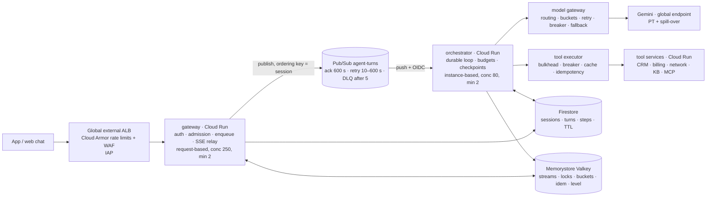

# Scaling Agentic Solutions — a primer

*This primer is about how to scale an agentic solution on Google Cloud. The worked example is a support agent that talks to customers and runs on Cloud Run and Gemini (Gemini Enterprise Agent Platform, formerly Vertex AI). The date of the fact check is 5 September 2026. The sections have numbers, so that you can use them for drills.*

*The callouts are of four types. **In a design review** tells you what to say. **Numbers** gives the anchors to keep in your head. **Verify** marks the facts that change. **Pitfall** tells you what an experienced platform team listens for.*

The code, the capacity model and the practice notebooks for this primer are in the `agentic-scaling-lab` repository. `python -m scalelab.capacity` calculates each number in this primer, or its load generator (`scalelab/sim.py`) measures it. Thus the arithmetic in this document and the arithmetic in the notebooks cannot become different.

---

## 0. The thesis, and how the round tests it

The way to scale an agent system is to put a limit on tokens, not to add servers. Some things look like a classic capacity problem: instances, connections, queue depth and database throughput. All of them are small and low-cost when you compare them with one number. That number is the tokens per minute at the model. You share this resource with all of your organisation, and you cannot buy it by the instance.

The design work has three goals:

- The demand for that resource is predictable (admission control, routing, caching, compaction).
- When the resource runs out, the system degrades and does not collapse (levels, shedding, fallbacks).
- Each turn survives the failures that a long, multi-step unit of work with side effects makes likely (checkpoints, idempotency, at-least-once delivery).

A design for scale must answer four things.

- *Resource estimation*: can you go from "100,000 conversations a day" to tokens per minute, in-flight turns and dollars in two minutes on a whiteboard?
- *Trade-offs*: provisioned throughput or pay-as-you-go, sync or queued, managed runtime or Cloud Run, degrade or shed?
- *Robustness*: what breaks first, what occurs when it breaks, and how does the user see the failure?
- *Simplicity*: which of the mechanisms in this primer does this workload really need at its scale, and which come too early?

> **In a design review.** Open a question about scale with the unit of work and the binding constraint: "The unit of work is a *turn*. Each turn is two to three model calls of about five thousand tokens. Thus 100k conversations a day is about 14 million input tokens a minute at peak. That is above the Flash tier baseline, and it is the constraint that I will design around. Cloud Run will not be the problem."

How to use this primer:

- Part 1 tells why agents scale in a different way.
- Part 2 is the checklist of dimensions that you go through first.
- Part 3 is the arithmetic, worked on the anchor scenario.
- Part 4 is the reference architecture.
- Part 5 describes each mechanism for scale, with the numbers that show the need for it.
- Parts 6 and 7 are the failure catalogue and the growth path.
- Part 8 shows how to go through the design in a review.
- Part 9 is a map of Google's stack.
- The verify list at the end tells you what to examine again before you rely on any number.

---

## 1. What is different about scaling agents

### 1.1 The unit of work is a turn, not a request

A web request is stateless and short, and each web request is similar to the others. To scale it, you add replicas until CPU is the limit. A turn of an agent is a *loop*. It has a model call that plans, tool calls that get or change something, and another model call that answers. Sometimes it has more calls.

The model decides the length of the turn at run time. Its steps are sequential, because each step depends on the step before it. Its middle steps have side effects in systems that you do not own. Also, the memory of the loop (the context) grows as the conversation continues.

| Property | Web request | ML inference request | Agent turn |
|---|---|---|---|
| Duration | 10–200 ms | 20–500 ms | 3–30 s, variable |
| Steps | 1 | 1 | 2–8, decided at run time |
| Binding resource | CPU / DB connections | GPU seconds | tokens per minute at a shared model pool |
| Cost driver | requests | requests | tokens × steps × context length |
| State | none or a row | none | a transcript that grows, plus checkpoints |
| Side effects | in your DB | none | in systems of record: CRM, billing, the ticket system |
| Failure unit | retry the request | retry the request | resume the *step*, never repeat a write |

Everything in the rest of this primer comes from that last column.

### 1.2 The binding constraint is model throughput, and it is shared

On the Gemini Enterprise Agent Platform, the pay-as-you-go path ("Standard PayGo", the successor of dynamic shared quota) has no constant quota for each project. Your organisation gets a tokens-per-minute *baseline* for each model family. The baseline depends on the spend of the 30 days before now. For Flash and Flash-Lite, the baseline is 2 M, 4 M or 10 M TPM at tiers 1, 2 and 3. For Pro, it is 0.5 M, 1 M or 2 M. Your organisation can send bursts above the baseline on a best-effort basis.

A 429 does not mean "you hit a number". It means "there is contention on the shared pool right now". The documented reaction is exponential backoff, the global endpoint, and smooth traffic within the minute. Guaranteed capacity is a separate purchase. You buy Provisioned Throughput in generative-scale units (GSUs), by the week, month, quarter or year. By default, it has a pay-as-you-go spill-over.

Two consequences shape every design. First, the capacity plan is a *token* budget. You calculate the demand in tokens per minute before you calculate anything else. Second, you share the pool with every other team in the organisation. Thus the shape of your traffic (smooth or bursty) affects your own 429 rate and the 429 rate of the other teams. Smooth traffic is the obligation of a good neighbour as much as an optimisation.

> **Numbers.** The Flash tiers are 2 / 4 / 10 M TPM. The Pro tiers are 0.5 / 1 / 2 M TPM (org-level, spend-based). One GSU of Gemini 3.5 Flash gives 675 burndown tokens/s (input ×1, cached input ×0.1, output ×6). PT costs $7.14 / $3.70 / $3.29 / $2.74 per GSU-hour for 1-week / 1-month / 3-month / 1-year terms on the global endpoint. Regional endpoints are +10 %.

### 1.3 Latency is a sum of sequential tails

A turn with two tool calls has four segments on the critical path. They are the plan call, the tools, the answer call, and the streaming of the answer. Model latency is the time-to-first-token (which now includes *thinking* time) plus the output tokens divided by the tokens per second. The segments are sequential. Thus the p95 of the turn is approximately the sum of the tails of the segments, not the tail of their sums. A 4-second p95 target makes four things necessary: parallel tools, streaming, prefetch, and a Flash-class model on the plan step.

Also, because turns are long, Little's law connects latency to concurrency. At 20 turns per second, a 6-second turn means 125 turns in flight, and a 12-second turn means 250. Each turn in flight holds memory, a session lock and an open client connection. Slowdowns *are* capacity problems.

### 1.4 Cost scales with context, and context grows

The bill is tokens, and input is the largest part of it. A support turn sends 4–6 k tokens of system prompt, tool schemas, customer context and history. It receives 300–400 tokens back. Without compaction, the input grows by several hundred tokens each turn. Thus the cost of the tenth turn is a multiple of the cost of the first turn.

Three levers change the cost by integer factors:

- routing of routine calls to a Flash-Lite-class model (a cost per token that is 3–5× lower),
- caching of the stable prefix (cached input at 10 % of the price),
- a bounded context (compaction, tool-result truncation, output caps).

The order is important. Route and cache first, because each later percentage applies to the new baseline.

### 1.5 Side effects mean at-least-once, and at-least-once means idempotency

At some point in a turn, the agent opens a ticket or changes a plan. The process can stop after the action and before it records the action. Cloud Run gives ten seconds after SIGTERM, the model call can time out, and the queue can deliver the message again. Exactly-once delivery is not available on the push path that you want (Pub/Sub exactly-once is pull-only and regional). Thus the loop must be *replayable*:

- Write a checkpoint of each step before you act on it.
- Give each write a key from the turn, the step and the arguments.
- Let the redelivery find the checkpoint and skip the work that the loop already did.

### 1.6 The feedback loop that kills agent systems

The loop has these steps:

1. More load causes more 429s from the shared pool.
2. The 429s cause retries and longer model calls.
3. Longer model calls cause longer turns.
4. Longer turns put more turns in flight (Little's law).
5. More turns in flight cause more memory, more queued model calls and more retries.
6. These cause more 429s.

Without a circuit breaker on the loop, an agent system under overload does not fail fast. It slows down for everyone until the turn deadlines expire and the users stop. When the users stop, the system has already used their tokens.

The load generator in the lab shows this in a few seconds (notebook 04). It puts 120 virtual users against a simulated 3 M TPM pool:

- With retries only, the p95 turn goes from 5.8 s to about 40 s. There are hundreds of 429s and a few dozen hard failures.
- Degrade levels and a breaker without a cap change that into 120 fail-fast turns.
- An in-flight cap of 30 comes from the token budget of the pool. With this cap, no turn fails and the pool rate-limits no call. Admitted turns finish at a p95 of 3.6 s. Admission control sheds 17 % of attempts with a `Retry-After`.

It is kinder to shed fast than to keep requests in a slow queue. It is also the only way to keep the turns that you admit inside their budget.

### 1.7 Multi-agent multiplies everything

A coordinator with three specialists changes 2.2 model calls per turn into eight. It multiplies the cost by 3.6×, and the latency by 2× even with parallel specialists. At 95 % per hop, the probability that every hop succeeds goes from $0.95^{2.2} \approx 0.89$ to $0.95^{8} \approx 0.66$. Thus, in a design for scale, the multi-agent question is never "how do I scale the coordinator". It is "what measured problem justifies paying that multiple". The answer is usually one of two things: a tool set too large for one context, or permissions that must differ per step.

> **Pitfall.** Do not describe scale as "put it on Cloud Run with max instances 100 and autoscaling handles it". Cloud Run scales the *container*. It cannot scale the token budget, the billing mainframe behind the tools or the cost per conversation. An experienced platform team hears that sentence as "has not run one of these in production".

---

## 2. The dimensions of scale — a checklist

Go through this list in the first ten minutes. For each dimension, the table gives the question that changes the design, the number that you calculate, and the lever that you can use.

| Dimension | Ask | Compute | Lever |
|---|---|---|---|
| Volume and burstiness | Conversations per day? Peak-to-average? What does an incident do to traffic (an outage sends a flood of traffic to the chat)? | conv/s, turns/s, model calls/s at average, peak, incident | admission control, PT for the base, spill-over for peaks, degrade for incidents |
| Turn shape | Turns per conversation, model calls and tool calls per turn, tokens in and out | tokens per turn, tokens per minute | routing, caching, compaction, output caps |
| Latency budget | What must the user see and when? First token? Whole answer? | TTFT p95, turn p95, and their sum over the critical path | streaming, parallel tools, prefetch, Flash on the plan step, thinking level |
| Concurrency | How many users at once? How long is a conversation? | in-flight turns = turns/s × turn duration, concurrent sessions = conv/s × conversation duration | in-flight cap, a gateway with a low cost per connection, per-instance concurrency |
| Model capacity | Which tier is the org on? Did the org buy PT? Which region must the data stay in? | demand TPM against baseline, GSUs for the base load, break-even utilisation | Standard/Priority/Flex tiers, PT term, global or regional endpoint |
| Cost | Cost per conversation today (a contact that a person handles costs dollars)? Budget? | $/conversation, $/month, and the share of each lever | route, cache, compact, batch offline work, budgets per turn |
| Tools and downstream | Which systems, their QPS limits and p95? Which calls have side effects? | tool calls/s per system against its limit | prefetch, caching, bulkheads, circuit breakers, idempotency keys |
| State | What must survive a crash? A restart? A region failure? How long do you keep a transcript? | writes/s per collection and per document, document size, retention | checkpoints in Firestore, hot state in Redis, TTLs, compaction |
| Tenancy and fairness | One customer or many brands? Priorities (VIP, agents-assist)? | per-tenant turns/min, priority classes | per-tenant buckets, priority bypass of the cap, separate quotas |
| Geography and residency | Which countries? Is it necessary to process the data in the region? | regional +10 % price, fewer models on regional endpoints | global endpoint unless residency forbids it, multi-region services with failover |
| Change | How often do prompts, tools and models change? Model retirements? | cache invalidations per change, models with 45-day retirement clocks | prompt versions in cache keys, model ids behind config, canary rollouts |
| Observability | What tells you that it works? What sends a page to someone? | SLIs: availability, latency attainment, shed rate, cost/conversation | metrics with low-cardinality labels, traces per turn, burn-rate alerts |

> **In a design review.** Say the dimensions that you will *not* design for, and why: "Single tenant, single region, and residency is not necessary. Thus I will use the global endpoint and skip per-tenant quotas in v1. I will note where they will go."

---

## 3. The arithmetic, worked

The anchor scenario is a fictional consumer telco, Meridian Mobile, with a support agent in the app. The assumptions are ordinary on purpose. The method is the important part.

### 3.1 Assumptions

| Assumption | Value |
|---|---|
| Conversations per day | 100,000 |
| Peak hour against daily average | 3× |
| Network-incident spike against average | 10× (an outage sends everyone to the chat at once, with an intent mix that is 75 % "no signal") |
| Turns per conversation | 6 |
| Model calls per turn | 2.2 (plan, answer, sometimes a third) |
| Tool calls per turn | 1.3 |
| Input tokens per model call | 5,000. Of these, 3,000 are the stable prefix (prompt, policies, tool schemas). The prefix is in the cache 90 % of the time. |
| Output tokens per model call | 350, with thinking at the LOW level included |
| Turn duration (p50) | 6 s. Users think for ~60 s between turns. |
| Models | Gemini 3.5 Flash (standard), 3.5 Flash-Lite for 35 % of calls (routing, short answers), 3.1 Pro Preview for rare hard cases |
| Downstream limits | CRM 200 QPS, billing mainframe 40 QPS |
| Org tier | Flash tier 3: 10 M TPM baseline |

### 3.2 Rates and tokens

| Quantity | Average | Peak | Incident |
|---|---:|---:|---:|
| Conversations / s | 1.16 | 3.47 | 11.6 |
| Turns / s | 6.94 | 20.8 | 69.4 |
| Model calls / s | 15.3 | 45.8 | 153 |
| Tool calls / s | 9.0 | 27.1 | 90.3 |
| Input tokens / min | 4.58 M | 13.75 M | 45.8 M |
| … of which uncached | 2.11 M | 6.33 M | 21.1 M |
| Output tokens / min | 321 k | 963 k | 3.21 M |
| Input TPM against 10 M baseline | 0.46× | **1.38×** | **4.58×** |

The calculation, out loud:

- 100,000 ÷ 86,400 ≈ 1.16 conversations a second.
- × 6 turns ≈ 7 turns a second.
- × 2.2 calls ≈ 15 calls a second.
- × 5,000 tokens × 60 ≈ 4.6 M input tokens a minute.

The peak is three times that, 13.75 M, which is already above the tier baseline. During an incident, the demand goes to ten times the average, 46 M. That is four and a half times the baseline. The conclusion is not "buy more". It is: "the peak fits only if I cut tokens or buy PT. I must *shape* the incident, because no purchase makes 46 M TPM appear in a minute".

> **Verify.** Find out if cached tokens count at full weight against the PayGo TPM baseline. They count at 0.1 against Provisioned Throughput (documented). The documents do not describe as clearly how PayGo counts them. Design as if they count at full weight. Treat any relief as an upside.

### 3.3 Concurrency, from Little's law

$$
\text{In-flight turns} = \text{turns/s} \times \text{turn duration:}
$$

6.9 × 6 ≈ 42 at average, 125 at peak, 417 during an incident. Concurrent *sessions* are eleven times larger, because users think between turns. A conversation lasts 6 × (6 + 60) ≈ 400 s. Thus there are 1.16 × 400 ≈ 460 sessions at average and 4,600 during an incident.

The two numbers give the size of different things. In-flight turns give the size of the orchestrator memory, the session locks and the model concurrency. Concurrent sessions give the size of the open streaming connections at the gateway and of the hot session state in Redis.

The token budget also puts a cap on concurrency. 10 M TPM ÷ 60 ≈ 167 k tokens/s. A turn uses 2.2 × 5,350 ≈ 11.8 k tokens over 6 s ≈ 2 k tokens/s. Thus the baseline can carry about 85 turns in flight, or 14 turns per second. That is the initial value for the in-flight cap of the admission controller. It is *below* peak demand, and that is the whole story of this scenario.

### 3.4 Cost per conversation

| Configuration | Per model call | Per conversation | Per month |
|---|---:|---:|---:|
| All Gemini 3.5 Flash, no caching | $0.0107 | $0.141 | $427 k |
| All 3.5 Flash, prefix cached | $0.0070 | $0.092 | $281 k |
| 35 % of calls on 3.5 Flash-Lite, prefix cached | — | **$0.068** | **$206 k** |

The calculation for one 3.5 Flash call:

- 2,300 uncached input tokens at $1.50/M,
- 2,700 cached tokens (the 3,000-token prefix at a 90 % hit rate) at $0.15/M,
- 350 output tokens at $9/M.

The call costs $0.00345 + $0.0004 + $0.00315 ≈ $0.0070. Thirteen calls in a conversation come to ≈ $0.092. When you route a third of them to Flash-Lite at $0.00165, the cost goes down to $0.068. With self-hosted models, the same lever is a distilled student behind a cascade. The price of that student, with its break-even, is in [distillation §9](../../../../00-foundations/distillation/PRIMER.md#9-the-economics-of-a-student).

Compared with a contact that a person handles, at several dollars, all three rows are low-cost. Compared with each other, they differ by 2×. At this volume, that is $220 k a month. Note that output tokens are the largest single line, but there are fourteen times fewer of them. On this model, the price of output is six times the price of input. Thus output caps and thinking levels are cost levers, not only latency levers.

> **Verify.** The prices are for the global endpoint on 5 September 2026:
>
> - 3.5 Flash: $1.50 / $9.00 per M tokens (cached input $0.15).
> - 3.5 Flash-Lite: $0.30 / $2.50.
> - 3.1 Flash-Lite: $0.25 / $1.50.
> - 3.6–3.8 Flash: $0.75 / $3.75 introductory until 31 December 2026, then $1.50 / $7.50.
> - 3.1 Pro Preview: $2 / $12 (double above 200 k context).
>
> Regional endpoints are +10 %. The Priority tier is 1.8×. Flex and Batch are 0.5×.

### 3.5 Provisioned Throughput

You buy PT in GSUs per model. One GSU of 3.5 Flash gives 675 *burndown* tokens per second. The burndown of a call is

$$
\text{uncached input} \times 1 + \text{cached input} \times 0.1 + \text{output} \times 6.
$$

The anchor call has a burndown of 2,000 + 300 + 2,100 ≈ 4,400–4,700 tokens. Thus one GSU serves about 0.14 calls per second. All of the standard-model share (65 % of calls) on PT needs 69 GSUs at average, 207 at peak and 688 during an incident.

| Term | $ per GSU-hour | $ per M burndown tokens at 100 % utilisation | Break-even utilisation against PayGo ($1.50/M burndown) |
|---|---:|---:|---:|
| 1 week | 7.14 | 2.94 | 196 % (never) |
| 1 month | 3.70 | 1.52 | 101 % (never) |
| 3 months | 3.29 | 1.35 | 90 % |
| 1 year | 2.74 | 1.13 | 75 % |

Thus PT is not a discount unless you commit for a year *and* keep the units three-quarters busy. If you buy PT for the peak (207 GSUs), it is 33 % utilised on average and costs more than pay-as-you-go. The usual answer is to buy it for the base (69 GSUs, $138 k a month on a 1-year term). Then you let the peaks spill over to Priority or Standard PayGo. PT buys an SLA and immunity from the contention of the shared pool, for the traffic that is most important. That is why the request headers let you say, per call, "dedicated only", "spill over to Priority" or "bypass PT".

> **In a design review.** "PT for the base load on a long term, spill-over for the peak, and for the incident, I *shape* the demand. Before anyone buys a monthly term, I examine the break-even utilisation. A monthly term never costs less than pay-as-you-go."

### 3.6 The rest of the estate

| Resource | Average | Peak | Incident | Limit / note |
|---|---:|---:|---:|---|
| Orchestrator instances (80 in-flight turns each, ×1.4 headroom) | 1 | 3 | 8 | Cloud Run: not the constraint |
| Gateway instances (250 open streams each) | 2 | 2 | 3 | min 2 for warm capacity |
| Firestore ops / s | 42 | 125 | 417 | collection ramp: 500, then +50 % / 5 min. ~1 write/s per document. |
| Redis ops / s | 280 | 830 | 2,800 | one 2-vCPU Valkey node ≈ 120 k ops/s |
| Pub/Sub messages / s | 7 | 21 | 69 | 5 KB each: small |
| Billing mainframe QPS | 1.7 | 5.2 | 17.4 | limit 40: satisfactory, but cache invoices all the same |
| CRM QPS | 4.9 | 14.6 | 48.6 | limit 200: prefetch at the start of the session, cache the profile |

The Cloud Run fleet for all of this system is a few dozen vCPUs. That is approximately 0.1 % of the model bill. The estimation exercise is really an exercise in tokens, and a good design says so.

### 3.7 What breaks first

| Level | Resource | Demand against limit | Solution |
|---|---|---:|---|
| Incident | Model TPM baseline | 4.6× | shape demand (admission, degrade), PT for the base, cut tokens per call |
| Peak | Model TPM baseline | 1.4× | PT or custom tier, caching, compaction, more routing to Lite |
| Incident | Billing mainframe | 0.43× | cache invoices for minutes, bulkhead, degrade to cached answers |
| Incident | CRM | 0.24× | prefetch at the start of the session, 5-minute profile cache |
| Incident | Redis | 0.02× | nothing |
| Incident | Firestore | 0.08× | pre-warm collections before launch day |

---

## 4. The reference architecture

```mermaid
flowchart LR
  U[App / web chat] --> LB[Global external ALB<br/>Cloud Armor rate limits + WAF<br/>IAP]
  LB --> GW[gateway · Cloud Run<br/>auth · admission · enqueue · SSE relay<br/>request-based, conc 250, min 2]
  GW -- publish, ordering key = session --> PS[(Pub/Sub agent-turns<br/>ack 600 s · retry 10–600 s · DLQ after 5)]
  PS -- push + OIDC --> OR[orchestrator · Cloud Run<br/>durable loop · budgets · checkpoints<br/>instance-based, conc 80, min 2]
  OR --> MG[model gateway<br/>routing · buckets · retry · breaker · fallback]
  MG --> G[Gemini · global endpoint<br/>PT + spill-over]
  OR --> TE[tool executor<br/>bulkhead · breaker · cache · idempotency]
  TE --> TS[tool services · Cloud Run<br/>CRM · billing · network · KB · MCP]
  OR <--> FS[(Firestore<br/>sessions · turns · steps · TTL)]
  OR --> RS[(Memorystore Valkey<br/>streams · locks · buckets · idem · level)]
  GW <--> RS
  GW --> FS
```

A turn, from end to end: the client posts a message. The gateway authenticates the request. It examines the bucket of the tenant and the global in-flight cap, and it decides a degrade level. It writes the turn to Firestore. It publishes to Pub/Sub with the session id as ordering key. Then it starts to relay the event stream of the turn to the client over SSE.

Pub/Sub pushes the message to the orchestrator with an OIDC token. The orchestrator takes the session lock in Redis. It loads the session and all the steps that have a checkpoint. Then it runs the loop under a budget:

1. Call the model through the gateway, and send the deltas to the Redis stream.
2. Write a checkpoint of the step in Firestore.
3. Run the tool calls in parallel through the executor.
4. Write a checkpoint.
5. Repeat.
6. Finish.

Then the orchestrator writes the transcript, publishes the terminal event, decrements the in-flight gauge and acknowledges the push. The compaction of the history runs after the terminal event. That is why the orchestrator is on instance-based billing.

### 4.1 Why it is shaped this way

*Gateway and orchestrator are separate services* because they scale on different signals and fail in different ways. To hold a streaming connection costs a coroutine and a few kilobytes. The gateway runs at high concurrency on request-based billing, and its instances are low-cost. To run the loop costs model tokens, tool calls and the memory of a full context. The orchestrator runs at moderate concurrency on instance-based billing, so that Cloud Run does not throttle the CPU of background work after the response.

The per-instance limits of Cloud Run also apply in different ways to the two services. The 1,000-connection and 800 requests-per-second caps set the limit of a gateway instance. The memory per in-flight turn sets the limit of an orchestrator instance.

*A queue sits between them even though the user waits*, for three reasons:

- A queue changes a burst into a backlog with one number that you can observe, not into a pile of failed requests. That number is the age of the oldest turn that has not started.
- It gives at-least-once execution with redelivery. This is what makes the loop durable.
- It separates the drain rate of the orchestrator from the arrival rate. Thus the token bucket, not the load balancer, sets the pace.

The cost is a few tens of milliseconds and a Pub/Sub push subscription.

*Events travel through Redis Streams, not a direct connection*. The reason is that the orchestrator instance that runs the turn is not the gateway instance that holds the client. A stream with sequence numbers also gives resume-after-reconnect (`Last-Event-ID`) at no cost. SSE clients need this on Cloud Run, where every stream is a request with a 60-minute ceiling.

*Firestore holds the durable state and Redis the hot state* because they have opposite access patterns. Firestore gets a few document writes per turn, with a ~1 write/s/document rule and a 1 MiB cap. Redis gets thousands of sub-millisecond counter, lock and bucket operations per second. To put them into one store is the most common mistake in these designs.

*The model gateway is a library, not a service*, for two reasons. An extra hop on the critical path costs latency. Also, the state that it needs (buckets, breakers, the 429 ratio) fits in Redis. It becomes a service when many agents share one quota and need central policy. At the enterprise level, Apigee or the Agent Gateway of the platform do that job.

### 4.2 Alternatives and when to choose them

| Runtime | Select when | What you give up | Settings for scale |
|---|---|---|---|
| **Cloud Run** (this design) | You want to see and adjust each mechanism for scale. You have services in different languages. You already run Cloud Run. | You operate the queue, the stores and the loop yourself | concurrency, min/max instances, billing mode, CPU/memory, Direct VPC, timeouts |
| **Agent Runtime** (managed, formerly Agent Engine) | Python agents on ADK. You want managed sessions, Memory Bank, sandboxed code execution, identity, and the Optimize pillar, with the least infrastructure. | Less control: min instances 0–10, max up to 1,000, container concurrency default 9 (≈ 2 × CPU + 1), 1–8 vCPU, up to 32 GiB. A default *90 queries per minute* quota that you must raise before any load test. Measured cold latency ≈ 4.7 s with min instances 1, against ≈ 0.4 s warm. | min/max instances, container concurrency, resource limits, quotas |
| **GKE Autopilot** | Kubernetes is already the platform. GPUs for self-hosted models. Queue-depth autoscaling with KEDA. Service mesh. | Most operational surface. Slower iteration. | HPA/KEDA on queue depth or custom metrics, pod resources, node pools |

The honest answer has two parts. First, Agent Runtime is the default for a Google-native team. Cloud Run is the choice when a platform team wants to own the compute, or when the agent is not Python-first. Second, the *mechanisms* in Part 5 are the same in all three. Only the place where you configure them is different.

---

## 5. The scaling mechanisms

### 5.1 Quota strategy and client-side smoothing

You must shape the demand for the model before it gets to the pool. There are three layers:

1. An in-flight cap at the gateway (Part 5.3) limits how many turns can make tokens at the same time.
2. A token bucket per model in the model gateway spreads calls evenly within each minute. Its size is *your share* of the tier baseline, and it refills continuously.
3. The choice of endpoint and tier:
   - The global endpoint, unless residency forbids it. It routes to the region with the most capacity, and the tiers apply there.
   - Priority PayGo for traffic that customers see and that must not wait in a queue.
   - Flex for latency-tolerant background work at half price.
   - Batch for anything that can wait a day.

The *capacity* of the bucket is the burst that you tolerate. Its *rate* is the sustained tokens per second. A six-second burst allowance is a good default. A smaller allowance gives smoother traffic and fewer 429s, but more waits in the client-side queue.

If the bucket cannot admit a call within a bounded wait, the gateway treats that as a rate-limit signal too. That signal counts toward the degrade level. Then the gateway tries a sibling model with its own pool before the call fails. When there is more than one orchestrator instance, the bucket must be in Redis. A Lua-scripted Redis bucket is atomic and costs one round-trip per call.

Provisioned Throughput connects at the same place. For each request, you select one of three modes:

- *dedicated* (PT only, 429 when the PT runs out),
- *spill-over* (PT first, then PayGo). This mode is the default.
- *shared* (PayGo only).

You also select the tier that absorbs the spill (Standard, Priority, Flex). The `traffic_type` of the response tells you which pool served it. That field belongs on your dashboard. At scale, PT enforcement windows are short (1–5 s above 50 GSUs). Thus, to stay inside a PT commitment, you must make the bursts smooth to second granularity, not minute granularity.

> **Numbers.** Google's own guidance for 429s: exponential backoff, global endpoint, smooth within the minute. The Gemini 3.x context-cache minimum is 4,096 tokens (6,144 on 3.7/3.8 Flash and 3.1 Pro). The default TTL of an explicit cache is 60 minutes. Storage is $1.00 per M tokens per hour on Flash, and $4.50 on 3.1 Pro.

### 5.2 Retries, jitter, breakers, fallbacks, hedging

Retry with exponential backoff and *full* jitter. Full jitter is a uniform draw between zero and the backoff. Jitter is necessary because, when a shared pool throttles, every client sees the 429 at the same moment. Without jitter, every client retries at the same moment, and the retry wave is as large as the original.

The lab simulates 200 clients that retry against a pool with room for 40 per second (notebook 03). With jitter, the simulation finishes much sooner, with a fraction of the secondary 429s. When the server sends `Retry-After`, obey it, and add a small jitter on top of it. Never retry past the deadline of the turn. A retry that cannot finish in time only spends tokens.

A circuit breaker per model and per tool changes repeated failures into fail-fast decisions for a cooling period. A half-open probe lets it recover. Breakers are more important for agents than for web services. The reason is that an unhealthy dependency does not only slow down one request. It holds hundreds of coroutines *with their contexts in memory* until the deadline.

When the breaker of a model opens, or two consecutive 429s arrive, the gateway moves to a *sibling* model. The order is 3.5 Flash, then 3.7 Flash, then 3.5 Flash-Lite. The reason is that each family has its own pool, and the 429 rate of a sibling is nearly independent of yours. Thus model ids are in configuration, never in code. This is also how you survive the 45-day retirement clock on the short-lived Flash releases.

A hedge is a p99 tool for small, idempotent calls without streaming, for example intent classification. A hedge is a second identical request. You send it when the first request has not answered by a selected delay, and you keep the winner.

A hedge exchanges extra calls for tail latency. A hedge sent after approximately the p90 usually cuts p99 by a third to a half, for a few percent more calls. A hedge sent early halves p99 again, but it nearly doubles the calls. A hedge is incorrect for streaming answers, because you cannot take back the stream of the loser. It is also incorrect when the pool already has contention, because it adds load exactly when load is the problem. Thus the hedge has a gate on the degrade level.

### 5.3 Admission control and graceful degradation

Admission control is the circuit breaker on the feedback loop of 1.6. It sits at the gateway, before a turn has cost anything. It asks three questions, in this order:

1. Is this tenant within its budget? (A token bucket per tenant, so that a noisy brand cannot take all of the global pool.)
2. What is the degrade level of the system?
3. Will this turn take the in-flight count above the cap?

The cap starts at the token-budget number from 3.3. You adjust it from load tests. Priority classes (an agent-assist console, a VIP tier) bypass it.

The degrade level comes from signals that every instance can publish:

- in-flight turns,
- the age of the oldest queued turn,
- the share of model calls that the pool rate-limited in the last minute,
- if any model breaker is open.

The system writes the level to Redis, so that every gateway and orchestrator degrades together. Each level gets capacity, and it gives up something for it:

| Level | Trigger | What changes | Effect in the anchor scenario |
|---|---|---|---|
| 0 | normal | — | ≈ $0.005 per turn on Flash in the simulation of the lab |
| 1 | in-flight ≥ 80 % of cap, or queue age ≥ 10 s, or 429 ratio ≥ 5 % | Answers move to Flash-Lite with a shorter cap. Optional tools are not available. | about a quarter of the level-0 cost, turns approximately twice as fast |
| 2 | a model breaker open, or 429 ratio ≥ 15 % | Flash-Lite with minimal thinking and a short cap. No writes and no slow tools. A canned incident answer where one exists. | about a fifth of the level-0 cost |
| 3 | in-flight ≥ cap, or queue age ≥ 30 s | shed everything below priority 2 with 503 and a `Retry-After` that grows with the level | bounded latency for the admitted traffic |

Two details make the difference between an implementation that works and a diagram. First, the level needs hysteresis. Hold a raised level for ten to fifteen seconds before you let it go down. If not, it goes up and down between 1 and 3 each time the in-flight count crosses the cap. Second, the *client* must add jitter to `Retry-After`. If not, every shed user comes back at the same time, and the gateway sheds them all again together.

> **In a design review.** "During an outage, the traffic is 75 % 'no signal'. Level 2 answers that intent from a cached incident bulletin, at a fifth of the cost and half the latency. It does not touch the billing mainframe. When the network is down, that is exactly the system that I want to protect."

### 5.4 Durable execution

The loop writes a checkpoint of every step in Firestore *before* it acts on the result of the step:

- After the model call, the checkpoint holds the response of the model. This includes the parts that the next call must echo back (the thought signatures of Gemini 3).
- After the tool step, the checkpoint holds the tool results, compacted.

On redelivery, the orchestrator replays the turn from the checkpoint, and skips the completed steps. The tool executor makes a key for every write from the turn, the step, the call index and a hash of the arguments. It stores the result under that key for a day. Thus a redelivered turn that already opened a ticket gets the same ticket back. The crash test of the lab (notebook 02) stops the process immediately after the checkpoint of the ticket. It shows one ticket after redelivery, with four of five steps resumed.

The queue contract is the other half. Pub/Sub push acknowledges on any 2xx. On any other response, it delivers the message again, with a push backoff that grows from 100 ms to 60 s. The retry policy of the subscription adds a 10–600 s exponential backoff. After five attempts, the message goes to a dead-letter topic that has its own alert.

The orchestrator returns 503 only for transient infrastructure trouble (`RetryLater`). It returns 200 for every *terminal* outcome, graceful failure included. A turn that ended with "I couldn't complete that, a colleague will follow up" must not get a retry. A retry makes a second bill. The ack deadline (≤ 600 s) is the ceiling for one delivery. The turn budget (45 s) is well below it.

A session lock in Redis, with the turn id as value, serialises the turns of each session. It does this even when a redelivery and a new turn overlap. The TTL of the lock is the budget plus a margin, so that a crashed instance releases it.

Firestore shapes the layout:

- a session document (compaction keeps it bounded, well under 1 MiB),
- a turn document per user message, with steps appended atomically (`ArrayUnion` is idempotent for identical elements, and a replayed step needs that),
- tool results truncated to a few kilobytes, *in the checkpoint and also in the transcript*,
- a `expires_at` timestamp with a TTL policy,
- no counters in documents.

A turn writes its document a few times over several seconds. That is comfortably below the sustained one-write-per-second-per-document rule.

### 5.5 Context engineering for scale

The prompt has a layout for the cache. Its parts are, in this order:

1. system instructions, policies and tool schemas, byte-identical for every user and every turn,
2. the prefetched profile of the customer,
3. a summary of older turns,
4. the last N messages, verbatim,
5. the new message.

With implicit prefix caching, the identical prefix costs 10 % when it reaches the minimum. The minimum is 4,096 tokens on Gemini 3.x, and 6,144 on 3.7/3.8 Flash and 3.1 Pro. For large prefixes, an explicit cache with a TTL sits in front of it, deterministically.

The prompt *version* is part of the cache key. Thus a prompt change invalidates the cache cleanly, and does not silently halve your hit rate. On Flash, the explicit-cache break-even is below one request per hour. Storage is not the reason to hesitate. The reason is operational (TTL refresh, prompt versions).

Compaction keeps the input bounded. When the pending history is more than a token threshold, the Lite tier summarises everything except the verbatim tail. This occurs *after* the turn completes, off the critical path. Without compaction, the first model call of a twelve-turn conversation grows from under 2 k to over 7 k tokens. With compaction, the call stays near 2.4 k. Over twenty turns, that is approximately 385 k against 184 k input tokens, three times the cost.

The loop truncates tool results before they go into the transcript (a 180-line invoice becomes 600 tokens instead of 3,600). The loop does not replay the tool traffic of earlier turns at all. The answer of the assistant carries the facts.

Each task has its own output cap and its own thinking level. Thinking is minimal for routing and extraction, low for answers, and medium only for the rare hard case. The reason is that the bill counts thinking tokens as output. Also, 3.8 Flash at high effort uses about 30 % more of them than 3.7.

### 5.6 Tools at scale

The tools are usually the real bottleneck, because the capacity of the systems behind them is for people. The executor applies these mechanisms, in this order:

1. a bulkhead (a semaphore per tool per instance, so that a slow billing call cannot occupy every worker),
2. a circuit breaker per tool,
3. a result cache for pure reads (profile for five minutes, invoice for two, network status for thirty seconds),
4. the idempotency check for writes,
5. a timeout,
6. one retry, for idempotent reads only.

Failures come back to the model as *structured data*, for example "billing unavailable, retry in 10 s". They never come back as exceptions that abort the turn. The model can usually answer around a fact that it does not have. An aborted turn is the outcome with the highest cost of all.

Two habits remove most tool latency from the critical path:

- Prefetch the profile of the customer when the session starts. This is one CRM call. Without the prefetch, the call is in the plan step of the first turn.
- Let the model send independent calls in one step, so that they run concurrently (profile and network status together). Then the tool time of the turn is the max, not the sum.

Tool services run as their own Cloud Run services, with their own service accounts and invoker bindings. Thus they scale and fail independently. An MCP server over the same tools standardises discovery. It lets Agent Registry and Agent Gateway see and control the calls, at the cost of a hop. Thus the MCP server runs in the same region, with keep-alive connections.

### 5.7 Streaming and connections

SSE over HTTP/1.1 chunked transfer is the correct transport for a chat agent on Cloud Run. It passes every proxy, and it supports resume natively with `Last-Event-ID`. It is a plain request. Thus it counts against instance concurrency, and the request timeout applies to it (default 5 minutes, maximum 60). For this reason, clients must reconnect with the last sequence number. The relay must serve from the stream, not from memory.

Cloud Run caps a response without chunked transfer at 32 MiB. It does not cap streams. WebSockets also work, but they need session affinity, which is best-effort. In both cases, you need a cross-instance fan-out through Redis pub/sub.

The time-to-first-token that a user sees comes after the plan, the tools and the answer. That is about four seconds in the load tests. A TTFT SLO of two seconds is attainable only with *progress* events ("checking your invoice…") from the tool steps. The event stream already carries these events.

### 5.8 Cloud Run settings that matter

| Setting | Gateway | Orchestrator | Why |
|---|---|---|---|
| Billing mode | request-based (CPU during requests) | instance-based (CPU always on) | checkpoints, compaction and telemetry run after the response on the orchestrator |
| Concurrency | 250 | 80 | I/O-bound coroutines. Memory per in-flight turn is a few MB of context. |
| CPU / memory | 1 vCPU / 512 MiB | 2 vCPU / 2 GiB | JSON and pydantic work per step, headroom for 80 contexts |
| Min instances | 2 | 2 | warm capacity. On-demand scale-out waits max(10 s, 3.5× predicted cold start) before a request gets a new instance. |
| Max instances | 100 | 50 | bounded by regional CPU/memory quota ÷ instance size, and by Direct VPC egress (~100–200 instances per revision) |
| Timeout | 600 s | 600 s | SSE budget + queue + slack. It equals the Pub/Sub ack deadline. |
| Ingress | internal + load balancer | internal only | No request can bypass Cloud Armor. Pub/Sub push from the project is internal. |
| Autoscaling | 60 % CPU over 1 min, or 60 % of max concurrency | same | The signal that needs more instances wins. Adaptive concurrency decreases the effective concurrency to keep CPU < 90 %. |
| Shutdown | SIGTERM + 10 s | same | Write the checkpoint early. The queue delivers the message again. |

For agents, two Cloud Run resource types are important:

- *Worker pools* (GA April 2026) pull from Pub/Sub and autoscale on queue depth through the external-metrics autoscaler. They are the correct home for long-running turns that last longer than a push ack deadline.
- *Instances* (Preview, August 2026) are singleton, individually addressable, always-on workloads for stateful agent loops.

### 5.9 State stores

- Firestore for durable documents (sessions, turns, checkpoints). Regional: 99.99 %. Multi-region: 99.999 %. It has PITR and TTL policies, and documents of at most 1 MiB. A document takes ~1 sustained write/s. A collection with a sequential indexed field takes 500 writes/s. Ramp new collections at 500 ops/s, then +50 % every five minutes.
- Memorystore for Valkey or Redis for hot state: streams for the event relay, locks, token buckets, idempotency markers, the degrade level. It does ~120 k ops/s per 2-vCPU node. Cloud Run gets to it over Direct VPC egress. Direct VPC egress needs a /26 or larger subnet and about twice as many IPs as instances.
- Pub/Sub for the queue (10 MB messages, 31-day retention, ordering keys at 1 MB/s per key, push quota an order of magnitude below pull).
- Long-term memory and retrieval (AlloyDB with ScaNN, Vertex AI Vector Search, or the Memory Bank of the platform) sit beside these. Their size is chunks × dimensions × bytes. That is a small number next to the token bill.

### 5.10 Observability and SLOs

There is one trace per turn, with a span per model call and per tool call. The attributes come from the OpenTelemetry GenAI semantic conventions (`gen_ai.operation.name`, `gen_ai.provider.name`, `gen_ai.request.model`, `gen_ai.usage.input_tokens` and `output_tokens`, `gen_ai.conversation.id`). These conventions still have "Development" status, so the names can move. Keep the names in one place.

Metrics have only low-cardinality labels: model, tool, tenant, outcome, degrade level. Never use session or turn ids as labels. Cloud Monitoring takes one point per five seconds per time series. The metrics are tokens by kind, cost, latency and TTFT histograms, the 429 ratio and the bucket wait. The metrics are also the breaker state, in-flight turns, queue age, shed count by reason and degrade level.

Define these SLIs:

- availability (turns that ended with an answer over turns admitted),
- shed rate, as its own SLI,
- latency attainment (the share of turns under 8 s and, separately, the share with a first *progress* event under 2.5 s),
- cost per conversation, which drifts silently when a prompt or a model changes.

Set alerts for these conditions:

- Pub/Sub: the oldest unacked age above 30 s,
- DLQ above zero,
- 429 ratio above 5 %,
- degrade level at 2 or higher for more than a few minutes,
- p95 above 8 s,
- 5xx ratio above 2 %,
- Redis memory above 80 %,
- cost per conversation more than 30 % above its seven-day baseline.

The last alert catches the runaway loop before finance does.

### 5.11 Multi-agent designs and budgets

Every turn carries a budget with four independent dimensions (steps, model calls, tokens, dollars) and a wall-clock deadline. The reason is that each fails in a different way:

- tool thrash uses up steps,
- a long transcript uses up tokens,
- a Pro fallback uses up money,
- a slow mainframe uses up time while the user watches a spinner.

A turn that uses all of a budget ends *gracefully*, with a message and a terminal event. The system does not retry it.

In multi-agent topologies, the budget is hierarchical. The budget of the coordinator sets the limit for the sum of the budgets of the specialists. The calls of the specialists go through the same gateway and the same buckets. Thus fan-out cannot escape admission control.

Keep the arithmetic of 1.7 at hand as the argument. A measured problem justifies a specialist (incorrect-tool rate, context too large for one prompt, permissions that differ). A good design says which metric triggers the split.

### 5.12 Tenancy, priority, regions

Tenancy needs per-tenant buckets at the gateway, tenant labels on every metric and cost record, and a priority field on the turn. The priority field bypasses the in-flight cap for the classes that the gateway must never shed.

Regions:

- The global endpoint for the model, unless residency forbids it. Regional endpoints cost 10 % more and carry fewer models. 3.1 Pro Preview and the newest Flash releases are global or multi-region only.
- Cloud Run multi-region services with Service Health failover for the stateless tier.
- Firestore multi-region for the durable tier.
- Redis per region, with the event relay pinned to the region that runs the turn. Pub/Sub push delivers in-region by default, and that is what you want.

---

## 6. Failure catalogue

| Failure | Symptom | Mechanism that catches it | Mitigation |
|---|---|---|---|
| 429 storm on the shared pool | rate-limited ratio increases, turns get longer, in-flight count grows | bucket waits, breaker, degrade level 1–2 | smooth traffic, sibling fallback, PT for the base, shed at level 3 |
| Retry synchronisation | secondary 429 wave as large as the first | jittered backoff, deadline-bounded retries | full jitter, obey `Retry-After` and add jitter to it |
| Slow-motion collapse | p50 goes from 6 s to 40 s, nothing "fails" | in-flight cap, queue age | admission control derived from the token budget, shed fast |
| Tool thrash / runaway loop | many steps, same tool, same arguments | step and call budgets, duplicate-call detection | structured tool errors, step cap, cost alert |
| Context overflow | tokens per call increase turn over turn, cost per conversation drifts | compaction threshold, output caps | compaction, tool-result truncation, no replay of old tool traffic |
| Poison message | one turn fails on every redelivery | dead-letter after 5 attempts, DLQ alert | ack graceful failures, examine the DLQ, replay tools |
| Double side effect | two tickets for one complaint | idempotency keys on writes, checkpoint before the action | replay from checkpoint, dedup store with 24 h TTL |
| Hot document | Firestore write contention on a session doc | ~1 write/s/doc rule | per-turn documents, steps appended and not rewritten, no counters in docs |
| Cold-start storm | latency spike on scale-out, Direct VPC NIC creation | min instances, startup CPU boost | pre-scale before known peaks, keep instances warm |
| Noisy tenant | one brand's spike degrades everyone | per-tenant bucket | tenant quotas, priority classes |
| Model retirement | 45-day clock on short-lived Flash releases, 2.5 line retires 20 Oct 2026 | model ids in config, fallbacks | pin the 12-month models for production, use a canary for the rest |
| Prompt change | cache hit rate halves overnight, cost goes up | prompt version in cache key | put a version on each prompt, roll out with canary and watch the cached-token share |
| Incident mix shift | 75 % "no signal" intents. The billing mainframe is not relevant, but the CRM gets a large load. | degrade level 2 with cached incident answer | prefetch, caches, canned bulletin |
| Cost runaway | budget alert or cost-per-conversation drift | per-turn dollar budget, drift alert | budgets, spend caps, kill switch on max instances |

---

## 7. The growth path

| Stage | Conversations/day | What you need | What you can skip |
|---|---:|---|---|
| Pilot | ≤ 1,000 | one service, synchronous loop, budgets, structured tool errors, traces | queue, Redis, PT, degrade levels |
| Production v1 | 1,000–20,000 | gateway/orchestrator split, Pub/Sub, Firestore checkpoints, idempotency, SSE relay, per-turn budgets, dashboards | PT (fits comfortably in tier 1–2), multi-region |
| Scale | 20,000–200,000 | admission control with degrade levels, client-side smoothing, sibling fallbacks, compaction and caching, PT for the base load, capacity reviews | GKE |
| Enterprise | > 200,000, multi-brand | per-tenant quotas and priorities, custom PayGo tier, multi-region, Agent Gateway/Registry for governance, cost allocation per tenant | — |

The order of adoption is important. Add durability (checkpoints, idempotency) before admission control, admission control before PT, and PT before multi-region. Each stage needs a measurement that starts it. A good design names that measurement: "I will add the queue when p95 during the peak hour crosses the budget. I will buy PT when the 429 ratio stays above 5 % at peak for a week. I will add a second region when a residency or availability requirement says so, not before."

---

## 8. Walking the design in a review

### 8.1 A 45-minute design review

| Minutes | Move |
|---|---|
| 0–3 | Say the goal again. Name the unit of work (the turn) and the binding constraint (tokens per minute). |
| 3–10 | Go through the dimension checklist (Part 2). Give a default for each unknown, so that the review can continue. The unknowns are volume, peak ratio, incident behaviour, turn shape, latency budget, residency and tenancy. |
| 10–16 | Do the arithmetic (Part 3) on the board. Go in this order: rates, tokens, Little's law, TPM against tier, cost per conversation, what breaks first. |
| 16–26 | Show the architecture (Part 4) with the specifics in each box. Say which parts are routine and which are hard. |
| 26–38 | Do two deep dives, selected by risk. Usually they are admission/degradation and durable execution. Sometimes they are quota/PT strategy or context/cost. |
| 38–43 | Failure modes, the growth path, what you will measure in week one, and the "not in v1" list. |
| 43–45 | Decisions, trade-offs, and the one thing that you will confirm first with a load test. |

### 8.2 Questions that change the design

- "What happens to traffic during an outage?" (the incident factor, which decides the degrade design).
- "Is there a PT commitment already, and on what term?" (spill-over design, break-even).
- "Does the data have to stay in-country?" (regional endpoint, model availability, +10 %).
- "Which downstream system has the lowest QPS ceiling?" (bulkheads, caches, prefetch).
- "What does a human-handled contact cost today?" (the ROI line, which shows that $0.07 a conversation is clearly acceptable).
- "How many brands or tenants share this?" (fairness).
- "What must never happen twice?" (idempotency scope).

### 8.3 Anchors to keep in your head

| Anchor | Value |
|---|---|
| Tokens per call (support agent) | 4–6 k in, 300–400 out, thinking included |
| Little's law | $\text{in-flight} = \text{rate} \times \text{duration}$. Sessions ≈ 11× in-flight turns when users think for a minute. |
| Flash PayGo tiers | 2 / 4 / 10 M TPM. Pro: 0.5 / 1 / 2 M. |
| 10 M TPM sustains | ≈ 14 turns/s of the anchor shape, ≈ 85 in flight |
| PT, 3.5 Flash | 675 burndown tok/s per GSU. Output ×6, cached ×0.1. Break-even 75 % at 1-year term, never on a 1-month term. |
| Cost per conversation | $0.14, then $0.09 (cache), then $0.07 (route + cache) |
| Output price / input price | 6× on 3.5 Flash. Output caps and thinking levels are cost levers. |
| Cache minimum prefix | 4,096 tokens (3.x), 6,144 (3.7/3.8 Flash, 3.1 Pro) |
| Cloud Run | 1,000 concurrency and 800 req/s per instance, 60-minute request ceiling, 10 s after SIGTERM. Scale-out waits max(10 s, 3.5× cold start). Direct VPC ≈ 100–200 instances/revision. |
| Pub/Sub push | ack ≤ 600 s, backoff 100 ms–60 s, DLQ after 5–100 attempts, push quota ≈ 10× below pull |
| Firestore | 1 MiB docs, ~1 write/s/doc, a ramp from 500, then +50 %/5 min |
| Valkey | ≈ 120 k ops/s per 2-vCPU node |
| Agent Runtime | 90 queries/min default quota, concurrency 9 default, cold ≈ 4.7 s against warm 0.4 s |
| Compound reliability | $0.95^{5} \approx 0.77$, $0.95^{8} \approx 0.66$ |
| Cloud Run fleet against model bill | ≈ 0.1 % |

### 8.4 Two prompts, worked in outline

**"Scale the support agent from 5,000 to 500,000 conversations a day."**

Do the arithmetic first. 500 k/day is 5× the anchor. That gives ~70 M input TPM at peak, seven times the tier-3 baseline. No tier fits. Thus the design has three parts:

- PT for the base on a 1-year term (~350 GSUs of Flash, quote the monthly number),
- a custom tier negotiated for spill-over,
- a hard programme to cut tokens per call (explicit caches, compaction, lite routing to 50 %+).

Then do the concurrency. There are 625 in-flight turns at peak and 2,000 in an incident. Thus the orchestrator needs 12–40 instances, which is still small. Redis and Firestore are satisfactory. In an incident, the billing mainframe at 87 QPS is *over* its 40 QPS limit. Thus the invoice cache and level-2 degradation become necessary, not optional.

Then do the operational layer: per-tenant quotas if there are brands, multi-region if there is a residency or availability requirement, and cost allocation. At the end, say what you will confirm: a load test that reproduces the incident mix.

**"The agent costs $0.30 per turn and p95 is 20 s in the morning peak — fix it."**

Look at the trace first: where do the tokens and the seconds go, step by step? The typical findings and their corrections, in order:

1. No caching, because the prefix is not stable or is below the minimum. Reorder and enlarge the prefix. Use an explicit cache.
2. Pro on every call. Route to Flash, and use Flash-Lite for routing.
3. A context that grows without compaction. Compact it, truncate tool results, and remove old tool traffic.
4. Sequential tools. Use parallel calls and prefetch.
5. Retries without jitter, and a long deadline. Use jitter, a breaker and a fallback.
6. No admission control, so the peak becomes a slow-motion collapse. Use an in-flight cap from the token budget, and degrade levels.

The expected effects are a cost 4–5× down and a p95 of 6–8 s. You also get a shed rate that you can now *see* and negotiate, in place of a latency that nobody selected.

### 8.5 Quick-fire

- *Why not just raise max instances?* Because instances do not make tokens. You share the pool with other teams, and the cap is the token budget.
- *Why a queue if the user waits?* A backlog with one age that you can observe, redelivery for durability, and a drain rate that the bucket sets.
- *Exactly-once?* Not on push. Design for at-least-once with idempotency keys.
- *PT or PayGo?* Use PT for the base on a long term, if utilisation is above the break-even. Use PayGo/Priority for peaks. Shape the demand for incidents.
- *Sync or async?* Use sync for a single-step read with a sub-second budget. Use a queue for anything with tools, side effects or a deadline over a few seconds.
- *What do you measure in week one?* 429 ratio, queue age, minutes in a degrade level, p95 by step, cost per conversation, shed rate, cached-token share.
- *When do you move to Agent Runtime?* When the agent is Python-first and on ADK, and the team wants managed sessions/memory/identity and does not want to run the queue and stores. Raise the default quotas before you move.

> **Pitfall.** Do not quote a p95 without a step breakdown. Do not quote a cost without the token shape behind it. Do not say "we'll shed load" unless you also say what the user sees and when they can retry.

---

## 9. Google's stack, mapped to the mechanisms

| Mechanism | Google Cloud pieces (September 2026) |
|---|---|
| Model capacity | Gemini on the Gemini Enterprise Agent Platform: Standard PayGo tiers (org-level TPM baselines), Priority (1.8×) and Flex (0.5×, Preview) tiers through request headers. Provisioned Throughput in GSUs by term, with spill-over control. Global and regional endpoints (+10 %). Batch API (0.5×, ~24 h). |
| Caching | implicit prefix caching (≥ 4,096 / 6,144 tokens), explicit caches with TTL (`client.caches.create`), `usage_metadata.cached_content_token_count` |
| Thinking and output | `thinking_level` MINIMAL/LOW/MEDIUM/HIGH (3.7/3.8 Flash and 3.1 Pro reject MINIMAL). You must echo back the thought signatures. `max_output_tokens`. |
| SDK | `google-genai` 2.22 (`genai.Client(enterprise=True, project=…, location="global")`). Pin it below 3.0. SDK retries are off by default, so retry in your gateway. |
| Compute | Cloud Run services (gateway, orchestrator, tools), worker pools (GA) for pull-based long turns, instances (Preview) for singleton agents, jobs for evals and batch. Agent Runtime as the managed alternative. GKE with KEDA when Kubernetes is the platform. |
| Queue and durability | Pub/Sub push with OIDC, ordering keys, retry policy, dead-letter topics. Cloud Tasks for rate-capped, scheduled, deduplicated tool work (500/s per queue, 30-minute dispatch deadline). Workflows for year-long approvals (512 KB state, callbacks). |
| State | Firestore (Standard/Enterprise, with TTL and PITR), Memorystore for Valkey/Redis (streams, buckets, locks). AlloyDB + ScaNN / Vertex AI Vector Search for retrieval. Agent Runtime Sessions and Memory Bank on the managed path. |
| Edge | Global external ALB with serverless NEGs. Cloud Armor rate limits (per header/cookie/IP keys, throttle or ban) and WAF. IAP (natively on Cloud Run since March 2026). Apigee for spike arrest and quotas on API-shaped tools. |
| Governance at scale | Agent Registry, Agent Gateway (MCP/A2A-aware policy point, 5,000 registered resources per instance), Agent Identity (SPIFFE, mTLS + DPoP), Model Armor inline |
| Observability | Cloud Trace through OTLP (`telemetry.googleapis.com`), Cloud Monitoring custom metrics and SLOs with burn-rate alerts, log-based metrics, Managed Prometheus sidecar. Agent Observability/Evaluation on the managed path. |
| Delivery and cost | Cloud Build, Cloud Deploy canaries for Cloud Run (10/50/100 with verify). Budgets with Pub/Sub notifications. Budgets do not cap spend, so connect the notification to a kill switch. Cloud Run flexible CUDs (28 % / 46 %), Cloud Run budget spend caps (Preview). |

Off Google Cloud, the mechanisms translate one to one:

- You write token buckets and breakers yourself, on any platform.
- Pub/Sub corresponds to SQS/Service Bus.
- Firestore corresponds to DynamoDB/Cosmos.
- Memorystore corresponds to ElastiCache.
- PT corresponds to provisioned throughput on Bedrock or PTUs on Azure OpenAI.
- Cloud Run corresponds to App Runner/Container Apps.

The design is yours, not the vendor's.

---

## § Sources and verify list

Official documentation read on 5 September 2026 (Google's product docs are now at docs.cloud.google.com):

- Gemini Enterprise Agent Platform pricing, model pages and lifecycle table, Standard/Priority/Flex PayGo, Provisioned Throughput and its supported-models table, context caching, batch inference, quotas,
- Cloud Run quotas, autoscaling, request timeout, billing settings, Direct VPC egress, WebSockets, Pub/Sub push integration, "Host AI agents on Cloud Run",
- Agent Runtime deploy/optimise/quotas,
- ADK 2.x,
- Pub/Sub quotas, push, dead-letter topics, subscription properties,
- Cloud Tasks and Workflows quotas,
- Firestore quotas and best practices,
- Memorystore for Valkey node specifications,
- Cloud Armor rate limiting,
- Cloud Monitoring quotas,
- OpenTelemetry GenAI semantic conventions,
- Cloud Deploy canary.

The third-party latency measurements are from Artificial Analysis.

Examine these items again before you rely on any of it:

- model ids and retirement dates: a new Flash release starts a 45-day clock for 3.6/3.7/3.8, and the 2.5 line retires 20 October 2026. 3.1 Pro can leave preview.
- Flash introductory pricing ends 31 December 2026,
- PayGo tier baselines, and if cached tokens count against them,
- Flex PayGo status,
- the `google-genai` 3.0 release, which is not backward compatible,
- Cloud Run defaults (max instances, gen2) and the Preview status of instances, controls for scale and spend caps,
- Agent Runtime quotas and concurrency formula,
- the OTel GenAI attribute names.
