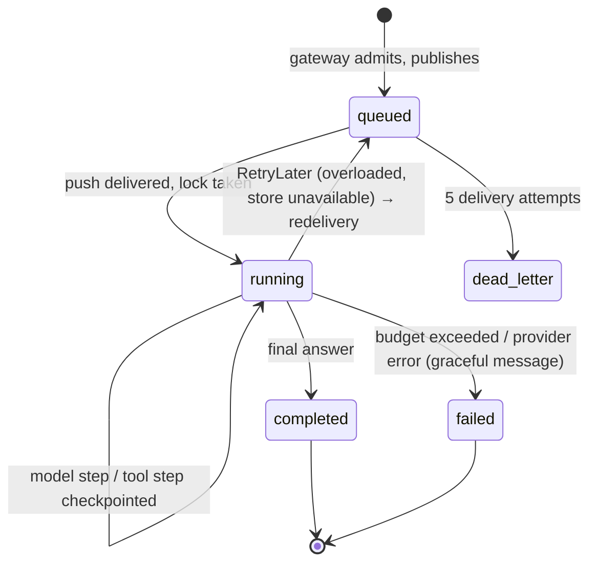
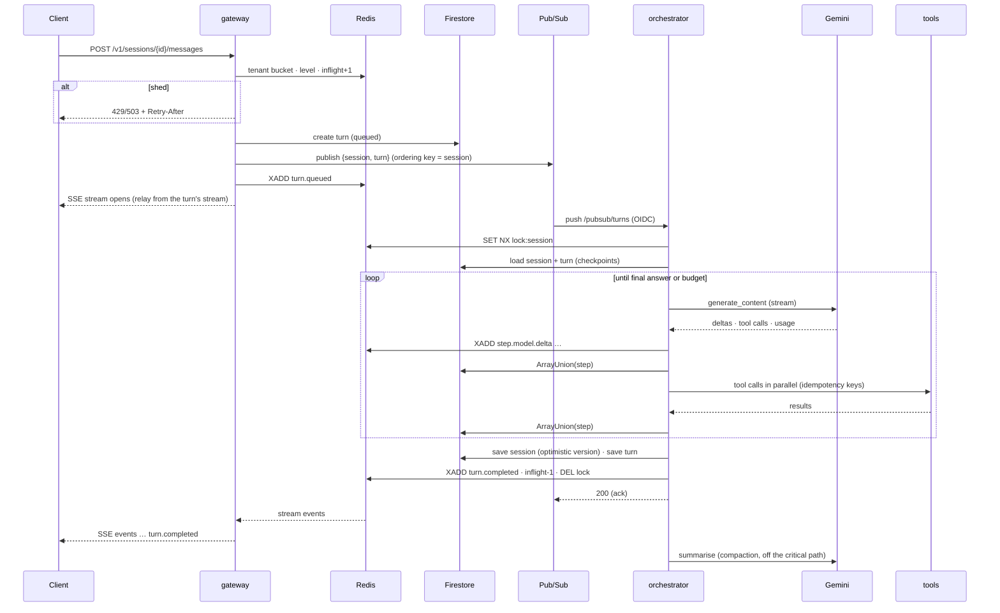

# Reference architecture — customer-support agent on Cloud Run + Gemini

This is the production shape that the lab's core concepts (`scalelab/`) scale up to: what runs where,
how each part scales, what its limits are and why the alternatives were not chosen. The scaling reasoning
is in `01-scaling-primer.md`; the numbers are in `03-capacity-plan.md`; the mapping from each core concept
to a Google Cloud service is in `04-gcp-mapping.md`. Product facts were checked on 5 September 2026.

## 1. Context and requirements

**Workload.** Meridian Mobile's in-app and web support agent. Customers ask about billing,
connectivity, plans, roaming and complaints; the agent answers from the CRM, the billing system,
network operations and the help centre, and can open tickets or change plans.

**Functional requirements.** Multi-turn conversations with streamed answers; tool use with reads and
a small number of writes; escalation to a human by ticket; a bounded, auditable transcript per
session; one tenant in v1 with the seams for more.

**Non-functional requirements (targets, per turn unless stated).**

| Requirement | Target | Notes |
|---|---|---|
| Volume | 100,000 conversations/day; peak ×3; incident ×10 | see capacity plan |
| Latency | first progress event p95 ≤ 2.5 s; turn p95 ≤ 8 s | the visible answer starts after tools |
| Availability | 99.5 % of admitted turns end with an answer (30-day) | shed is a separate SLI, target ≤ 2 % at peak, unbounded in incidents |
| Cost | ≤ $0.08 per conversation at pay-as-you-go prices | routed + cached: $0.068 |
| Durability | no lost turns; no duplicated side effects | at-least-once + idempotency |
| Residency | none in v1 | global endpoint; regional variant noted |
| Security | user identity at the edge; least-privilege service identities; no secrets in code | IAP, per-service accounts |
| Operability | one dashboard, seven alerts, canary rollouts, a kill switch on cost | section 3.7 |

**Constraints.** Model capacity is the organisation's Standard PayGo Flash tier (10 M TPM) plus an
optional Provisioned Throughput commitment; the billing mainframe accepts 40 QPS and the CRM 200 QPS;
Cloud Run is the customer's standard compute; Python 3.11.

## 2. System overview

```mermaid
flowchart TB
  subgraph Edge
    LB[Global external ALB<br/>managed cert · Cloud Armor · IAP]
  end
  subgraph Run["Cloud Run (region)"]
    GW[gateway<br/>request-based · conc 250 · 2..100]
    OR[orchestrator<br/>instance-based · conc 80 · 2..50]
    TS[tools<br/>request-based · conc 200 · 1..20]
    MCP[mcp (optional)<br/>streamable HTTP]
  end
  subgraph Async
    PS[(Pub/Sub agent-turns<br/>push · OIDC · ordering key)]
    DLQ[(agent-turns-dlq)]
  end
  subgraph State
    FS[(Firestore<br/>sessions/{id}/turns/{id})]
    RS[(Memorystore Valkey/Redis<br/>streams · locks · buckets · idem · level)]
  end
  subgraph Model["Gemini Enterprise Agent Platform"]
    GM[Gemini 3.5 Flash / 3.5 Flash-Lite / 3.1 Pro<br/>global endpoint · PT + spill-over · caching]
  end
  Client((App / web)) --> LB --> GW
  GW -->|publish| PS -->|push| OR
  PS -.->|after 5 attempts| DLQ
  OR --> GM
  OR -->|ID token| TS
  OR -.->|optional| MCP
  GW <--> RS
  OR <--> RS
  GW --> FS
  OR <--> FS
  OT[Cloud Trace · Monitoring · Logging] -.- GW
  OT -.- OR
```

Three Cloud Run services, one queue, two stores, one model endpoint. Every arrow is authenticated:
the load balancer to the gateway by IAP (or the dev bearer scheme locally), Pub/Sub to the
orchestrator by an OIDC token from a dedicated service account with `run.invoker`, the orchestrator to
the tool services by its own identity token, the services to Google APIs by their service accounts.

## 3. Components

### 3.1 Gateway

Responsibilities: authenticate; create sessions (prefetching the customer's profile so the first
turn does not pay a CRM round-trip); admit or shed turns; enqueue; relay the turn's event stream to
the client as SSE, with resume by `Last-Event-ID`.

| Aspect | Design |
|---|---|
| API | `POST /v1/sessions`, `POST /v1/sessions/{id}/messages` (submit + stream), `POST /v1/sessions/{id}/turns` (202), `GET /v1/sessions/{id}/turns/{tid}/events` (SSE), `GET /v1/sessions/{id}`, `/healthz`, `/readyz`, `/metrics` |
| Admission | per-tenant token bucket (429 + `Retry-After`) → degrade level from shared signals → in-flight cap (503 + `Retry-After`); priority 1–2 bypasses the cap |
| Degrade level | computed from in-flight turns, oldest queued turn age, model 429 ratio and breaker state; written to Redis with a 30 s TTL; hysteresis holds levels 1–2 for 15 s; level 3 follows the instantaneous cap |
| Scaling | request-based billing; concurrency 250; 1 vCPU / 512 MiB; min 2, max 100; timeout 600 s; ingress internal + load balancer |
| Limits it lives under | 1,000 concurrent requests and 800 req/s per instance; 60-minute request ceiling; 32 MiB for non-chunked responses (streams are exempt) |
| State it touches | Firestore (session and turn documents), Redis (buckets, gauge, level, streams), Pub/Sub (publish) |

### 3.2 Orchestrator (the lab's `loop.py`, run behind a queue)

Responsibilities: run one turn to completion under a budget; checkpoint each step; execute tools
through the executor; stream events; persist the transcript; compact history; publish model-health
signals; honour the Pub/Sub contract.

| Aspect | Design |
|---|---|
| Entry points | `POST /pubsub/turns` (push envelope → 200 ack / 503 nack), `POST /internal/turns/run` (direct; tests and the sync path) |
| Loop | plan call → (tool calls in parallel → answer call)* until a final answer; budgets: 6 steps, 6 model calls, 40 k tokens, $0.25, 45 s |
| Checkpoints | `StepRecord` per model call (response incl. provider parts) and per tool step (compacted results) appended to the turn document before the next action |
| Idempotency | writes keyed `{turn}:{step}:{i}:{tool}:{hash(args)}`; results stored in Redis for 24 h; replay returns the stored result |
| Concurrency control | session lock in Redis (`SET NX`, TTL = budget + 15 s); Pub/Sub ordering key = session id |
| Scaling | instance-based billing; concurrency 80; 2 vCPU / 2 GiB; min 2, max 50; startup CPU boost; timeout 600 s (= ack deadline); ingress internal |
| Failure policy | `RetryLater` → 503 (transient infrastructure); every other outcome → 200 with a terminal event (completed or gracefully failed) |

Turn state machine:



### 3.3 Model gateway (the lab's `resilience.py`, one per model)

A library in the orchestrator process. Per call: route (task × degrade level → model, thinking
level, output cap) → deadline check → circuit breaker → token bucket sized to this deployment's share
of the model's TPM → attempt with timeout → on 429/503/timeout retry with full-jitter backoff bounded
by the deadline, moving to a sibling model after two consecutive 429s or when the breaker is open →
account usage, cost, latency, TTFT and traffic type. Optional hedging for small non-streaming calls.

| Route | Task | Level 0 | Level 1 | Level 2 |
|---|---|---|---|---|
| route / summarise | classification, compaction | Flash-Lite, minimal thinking | same | same |
| plan / answer | the turn's main calls | 3.5 Flash, low thinking, 700 tokens | Flash-Lite, low, 400 | Flash-Lite, minimal, 250 |
| reason | rare hard cases | 3.1 Pro, medium | 3.5 Flash, medium | 3.5 Flash, medium |

Vertex specifics (see `scalelab/model.py::gemini_generate`): `genai.Client(enterprise=True, location="global")`,
PT request-type and spill-tier headers, explicit context caches for the stable prefix when it clears
4,096 / 6,144 tokens, thought-signature round-tripping, thinking-level clamping per model, error
mapping (429 → `RateLimited`, 5xx → `ServiceUnavailable`, 408/504 → `ProviderTimeout`).

### 3.4 Tool executor and tool services (the lab's `tools.py`)

The executor applies bulkhead → breaker → read cache → idempotency → timeout → retry (reads only) →
truncation, and returns structured errors to the model. Tools run in-process locally, as HTTP tool
services on Cloud Run in production (`tools_mode=http`), or behind an MCP server (`tools_mode=mcp`).
Tool specs carry their scaling policy: idempotent or not, timeout, per-instance concurrency cap,
retry attempts, cache TTL.

| Tool | Idempotent | Timeout | Bulkhead | Cache | Backing system |
|---|---|---|---|---|---|
| get_customer | yes | 2 s | 100 | 300 s | CRM (200 QPS) |
| get_invoice | yes | 4 s | 30 | 120 s | billing mainframe (40 QPS) |
| list_plans | yes | 2 s | 50 | 3600 s | CRM |
| check_network_status | yes | 1.5 s | 200 | 30 s | network ops |
| search_kb | yes | 1 s | 500 | 600 s | help centre |
| create_ticket | **no** | 3 s | 50 | — | CRM |
| change_plan | **no** | 3 s | 50 | — | CRM |

At degrade level 2 the registry withholds non-idempotent tools and tools with timeouts above 2 s.

### 3.5 State

| Store | Holds | Access pattern | Limits designed around |
|---|---|---|---|
| Firestore (Standard, Native, regional, PITR) | `sessions/{id}` (bounded transcript, summary, customer context, usage, version); `sessions/{id}/turns/{id}` (status, steps, usage, `expires_at` with a 30-day TTL policy) | a handful of writes per turn; one read per turn | 1 MiB/document; ~1 sustained write/s/document; 500 → +50 %/5 min collection ramp |
| Memorystore for Valkey (or Redis), STANDARD_HA | event streams per turn (5-minute retention), session locks, per-model and per-tenant token buckets (Lua), in-flight gauge, degrade level, idempotency markers, tool read cache, model-health signals | thousands of sub-ms ops/s | ~120 k ops/s per 2-vCPU node; reached over Direct VPC egress |
| Pub/Sub | `agent-turns` (push subscription, ordering, ack 600 s, retry 10–600 s), `agent-turns-dlq` (pull, 7 days) | tens of messages/s | push quota ≈ 10× below pull; 10 MB messages |

### 3.6 Edge

Global external Application Load Balancer with a serverless NEG on the gateway; managed certificate;
Cloud Armor policy with a throttle rule keyed on the `Authorization` header (600 requests per minute
per key) and a per-IP ban rule, plus the preconfigured SQLi/XSS rule sets; IAP on the backend
service for user identity (the gateway verifies the IAP assertion against the backend-service
audience). Cloud Run ingress is `internal-and-cloud-load-balancing`, so the armour cannot be bypassed.

### 3.7 Observability

OpenTelemetry spans per turn, model call and tool call with `gen_ai.*` attributes, exported to Cloud
Trace through the Telemetry API at a 10 % head-based sample; a process-local metrics registry exposed
at `/metrics` and, in production, exported through the OTLP endpoint; structured JSON logs. The
dashboard and the seven alert policies are provisioned with the rest of the estate (Terraform).

## 4. A turn, end to end



## 5. Capacity and scaling design

The full plan is in `03-capacity-plan.md`; the settings it produces:

| Setting | Value | Derivation |
|---|---|---|
| in-flight cap | 85 if the tier baseline is the only capacity; ~250 with Provisioned Throughput for the base | token budget ÷ tokens per turn-second, then tuned from load tests |
| `admission.soft_inflight_ratio` | 0.8 | degrade before shedding |
| `admission.queue_age_degrade_s` / `queue_age_shed_s` | 10 s / 30 s | oldest queued turn |
| `admission.rate_limited_ratio_degrade` | 0.05 | level 1 at 5 %, level 2 at 15 % |
| `models.tpm_limit[gemini-3.5-flash]` | 4 M | this deployment's share of the 10 M baseline |
| `budget.*` | 6 steps, 6 calls, 40 k tokens, $0.25, 45 s | bounds cost of the worst turn to ~4× the average |
| orchestrator instances | 3 at peak, 8 in an incident | in-flight × 1.4 ÷ 80 |
| gateway instances | 2–3 | streams × 1.4 ÷ 250, min 2 |
| PT | 69 GSUs of 3.5 Flash on a 1-year term for the base; spill-over to Standard PayGo | break-even 75 % utilisation |

How each component scales:

| Component | Scales on | Bound by | Knob |
|---|---|---|---|
| gateway | open streams and request rate | 1,000 concurrency / 800 req/s per instance | concurrency, max instances |
| orchestrator | in-flight turns (memory per context) | model token budget, not CPU | concurrency, in-flight cap |
| model | tokens per minute | tier baseline + PT | routing, caching, compaction, PT, tiers |
| tools | downstream QPS | CRM 200, billing 40 | caches, prefetch, bulkheads, degrade |
| Redis | ops/s | node size | one node up to hundreds of turns/s |
| Firestore | ops/s and per-document writes | ramp rules | document layout |
| Pub/Sub | messages/s | regional quotas | none needed |

## 6. Failure handling

| Failure | Behaviour |
|---|---|
| Model 429 / 503 / timeout | backoff with jitter within the deadline; sibling model after two 429s; breaker per model; counts toward the degrade level |
| Tool timeout / error / rate limit | structured error to the model; one retry for reads; breaker per tool; bulkhead protects the instance |
| Orchestrator instance dies mid-turn | Pub/Sub redelivers; checkpointed steps are replayed, not re-executed; writes deduplicated by idempotency key |
| Redis unavailable | gateway fails closed on admission (503 + Retry-After); orchestrator cannot take locks → `RetryLater` |
| Firestore unavailable | `RetryLater` → push backoff and redelivery; turn deadline still applies |
| Pub/Sub backlog grows | queue age raises the degrade level, then sheds; alert at 30 s |
| Poison turn | dead-letter after 5 attempts; DLQ alert; replay tooling |
| Overload | admission control: degrade levels 1–3 with hysteresis; priority classes bypass the cap |
| Model retirement / prompt change | model ids and prompt version in configuration; canary rollout; cached-token share on the dashboard |

## 7. Security

User identity terminates at the edge (IAP); the gateway trusts the IAP assertion and never handles
user credentials. Each service runs as its own service account with the minimum roles (gateway:
Pub/Sub publisher, Firestore user; orchestrator: Vertex AI user, Firestore user, invoker on the tool
services; tools: logging only). Tool services accept only the orchestrator's identity. Secrets (Redis
AUTH) come from Secret Manager. Prompt-injection screening is applied with Model Armor when enabled on
the model configuration; tool results are treated as data, truncated and never executed. Transcripts
carry a TTL. Cloud Armor rate-limits per caller before any compute is spent.

## 8. Deployment

Cloud Build builds the images; Terraform provisions everything else (VPC, Memorystore, Firestore, Pub/Sub,
IAM, the three Cloud Run services, the load balancer with Cloud Armor, monitoring, a budget); Cloud Deploy
rolls new revisions of the gateway and orchestrator as canaries (10 % → 50 % → 100 %) with a verify job
that runs a smoke test. Rollback is traffic back to the previous revision. What Terraform cannot do stays
manual: the Provisioned Throughput purchase, the PayGo tier, the IAP consent screen, DNS.

## 9. Alternatives considered (decisions)

| Decision | Chosen | Alternatives | Why |
|---|---|---|---|
| Runtime | Cloud Run | Agent Runtime (managed), GKE | customer standard; every mechanism visible |
| Turn execution | Pub/Sub push + durable loop | synchronous HTTP; Workflows; Cloud Tasks | backlog observability, at-least-once, drain rate set by the bucket |
| Durable state | Firestore | AlloyDB, Spanner | document shape, TTL, PITR, no schema migration |
| Hot state and relay | Redis Streams | Pub/Sub per session; Firestore listeners | resume by sequence, sub-ms, cheap |
| Model capacity | PT for the base, PayGo spill-over | all PayGo; PT for peak | break-even arithmetic |
| Model tiers | 3.5 Flash + 3.5 Flash-Lite + 3.1 Pro (rare) | one model everywhere | 2× cost, latency |
| Overload | degrade levels + shedding at the edge | queue everything; scale instances | feedback loop |
| Transport | SSE | WebSockets | resume, plain requests, no affinity |

## 10. What this design does not do (v1)

No voice; no multi-region; no per-tenant PT allocation; no long-term memory beyond the session
summary; no autonomous multi-step writes without a confirming turn; no self-hosted models. Each has
a documented trigger in the primer's growth path.
