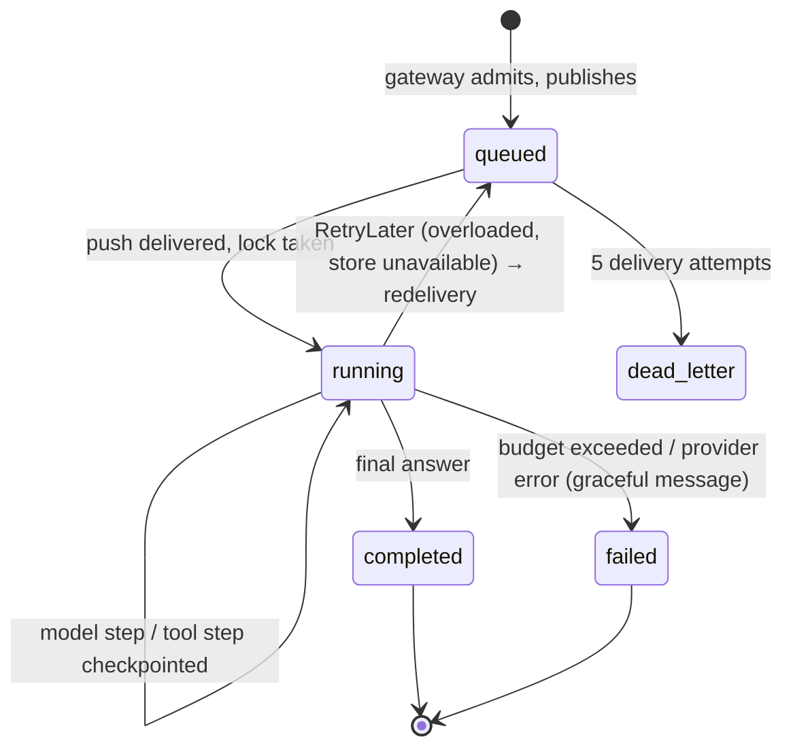
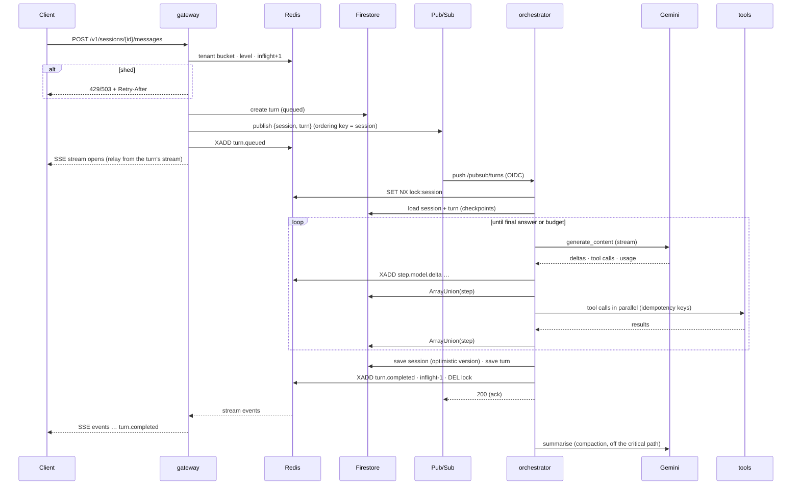

# Reference architecture — customer-support agent on Cloud Run + Gemini

This is the production shape that the core concepts of the lab (`scalelab/`) scale up to. It shows what runs where,
how each part scales, what its limits are, and why the design does not use the alternatives. The scaling reasoning
is in `01-scaling-primer.md`. The numbers are in `03-capacity-plan.md`. The mapping from each core concept to a
Google Cloud service is in `04-gcp-mapping.md`. The last check of the product facts was on 5 September 2026.

## 1. Context and requirements

**Workload.** The workload is the support agent of Meridian Mobile, in the app and on the web. Customers ask about
billing, connectivity, plans, roaming and complaints. The agent answers from the CRM, the billing system, network
operations and the help centre. It can also open tickets or change plans.

**Functional requirements.** The design must supply these functions:

- Multi-turn conversations with streamed answers.
- Tool use, with reads and a small number of writes.
- Escalation to a person by ticket.
- A bounded transcript per session, which you can audit.
- One tenant in v1, with the design points for more tenants.

**Non-functional requirements (targets, per turn unless stated).**

| Requirement | Target | Notes |
|---|---|---|
| Volume | 100,000 conversations/day, peak ×3, incident ×10 | See the capacity plan. |
| Latency | first progress event p95 ≤ 2.5 s, turn p95 ≤ 8 s | The visible answer starts after the tools. |
| Availability | 99.5 % of admitted turns end with an answer (30-day) | Shed is a separate SLI. Its target is ≤ 2 % at peak, with no bound in incidents. |
| Cost | ≤ $0.08 per conversation at pay-as-you-go prices | With routing and caching: $0.068. |
| Durability | no lost turns, no duplicated side effects | At-least-once delivery and idempotency. |
| Residency | none in v1 | The global endpoint, with a note about a regional variant. |
| Security | user identity at the edge, least-privilege service identities, no secrets in code | IAP, per-service accounts. |
| Operability | one dashboard, seven alerts, canary rollouts, a kill switch on cost | Section 3.7. |

**Constraints.** The model capacity is the Standard PayGo Flash tier of the organisation (10 M TPM), plus an
optional Provisioned Throughput commitment. The billing mainframe accepts 40 QPS, and the CRM accepts 200 QPS. Cloud
Run is the standard compute of Meridian. The language is Python 3.11.

## 2. System overview

```mermaid
flowchart TB
  subgraph Edge
    LB[Global external ALB<br/>managed cert · Cloud Armor · IAP]
  end
  subgraph Run["Cloud Run (region)"]
    GW[gateway<br/>request-based · conc 250 · 2..100]
    OR[orchestrator<br/>instance-based · conc 80 · 2..50]
    TS[tools<br/>request-based · conc 200 · 1..20]
    MCP[mcp (optional)<br/>streamable HTTP]
  end
  subgraph Async
    PS[(Pub/Sub agent-turns<br/>push · OIDC · ordering key)]
    DLQ[(agent-turns-dlq)]
  end
  subgraph State
    FS[(Firestore<br/>sessions/{id}/turns/{id})]
    RS[(Memorystore Valkey/Redis<br/>streams · locks · buckets · idem · level)]
  end
  subgraph Model["Gemini Enterprise Agent Platform"]
    GM[Gemini 3.5 Flash / 3.5 Flash-Lite / 3.1 Pro<br/>global endpoint · PT + spill-over · caching]
  end
  Client((App / web)) --> LB --> GW
  GW -->|publish| PS -->|push| OR
  PS -.->|after 5 attempts| DLQ
  OR --> GM
  OR -->|ID token| TS
  OR -.->|optional| MCP
  GW <--> RS
  OR <--> RS
  GW --> FS
  OR <--> FS
  OT[Cloud Trace · Monitoring · Logging] -.- GW
  OT -.- OR
```

The system has three Cloud Run services, one queue, two stores and one model endpoint. Every arrow is authenticated:

- From the load balancer to the gateway: IAP (or the dev bearer scheme locally).
- From Pub/Sub to the orchestrator: an OIDC token from a dedicated service account with `run.invoker`.
- From the orchestrator to the tool services: the identity token of the orchestrator.
- From the services to Google APIs: their service accounts.

## 3. Components

### 3.1 Gateway

Responsibilities:

- Authenticate.
- Create sessions. The gateway gets the profile of the customer in advance, so the first turn does not pay for a
  CRM round-trip.
- Admit or shed turns.
- Enqueue the turns.
- Relay the event stream of the turn to the client as SSE, with resume by `Last-Event-ID`.

| Aspect | Design |
|---|---|
| API | `POST /v1/sessions`, `POST /v1/sessions/{id}/messages` (submit and stream), `POST /v1/sessions/{id}/turns` (202), `GET /v1/sessions/{id}/turns/{tid}/events` (SSE), `GET /v1/sessions/{id}`, `/healthz`, `/readyz`, `/metrics` |
| Admission | Three stages, in this sequence: a token bucket per tenant (429 + `Retry-After`), then the degrade level from shared signals, then an in-flight cap (503 + `Retry-After`). The cap does not apply to priority 1–2. |
| Degrade level | The level comes from the in-flight turns, the age of the oldest queued turn, the model 429 ratio and the breaker state. Redis holds it with a 30 s TTL. Hysteresis holds levels 1–2 for 15 s. Level 3 follows the instantaneous value of the cap. |
| Scaling | request-based billing, concurrency 250, 1 vCPU / 512 MiB, min 2, max 100, timeout 600 s, ingress internal and load balancer |
| Limits it lives under | 1,000 concurrent requests and 800 req/s per instance, a 60-minute request ceiling, 32 MiB for non-chunked responses (not for streams) |
| State it touches | Firestore (session and turn documents), Redis (buckets, gauge, level, streams), Pub/Sub (publish) |

### 3.2 Orchestrator (the lab's `loop.py`, run behind a queue)

Responsibilities:

- Run one turn until it completes, within a budget.
- Write a checkpoint for each step.
- Run the tools through the executor.
- Send the events as a stream.
- Write the transcript to durable storage.
- Do compaction of the history.
- Publish model-health signals.
- Obey the Pub/Sub contract.

| Aspect | Design |
|---|---|
| Entry points | `POST /pubsub/turns` (push envelope in, 200 ack or 503 nack out), `POST /internal/turns/run` (direct, for tests and the sync path) |
| Loop | A plan call, then zero or more rounds of tool calls in parallel and an answer call, until a final answer. Budgets: 6 steps, 6 model calls, 40 k tokens, $0.25, 45 s. |
| Checkpoints | One `StepRecord` per model call (the response, with the provider parts) and per tool step (the compacted results). The orchestrator adds it to the turn document before the next action. |
| Idempotency | The key of each write is `{turn}:{step}:{i}:{tool}:{hash(args)}`. Redis keeps the results for 24 h. A replay returns the stored result. |
| Concurrency control | A session lock in Redis (`SET NX`, TTL = budget + 15 s). The Pub/Sub ordering key is the session id. |
| Scaling | instance-based billing, concurrency 80, 2 vCPU / 2 GiB, min 2, max 50, startup CPU boost, timeout 600 s (= ack deadline), ingress internal |
| Failure policy | `RetryLater` gives 503 (a temporary infrastructure problem). Every other outcome gives 200 with a terminal event (completed, or failed in a controlled way). |

The state machine of a turn:

```mermaid
stateDiagram-v2
  [*] --> queued: gateway admits, publishes
  queued --> running: push delivered, lock taken
  running --> running: model step / tool step checkpointed
  running --> completed: final answer
  running --> failed: budget exceeded / provider error (graceful message)
  running --> queued: RetryLater (overloaded, store unavailable) → redelivery
  queued --> dead_letter: 5 delivery attempts
  completed --> [*]
  failed --> [*]
```

### 3.3 Model gateway (the lab's `resilience.py`, one per model)

The model gateway is a library in the orchestrator process. For each call, it does these steps in sequence:

1. It routes the call. The task and the degrade level select the model, the thinking level and the output cap.
2. It does a deadline check.
3. It goes through the circuit breaker.
4. It takes tokens from a token bucket. The size of the bucket is the share of the model's TPM for this deployment.
5. It does an attempt with a timeout.
6. On a 429, a 503 or a timeout, it retries with full-jitter backoff, within the deadline. It moves to a sibling
   model after two 429s in sequence, or when the breaker is open.
7. It records the usage, cost, latency, TTFT and traffic type.

For small non-streaming calls, hedged requests are an option.

| Route | Task | Level 0 | Level 1 | Level 2 |
|---|---|---|---|---|
| route / summarise | classification, compaction | Flash-Lite, minimal thinking | same | same |
| plan / answer | the turn's main calls | 3.5 Flash, low thinking, 700 tokens | Flash-Lite, low, 400 | Flash-Lite, minimal, 250 |
| reason | rare hard cases | 3.1 Pro, medium | 3.5 Flash, medium | 3.5 Flash, medium |

The specifics of Vertex (see `scalelab/model.py::gemini_generate`):

- `genai.Client(enterprise=True, location="global")`.
- The PT request-type header and the spill-tier header.
- Explicit context caches for the stable prefix, when the prefix reaches 4,096 / 6,144 tokens.
- The round trip of thought signatures.
- A clamp on the thinking level, per model.
- An error map: 429 maps to `RateLimited`, 5xx to `ServiceUnavailable`, and 408/504 to `ProviderTimeout`.

### 3.4 Tool executor and tool services (the lab's `tools.py`)

The executor applies these stages in sequence:

1. bulkhead
2. breaker
3. read cache
4. idempotency
5. timeout
6. retry (reads only)
7. truncation

It returns structured errors to the model. Tools run in one of three modes:

- In the process, locally.
- As HTTP tool services on Cloud Run, in production (`tools_mode=http`).
- Behind an MCP server (`tools_mode=mcp`).

Each tool spec carries its scaling policy: idempotent or not, the timeout, the concurrency cap per instance, the
retry attempts and the cache TTL.

| Tool | Idempotent | Timeout | Bulkhead | Cache | Backing system |
|---|---|---|---|---|---|
| get_customer | yes | 2 s | 100 | 300 s | CRM (200 QPS) |
| get_invoice | yes | 4 s | 30 | 120 s | billing mainframe (40 QPS) |
| list_plans | yes | 2 s | 50 | 3600 s | CRM |
| check_network_status | yes | 1.5 s | 200 | 30 s | network ops |
| search_kb | yes | 1 s | 500 | 600 s | help centre |
| create_ticket | **no** | 3 s | 50 | — | CRM |
| change_plan | **no** | 3 s | 50 | — | CRM |

At degrade level 2, the registry holds back the non-idempotent tools and the tools with timeouts above 2 s.

### 3.5 State

| Store | Holds | Access pattern | Limits designed around |
|---|---|---|---|
| Firestore (Standard, Native, regional, PITR) | `sessions/{id}` (bounded transcript, summary, customer context, usage, version). `sessions/{id}/turns/{id}` (status, steps, usage, `expires_at` with a 30-day TTL policy). | a few writes per turn, one read per turn | 1 MiB/document, ~1 sustained write/s/document, a collection ramp that starts at 500, then +50 %/5 min |
| Memorystore for Valkey (or Redis), STANDARD_HA | event streams per turn (5-minute retention), session locks, per-model and per-tenant token buckets (Lua), in-flight gauge, degrade level, idempotency markers, tool read cache, model-health signals | thousands of sub-ms ops/s | ~120 k ops/s per 2-vCPU node. The services reach it over Direct VPC egress. |
| Pub/Sub | `agent-turns` (push subscription, ordering, ack 600 s, retry 10–600 s), `agent-turns-dlq` (pull, 7 days) | tens of messages/s | push quota ≈ 10× below pull, 10 MB messages |

### 3.6 Edge

The edge has these parts:

- A global external Application Load Balancer, with a serverless NEG on the gateway.
- A managed certificate.
- A Cloud Armor policy. It has a throttle rule with the `Authorization` header as its key (600 requests per minute
  per key). It also has a ban rule per IP and the preconfigured SQLi/XSS rule sets.
- IAP on the backend service, for user identity. The gateway verifies the IAP assertion against the audience of the
  backend service.

Cloud Run ingress is `internal-and-cloud-load-balancing`. Thus, no request can go around the armour.

### 3.7 Observability

The observability has three parts:

- OpenTelemetry spans for each turn, model call and tool call, with `gen_ai.*` attributes. They go to Cloud Trace
  through the Telemetry API, at a 10 % head-based sample.
- A process-local metrics registry, available at `/metrics`. In production, the service also exports it through
  the OTLP endpoint.
- Structured JSON logs.

Terraform provisions the dashboard and the seven alert policies with the rest of the infrastructure.

## 4. A turn, end to end

```mermaid
sequenceDiagram
  participant C as Client
  participant G as gateway
  participant R as Redis
  participant F as Firestore
  participant P as Pub/Sub
  participant O as orchestrator
  participant M as Gemini
  participant T as tools
  C->>G: POST /v1/sessions/{id}/messages
  G->>R: tenant bucket · level · inflight+1
  alt shed
    G-->>C: 429/503 + Retry-After
  end
  G->>F: create turn (queued)
  G->>P: publish {session, turn} (ordering key = session)
  G->>R: XADD turn.queued
  G-->>C: SSE stream opens (relay from the turn's stream)
  P->>O: push /pubsub/turns (OIDC)
  O->>R: SET NX lock:session
  O->>F: load session + turn (checkpoints)
  loop until final answer or budget
    O->>M: generate_content (stream)
    M-->>O: deltas · tool calls · usage
    O->>R: XADD step.model.delta …
    O->>F: ArrayUnion(step)
    O->>T: tool calls in parallel (idempotency keys)
    T-->>O: results
    O->>F: ArrayUnion(step)
  end
  O->>F: save session (optimistic version) · save turn
  O->>R: XADD turn.completed · inflight-1 · DEL lock
  O-->>P: 200 (ack)
  R-->>G: stream events
  G-->>C: SSE events … turn.completed
  O->>M: summarise (compaction, off the critical path)
```

## 5. Capacity and scaling design

The full plan is in `03-capacity-plan.md`. It gives these settings:

| Setting | Value | Derivation |
|---|---|---|
| in-flight cap | 85 if the tier baseline is the only capacity, ~250 with Provisioned Throughput for the base | token budget ÷ tokens per turn-second, then adjusted from load tests |
| `admission.soft_inflight_ratio` | 0.8 | Degrade first, then shed. |
| `admission.queue_age_degrade_s` / `queue_age_shed_s` | 10 s / 30 s | the age of the oldest queued turn |
| `admission.rate_limited_ratio_degrade` | 0.05 | level 1 at 5 %, level 2 at 15 % |
| `models.tpm_limit[gemini-3.5-flash]` | 4 M | the share of this deployment in the 10 M baseline |
| `budget.*` | 6 steps, 6 calls, 40 k tokens, $0.25, 45 s | It limits the cost of the worst turn to ~4× the average. |
| orchestrator instances | 3 at peak, 8 in an incident | in-flight × 1.4 ÷ 80 |
| gateway instances | 2–3 | streams × 1.4 ÷ 250, min 2 |
| PT | 69 GSUs of 3.5 Flash on a 1-year term for the base, spill-over to Standard PayGo | break-even at 75 % utilisation |

How each component scales:

| Component | Scales on | Bound by | Knob |
|---|---|---|---|
| gateway | open streams and request rate | 1,000 concurrency / 800 req/s per instance | concurrency, max instances |
| orchestrator | in-flight turns (memory per context) | model token budget, not CPU | concurrency, in-flight cap |
| model | tokens per minute | tier baseline + PT | routing, caching, compaction, PT, tiers |
| tools | downstream QPS | CRM 200, billing 40 | caches, prefetch, bulkheads, degrade |
| Redis | ops/s | node size | one node for up to hundreds of turns/s |
| Firestore | ops/s and per-document writes | ramp rules | document layout |
| Pub/Sub | messages/s | regional quotas | none is necessary |

## 6. Failure handling

| Failure | Behaviour |
|---|---|
| Model 429 / 503 / timeout | Backoff with jitter within the deadline. A sibling model after two 429s. A breaker per model. The failure counts toward the degrade level. |
| Tool timeout / error / rate limit | A structured error to the model. One retry for reads. A breaker per tool. The bulkhead protects the instance. |
| Orchestrator instance crashes mid-turn | Pub/Sub redelivers the message. The orchestrator replays the checkpointed steps and does not run them again. The idempotency key removes duplicate writes. |
| Redis unavailable | The gateway fails closed on admission (503 + Retry-After). The orchestrator cannot take locks, so the result is `RetryLater`. |
| Firestore unavailable | `RetryLater`, then push backoff and redelivery. The turn deadline still applies. |
| Pub/Sub backlog grows | The queue age increases the degrade level, and then the gateway sheds turns. An alert at 30 s. |
| Poison turn | Dead-letter after 5 attempts. A DLQ alert. Tools for replay. |
| Overload | Admission control: degrade levels 1–3 with hysteresis. The cap does not apply to the priority classes. |
| Model retirement / prompt change | Model ids and the prompt version are in configuration. A canary rollout. The cached-token share on the dashboard. |

## 7. Security

User identity ends at the edge (IAP). The gateway trusts the IAP assertion and never touches user credentials. Each
service runs as its own service account, with the minimum roles:

- gateway: Pub/Sub publisher, Firestore user.
- orchestrator: Vertex AI user, Firestore user, invoker on the tool services.
- tools: logging only.

Tool services accept only the identity of the orchestrator. Secrets (Redis AUTH) come from Secret Manager. When Model
Armor is on in the model configuration, Model Armor examines the prompts for prompt injection.

The design treats tool results as data. It truncates them and never executes them. Transcripts carry a TTL. Cloud
Armor rate-limits each caller before the system spends any compute.

## 8. Deployment

Cloud Build builds the images. Terraform provisions everything else: VPC, Memorystore, Firestore, Pub/Sub, IAM, the
three Cloud Run services, the load balancer with Cloud Armor, monitoring and a budget. Cloud Deploy deploys new
revisions of the gateway and the orchestrator as canaries (10 %, then 50 %, then 100 %). A verify job runs a smoke
test. A rollback sends the traffic back to the previous revision. The tasks that Terraform cannot do stay manual:
the Provisioned Throughput purchase, the PayGo tier, the IAP consent screen and DNS.

## 9. Alternatives considered (decisions)

| Decision | Chosen | Alternatives | Why |
|---|---|---|---|
| Runtime | Cloud Run | Agent Runtime (managed), GKE | The standard of Meridian. Every mechanism is visible. |
| Turn execution | Pub/Sub push + durable loop | synchronous HTTP, Workflows, Cloud Tasks | backlog observability, at-least-once delivery, a drain rate that the bucket sets |
| Durable state | Firestore | AlloyDB, Spanner | document shape, TTL, PITR, no schema migration |
| Hot state and relay | Redis Streams | Pub/Sub per session, Firestore listeners | resume by sequence, sub-ms, low-cost |
| Model capacity | PT for the base, PayGo spill-over | all PayGo, PT for peak | break-even arithmetic |
| Model tiers | 3.5 Flash + 3.5 Flash-Lite + 3.1 Pro (rare) | one model everywhere | 2× cost, latency |
| Overload | degrade levels and shed at the edge | put everything in a queue, scale instances | feedback loop |
| Transport | SSE | WebSockets | resume, plain requests, no affinity |

## 10. What this design does not do (v1)

The v1 design does not include these items:

- Voice.
- Multi-region.
- PT allocation per tenant.
- Long-term memory beyond the session summary.
- Autonomous multi-step writes without a turn that confirms them.
- Self-hosted models (section 11 gives a sketch of that variant).

Each item has a documented trigger in the growth path of the primer.

## 11. Variant: the model on your own GPUs (Mistral models, Kubernetes)

Section 10 keeps self-hosted models out of v1. Data residency, latency control or customisation can prevent the use
of the hosted API. In that case, the same design runs with an open-weight model on a vLLM fleet. Everything above the model
gateway keeps its shape: the gateway, the durable orchestrator, idempotent tools and degrade levels. Kubernetes
equivalents replace the managed services: RabbitMQ quorum queues for Pub/Sub, Postgres for Firestore, Redis for
Memorystore and KEDA for the autoscaler of Cloud Run. The changes are in the model layer and in the numbers that
size it.

The worked case is the anchor of the Mistral provider: a Singapore telco at 100,000 conversations a day.

- The reasoning is in [mistral/01-scaling-primer.md](mistral/01-scaling-primer.md).
- The numbers are the Mistral section of [03-capacity-plan.md](03-capacity-plan.md) (`python -m scalelab.mistral`).
  `scalelab/serving.py` estimates the fleet throughput from first principles.
- The load test is notebook `05_hosted_or_own_gpus` (simulated).

The last check of the product facts was on 19 September 2026 (verify).

### 11.1 The model layer

**Hosted path.** `api.mistral.ai` is the global endpoint. It is EU-hosted by default, with no committed inference
location. `api.eu.` and `api.us.` are regional at +10 %, GA since 11 August 2026. On them, function calling is the
only regional tool, and they have no Agents, Batch or Files.

Priority Tier is +75 %. A request selects it with `service_tier="auto"`. When traffic goes above its limits, it
changes back to standard. It reports `service_tier` in the response. The docs state a 99.5 % SLA (the AI Cloud page
says 99.9 %, verify).

Each call sends the 2,700-token prefix first, with a `prompt_cache_key` per prompt version. Mistral bills 64-token
cached blocks at 10 % and reports them in `usage.prompt_tokens_details.cached_tokens`. Mistral does not publish the
TTL or the cache-write price (the lab assumes 300 s).

The rate-limit request is 60 RPS, 19 M TPM and 209 B tokens a month for Small 4. You send it to support after the
billing passes the $2,000 tier. The free tier (1 RPS, 500 k TPM, 1 B tokens a month) is 10 % of the average TPM.

The `mistralai` SDK (2.10.1) has no retries by default and a 300 s default timeout. The design sets it as follows:

- Retries stay off, so `call_with_retries` is the one place that decides.
- The timeout is 30 s.
- A 429 (`errors.SDKError`, `status_code`) maps to `RateLimited`.
- If a `Retry-After` appears, the client obeys it (the docs give none).

The design pins the model ids to dated versions. The deprecations of Magistral, Devstral, Pixtral and Medium 3.1 on
22 May 2026 are the reminder. Zero data retention is available on pay-as-you-go stateless endpoints, on request.

**Self-hosted path.** vLLM 0.29.0 (9 September 2026) serves `mistralai/Ministral-3-14B-Instruct-2512` in FP8
(15.7 GB) on one H100 80 GB per replica. It uses the documented flags of Mistral (`--tokenizer_mode mistral
--config_format mistral --load_format mistral --enable-auto-tool-choice --tool-call-parser mistral`). Prefix
caching and chunked prefill are on by default. Thus, each replica prefills the shared prefix one time. The replica
model of the lab estimates these values:

- a 54 GB KV budget at 160 KiB per token
- 128 resident sequences
- a TPOT of 10 ms at batch 1 and 20 ms at batch 24
- 1,201 tokens per second per replica at batch 24
- a 78 ms TTFT for the 2,300 new tokens of a call

All of these values are estimates until `vllm bench serve` replaces them.

The alternative primary model is Small 4 (MoE 119B / 6.5B active, MLA KV of 22.5 KiB per token, 121 GB FP8). It
runs with `--tensor-parallel-size 2` on H100, with `--attention-backend FLASH_ATTN_MLA`. Mistral's stated minimum is 4× H100,
2× H200 or 1× B200. Examine if these counts are GPUs or systems.

The replicas are a Deployment. Or, when you want prefill/decode disaggregation and node-local weight caching as a
package, they are a KServe 0.17 `LLMInferenceService` on llm-d. An inference gateway is in front of them. It
implements the Gateway API Inference Extension (v1.5.0, in Envoy Gateway, kgateway or GKE Inference Gateway). It has
these parts:

- An `InferencePool` per model.
- `InferenceObjective` priorities.
- An endpoint picker that gives each replica a score from queue depth, KV utilisation and prefix affinity.
- The alpha flow-control layer. Its saturation detector (queue depth 5, KV 0.8) holds low-priority requests and
  drops them on TTL.

NIM is an option at $1 per GPU-hour ($8 k a month on the peak fleet). `ministral-14b-instruct-2512:1.7.0` exists.
Small 4 NIM profiles cover H200 and Blackwell only (verify H100).

The weights load from a node-local NVMe cache (or KServe `LocalModelCache`). The node has pre-pulled images, and
`--kv-cache-memory-bytes` lets vLLM start without the profile run. The Run:ai streamer (about 2 GiB/s from object
storage) is itself a `--load-format` value. Thus, you cannot use it with `--load_format mistral` (verify the
trade-off). Cold start is 3–8 minutes end to end. This is the reason that the fleet is static for peak.

### 11.2 Capacity and scaling design

| Setting | Value | Derivation |
|---|---|---|
| in-flight cap, hosted / fleet | 175 / 293 | Hosted: 20 M TPM ÷ 60 ÷ (11,440 tokens per turn ÷ 6 s), 29.1 turns/s sustainable. Fleet: 11 replicas × batch 24 × (10.0 s turn ÷ 2.2 × 4.1 s call), which follows the live replica count. |
| in-flight cap, hybrid | 293 on the fleet plus 175 on the API for spill-eligible turns only | Two caps, because the data policy limits the spill. |
| admission thresholds | soft ratio 0.8, pushback 0.05 (0.15 for level 2), saturation 0.8, queue age 10 s / 30 s, dwell 15 s | The saturation thresholds of the inference gateway itself. Degrade first, then shed. |
| bucket for `mistral-small-2603` | 20 M TPM, burst 6 s | The negotiated limit. Make sure that the console shows it. |
| `budget.*` | 6 steps, 40 k tokens, $0.25, 45 s | The worst turn costs ~4× the average. |
| orchestrator / gateway pods | Orchestrator: 1 / 3 / 8 (min 2). Gateway: 2–3. | Orchestrator: in-flight × 1.4 ÷ 80. Gateway: streams ÷ 250. |
| vLLM replicas | 4 / 11 / 34 needed, never fewer than 2 (HA). 11 static, KEDA to 14. | ×1.3 headroom. 4 / 4 / 3 across three zonal node pools. |
| `--max-num-seqs`, `--max-num-queued-reqs` | 48, 12 | TPOT ≈ 30 ms at 48 (estimate). ≈ 2 s of queue wait at batch 24. |
| KEDA on the fleet | `sum(vllm:num_requests_waiting)` > 5 per replica or `avg(vllm:kv_cache_usage_perc)` > 0.8. Poll 15 s, cooldown 360 s. | headroom only, never the peak |
| rate-limit request | 60 RPS, 19 M TPM, 209 B tokens/month | peak × 1.3 |

The fleet is static for peak for two reasons. A replica takes 3–8 minutes to appear. Also, it is possible that no
Singapore H100 is available on demand at all. Autoscaling adds headroom from warm nodes. Degrade levels, spill-over
and shed answer the incident. The design does not keep 34 GPUs ($171 k a month on AWS on-demand) idle for an outage
that comes twice a year.

To match the 6-second hosted turn, the fleet has three options:

- Get a TPOT of about 10 ms. This means batch about 4 and roughly four times the GPUs.
- Use EAGLE speculative decoding. Drafts exist for Small 4, Medium 3.5 and Large 3, not Ministral.
- Use streaming, and accept 10 s.

| GPU price | $/GPU-h | Peak fleet, $/month | $/conversation | vs the hosted mix ($0.0131) | Floor to amortise two replicas, conversations/day |
|---|---:|---:|---:|---:|---:|
| AWS on-demand | 6.88 | 55.2 k | 0.0182 | 1.39× | ≈ 25 k |
| AWS capacity block (priced in Tokyo, Sydney and Mumbai, verify Singapore) | 4.72 | 37.9 k | 0.0125 | 0.95× | ≈ 17 k |
| GCP 3-year | 4.86 | 39.0 k | 0.0128 | 0.98× | ≈ 18 k |
| Azure 3-year | 5.40 | 43.4 k | 0.0143 | 1.09× | ≈ 20 k |
| neocloud | 3.75 | 30.1 k | 0.0099 | 0.76× | ≈ 14 k |
| GCP on-demand | 11.06 | 88.8 k | 0.0292 | 2.23× | ≈ 41 k |

Both bills increase with volume: the API bill linearly, and the fleet bill in steps of one replica. Thus, the
break-even is a GPU price, not a volume.

If H100s cost less than about $4.95 per GPU-hour, the fleet costs less than the hosted planning mix. The basis of
this price is 0.16 GPU-minutes per conversation at 28 % average utilisation. This price is below AWS on-demand. It
is about level with 3-year commitments and AWS APAC capacity blocks. Neoclouds are clearly below it.

Volume is important only at the bottom. There, the volume must be above these values to amortise the two-replica HA
floor:

- about 14 k conversations a day at $3.75
- 17 k at $4.72–4.86
- 25 k at $6.88

Residency, latency control and customisation decide the path. The arithmetic gives the price of the decision: about
$15.5 k a month more on on-demand H100s, about level on committed ones and about $9.6 k a month less on neocloud
GPUs.

Each component scales on its own signal:

- The gateway scales on open streams.
- The orchestrator scales on queue depth. The model's token budget limits it, never CPU.
- The hosted model scales on tokens per minute.
- The fleet scales on batch per replica, and then on replica count.
- The tools scale on downstream QPS.

These items break first at the incident: the hosted RPS limit at 2.55×, the hosted TPM limit at 2.38× and the
peak-sized fleet at 2.31×. The billing system reaches 0.43×, and the CRM reaches 0.24×. Kubernetes, the orchestrator
pods, Redis, Postgres and RabbitMQ are not on the list.
