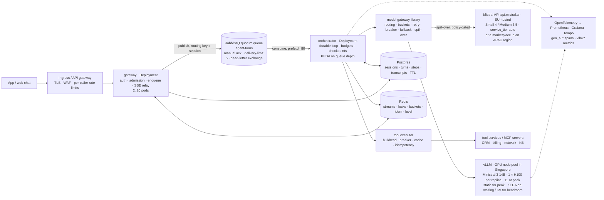

# Scaling Agentic Solutions on Mistral — a primer

*This primer explains how to size and deploy an agentic solution on Mistral models. The models run on Mistral's API (hosted) or on your own GPUs (self-hosted). The worked example is the support agent of a Singapore telco. The date of the fact check is 19 September 2026, and the sections have numbers so that you can use them in drills. The callouts are **Numbers** (anchors to keep in your head), **Verify** (facts that change) and **Pitfall** (the mistake that occurs most often in actual designs).*

> **How this differs from [the primer](../01-scaling-primer.md).** This is the primer of the Mistral provider. It is a rewrite, not a copy: the two primers share about a quarter of their lines. The thesis, the turn as the unit of work and the mechanisms of §5 are the same ideas, worked again. The new part is the second way to pay for tokens, which an open-weight model permits: your own vLLM fleet. This new part contains these topics:
>
> - the batch-dependent time per token (§1.3),
> - sovereignty as a dimension of scale (§1.8),
> - the replica, the fleet and the break-even GPU price (§3.5–3.6),
> - the vLLM and Kubernetes settings (§5.8),
> - Mistral's stack mapped to the mechanisms (§9).
>
> The anchor is a Singapore telco on Mistral's API, not an operator on Gemini. Thus the numbers are different. Read the base primer first. Read this primer for the decision between hosted and self-hosted.

The code and the notebooks are in this lab (`agentic-scaling-lab`). `python -m scalelab.mistral` calculates every number in this primer, or `scalelab/sim.py` measures it with `make_setup(mode, provider="mistral")`. The output of `python -m scalelab.mistral` is the Mistral section of [`03-capacity-plan.md`](../03-capacity-plan.md). Thus the numbers in the primer and in the code cannot become different.

The self-hosted throughput comes from the replica model of the lab, which starts from first principles (`scalelab/serving.py`). This throughput is an estimate until `vllm bench serve` replaces it on the target hardware. Notebook `05_hosted_or_own_gpus` works the comparison of hosted and self-hosted. Notebooks 01–04 work the rest on the Gemini anchor.

---

## 0. The thesis, and how a design review tests it

You scale an agent system with limits on its tokens, not with more servers. Pods, connections, queue depth and database throughput look like classic capacity problems. Everything of that type is small and low-cost next to one number: the tokens per minute at the model. The design work has three parts:

- Make the demand for that resource predictable (admission control, routing, caching, compaction).
- When the resource runs out, go down to a lower level of service, and do not collapse (degrade levels, the shed of turns, fallbacks, spill-over).
- Make every turn survive the failures that a long unit of work with side effects invites (checkpoints, idempotency, at-least-once delivery).

With Mistral, there are two ways to pay for those tokens. The selection between them is the spine of the design. On Mistral's API, the constraint is a rate limit. The rate limit has three units: requests per second, tokens per minute and tokens per month. It applies per model, and your whole organisation shares it. The price is per token: it is linear in volume, and it is zero when there is no traffic.

On your own GPUs, or on an in-country sovereign GPU cloud, the constraint is a fleet that you sized. The fleet runs open-weight models on vLLM. You pay for it by the GPU-hour, busy or not. Its latency depends on how much load you put on it.

The API is the default until sovereignty, latency control or customisation says otherwise. Part 3 gives the price of that "otherwise". The anchor scenario is a Singapore operator at 100,000 conversations a day. For this scenario, the API costs about $40 k a month. A fleet sized for the peak costs about $55 k on on-demand H100s, or approximately the price of the API on committed H100s. The fleet has the lower price only below about $4.95 a GPU-hour, so residency decides, not price.

A deployment design must answer four things:

- *Estimation*: from "100,000 conversations a day" to tokens, in-flight turns, GPUs and dollars, for the two ways to pay.
- *Trade-offs*: between hosted, self-hosted and hybrid, between models, and between GPU terms.
- *Robustness*: what breaks first, and what the user sees.
- *Judgement*: which mechanisms this workload needs at its scale. Also, what the organisation already runs that the design can use again (a Kubernetes platform, a GPU contract).

---

## 1. What is different about scaling agents

### 1.1 The unit of work is a turn, not a request

A web request is stateless, short and homogeneous. You scale it with more replicas, until the CPU is the limit. A turn of an agent is a *loop*. It has a model call that plans, tool calls that get or change something, and another model call that answers. Sometimes it has more calls.

The model decides the length of the turn at run time. The steps are sequential, and the middle steps have side effects in systems that you do not own. The context grows as the conversation continues.

| Property | Web request | ML inference request | Agent turn |
|---|---|---|---|
| Duration | 10–200 ms | 20–500 ms | 3–30 s, variable |
| Steps | 1 | 1 | 2–8, decided at run time |
| Binding resource | CPU / DB connections | GPU seconds | tokens per minute at a shared pool, or the batch that your own replicas can run at the latency that you promised |
| Cost driver | requests | requests | tokens × steps × context length, or GPU-hours sized for the peak |
| State | none or a row | none | a transcript that grows, plus checkpoints |
| Side effects | in your DB | none | in systems of record: CRM, billing, the ticket system |
| Failure unit | retry the request | retry the request | resume the *step*, and never repeat a write |

### 1.2 The binding constraint is model throughput — shared on the API, sized by you on a fleet

On Mistral's API, Mistral applies the limits per model. The limits have three units: requests per second, tokens per minute (input and output together) and tokens per month. The limits increase with the cumulative billing of the organisation. Only the console shows the numbers of the paid tiers. Above the top tier, you write to support. A 429 means that the traffic hit the limit, and Mistral documents no `Retry-After` header.

You share the limit with other projects. Thus another project in the same organisation can use the headroom that you planned on. Ask if the limit applies to the workspace or to the organisation, because the docs disagree. There is no self-service purchase: the capacity plan *is* the support request. The Priority Tier (`service_tier="auto"`, 1.75× list) holds the custom limits per model and the documented SLA.

On your own GPUs, the constraint is a fleet that you sized. A vLLM replica has a KV-cache budget, which sets the maximum number of sequences that it holds. It also has an HBM bandwidth, which sets the time of each decode step. No traffic from other users is in it, and nothing returns a 429. But nothing prevents an overload: by default, vLLM keeps requests in its queue for an unlimited time. The only sign of overload is that every user gets a slower response.

> **Numbers.** Free mode gives 1 RPS / 500 k TPM / 1 B tokens a month. Cumulative billing of $20 / $100 / $500 / $2,000 unlocks the paid tiers, which are console-only, and above the top tier you write to support. The Priority Tier costs ×1.75, with a 99.5 % SLA in the docs and 99.9 % on the AI Cloud page (verify). One H100 that runs Ministral 3 14B gives about 1,200 output tokens a second at 20 ms per token. 20 M TPM on the API is 333 k tokens a second.

### 1.3 Latency is a sum of sequential tails — and on your GPUs the time per token is the batch you run

A turn with two tool calls has four segments on the critical path: the plan call, the tools, the answer call and the streaming. Because the segments are sequential, the p95 of the turn is approximately the sum of their tails. Thus a tight target forces parallel tools, streaming, prefetch and a small model for the plan call.

Little's law connects latency to concurrency. At 20 turns a second, a 6-second turn gives 125 turns in flight, and a 10-second turn gives 208. Slowdowns *are* capacity problems.

On the API, TTFT and tokens per second are what Mistral's fleet gives you in that minute. On your own replica, they are arithmetic.

Each decode step moves the weights (15.7 GB for Ministral 3 14B in FP8) through the 3.35 TB/s of an H100. It also moves the KV cache of each sequence that runs (160 KiB per token). The result is about 10 ms per token at batch 1, 20 ms at 24 and 37 ms at 64. At the same batches, the aggregate throughput increases from 98 to 1,200 and 1,730 tokens a second. The latency that you want is the batch that you can afford.

### 1.4 Cost scales with context, and context grows

The bill is tokens, and the input is the largest part. A support turn sends 5 k tokens of prompt, tool schemas, customer context and history, and it receives 200 back. On Mistral Small 4 ($0.15 / $0.60 per million, cached input $0.015), the anchor call costs $0.000505 with the prefix cached. The 2,300 uncached input tokens are 68 % of that cost. On Medium 3.5 ($1.50 / $7.50 / $0.15), the same call is $0.005355, 10.6 times more. Thus, if you route 10 % of calls to Medium 3.5, they make 54 % of the bill of the planning mix.

Three levers change the cost by integer factors:

- Route the calls.
- Cache the stable prefix (10 % of the input price, 64-token blocks, `prompt_cache_key`).
- Put a limit on the context (compaction, tool-result truncation, output caps).

The order is important, because each later percentage applies to the new baseline. On a fleet, the same levers decrease the number of GPUs, not the dollars.

### 1.5 Side effects mean at-least-once, and at-least-once means idempotency

At some point in a turn, the agent opens a ticket or changes a plan. The process can stop after that action and before it records the action. These events can cause the stop:

- Kubernetes sends SIGTERM and waits for the termination grace period (30 s by default).
- A node drains.
- The provider reclaims a spot node.
- The model call times out.
- The queue delivers the message again.

RabbitMQ quorum queues give at-least-once delivery with manual acknowledgement, and nothing stronger. Thus the loop must be *replayable*:

- Write a checkpoint for every step before you act on it.
- Give every write a key made from the turn, the step and the arguments.
- Let the redelivery find the checkpoint and skip the work that is complete.

### 1.6 The feedback loop that kills agent systems, in two forms

The loop has these steps:

1. More load arrives.
2. The model becomes slower or pushes back.
3. Retries occur, and calls become longer.
4. Turns become longer.
5. More turns are in flight.
6. The model becomes slower again.

Without a brake, the system becomes slower for all users. Then the deadlines expire, and the users leave the conversation. But the system already used the tokens. On the API, the loop shows itself as a 429 storm. On a fleet, the loop is silent: vLLM never says no, and the batch grows. The time per token grows with the batch, and nothing in the error logs changes while the p50 doubles.

The load generator (`scalelab/sim.py`, notebook 05) reproduces the two forms (simulated). The simulated API pool has 3 M TPM. In it, 120 users with simple retries push the p95 turn to 39 s. The run has 394 rate-limit responses and 35 failed turns.

Degrade levels alone bring the p95 to 5.5 s. To do this, they move half the turns to Ministral 3 8B when the pool goes above 80 %. Degrade levels plus an in-flight cap of 26 give 3.3 s, zero 429s, and 22 % of the attempts shed with a `Retry-After`. The cap of 26 comes from the token budget of the pool.

On two Ministral 3 14B replicas, the same overload gives *zero errors and zero 429s*. The batch increases to 60 per replica. The p50 turn goes from 5.7 s to 12.3 s, and the p95 is 15.3 s. A cap of 53, from the batch budget of the fleet, gives a p95 of 8.8 s with 17 % shed. The hybrid (the fleet first, the API as spill-over, cap 79) gives 6.5 s, with 4 % shed and 30 % of calls on the API. A fast shed is better for the user than a slow queue.

### 1.7 Multi-agent multiplies everything

A coordinator with three specialists changes 2.2 model calls per turn into eight. It multiplies the cost by 3.6×, and it multiplies the latency by 2× although the specialists run in parallel. At 95 % per hop, the probability that every hop succeeds goes from $0.95^{2.2} \approx 0.89$ to $0.95^{8} \approx 0.66$. Thus the multi-agent question is never "how do I scale the coordinator". The question is "what measured problem justifies that multiple". Usually, the problem is a tool set that is too large for one context, or permissions that must be different for each step.

### 1.8 Sovereignty is a scaling dimension

By default, Mistral's global endpoint keeps data in the European Union. The regional endpoints `api.eu.mistral.ai` and `api.us.mistral.ai` (GA 11 August 2026, +10 %) keep it in Europe or in the US. The regional endpoints do not have Agents, Batch and Files. There is no APAC endpoint.

The marketplaces fill a part of the gap. On Amazon Bedrock, Large 3 and Ministral 3 (not Medium 3.5 or Small 4) are in Tokyo, Mumbai and Sydney, but not in Singapore. This is the result in the tables fetched on 19 September 2026. The Azure Foundry rows fetched for Large 3 and Medium 3.5 list Americas regions only. IBM watsonx has them in Sydney.

Two routes keep data in Singapore: your own GPUs (AWS p5, GCP a3 or Azure ND H200 v5 in-region) and an in-country sovereign GPU cloud. For the sovereign cloud, examine where each of its data centres is. The sites of a regional provider can be across the border (verify).

The licence is a second gate. Small 4, Large 3 and Ministral 3 are Apache 2.0. Medium 3.5 has a Modified MIT licence. Above $20 M of global monthly revenue, that licence makes a commercial licence necessary, and every telco in the region is above that revenue. Thus a self-hosted Medium 3.5 needs a commercial licence, which you negotiate with Mistral.

In Singapore, the driver is governance, not law. There is no general mandate for localisation. The MAS Guidelines on AI Risk Management (consulted November 2025 to January 2026) push regulated firms toward model-risk controls. The MAS AI Risk Management Toolkit (20 March 2026) also pushes them in that direction. The operator's own risk function changes "personal data stays in Singapore" into a requirement.

In other countries, the driver can be law, and the design must show it first. Indonesia and Vietnam localise some types of data, and Korea's AI Basic Act took effect on 22 January 2026.

> **Pitfall.** Do not end a technical conversation early with one of these two sentences:
>
> - "put it on Kubernetes with an HPA and autoscaling handles it". A pod autoscaler cannot make tokens, and a GPU node needs three to eight minutes to arrive.
> - "GPUs are cheaper than the API at scale", said without the GPU price and the utilisation that make it true or false.

---

## 2. The dimensions of scale — a checklist for discovery

Use this list in the first fifteen minutes of discovery. For each dimension, the list gives the question that changes the design, the number that you calculate and the lever to use.

| Dimension | Ask | Compute | Lever |
|---|---|---|---|
| Deployment path | Hosted global (EU-hosted)? Regional (EU/US, +10 %)? An APAC marketplace region? Your own GPUs? An in-country sovereign GPU cloud? A hybrid? | the paths that the data policy permits, the cost of each path | the decision itself, then the spill-over rules |
| Data policy | Which data can leave the country, or go to a shared API at all? Zero data retention? Which traffic carries no personal data? | the share of traffic eligible for the API | policy-gated spill-over, redaction, a fleet for the rest |
| Volume and burstiness | Conversations per day? Peak-to-average? What does an incident do? | conv/s, turns/s, calls/s at average, peak, incident | admission control, the rate-limit request or the fleet size, degrade levels for incidents |
| Turn shape | How many turns, calls and tool calls per turn? How many tokens in and out? Reasoning on or off? | tokens per turn, TPM, output tokens/s (the number that sizes the GPUs) | routing, caching, compaction, output caps, `reasoning_effort` |
| Latency budget | What must the user see, and when? Is 10 s with streamed progress better than 6 s? | TTFT and turn p95. On a fleet, the batch that meets the target. | streaming, parallel tools, prefetch, batch target, speculative decoding |
| Concurrency | Users at one time? Conversation length? | In-flight turns = turns/s × turn duration. Sessions = conv/s × conversation duration. | in-flight cap, per-pod concurrency |
| Model capacity | Which tier is the org on? What limit will Mistral grant? Which GPUs are available in-region, at what price and term? | demand against limit, output tokens/s against fleet, the GPU price against the break-even | the support request, the Priority Tier, the fleet size and GPU term |
| Model and licence | Which model for each step? Self-hostable (Apache 2.0 or Modified MIT)? Fits one GPU? | $/call by model, weights and KV per model | Small 4 by default, Medium 3.5 for escalation, Ministral 3 on the fleet |
| Tools and downstream | Which systems, their QPS limits and p95? Which calls have side effects? | tool calls/s per system against its limit | prefetch, caching, bulkheads, breakers, idempotency keys |
| State | What must survive a crash, a node loss, a region failure? Retention? | writes/s, rows per turn, retention | checkpoints in Postgres, hot state in Redis, TTLs |
| Tenancy and fairness | One brand or many? Priorities? | per-tenant turns/min, priority classes | per-tenant buckets, priority bypass, fairness ids at the inference gateway |

---

## 3. The arithmetic, worked

The anchor scenario is a fictional Singapore mobile operator, Meridian Mobile, with a support agent in its app. The assumptions are ordinary on purpose. The method must give a price for the two ways to pay.

### 3.1 Assumptions

| Assumption | Value |
|---|---|
| Conversations per day | 100,000 |
| Peak hour against daily average | 3× |
| Network-incident spike against average | 10× (an outage, and 75 % of intents are "no signal") |
| Turns per conversation | 6 |
| Model calls per turn | 2.2 (plan, answer, sometimes a third) |
| Tool calls per turn | 1.3 (0.7 CRM, 0.25 billing, the rest network status and knowledge base) |
| Input tokens per model call | 5,000, with 2,700 cached (a 3,000-token stable prefix, with a hit 90 % of the time) |
| Output tokens per model call | 200, reasoning off: ~60-token tool-call steps, ~300-token answers |
| Turn duration (p50), hosted | 6 s, with about 1 s of tool time. Users think for ~60 s between turns. |
| Hosted models | Small 4 (`mistral-small-2603`) for 90 % of calls. Medium 3.5 (`mistral-medium-3-5`) for the 10 % that escalate. Ministral 3 8B as the degrade model. |
| Hosted limit | 20 M TPM and 60 RPS on Small 4. The plan assumes that Mistral grants this limit (paid-tier numbers are console-only). |
| Self-hosted model | Ministral 3 14B (FP8, Apache 2.0) on vLLM 0.29, one H100 SXM 80 GB per replica. Target 20 ms per output token, a minimum of two replicas. |
| GPU price | AWS p5 on-demand, $6.88 per GPU-hour (the US list price, Singapore's price not confirmed, verify). The plan compares committed and neocloud prices. |
| Downstream limits | CRM 200 QPS, billing mainframe 40 QPS |
| Residency | customer personal data stays in Singapore (from the operator's risk function, which cites the MAS guidelines) |

### 3.2 Rates and tokens

| Quantity | Average | Peak | Incident |
|---|---:|---:|---:|
| Conversations / s | 1.16 | 3.47 | 11.6 |
| Turns / s | 6.94 | 20.8 | 69.4 |
| Model calls / s | 15.3 | 45.8 | 153 |
| Input tokens / min | 4.58 M | 13.75 M | 45.8 M |
| … of which uncached | 2.11 M | 6.33 M | 21.1 M |
| Output tokens / min | 183 k | 550 k | 1.83 M |
| Total TPM against the assumed 20 M limit | 0.24× | 0.72× | **2.38×** |
| Calls / s against the requested 60 RPS | 0.25× | 0.76× | **2.55×** |

Say the calculation out loud in four steps:

1. 100,000 ÷ 86,400 ≈ 1.16 conversations a second.
2. × 6 turns ≈ 7 turns a second.
3. × 2.2 calls ≈ 15 calls a second.
4. × 5,200 tokens × 60 ≈ 4.8 M tokens a minute.

The peak is 14.3 M, inside a 20 M limit. An incident is 47.7 M, two and a half times the limit in tokens and in requests. The peak needs a support ticket. You must *shape* the incident, because no tier makes 48 M TPM appear in a minute. The second reason is that no fleet sized for the peak carries 2.3 times the peak.

> **Verify.** Find out if cached tokens count at full weight against the TPM limit. The docs define the limit as input plus output, and they say nothing about cached tokens. Thus the lab counts cached tokens fully and treats relief as upside.
>
> Also examine the scope of the limit (workspace or organisation) and the absence of a `Retry-After` header. Cause a 429. Then read the headers.

### 3.3 Concurrency, from Little's law

$$
\text{In-flight turns} = \text{turns/s} \times \text{turn duration:}
$$

On the hosted path, 6.9 × 6 ≈ 42 at average, 125 at peak and 417 during an incident. Concurrent *sessions* are eleven times larger, because users think between turns. A conversation lasts 6 × (6 + 60) ≈ 400 s, which gives 460 / 1,400 / 4,600 sessions.

The token limit also puts a cap on concurrency. 20 M TPM ÷ 60 ≈ 333 k tokens/s. A turn uses 2.2 × 5,200 ≈ 11.4 k tokens over 6 s ≈ 1.9 k tokens/s. Thus the limit sustains about 175 turns in flight, or 29 turns per second. This is the start value for the in-flight cap of the admission controller (`AdmissionConfig.max_inflight` in `scalelab/admission.py`). It is above the peak demand and below the incident.

On the self-hosted path, the turn is longer (10 s at the batch selected in 3.5). Thus the in-flight turns are 69 / 208 / 692, and the cap comes from the fleet: 293 at peak.

### 3.4 Hosted: cost per conversation, and the rate-limit request

| Configuration | Per model call | Per conversation | Per month |
|---|---:|---:|---:|
| All Small 4, no caching | $0.00087 | $0.0115 | $34.9 k |
| All Small 4, prefix cached | $0.00051 | $0.0067 | $20.3 k |
| Planning mix: 90 % Small 4 + 10 % Medium 3.5, cached | $0.00099 | **$0.0131** | **$39.7 k** |
| Planning mix on the Priority Tier (×1.75) | — | $0.0229 | $69.6 k |
| Planning mix on an EU/US regional endpoint (×1.10) | — | $0.0144 | $43.7 k |
| All Large 3, cached | $0.00159 | $0.0209 | $63.6 k |
| All Medium 3.5, cached | $0.00536 | $0.0707 | $214.9 k |
| All Ministral 3 14B, cached | $0.00055 | $0.0073 | $22.2 k |

The calculation:

- A Small 4 call has 2,300 uncached input tokens at $0.15/M, 2,700 cached at $0.015/M and 200 output at $0.60/M.
- It costs $0.000345 + $0.00004 + $0.00012 ≈ $0.000505.
- Thirteen calls a conversation ≈ $0.0067.
- One call in ten on Medium 3.5 at $0.005355 doubles this to $0.0131.

Uncached input is two-thirds of a Small 4 call. Thus the prefix cache is worth more than any output cap. The 10 % escalation share is 54 % of the mix. Thus the routing rule for Medium 3.5 is the line in the prompt with the highest cost.

The other half of the hosted plan is the request. Peak demand with 30 % headroom is **60 requests per second, 19 M tokens per minute and 209 B tokens a month** on Small 4. This request goes in the ticket to Mistral support, with the model id and the daily curve. The free tier covers 10 % of the average TPM, and the paid tiers are console-only. Thus do these steps before the pilot ends: start pay-as-you-go on the operator's organisation, read the limits and send the ticket.

> **Verify.** The list prices on 19 September 2026:
>
> - Small 4: $0.15 / $0.60 / $0.015 cached.
> - Large 3: $0.50 / $1.50 / $0.05.
> - Medium 3.5: $1.50 / $7.50 / $0.15.
> - Ministral 3 14B / 8B / 3B: $0.20 / $0.15 / $0.10 flat.
> - Batch: −50 %.
> - Regional: +10 %.
> - Priority: ×1.75.
>
> The id `mistral-medium-3-5` is the form in the changelog. Do a check with `GET /v1/models`. Mistral does not publish the cache-write price and the cache lifetime.

### 3.5 Self-hosted: the replica, then the fleet

A vLLM replica is one copy of the weights across `tp` GPUs (`scalelab/serving.py`, estimates with explicit efficiency factors).

*Memory decides concurrency*. An H100 at vLLM's default `gpu_memory_utilization` 0.92 gives 73.6 GB. After 4 GB for activations and 15.7 GB of FP8 weights, 53.9 GB of KV cache stays. That is about 329 k tokens at 160 KiB each. With the 2,700-token prefix stored once, that is about 130 calls. Thus vLLM's default `max_num_seqs` of 128 is the limit that binds.

*Bandwidth decides the time per token*, as 1.3 showed. *Prefill decides TTFT*. 2,300 new tokens at two FLOPs per active parameter is 6.2 × 10¹³ FLOP. That is about 78 ms at 40 % of the H100's FP8 peak.

The batch that you run is the latency that you give *and* the fleet that you buy. Each row has the same inputs: Ministral 3 14B on one H100, a 5,200-token context and 200 output tokens. Each row also has 2.2 calls plus a second of tools per turn, and a fleet sized for the peak with 30 % headroom:

| Batch per replica | Time per token | Tokens/s per replica | Call | Turn | Replicas at peak | $/month, AWS on-demand |
|---:|---:|---:|---:|---:|---:|---:|
| 1 | 10.2 ms | 98 | 2.1 s | 5.7 s | 127 | $638 k |
| 4 | 11.5 ms | 348 | 2.4 s | 6.2 s | 36 | $181 k |
| 16 | 16.6 ms | 964 | 3.4 s | 8.5 s | 13 | $65 k |
| **24** | **20.0 ms** | **1,201** | **4.1 s** | **10.0 s** | **11** | **$55.2 k** |
| 64 | 36.9 ms | 1,733 | 7.5 s | 17.4 s | 7 | $35 k |

The row of the plan is batch 24. It gives 20 ms per token, 1,201 tokens a second per replica, a 4.1-second call and a 10-second turn, against 6 s on the API. The fleet needs 4 / 11 / 34 replicas at average, peak and incident, with one GPU each. `capacity.fleet()` takes the larger of the throughput-bound count and the concurrency-bound count, and adds the headroom. It never goes below two replicas, so a rollout or a node loss cannot make the fleet unavailable.

The fleet sized for the peak costs **$55,246 a month on AWS on-demand**, which is $0.0182 per conversation. On average, it is 28 % utilised, and it spends 0.16 GPU-minutes on a conversation. It can hold **293 turns in flight**, which is the self-hosted in-flight cap. Its cost is 1.39× the hosted planning mix.

These are the other open-weight models, also as estimates. Mistral Small 4 (119 B total, 6.5 B active, 121 GB FP8, tensor parallel 2 on the model card) runs on a pair of H100s. It has a 3.7 ms step at batch 1 and about 3,700 tokens a second at batch 128. Thus it needs 18 GPUs at the 20 ms target. For a 6-second turn, it needs 26, against 30–46 for Ministral. The reason is that a tight latency target gives an advantage to a low active-parameter count.

Medium 3.5 (134 GB FP8) is an eight-GPU replica plus a commercial licence. Large 3 (682 GB FP8) is eight H200s at about 3,900 tokens a second per node. The L40S has 864 GB/s. This bandwidth makes the step of a 14 B model 34 ms at batch 1, whatever the hourly price of the L40S.

> **Numbers.** KV per token, BF16: Ministral 3 14B 160 KiB, Small 4 22.5 KiB (MLA), Large 3 68.6 KiB (MLA), Medium 3.5 352 KiB. With FP8 KV, each value is half. FP8 weights: Ministral 14B 15.7 GB, Small 4 121 GB, Medium 3.5 134 GB, Large 3 682 GB. H100 SXM: 80 GB at 3.35 TB/s. H200: 141 GB at 4.8 TB/s.

### 3.6 The break-even, and the six-second tension

The two bills grow with volume. The API grows linearly at $0.0131 a conversation. The fleet grows in steps of one replica as the peak grows. Thus the break-even is not a volume but a GPU price. At 28 % average utilisation, the fleet spends 0.16 GPU-minutes on a conversation. Thus it costs less than the hosted planning mix when an H100-hour costs less than $0.0131 ÷ (0.16 ÷ 60) ≈ **$4.95**:

| GPU price | $ / GPU-hour | Peak fleet, $ / month | $ / conversation | against the hosted mix | Floor: conversations / day to amortise two replicas |
|---|---:|---:|---:|---:|---:|
| AWS on-demand | 6.88 | $55,246 | $0.0182 | 1.39× | 25 k |
| AWS capacity block (Tokyo/Sydney/Mumbai) | 4.72 | $37,902 | $0.0125 | 0.95× | 17 k |
| GCP 3-year commitment | 4.86 | $39,026 | $0.0128 | 0.98× | 18 k |
| Azure 3-year reservation | 5.40 | $43,362 | $0.0143 | 1.09× | 20 k |
| Neocloud | 3.75 | $30,112 | $0.0099 | 0.76× | 14 k |
| GCP on-demand | 11.06 | $88,812 | $0.0292 | 2.23× | 41 k |

Thus the fleet costs more on on-demand H100s (about $15.5 k a month more than the API). It is level on three-year commitments and APAC capacity blocks. The capacity-block prices are for Tokyo, Sydney and Mumbai, not Singapore. The fleet costs less on neocloud GPUs (about $9.6 k a month less).

Volume is important only at the bottom. The fleet never runs fewer than two replicas. Above about 14 k conversations a day at $3.75, 17 k at $4.72–4.86 and 25 k at $6.88, the volume amortises that floor. Above the floor, the price of the GPU-hour decides, not the size of the organisation.

The cost of the fleet does not decrease when the traffic decreases. Thus the hybrid is the self-hosted analogue of "provisioned throughput plus pay-as-you-go spill-over". The hybrid uses a fleet for the base load and the API for the peak hours. It increases the utilisation of the fleet, and with it the GPU price at which the fleet costs less. The condition is that the data policy lets the peak traffic leave.

The second tension is latency. The hosted turn is 6 s. The self-hosted turn of the plan is 10 s, because 20 ms times 200 tokens is four seconds a call. A 6-second turn on the fleet needs a step of about 11 ms. This replica gives that step only at a batch of three to five. That is 30–46 H100s at peak, not 11: three to four times the GPUs and $150–230 k a month on-demand.

There are three alternatives:

- Speculative decoding. Mistral publishes EAGLE drafts for Small 4, Medium 3.5 and Large 3. On Ministral, you can try n-gram or a draft model.
- A model with fewer active parameters (Small 4's 26 GPUs).
- Streaming, with a ten-second turn that you accept. With progress events, this alternative is the correct selection in many cases.

### 3.7 The rest of the estate

| Resource | Average | Peak | Incident | Limit / note |
|---|---:|---:|---:|---|
| Orchestrator pods (80 in-flight turns each, ×1.4 headroom, 6 s turns) | 1 | 3 | 8 | 2 / 4 / 13 at the fleet's 10 s turn. KEDA on queue depth. |
| Gateway pods (250 open streams each, and a stream stays open only during a turn) | 2 | 2 | 3 | min 2 for warm capacity |
| Postgres writes / s (≈ 6 per turn) | 42 | 125 | 417 | a small HA instance does thousands. Partition by day. |
| Redis ops / s (≈ 40 per turn) | 280 | 830 | 2,800 | one node does over 100 k/s |
| RabbitMQ messages / s | 7 | 21 | 69 | 5 KB each: small for a three-node quorum queue |
| Billing mainframe QPS | 1.7 | 5.2 | 17.4 | limit 40: sufficient, but cache the invoices all the same |
| CRM QPS | 4.9 | 14.6 | 48.6 | limit 200: prefetch at session start, and cache the profile |

The non-GPU estate is a few dozen vCPUs of pods plus a small Postgres, Redis and RabbitMQ. It is about 1 % of the model bill.

### 3.8 What breaks first

| Level | Resource | Demand against limit | Fix |
|---|---|---:|---|
| Incident | Hosted RPS limit (60) | 2.55× | shape demand (admission, degrade levels), ask for burst headroom |
| Incident | Hosted TPM limit (20 M) | 2.38× | shape demand, use a sibling model with its own limit, decrease the tokens per call |
| Incident | Self-hosted fleet sized for peak (13.2 k tokens/s) | 2.31× | shed at the cap, use spill-over for the traffic that can leave, give shorter answers |
| Incident | Billing mainframe | 0.43× | cache invoices for minutes, add a bulkhead, use a degrade level with cached answers |
| Incident | CRM | 0.24× | prefetch at session start, 5-minute profile cache |
| Incident | Redis, Postgres, RabbitMQ, orchestrator pods | < 0.05× | nothing |

At peak, everything fits (0.76× and 0.72× on the hosted limits, 0.69× on the fleet). Kubernetes and the orchestrator pods are not on the list on either path, because the model breaks first, in its two forms. The billing system, sized for people, breaks second.

---

## 4. The reference architecture

This is a turn from end to end. The ingress applies the WAF and a per-caller limit. Then the gateway does these steps:

1. It authenticates the caller.
2. It examines the tenant's bucket and the global in-flight cap.
3. It decides a degrade level.
4. It writes the turn row to Postgres.
5. It publishes to the `agent-turns` quorum queue, with the session id as the routing key.
6. It sends the event stream of the turn to the client over SSE, from a Redis stream.

An orchestrator pod consumes the message, takes the session lock and loads the steps that have checkpoints. Then it runs the loop under a budget:

1. A model call through the model gateway, with deltas streamed into Redis. The call goes to the fleet. When the fleet is at saturation and the policy permits it, the call goes to the API.
2. A checkpoint.
3. Tool calls in parallel.
4. A checkpoint.
5. Repeat, then finish.

Then the pod writes the transcript and publishes the terminal event. It decrements the in-flight gauge and acknowledges the message. Compaction runs after that, and it is still inside the pod.

### 4.1 Why it is shaped this way

*Gateway and orchestrator are separate Deployments* because they scale on different signals and fail in different ways. A streaming connection costs a coroutine and a few kilobytes. The loop costs tokens, tool calls and the memory of a full context.

*A queue sits between them, although the user waits,* because the queue does three things:

- It changes a burst into a backlog with one observable number: the age of the oldest turn that has not started.
- It gives at-least-once execution with redelivery.
- It lets the token bucket or the fleet's batch set the pace, not the ingress.

*Postgres holds the durable state and Redis the hot state* because their access patterns are opposite. Postgres gets a small number of row writes per turn, and these writes must survive anything. Redis gets thousands of sub-millisecond operations per second, and the system can lose these operations without harm.

*The model gateway is a library with two backends and a policy, not a service*. Its state fits in Redis and in vLLM's `/metrics`. The fleet and the API are two entries in its routing table. Thus hosted, self-hosted and hybrid are the same code with a different configuration. The model gateway becomes a service when many agents share one fleet. That is the job of an inference gateway in front of the GPUs.

*The GPU node pool is static, sized for the peak, with autoscaling only for headroom*. This is because a GPU node needs three to eight minutes to join, pull the image and load the weights, and the incident arrives faster. KEDA on `vllm:num_requests_waiting` and `vllm:kv_cache_usage_perc` is for the slow tail of a peak, not for the cliff.

### 4.2 Alternatives and when to choose them

Plain vLLM Deployments behind a Service (this design) are correct up to about ten replicas of a single-GPU model. Every setting is visible, and the gateway does the admission. They do not have cache-aware routing, a prefill/decode split or priority at the GPU. With the Gateway API Inference Extension, llm-d or KServe's `LLMInferenceService` add these features:

- KV-cache-aware routing.
- Prefill/decode disaggregation.
- `InferencePool` and `InferenceObjective` priority.
- The Workload Variant Autoscaler.

The cost is more components and an alpha flow-control feature (llm-d v0.9.0 and the extension's v1.5.0, with inferred release years, verify).

NVIDIA NIM containers are applicable for a team that wants a supported, profiled container under NVIDIA AI Enterprise ($1 per GPU-hour or $4,500 per GPU-year). But H100 is not in Small 4's profile matrix, and the Large 3 NIM has an end-of-support flag.

Mistral's Agents & Conversations API and the Temporal-based AI Studio Agent Runtime run the loop for you on the hosted path. They have handoffs, built-in tools and MCP Connectors (public preview). But they are not on regional endpoints, they have a `client.beta.*` label, and they do not have Ministral 3. They also give less control over budgets and checkpoints.

Kafka, NATS JetStream or a cloud's managed queue can replace RabbitMQ. Kafka has no per-message nack or dead-lettering, so you build the retry topic. A single-cloud deployment can replace the estate with the managed pieces of that cloud. The *mechanisms* in Part 5 are the same in every case, and only the place where you configure them is different. The Kubernetes shape is the shape that a platform team can use again across workloads and clouds.

---

## 5. The scaling mechanisms

### 5.1 Quota strategy on the API, capacity strategy on the fleet

On the API, you shape the demand before it reaches the limit, in three layers.

1. An in-flight cap at the gateway (5.3) sets the maximum number of turns that make tokens at one time.
2. A token bucket per model in the model gateway (`TokenBucket` in `scalelab/resilience.py`) spreads calls within each second. At the incident, the requests-per-second limit binds first. The rate of the bucket is *your share* of the granted limit. Its capacity is about six seconds of refill. When there is more than one pod, the bucket is a Lua script in Redis.
3. You select the endpoint and the tier for each call:
   - the global endpoint, unless the data policy says EU or US,
   - the Priority Tier, for traffic that must not wait in a queue. With `service_tier="auto"`, the API changes to the standard tier when the Priority Tier runs out, and the response reports `service_tier`.
   - the Batch API at half price, with a 24-hour default `timeout_hours`, for offline work only.

The paperwork half is also part of the plan. Tiers unlock on cumulative billing. Thus a new organisation starts in free mode at 1 RPS, and it goes up only when it spends money. Send the request of the plan to support as soon as you know the shape of the pilot. If the service needs an SLA, add a Priority Tier entitlement.

Set the workspace spending cap (none by default) above the plan, with a margin. This is because a cap that trips suspends the API access of the workspace until the month ends.

On the fleet, the strategy is the opposite. You buy the capacity in advance: eleven H100s for the peak, on committed terms if the organisation can commit. The reason is that the 3–8-minute cold start is longer than the time an incident needs to arrive. KEDA on `vllm:num_requests_waiting` and `vllm:kv_cache_usage_perc` (0.8), with a long cooldown, covers the slow tail of a peak. For `vllm:num_requests_waiting`, it uses about 5 per replica, with `sum()` and an `AverageValue` target, so the threshold grows with the fleet. Pre-scale before known events.

The API is the part that changes fast. Spill-over (5.2) is the burst capacity of the fleet. You buy it by the token, and the policy sets its limits.

> **Numbers.** Prompt caching: 64-token blocks, 10 % of the input price, `prompt_cache_key`, hits in `usage.prompt_tokens_details.cached_tokens`, with no guarantee. Batch: −50 %, `timeout_hours` default 24, up to 1 M requests per file (100 k on the known-limitations page, so the pages disagree). Cold start: 3–8 min. A 121 GB Small 4 checkpoint streams in about a minute at 2 GiB/s, and Large 3's 682 GB in about six.

### 5.2 Retries, jitter, breakers, fallbacks, spill-over

By default, the `mistralai` SDK (2.10.1, 15 September 2026) does **not** retry. With a `RetryConfig`, it retries 429 and 5xx. Its default timeout is 300 s.

Keep the retries of the SDK off. Retry in the model gateway (`call_with_retries` in `scalelab/resilience.py`), so that one place decides. These are its rules:

- Exponential backoff from 0.5 s to a cap of 8 s, with *full* jitter. Full jitter is a uniform draw between zero and the backoff. Jitter is necessary because, when a shared limit throttles, every client sees the 429 at the same moment. Without jitter, every client retries at the same moment.
- If a `Retry-After` arrives, obey it, with jitter on top (Mistral documents none).
- At most four attempts.
- Never past the deadline of the turn.

Set the per-call timeout to about 30 s. The 300-second default hides a hung stream for five minutes, against a 45 s turn budget.

Two kinds of pushback arrive, and the gateway treats them the same (`RateLimited` and its subclass `ServerOverloaded` in `scalelab/model.py`):

- The API's **429**, when the traffic hits the shared limit.
- vLLM's **503**, when you set `--max-num-queued-reqs` or `--max-num-queued-tokens` and the queue is full. Without those flags, vLLM keeps requests in its queue without limit and never says no.

Both count toward the pushback ratio, which sets the degrade level. A 400 that says that the context overflowed goes to compaction, not to a retry.

There is a circuit breaker per model and per tool (`CircuitBreaker`). Five failures in a 30-second window open it for 15 s. Then it lets one probe through. It is more important for agents than for web services. The reason is that a sick dependency holds hundreds of coroutines *with their contexts in memory* until the deadline.

When a breaker opens, or two consecutive pushbacks arrive, the gateway moves to a *sibling* with its own limit or pool:

- On the API, Small 4 moves to Ministral 3 8B.
- Medium 3.5 escalations go back to Small 4.
- On the fleet, the sibling is the API itself.

Model ids are in the configuration, never in the code. This is also how you survive a deprecation. Mistral deprecated Magistral, Devstral, Pixtral and Medium 3.1 together on 22 May 2026, with no published notice period.

Spill-over is the fallback that is also a capacity strategy. The model gateway (`HybridBackend`) sends a call to the API when the saturation of the fleet goes above 0.9. Saturation is the sequences that run plus the sequences that wait, against the batch at which the fleet meets its latency target. The gateway records which backend served each call. In the lab's hybrid overload run, the API served 30 % of calls.

The gate is policy. A turn is eligible when its traffic carries no personal data (the incident bulletin, a generic plan question, a knowledge-base lookup on redacted text). All other traffic waits for the fleet, or the gateway sheds it. That rule lets you size a fleet for the base load in a residency-bound deployment. The operator's risk function signs the rule, so write it with them.

> **Pitfall.** Do not say "We use the SDK's retries" without a deadline, or "vLLM will tell us when it's overloaded" without `--max-num-queued-reqs`. The first retries into a turn that already timed out for the user. The second waits for a signal that never comes.

### 5.3 Admission control and graceful degradation

Admission control is the brake on the feedback loop of 1.6, in its two forms. It sits at the gateway, before a turn costs anything. It asks three questions in this order:

1. Is this tenant within its budget?
2. What is the degrade level of the system?
3. If the gateway admits this turn, does the number of in-flight turns go above the in-flight cap?

The cap starts at the number from the capacity plan. That is 175 turns from the 20 M TPM limit, and 293 from the eleven-replica fleet at batch 24. You then adjust it from load tests. Priority classes (an agent-assist console, a VIP tier) bypass it.

`AdmissionController.compute_level` in `scalelab/admission.py` calculates the degrade level from signals that every pod can publish:

- the in-flight turns,
- the age of the oldest turn in the queue,
- the share of model calls pushed back in the last minute,
- the state of each breaker (open or not),
- the *saturation* of the backend.

The controller writes the level to Redis, so every pod goes to the same degrade level at the same time. The fleet needs the saturation signal, and the API does not. Saturation is KV-cache usage plus the queue. The Gateway API Inference Extension's saturation detector reads the same two quantities, with defaults of a queue depth of 5 and KV utilisation of 0.8. Each level buys capacity, and the price is that the level gives something up:

| Level | Trigger | What changes | Effect in the lab's runs |
|---|---|---|---|
| 0 | normal | — | Small 4 on the API, batch at or under the target on the fleet |
| 1 | in-flight ≥ 80 % of cap, queue age ≥ 10 s, pushback ratio ≥ 5 %, or saturation ≥ 0.8 | Ministral 3 8B with a shorter cap on the API, shorter answers on the fleet, optional tools withheld | hosted p95 from 39 s to 5.5 s |
| 2 | a breaker open, pushback ratio ≥ 15 %, or saturation ≥ 1.0 (a queue exists) | the lowest-cost model, no writes and no slow tools (`get_invoice` withheld), a canned incident answer | the billing mainframe untouched during an outage |
| 3 | in-flight ≥ cap, or queue age ≥ 30 s | shed everything below priority 2 with 503 and a `Retry-After` that grows with the level (20 s at level 3) | bounded latency for admitted turns: 3.3 s hosted, 8.8 s on two replicas |

Two details make the difference between an implementation that works and a diagram:

- Levels 1 and 2 need hysteresis (the lab holds a raised level for 15 s), or the level flaps. Level 3 uses the instantaneous cap, because it must switch off at the moment the turns drain.
- The *client* must add jitter to `Retry-After`, or every shed user returns at the same time.

### 5.4 Durable execution

The loop (`run_turn` in `scalelab/loop.py`) writes a checkpoint for every step in Postgres *before* it acts on the result. After the model call, the checkpoint holds the model's response, and after the tool step, it holds the compacted tool results. On redelivery, the orchestrator replays from the checkpoint. The tool executor gives every write a key. The key comes from the turn, the step, the call index and the tool name (plus a hash of the arguments in production). The executor keeps the result under that key in Redis for a day.

Thus a redelivered turn that already opened a ticket gets the same ticket back. The lab's crash test (notebook 02) stops the process immediately after the checkpoint of the ticket. It shows one ticket after redelivery.

The queue contract is the other half. `agent-turns` is a quorum queue. Consumers acknowledge manually, with prefetch set to the concurrency of the pod (80). The orchestrator acknowledges every *terminal* outcome, and a graceful failure is a terminal outcome too. A turn that ended with "a colleague will follow up" must not get a redelivery, because a redelivery gives a second bill. The orchestrator rejects with requeue only for transient infrastructure trouble.

The delivery limit (`x-delivery-limit`, explicitly 5) sends a message that fails again and again to the dead-letter exchange. Examine the default of your RabbitMQ version. The queue of the dead-letter exchange has its own alert and replay tools. The consumer timeout (30 minutes by default) is the ceiling for one delivery. The 45 s turn budget is far below it.

The order of turns in a session comes from the routing key and from a session lock in Redis. The lock has the turn id as its value and a TTL of the budget plus a margin. In Postgres, `steps` rows have a unique constraint on (turn, index), so a replayed step is an idempotent insert.

### 5.5 Context engineering for scale

The layout of the prompt is for the cache:

1. System instructions, policies and tool schemas first, byte-identical for every user and turn.
2. Then the prefetched profile.
3. Then a summary of older turns.
4. Then the last N messages, verbatim.
5. Then the new message.

On the API, the same `prompt_cache_key` goes on every request that shares the prefix. Caching works in 64-token blocks. A hit costs 10 % of the input price, and `usage.prompt_tokens_details.cached_tokens` reports it. The docs say that a key increases the chance of a hit, but does not guarantee one. The docs publish neither the lifetime of the cache nor a write price.

Thus the prompt *version* is part of the key. The ratio of cached tokens to prompt tokens is a metric with an alert. The reason is that the anchor's 2,700 cached tokens are the difference between $0.0115 and $0.0067 a conversation.

On the fleet, vLLM's prefix caching is on by default. The hit rate is `vllm:prefix_cache_hits_total` over `vllm:prefix_cache_queries_total`. A replica gets a hit only on prefixes that it saw before. Thus cache-aware routing is important at more than a few replicas.

Compaction keeps the input bounded. When the pending history goes above a token threshold, the low-cost model summarises everything except the verbatim tail. It does this *after* the turn is complete. The anchor's 5,000-token call assumes compaction, and without it each turn adds 400 to 800 tokens. Thus the call of the twelfth turn is two to three times the call of the first, and the cost increases by the same factor. On a fleet, the KV per call grows, and the batch becomes smaller.

Set an output cap for each task, and set reasoning for each task with `reasoning_effort`. Set reasoning off for routing, extraction and support answers. Set it on only where a measured problem needs it. This is because Mistral bills reasoning tokens as output, at four to five times the input price. On a fleet, they are decode steps that the whole batch pays for.

### 5.6 Tools at scale

The tools are usually the real bottleneck. The reason is that their owners sized the systems behind them for people. The executor (`execute_tool` and `Tools` in `scalelab/loop.py` and `scalelab/tools.py`) applies these steps, in this order:

1. A bulkhead (a semaphore per tool per pod).
2. A circuit breaker per tool.
3. A result cache for pure reads (profile five minutes, invoice two, network status thirty seconds).
4. The idempotency check for writes.
5. A timeout.
6. One retry, for idempotent reads only.

Failures come back to the model as *structured data* (`{"error": "billing: rate limited"}`), never as exceptions that abort the turn. This is because the model can usually give an answer without the missing fact. Also, an aborted turn is the outcome with the highest cost of all.

Two habits remove most tool latency from the critical path:

- Prefetch the profile of the customer when the session starts.
- Let the model send independent calls in one step, so that they run concurrently. On the API, `parallel_tool_calls` is true by default. vLLM needs `--enable-auto-tool-choice --tool-call-parser mistral`.

Tool services run as their own Deployments, with their own service accounts and network policies. An MCP server over the same tools makes discovery standard, at the cost of a hop. On the hosted path, Mistral's Connectors (public preview) register any MCP server as a tool for Agents. Mistral's built-in tools (web search $30 per thousand calls, code execution $30) are only on the Agents API, not on regional endpoints.

### 5.7 Streaming and connections

SSE over HTTP/1.1 chunked transfer is the correct transport for a chat agent behind a Kubernetes ingress. It goes through every proxy, and it permits a resume with `Last-Event-ID`. An ingress idle timeout cuts the connection. An NGINX ingress reads for 60 s by default, so the relay sends a keep-alive comment every 15 s.

A rollout of the gateway also cuts the connection. When either event cuts the connection, clients reconnect with the last sequence id, and the relay serves from the Redis stream, not from memory. Mistral closes an idle stream after ten minutes.

The time-to-first-token that the user sees comes after the plan, the tools and the answer. On the fleet, the first answer token comes at about 2.5 s and the last at about 6.5 s. Thus a TTFT SLO of two seconds is possible only if you send *progress* events ("checking your invoice…") from the tool steps. The event stream already carries these events.

### 5.8 vLLM and Kubernetes settings that matter

| Setting | Value for the anchor | Why |
|---|---|---|
| `--max-num-seqs` | 32 on the Ministral 14B replica (default 128) | puts a cap on the batch, and thus on the time per token. Above it, the latency becomes worse with no signal. |
| `--max-model-len` | 32,768 (default 262,144) | frees the KV memory reserved for contexts that never occur |
| `--max-num-batched-tokens` | 16,384 (the API-server default since 0.28) | the chunked-prefill budget per step. A smaller value is better for inter-token latency, and a larger value is better for TTFT. |
| `--gpu-memory-utilization` | 0.92 (the default). Mistral's Small 4 and Medium 3.5 cards use 0.8. | headroom for activations. If the value is too high, a long prompt stops the pod. |
| `--kv-cache-dtype fp8` | on, after an evaluation on your own transcripts | makes the KV bytes half: two times the resident sequences, a lighter step |
| `--max-num-queued-reqs` / `--max-num-queued-tokens` | about 2 × `max_num_seqs` / a few × 16 k | new in 0.29: a 503 when the queue is full. Both have no limit by default, and that is the silent collapse. |
| `--tensor-parallel-size` | 1 for Ministral 3 14B, 2 for Small 4, 8 for Medium 3.5 and Large 3 | the GPU count of the replica inside one node. A node loss takes the whole replica. |
| `--speculative-config` | EAGLE drafts published for Small 4, Medium 3.5 and Large 3 (`num_speculative_tokens` 3). On Ministral, try n-gram or a draft model. | a lower time per token at the same batch. This is the route to a six-second turn without four times the GPUs. |
| Weight loading | `--load-format runai_streamer` or a node-local NVMe cache, `--kv-cache-memory-bytes` to skip profiling, the weight-load and tool-parser flags from each model card | 15.7 GB streams in about 30 s, and 121 GB in about a minute at 2 GiB/s. Often, the image pull is the slowest part of the 3–8-minute cold start. |
| KEDA | vLLM: `sum(vllm:num_requests_waiting)` at an `AverageValue` of 5 and `vllm:kv_cache_usage_perc` at 0.8. Poll 15 s, cooldown 300–360 s. Min = the peak fleet (11), max = the incident (34). Orchestrator: queue length, about 40 messages per pod. | headroom only. Static capacity carries the peak, because a replica needs minutes to appear. |
| GPU node pool and pods | static nodes for the peak on reserved or capacity-block terms. One replica per GPU, with `nvidia.com/gpu` requests equal to limits. vLLM pods with 4–8 vCPU, and memory of at least the weights again. Orchestrator: 2 vCPU / 2 GiB at concurrency 80. | no time-slicing (no memory isolation) and no MIG (no slice holds a 14 B model with useful KV) |
| PodDisruptionBudget, rollout, termination | vLLM `minAvailable` = peak fleet − 1. `maxSurge` 1 needs a spare GPU. Grace 60 s on the orchestrator, 30 s on vLLM with requests drained. | A drain must never take two replicas. A rollout of eleven takes an hour, unless there is a spare. |

`--max-num-seqs` and the replica count set the latency of the fleet, not a percentage on an autoscaler. The values in the table come from the load test in notebook 05 (simulated). Calculate them again from `vllm bench serve` on the real hardware.

### 5.9 State stores

- Postgres holds the durable rows (sessions, turns, step checkpoints, transcripts). It is a small highly-available instance with a synchronous replica and point-in-time recovery. It has day-partitioned tables and a retention job that drops partitions.
- Redis holds the hot state. It holds streams for the event relay, session locks (`SET NX PX`), the Lua token buckets and idempotency markers (`SET NX EX`, 24 h). It also holds the degrade level and the in-flight gauge. One node does over 100 k operations a second, against 2,800 at the incident. A failover costs some reconnects and loses no turn.
- RabbitMQ is a three-node quorum queue. Its one dashboard number is the age of the oldest message.
- Retrieval sits beside these stores: `pgvector` in the same Postgres. It uses Mistral Embed, or a self-hosted embedding model when the knowledge base itself must not leave.

### 5.10 Observability and SLOs

Record one trace per turn, with a span per model call and per tool call. The span attributes come from the OpenTelemetry GenAI semantic conventions: `gen_ai.operation.name`, `gen_ai.provider.name`, `gen_ai.request.model`, `gen_ai.usage.input_tokens` and `output_tokens`, `gen_ai.conversation.id`. These conventions still have "Development" status, so keep the names in one place. Also record the backend that served the call, the `service_tier` reported, the cached tokens and the degrade level.

Use metrics with low-cardinality labels only (model, backend, tool, tenant, outcome, level). Never use session or turn ids as labels. The metrics are these:

- tokens by kind, cost, latency and TTFT histograms,
- pushback ratio, breaker state, in-flight turns, queue age,
- shed count by reason, spill-over share.

The fleet adds vLLM's `/metrics`:

- `vllm:num_requests_running` and `vllm:num_requests_waiting`, `vllm:kv_cache_usage_perc`,
- the `vllm:time_to_first_token_seconds`, `vllm:inter_token_latency_seconds` and `vllm:e2e_request_latency_seconds` histograms,
- `vllm:prefix_cache_hits_total` and `vllm:num_preemptions_total`.

GPU utilisation from DCGM is a poor signal, because a replica at batch 2 shows as busy. Thus the dashboards use the queue and the KV usage. Do a check of the `_total` suffixes on a live scrape.

The SLIs:

- availability (turns that ended with an answer, over turns admitted),
- shed rate,
- latency attainment (turns under 8 s on the API and 12 s on the fleet, and the first *progress* event under 2.5 s),
- cost per conversation on the API, and tokens per GPU-hour on the fleet,
- in a residency-bound deployment, the API's share of calls, because a spill-over policy that leaks is a compliance incident.

The alerts:

- queue oldest-message age above 30 s,
- dead-letter queue above zero,
- pushback ratio above 5 %,
- degrade level at 2 or higher for minutes,
- `vllm:num_requests_waiting` above 5 per replica, or KV usage above 0.9, for five minutes,
- the cached-token share below 80 % of its baseline,
- the API share above the policy's ceiling,
- cost per conversation more than 30 % above its seven-day baseline. This alert catches the runaway loop before finance finds it.

### 5.11 Multi-agent designs and budgets

Every turn has a budget with four independent dimensions: steps, tokens, dollars and a wall-clock deadline. The lab's `Budget` is 6 steps, 40,000 tokens, $0.25 and 45 s. The reason is that each dimension fails in a different way:

- Tool thrash uses steps.
- A long transcript uses tokens.
- A Medium 3.5 escalation uses money.
- A slow mainframe uses time while the user watches a spinner.

A turn that uses all of a budget ends *gracefully*, with a message and a terminal event. It gets no retry.

In multi-agent topologies, the budget is hierarchical. The budget of the coordinator bounds the sum of the budgets of the specialists. The calls of the specialists go through the same gateway and buckets, so fan-out cannot escape admission control. Mistral's Agents API has handoffs between agents. They are convenient, and they are also a way to lose sight of the budget. Thus the caller still applies the deadline and the cost limit of the coordinator.

A measured problem justifies a specialist. The design must say which metric starts the split.

### 5.12 Tenancy, priority, regions

Use per-tenant buckets at the gateway and tenant labels on every metric and cost record. Put a priority field on the turn. It bypasses the in-flight cap for the classes that the gateway must never shed. On a fleet behind the inference extension, the same ideas exist at the GPU (a fairness id and an `InferenceObjective` priority).

The regions are where the two halves are most different. The fleet is in Singapore. It has node pools across two availability zones, and a replica count that still covers the peak when the fleet loses one replica. A disaster-recovery site outside the country is a data-policy decision before it is an infrastructure decision. Examples are Johor or Batam on a regional GPU cloud, or Sydney on a hyperscaler.

The API half is what the policy permits:

- the global endpoint, for traffic without personal data,
- a regional endpoint, only for deployments whose policy says Europe or the US,
- a marketplace region, for deployments whose policy says "in the region" and not "in the country". Examples are Bedrock's Sydney, Tokyo and Mumbai for Large 3 and Ministral 3, and watsonx in Sydney.

The API does not replace the design for availability. On 19 September 2026, the 90-day uptime on the status page showed the Completion API at 99.49 %. Thus the fleet-first hybrid is the shape for a three-nines target.

> **Verify.** Examine these four items:
>
> - Bedrock's region table for Mistral models. Singapore was absent on 19 September 2026, and cross-region inference profiles can change the picture.
> - Azure Foundry's APAC rows for Large 3 and Medium 3.5 (Americas-only in the fetched table).
> - The watsonx regions.
> - The model list of the regional endpoints (`models.list` against `api.eu.mistral.ai`).

---

## 6. Failure catalogue

| Failure | Symptom | Mechanism that catches it | Mitigation |
|---|---|---|---|
| 429 storm on the API | pushback ratio increases, turns become longer, in-flight grows | bucket waits, breaker, degrade level 1–2 | second-level smoothing, sibling model, the rate-limit ticket, shed at level 3 |
| Silent latency collapse on the fleet | p50 from 6 s to 12 s, nothing "fails", batch at `max_num_seqs` | saturation signal, in-flight cap, `--max-num-queued-reqs` with a 503 | put a cap on the batch, shed fast, use spill-over for the traffic that can leave |
| KV preemption and recompute | `vllm:num_preemptions_total` increases, TTFT spikes | KV usage alert | decrease `--max-num-seqs` or `--max-model-len`, FP8 KV, more tensor parallel |
| A node loss takes a replica | a TP=2 replica disappears with its node during a peak | PodDisruptionBudget, N+1 capacity | spare capacity in the peak count, nodes across zones, spill-over |
| Cold start during a peak | KEDA scales out, and the replica arrives eight minutes later | static capacity for the peak | pre-scale before known events, weight streaming, never scale the primary pool to zero |
| Spill-over leaks data that it must not leak | API share above the policy ceiling, a turn with personal data served by the API | per-turn eligibility flag, API-share SLI, audit on the trace | policy gate in the model gateway, redaction, the rule written with the risk function |
| Model id deprecated | 4xx on a pinned id, or a `-latest` alias that changes behaviour | model ids in config, sibling fallback | pin dated ids, watch the changelog. There is no published notice period. |
| Regional endpoint feature gap | Agents, Batch or Files fail on `api.eu.` / `api.us.`, or a model is not available in the region | integration tests per endpoint | function calling only on regional endpoints. Run Batch and Agents against global, with data that can go there. |
| Rate-limit ticket not granted before launch | the production org is at a lower tier than the pilot org | launch checklist | start pay-as-you-go early, read the console limits, send the request early |
| Tool thrash / runaway loop | many steps, same tool, same arguments | step and cost budgets | structured tool errors, step cap, cost alert |
| Context overflow | tokens per call increase turn over turn, 400 from the model | compaction threshold, output caps | compaction, tool-result truncation |
| Double side effect | two tickets for one complaint | idempotency keys on writes, checkpoint before act | replay from checkpoint, marker store with 24 h TTL |
| Incident mix shift | 75 % "no signal" intents, CRM overloaded | degrade level 2 with the cached incident answer | prefetch, caches, canned bulletin, spill-over of the bulletin traffic |
| GPU capacity unavailable in-region | the node pool cannot get to its count | capacity reservation, scale-out alert | reserved capacity or capacity blocks, the API as the burst, an in-country sovereign GPU cloud as the second source |

---

## 7. The growth path

| Stage | Conversations/day | What you need | What you can skip |
|---|---:|---|---|
| Pilot on the API | ≤ 1,000 | One service, a synchronous loop, budgets, structured tool errors, traces, `prompt_cache_key` and pinned model ids. Pay-as-you-go on the operator's own organisation, so that the tiers start to go up. | queue, Redis, admission control, GPUs, the Priority Tier |
| Production v1 on the API | 1,000–20,000 | the gateway/orchestrator split, RabbitMQ, Postgres checkpoints, idempotency, the SSE relay, per-turn budgets, dashboards, the rate-limit ticket | the fleet (below the two-replica floor of 14–25 k a day, the volume does not amortise it), multi-region, per-tenant quotas |
| Scale: the decision point | 20,000–200,000 | Admission control with degrade levels, second-level smoothing, sibling fallbacks, compaction and caching. The hosted/self-hosted arithmetic on the operator's own numbers (the fleet costs less below about $4.95 per GPU-hour). Then a negotiated limit plus the Priority Tier, or committed GPUs in-region with policy-gated spill-over. | llm-d or KServe until the fleet goes above about ten replicas |
| Sovereign and enterprise | > 200,000, multi-brand, hard residency | A fleet sized for the peak in-country, on committed terms. An inference gateway with cache-aware routing and priority. Per-tenant quotas and cost allocation. A second availability zone. A custom model when the measured problem is quality in the workload's domain or languages. | — |

The order of adoption is important:

1. Durability before admission control.
2. Admission control before any capacity purchase.
3. A capacity purchase (the ticket or the GPUs) before a second region.

A measurement starts each stage, and the design must name it:

- the queue, when the peak-hour p95 goes above the budget,
- the rate-limit request, when the traffic shape of the pilot is stable,
- GPUs, when the residency policy says that the data must not leave. GPUs are also correct when your GPU price is under the break-even and the volume goes above the two-replica floor.
- a second zone, when the availability target says so.

Custom models come late and for a different reason. Forge is Mistral's custom-model service, dated 17 March 2026 (verify), and it is for quality. An example is a Singapore agent that must work in Singlish, Malay and Tamil. Another example is a domain vocabulary where the base model makes errors. Forge changes the fleet arithmetic in one way only. You must self-host a custom model or run it on Mistral's dedicated deployments, so its GPUs are in the plan from the start.

---

## 8. Walking the design in a review

### 8.1 A 45-minute review: size it, cost it, choose the path

| Minutes | Move |
|---|---|
| 0–3 | Say the goal again. Name the unit of work (the turn) and the binding constraint (tokens per minute). Name the decision to make (which way to pay for the tokens). |
| 3–12 | Do the discovery (Part 2), with the data policy first. Find what can leave the country, what can go to a shared API, and what the risk function signed. Then find the volume, the peak ratio, the incident behaviour, the turn shape and the latency target. |
| 12–20 | Do the arithmetic (Part 3) in this sequence. Start with rates, tokens, Little's law and the rate-limit request. Then do the cost per conversation, the replica table, the fleet and the break-even GPU price. Show both columns, side by side. |
| 20–28 | Show the path: hosted, self-hosted or hybrid, with the monthly number next to each. Show what the organisation already has (a Kubernetes platform, a GPU price and term, a sovereign-cloud contract). Show the licence for the escalation model. |
| 28–36 | Show the architecture (Part 4), with the specifics in each box. Say which parts are routine and which are hard. |
| 36–41 | Do two deep dives, selected by risk. Usually, one is admission and degradation with the spill-over policy. The other is the vLLM and Kubernetes settings, or durable execution. |
| 41–44 | Show the failure modes, the growth path, the week-one measurements and the "not in v1" list. |
| 44–45 | Give the decision and its price. Name the one thing to validate first, with a date: `vllm bench serve` on the target GPUs, or a load test against the granted limit. |

### 8.2 Questions that change the design

- "Which data may leave Singapore, and which may reach a shared API at all?" (the path, and the spill-over rule).
- "Is ten seconds with progress events acceptable, or is six seconds a contract?" (the batch target. If six seconds is a contract, the fleet needs three to four times the GPUs.)
- "What is the daily volume?" (the volume amortises the two-replica floor above 14–25 k a day. Above that, the GPU price decides.)
- "What does an H100-hour cost you, and on what term?" (under about $4.95, the fleet costs less than the API. At $6.88 on-demand, it costs $15.5 k a month more.)
- "Do you want Medium 3.5 on your own GPUs?" (a commercial licence and an eight-GPU replica).
- "Which organisation holds the Mistral keys, and which tier is it on?" (other projects share the limit, and its numbers are console-only).
- "Do you need an SLA?" (the Priority Tier at +75 %, or the fleet).
- "What happens to traffic during an outage?" (the incident factor, and the traffic that can spill over).
- "Which downstream system has the lowest QPS ceiling?" (bulkheads, caches, prefetch).
- "What must never happen twice?" (idempotency scope).

### 8.3 Anchors to keep in your head

Carry these numbers into a design review. They all come from the Mistral section of `docs/03-capacity-plan.md`:

- 5 k tokens in (2.7 k cached) and 200 out per call.
- 15 / 46 / 153 calls a second and 4.8 / 14.3 / 47.7 M TPM at average, peak and incident.
- 42 / 125 / 417 turns in flight at 6 s (and eleven times as many sessions).
- the request of 60 RPS, 19 M TPM and 209 B tokens a month.
- 175 turns in flight from a 20 M TPM limit.
- $0.0067 a conversation on cached Small 4, and $0.0131 for the planning mix ($39.7 k a month). Medium 3.5 is 10.6× Small 4 per call, so 10 % of calls is 54 % of the bill.
- a Ministral 3 14B replica at 10 / 20 / 37 ms per token for batch 1 / 24 / 64. At batch 24, it gives 1,200 tokens a second. These numbers are estimates.
- a fleet of 4 / 11 / 34 H100s at $55.2 k a month on-demand, with 293 in flight. It has a 10 s turn, is 28 % utilised and uses 0.16 GPU-minutes a conversation.
- the break-even GPU price of about $4.95 an hour. AWS on-demand at $6.88 is 1.39× the API, capacity blocks and three-year commitments 0.95–1.09×, neoclouds 0.76×. The two-replica floor is 14–25 k conversations a day.
- a six-second turn, which needs batch 3–5 and 30–46 GPUs, or EAGLE, or Small 4 at 26.
- vLLM 0.29's unlimited queue, unless you set `--max-num-queued-reqs`.
- the saturation thresholds of queue 5 and KV 0.8.
- the 3–8-minute cold start.
- `mistralai` 2.10.1 with retries off and a 300 s timeout.
- the simulation regimes of 1.6, and the sovereignty facts of 1.8.

### 8.4 Two designs, worked in outline

**A Singapore bank with a hard residency requirement.** The bank has a retail-bank service agent at 30,000 conversations a day. Its risk function, which cites the MAS guidelines, says "all customer data stays in Singapore". The availability target is three nines. Decide the policy first: no personal data goes to a shared API, so the fleet is the design. The API half exists only for traffic that carries no personal data.

Then do the arithmetic at 0.3× the anchor: 4.6 / 13.8 / 46 calls a second and 1.4 / 4.3 / 14.3 M TPM. If the bank uses the API, the hosted mix costs $11.9 k a month. A Ministral 3 14B fleet at the 20 ms target needs 2 / 4 / 11 replicas. That is four H100s at peak, and five with N+1 across two zones.

The fleet costs about $20 k a month on-demand and $14 k on a three-year commitment, and it is 38 % utilised. At this volume, the break-even price is about $4.08 a GPU-hour. Thus sovereignty costs the bank approximately $8 k a month on on-demand GPUs and about $2 k on committed GPUs. The decision depends on that number.

The GPUs are in the bank's own cloud tenancy or with an in-country GPU provider. With a provider, use only its sites in Singapore, because the same policy does not permit a data centre across the border. Medium 3.5 on the bank's GPUs needs a commercial licence and an eight-GPU replica. Thus the escalation model is Small 4 on pairs of H100s under Apache 2.0 (three replicas, six GPUs at peak, about $30 k). The spill-over is the outage bulletin and the knowledge-base traffic on redacted text. The bank writes the rule with the risk function.

The bank's platform team runs the estate and the on-call. The design looks at fine-tuning (Mistral Forge, which Mistral sells as a service) again only when the measured problem becomes Singlish and Malay quality. Validate these first: `vllm bench serve` on the bank's GPU SKU, and the spill-over rule.

**A regional retailer with no residency requirement.** The retailer has an e-commerce support agent across Singapore, Malaysia and Indonesia, at 200,000 conversations a day. Discovery finds that Indonesia localises some data types by sector. Thus it is possible that the Indonesian market carries a partial requirement. Examine this before you promise a single design.

At 2× the anchor, the numbers are 31 / 92 / 306 calls a second and a rate-limit request of 120 RPS and 38 M TPM. The hosted mix is $79.5 k a month. A peak fleet of 21 H100s costs $105 k on-demand, $72–75 k on capacity blocks or three-year terms and $57 k on a neocloud. At this volume, the break-even price is $5.19 an hour. Thus committed GPUs cost $5–7 k a month less than the API, and on-demand GPUs cost $26 k more.

For the launch, the design is still API-first:

- Small 4 with `prompt_cache_key`.
- Medium 3.5 for escalations.
- Sibling fallback to Ministral 3 8B.
- The ticket, sent in the week when the shape of the pilot is stable.
- No Priority Tier until a measured 429 rate justifies +75 %.

The design has the fleet as a routing-table entry, with a review when a committed GPU price is on the table. The failure to design for is the 429 storm at 306 calls a second against a 120 RPS limit. The defence is admission control, degrade levels and a sale-day plan that increases the API limit before the event.

### 8.5 Short answers

- *Why not just add GPUs?* At on-demand prices, a fleet sized for the peak is 28 % utilised and costs 1.39× the API. Add GPUs when residency says so. Also add them when your GPU price is under about $4.95 an hour and the volume goes above the two-replica floor.
- *What does vLLM do when overloaded?* It keeps requests in its queue forever, and every user gets slower responses, unless you set `--max-num-queued-reqs`. It never returns 429.
- *What rate limit does the plan request?* The plan requests 60 RPS, 19 M TPM and 209 B tokens a month, before the pilot ends.
- *Can you self-host Medium 3.5?* Above $20 M of monthly revenue, only with a commercial licence. Each replica needs eight GPUs.
- *Hosted or self-hosted?* Decide on residency first. Then compare the GPU price with the $4.95 break-even. Then look at latency control and customisation. Use a hybrid when the base load is steady and the policy lets some traffic leave.
- *When does fine-tuning (Forge) enter?* It enters when the measured problem is quality in the workload's domain or languages, not capacity.
- *What do you measure in week one?* Pushback ratio, queue age, degrade-level minutes, p95 by step, cost per conversation, cached-token share, KV usage per replica, and the API's share of calls.

> **Pitfall.** Do not give any of these:
>
> - a p95 without a step breakdown,
> - a fleet size without the batch and the time per token behind it,
> - a GPU price without its term and region,
> - a cost without the token shape behind it,
> - "we'll shed load" without a statement of what the user sees and when the user can retry.

---

## 9. Mistral's stack and your own, mapped to the mechanisms

| Mechanism | Hosted (Mistral API / marketplace) | Self-hosted (vLLM on Kubernetes) | The setting that matters |
|---|---|---|---|
| Model capacity | per-model RPS, TPM and monthly limits by billing tier (console-only), the support request, Priority Tier through `service_tier="auto"` (×1.75, custom limits, SLA), marketplace quotas | replicas × batch at the target time per token, a static GPU pool for the peak, KEDA for headroom | the ticket (60 RPS, 19 M TPM) against `--max-num-seqs` and the replica count |
| Pushback | 429, no documented `Retry-After` | 503 with `--max-num-queued-reqs`, a silent queue without it | pushback ratio 5 % (level 1) and 15 % (level 2) |
| Smoothing and fairness | a Lua token bucket per model in Redis, per-tenant buckets | the same, plus the inference extension's flow control (alpha) with fairness ids and priority | rate = your share of the limit, capacity ≈ 6 s |
| Caching | `prompt_cache_key`, 64-token blocks, cached input at 10 %, `usage.prompt_tokens_details.cached_tokens` | prefix caching on by default, cache-aware routing in llm-d / the inference extension | the stable prefix first, the prompt version in the key |
| SDK and client | `mistralai` 2.10.1 (`from mistralai.client import Mistral, errors`, `server="global"`, `"eu"`, `"us"`, retries off, 300 s timeout) | OpenAI-compatible `/v1/chat/completions`, `--enable-auto-tool-choice --tool-call-parser mistral` | retries in the model gateway only, a 30 s per-call timeout |
| Compute | none for the model, the estate on any Kubernetes | GPU node pools in-region (AWS p5, GCP a3, Azure ND H200 v5, or an in-country GPU cloud). vLLM, llm-d or KServe. NIM under NVIDIA AI Enterprise. | static peak capacity, PodDisruptionBudgets, a 3–8-minute cold start |
| Governance | Agents & Conversations API (`client.beta.*`), Connectors for MCP (public preview), AI Studio's Agent Runtime and AI Registry, Moderation 2. SOC 2 Type II, ISO 27001/27701. ZDR on pay-as-you-go stateless endpoints only. | your own registry and network policies, the weights' licence (Apache 2.0, or Modified MIT on Medium 3.5) | the ZDR scope, the licence gate |
| Delivery and cost | pinned dated model ids, the changelog, Batch at −50 %, the workspace spending cap | canary per replica, `vllm bench serve` per release, the GPU term against the $4.95 break-even | cost per conversation against tokens per GPU-hour |
| Sovereignty | global endpoint EU-hosted, regional EU/US at +10 %, no APAC endpoint, Bedrock Tokyo/Mumbai/Sydney, watsonx Sydney | in-country GPUs, an in-country sovereign GPU cloud, air-gapped public-sector deployments already in the region | a written rule for the traffic that can spill over |

On a specific cloud, the mechanisms translate one to one:

- You write the token buckets and breakers yourself, on any cloud.
- RabbitMQ maps to SQS, Service Bus or Pub/Sub.
- Postgres and Redis map to their managed equivalents.
- The GPU node pool maps to the accelerator instances of that cloud, or to its Mistral entry in the marketplace.
- The Priority Tier maps to provisioned throughput on a marketplace.

The design belongs to the people who run it, not to the model vendor. That is the point of an open-weight model.

---

## § Sources and verify list

The official pages read on 19 September 2026:

- Mistral docs: the models index and changelog, model pages, pricing, prompt caching, regional inference, the Priority Tier, Batch and known limitations. Also the tier and usage-limit pages, the Agents API and Connectors, the chat endpoint reference, and the Studio, AI Cloud and self-deployment pages. Also the Mistral help centre and status page, and the `mistralai` SDK on PyPI and its source.
- Hugging Face model cards, configs and the Medium 3.5 licence.
- vLLM 0.29 release notes, source and docs, and pull requests #49445, #56758 and #55812.
- the vLLM production-stack KEDA guide, llm-d releases, the Gateway API Inference Extension docs and the KServe 0.17 release notes.
- NVIDIA NIM, NGC, GPU and MIG pages, and the Run:ai model-streamer post.
- AWS Bedrock model cards and pricing, EC2 Capacity Blocks pricing, and the EKS node-pool guidance for machine learning.
- the Azure Retail Prices API and Foundry region table.
- Google Cloud accelerator pricing.
- Lambda, CoreWeave, RunPod and Nebius pricing.
- Snowflake Cortex regional availability.
- the ScaleOps cold-start article.
- an in-country GPU cloud's launch announcement.
- MAS on the AI risk-management guidelines and toolkit.
- the Pertama Partners APAC AI-regulation guide.
- the OpenTelemetry GenAI semantic conventions.

Examine these items again before you rely on any of this information:

- list prices (the pricing page carries no date), the cached-input rule, cache-write price and cache lifetime.
- model ids: Medium 3.5's `mistral-medium-3-5` against the `mistral-medium-2604` form seen on third-party sites, and what the `-latest` aliases resolve to.
- paid-tier RPS and TPM numbers in the console, how Mistral numbers the tiers, and if the limit applies to the workspace or to the organisation.
- the 429 response headers.
- Priority Tier status (GA or public preview), its SLA (99.5 % in the docs, 99.9 % on the AI Cloud page) and eligible models.
- the regional endpoints' feature gaps and model list.
- Batch limits (1 M or 100 k requests per file).
- the Agents API and Connectors labels.
- any deprecation notice period.
- Bedrock's region table (Singapore) and if Medium 3.5 or Small 4 are available now, and Foundry's APAC rows.
- vLLM flags and defaults after 0.29 (`--max-num-active-seqs` and `vllm:admission_rejections_total` were pending), and the `_total` suffix on counters.
- the release years of llm-d v0.9.0 and the inference extension v1.5.0.
- GPU prices. The break-even of $4.95 per GPU-hour makes your actual H100 price the fact that decides the path. Examine in particular AWS p5 on-demand in ap-southeast-1, Azure ND H100 v5's absence from Southeast Asia, and capacity-block regions.
- the in-country GPU cloud's capacity, sites and terms.
- the final status of the MAS guidelines.
- the `mistralai` SDK's version and import paths.
