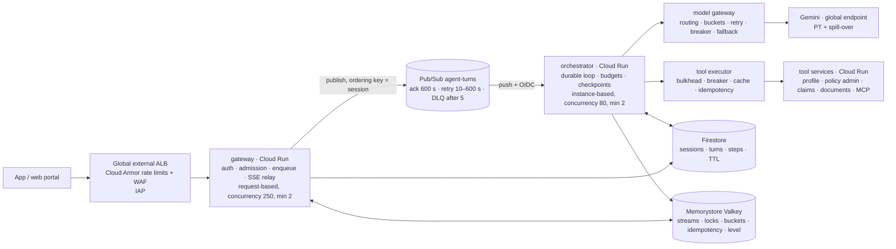

# Scaling Agentic Solutions on Google Cloud

**The long-form companion to [the primer](01-scaling-primer.md), for an engineer walking the design through a review.** An agent system is scaled by bounding tokens, not by adding servers. This document works that idea end to end — the arithmetic, the reference architecture, the mechanisms and the failure modes — on a customer-service agent running on Cloud Run and Gemini.

*Platform facts and prices as of September 2026 (verify). Every figure in Part 3 is computed by this lab's capacity model, `scalelab.capacity` (`python -m scalelab.capacity`, output in [03-capacity-plan.md](03-capacity-plan.md)), so the arithmetic is internally consistent; the behavioural findings are simulated, from `scalelab.sim` load tests against a simulated model pool. Sections are numbered so they can be referenced individually in design reviews.*

Five kinds of callout appear throughout:

- **In practice** — how a principle shows up in a real build, and how to say it in a design review.
- **Scenario** — a concrete situation that makes the mechanism tangible.
- **Key figures** — numbers worth keeping at hand during a capacity conversation.
- **Confirm before committing** — facts that move: prices, model identifiers, platform limits.
- **Common misstep** — the mistake that shows up most often in real designs.

---

## 0. The core idea

Everything that looks like a classic capacity problem in an agent system — instances, connections, queue depth, database throughput — turns out to be small and cheap next to one number: **tokens per minute at the model.** That resource is shared across your whole organisation and cannot be bought by the instance.

The design work therefore has three parts:

- **Make demand predictable** — admission control, model routing, prompt caching, context compaction.
- **Make the system degrade rather than collapse** when demand exceeds supply — degradation levels, load shedding, model fallbacks.
- **Make every turn survive failure**, because a long, multi-step unit of work that writes to systems of record invites failure — checkpoints, idempotency keys, at-least-once delivery.

> **In practice** — Open any capacity review with the unit of work and the binding constraint. "The unit of work is a *turn*. Each turn is two to three model calls of roughly five thousand tokens. So 100,000 conversations a day is about fourteen million input tokens a minute at peak, which is above our tier baseline — that is the constraint the design has to respect. Cloud Run is not going to be the problem." Saying this first reframes the whole discussion away from server counts.

How to read this document. Part 1 explains why agent workloads scale differently from web or classic ML workloads. Part 2 is the discovery checklist that shapes the design. Part 3 is the arithmetic, worked on a concrete example. Part 4 is the reference architecture. Part 5 walks through each scaling mechanism with the numbers that justify it. Parts 6 and 7 cover failure modes and the staged growth path. Part 8 walks through a capacity review. The appendices hold the configuration detail, the Google Cloud service mapping and the reference figures.

---

## 1. Why agent workloads scale differently

### 1.1 The unit of work is a turn, not a request

A web request is stateless, short and homogeneous; you scale it by adding replicas until CPU becomes the limit. A *turn* of an agent is a loop: a model call that plans, tool calls that fetch or change something, another model call that answers, sometimes more. Its length is decided at run time by the model. Its steps are sequential, because each depends on the one before. Its middle steps have side effects in systems you may not own. And the loop's memory — the context — grows as the conversation goes on.

| Property | Web request | ML inference request | Agent turn |
|---|---|---|---|
| Duration | 10–200 ms | 20–500 ms | 3–30 s, variable |
| Steps | 1 | 1 | 2–8, decided at run time |
| Binding resource | CPU / DB connections | GPU seconds | tokens per minute at a shared model pool |
| Cost driver | requests | requests | tokens × steps × context length |
| State | none, or a row | none | a growing transcript plus checkpoints |
| Side effects | in your own database | none | in the policy, claims and billing systems |
| Failure unit | retry the request | retry the request | resume the *step*, never repeat a write |

Everything in the rest of this document follows from that last column.

### 1.2 The binding constraint is model throughput, and it is shared

On the Gemini Enterprise Agent Platform, the pay-as-you-go path ("Standard PayGo", successor to dynamic shared quota) has no fixed per-project quota. Your organisation receives a tokens-per-minute *baseline* per model family, based on rolling 30-day spend — for Flash and Flash-Lite, 2 M, 4 M or 10 M TPM at tiers 1, 2 and 3; for Pro, 0.5 M, 1 M or 2 M — and can burst above it on a best-effort basis. A `429` response does not mean "you hit a number"; it means "there is contention on the shared pool right now". The documented response is exponential backoff, use of the global endpoint, and smoothing traffic within the minute. Guaranteed capacity is a separate purchase: Provisioned Throughput, sold in generative-scale units (GSUs) by the week, month, quarter or year, with pay-as-you-go spill-over enabled by default.

Two consequences shape every design. First, capacity planning is a *token* budget — you compute demand in tokens per minute before you compute anything else. Second, the pool is shared with every other team in the organisation, so the shape of your traffic affects your own error rate and everyone else's. Smoothing is a good-neighbour obligation as much as an optimisation.

> **Key figures** — Flash tiers 2 / 4 / 10 M TPM; Pro tiers 0.5 / 1 / 2 M TPM, set at organisation level by spend. One GSU of Gemini 3.5 Flash delivers 675 burndown tokens per second, where burndown weights input ×1, cached input ×0.1 and output ×6. Provisioned Throughput costs $7.14 / $3.70 / $3.29 / $2.74 per GSU-hour on 1-week / 1-month / 3-month / 1-year terms at the global endpoint; regional endpoints add 10 %.

### 1.3 Latency is a sum of sequential tails

A turn with two tool calls has four segments on the critical path: the planning call, the tools, the answering call, and the streaming of the answer to the user. Model latency is time-to-first-token — which now includes *thinking* time — plus output tokens divided by tokens per second.

Because the segments are sequential, a turn's p95 is roughly the sum of the segments' tails, not the tail of their sums. A four-second p95 target therefore forces parallel tool execution, streaming, prefetching, and a Flash-class model on the planning step.

And because turns are long, Little's law couples latency to concurrency: at 20 turns per second, a six-second turn means 125 turns in flight; a twelve-second turn means 250, each holding memory, a session lock and an open client connection. **Slowdowns are capacity problems**, not just experience problems.

### 1.4 Cost scales with context, and context grows

The bill is tokens, and input dominates. A service turn sends 4,000–6,000 tokens of system instructions, tool schemas, customer context and conversation history in order to receive 300–400 back. Without compaction, the input grows by several hundred tokens every turn, so the tenth turn of a conversation costs a multiple of the first.

Three levers change cost by integer factors:

- **Route** routine calls to a Flash-Lite-class model — three to five times cheaper per token.
- **Cache** the stable prefix — cached input is billed at 10 %.
- **Bound** the context — compaction, tool-result truncation, output caps.

The order matters. Route and cache first, because every later percentage improvement applies to the new, lower baseline.

> **Scenario** — A policyholder opens a conversation to ask why a renewal premium rose, then asks about excess options, then about adding a named driver, then about paying monthly. By the tenth exchange, an uncompacted transcript has pushed each model call from under 2,000 tokens to over 7,000. Nothing has failed and no alert has fired; the only visible symptom is that cost per conversation has quietly tripled.

### 1.5 Side effects mean at-least-once delivery, which means idempotency

Somewhere in a turn, the agent will do something real — register a notification of loss, open a service request, change a payment schedule. The process can die between doing that and recording that it did: Cloud Run allows ten seconds after `SIGTERM`, the model call can time out, the queue can redeliver.

Exactly-once delivery is not available on the push path you want for this design (Pub/Sub exactly-once semantics are pull-only and regional). So the loop has to be **replayable**: checkpoint every step before acting on its result, key every write by turn, step and arguments, and let redelivery find the checkpoint and skip what has already been done.

> **Scenario** — A customer reports storm damage to a roof. The agent calls the claims system, which creates the notification, and the orchestrator process is then evicted before it can record the result. Pub/Sub redelivers the turn. Without an idempotency key, the customer now has two open claims for one event, and a loss adjuster is dispatched twice. With one, the replayed call returns the original claim reference and the conversation continues as if nothing happened.

### 1.6 The feedback loop that brings agent systems down

More load → more `429`s from the shared pool → retries and longer model calls → longer turns → more turns in flight (Little's law) → more memory, more queued model calls, more retries → more `429`s.

Without a circuit breaker on that loop, an agent system under overload does not fail fast. It slows down for everyone until turn deadlines fire and users give up — having consumed the tokens anyway. This is the most expensive failure mode there is, because you pay for all of it and satisfy nobody.

A simulated load test reproduces it in seconds (`scalelab.sim`, the lab's notebook 04; simulated numbers). With 120 virtual users against a simulated 3 M TPM pool, retries alone take p95 turn latency from 5.8 s to roughly 40 s, with hundreds of rate-limited calls and a few dozen hard failures. Adding degradation levels and a circuit breaker, but no concurrency cap, converts that into 120 fast failures. Adding an in-flight cap of 30 — derived from the pool's token budget — produces a different outcome entirely: no turn fails, no call is rate-limited, admitted turns finish at a p95 of 3.6 s, and 17 % of attempts are shed immediately with a `Retry-After` header.

**Shedding quickly is kinder than queueing slowly**, and it is the only way to keep the turns you do admit inside their latency budget.

### 1.7 Multi-agent designs multiply everything

A coordinator with three specialists turns 2.2 model calls per turn into about eight. Cost rises by roughly 3.6×; latency by about 2× even with specialists running in parallel; and the probability that every hop succeeds falls from 0.95^2.2 ≈ 0.89 to 0.95^8 ≈ 0.66 at 95 % reliability per hop.

The right question about a multi-agent topology is therefore never "how do we scale the coordinator". It is "what measured problem justifies paying that multiple?" The answer is usually one of two things: a tool set too large to fit sensibly in one context, or permissions that must genuinely differ per step — a claims-adjustment agent that can write to the claims system, say, alongside a general enquiry agent that cannot.

> **Common misstep** — Describing scaling as "we put it on Cloud Run with max instances at 100 and autoscaling handles it". Cloud Run scales the *container*. It cannot scale the token budget, the policy administration system behind the tools, or the cost per conversation.

---

## 2. The dimensions of scale — a discovery checklist

Work down this list early. For each dimension: the question that changes the design, the number it produces, and the lever it points to.

| Dimension | Ask | Compute | Lever |
|---|---|---|---|
| Volume and burstiness | Conversations per day? Peak-to-average ratio? What does a major event do to traffic? | conversations/s, turns/s, model calls/s at average, peak and event load | admission control; Provisioned Throughput for the base; spill-over for peaks; degradation for events |
| Turn shape | Turns per conversation, model and tool calls per turn, tokens in and out | tokens per turn; tokens per minute | routing, caching, compaction, output caps |
| Latency budget | What must the user see, and when? First token, or whole answer? | TTFT p95, turn p95, and their sum across the critical path | streaming, parallel tools, prefetch, Flash on the planning step, thinking level |
| Concurrency | How many users at once? How long is a conversation? | in-flight turns = turns/s × turn duration; concurrent sessions = conversations/s × conversation duration | in-flight cap, connection-cheap gateway, per-instance concurrency |
| Model capacity | Which tier is the organisation on? Is Provisioned Throughput already bought? Which region must the data stay in? | demand TPM vs baseline; GSUs for base load; break-even utilisation | Standard / Priority / Flex tiers; PT term; global vs regional endpoint |
| Cost | What does a human-handled contact cost today? What is the budget? | $ per conversation, $ per month, and each lever's share | route, cache, compact, batch offline work, per-turn budgets |
| Tools and downstream | Which systems, at what QPS ceiling and p95? Which calls have side effects? | tool calls/s per system vs its limit | prefetch, caching, bulkheads, circuit breakers, idempotency |
| State | What must survive a crash? A restart? A region failure? How long are transcripts retained? | writes/s per collection and per document, document size, retention | checkpoints in Firestore, hot state in Redis, TTLs, compaction |
| Tenancy and fairness | One brand or many? Which classes must never be shed — broker portal, adviser assist, VIP? | turns/min per tenant; priority classes | per-tenant buckets, priority bypass, separate quotas |
| Geography and residency | Which countries? Is in-region processing required? | regional premium of 10 %; fewer models on regional endpoints | global endpoint unless residency forbids it; multi-region services with failover |
| Change | How often do prompts, tools and models change? What are the model retirement dates? | cache invalidations per change; models with 45-day retirement clocks | prompt versions in cache keys, model ids in configuration, canary rollouts |
| Observability | What tells you it is working? What pages someone at 3 a.m.? | SLIs: availability, latency attainment, shed rate, cost per conversation | low-cardinality metric labels, one trace per turn, burn-rate alerts |

> **In practice** — Be explicit about the dimensions you are deliberately *not* designing for, and why. "Single tenant, single region, no residency requirement, so we use the global endpoint and skip per-tenant quotas in version one — and here is where they would go when the broker portal arrives." Naming the omissions is what makes the design reviewable.

---

## 3. The arithmetic, worked

The worked example is a fictional mid-size insurer, Meridian Assurance, with a policyholder service agent in its mobile app and web portal. The agent answers coverage and billing questions, retrieves policy documents, quotes renewals and registers notifications of loss. The assumptions below are deliberately ordinary; the method is the point.

The rates, tokens, concurrency, cost, Provisioned Throughput and what-breaks-first figures in this part are the output of `scalelab.capacity.plan()` with its default `Scenario` — the same model as [03-capacity-plan.md](03-capacity-plan.md), whose customer profile service and policy administration system appear there as the CRM and the billing system (same 200 and 40 QPS ceilings) — and `tests/test_scalelab.py` pins them. To rework the example for other volumes, turn shapes or prices, change the `Scenario` and re-run it. The rows for tool calls, gateway instances, Firestore, Redis and Pub/Sub are the same arithmetic done by hand.

### 3.1 Assumptions

| Assumption | Value |
|---|---|
| Conversations per day | 100,000 |
| Peak hour vs daily average | 3× |
| Major-event spike vs average | 10× (a severe-weather event sends everyone to the chat at once, with 75 % of intents on "how do I report damage" and "am I covered") |
| Turns per conversation | 6 |
| Model calls per turn | 2.2 (plan, answer, sometimes a third) |
| Tool calls per turn | 1.3 |
| Input tokens per model call | 5,000, of which 3,000 are the stable prefix (instructions, policy wording, tool schemas), cached 90 % of the time |
| Output tokens per model call | 350, including thinking at the LOW level |
| Turn duration (p50) | 6 s; users take roughly 60 s to read and reply |
| Models | Gemini 3.5 Flash as standard; 3.5 Flash-Lite for 35 % of calls (routing, short answers); 3.1 Pro Preview for rare hard cases |
| Downstream ceilings | Customer profile service 200 QPS; policy administration system 40 QPS |
| Organisation tier | Flash tier 3 — 10 M TPM baseline |

### 3.2 Rates and tokens

| Quantity | Average | Peak | Major event |
|---|---:|---:|---:|
| Conversations / s | 1.16 | 3.47 | 11.6 |
| Turns / s | 6.94 | 20.8 | 69.4 |
| Model calls / s | 15.3 | 45.8 | 153 |
| Tool calls / s | 9.0 | 27.1 | 90.3 |
| Input tokens / min | 4.58 M | 13.75 M | 45.8 M |
| … of which uncached | 2.11 M | 6.33 M | 21.1 M |
| Output tokens / min | 321 k | 963 k | 3.21 M |
| Input TPM vs 10 M baseline | 0.46× | **1.38×** | **4.58×** |

The working, in plain steps: 100,000 ÷ 86,400 ≈ 1.16 conversations a second; × 6 turns ≈ 7 turns a second; × 2.2 calls ≈ 15 model calls a second; × 5,000 tokens × 60 ≈ 4.6 M input tokens a minute. Peak is three times that — 13.75 M, already above the tier baseline. A major event is ten times average — 45.8 M, four and a half times the baseline.

The conclusion is not "buy more". It is that **peak fits only if we cut tokens or buy capacity, and the event has to be shaped**, because no purchase makes 46 M TPM appear within a minute.

> **Confirm before committing** — Whether cached tokens count at full weight against the PayGo TPM baseline. They count at 0.1 against Provisioned Throughput, which is documented; the PayGo accounting is less clearly stated. Plan as though they count fully, and treat any relief as upside.

### 3.3 Concurrency, from Little's law

In-flight turns are turns per second times turn duration: 6.9 × 6 ≈ **42** at average, **125** at peak, **417** during a major event.

Concurrent *sessions* are about eleven times larger, because users pause between turns: a conversation lasts 6 × (6 + 60) ≈ 400 seconds, so 1.16 × 400 ≈ **460** sessions at average and **4,600** during an event.

The two numbers size different things. In-flight turns size orchestrator memory, session locks and model concurrency. Concurrent sessions size open streaming connections at the gateway and hot session state in Redis. Conflating them is a common source of under-provisioned gateways.

The token budget also caps concurrency, and this is the number that matters most: 10 M TPM ÷ 60 ≈ 167,000 tokens per second. A turn consumes 2.2 × 5,350 ≈ 11,800 tokens over six seconds, or about 2,000 tokens per second. The baseline therefore sustains roughly **85 turns in flight, or 14 turns per second** — which is the starting value for the admission controller's in-flight cap, and is *below* peak demand. That gap is the whole story of this example.

### 3.4 Cost per conversation

| Configuration | Per model call | Per conversation | Per month |
|---|---:|---:|---:|
| All Gemini 3.5 Flash, no caching | $0.0107 | $0.141 | $427 k |
| All 3.5 Flash, prefix cached | $0.0070 | $0.092 | $281 k |
| 35 % of calls on 3.5 Flash-Lite, prefix cached | — | **$0.068** | **$206 k** |

The working: a 3.5 Flash call with 2,300 uncached input tokens at $1.50/M, 2,700 cached (the 3,000-token prefix at a 90 % hit rate) at $0.15/M and 350 output at $9/M costs $0.00345 + $0.0004 + $0.00315 ≈ $0.0070. Thirteen calls per conversation ≈ $0.092. Routing a third of them to Flash-Lite brings it to $0.068.

Against a human-handled contact at several dollars, all three rows are cheap. Against each other they differ by 2×, which at this volume is $220,000 a month — a number worth an afternoon of engineering.

Note that output tokens are the largest single line even though there are fourteen times fewer of them: output is six times the price of input on this model. **Output caps and thinking levels are cost levers, not only latency levers.**

> **Confirm before committing** — Prices are for the global endpoint as of September 2026: 3.5 Flash $1.50 / $9.00 per M tokens (cached input $0.15); 3.5 Flash-Lite $0.30 / $2.50; 3.1 Flash-Lite $0.25 / $1.50; 3.6–3.8 Flash $0.75 / $3.75 introductory until 31 December 2026, then $1.50 / $7.50; 3.1 Pro Preview $2 / $12, doubling above 200 k context. Regional endpoints add 10 %; the Priority tier is 1.8×; Flex and Batch are 0.5×.

### 3.5 Provisioned Throughput

Provisioned Throughput is bought in GSUs per model. One GSU of 3.5 Flash delivers 675 *burndown* tokens per second, where a call's burndown is uncached input ×1 + cached input ×0.1 + output ×6. A call in this example burns 4,400–4,700 tokens, so one GSU serves about 0.14 calls per second. Carrying the standard-model share — 65 % of calls — entirely on Provisioned Throughput needs 69 GSUs at average, 207 at peak and 688 during a major event.

| Term | $ per GSU-hour | $ per M burndown tokens at 100 % utilisation | Break-even utilisation vs PayGo at $1.50/M |
|---|---:|---:|---:|
| 1 week | 7.14 | 2.94 | 196 % — never |
| 1 month | 3.70 | 1.52 | 101 % — never |
| 3 months | 3.29 | 1.35 | 90 % |
| 1 year | 2.74 | 1.13 | 75 % |

So Provisioned Throughput is not a discount unless you commit for a year *and* keep the units three-quarters busy. Sizing it for peak (207 GSUs) leaves it 33 % utilised on average and costs more than pay-as-you-go. Sizing it for the base (69 GSUs, about $138,000 a month on a one-year term) and letting peaks spill over to the Priority or Standard tiers is usually the right answer.

What Provisioned Throughput really buys is an SLA and immunity from contention on the shared pool for the traffic that matters most. That is why the request headers let you specify, per call, "dedicated only", "spill over to Priority" or "bypass PT entirely".

> **In practice** — "Provisioned Throughput for the base load on a long term, spill-over for the peak, and traffic *shaping* for the major event. Check the break-even utilisation before committing to a term, because a one-month term is never cheaper than pay-as-you-go."

### 3.6 The rest of the estate

| Resource | Average | Peak | Major event | Limit or note |
|---|---:|---:|---:|---|
| Orchestrator instances (80 in-flight turns each, ×1.4 headroom) | 1 | 3 | 8 | Cloud Run is not the constraint |
| Gateway instances (250 open streams each) | 2 | 2 | 3 | minimum 2 for warm capacity |
| Firestore ops / s | 42 | 125 | 417 | collection ramp 500 then +50 % every 5 min; ~1 write/s per document |
| Redis ops / s | 280 | 830 | 2,800 | one 2-vCPU Valkey node handles ≈ 120 k ops/s |
| Pub/Sub messages / s | 7 | 21 | 69 | 5 KB each — trivial |
| Policy administration QPS | 1.7 | 5.2 | 17.4 | ceiling 40 — comfortable, but cache documents anyway |
| Customer profile QPS | 4.9 | 14.6 | 48.6 | ceiling 200 — prefetch at session start, cache the profile |

The entire Cloud Run fleet for this system is a few dozen vCPUs — roughly **0.1 % of the model bill**. Capacity estimation for agent systems is really token estimation, and this table is the evidence for saying so.

### 3.7 What breaks first

| Condition | Resource | Demand vs limit | Fix |
|---|---|---:|---|
| Major event | Model TPM baseline | 4.6× | shape demand (admission, degradation); PT for the base; cut tokens per call |
| Peak | Model TPM baseline | 1.4× | PT or a custom tier; caching; compaction; more routing to Lite |
| Major event | Policy administration system | 0.43× | cache documents for minutes; bulkhead; degrade to cached answers |
| Major event | Customer profile service | 0.24× | prefetch at session start; five-minute profile cache |
| Major event | Redis | 0.02× | nothing needed |
| Major event | Firestore | 0.08× | pre-warm collections before launch day |

---

## 4. The reference architecture

A turn, end to end. The client posts a message. The gateway authenticates it, checks the tenant's token bucket and the global in-flight cap, decides the current degradation level, writes the turn to Firestore, publishes to Pub/Sub with the session id as ordering key, and begins relaying the turn's event stream to the client over server-sent events.

Pub/Sub pushes the message to the orchestrator with an OIDC token. The orchestrator takes the session lock in Redis, loads the session and any checkpointed steps, and runs the loop under a budget: model call through the model gateway (streaming deltas into the Redis stream), checkpoint the step in Firestore, execute tool calls in parallel through the tool executor, checkpoint again, repeat, finish. It writes the transcript, publishes the terminal event, decrements the in-flight gauge and acknowledges the push. History compaction runs *after* the terminal event — which is why the orchestrator uses instance-based billing.

### 4.1 Why it is shaped this way

**Gateway and orchestrator are separate services** because they scale on different signals and fail differently. Holding a streaming connection costs a coroutine and a few kilobytes, so the gateway runs at high concurrency on request-based billing and its instances are cheap. Running the loop costs model tokens, tool calls and the memory of a full context, so the orchestrator runs at moderate concurrency on instance-based billing — which also means background work is not CPU-throttled after the response is sent. The relevant per-instance limits differ too: a gateway instance is bounded by its 1,000-connection and 800-requests-per-second caps, an orchestrator instance by memory per in-flight turn.

**A queue sits between them even though the user is waiting**, for three reasons. It turns a burst into a backlog with one observable number — the age of the oldest unstarted turn — instead of a pile of failed requests. It gives at-least-once execution with redelivery, which is what makes the loop durable. And it decouples the orchestrator's drain rate from the arrival rate, so the token bucket, not the load balancer, sets the pace. The cost is a few tens of milliseconds.

**Events travel through Redis Streams rather than a direct connection** because the orchestrator instance running the turn is not the gateway instance holding the client. A stream with sequence numbers also gives resume-after-reconnect (`Last-Event-ID`) for free — which SSE clients need on Cloud Run, where every stream is a request subject to a 60-minute ceiling.

**Firestore holds durable state and Redis holds hot state** because their access patterns are opposites: a handful of document writes per turn, under a roughly one-write-per-second-per-document rule and a 1 MiB document cap, versus thousands of sub-millisecond counter, lock and bucket operations per second. Collapsing them into one store is the single most common mistake in these designs.

**The model gateway is a library, not a service**, because an extra network hop on the critical path costs latency, and the state it needs — buckets, breaker state, the rate-limited ratio — fits in Redis. It becomes a service when many agents share one quota and need central policy, which is the role Apigee or the platform's Agent Gateway play at enterprise scale.

### 4.2 Runtime alternatives

| Runtime | Choose when | What you give up | Scaling knobs |
|---|---|---|---|
| **Cloud Run** (this design) | You want every scaling mechanism visible and tunable; polyglot services; Cloud Run is already in the estate | You operate the queue, the stores and the loop yourself | concurrency, min/max instances, billing mode, CPU/memory, Direct VPC, timeouts |
| **Agent Runtime** (managed; formerly Agent Engine) | Python agents on ADK; you want managed sessions, Memory Bank, sandboxed code execution and identity with the least infrastructure | Less control: min instances 0–10, max up to 1,000, container concurrency default 9, 1–8 vCPU and up to 32 GiB; a default **90 queries per minute** quota that must be raised before any load test; cold latency ≈ 4.7 s versus ≈ 0.4 s warm | min/max instances, container concurrency, resource limits, quotas |
| **GKE Autopilot** | Kubernetes is already the platform; GPUs for self-hosted models; queue-depth autoscaling with KEDA; service mesh | The most operational surface; slower iteration | HPA/KEDA on queue depth or custom metrics, pod resources, node pools |

The honest summary: Agent Runtime is the sensible default for a Google-native team, and Cloud Run is the right choice when a platform team wants to own the compute or the agent is not Python-first. The *mechanisms* in Part 5 are the same in all three — only the place you configure them differs.

---

## 5. The scaling mechanisms

### 5.1 Quota strategy and traffic smoothing

Demand for the model must be shaped before it reaches the pool. Three layers do that work.

An **in-flight cap at the gateway** (see 5.3) bounds how many turns can be generating tokens at once. A **token bucket per model** in the model gateway, sized to your share of the tier baseline and refilled continuously, spreads calls evenly within each minute. And the **choice of endpoint and tier** decides what you are drawing on: the global endpoint unless residency forbids it, since it routes to the region with the most available capacity and is where the tiers apply; Priority PayGo for customer-facing traffic that must not queue; Flex for latency-tolerant background work at half price; Batch for anything that can wait a day.

The bucket's *capacity* is the burst you tolerate and its *rate* is the sustained tokens per second. A six-second burst allowance is a good default — smaller means smoother traffic and fewer rate-limit errors, but more client-side queueing. When the bucket cannot admit a call within a bounded wait, the gateway should treat that as a rate-limit signal in its own right, count it toward the degradation level, and try a sibling model with its own pool before failing. Once there is more than one orchestrator instance the bucket must live in Redis; a Lua-scripted Redis bucket is atomic and costs one round-trip per call.

Provisioned Throughput plugs into the same place. Per request you choose *dedicated* (PT only, `429` when exhausted), *spill-over* (PT first, then PayGo — the default) or *shared* (PayGo only), and which tier absorbs the spill. The response's `traffic_type` field tells you which pool served the call, and it belongs on your dashboard. PT enforcement windows are short at scale — one to five seconds above 50 GSUs — so bursts must be smoothed to second granularity, not minute granularity, to stay inside a commitment.

> **Key figures** — Documented guidance for `429`s: exponential backoff, the global endpoint, smoothing within the minute. Gemini 3.x context-cache minimum is 4,096 tokens (6,144 on 3.7/3.8 Flash and 3.1 Pro). Explicit cache default TTL is 60 minutes; storage costs $1.00 per M tokens per hour on Flash, $4.50 on 3.1 Pro.

### 5.2 Retries, jitter, breakers and fallbacks

Retry with exponential backoff and **full jitter** — a uniform draw between zero and the backoff. When a shared pool throttles, every client sees the error at the same moment and, without jitter, retries at the same moment; the retry wave is then as large as the original. A simulation of 200 clients retrying against a pool with room for 40 per second finishes far sooner with jitter, and with a fraction of the secondary rate-limit errors. Honour `Retry-After` when it is sent, jitter a little on top of it, and never retry past the turn's deadline — a retry that cannot finish in time only spends tokens.

A **circuit breaker per model and per tool** converts repeated failures into fail-fast decisions for a cooling period, with a half-open probe to recover. Breakers matter more for agents than for web services, because a sick dependency does not merely slow one request: it pins hundreds of coroutines *with their contexts in memory* until their deadlines fire.

When a model's breaker opens, or two consecutive rate-limit errors arrive, the gateway should move to a **sibling model** — 3.5 Flash to 3.7 Flash to 3.5 Flash-Lite — because each family has its own pool, so a sibling's error rate is nearly independent. Model identifiers therefore belong in configuration, never in code. That is also how you survive the 45-day retirement clock on short-lived Flash releases.

**Hedging** — issuing a second identical request when the first has not answered by a chosen delay, and keeping the winner — is a p99 tool for small, non-streaming, idempotent calls such as intent classification. It trades extra calls for tail latency: fired at roughly the p90, it typically cuts p99 by a third to a half for a few percent more calls; fired earlier it halves p99 again but nearly doubles the calls. It is wrong for streaming answers, since you cannot un-stream the loser, and wrong when the pool is already contended, since it adds load exactly when load is the problem. Gate it on the degradation level.

### 5.3 Admission control and graceful degradation

Admission control is the circuit breaker on the feedback loop described in 1.6. It sits at the gateway, before a turn has cost anything, and asks three questions in order: is this tenant within its budget (a token bucket per tenant, so one brand cannot consume the global pool); what is the system's current degradation level; and would admitting this turn exceed the in-flight cap?

The cap starts at the token-budget figure from 3.3 and is tuned from load tests. Priority classes — an adviser-assist console, a broker portal, a VIP segment — bypass it.

The degradation level is computed from signals every instance can publish: in-flight turns, the age of the oldest queued turn, the share of model calls rate-limited in the last minute, and whether any model breaker is open. It is written to Redis so every gateway and orchestrator degrades together. Each level buys capacity by giving something up.

| Level | Trigger | What changes | Effect in the worked example |
|---|---|---|---|
| 0 | normal | — | ≈ $0.005 per turn on Flash |
| 1 | in-flight ≥ 80 % of cap, or queue age ≥ 10 s, or rate-limited ratio ≥ 5 % | answers move to Flash-Lite with a shorter output cap; optional tools withheld | about a quarter of the level-0 cost; turns roughly twice as fast |
| 2 | a model breaker open, or rate-limited ratio ≥ 15 % | Flash-Lite with minimal thinking and a short cap; no writes and no slow tools; a prepared event bulletin where one applies | about a fifth of the level-0 cost |
| 3 | in-flight ≥ cap, or queue age ≥ 30 s | shed everything below priority 2 with a `503` and a `Retry-After` that grows with the level | bounded latency for the traffic that is admitted |

Two details separate a working implementation from a diagram. The level needs **hysteresis** — hold a raised level for ten to fifteen seconds before letting it drop — or it will flap between 1 and 3 on every crossing of the cap. And `Retry-After` must be **jittered by the client**, or every shed user returns together and is shed together.

> **Scenario** — A hailstorm crosses three counties on a Sunday afternoon. Traffic is ten times normal and 75 % of it is "how do I report damage" and "does my policy cover this". Level 2 answers exactly that intent from a prepared event bulletin plus cached policy wording, at a fifth of the cost and half the latency, and without touching the policy administration system — which is precisely the system you want protected while loss adjusters are being dispatched. Customers with unrelated billing questions see a slightly terser agent. Nobody sees a spinner for forty seconds.

### 5.4 Durable execution

The loop checkpoints every step in Firestore *before* acting on its result: the model's response after a model call — including the parts the next call must echo back, such as Gemini 3's thought signatures — and the tool results, compacted, after a tool step.

On redelivery, the orchestrator replays the turn from its checkpoint, skipping completed steps. The tool executor keys every write by turn, step, call index and a hash of the arguments, and stores the result under that key for a day. So a redelivered turn that has already registered a notification of loss gets the same claim reference back rather than creating a second one. A simulated crash test (the lab's notebook 02) that kills the process immediately after the claim is checkpointed shows one claim after redelivery, with four of five steps resumed from the checkpoint.

The queue contract is the other half. Pub/Sub push acknowledges on any `2xx` and redelivers on anything else, with a push backoff growing from 100 ms to 60 s; the subscription's own retry policy adds a 10–600 s exponential backoff; after five attempts the message goes to a dead-letter topic with its own alert.

The orchestrator should return `503` only for transient infrastructure trouble, and `200` for every *terminal* outcome — including graceful failure. A turn that ended with "I could not complete that; a colleague will follow up" must not be retried into a second bill. The acknowledgement deadline (≤ 600 s) is the ceiling for one delivery; the turn budget (45 s) sits well below it. A session lock in Redis, with the turn id as its value, serialises turns per session even when a redelivery and a new turn overlap; the lock's TTL is the budget plus a margin, so a dead instance releases it automatically.

Firestore shapes the layout: a session document, bounded by compaction and well under 1 MiB; a turn document per user message with steps appended atomically (`ArrayUnion` is idempotent for identical elements, which is exactly what a replayed step needs); tool results truncated to a few kilobytes *in the checkpoint as well as the transcript*; an `expires_at` timestamp with a TTL policy; and no counters inside documents. A turn writes its document a handful of times over several seconds — comfortably inside the sustained one-write-per-second-per-document guidance.

### 5.5 Context engineering for scale

Lay the prompt out for the cache: system instructions, policy wording and tool schemas first, byte-identical for every user and every turn; then the customer's prefetched profile; then a summary of older turns; then the last N messages verbatim; then the new message.

Implicit prefix caching bills the identical prefix at 10 % once it clears the minimum — 4,096 tokens on Gemini 3.x, 6,144 on 3.7/3.8 Flash and 3.1 Pro — and an explicit cache with a TTL fronts it deterministically for large prefixes. The prompt *version* must be part of the cache key, so that a prompt change invalidates cleanly instead of silently halving the hit rate. The explicit-cache break-even is under one request per hour on Flash: storage is not the reason to hesitate, operational overhead (TTL refresh, versioning) is.

**Compaction** keeps input bounded. When pending history exceeds a token threshold, everything but the verbatim tail is summarised on the Lite tier *after* the turn completes, off the critical path. Without compaction, the first model call of a twelve-turn conversation grows from under 2,000 to over 7,000 tokens; with it, the call stays near 2,400. Over twenty turns that is roughly 385,000 versus 184,000 input tokens — three times the cost.

Tool results are truncated before they enter the transcript: a 180-line policy schedule becomes 600 tokens rather than 3,600. Earlier turns' tool traffic is not replayed at all — the assistant's own answer already carries the facts. Output is capped per task and thinking is set per task: minimal for routing and extraction, low for answers, medium only for the rare hard case. Thinking tokens are billed as output, and 3.8 Flash at high effort uses about 30 % more of them than 3.7.

### 5.6 Tools at scale

The tools are usually the real bottleneck, because the systems behind them were sized for humans working at human pace. A claims or policy administration platform that comfortably serves 400 contact-centre agents can be saturated by a few hundred concurrent turns.

The tool executor applies, in order: a **bulkhead** (a semaphore per tool per instance, so slow policy-system calls cannot occupy every worker), a **circuit breaker** per tool, a **result cache** for pure reads (profile for five minutes, policy documents for two, event status for thirty seconds), the **idempotency check** for writes, a **timeout**, and **one retry for idempotent reads only**.

Failures should come back to the model as *structured data* — "policy system unavailable, retry in 10 s" — never as exceptions that abort the turn. The model can usually answer around a missing fact, and an aborted turn is the most expensive outcome of all: you have paid for every token and delivered nothing.

Two habits remove most tool latency from the critical path. **Prefetch** the customer's profile and active policies when the session starts, rather than letting one call sit inside the first turn's planning step. And let the model issue independent calls in a single step so they run concurrently — profile and event status together — which makes the turn's tool time the maximum, not the sum.

Tool services run as their own Cloud Run services with their own service accounts and invoker bindings, so they scale and fail independently. An MCP server over the same tools standardises discovery and lets Agent Registry and Agent Gateway see and police the calls, at the cost of one hop — so run it in the same region with keep-alive connections.

### 5.7 Streaming and connections

Server-sent events over HTTP/1.1 chunked transfer is the right transport for a chat agent on Cloud Run: it passes every proxy, supports resume natively through `Last-Event-ID`, and is a plain request — which means it counts against instance concurrency and is subject to the request timeout (default 5 minutes, maximum 60). Clients must therefore reconnect with the last sequence number, and the relay must serve from the stream rather than from memory. Responses without chunked encoding are capped at 32 MiB; streams are not. WebSockets work too, but need session affinity, which is best-effort, and cross-instance fan-out through Redis either way.

Time-to-first-token as the user experiences it arrives only after plan → tools → answer — about four seconds in the simulated load tests. A two-second TTFT target is attainable only by streaming *progress* events ("checking your policy documents…") from the tool steps, which the event stream already carries. This is worth designing deliberately: the perceived responsiveness of the agent is set by the first progress event, not the first token of the answer.

### 5.8 Budgets, multi-agent topologies and tenancy

Every turn should carry a budget with four independent dimensions — steps, model calls, tokens and dollars — plus a wall-clock deadline, because each fails differently. Tool thrash burns steps. A long transcript burns tokens. A Pro-model fallback burns money. A slow policy system burns time while the user watches a spinner. A turn that exhausts a budget ends *gracefully*, with a message and a terminal event, and is not retried.

In multi-agent topologies the budget is hierarchical: the coordinator's budget bounds the sum of its specialists'. Specialist calls go through the same model gateway and the same buckets, so fan-out cannot escape admission control. The arithmetic in 1.7 is the argument to keep at hand — a specialist should be justified by a measured problem (wrong-tool rate, context too large for one prompt, permissions that must differ), and the design should state which metric would trigger the split.

For tenancy: per-tenant token buckets at the gateway, tenant labels on every metric and cost record, and a priority field on the turn that bypasses the in-flight cap for classes that must never be shed. On regions: the global endpoint for the model unless residency forbids it — regional endpoints cost 10 % more and carry fewer models, since 3.1 Pro Preview and the newest Flash releases are global or multi-region only. Cloud Run multi-region services with Service Health failover cover the stateless tier; Firestore multi-region covers the durable tier; Redis is per region, with the event relay pinned to the region running the turn, which is what Pub/Sub push delivers by default.

Configuration detail for compute, state and observability is in Appendices A, B and C.

---

## 6. Failure catalogue

| Failure | Symptom | Mechanism that catches it | Mitigation |
|---|---|---|---|
| Rate-limit storm on the shared pool | rate-limited ratio climbs, turns lengthen, in-flight grows | bucket waits, breaker, degradation levels 1–2 | smoothing, sibling fallback, PT for the base, shed at level 3 |
| Retry synchronisation | a secondary error wave as large as the first | jittered backoff, deadline-bounded retries | full jitter; honour and jitter `Retry-After` |
| Slow-motion collapse | p50 goes from 6 s to 40 s and nothing technically "fails" | in-flight cap, queue age | admission control derived from the token budget; shed fast |
| Tool thrash / runaway loop | many steps, same tool, same arguments | step and call budgets; duplicate-call detection | structured tool errors; step cap; cost alert |
| Context overflow | tokens per call climb turn over turn; cost per conversation drifts up | compaction threshold; output caps | compaction; tool-result truncation; stop replaying old tool traffic |
| Poison message | one turn fails on every redelivery | dead-letter after 5 attempts; DLQ alert | acknowledge graceful failures; inspect the DLQ; build replay tooling |
| Duplicate side effect | two claims registered for one event | idempotency keys on writes; checkpoint before acting | replay from checkpoint; dedup store with 24 h TTL |
| Hot document | Firestore write contention on a session document | the ~1 write/s/document rule | per-turn documents; append steps rather than rewriting; no counters in documents |
| Cold-start storm | latency spike on scale-out; Direct VPC NIC creation | minimum instances; startup CPU boost | pre-scale before known peaks such as renewal runs; keep instances warm |
| Noisy tenant | one brand's spike degrades everyone | per-tenant bucket | tenant quotas; priority classes |
| Model retirement | a 45-day clock on short-lived Flash releases; the 2.5 line retires 20 October 2026 | model ids in configuration; fallbacks | pin the 12-month models for production; canary the rest |
| Prompt change | cache hit rate halves overnight; cost rises | prompt version in the cache key | version prompts; roll out with a canary and watch the cached-token share |
| Intent-mix shift | 75 % "how do I report damage"; policy system idle but profile service hammered | degradation level 2 with a prepared bulletin | prefetch, caches, event bulletin |
| Cost runaway | budget alert or cost-per-conversation drift | per-turn dollar budget; drift alert | budgets; spend caps; kill switch on max instances |

---

## 7. The growth path

| Stage | Conversations/day | What you need | What you can safely skip |
|---|---:|---|---|
| Pilot | ≤ 1,000 | one service, synchronous loop, per-turn budgets, structured tool errors, traces | queue, Redis, Provisioned Throughput, degradation levels |
| Production v1 | 1,000–20,000 | gateway/orchestrator split, Pub/Sub, Firestore checkpoints, idempotency, SSE relay, per-turn budgets, dashboards | PT (fits comfortably in tier 1–2), multi-region |
| Scale | 20,000–200,000 | admission control with degradation levels, client-side smoothing, sibling fallbacks, compaction and caching, PT for the base load, quarterly capacity reviews | GKE |
| Enterprise | > 200,000, multi-brand | per-tenant quotas and priorities, a negotiated custom PayGo tier, multi-region, Agent Gateway and Registry for governance, cost allocation per tenant | — |

The order of adoption matters: durability (checkpoints, idempotency) before admission control; admission control before Provisioned Throughput; Provisioned Throughput before multi-region.

Each step should be triggered by a measurement, and the design should name it in advance. "We add the queue when p95 during the peak hour crosses the budget. We buy Provisioned Throughput when the rate-limited ratio stays above 5 % at peak for a week. We add a second region when a residency or availability requirement says so — not before."

---

## 8. Running a capacity review

### 8.1 A workable sequence

| Phase | What happens |
|---|---|
| Frame | Restate the goal; name the unit of work (the turn) and the binding constraint (tokens per minute). Agree what "working" means. |
| Discover | Walk the dimension checklist in Part 2, stating a default for each unknown so the review can move: volume, peak ratio, event behaviour, turn shape, latency budget, residency, tenancy. |
| Calculate | Do the arithmetic from Part 3 in the open: rates → tokens → Little's law → TPM versus tier → cost per conversation → what breaks first. |
| Design | Walk the architecture with the specifics in each box, and say plainly which parts are routine and which are hard. |
| Deep-dive | Pick two areas by risk. Usually admission control and durable execution; sometimes quota strategy or context and cost. |
| Close | Failure modes, the growth path, what you will measure in week one, and an explicit "not in version one" list. |

### 8.2 Questions that change the design

Seven questions do most of the work:

- **What happens to traffic during a major event?** → the event factor, and the whole degradation design.
- **Is there a Provisioned Throughput commitment already, and on what term?** → spill-over design and break-even.
- **Does the data have to stay in-country?** → regional endpoint, model availability, and the 10 % premium.
- **Which downstream system has the lowest QPS ceiling?** → bulkheads, caches, prefetching.
- **What does a human-handled contact cost today?** → the ROI line that makes $0.07 per conversation obviously acceptable.
- **How many brands or tenants share this?** → fairness and per-tenant quotas.
- **What must never happen twice?** → the scope of idempotency.

### 8.3 Two worked design changes

**Growing the service agent from 5,000 to 500,000 conversations a day.**

Do the arithmetic first. 500,000 a day is five times the worked example, so roughly 70 M input TPM at peak — seven times the tier-3 baseline. No tier fits, so the design is Provisioned Throughput for the base on a one-year term (around 350 GSUs of Flash — state the monthly figure), a custom tier negotiated for spill-over, and a serious programme to cut tokens per call (explicit caches, compaction, Lite routing above 50 %).

Then concurrency: 625 in-flight turns at peak and about 2,000 during an event, which means 12–40 orchestrator instances — still small. Redis and Firestore are fine. But the policy administration system at 87 QPS during an event is *over* its 40 QPS ceiling, so a document cache and level-2 degradation become mandatory rather than optional.

Then the operational layer: per-tenant quotas if brands are involved, multi-region if residency or availability demands it, cost allocation per brand. Close with what you would validate first — a load test that reproduces the event intent mix, not just the event volume.

**An agent that costs $0.30 per turn with a 20-second p95 in the morning peak.**

Look at the traces first and establish where tokens and seconds actually go, step by step. The usual findings, and their fixes, in the order worth applying them:

1. No caching, because the prefix is not stable or sits below the minimum → reorder and enlarge the prefix; add an explicit cache.
2. Pro on every call → route to Flash, and Flash-Lite for routing and short answers.
3. Context growing without compaction → compact, truncate tool results, stop replaying old tool traffic.
4. Sequential tool calls → parallel calls and session-start prefetch.
5. Retries without jitter and with a long deadline → full jitter, breaker, sibling fallback.
6. No admission control, so the peak becomes a slow-motion collapse → an in-flight cap derived from the token budget, plus degradation levels.

Expected effect: cost down four to five times, p95 down to six to eight seconds, and a shed rate you can now *see* and make a deliberate decision about — instead of a latency nobody chose.

### 8.4 Common questions, answered briefly

**Why not simply raise max instances?** Because instances do not make tokens. The pool is shared, and the real cap is the token budget.

**Why a queue if the user is waiting?** It gives a backlog with one observable age, redelivery for durability, and a drain rate set by the token bucket rather than the load balancer.

**Can we get exactly-once execution?** Not on the push path. Design for at-least-once with idempotency keys.

**Provisioned Throughput or pay-as-you-go?** PT for the base load on a long term if utilisation clears the break-even; PayGo or Priority for peaks; shaping for events.

**Synchronous or queued?** Synchronous for a single-step read with a sub-second budget; queued for anything with tools, side effects, or a deadline beyond a few seconds.

**What do we measure in week one?** Rate-limited ratio, queue age, minutes spent at each degradation level, p95 by step, cost per conversation, shed rate, and cached-token share.

**When would we move to Agent Runtime?** When the agent is Python-first on ADK and the team wants managed sessions, memory and identity rather than running the queue and stores — after raising the default quotas.

> **Common misstep** — Stating a p95 without a per-step breakdown, a cost without the token shape behind it, or "we will shed load" without saying what the user sees and when they can retry.

---

## Appendix A — Cloud Run settings that matter

| Setting | Gateway | Orchestrator | Why |
|---|---|---|---|
| Billing mode | request-based (CPU during requests) | instance-based (CPU always allocated) | checkpoints, compaction and telemetry run after the response on the orchestrator |
| Concurrency | 250 | 80 | I/O-bound coroutines; memory per in-flight turn is a few MB of context |
| CPU / memory | 1 vCPU / 512 MiB | 2 vCPU / 2 GiB | JSON and validation work per step; headroom for 80 contexts |
| Minimum instances | 2 | 2 | warm capacity; on-demand scale-out waits max(10 s, 3.5× predicted cold start) |
| Maximum instances | 100 | 50 | bounded by regional CPU/memory quota ÷ instance size, and by Direct VPC egress (~100–200 instances per revision) |
| Timeout | 600 s | 600 s | SSE budget plus queue plus slack; matches the Pub/Sub ack deadline |
| Ingress | internal + load balancer | internal only | Cloud Armor cannot be bypassed; Pub/Sub push from the project is internal |
| Autoscaling | 60 % CPU over 1 min, or 60 % of max concurrency | same | whichever needs more instances; adaptive concurrency tuning lowers effective concurrency to keep CPU below 90 % |
| Shutdown | `SIGTERM` + 10 s | same | checkpoint early; the queue redelivers |

Two Cloud Run resource types are worth naming for agent workloads. **Worker pools** (GA, April 2026) pull from Pub/Sub and autoscale on queue depth through the external-metrics autoscaler — the right home for long-running turns that would outlive a push acknowledgement deadline. **Instances** (Preview, August 2026) are singleton, individually addressable, always-on workloads, suited to stateful agent loops.

## Appendix B — State stores and their limits

**Firestore** for durable documents (sessions, turns, checkpoints): regional 99.99 %, multi-region 99.999 %; point-in-time recovery; TTL policies; 1 MiB documents; roughly one sustained write per second per document; 500 writes per second to a collection with a sequential indexed field; ramp new collections at 500 ops/s then +50 % every five minutes.

**Memorystore for Valkey or Redis** for hot state (event-relay streams, session locks, token buckets, idempotency markers, the degradation level): approximately 120,000 ops/s per 2-vCPU node; reached from Cloud Run over Direct VPC egress, which needs a /26 or larger subnet and roughly twice as many IP addresses as instances.

**Pub/Sub** for the queue: 10 MB messages, 31-day retention, ordering keys at 1 MB/s per key, and a push quota an order of magnitude below pull.

**Long-term memory and retrieval** — AlloyDB with ScaNN, Vertex AI Vector Search, or the platform's Memory Bank — sits alongside these and is sized by chunks × dimensions × bytes, which is a small number next to the token bill.

## Appendix C — Observability, SLIs and alerts

One trace per turn, with a span per model call and tool call, using attributes from the OpenTelemetry GenAI semantic conventions (`gen_ai.operation.name`, `gen_ai.provider.name`, `gen_ai.request.model`, `gen_ai.usage.input_tokens` and `output_tokens`, `gen_ai.conversation.id`). Those conventions are still at "Development" status, so centralise the names in one place — they will move.

Metrics with **low-cardinality labels only**: model, tool, tenant, outcome, degradation level — never session or turn ids. Cloud Monitoring accepts one point per five seconds per time series. Worth recording: tokens by kind, cost, latency and TTFT histograms, rate-limited ratio, bucket wait, breaker state, in-flight turns, queue age, shed count by reason, and degradation level.

SLIs worth defining: **availability** (turns that ended with an answer, over turns admitted); **shed rate** as an SLI in its own right; **latency attainment** (share of turns under 8 s, and separately first *progress* event under 2.5 s); and **cost per conversation**, which drifts silently whenever a prompt or model changes.

Alerts worth paging on: Pub/Sub oldest unacknowledged age above 30 s; dead-letter queue above zero; rate-limited ratio above 5 %; degradation level 2 or higher for more than a few minutes; p95 above 8 s; `5xx` ratio above 2 %; Redis memory above 80 %; and cost per conversation more than 30 % above its seven-day baseline. That last one is the alert that catches a runaway loop before finance does.

## Appendix D — Google Cloud services, mapped to the mechanisms

| Mechanism | Google Cloud pieces (September 2026) |
|---|---|
| Model capacity | Gemini on the Gemini Enterprise Agent Platform: Standard PayGo tiers (organisation-level TPM baselines), Priority (1.8×) and Flex (0.5×, Preview) tiers via request headers, Provisioned Throughput in GSUs by term with spill-over control, global vs regional endpoints (+10 %), Batch API (0.5×, ~24 h) |
| Caching | implicit prefix caching (≥ 4,096 / 6,144 tokens), explicit caches with TTL, `usage_metadata.cached_content_token_count` |
| Thinking and output | `thinking_level` MINIMAL/LOW/MEDIUM/HIGH (3.7/3.8 Flash and 3.1 Pro reject MINIMAL); thought signatures must be echoed back; `max_output_tokens` |
| SDK | `google-genai` 2.22 (`genai.Client(enterprise=True, project=…, location="global")`; pin below 3.0; SDK retries are off by default — retry in your own gateway) |
| Compute | Cloud Run services (gateway, orchestrator, tools), worker pools (GA) for pull-based long turns, instances (Preview) for singleton agents, jobs for evaluations and batch work; Agent Runtime as the managed alternative; GKE with KEDA where Kubernetes is the platform |
| Queue and durability | Pub/Sub push with OIDC, ordering keys, retry policy, dead-letter topics; Cloud Tasks for rate-capped, scheduled, deduplicated tool work (500/s per queue, 30-minute dispatch deadline); Workflows for long-running approvals (512 KB state, callbacks) |
| State | Firestore (Standard/Enterprise; TTL, PITR), Memorystore for Valkey/Redis (streams, buckets, locks), AlloyDB + ScaNN or Vertex AI Vector Search for retrieval, Agent Runtime Sessions and Memory Bank on the managed path |
| Edge | Global external Application Load Balancer with serverless NEGs, Cloud Armor rate limiting (per header, cookie or IP key; throttle or ban) and WAF, IAP (native on Cloud Run since March 2026), Apigee for spike arrest and quotas on API-shaped tools |
| Governance at scale | Agent Registry, Agent Gateway (MCP/A2A-aware policy point, 5,000 registered resources per instance), Agent Identity (SPIFFE, mTLS + DPoP), Model Armor inline |
| Observability | Cloud Trace via OTLP (`telemetry.googleapis.com`), Cloud Monitoring custom metrics and SLOs with burn-rate alerts, log-based metrics, Managed Prometheus sidecar; Agent Observability and Evaluation on the managed path |
| Delivery and cost | Cloud Build, Cloud Deploy canaries for Cloud Run (10/50/100 with verification), budgets with Pub/Sub notifications (budgets do not cap spend — wire the notification to a kill switch), Cloud Run flexible CUDs (28 % / 46 %), Cloud Run budget spend caps (Preview) |

If part of the estate is not on Google Cloud, the mechanisms translate almost one to one. Token buckets and circuit breakers are yours to implement anywhere. Pub/Sub maps to SQS or Service Bus; Firestore to DynamoDB or Cosmos DB; Memorystore to ElastiCache; Provisioned Throughput to provisioned throughput on Bedrock or PTUs on Azure OpenAI; Cloud Run to App Runner or Container Apps. The design is portable; only the product names change.

## Appendix E — Reference figures

| Figure | Value |
|---|---|
| Tokens per call (service agent) | 4–6 k in, 300–400 out including thinking |
| Little's law | in-flight = rate × duration; sessions ≈ 11× in-flight turns when users pause for a minute |
| Flash PayGo tiers | 2 / 4 / 10 M TPM; Pro 0.5 / 1 / 2 M |
| What 10 M TPM sustains | ≈ 14 turns/s of this turn shape; ≈ 85 turns in flight |
| Provisioned Throughput, 3.5 Flash | 675 burndown tokens/s per GSU; output ×6, cached ×0.1; break-even 75 % on a 1-year term, never on a 1-month term |
| Cost per conversation | $0.14 → $0.09 (caching) → $0.07 (routing + caching) |
| Output price vs input price | 6× on 3.5 Flash — which makes output caps and thinking levels cost levers |
| Minimum cacheable prefix | 4,096 tokens (3.x); 6,144 (3.7/3.8 Flash, 3.1 Pro) |
| Cloud Run | 1,000 concurrency and 800 req/s per instance; 60-minute request ceiling; 10 s after `SIGTERM`; scale-out waits max(10 s, 3.5× cold start); Direct VPC ≈ 100–200 instances per revision |
| Pub/Sub push | ack ≤ 600 s; backoff 100 ms–60 s; dead-letter after 5–100 attempts; push quota ≈ 10× below pull |
| Firestore | 1 MiB documents; ~1 write/s/document; 500 then +50 %/5 min ramp |
| Valkey | ≈ 120 k ops/s per 2-vCPU node |
| Agent Runtime | 90 queries/min default quota; concurrency 9 by default; cold ≈ 4.7 s versus warm 0.4 s |
| Reliability compounding | 0.95⁵ ≈ 0.77; 0.95⁸ ≈ 0.66 |
| Cloud Run fleet vs model bill | ≈ 0.1 % |

---

## Sources and currency

Figures were taken from official Google Cloud documentation in September 2026, covering: Gemini Enterprise Agent Platform pricing, model pages and the lifecycle table; Standard, Priority and Flex PayGo; Provisioned Throughput and its supported-models table; context caching; batch inference; quotas; Cloud Run quotas, autoscaling, request timeouts, billing settings, Direct VPC egress and WebSockets, plus the "Host AI agents on Cloud Run" guidance; Agent Runtime deployment, optimisation and quotas; ADK 2.x; Pub/Sub quotas, push, dead-letter topics and subscription properties; Cloud Tasks and Workflows quotas; Firestore quotas and best practices; Memorystore for Valkey node specifications; Cloud Armor rate limiting; Cloud Monitoring quotas; the OpenTelemetry GenAI semantic conventions; and Cloud Deploy canary deployments. Third-party latency measurements are from Artificial Analysis.

**Re-confirm these before making a commitment**, since they move on their own schedule: model identifiers and retirement dates (a new Flash release starts a 45-day clock for 3.6/3.7/3.8; the 2.5 line retires on 20 October 2026; 3.1 Pro may leave preview); Flash introductory pricing, which ends 31 December 2026; PayGo tier baselines, and whether cached tokens count against them; the status of Flex PayGo; the `google-genai` 3.0 breaking release; Cloud Run defaults and the Preview status of instances, scaling controls and spend caps; Agent Runtime quotas and its concurrency formula; and the OpenTelemetry GenAI attribute names.
