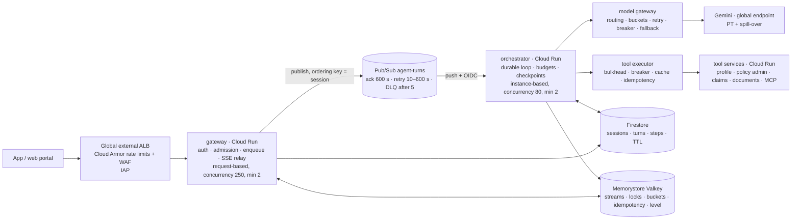

# Scaling Agentic Solutions on Google Cloud

**This document is the long-form companion to [the primer](01-scaling-primer.md). It is for an engineer who takes the design through a review.** The way to scale an agent system is to put a limit on tokens, not to add servers. This document works through that idea from end to end. It covers the arithmetic, the reference architecture, the mechanisms and the failure modes. The example is a customer-service agent that runs on Cloud Run and Gemini.

*The platform facts and prices are as of September 2026 (verify). Part 3 has figures for rates, tokens, concurrency, cost, Provisioned Throughput and what breaks first. The capacity model of this lab, `scalelab.capacity`, calculates these figures (`python -m scalelab.capacity`, output in [03-capacity-plan.md](03-capacity-plan.md)). The rows for tool calls, gateway instances, Firestore, Redis and Pub/Sub use the same arithmetic, done by hand (§3 tells which is which).*

*The behavioural findings come from a simulation: `scalelab.sim` load tests against a simulated model pool. The sections have numbers, so that you can refer to each section by itself in design reviews.*

This document uses five kinds of callout:

- **In practice**: how a principle appears in an actual build, and how to say it in a design review.
- **Scenario**: a specific situation that shows the mechanism clearly.
- **Key figures**: numbers to keep available during a capacity review.
- **Confirm before committing**: facts that change (prices, model identifiers, platform limits).
- **Common misstep**: the mistake that occurs most often in actual designs.

---

## 0. The core idea

In an agent system, the things that look like a classic capacity problem are instances, connections, queue depth and database throughput. In fact, all of them are small and low-cost next to one number: **tokens per minute at the model.** Your whole organisation shares that resource, and you cannot buy it by the instance.

Thus the design work has three parts:

- **Make demand predictable**, with admission control, model routing, prompt caching and context compaction.
- **Make the system degrade rather than collapse** when demand is more than supply, with degradation levels, load shedding and model fallbacks.
- **Make every turn survive failure**, because a long, multi-step unit of work that writes to systems of record makes failure likely. The mechanisms are checkpoints, idempotency keys and at-least-once delivery.

> **In practice.** Open any capacity review with the unit of work and the binding constraint: "The unit of work is a *turn*. Each turn is two to three model calls of approximately five thousand tokens. Thus 100,000 conversations a day is about fourteen million input tokens a minute at peak. That is above our tier baseline, and it is the constraint that the design must stay within. Cloud Run will not be the problem." When you say this first, you move the whole discussion away from server counts.

How to read this document:

- Part 1 tells why agent workloads scale in a different way from web workloads or classic ML workloads.
- Part 2 is the discovery checklist that gives the design its shape.
- Part 3 is the arithmetic, worked on a specific example.
- Part 4 is the reference architecture.
- Part 5 goes through each mechanism for scale, with the numbers that show the need for it.
- Parts 6 and 7 are about the failure modes and the growth path in stages.
- Part 8 goes through a capacity review.
- The appendices hold the configuration details, the Google Cloud service mapping and the reference figures.

---

## 1. Why agent workloads scale differently

### 1.1 The unit of work is a turn, not a request

A web request is stateless and short, and all web requests are similar. To scale it, you add replicas until CPU becomes the limit. A *turn* of an agent is a loop. It has a model call that plans, tool calls that get or change something, and another model call that answers. Sometimes it has more calls.

The model decides the length of the turn at run time. Its steps are sequential, because each step depends on the step before it. Its middle steps have side effects in systems that are possibly not yours. Also, the memory of the loop (the context) grows as the conversation continues.

| Property | Web request | ML inference request | Agent turn |
|---|---|---|---|
| Duration | 10–200 ms | 20–500 ms | 3–30 s, variable |
| Steps | 1 | 1 | 2–8, decided at run time |
| Binding resource | CPU / DB connections | GPU seconds | tokens per minute at a shared model pool |
| Cost driver | requests | requests | tokens × steps × context length |
| State | none, or a row | none | a transcript that grows, plus checkpoints |
| Side effects | in your own database | none | in the policy, claims and billing systems |
| Failure unit | retry the request | retry the request | resume the *step*, never repeat a write |

Everything in the rest of this document comes from that last column.

### 1.2 The binding constraint is model throughput, and it is shared

On the Gemini Enterprise Agent Platform, the pay-as-you-go path ("Standard PayGo", successor to dynamic shared quota) has no constant quota for each project. Your organisation gets a tokens-per-minute *baseline* for each model family. The baseline depends on your spend in the 30 days before now. For Flash and Flash-Lite, the baseline is 2 M, 4 M or 10 M TPM at tiers 1, 2 and 3. For Pro, it is 0.5 M, 1 M or 2 M. Your organisation can send bursts above the baseline on a best-effort basis.

A `429` response does not mean "you hit a number". It means "there is contention on the shared pool right now". The documented response is exponential backoff, use of the global endpoint, and smooth traffic within the minute. Guaranteed capacity is a separate purchase: Provisioned Throughput. You buy it in generative-scale units (GSUs), by the week, month, quarter or year. Pay-as-you-go spill-over is on by default.

Two consequences shape every design. First, the capacity plan is a *token* budget. You calculate the demand in tokens per minute before you calculate anything else. Second, every other team in the organisation shares the pool with you. Thus the shape of your traffic affects your own error rate and the error rate of all the other teams. To make your traffic smooth is a good-neighbour obligation as much as an optimisation.

> **Key figures.** The Flash tiers are 2 / 4 / 10 M TPM, and the Pro tiers are 0.5 / 1 / 2 M TPM. Spend sets them at organisation level. One GSU of Gemini 3.5 Flash gives 675 burndown tokens per second. Burndown gives a weight of ×1 to input, ×0.1 to cached input and ×6 to output. Provisioned Throughput costs $7.14 / $3.70 / $3.29 / $2.74 per GSU-hour on 1-week / 1-month / 3-month / 1-year terms at the global endpoint, and regional endpoints add 10 %.

### 1.3 Latency is a sum of sequential tails

A turn with two tool calls has four segments on the critical path. They are the plan call, the tools, the answer call, and the streaming of the answer to the user. Model latency is the time-to-first-token plus the output tokens divided by the tokens per second. The time-to-first-token now includes *thinking* time.

Because the segments are sequential, the p95 of a turn is approximately the sum of their tails, not the tail of their sums. Thus a four-second p95 target makes four things necessary: parallel tool execution, streaming, prefetch, and a Flash-class model on the plan step.

Also, because turns are long, Little's law connects latency to concurrency. At 20 turns per second, a six-second turn means 125 turns in flight, and a twelve-second turn means 250. Each turn in flight holds memory, a session lock and an open client connection. **Slowdowns are capacity problems**, not only experience problems.

### 1.4 Cost scales with context, and context grows

The bill is tokens, and input is the largest part of it. A service turn sends 4,000–6,000 tokens of system instructions, tool schemas, customer context and conversation history to receive 300–400 back. Without compaction, the input grows by several hundred tokens each turn. Thus the tenth turn of a conversation costs a multiple of the first turn.

Three levers change the cost by integer factors:

- **Route** routine calls to a Flash-Lite-class model. Its cost per token is three to five times lower.
- **Cache** the stable prefix. The bill counts cached input at 10 %.
- **Bound** the context with compaction, tool-result truncation and output caps.

The order is important. Route and cache first, because each later percentage improvement applies to the new, lower baseline.

> **Scenario.** A policyholder opens a conversation and asks why a renewal premium rose. Then the policyholder asks about excess options, then about how to add a named driver, then about monthly payments. Because the transcript has no compaction, each model call grows from under 2,000 tokens to over 7,000 by the tenth exchange. Nothing fails, and the system sends no alert. The only visible symptom is that the cost per conversation became three times as large, without a signal.

### 1.5 Side effects mean at-least-once delivery, which means idempotency

At some point in a turn, the agent will do a real action. For example, it registers a notification of loss, opens a service request or changes a payment schedule. The process can stop after the action and before it records the action. Cloud Run gives ten seconds after `SIGTERM`, the model call can time out, and the queue can redeliver.

Exactly-once delivery is not available on the push path that you want for this design (Pub/Sub exactly-once semantics are pull-only and regional). Thus the loop must be **replayable**:

- Write a checkpoint of every step before you act on its result.
- Give every write a key from the turn, the step and the arguments.
- Let the redelivery find the checkpoint and skip the work that the loop already did.

> **Scenario.** A customer reports storm damage to a roof. The agent calls the claims system, which creates the notification, and then the platform evicts the orchestrator process before it can record the result. Pub/Sub redelivers the turn. Without an idempotency key, the customer now has two open claims for one event, and the insurer sends a loss adjuster two times. With a key, the replayed call returns the original claim reference, and the conversation continues as if nothing occurred.

### 1.6 The feedback loop that brings agent systems down

The feedback loop has these steps:

1. More load causes more `429`s from the shared pool.
2. The `429`s cause retries and longer model calls.
3. The retries and the longer model calls cause longer turns.
4. Longer turns put more turns in flight (Little's law).
5. More turns in flight use more memory, and cause more queued model calls and more retries.
6. These cause more `429`s.

Without a circuit breaker on that loop, an agent system under overload does not fail fast. It slows down for everyone until the turn deadlines expire and the users go away. By then, the users used the tokens all the same. This is the failure mode with the highest cost of all, because you pay for all of it and you satisfy nobody.

A simulated load test shows this failure in seconds (`scalelab.sim`, the lab's notebook 04, simulated numbers). The test puts 120 virtual users against a simulated 3 M TPM pool:

- With retries only, the p95 turn latency goes from 5.8 s to approximately 40 s. There are hundreds of rate-limited calls and a few dozen hard failures.
- Degradation levels and a circuit breaker, but no concurrency cap, change that into 120 fast failures.
- An in-flight cap of 30 gives a completely different result. The cap comes from the token budget of the pool. No turn fails, and the pool rate-limits no call. Admitted turns finish at a p95 of 3.6 s. Admission control sheds 17 % of attempts immediately, with a `Retry-After` header.

**Shedding quickly is kinder than queueing slowly**, and it is the only way to keep the turns that you admit inside their latency budget.

### 1.7 Multi-agent designs multiply everything

A coordinator with three specialists changes 2.2 model calls per turn into about eight. The cost increases by approximately 3.6×. The latency increases by about 2×, even when the specialists run in parallel. The probability that every hop succeeds decreases from $0.95^{2.2} \approx 0.89$ to $0.95^{8} \approx 0.66$, at 95 % reliability per hop.

Thus the correct question about a multi-agent topology is never "how do we scale the coordinator". It is "what measured problem justifies paying that multiple?" Usually, the answer is one of two things. The first is a tool set that is too large to fit well in one context. The second is permissions that must really be different for each step. For example, a claims-adjustment agent can write to the claims system, and a general enquiry agent next to it cannot.

> **Common misstep.** You describe your scale design as "we put it on Cloud Run with max instances at 100 and autoscaling handles it". Cloud Run scales the *container*. It cannot scale the token budget, the policy administration system behind the tools, or the cost per conversation.

---

## 2. The dimensions of scale — a discovery checklist

Go through this list early. For each dimension, the table gives the question that changes the design, the number from that question, and the lever that the number points to.

| Dimension | Ask | Compute | Lever |
|---|---|---|---|
| Volume and burstiness | Conversations per day? Peak-to-average ratio? What does a major event do to traffic? | conversations/s, turns/s, model calls/s at average, peak and event load | admission control, Provisioned Throughput for the base, spill-over for peaks, degradation for events |
| Turn shape | Turns per conversation, model and tool calls per turn, tokens in and out | tokens per turn, tokens per minute | routing, caching, compaction, output caps |
| Latency budget | What must the user see, and when? First token, or whole answer? | TTFT p95, turn p95, and their sum across the critical path | streaming, parallel tools, prefetch, Flash on the plan step, thinking level |
| Concurrency | How many users at once? How long is a conversation? | in-flight turns = turns/s × turn duration, concurrent sessions = conversations/s × conversation duration | in-flight cap, a gateway with a low cost per connection, per-instance concurrency |
| Model capacity | Which tier is the organisation on? Did the organisation already buy Provisioned Throughput? Which region must the data stay in? | demand TPM against baseline, GSUs for base load, break-even utilisation | Standard / Priority / Flex tiers, PT term, global or regional endpoint |
| Cost | What does a contact that a person handles cost today? What is the budget? | $ per conversation, $ per month, and the share of each lever | route, cache, compact, batch offline work, per-turn budgets |
| Tools and downstream | Which systems, at what QPS ceiling and p95? Which calls have side effects? | tool calls/s per system against its limit | prefetch, caching, bulkheads, circuit breakers, idempotency |
| State | What must survive a crash? A restart? A region failure? How long do you keep transcripts? | writes/s per collection and per document, document size, retention | checkpoints in Firestore, hot state in Redis, TTLs, compaction |
| Tenancy and fairness | One brand or many? Which classes must the system never shed (broker portal, adviser assist, VIP)? | turns/min per tenant, priority classes | per-tenant buckets, priority bypass, separate quotas |
| Geography and residency | Which countries? Is it necessary to process the data in the region? | regional premium of 10 %, fewer models on regional endpoints | global endpoint unless residency forbids it, multi-region services with failover |
| Change | How often do prompts, tools and models change? What are the model retirement dates? | cache invalidations per change, models with 45-day retirement clocks | prompt versions in cache keys, model ids in configuration, canary rollouts |
| Observability | What tells you that it works? What sends a page to someone at 3 a.m.? | SLIs: availability, latency attainment, shed rate, cost per conversation | low-cardinality metric labels, one trace per turn, burn-rate alerts |

> **In practice.** Say clearly which dimensions you do *not* design for on purpose, and why: "Single tenant, single region, no residency requirement. Thus we use the global endpoint and skip per-tenant quotas in version one. Here is where they will go when the broker portal arrives." To name the omissions is what makes the design possible to review.

---

## 3. The arithmetic, worked

The worked example is a fictional mid-size insurer, Meridian Assurance. It has a policyholder service agent in its mobile app and web portal. The agent answers coverage and billing questions, retrieves policy documents, quotes renewals and registers notifications of loss. The assumptions in §3.1 are ordinary on purpose. The method is the important part.

This part has figures for rates, tokens, concurrency, cost, Provisioned Throughput and what breaks first. These figures are the output of `scalelab.capacity.plan()` with its default `Scenario`. That is the same model as [03-capacity-plan.md](03-capacity-plan.md). In that file, the customer profile service and the policy administration system have the names CRM and billing system (same 200 and 40 QPS ceilings). `tests/test_scalelab.py` pins these figures.

To calculate the example again for other volumes, turn shapes or prices, change the `Scenario`. Then run it again. The rows for tool calls, gateway instances, Firestore, Redis and Pub/Sub use the same arithmetic, done by hand.

### 3.1 Assumptions

| Assumption | Value |
|---|---|
| Conversations per day | 100,000 |
| Peak hour against daily average | 3× |
| Major-event spike against average | 10× (a severe-weather event sends everyone to the chat at the same time). Of the intents, 75 % are "how do I report damage" and "am I covered". |
| Turns per conversation | 6 |
| Model calls per turn | 2.2 (plan, answer, sometimes a third) |
| Tool calls per turn | 1.3 |
| Input tokens per model call | 5,000. Of these, 3,000 are the stable prefix (instructions, policy text, tool schemas). The prefix is in the cache 90 % of the time. |
| Output tokens per model call | 350, with thinking at the LOW level included |
| Turn duration (p50) | 6 s. Users take approximately 60 s to read and reply. |
| Models | Gemini 3.5 Flash as standard, 3.5 Flash-Lite for 35 % of calls (routing, short answers), 3.1 Pro Preview for rare hard cases |
| Downstream ceilings | Customer profile service 200 QPS, policy administration system 40 QPS |
| Organisation tier | Flash tier 3: 10 M TPM baseline |

### 3.2 Rates and tokens

| Quantity | Average | Peak | Major event |
|---|---:|---:|---:|
| Conversations / s | 1.16 | 3.47 | 11.6 |
| Turns / s | 6.94 | 20.8 | 69.4 |
| Model calls / s | 15.3 | 45.8 | 153 |
| Tool calls / s | 9.0 | 27.1 | 90.3 |
| Input tokens / min | 4.58 M | 13.75 M | 45.8 M |
| … of which uncached | 2.11 M | 6.33 M | 21.1 M |
| Output tokens / min | 321 k | 963 k | 3.21 M |
| Input TPM against 10 M baseline | 0.46× | **1.38×** | **4.58×** |

The calculation, in plain steps:

- 100,000 ÷ 86,400 ≈ 1.16 conversations a second.
- × 6 turns ≈ 7 turns a second.
- × 2.2 calls ≈ 15 model calls a second.
- × 5,000 tokens × 60 ≈ 4.6 M input tokens a minute.

Peak is three times that: 13.75 M, which is already above the tier baseline. A major event is ten times the average: 45.8 M, or four and a half times the baseline.

The conclusion is not "buy more". The conclusion is that **peak fits only if we decrease tokens or buy capacity, and we must shape the event**. The reason is that no purchase makes 46 M TPM appear within a minute.

> **Confirm before committing.** Find out if cached tokens count at full weight against the PayGo TPM baseline. They count at 0.1 against Provisioned Throughput, and the documentation says so. The documentation is less clear about how PayGo counts them. Plan as if they count fully. If they count less, treat the difference as a gain.

### 3.3 Concurrency, from Little's law

In-flight turns are turns per second times turn duration. That gives 6.9 × 6 ≈ **42** at average, **125** at peak and **417** during a major event.

Concurrent *sessions* are about eleven times larger, because users pause between turns. A conversation lasts 6 × (6 + 60) ≈ 400 seconds. Thus there are 1.16 × 400 ≈ **460** sessions at average and **4,600** during an event.

The two numbers set the size of different things. In-flight turns set the size of the orchestrator memory, the session locks and the model concurrency. Concurrent sessions set the size of the open streaming connections at the gateway and the hot session state in Redis. A common cause of under-provisioned gateways is a design that confuses the two numbers.

The token budget also puts a cap on concurrency, and this is the most important number. The budget is 10 M TPM ÷ 60 ≈ 167,000 tokens per second. A turn uses 2.2 × 5,350 ≈ 11,800 tokens over six seconds, or about 2,000 tokens per second. Thus the baseline is sufficient for approximately **85 turns in flight, or 14 turns per second**. This is the start value for the in-flight cap of the admission controller, and it is *below* peak demand. That gap is the whole story of this example.

### 3.4 Cost per conversation

| Configuration | Per model call | Per conversation | Per month |
|---|---:|---:|---:|
| All Gemini 3.5 Flash, no caching | $0.0107 | $0.141 | $427 k |
| All 3.5 Flash, prefix cached | $0.0070 | $0.092 | $281 k |
| 35 % of calls on 3.5 Flash-Lite, prefix cached | — | **$0.068** | **$206 k** |

The calculation for a 3.5 Flash call has three parts:

- 2,300 uncached input tokens at $1.50/M.
- 2,700 cached tokens (the 3,000-token prefix at a 90 % hit rate) at $0.15/M.
- 350 output tokens at $9/M.

The call costs $0.00345 + $0.0004 + $0.00315 ≈ $0.0070. Thirteen calls per conversation cost ≈ $0.092. When you route a third of them to Flash-Lite, the cost becomes $0.068.

A contact that a person handles costs several dollars. Compared with that, all three rows are low-cost. Compared with each other, they differ by 2×. At this volume, that is $220,000 a month, which is worth an afternoon of engineer time.

Output tokens are the largest single line, but there are fourteen times fewer of them. The reason is that output is six times the price of input on this model. **Output caps and thinking levels are cost levers, not only latency levers.**

> **Confirm before committing.** The prices are for the global endpoint as of September 2026:
>
> - 3.5 Flash: $1.50 / $9.00 per M tokens (cached input $0.15).
> - 3.5 Flash-Lite: $0.30 / $2.50.
> - 3.1 Flash-Lite: $0.25 / $1.50.
> - 3.6–3.8 Flash: $0.75 / $3.75 introductory until 31 December 2026, then $1.50 / $7.50.
> - 3.1 Pro Preview: $2 / $12, and two times that above 200 k context.
>
> Regional endpoints add 10 %. The Priority tier is 1.8×. Flex and Batch are 0.5×.

### 3.5 Provisioned Throughput

You buy Provisioned Throughput in GSUs, per model. One GSU of 3.5 Flash gives 675 *burndown* tokens per second. The burndown of a call is

$$
\text{uncached input} \times 1 + \text{cached input} \times 0.1 + \text{output} \times 6.
$$

A call in this example has a burndown of 4,400–4,700 tokens. Thus one GSU serves about 0.14 calls per second. The standard model gets 65 % of calls. To carry all of that share on Provisioned Throughput, you need 69 GSUs at average, 207 at peak and 688 during a major event.

| Term | $ per GSU-hour | $ per M burndown tokens at 100 % utilisation | Break-even utilisation against PayGo at $1.50/M |
|---|---:|---:|---:|
| 1 week | 7.14 | 2.94 | 196 %, never |
| 1 month | 3.70 | 1.52 | 101 %, never |
| 3 months | 3.29 | 1.35 | 90 % |
| 1 year | 2.74 | 1.13 | 75 % |

Thus Provisioned Throughput is not a discount unless you commit for a year *and* keep the units three-quarters busy. If you buy sufficient units for peak (207 GSUs), the average utilisation is 33 %, and the cost is more than pay-as-you-go. Usually the correct answer has two parts. Buy sufficient units for the base (69 GSUs, about $138,000 a month on a one-year term). Then let the peaks spill over to the Priority or Standard tiers.

What Provisioned Throughput really buys is an SLA, and protection from contention on the shared pool, for the most important traffic. That is why the request headers let you specify, per call, "dedicated only", "spill over to Priority" or "bypass PT entirely".

> **In practice.** "We use Provisioned Throughput for the base load on a long term, and spill-over for the peak. For the major event, we *shape* the traffic. Calculate the break-even utilisation before you commit to a term, because a one-month term never costs less than pay-as-you-go."

### 3.6 The rest of the estate

| Resource | Average | Peak | Major event | Limit or note |
|---|---:|---:|---:|---|
| Orchestrator instances (80 in-flight turns each, ×1.4 headroom) | 1 | 3 | 8 | Cloud Run is not the constraint |
| Gateway instances (250 open streams each) | 2 | 2 | 3 | minimum 2 for warm capacity |
| Firestore ops / s | 42 | 125 | 417 | collection ramp: 500, then +50 % every 5 min. ~1 write/s per document. |
| Redis ops / s | 280 | 830 | 2,800 | one 2-vCPU Valkey node handles ≈ 120 k ops/s |
| Pub/Sub messages / s | 7 | 21 | 69 | 5 KB each: small |
| Policy administration QPS | 1.7 | 5.2 | 17.4 | ceiling 40: a good margin, but cache documents all the same |
| Customer profile QPS | 4.9 | 14.6 | 48.6 | ceiling 200: prefetch at the start of the session, cache the profile |

The whole Cloud Run fleet for this system is a few dozen vCPUs. That is approximately **0.1 % of the model bill**. Capacity estimation for agent systems is really token estimation, and this table is the evidence for that statement.

### 3.7 What breaks first

| Condition | Resource | Demand against limit | Solution |
|---|---|---:|---|
| Major event | Model TPM baseline | 4.6× | shape demand (admission, degradation), PT for the base, decrease tokens per call |
| Peak | Model TPM baseline | 1.4× | PT or a custom tier, caching, compaction, more routing to Lite |
| Major event | Policy administration system | 0.43× | cache documents for minutes, bulkhead, degrade to cached answers |
| Major event | Customer profile service | 0.24× | prefetch at the start of the session, five-minute profile cache |
| Major event | Redis | 0.02× | nothing necessary |
| Major event | Firestore | 0.08× | pre-warm collections before launch day |

---

## 4. The reference architecture

```mermaid
flowchart LR
  U[App / web portal] --> LB[Global external ALB<br/>Cloud Armor rate limits + WAF<br/>IAP]
  LB --> GW[gateway · Cloud Run<br/>auth · admission · enqueue · SSE relay<br/>request-based, concurrency 250, min 2]
  GW -- publish, ordering key = session --> PS[(Pub/Sub agent-turns<br/>ack 600 s · retry 10–600 s · DLQ after 5)]
  PS -- push + OIDC --> OR[orchestrator · Cloud Run<br/>durable loop · budgets · checkpoints<br/>instance-based, concurrency 80, min 2]
  OR --> MG[model gateway<br/>routing · buckets · retry · breaker · fallback]
  MG --> G[Gemini · global endpoint<br/>PT + spill-over]
  OR --> TE[tool executor<br/>bulkhead · breaker · cache · idempotency]
  TE --> TS[tool services · Cloud Run<br/>profile · policy admin · claims · documents · MCP]
  OR <--> FS[(Firestore<br/>sessions · turns · steps · TTL)]
  OR --> RS[(Memorystore Valkey<br/>streams · locks · buckets · idempotency · level)]
  GW <--> RS
  GW --> FS
```

This is the path of a turn from end to end. The client posts a message. The gateway authenticates the message. It examines the token bucket of the tenant and the global in-flight cap, and it decides the current degradation level. It writes the turn to Firestore and publishes to Pub/Sub, with the session id as ordering key. Then it starts to relay the event stream of the turn to the client over server-sent events.

Pub/Sub pushes the message to the orchestrator with an OIDC token. The orchestrator takes the session lock in Redis. It loads the session and any steps that already have a checkpoint. Then it runs the loop under a budget:

1. It makes a model call through the model gateway. The deltas go into the Redis stream as they arrive.
2. It writes a checkpoint of the step to Firestore.
3. It runs the tool calls in parallel through the tool executor.
4. It writes a checkpoint again.
5. It repeats these steps, and then finishes.

Then it writes the transcript, publishes the terminal event, decreases the in-flight gauge and acknowledges the push. History compaction runs *after* the terminal event. That is why the orchestrator uses instance-based billing.

### 4.1 Why it is shaped this way

**Gateway and orchestrator are separate services** because they scale on different signals and fail in different ways. A streaming connection costs a coroutine and a few kilobytes to hold. Thus the gateway runs at high concurrency on request-based billing, and its instances are low-cost. The loop costs model tokens, tool calls and the memory of a full context, and thus the orchestrator runs at moderate concurrency on instance-based billing. That billing also means that the platform does not throttle the CPU for background work after the response goes out. The applicable per-instance limits are different too: the 1,000-connection and 800-requests-per-second caps for a gateway instance, and memory per in-flight turn for an orchestrator instance.

**A queue sits between them even though the user is waiting**, for three reasons:

- It changes a burst into a backlog with one number that you can monitor, and not into a pile of failed requests. The number is the age of the oldest turn that has not started.
- It gives at-least-once execution with redelivery, and that is what makes the loop durable.
- It separates the drain rate of the orchestrator from the arrival rate. Thus the token bucket, not the load balancer, sets the pace.

The cost is a few tens of milliseconds.

**Events travel through Redis Streams rather than a direct connection**. The reason is that the orchestrator instance that runs the turn is not the gateway instance that holds the client. A stream with sequence numbers also gives resume-after-reconnect (`Last-Event-ID`) at no cost. SSE clients need this on Cloud Run, because there every stream is a request with a 60-minute ceiling.

**Firestore holds durable state and Redis holds hot state** because their access patterns are opposites. The Firestore pattern is a small number of document writes per turn, under an approximately one-write-per-second-per-document rule and a 1 MiB document cap. The Redis pattern is thousands of sub-millisecond counter, lock and bucket operations per second. To put the two into one store is the most common mistake of all in these designs.

**The model gateway is a library, not a service**, because an extra network hop on the critical path costs latency. Also, the state that it needs (buckets, breaker state, the rate-limited ratio) fits in Redis. It becomes a service when many agents share one quota and need a central policy. Apigee or the Agent Gateway of the platform has that role at enterprise scale.

### 4.2 Runtime alternatives

| Runtime | Select when | What you give up | Settings for scale |
|---|---|---|---|
| **Cloud Run** (this design) | You want to see and adjust every mechanism for scale. You have services in different languages. Cloud Run is already in the estate. | You operate the queue, the stores and the loop yourself | concurrency, min/max instances, billing mode, CPU/memory, Direct VPC, timeouts |
| **Agent Runtime** (managed, formerly Agent Engine) | Python agents on ADK. You want managed sessions, Memory Bank, sandboxed code execution and identity, with the least infrastructure. | Less control: min instances 0–10, max up to 1,000, container concurrency default 9, 1–8 vCPU and up to 32 GiB. A default **90 queries per minute** quota that you must raise before any load test. Cold latency ≈ 4.7 s, against ≈ 0.4 s warm. | min/max instances, container concurrency, resource limits, quotas |
| **GKE Autopilot** | Kubernetes is already the platform. GPUs for self-hosted models. Queue-depth autoscaling with KEDA. Service mesh. | The most operational surface. Slower iteration. | HPA/KEDA on queue depth or custom metrics, pod resources, node pools |

In an honest summary, Agent Runtime is the sensible default for a Google-native team. Cloud Run is the correct selection when a platform team wants to own the compute, or when the agent is not Python-first. The *mechanisms* in Part 5 are the same in all three runtimes. Only the place where you configure them is different.

---

## 5. The scaling mechanisms

### 5.1 Quota strategy and traffic smoothing

You must shape the demand for the model before it gets to the pool. Three layers do that work.

An **in-flight cap at the gateway** (see 5.3) puts a limit on the number of turns that can generate tokens at the same time. A **token bucket per model** in the model gateway spreads calls evenly within each minute. Its size is your share of the tier baseline, and it refills continuously. The **choice of endpoint and tier** decides the capacity that you use:

- The global endpoint, unless residency forbids it. The reason is that it routes to the region with the most available capacity, and the tiers apply there.
- Priority PayGo for customer traffic that must not wait in a queue.
- Flex for latency-tolerant background work at half price.
- Batch for anything that can wait a day.

The *capacity* of the bucket is the burst that you accept. Its *rate* is the sustained tokens per second. A six-second burst allowance is a good default. A smaller allowance gives smoother traffic and fewer rate-limit errors, but more time in client-side queues.

Sometimes the bucket cannot admit a call within a bounded wait. Make the gateway treat this as a rate-limit signal of its own. Make it count the signal toward the degradation level. Then make it try a sibling model with its own pool before it fails. When there is more than one orchestrator instance, the bucket must be in Redis. A Lua-scripted Redis bucket is atomic and costs one round-trip per call.

Provisioned Throughput connects at the same place. For each request, you select *dedicated* (PT only, `429` when exhausted), *spill-over* (the default: PT first, then PayGo) or *shared* (PayGo only). You also select which tier takes the spill. The `traffic_type` field of the response tells you which pool served the call, and it belongs on your dashboard. At scale, PT enforcement windows are short: one to five seconds above 50 GSUs. Thus you must make bursts smooth to second granularity, not minute granularity, to stay inside a commitment.

> **Key figures.** The documented guidance for `429`s is exponential backoff, the global endpoint and smooth traffic within the minute. The Gemini 3.x context-cache minimum is 4,096 tokens (6,144 on 3.7/3.8 Flash and 3.1 Pro). The default TTL of an explicit cache is 60 minutes. Storage costs $1.00 per M tokens per hour on Flash, and $4.50 on 3.1 Pro.

### 5.2 Retries, jitter, breakers and fallbacks

Retry with exponential backoff and **full jitter**. Full jitter is a uniform draw between zero and the backoff. When a shared pool throttles, every client sees the error at the same moment. Without jitter, every client also retries at the same moment, and then the retry wave is as large as the original. A simulation has 200 clients that retry against a pool with capacity for 40 per second. With jitter, the simulation finishes much sooner, and with a fraction of the secondary rate-limit errors.

If the response has a `Retry-After`, obey it, and add a small jitter on top of it. Never retry after the deadline of the turn. A retry that cannot finish in time only spends tokens.

A **circuit breaker per model and per tool** changes repeated failures into fail-fast decisions for a cool-down period. It uses a half-open probe to recover. Breakers are more important for agents than for web services. The reason is that a dependency with a fault does more than slow one request. It holds hundreds of coroutines *with their contexts in memory* until their deadlines expire.

If a model breaker opens, or two consecutive rate-limit errors arrive, the correct action for the gateway is to move to a **sibling model**. The order is 3.5 Flash, then 3.7 Flash, then 3.5 Flash-Lite. Each family has its own pool, and thus the error rate of a sibling is almost independent. For this reason, model identifiers belong in configuration, never in code. That is also how you survive the 45-day retirement clock on short-lived Flash releases.

**Hedging** sends a second identical request when the first has no answer after a selected delay, and keeps the winner. It is a p99 tool for small, idempotent calls without streaming, such as intent classification. It uses extra calls to get a lower tail latency. If you send the hedge at approximately the p90, it usually decreases p99 by a third to a half, for a few percent more calls. If you send it earlier, p99 decreases by half again, but the number of calls is almost two times larger.

A hedge is incorrect for streaming answers, because you cannot take back the streamed answer of the loser. It is also incorrect when the pool already has contention, because it adds load exactly when load is the problem. Use the degradation level as the gate for hedges.

### 5.3 Admission control and graceful degradation

Admission control is the circuit breaker on the feedback loop of 1.6. It sits at the gateway, before a turn costs anything. It asks three questions in this order:

1. Is this tenant within its budget? The check uses a token bucket per tenant, so that one brand cannot use all of the global pool.
2. What is the current degradation level of the system?
3. Does this turn take the system over the in-flight cap?

The cap starts at the token-budget figure from 3.3. Then you adjust it from load tests. Priority classes bypass it, for example an adviser-assist console, a broker portal or a VIP segment.

The system calculates the degradation level from signals that every instance can publish:

- the in-flight turns,
- the age of the oldest queued turn,
- the share of rate-limited model calls in the last minute,
- a flag that shows if any model breaker is open.

The system writes the level to Redis, so that every gateway and orchestrator degrades together. Each level gets capacity, and gives something up for it.

| Level | Trigger | What changes | Effect in the worked example |
|---|---|---|---|
| 0 | normal | — | ≈ $0.005 per turn on Flash |
| 1 | in-flight ≥ 80 % of cap, or queue age ≥ 10 s, or rate-limited ratio ≥ 5 % | Answers move to Flash-Lite with a shorter output cap. Optional tools are not available. | about a quarter of the level-0 cost, turns approximately twice as fast |
| 2 | a model breaker open, or rate-limited ratio ≥ 15 % | Flash-Lite with minimal thinking and a short cap. No writes and no slow tools. A prepared event bulletin where one applies. | about a fifth of the level-0 cost |
| 3 | in-flight ≥ cap, or queue age ≥ 30 s | shed everything below priority 2 with a `503` and a `Retry-After` that grows with the level | bounded latency for the admitted traffic |

Two details make the difference between an implementation that works and a diagram. First, the level needs **hysteresis**. Hold a raised level for ten to fifteen seconds before you let it go down. If you do not, the level will go up and down between 1 and 3 each time traffic crosses the cap. Second, **the client must add jitter** to `Retry-After`. If it does not, every shed user comes back at the same time, and the gateway sheds them together again.

> **Scenario.** A hailstorm crosses three counties on a Sunday afternoon. Traffic is ten times normal, and 75 % of it is "how do I report damage" and "does my policy cover this". Level 2 answers exactly that intent from a prepared event bulletin plus cached policy text, at a fifth of the cost and half the latency. It does not touch the policy administration system, and that is exactly the system that you want to protect during the dispatch of loss adjusters. Customers with unrelated billing questions see an agent with slightly shorter answers, and nobody sees a spinner for forty seconds.

### 5.4 Durable execution

The loop writes a checkpoint of every step to Firestore *before* it acts on the result of the step. After a model call, the checkpoint holds the response of the model. This includes the parts that the next call must send back unchanged, such as the thought signatures of Gemini 3. After a tool step, the checkpoint holds the tool results, compacted.

On redelivery, the orchestrator replays the turn from its checkpoint and skips the completed steps. The tool executor gives every write a key from the turn, the step, the call index and a hash of the arguments. It stores the result under that key for a day. Thus a redelivered turn that already registered a notification of loss gets the same claim reference back, and does not create a second one. A simulated crash test (the lab's notebook 02) stops the process immediately after the checkpoint of the claim. After redelivery, the test shows one claim, and four of five steps resume from the checkpoint.

The queue contract is the other half. Pub/Sub push acknowledges on any `2xx` and redelivers on anything else. Its push backoff grows from 100 ms to 60 s. The retry policy of the subscription adds a 10–600 s exponential backoff. After five attempts, the message goes to a dead-letter topic with its own alert.

Make the orchestrator return `503` only for transient infrastructure trouble. Make it return `200` for every *terminal* outcome, graceful failure included. A turn can end with "I could not complete that; a colleague will follow up". Do not retry that turn into a second bill. The acknowledgement deadline (≤ 600 s) is the ceiling for one delivery. The turn budget (45 s) is well below it.

A session lock in Redis, with the turn id as its value, makes the turns of each session run one at a time. This is true even when a redelivery and a new turn overlap. The TTL of the lock is the budget plus a margin. Thus an instance that stops releases the lock automatically.

Firestore gives the layout its shape:

- A session document. Compaction keeps it bounded and well under 1 MiB.
- A turn document per user message, with steps appended atomically. `ArrayUnion` is idempotent for identical elements, which is exactly what a replayed step needs.
- Tool results truncated to a few kilobytes *in the checkpoint and also in the transcript*.
- An `expires_at` timestamp with a TTL policy.
- No counters inside documents.

A turn writes its document a small number of times over several seconds. That is well inside the sustained one-write-per-second-per-document guidance.

### 5.5 Context engineering for scale

Lay out the prompt for the cache, in this order:

1. System instructions, policy text and tool schemas, byte-identical for every user and every turn.
2. The prefetched profile of the customer.
3. A summary of older turns.
4. The last N messages, verbatim.
5. The new message.

Implicit prefix caching bills the identical prefix at 10 % when the prefix is above the minimum. The minimum is 4,096 tokens on Gemini 3.x, and 6,144 on 3.7/3.8 Flash and 3.1 Pro. For large prefixes, an explicit cache with a TTL is in front of it, and makes the result deterministic.

The prompt *version* must be part of the cache key, so that a prompt change invalidates the cache cleanly. Without the version, a prompt change decreases the hit rate by half, with no signal. The explicit-cache break-even is under one request per hour on Flash. Storage is not the reason to hesitate. The reason is the operational overhead (TTL refresh, version management).

**Compaction** keeps input bounded. When the pending history goes above a token threshold, a call on the Lite tier summarises everything except the verbatim tail. This occurs *after* the turn completes, off the critical path. Without compaction, the first model call of a twelve-turn conversation grows from under 2,000 to over 7,000 tokens. With compaction, the call stays near 2,400. Over twenty turns, that is approximately 385,000 against 184,000 input tokens: three times the cost.

The loop truncates tool results before they go into the transcript: a 180-line policy schedule becomes 600 tokens, not 3,600. The loop does not replay the tool traffic of earlier turns at all, because the answer of the assistant itself already carries the facts. The loop sets an output cap for each task, and a thinking level for each task. The thinking level is minimal for routing and extraction, low for answers, and medium only for the rare hard case. The bill counts thinking tokens as output, and 3.8 Flash at high effort uses about 30 % more of them than 3.7.

### 5.6 Tools at scale

The tools are usually the real bottleneck, because the systems behind them have a capacity for people who work at the speed of a person. A few hundred concurrent turns can saturate a claims or policy administration platform that easily serves 400 contact-centre agents.

The tool executor applies these mechanisms, in this order:

1. A **bulkhead**: a semaphore per tool per instance, so that slow policy-system calls cannot occupy every worker.
2. A **circuit breaker** per tool.
3. A **result cache** for pure reads: the profile for five minutes, policy documents for two, event status for thirty seconds.
4. The **idempotency check** for writes.
5. A **timeout**.
6. **One retry for idempotent reads only**.

Send failures back to the model as *structured data*, for example "policy system unavailable, retry in 10 s". Never send them as exceptions that abort the turn. The model can usually give an answer when one fact is not available. An aborted turn is the outcome with the highest cost of all: you paid for every token and delivered nothing.

Two habits remove most tool latency from the critical path. **Prefetch** the profile and the active policies of the customer when the session starts. Do not let one call sit inside the plan step of the first turn. Also, let the model send independent calls in a single step, so that they run concurrently (profile and event status together). Then the tool time of the turn is the maximum, not the sum.

Tool services run as their own Cloud Run services, with their own service accounts and invoker bindings. Thus they scale and fail independently. An MCP server over the same tools makes discovery standard, and lets Agent Registry and Agent Gateway see and control the calls. The cost is one more hop. For this reason, run the MCP server in the same region, with keep-alive connections.

### 5.7 Streaming and connections

Server-sent events over HTTP/1.1 chunked transfer is the correct transport for a chat agent on Cloud Run. It goes through every proxy, and it supports resume natively through `Last-Event-ID`. It is also a plain request. Thus it counts against instance concurrency, and the request timeout applies to it (default 5 minutes, maximum 60). For this reason, clients must reconnect with the last sequence number, and the relay must serve from the stream, not from memory.

Responses without chunked transfer have a cap of 32 MiB, but streams do not. WebSockets also work, but they need session affinity, which is best-effort. They also need cross-instance fan-out through Redis in either case.

The time-to-first-token that the user sees arrives only after the plan call, then the tools, then the answer call. In the simulated load tests, that is about four seconds. A two-second TTFT target is possible only with streaming of *progress* events ("checking your policy documents…") from the tool steps. The event stream already carries these events. Design this on purpose. The first progress event, not the first token of the answer, sets how fast the agent seems to respond.

### 5.8 Budgets, multi-agent topologies and tenancy

Give every turn a budget with four independent dimensions: steps, model calls, tokens and dollars. Also give it a wall-clock deadline. The reason is that each one fails in a different way:

- Tool thrash uses up steps.
- A long transcript uses up tokens.
- A Pro-model fallback uses up money.
- A slow policy system uses up time while the user watches a spinner.

A turn that uses all of a budget ends *gracefully*, with a message and a terminal event, and the system does not retry it.

In multi-agent topologies, the budget is hierarchical: the budget of the coordinator puts a limit on the sum of the budgets of its specialists. Specialist calls go through the same model gateway and the same buckets. Thus fan-out cannot escape admission control. The arithmetic in 1.7 is the argument to keep available. Each specialist needs a measured problem as its justification (the rate of incorrect tool calls, context too large for one prompt, permissions that must differ). Also, state in the design which metric will start the split.

For tenancy, the design has three parts:

- per-tenant token buckets at the gateway,
- tenant labels on every metric and cost record,
- a priority field on the turn that bypasses the in-flight cap for classes that the system must never shed.

For regions, use the global endpoint for the model unless residency forbids it. Regional endpoints cost 10 % more and carry fewer models, because 3.1 Pro Preview and the newest Flash releases are global or multi-region only. Cloud Run multi-region services with Service Health failover cover the stateless tier. Firestore multi-region covers the durable tier. Redis is per region, and the event relay stays in the region that runs the turn. That is what Pub/Sub push delivers by default.

The configuration details for compute, state and observability are in Appendices A, B and C.

---

## 6. Failure catalogue

| Failure | Symptom | Mechanism that catches it | Mitigation |
|---|---|---|---|
| Rate-limit storm on the shared pool | rate-limited ratio increases, turns become longer, in-flight grows | bucket waits, breaker, degradation levels 1–2 | smooth traffic, sibling fallback, PT for the base, shed at level 3 |
| Retry synchronisation | a secondary error wave as large as the first | jittered backoff, deadline-bounded retries | full jitter, obey `Retry-After` and add jitter to it |
| Slow-motion collapse | p50 goes from 6 s to 40 s and nothing technically "fails" | in-flight cap, queue age | admission control derived from the token budget, shed fast |
| Tool thrash / runaway loop | many steps, same tool, same arguments | step and call budgets, duplicate-call detection | structured tool errors, step cap, cost alert |
| Context overflow | Tokens per call increase from turn to turn. Cost per conversation slowly increases. | compaction threshold, output caps | compaction, tool-result truncation, no more replay of old tool traffic |
| Poison message | one turn fails on every redelivery | dead-letter after 5 attempts, DLQ alert | acknowledge graceful failures, examine the DLQ, build replay tools |
| Duplicate side effect | two claims registered for one event | idempotency keys on writes, checkpoint before the action | replay from checkpoint, dedup store with 24 h TTL |
| Hot document | Firestore write contention on a session document | the ~1 write/s/document rule | Per-turn documents. Append steps, do not rewrite. No counters in documents. |
| Cold-start storm | latency spike on scale-out, Direct VPC NIC creation | minimum instances, startup CPU boost | pre-scale before known peaks such as renewal runs, keep instances warm |
| Noisy tenant | a spike of one brand degrades everyone | per-tenant bucket | tenant quotas, priority classes |
| Model retirement | a 45-day clock on short-lived Flash releases, the 2.5 line retires 20 October 2026 | model ids in configuration, fallbacks | pin the 12-month models for production, use a canary for the rest |
| Prompt change | cache hit rate decreases by half overnight, cost increases | prompt version in the cache key | give prompts versions, roll out with a canary and monitor the cached-token share |
| Intent-mix shift | 75 % "how do I report damage", policy system idle but profile service under heavy load | degradation level 2 with a prepared bulletin | prefetch, caches, event bulletin |
| Cost runaway | budget alert or cost-per-conversation drift | per-turn dollar budget, drift alert | budgets, spend caps, kill switch on max instances |

---

## 7. The growth path

| Stage | Conversations/day | What you need | What you can safely skip |
|---|---:|---|---|
| Pilot | ≤ 1,000 | one service, synchronous loop, per-turn budgets, structured tool errors, traces | queue, Redis, Provisioned Throughput, degradation levels |
| Production v1 | 1,000–20,000 | gateway/orchestrator split, Pub/Sub, Firestore checkpoints, idempotency, SSE relay, per-turn budgets, dashboards | PT (fits easily in tier 1–2), multi-region |
| Scale | 20,000–200,000 | admission control with degradation levels, smooth traffic at the client, sibling fallbacks, compaction and caching, PT for the base load, quarterly capacity reviews | GKE |
| Enterprise | > 200,000, multi-brand | per-tenant quotas and priorities, a negotiated custom PayGo tier, multi-region, Agent Gateway and Registry for governance, cost allocation per tenant | — |

The order of adoption is important:

1. Durability (checkpoints, idempotency) before admission control.
2. Admission control before Provisioned Throughput.
3. Provisioned Throughput before multi-region.

Let a measurement start each step. Name that measurement in the design in advance: "We add the queue when p95 during the peak hour crosses the budget. We buy Provisioned Throughput when the rate-limited ratio stays above 5 % at peak for a week. We add a second region when a residency or availability requirement says so, and not before."

---

## 8. Running a capacity review

### 8.1 A workable sequence

| Phase | What occurs |
|---|---|
| Frame | Say the goal again. Name the unit of work (the turn) and the binding constraint (tokens per minute). Agree what "working" means. |
| Discover | Go through the dimension checklist in Part 2. Give a default for each unknown, so that the review can continue: volume, peak ratio, event behaviour, turn shape, latency budget, residency, tenancy. |
| Calculate | Do the arithmetic from Part 3 in the open. The order is rates, tokens, Little's law, TPM against tier, cost per conversation, and what breaks first. |
| Design | Go through the architecture with the specific details in each box. Say clearly which parts are routine and which are hard. |
| Deep-dive | Select two areas by risk. Usually these are admission control and durable execution. Sometimes they are quota strategy, or context and cost. |
| Close | Failure modes, the growth path, what you will measure in week one, and an explicit "not in version one" list. |

### 8.2 Questions that change the design

Seven questions do most of the work:

- **What happens to traffic during a major event?** The answer points to the event factor, and to the whole degradation design.
- **Is there a Provisioned Throughput commitment already, and on what term?** The answer points to the spill-over design and the break-even.
- **Does the data have to stay in-country?** The answer points to the regional endpoint, the model availability and the 10 % premium.
- **Which downstream system has the lowest QPS ceiling?** The answer points to bulkheads, caches and prefetch.
- **What does a human-handled contact cost today?** The answer points to the ROI line that makes $0.07 per conversation clearly acceptable.
- **How many brands or tenants share this?** The answer points to fairness and per-tenant quotas.
- **What must never happen twice?** The answer points to the scope of idempotency.

### 8.3 Two worked design changes

**Growing the service agent from 5,000 to 500,000 conversations a day.**

Do the arithmetic first. 500,000 a day is five times the worked example. Thus it is approximately 70 M input TPM at peak, or seven times the tier-3 baseline. No tier fits. Thus the design has three parts:

- Provisioned Throughput for the base on a one-year term (around 350 GSUs of Flash). State the monthly figure.
- A custom tier, negotiated for spill-over.
- A serious programme to decrease tokens per call (explicit caches, compaction, Lite routing above 50 %).

Then calculate the concurrency: 625 in-flight turns at peak and about 2,000 during an event. That means 12–40 orchestrator instances, which is still small. Redis and Firestore have no problem. But the policy administration system at 87 QPS during an event is *over* its 40 QPS ceiling. Thus a document cache and level-2 degradation become necessary, not optional.

Then do the operational layer. Use per-tenant quotas if brands are part of the design, and multi-region if residency or availability needs it. Add cost allocation per brand. At the end, say what you will test first. That is a load test that copies the event intent mix, not only the event volume.

**An agent that costs $0.30 per turn with a 20-second p95 in the morning peak.**

Look at the traces first. Find where the tokens and the seconds really go, step by step. These are the usual findings and their solutions, in the order in which to apply them:

1. No caching, because the prefix is not stable or is below the minimum. Solution: change the order of the prefix and make it larger. Add an explicit cache.
2. Pro on every call. Solution: route to Flash, and to Flash-Lite for routing and short answers.
3. Context that grows without compaction. Solution: compact, truncate tool results, and stop the replay of old tool traffic.
4. Sequential tool calls. Solution: parallel calls and session-start prefetch.
5. Retries without jitter and with a long deadline. Solution: full jitter, a breaker and sibling fallback.
6. No admission control, so the peak becomes a slow-motion collapse. Solution: an in-flight cap derived from the token budget, plus degradation levels.

The expected effect is that the cost becomes four to five times lower, and p95 decreases to six to eight seconds. You also get a shed rate that you can now *see* and decide about on purpose. This replaces a latency that nobody selected.

### 8.4 Common questions, answered briefly

**Why not simply raise max instances?** The reason is that instances do not make tokens. The pool is shared, and the real cap is the token budget.

**Why a queue if the user is waiting?** It gives a backlog with one age that you can monitor, and redelivery for durability. It also gives a drain rate that the token bucket sets, not the load balancer.

**Can we get exactly-once execution?** It is not possible on the push path. Design for at-least-once with idempotency keys.

**Provisioned Throughput or pay-as-you-go?** Use PT for the base load on a long term, if the utilisation is above the break-even. Use PayGo or Priority for peaks. Shape the traffic for events.

**Synchronous or queued?** Use a synchronous call for a single-step read with a sub-second budget. Use a queue for anything with tools, side effects, or a deadline of more than a few seconds.

**What do we measure in week one?** Measure the rate-limited ratio, the queue age and the minutes at each degradation level. Also measure p95 by step, the cost per conversation, the shed rate and the cached-token share.

**When would we move to Agent Runtime?** It is time when the agent is Python-first on ADK and the team wants managed sessions, memory and identity, not its own queue and stores. Raise the default quotas before you move.

> **Common misstep.** You state a p95 without a per-step breakdown, or a cost without the token shape behind it. Or you say "we will shed load", and do not say what the user sees and when the user can retry.

---

## Appendix A — Cloud Run settings that matter

| Setting | Gateway | Orchestrator | Why |
|---|---|---|---|
| Billing mode | request-based (CPU during requests) | instance-based (CPU always allocated) | checkpoints, compaction and telemetry run after the response on the orchestrator |
| Concurrency | 250 | 80 | I/O-bound coroutines. Memory per in-flight turn is a few MB of context. |
| CPU / memory | 1 vCPU / 512 MiB | 2 vCPU / 2 GiB | JSON and validation work per step. Headroom for 80 contexts. |
| Minimum instances | 2 | 2 | Warm capacity. On-demand scale-out waits max(10 s, 3.5× predicted cold start). |
| Maximum instances | 100 | 50 | bounded by regional CPU/memory quota ÷ instance size, and by Direct VPC egress (~100–200 instances per revision) |
| Timeout | 600 s | 600 s | SSE budget plus queue plus a margin. It matches the Pub/Sub ack deadline. |
| Ingress | internal + load balancer | internal only | Traffic cannot go around Cloud Armor. Pub/Sub push from the project is internal. |
| Autoscaling | 60 % CPU over 1 min, or 60 % of max concurrency | same | The signal that needs more instances sets the count. Adaptive adjustment of concurrency decreases the effective concurrency to keep CPU below 90 %. |
| Shutdown | `SIGTERM` + 10 s | same | Write the checkpoint early. The queue redelivers. |

Two Cloud Run resource types are worth a mention for agent workloads. **Worker pools** (GA, April 2026) pull from Pub/Sub and autoscale on queue depth through the external-metrics autoscaler. They are the correct place for long-running turns that last longer than a push acknowledgement deadline. **Instances** (Preview, August 2026) are singleton, individually addressable, always-on workloads. They are a good fit for stateful agent loops.

## Appendix B — State stores and their limits

**Firestore** is for durable documents (sessions, turns, checkpoints):

- regional 99.99 %, multi-region 99.999 %,
- point-in-time recovery,
- TTL policies,
- 1 MiB documents,
- approximately one sustained write per second per document,
- 500 writes per second to a collection with a sequential indexed field,
- a ramp for new collections: 500 ops/s, then +50 % every five minutes.

**Memorystore for Valkey or Redis** is for hot state (event-relay streams, session locks, token buckets, idempotency markers, the degradation level). It gives approximately 120,000 ops/s per 2-vCPU node. Cloud Run gets to it over Direct VPC egress. Direct VPC egress needs a /26 or larger subnet, and approximately twice as many IP addresses as instances.

**Pub/Sub** is for the queue: 10 MB messages, 31-day retention and ordering keys at 1 MB/s per key. Its push quota is an order of magnitude below pull.

**Long-term memory and retrieval** (AlloyDB with ScaNN, Vertex AI Vector Search, or the Memory Bank of the platform) sits next to these stores. Its size is chunks × dimensions × bytes, which is a small number next to the token bill.

## Appendix C — Observability, SLIs and alerts

Make one trace per turn, with a span per model call and tool call. Use attributes from the OpenTelemetry GenAI semantic conventions (`gen_ai.operation.name`, `gen_ai.provider.name`, `gen_ai.request.model`, `gen_ai.usage.input_tokens` and `output_tokens`, `gen_ai.conversation.id`). These conventions are still at "Development" status. Thus keep the names in one central place, because they will change.

Use metrics with **low-cardinality labels only**: model, tool, tenant, outcome, degradation level. Never use session or turn ids. Cloud Monitoring accepts one point per five seconds per time series. Record tokens by kind, cost, latency and TTFT histograms, the rate-limited ratio and the bucket wait. Also record the breaker state, in-flight turns, queue age, shed count by reason and degradation level.

Define these SLIs:

- **availability**: turns that ended with an answer, over turns admitted,
- **shed rate**, as an SLI of its own,
- **latency attainment**: the share of turns under 8 s, and separately the first *progress* event under 2.5 s,
- **cost per conversation**, which changes without a warning each time a prompt or model changes.

Send a page for these alerts:

- Pub/Sub oldest unacknowledged age above 30 s,
- dead-letter queue above zero,
- rate-limited ratio above 5 %,
- degradation level 2 or higher for more than a few minutes,
- p95 above 8 s,
- `5xx` ratio above 2 %,
- Redis memory above 80 %,
- cost per conversation more than 30 % above its seven-day baseline.

That last alert finds a runaway loop before finance does.

## Appendix D — Google Cloud services, mapped to the mechanisms

| Mechanism | Google Cloud pieces (September 2026) |
|---|---|
| Model capacity | Gemini on the Gemini Enterprise Agent Platform: Standard PayGo tiers (organisation-level TPM baselines), and Priority (1.8×) and Flex (0.5×, Preview) tiers through request headers. Provisioned Throughput in GSUs by term, with spill-over control. Global or regional endpoints (+10 %). Batch API (0.5×, ~24 h). |
| Caching | implicit prefix caching (≥ 4,096 / 6,144 tokens), explicit caches with TTL, `usage_metadata.cached_content_token_count` |
| Thinking and output | `thinking_level` MINIMAL/LOW/MEDIUM/HIGH (3.7/3.8 Flash and 3.1 Pro reject MINIMAL), thought signatures (the next call must send them back unchanged), `max_output_tokens` |
| SDK | `google-genai` 2.22 (`genai.Client(enterprise=True, project=…, location="global")`). Pin below 3.0. SDK retries are off by default, so retry in your own gateway. |
| Compute | Cloud Run services (gateway, orchestrator, tools), worker pools (GA) for pull-based long turns, instances (Preview) for singleton agents, jobs for evaluations and batch work. Agent Runtime as the managed alternative. GKE with KEDA where Kubernetes is the platform. |
| Queue and durability | Pub/Sub push with OIDC, ordering keys, retry policy, dead-letter topics. Cloud Tasks for rate-capped, scheduled, deduplicated tool work (500/s per queue, 30-minute dispatch deadline). Workflows for long-running approvals (512 KB state, callbacks). |
| State | Firestore (Standard/Enterprise, with TTL and PITR). Memorystore for Valkey/Redis (streams, buckets, locks). AlloyDB + ScaNN or Vertex AI Vector Search for retrieval. Agent Runtime Sessions and Memory Bank on the managed path. |
| Edge | Global external Application Load Balancer with serverless NEGs. Cloud Armor rate limits (per header, cookie or IP key, with throttle or ban) and WAF. IAP (native on Cloud Run since March 2026). Apigee for spike arrest and quotas on API-shaped tools. |
| Governance at scale | Agent Registry, Agent Gateway (MCP/A2A-aware policy point, 5,000 registered resources per instance), Agent Identity (SPIFFE, mTLS + DPoP), Model Armor inline |
| Observability | Cloud Trace through OTLP (`telemetry.googleapis.com`), Cloud Monitoring custom metrics and SLOs with burn-rate alerts, log-based metrics, Managed Prometheus sidecar. Agent Observability and Evaluation on the managed path. |
| Delivery and cost | Cloud Build. Cloud Deploy canaries for Cloud Run (10/50/100 with verification). Budgets with Pub/Sub notifications (budgets do not cap spend, so connect the notification to a kill switch). Cloud Run flexible CUDs (28 % / 46 %). Cloud Run budget spend caps (Preview). |

If part of the estate is not on Google Cloud, the mechanisms translate almost one to one. You implement token buckets and circuit breakers yourself, on any platform. The product map is:

- Pub/Sub to SQS or Service Bus,
- Firestore to DynamoDB or Cosmos DB,
- Memorystore to ElastiCache,
- Provisioned Throughput to provisioned throughput on Bedrock or PTUs on Azure OpenAI,
- Cloud Run to App Runner or Container Apps.

The design is portable. Only the product names change.

## Appendix E — Reference figures

| Figure | Value |
|---|---|
| Tokens per call (service agent) | 4–6 k in, 300–400 out, with thinking included |
| Little's law | $\text{in-flight} = \text{rate} \times \text{duration}$. Sessions ≈ 11× in-flight turns when users pause for a minute. |
| Flash PayGo tiers | 2 / 4 / 10 M TPM, Pro 0.5 / 1 / 2 M |
| What 10 M TPM sustains | ≈ 14 turns/s of this turn shape, ≈ 85 turns in flight |
| Provisioned Throughput, 3.5 Flash | 675 burndown tokens/s per GSU. Output ×6, cached ×0.1. Break-even 75 % on a 1-year term, never on a 1-month term. |
| Cost per conversation | $0.14, then $0.09 (caching), then $0.07 (routing + caching) |
| Output price against input price | 6× on 3.5 Flash. This makes output caps and thinking levels cost levers. |
| Minimum cacheable prefix | 4,096 tokens (3.x), 6,144 (3.7/3.8 Flash, 3.1 Pro) |
| Cloud Run | 1,000 concurrency and 800 req/s per instance. 60-minute request ceiling. 10 s after `SIGTERM`. Scale-out waits max(10 s, 3.5× cold start). Direct VPC ≈ 100–200 instances per revision. |
| Pub/Sub push | ack ≤ 600 s, backoff 100 ms–60 s, dead-letter after 5–100 attempts, push quota ≈ 10× below pull |
| Firestore | 1 MiB documents, ~1 write/s/document, 500 then +50 %/5 min ramp |
| Valkey | ≈ 120 k ops/s per 2-vCPU node |
| Agent Runtime | 90 queries/min default quota, concurrency 9 by default, cold ≈ 4.7 s against warm 0.4 s |
| Compound reliability | $0.95^{5} \approx 0.77$, $0.95^{8} \approx 0.66$ |
| Cloud Run fleet against model bill | ≈ 0.1 % |

---

## Sources and currency

The figures come from official Google Cloud documentation, read in September 2026. The documentation covers these topics:

- Gemini Enterprise Agent Platform pricing, model pages and the lifecycle table,
- Standard, Priority and Flex PayGo,
- Provisioned Throughput and its supported-models table,
- context caching,
- batch inference,
- quotas,
- Cloud Run quotas, autoscaling, request timeouts, billing settings, Direct VPC egress and WebSockets, plus the "Host AI agents on Cloud Run" guidance,
- Agent Runtime deployment, optimisation and quotas,
- ADK 2.x,
- Pub/Sub quotas, push, dead-letter topics and subscription properties,
- Cloud Tasks and Workflows quotas,
- Firestore quotas and best practices,
- Memorystore for Valkey node specifications,
- Cloud Armor rate limiting,
- Cloud Monitoring quotas,
- the OpenTelemetry GenAI semantic conventions,
- Cloud Deploy canary deployments.

The third-party latency measurements are from Artificial Analysis.

**Re-confirm these before making a commitment**, because they change on their own schedule:

- Model identifiers and retirement dates. A new Flash release starts a 45-day clock for 3.6/3.7/3.8. The 2.5 line retires on 20 October 2026. It is possible that 3.1 Pro leaves preview.
- Flash introductory pricing, which ends 31 December 2026.
- PayGo tier baselines, and if cached tokens count against them.
- The status of Flex PayGo.
- The `google-genai` 3.0 release, which is not backward compatible.
- Cloud Run defaults, and the Preview status of instances, controls for scale and spend caps.
- Agent Runtime quotas and its concurrency formula.
- The OpenTelemetry GenAI attribute names.
