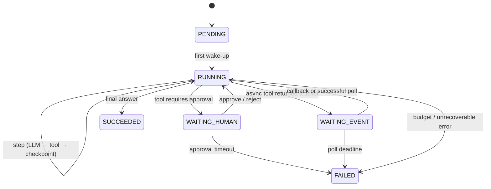
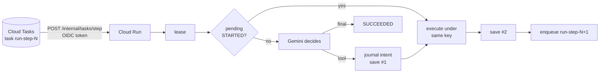

# Long-Running Agentic Workflows on Google Cloud — A Primer

*Written for explaining a design in a design review: the goal is to reason out loud about trade-offs, limits and failure modes, not to recite service names. Every pattern here has a runnable implementation in the GCP lab's [`src/lragents/`](long-running-agentic/long-running-agents-gcp/src/lragents/) and a notebook in its [`notebooks/`](long-running-agentic/long-running-agents-gcp/notebooks/).*

---

## 0. The one-paragraph version

A chat agent lives inside a request: seconds long, purely reactive, all state in RAM. A **long-running agent** has to wait — for a queue, a human, a batch job, a clock — for minutes to weeks, on infrastructure where any process can be killed at any line. The whole discipline reduces to five invariants: **durable state** (the store is the only memory), **idempotent actions** (at-least-once delivery + idempotent handlers = effectively-once), **exclusive progress** (a lease, not a lock), **bounded execution** (budgets in code, not prompts), and **hygienic context** (put each fact where its lifetime belongs). Everything else — sagas, fan-out, approvals, schedulers, ADK's `ResumabilityConfig` — is those five invariants applied to a specific kind of waiting.

---

## 1. Why "long-running" is a different problem

### 1.1 Four kinds of waiting

| Waiting for… | Example | Duration | Wake-up source |
|---|---|---|---|
| a **tool** | BigQuery export, a fine-tune job, a crawler | minutes–hours | callback/webhook, or a scheduled poll |
| a **human** | approve a payment, confirm a budget, pick between options | hours–days | HTTP endpoint (IAP), Workflows callback |
| the **world** | queue position, stock restock, a document to be filed | minutes–weeks | scheduler tick, event (Eventarc/Pub/Sub) |
| **time** | "check every 5 minutes", "run nightly" | recurring | Cloud Scheduler |

The agent must not *hold a process* across any of these. A Cloud Run instance can be scaled to zero, preempted, redeployed, or OOM-killed; a Cloud Run **service** request times out at 60 minutes; a **job** task at up to 7 days. Holding memory across a wait is not a design, it is a bet.

### 1.2 Prompts can't start themselves

The most common junior mistake: *"Monitor the presale and buy the moment it opens."* An instruction is text read by the model **when something invokes it**. Nothing reads it between turns; the model has no clock and no loop. Autonomy needs a *triggerer* (something with a clock or an event) and a *trigger* (an endpoint that can run the agent). Keep them separate: locally that is a script and a web server; on GCP it is Cloud Scheduler → (Pub/Sub) → Cloud Run.

### 1.3 The model is a non-deterministic side effect

Ask Gemini the same question twice and you may get different tool arguments. That makes the LLM call the *most dangerous* line in a retry loop: if a worker crashes after acting on a decision but before recording it, a naive retry re-asks the model, gets a different decision, and produces a second, different side effect. The fix is structural: **journal the decision before acting on it** (§3.2).

---

## 2. Mental model: the run as a durable state machine

A **run** is a document with:

* `journal` — append-only list of steps (LLM decision, tool call, human decision, external event). Event-sourced: replaying it rebuilds the prompt.
* `state` — small working state (the checkpoint proper).
* `version` — optimistic-concurrency token; every save presents the version it read.
* `lease` — `{owner, expires_at}`; who may advance the run right now.
* `budget` / `usage` — steps, tokens, dollars, deadline.
* `waiting_on` — what the run is parked on (approval token, ticket).

The rhythm of execution is **wake → do one step → checkpoint → sleep**. Each wake-up is one HTTP request from a queue; the store is the only memory. This is the same idea behind durable-execution engines (Temporal, Restate, Cloud Workflows) — here we build the minimal version by hand so the mechanics are visible, then show where the managed versions take over.

---

## 3. The five invariants

### 3.1 Durability — the store is the only memory
Checkpoint after every step. Two saves per tool step is the honest minimum: one *before* the side effect (intent) and one *after* (result). Anything not in the store after a crash never happened — including the model's reasoning.

### 3.2 Idempotency — effectively-once, not exactly-once
Every delivery mechanism on GCP is **at-least-once**: Cloud Tasks, Pub/Sub, Cloud Scheduler, Workflows retries, Cloud Run retries. Exactly-once *delivery* exists in one narrow place (Pub/Sub pull subscriptions in a region) and never covers *actions*. So the action must tolerate a replay:

1. **Write-ahead intent.** Journal `TOOL(name, args, idempotency_key) STARTED`, save, *then* execute. A retry finds the STARTED record and re-executes *the same call with the same key* — it never re-asks the model.
2. **Idempotency key = `run_id:step_index`** — stable across retries, unique across runs. Pass it downstream (`Idempotency-Key` header, Stripe-style) **and** memoise locally (`idempotency_keys/{key}` in Firestore). Defence in depth: a crash between "executed" and "memoised" is covered by the downstream key.
3. **Named wake-ups.** Cloud Tasks rejects a task whose name was seen recently; name the next step `run-step-N` so a double enqueue collapses.
4. **Duplicate-delivery guard.** If the journal already contains the step this delivery was for, re-enqueue the next (named) task and return 200.

Test it the way the GCP lab's [`tests/test_durable_loop.py`](long-running-agentic/long-running-agents-gcp/tests/test_durable_loop.py) does: inject a crash *after* the side effect, let the lease expire, retry, assert one charge.

### 3.3 Exclusivity — leases, not locks
Two Cloud Run instances can receive the same task 50 ms apart. A **lease** (`acquire_lease` as a transactional compare-and-set with a TTL) makes the second one fail fast (`LeaseHeld` → HTTP 429 → the queue retries later). Leases *expire*, which is the difference from a lock: a dead worker cannot wedge a run forever. Long steps extend the lease (heartbeat). The `version` field is the second half: optimistic concurrency on every save catches the race the lease didn't.

### 3.4 Boundedness — budgets are code
An autonomous loop has no natural end; "stop when done" is decided by a probabilistic model. Deterministic limits — `max_steps`, `max_tokens`, `max_cost_usd`, a wall-clock deadline, `max_iters` for reflection loops, a poll deadline for async tools, an approval TTL — are checked in code before every model call. They are the circuit breaker, the cost cap and the blast-radius limit in one place. Never put them in the prompt.

### 3.5 Context hygiene — every fact has a shelf life
Long runs accumulate context. ADK makes the lifetimes explicit and it is a good taxonomy for any stack:

| Where | Lifetime | Put here |
|---|---|---|
| conversation history (events) | the session; gets **compacted** into summaries | what was said |
| `temp:` state | one invocation | scratch; **lost on resume** |
| session state (unprefixed) | the session | this booking's decisions, the agreed budget |
| `user:` state | every session of this user | preferences that must survive the conversation |
| `app:` state | every user | app-wide config |
| artifacts (`gs://`) | independent | large payloads — save the 6 KB seat map, return a filename |
| long-term memory (Memory Bank / RAG) | indefinite, curated | explicit `remember()` calls |

Two consequences: (a) **summaries paraphrase** — anything you cannot afford to lose goes in state, not the transcript; (b) **stale context is worse than missing context** — an agent with missing data asks; an agent with a stale seat map *acts*. Re-verify volatile facts in a code guard immediately before any mutating call (`before_tool_callback`), never rely on the prompt to do it.

---

## 4. The pattern catalogue

Each pattern: the problem, the shape, the GCP mapping, the failure modes, and where it lives in this repo.

### P1 · Durable agent loop (`patterns/durable_loop.py`, notebook 01)

**Failure modes → mitigations:** crash after side effect (memo + key) · duplicate delivery (journal index guard + named tasks) · zombie worker (lease TTL) · runaway (budget) · unknown tool / tool error (journal as observation, let the model correct itself) · hot document (one run = one writer; fine).

### P2 · Orchestrator / workers, fan-out–fan-in (`patterns/fan_out_fan_in.py`, notebook 02)
Planner LLM → N subtasks → Pub/Sub topic (or N Cloud Tasks) → idempotent workers → transactional counter on the run doc → *the write that reaches N* enqueues the named `aggregate` task → synthesis LLM. **Fan-in is the hard part**: side effects outside the transaction; late duplicates must also observe `all_done` (the enqueue is idempotent, so let them); N > ~50 writers on one Firestore doc contend (~1 write/s guidance) → one doc per subtask + count query, or hand the join to **Cloud Workflows `parallel`** (`infra/workflows/fan_out_fan_in.yaml`).

### P3 · Human-in-the-loop gate (`patterns/hitl.py`, notebook 03)
Tool marked `requires_approval` → run parks `WAITING_HUMAN` with the *exact* proposed call and a single-use token → notify → `POST /runs/{id}/approve` (behind IAP) → journal `HUMAN` + the approved call as a `STARTED` intent → normal loop executes it. **Rules:** approve what you execute / execute what was approved (never re-plan after approval); every gate has a TTL (Scheduler-driven expiry → explicit FAILED + escalation); double-clicks are no-ops. Managed alternative: Cloud Workflows `events.create_callback_endpoint` + `await_callback` (`infra/workflows/hitl_approval.yaml`) — the execution *is* the durable wait.

### P4 · Saga / compensating transactions (`patterns/saga.py`, notebook 03)
Flight → hotel → card across systems with no shared transaction. Failure at step k runs compensations k-1…0 in reverse, one per wake-up, each journaled with its own key. A compensation that fails permanently is an **escalation** (`on_stuck`), never silence. The LLM may plan the saga; the runner owns the forward/compensate state machine.

### P5 · Scheduled / heartbeat agent (`patterns/scheduled.py`, notebook 03)
Cloud Scheduler → Pub/Sub → push → `/tick`. Three bugs and their fixes: overlap (lease), duplicate ticks (`next_due`), zombies (lease TTL + heartbeat). Keep the tick small; hand long work to P1.

### P6 · Reflection / evaluator–optimizer (`patterns/reflection.py`, notebook 02)
generate → critique (score + feedback, separate prompt with no shared context) → revise, until `score ≥ threshold` **or** `iter ≥ max_iters`. Stop conditions in code; every iteration a checkpoint; the history doubles as an eval dataset.

### P7 · Long-running tool: ticket + poll/callback (`durable_loop.poll / resume_with_event`, notebook 01)
The tool returns a ticket immediately; the run parks `WAITING_EVENT`. Either the external system calls `POST /internal/callbacks/{run}/{ticket}` (preferred) or a **delayed Cloud Task** (`schedule_time`) polls with exponential back-off capped at a max interval and a total deadline. No process waits. This is exactly ADK's `LongRunningFunctionTool` + `ResumabilityConfig`, and the reason ADK distinguishes `join_queue` (long-running: work continues after return) from `check_queue` (synchronous: never mark it long-running or the run would pause every time it checks).

### P8 · Workflow graph: rules as code, judgement as agents (`adk/nightly_workflow.py`, notebook 04)
Split the flow: steps with one right answer (take one queue ticket, check position, format the brief) are **function nodes**; steps needing judgement (which show, which section, take B or nothing) are **agent nodes**. Rigid sequences are exactly what probabilistic models eventually get wrong when nobody is watching. ADK 2's `Workflow` gives you this with `RequestInput` interrupts, `rerun_on_resume` per node and `ctx.route` for conditional edges.

---

## 5. GCP building blocks — and the numbers that decide the design

Numbers verified 5 Sep 2026; re-check before relying on them (see "Verify" list at the end).

| Service | Role in a long-running agent | Limits & semantics you should quote |
|---|---|---|
| **Cloud Run services** | the trigger: HTTP handlers for steps, approvals, callbacks, Pub/Sub push | request timeout default 5 min, **max 60 min**; instances scale to zero and are not guaranteed to finish work after the response (use always-on CPU or Tasks for background work); concurrency per instance configurable; min instances kill cold starts |
| **Cloud Run jobs** | one long step that can't be split (a 4-hour crawl) | task timeout default 10 min, **up to 168 h (7 days)** per attempt (GPU tasks 1 h); tasks/parallelism; retries per task; can be triggered by Scheduler or the Jobs API |
| **Cloud Tasks** | "wake run X for step N, not before T" | at-least-once; **named tasks de-duplicated** (window roughly 1 h–24 h depending on how the queue was created — treat as best-effort); `schedule_time` up to **30 days** ahead; retention 31 days; 500 dispatches/s per queue; task ≤ 1 MiB; per-queue rate/concurrency limits and retry back-off; HTTP targets with OIDC/OAuth tokens; dispatch deadline for HTTP targets up to 30 min |
| **Pub/Sub** | fan-out, decoupling schedulers from services, event ingress | at-least-once; retention configurable up to 31 days; ack deadline 10–600 s; exactly-once delivery only for **pull** subscriptions (regional); ordering keys; dead-letter topics with max delivery attempts; push endpoints must ack within the deadline (do the work fast or hand off to Tasks) |
| **Cloud Scheduler** | the clock | cron with time zone; retries; at-least-once (can double-fire); targets: HTTP, Pub/Sub, App Engine |
| **Cloud Workflows** | managed durable orchestration | an execution can run/wait **up to 1 year**; `await_callback` default 12 h (set it explicitly); `parallel` branches with shared variables; declarative retry/back-off; connectors that poll long-running GCP operations; quota of 10,000 concurrent executions per region (backlogged beyond that); priced per step, so tight polling loops cost money — prefer callbacks |
| **Firestore** | run documents, idempotency keys, leases | transactions (optimistic, retried on contention); document ≤ 1 MiB; keep sustained writes to any one document to ~1/s; TTL policies for key expiry; native emulator for local tests |
| **Cloud SQL / AlloyDB (Postgres)** | ADK session store (`postgresql+asyncpg://…?host=/cloudsql/…`); relational journals when you need SQL over runs | connection limits matter with many Cloud Run instances — use the Cloud SQL connector / pooling |
| **Spanner** | very high write rates or global consistency across regions | strong consistency, horizontal scale; more ops overhead and cost — justify it |
| **Memorystore (Redis/Valkey)** | leases and counters with TTL at high rates | sub-ms, but in-memory: never the only copy of a journal |
| **Cloud Storage** | ADK artifacts (`gs://`), large tool outputs, memory files | keep big payloads out of the prompt; return a URI |
| **Eventarc** | wake on GCS/Audit-log/Pub/Sub events | at-least-once; ADK's `trigger_sources=["eventarc"]` |
| **Gemini on Vertex AI (Agent Platform)** | the model; `google-genai` SDK, ADC auth, no API keys | 1M-token context on Gemini 3.x; structured output; function calling; preview aliases change often — pin a model id per environment |
| **Agent Runtime** (Gemini Enterprise Agent Platform; formerly Vertex AI Agent Engine Runtime) | managed hosting for ADK/LangGraph agents with **Sessions** and **Memory Bank** | no container to own, query API, managed scaling; wake-ups must come from outside via its query endpoint (ADK's trigger routes exist only when you host the FastAPI app yourself) |
| **ADK 2 (Python)** | the framework: `App`, `ResumabilityConfig`, `EventsCompactionConfig`, `LongRunningFunctionTool`, `Workflow` + `@node(rerun_on_resume=…)`, `RequestInput`, `before_tool_callback`, session/artifact/memory services by URI, `runner.rewind_async` | resume is **at-least-once** and best-effort; `temp:` state is lost on resume; the built-in Pub/Sub trigger route creates a *new* session per message |
| **Cloud Logging / Trace / Monitoring** | run_id/step_id correlation, OpenTelemetry spans per LLM/tool call | `trace_to_cloud=True` in ADK; log-based metrics for cost per run |
| **Secret Manager / IAM** | tool credentials, OIDC between services | one service account per role; `--no-allow-unauthenticated`; IAP on human endpoints |

### 5.1 Choosing the runtime (the decision everything else hangs on)

| Question | If yes → |
|---|---|
| Is the flow a fixed graph with known branches and mostly HTTP calls? | **Cloud Workflows** owns orchestration; Cloud Run does the LLM steps |
| Does the flow need per-step LLM judgement about *what to do next*? | **Durable loop on Cloud Run + Cloud Tasks + Firestore** (P1) or **ADK `Workflow` on Cloud Run + Cloud SQL** |
| Do you want managed sessions/memory and no container? | **Agent Runtime**; add an external triggerer for wake-ups |
| One step > 60 min and not splittable? | **Cloud Run job** for that step; park the run around it (P7) |
| Thousands of concurrent runs, many writes/s? | Firestore per-run docs are fine; move counters/leases to Memorystore or Spanner if a *single* doc gets hot |
| Regulated side effects (money, PII writes)? | Add P3 gates in code, keys downstream, an audit journal you can replay |

Rule of thumb: put durability in the platform (Workflows callbacks, Cloud Tasks scheduling, Firestore transactions) and keep the agent code thin; a hand-rolled durable loop is for when the *model* must decide the next node.

---

## 6. Three reference architectures

### A. Durable loop on Cloud Run (this repo's `service/app.py`)
Cloud Run (FastAPI) ← Cloud Tasks (named tasks, OIDC) · Firestore (runs, keys) · Gemini · Cloud Scheduler → Pub/Sub → `/internal/scheduler/tick` (expire approvals, heartbeat agents) · external webhooks → `/internal/callbacks`. **Pros:** full control, cheapest at scale, every step is one small stateless request. **Cons:** you own the orchestration bugs; three services to secure.

### B. Cloud Workflows as the durable orchestrator
Workflows YAML holds the graph (`parallel` fan-out, `await_callback` for humans, `retry` blocks, `sys.sleep` for polls); Cloud Run exposes `/worker`, `/aggregate`, `/notify`, `/approve`. **Pros:** durability, waits and retries are declarative; executions can wait up to a year; execution history is the audit log. **Cons:** dynamic, model-chosen control flow is awkward (the graph is static YAML); per-step pricing punishes tight loops; expressions are limited.

### C. ADK 2 on Cloud Run with Cloud SQL sessions (this repo's `adk/`)
`get_fast_api_app(session_service_uri="postgresql+asyncpg://…", artifact_service_uri="gs://…", trigger_sources=["pubsub"])` in one container; `Workflow` graph with `RequestInput` interrupts; Cloud Scheduler → Pub/Sub → `/wake` resumes the *existing* session. **Pros:** framework-native interrupts/resume/compaction; local dev with `adk web` and SQLite; same agent code from laptop to Cloud Run byte-for-byte. **Cons:** resume is best-effort/at-least-once (tools must be idempotent anyway); the framework is moving fast (pre-GA configs); you still own wake-up plumbing.

(D: the same ADK agent on **Agent Runtime** — swap the runner, keep the agent, drive wake-ups from outside. Best when the customer wants a managed surface and Memory Bank out of the box.)

---

## 7. Resource estimation (say the numbers out loud)

Scenario: 10,000 active runs/day; each run ≈ 12 LLM steps, 6 tool calls, one 30-minute wait, ~4k input / 300 output tokens per step.

* **Wake-ups:** 10k × (12 + 6 + polls ≈ 4) ≈ 220k Cloud Tasks/day ≈ 2.5/s average, 25/s peak with 10× burst — one queue (500/s ceiling) is plenty; set `max_concurrent_dispatches` to protect Cloud Run.
* **Firestore writes:** ≈ 2 saves per tool step + 1 per LLM step ≈ 24/run → 240k writes/day plus keys — trivial; per-document rate is ≤ 1/s because one run has one writer.
* **Tokens:** 10k × 12 × 4.3k ≈ 520M tokens/day. At Flash-class pricing this is single-digit thousands of dollars/month; at Pro-class an order of magnitude more — say which steps need Pro (planner, critic) and route the rest to Flash/Flash-Lite. Track tokens/sec and cost/run as first-class metrics, not afterthoughts.
* **Latency budget per step:** LLM p50 ~2–6 s + tool + 2 Firestore round-trips ≈ well under Cloud Run's 5-min default; raise the timeout only for known-long tools or move them behind P7.
* **Parked runs cost nothing** except storage and one scheduled task each.

---

## 8. Observability and evaluation for runs that last days

* Propagate `run_id`, `step_index` and a `trace_id` on every log line and span; one OpenTelemetry span per LLM call (model, tokens, latency, cost) and per tool call — Cloud Trace shows a run as a single timeline even across days.
* Metrics: steps/run, tokens/run, cost/run, time-in-WAITING_*, approvals pending > TTL/2, recoveries/run (the crash counter), dead-letter depth, lease conflicts.
* The journal *is* the eval dataset: replay a run's decisions against a new prompt/model offline (`ScriptedLLM` in this repo is the harness), diff the tool choices, and gate deployments on it.
* ADK: `trace_to_cloud=True`; the event stream and `adk web`'s State/Events tabs for development only — never ship the dev UI.

---

## 9. Security in one breath

Service-to-service calls use OIDC tokens minted for a dedicated service account (Cloud Tasks and Pub/Sub push both support this); Cloud Run internal routes verify audience *and* caller email; human endpoints sit behind IAP; approval tokens are single-use and compared with `hmac.compare_digest`; tools get least-privilege credentials from Secret Manager; every mutating tool passes an idempotency key downstream; the journal is the audit trail; MCP servers are treated as untrusted input (allowlist tools, validate arguments in code guards).

---

## 10. How to explain this design

1. **Clarify** which kind of waiting dominates (tool / human / world / time) and the side-effect blast radius (read-only vs money).
2. **Draw the state machine** first, then the wake-up path; name the store and the triggerer.
3. **State the invariants** and where each lives (intent-before-act in the handler; keys downstream; leases in the store; budgets before the model call).
4. **Pick the runtime with the decision table** and say the one limit that decided it (60-min request timeout; 1-year Workflows execution; at-least-once everywhere).
5. **Walk one failure** end to end: crash after side effect → lease expiry → retry → memo hit → one charge.
6. **Estimate**: wake-ups/s, writes/s, tokens/day, cost/run; name the first thing that would break at 10× (hot documents, per-step Workflows pricing, connection pools).
7. **Close** with observability and the eval loop — a Staff answer includes how you'd know it's working next month.

Code-evaluation drills (spot the bug in a loop, a fan-in, an approval handler) are in the GCP lab's [`docs/02_design_drills.md`](long-running-agentic/long-running-agents-gcp/docs/02_design_drills.md); limits with sources in its [`docs/01_gcp_cheatsheet.md`](long-running-agentic/long-running-agents-gcp/docs/01_gcp_cheatsheet.md).

---

## Verify before relying on it

* Cloud Run jobs max task timeout (7 days as of Sep 2026; was 24 h earlier) and services request timeout (60 min).
* Cloud Tasks de-dup window wording on the quotas page; max schedule time (30 days).
* Workflows `await_callback` default (12 h) and max execution duration (1 year); concurrent-execution quota.
* Current Gemini model ids on Vertex (3.x line: 3.8 Flash / 3.1 Pro / 3.5 Flash-Lite as of Sep 2026) and pricing.
* Product naming: Gemini Enterprise Agent Platform / Agent Runtime (ex-Agent Engine), ADK 2.x version and whether `ResumabilityConfig` / `EventsCompactionConfig` are still marked experimental.
* Pub/Sub exactly-once scope (pull only), max retention (31 days), ack deadline (600 s).
