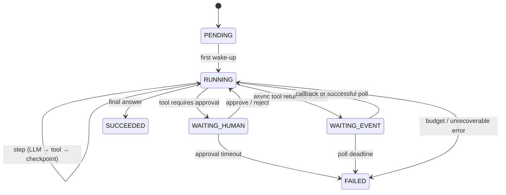
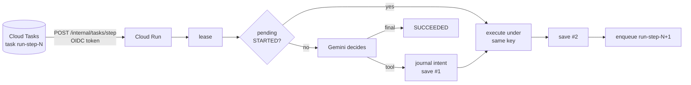

# Long-Running Agentic Workflows on Google Cloud — A Primer

*This primer is for an engineer who explains a design in a design review. The goal is to think aloud about trade-offs, limits and failure modes, not to say a list of service names. Each pattern in this primer has an implementation that you can run in the lab of this topic, [`lra-gcp`](lra-gcp/README.md) (package `lra`, in [`src/lra/`](lra-gcp/src/lra/)). Each pattern also has a notebook in the [`notebooks/`](lra-gcp/notebooks/) folder of that lab. [`lra-core`](lra-core/README.md) builds the three invariants of the engine from nothing, with the standard library. Design drills with answer sketches are at the end of the primer (§11).*

---

## 0. The one-paragraph version

A chat agent lives in one request. The request is seconds long, the agent only reacts, and all of its state is in RAM. A **long-running agent** must wait for a queue, a person, a batch job or a clock. The wait can be from minutes to weeks. The infrastructure can stop any process at any line. The full discipline is only five invariants:

- **durable state** (the store is the only memory),
- **idempotent actions** (at-least-once delivery and idempotent handlers give effectively-once),
- **exclusive progress** (a lease, not a lock),
- **bounded execution** (budgets in code, not in prompts),
- and **hygienic context** (put each fact in a place that has the same lifetime as the fact).

Everything else is these five invariants, applied to a specific kind of wait. Sagas, fan-out, approvals, schedulers and the `ResumabilityConfig` of ADK are examples.

---

## 1. Why "long-running" is a different problem

### 1.1 Four kinds of waiting

| A wait for… | Example | Duration | Wake-up source |
|---|---|---|---|
| a **tool** | a BigQuery export, a fine-tune job, a crawler | minutes–hours | a callback or a webhook, or a scheduled poll |
| a **person** | approve a payment, confirm a budget, select one of the options | hours–days | an HTTP endpoint (IAP), a Workflows callback |
| the **world** | a position in a queue, a stock restock, a document that someone files | minutes–weeks | a scheduler tick, an event (Eventarc or Pub/Sub) |
| **time** | "check every 5 minutes", "run nightly" | it repeats | Cloud Scheduler |

The agent must not *hold a process* during any of these waits. The platform can scale a Cloud Run instance to zero, preempt it, deploy it again, or stop it when it has no more memory (OOM). A Cloud Run **service** request stops after 60 minutes. A **job** task stops after 7 days at the most. A design that holds memory during a wait is a bet, not a design.

### 1.2 Prompts can't start themselves

The most common junior mistake is this prompt: *"Monitor the presale and buy the moment it opens."*

An instruction is text that the model reads **when something calls the model**. Nothing reads the instruction between turns. The model has no clock and no loop. An agent that acts by itself needs two parts. The *triggerer* is something with a clock or an event, and the *trigger* is an endpoint that can run the agent.

Keep the two parts separate. On your own computer, they are a script and a web server. On GCP, they are Cloud Scheduler and Cloud Run, with Pub/Sub between them as an option.

### 1.3 The model is a non-deterministic side effect

If you ask Gemini the same question two times, it is possible that you get different tool arguments. Thus the LLM call is the *most dangerous* line in a retry loop. A worker can crash after it acts on a decision but before it records the decision. Then a retry with no journal asks the model again and gets a different decision. That retry causes a second side effect, which is different from the first. The solution is in the structure: **write the decision to the journal before you act on it** (§3.2).

---

## 2. Mental model: the run as a durable state machine



A **run** is a document with these fields:

* `journal`: an append-only list of steps (an LLM decision, a tool call, a decision of a person, an external event). The journal is event-sourced: a replay of the journal builds the prompt again.
* `state`: a small state for the work in progress (the checkpoint itself).
* `version`: an optimistic-concurrency token. Each save sends the version that it read.
* `lease`: `{owner, expires_at}`. It tells who has permission to move the run forward now.
* `budget` / `usage`: steps, tokens, dollars, deadline.
* `waiting_on`: the thing that the run waits for (an approval token, a ticket).

The execution has a cycle: **wake, do one step, write a checkpoint, wait**. Each wake-up is one HTTP request from a queue. The store is the only memory. Durable-execution engines (Temporal, Restate, Cloud Workflows) use the same idea. This primer builds the minimum version by hand, so that you can see how its parts operate. Then it shows where the managed versions do the work instead.

---

## 3. The five invariants

### 3.1 Durability — the store is the only memory
Write a checkpoint after each step. Two saves for each tool step is the real minimum: one save *before* the side effect (the intent) and one save *after* it (the result). After a crash, anything that is not in the store did not occur. This includes the reasoning of the model.

### 3.2 Idempotency — effectively-once, not exactly-once
Each delivery mechanism on GCP is **at-least-once**: Cloud Tasks, Pub/Sub, Cloud Scheduler, the retries of Workflows and the retries of Cloud Run. Exactly-once *delivery* exists in one narrow place (Pub/Sub pull subscriptions in a region). It never applies to *actions*. Thus the action must be safe when a replay occurs:

1. **Write-ahead intent.** Write `TOOL(name, args, idempotency_key) STARTED` to the journal. Save the run. *Then* execute the call. A retry finds the STARTED record and executes *the same call with the same key* again. The retry never asks the model again.
2. **Idempotency key = `run_id:step_index`**. The key is the same for all retries of a step and different for each run. Send the key downstream (an `Idempotency-Key` header, in the Stripe style). **Also** record the result locally (`idempotency_keys/{key}` in Firestore). This gives defence in depth: the downstream key covers a crash after the execution and before the local record.
3. **Named wake-ups.** Cloud Tasks rejects a task if Cloud Tasks saw the name of that task recently. Give the next step the name `run-step-N`. Then two enqueues of the same step become one task.
4. **Duplicate-delivery guard.** If the journal already contains the step of this delivery, enqueue the next task (a named task) again. Then return 200.

Do a test of these four mechanisms in the same way as the lab's [`tests/test_durability.py`](lra-gcp/tests/test_durability.py) and [`tests/test_tool_agent_and_patterns.py`](lra-gcp/tests/test_tool_agent_and_patterns.py). Cause a crash *after* the side effect. Let the lease expire. Then retry the step. Make sure that there is one charge. For a call that the model selected, also make sure that the retry did not ask the model again.

### 3.3 Exclusivity — leases, not locks
Two Cloud Run instances can receive the same task with 50 ms between them. A **lease** (`acquire_lease`, a transactional compare-and-set with a TTL) makes the second instance fail fast. The first instance holds the lease, thus the second instance returns HTTP 503 or 429. Then the queue retries the task later.

A lease *expires*. This is the difference between a lease and a lock: a dead worker cannot block a run forever. A long step extends the lease (a heartbeat). The `version` field is the second half. Optimistic concurrency on each save finds the race that the lease did not find.

### 3.4 Boundedness — budgets are code
An autonomous loop has no natural end, and a probabilistic model decides "stop when done". The code examines deterministic limits before each model call:

- `max_steps`,
- `max_tokens`,
- `max_cost_usd`,
- a wall-clock deadline,
- `max_iters` for reflection loops,
- a poll deadline for async tools,
- an approval TTL.

These limits are the circuit breaker, the cost cap and the blast-radius limit in one place. Never put these limits in the prompt.

### 3.5 Context hygiene — every fact has a shelf life
A long run collects more and more context. ADK makes the lifetimes explicit. Its list of lifetimes is a good classification for any stack:

| Where | Lifetime | Put here |
|---|---|---|
| conversation history (events) | the session. ADK **compacts** it into summaries. | the content of the conversation |
| `temp:` state | one invocation | scratch data, **lost on resume** |
| session state (no prefix) | the session | the decisions for this reservation, the agreed budget |
| `user:` state | each session of this user | preferences that must stay after the conversation |
| `app:` state | all users | the configuration for the full app |
| artifacts (`gs://`) | independent | large payloads. Save the 6 KB seat map. Return a filename. |
| long-term memory (Memory Bank or RAG) | no time limit, curated contents | explicit `remember()` calls |

This has two consequences:

1. **A summary puts the facts in different words.** Put anything that you must not lose in state, not in the transcript.
2. **Stale context is worse than no context.** An agent that does not have the data asks. An agent with a stale seat map *acts*.

In a code guard, examine again each fact that can change, immediately before each call that changes data (`before_tool_callback`). Never depend on the prompt to examine the facts again.

---

## 4. The pattern catalogue

For each pattern, this section gives the problem, the shape, the mapping to GCP, the failure modes and the location in this repository. The paths are in [`lra-gcp`](lra-gcp/README.md), unless a path says otherwise.

### P1 · Durable agent loop (`core/engine.py`, `examples/tool_agent.py`; notebooks 01 and 05; `lra-core` notebook 01)


**Failure modes and their mitigations:**

- A crash after the side effect: the effect record and the idempotency key.
- A duplicate delivery: the journal index guard and the named tasks.
- A zombie worker: the lease TTL.
- A runaway loop: the budget.
- An unknown tool or a declared tool error: a `ToolError`. Write it to the journal as the result of the call. Then let the model correct itself. The engine retries any other exception as an infrastructure failure. See `tests/test_tool_agent_and_patterns.py`.
- A hot document: one run has one writer, thus this is not a problem.

### P2 · Orchestrator / workers, fan-out–fan-in (`patterns/orchestrator_worker.py`, notebook 03)
The flow has these steps:

1. A planner LLM makes N subtasks.
2. The subtasks go to a Pub/Sub topic (or to N Cloud Tasks).
3. Idempotent workers do the subtasks.
4. Each worker updates a transactional counter on the run document.
5. *The write that reaches N* enqueues the named `aggregate` task.
6. A synthesis LLM combines the results.

**Fan-in is the hard part**. The side effects must stay outside the transaction. A late duplicate must also see `all_done`. The enqueue of the `aggregate` task is idempotent, thus let the late duplicates enqueue it too.

When N > ~50 writers use one Firestore document, the writes contend. The guidance for one document is ~1 write/s. In that case, write one document for each subtask and use a count query. Or give the join to **Cloud Workflows `parallel`** (`workflows/research_approval.yaml`).

### P3 · Human-in-the-loop gate (`patterns/hitl.py`, notebooks 02 and 05; `lra-core` notebook 02)
The gate has these steps:

1. A tool has the mark `requires_approval`.
2. The run waits in `WAITING_HUMAN` with the *exact* proposed call and a single-use token.
3. The system sends a notification.
4. The approval arrives as `POST /runs/{id}/approve` (behind IAP).
5. The handler writes a `HUMAN` record and the approved call, as a `STARTED` intent, to the journal.
6. The usual loop executes the call.

**Rules:**

- Approve what you execute, and execute what the person approved. Never plan again after the approval.
- Each gate has a TTL. Cloud Scheduler starts the expiry, and the result is an explicit FAILED status and an escalation.
- A double-click has no effect.

A managed alternative is Cloud Workflows `events.create_callback_endpoint` with `await_callback` (`workflows/research_approval.yaml`). In this alternative, the execution *is* the durable wait.

### P4 · Saga / compensating transactions (`patterns/saga.py`, `examples/procurement_saga.py`, notebook 03)
The example is a flight, then a hotel, then a card, across systems that have no shared transaction. If step $k$ fails, the runner runs the compensations $k-1 \ldots 0$ in reverse order. It runs one compensation for each wake-up and writes each one to the journal with its own key. A compensation that fails permanently is an **escalation** (`on_stuck`), never silence. The LLM can plan the saga. The runner owns the state machine that goes forward or compensates.

### P5 · Scheduled / heartbeat agent (`patterns/scheduled.py`)
The path is Cloud Scheduler, then Pub/Sub, then a push to `/tick`. There are three bugs, and each has a solution:

- Overlap: a lease. Or do not start a run while the run of the previous tick is active.
- Duplicate ticks: `next_due`. Or one run id for each time window, with an idempotent start.
- Zombies: the lease TTL and a heartbeat, and the reaper.

Keep the tick small. Give long work to P1.

### P6 · Reflection / evaluator–optimizer (`patterns/reflection.py`, notebook 03)
The loop does three steps until `score ≥ threshold` **or** `iter ≥ max_iters`:

1. The model generates an output.
2. The critic gives a score and feedback. It uses a separate prompt with no shared context.
3. The model revises the output.

The stop conditions are in code. Each iteration writes a checkpoint. The history is also an eval dataset.

### P7 · Long-running tool: ticket + poll/callback (`patterns/async_tool.py`)
The tool returns a ticket immediately. The run waits in `WAITING_EVENT`. Then one of two things wakes the run:

- The external system calls `POST /internal/callbacks/{run}/{ticket}`. This is the preferred method.
- A **timer** wakes a poll. The timer is a delayed Cloud Task with `schedule_time`, or the reaper on Cloud Scheduler. The poll has an exponential back-off up to a maximum interval, and it has a total deadline.

No process waits. This is exactly the `LongRunningFunctionTool` and the `ResumabilityConfig` of ADK. It is also the reason why ADK makes a distinction between `join_queue` and `check_queue`:

- `join_queue` is long-running: the work continues after the return.
- `check_queue` is synchronous. Never mark it as long-running. If you do, the run pauses each time that the run does a check.

### P8 · Workflow graph: rules as code, judgement as agents (`examples/adk_ticket_queue/nightly_workflow.py`, notebook 04; optional `adk` extra)
Divide the flow into two kinds of steps:

- A step with one correct answer is a **function node**. Examples: take one queue ticket, examine the position, format the brief.
- A step that needs judgement is an **agent node**. Examples: which show, which section, take B or nothing.

Rigid sequences are exactly the work that probabilistic models do incorrectly after some time, when no person watches the models. The `Workflow` of ADK 2 gives you this division into function nodes and agent nodes, with these features:

- `RequestInput` interrupts.
- `rerun_on_resume` for the node that interrupted: run the node again, or use the resume input as its output.
- `ctx.route` for conditional edges.

---

## 5. GCP building blocks — and the numbers that decide the design

The numbers are from a check on 5 Sep 2026. Do a new check before you depend on them (see the "Verify" list at the end).

| Service | Role in a long-running agent | Limits and semantics to quote |
|---|---|---|
| **Cloud Run services** | the trigger: HTTP handlers for steps, approvals, callbacks and Pub/Sub push | The request timeout is 5 min by default, **maximum 60 min**. Instances scale to zero. There is no guarantee that an instance finishes its work after the response. For background work, use always-on CPU or Tasks. You can set the concurrency for each instance. Minimum instances prevent cold starts. |
| **Cloud Run jobs** | one long step that you cannot divide (a 4-hour crawl) | The task timeout is 10 min by default, **up to 168 h (7 days)** for each attempt (GPU tasks: 1 h). You can set the tasks and the parallelism. You can set the retries for each task. Scheduler or the Jobs API can start a job. |
| **Cloud Tasks** | "wake run X for step N, not before T" | At-least-once. Cloud Tasks **de-duplicates named tasks**. The window is approximately 1 h–24 h, and it depends on how you created the queue. Think of the de-duplication as best-effort. `schedule_time` is up to **30 days** ahead. The retention is 31 days. 500 dispatches/s for each queue. A task is ≤ 1 MiB. Each queue has rate limits, concurrency limits and a retry back-off. HTTP targets with OIDC or OAuth tokens. The dispatch deadline for HTTP targets is up to 30 min. |
| **Pub/Sub** | fan-out, a separation between schedulers and services, the entry point for events | At-least-once. You can set the retention up to 31 days. The ack deadline is 10–600 s. Exactly-once delivery is only for **pull** subscriptions (regional). Ordering keys. Dead-letter topics with a maximum number of delivery attempts. A push endpoint must ack within the deadline. Do the work fast, or give it to Tasks. |
| **Cloud Scheduler** | the clock | Cron with a time zone. Retries. At-least-once. It can send a tick two times. Targets: HTTP, Pub/Sub, App Engine. |
| **Cloud Workflows** | managed durable orchestration | An execution can run or wait **up to 1 year**. `await_callback` has a default timeout of 12 h. Set the timeout explicitly. `parallel` branches with shared variables. Declarative retry and back-off. Connectors that poll long-running GCP operations. A quota of 10,000 concurrent executions for each region. More executions go into a backlog. The price is for each step, thus tight poll loops cost money. Use callbacks when you can. |
| **Firestore** | run documents, idempotency keys, leases | Transactions (optimistic, with a retry on contention). A document is ≤ 1 MiB. Keep the sustained writes to any one document at ~1/s at the most. TTL policies for the expiry of keys. A native emulator for local tests. |
| **Cloud SQL / AlloyDB (Postgres)** | the ADK session store (`postgresql+asyncpg://…?host=/cloudsql/…`), relational journals when you need SQL across runs | Connection limits are important with many Cloud Run instances. Use the Cloud SQL connector or a connection pool. |
| **Spanner** | the highest write rates, or global consistency across regions | Strong consistency, horizontal scale. More operations overhead and more cost. Give the reason for it. |
| **Memorystore (Redis/Valkey)** | leases and counters with TTL at high rates | Sub-ms, but in memory. Never use it as the only copy of a journal. |
| **Cloud Storage** | ADK artifacts (`gs://`), large tool outputs, memory files | Keep large payloads out of the prompt. Return a URI. |
| **Eventarc** | wake-ups from GCS, Audit-log or Pub/Sub events | At-least-once. In ADK: `trigger_sources=["eventarc"]`. |
| **Gemini on Vertex AI (Agent Platform)** | the model, the `google-genai` SDK, ADC auth, no API keys | A 1M-token context on Gemini 3.x. Structured output. Function calling. Preview aliases change frequently. Set one constant model id for each environment. |
| **Agent Runtime** (Gemini Enterprise Agent Platform, old name Vertex AI Agent Engine Runtime) | a managed host for ADK and LangGraph agents with **Sessions** and **Memory Bank** | No container to own, a query API, and the platform manages the scale. Wake-ups must come from outside, through its query endpoint. ADK's trigger routes exist only when you host the FastAPI app yourself. |
| **ADK 2 (Python)** | the framework: `App`, `ResumabilityConfig`, `EventsCompactionConfig`, `LongRunningFunctionTool`, `Workflow` with `@node(rerun_on_resume=…)`, `RequestInput`, `before_tool_callback`, session, artifact and memory services by URI, `runner.rewind_async` | Resume is **at-least-once** and best-effort. A resume loses the `temp:` state. The built-in Pub/Sub trigger route makes a *new* session for each message. |
| **Cloud Logging / Trace / Monitoring** | run_id and step_id correlation, OpenTelemetry spans for each LLM call and each tool call | `trace_to_cloud=True` in ADK. Log-based metrics for the cost of each run. |
| **Secret Manager / IAM** | tool credentials, OIDC between services | One service account for each role. `--no-allow-unauthenticated`. IAP on the endpoints for people. |

### 5.1 Choosing the runtime (the decision everything else hangs on)

| Question | If yes |
|---|---|
| Is the flow a static graph with known branches and mostly HTTP calls? | **Cloud Workflows** owns the orchestration. Cloud Run does the LLM steps. |
| Does the flow need an LLM judgement at each step about *what to do next*? | **Durable loop on Cloud Run + Cloud Tasks + Firestore** (P1) or **ADK `Workflow` on Cloud Run + Cloud SQL** |
| Do you want managed sessions and memory, and no container? | **Agent Runtime**. Add an external triggerer for wake-ups. |
| Is one step > 60 min, and is it impossible to divide? | A **Cloud Run job** for that step. The run waits during the job (P7). |
| Are there thousands of concurrent runs and many writes/s? | One Firestore document for each run is not a problem. If a *single* document becomes hot, move the counters and the leases to Memorystore or Spanner. |
| Are there regulated side effects (money, PII writes)? | Add P3 gates in code, keys downstream and an audit journal that you can replay. |

The general rule has two parts. Put durability in the platform (Workflows callbacks, Cloud Tasks schedules, Firestore transactions). Keep the agent code thin. A durable loop written by hand is for the case when the *model* must decide the next node.

---

## 6. Three reference architectures

### A. Durable loop on Cloud Run (this repo's `lra-gcp/services/`)
The architecture has these parts:

- Cloud Run (FastAPI), which receives tasks from Cloud Tasks (named tasks, OIDC).
- Firestore (runs, keys).
- Gemini.
- Cloud Scheduler, which sends to Pub/Sub, which sends to `/internal/scheduler/tick`. The tick expires approvals and runs the heartbeat agents.
- External webhooks, which send to `/internal/callbacks`.

**Pros:** full control, the lowest cost at scale. Each step is one small stateless request.

**Cons:** you own the orchestration bugs. There are three services that you must make secure.

### B. Cloud Workflows as the durable orchestrator
The Workflows YAML holds the graph: `parallel` fan-out, `await_callback` for people, `retry` blocks and `sys.sleep` for polls. Cloud Run supplies the endpoints `/worker`, `/aggregate`, `/notify` and `/approve`.

**Pros:** durability, waits and retries are declarative. An execution can wait up to a year. The execution history is the audit log.

**Cons:** a dynamic control flow that the model selects is not easy, because the graph is static YAML. The per-step pricing makes tight loops high-cost. The expressions have limits.

### C. ADK 2 on Cloud Run with Cloud SQL sessions (this repo's `lra-gcp/examples/adk_ticket_queue/`)
The architecture has these parts:

- `get_fast_api_app(session_service_uri="postgresql+asyncpg://…", artifact_service_uri="gs://…", trigger_sources=["pubsub"])` in one container.
- A `Workflow` graph with `RequestInput` interrupts.
- Cloud Scheduler, which sends to Pub/Sub, which sends to `/wake`. The `/wake` endpoint resumes the session that *already exists*.

**Pros:** interrupts, resume and compaction are native to the framework. You can develop on your computer with `adk web` and SQLite. The agent code is the same, byte for byte, on a laptop and on Cloud Run.

**Cons:** resume is best-effort and at-least-once. Thus the tools must be idempotent in all cases. The framework changes fast (pre-GA configs). You still own the infrastructure code for wake-ups.

D: the same ADK agent on **Agent Runtime**. Replace the runner. Keep the agent. Send the wake-ups from outside. This option is best when the team wants a managed surface and Memory Bank that are ready for use. `lra-gcp/examples/adk_agent_engine/` deploys one.

---

## 7. Resource estimation (say the numbers out loud)

Scenario: 10,000 active runs/day. Each run has ≈ 12 LLM steps, 6 tool calls and one 30-minute wait. Each step uses ~4k input tokens and 300 output tokens.

* **Wake-ups:** 10k × (12 + 6 + polls ≈ 4) ≈ 220k Cloud Tasks/day. This is ≈ 2.5/s on average, and 25/s at the peak with a 10× burst. One queue (a ceiling of 500/s) is more than sufficient. Set `max_concurrent_dispatches` to protect Cloud Run.
* **Firestore writes:** ≈ 2 saves per tool step + 1 per LLM step ≈ 24/run. This gives 240k writes/day, plus the keys. This quantity is small. The rate for each document is ≤ 1/s, because one run has one writer.
* **Tokens:** 10k × 12 × 4.3k ≈ 520M tokens/day. At Flash-class pricing, this is single-digit thousands of dollars/month. At Pro-class pricing, it is an order of magnitude more. Say which steps need Pro (the planner, the critic). Send the other steps to Flash or Flash-Lite. Monitor tokens/sec and cost/run as first-class metrics, not as things that you add later.
* **Latency budget per step:** LLM p50 ~2–6 s, plus the tool, plus 2 Firestore round-trips. The approximate total is much less than the 5-min default of Cloud Run. Increase the timeout only for tools that you know are long, or move these tools behind P7.
* **A run that waits costs nothing** except its storage and one scheduled task.

---

## 8. Observability and evaluation for runs that last days

* Put `run_id`, `step_index` and a `trace_id` on each log line and span. Make one OpenTelemetry span for each LLM call (model, tokens, latency, cost) and for each tool call. Then Cloud Trace shows a run as a single timeline, also when the run lasts for days.
* Metrics: steps/run, tokens/run, cost/run, time-in-WAITING_*, approvals pending > TTL/2, recoveries/run (the crash counter), dead-letter depth, lease conflicts.
* The journal *is* the eval dataset. Replay the decisions of a run against a new prompt or a new model offline. `FakeLLM` and `ScriptedDecider` in `lra-gcp` are the harness. Compare the tool choices. Then use the result as a gate for deployments.
* ADK: `trace_to_cloud=True`. Use the event stream and the State and Events tabs of `adk web` for development only. Never deploy the development UI.

---

## 9. Security in one breath

These are the security controls of the design:

- Service-to-service calls use OIDC tokens for a dedicated service account. Cloud Tasks and Pub/Sub push both support this.
- Cloud Run internal routes make sure that the audience *and* the caller email are correct.
- The endpoints for people are behind IAP.
- Approval tokens are single-use. The code compares them with `hmac.compare_digest`.
- Tools get least-privilege credentials from Secret Manager.
- Each tool that changes data sends an idempotency key downstream.
- The journal is the audit trail.
- The design treats MCP servers as untrusted input. It has an allowlist of tools, and code guards make sure that the arguments are valid.

---

## 10. How to explain this design

1. **Clarify** the main kind of wait (a tool, a person, the world or time). Also clarify the blast radius of the side effects (from read-only to money).
2. **Draw the state machine** first. Then draw the wake-up path. Name the store and the triggerer.
3. **State the invariants** and the location of each one. The invariants live in these locations:
   - intent-before-act in the handler,
   - keys downstream,
   - leases in the store,
   - budgets before the model call.
4. **Select the runtime with the decision table.** Say the one limit that decided it. Examples are the 60-min request timeout, the 1-year Workflows execution and at-least-once everywhere.
5. **Walk one failure** from start to end. A crash occurs after the side effect. The lease expires. A retry occurs, and it finds the record. The result is one charge.
6. **Estimate**: wake-ups/s, writes/s, tokens/day, cost/run. Name the first thing that will break at 10× (hot documents, per-step Workflows pricing, connection pools).
7. **Close** with observability and the eval loop. A complete design says how you will know that it works next month.

Design drills are in §11 below and in the lab's [`docs/code-evaluation-drills.md`](lra-gcp/docs/code-evaluation-drills.md). The drills are system-design prompts, and bugs to find in a loop, a fan-in and an approval handler. Delivery semantics, limits, CLI and SDK snippets and an IAM sketch are in the lab's [`docs/gcp-cheatsheet.md`](lra-gcp/docs/gcp-cheatsheet.md).

---

## 11. Design drills

There are two kinds of drill:

- **system design**: a broad ask, then questions that clarify it, then a design, then trade-offs, then an estimate.
- **code evaluation**: read the code, find the bug and name the correction.

Cover the answers before you read. Six more find-the-bug snippets are in [`lra-gcp/docs/code-evaluation-drills.md`](lra-gcp/docs/code-evaluation-drills.md). Each snippet shows a defect found during the build of the engine.

### 11.1 System design prompts

#### A1. "A bank wants an agent that processes supplier invoices end to end: read the PDF, match to a PO, get approval above a threshold, schedule payment. Design it."
**Clarify:** the volume/day, the approval SLA (hours or days?) and what "schedule payment" touches (a core-banking API with idempotency keys?). Also clarify the regulatory audit needs and the override paths for a person.

**Shape:** use a P1 durable loop for each invoice (Cloud Run, Cloud Tasks and Firestore). Put a P3 gate on `schedule_payment` above the threshold, with a 3-business-day TTL and an escalation. Use Document AI for extraction as a synchronous tool (< 60 s). If the extraction is a batch, use P7. The journal is the audit trail. Use Gemini Flash for the match, and use Pro only for exceptions.

**Trade-offs to say:** compare a Workflows callback with your own approval endpoint: declarative durability against a dynamic control flow. Compare Firestore with Cloud SQL for the journal: simple operations against SQL reports. You can also export the journal to BigQuery. Examine the PO status again *immediately* before the payment (a staleness guard).

**Estimate:** 50k invoices/day give ~1M wake-ups/day (~12/s). That needs one Tasks queue. The tokens are ≈ 50k × 8 steps × 5k ≈ 2B/day. Thus select the model tier for each step. Say the order of magnitude of the monthly cost that results.

**Failure walk:** the call to the payment API gets a timeout after the charge. The intent is already in the journal with its key. The retry sends the same key again. The bank de-duplicates the call. The result is one payment.

#### A2. "Design a research agent that answers a question by reading 200 web pages in parallel."
**Shape:** P2. The planner divides the question into ≤ 50 subtasks. This cap is necessary. Pub/Sub does the fan-out.

At this N, idempotent workers write `runs/{id}/subtasks/{sid}`, not a single counter document. The orchestrator polls a count query through a delayed task every 30 s. Or use Cloud Workflows `parallel` with `concurrency_limit`.

The aggregator has a token budget. Store the fetched pages in GCS. Pass URIs.

**Trade-offs:** compare Pub/Sub with Tasks. Pub/Sub has fan-out, but no schedule for each message. Tasks has a schedule and a rate limit for each task, but no fan-out semantics. Also say why you do not use one large prompt: context limits, cost, and no partial progress.

**A trap to name:** the crash of the 200th worker after the commit. A late duplicate must also see `all_done`. The aggregate task has a name, thus the enqueue is idempotent.

#### A3. "An agent must wait for a customer to upload a document — could take two weeks — then continue."
**Shape:** the run waits in `WAITING_EVENT`. Eventarc on the GCS bucket (object finalized) sends to Pub/Sub, and Pub/Sub sends to `/internal/callbacks`, which resumes the run. There is no poll. As a backstop, a Cloud Task at +14 days makes the run expire or escalate. In Workflows, use `await_callback` with a 14-day timeout. The execution limit is a year.

**Trade-offs:** a callback against a poll (cost, latency, the dependency between the systems). Also say where the reminder lives. Tasks `schedule_time` is 30 days at the maximum. For a longer wait, make a chain of tasks.

#### A4. "Nightly, an agent reconciles 3 systems and fixes discrepancies. Sometimes a fix has to be undone."
**Shape:** Cloud Scheduler sends to Pub/Sub, and Pub/Sub sends a tick (a P5 lease and a due time). For each discrepancy, the tick starts a P4 saga with compensations. Use a Cloud Run job if the scan itself takes hours. Make each correction idempotent by the discrepancy id.

**Say:** a compensation failure gives an escalation ticket, never silence. The LLM proposes the plan for the correction. Code owns the state machine of the saga.

#### A5. "Migrate this LangGraph agent to Google's stack with minimal rewrite."
**Shape:** an ADK 2 `Workflow` on Cloud Run with Cloud SQL sessions (architecture C), or Agent Runtime for managed sessions and memory. The LangGraph parts change into these parts:

- Interrupts become `RequestInput`.
- The checkpointer becomes the URI of the session service.
- The scheduler becomes Cloud Scheduler, then Pub/Sub, then `/wake`.

**Traps:** ADK resume is at-least-once, thus the tools must be idempotent. A resume loses the `temp:` state. The built-in Pub/Sub trigger route makes a new session. Add a resume endpoint. An agent node cannot be the first node after START without an input.

#### A6. "What would you measure to know the agent fleet is healthy?"
Measure these values:

- steps/run,
- tokens/run,
- cost/run (by model),
- time-in-WAITING_*,
- approvals older than TTL/2,
- recoveries/run,
- lease conflicts,
- dead-letter depth,
- poll attempts per async tool,
- Tasks queue depth against dispatch rate,
- p95 step latency.

Also run offline replay evals from journals on each prompt change or model change.


### 11.2 Code evaluation — find the bug

#### B1. Retry-safe? (Python)
```python
def step(run_id):
    run = store.get(run_id)
    decision = llm.decide(prompt(run))
    if decision.kind == "tool":
        result = tools[decision.name](**decision.args)      # e.g. charge a card
        run.journal.append({"tool": decision.name, "args": decision.args, "result": result})
        store.save(run)
    enqueue_next(run_id)
```
**Bugs:** (1) There is no write-ahead intent. If a crash occurs after the tool call, the retry asks the model again. Then the retry can charge again, with different arguments. (2) The code sends no idempotency key downstream. (3) `store.save` has no version check, thus two concurrent deliveries both succeed. (4) `enqueue_next` after the save has no name, thus the duplicates cause a fan-out.

**Correction:** write `STARTED` and the key to the journal. Save. Execute the call under the key. Save with `version`. Enqueue a named task.

#### B2. Fan-in counter (Python, Firestore)
```python
def on_subtask_done(run_id, sid, result):
    doc = db.collection("runs").document(run_id)
    snap = doc.get()
    fan = snap.get("fan")
    fan["results"][sid] = result
    fan["completed"] += 1
    doc.update({"fan": fan})
    if fan["completed"] == fan["expected"]:
        publish("aggregate", run_id)
```
**Bugs:** the read-modify-write has no transaction, thus concurrent writes lose updates. There is no duplicate guard (`sid` already present). `publish` is not idempotent. If the process stops between `update` and `publish`, nothing starts the aggregation.

**Correction:** use a transaction with the `sid in results` guard. Return `all_done` from the transaction, also for a duplicate. Enqueue a *named* task.

#### B3. Approval handler
```python
@app.post("/runs/{run_id}/approve")
def approve(run_id, approved: bool):
    run = store.get(run_id)
    if approved:
        decision = llm.decide(prompt(run) + "\nThe human approved. Proceed.")
        execute(decision)
    run.status = "RUNNING"; store.save(run)
```
**Bugs:** there is no check of the token or of the caller. The handler asks the model again after the approval, thus the call that runs can be different from the approved call. The handler is not idempotent: a double click executes two times. The handler sets the status to RUNNING also on a reject, and it gives no feedback to the model. There is no lease.

**Correction:** make sure that the token is correct, with a constant-time comparison. Write `HUMAN` and the stored call to the journal as a `STARTED` intent. Let the loop execute the call. If the status is not `WAITING_HUMAN`, do nothing.

#### B4. ADK node
```python
@node
def check_front(ctx):
    while venue.position(ctx.state["ticket"]) > 0:
        time.sleep(5)
    return {"ready": True}
```
**Bugs:** the node blocks the process. Then the Cloud Run request timeout applies, there is no resume, and you pay for idle CPU. The node must return `RequestInput` and have `rerun_on_resume=True`. Do not mark a synchronous check as long-running. But a wait must release the process.

#### B5. Which tool is long-running?
```python
tools=[LongRunningFunctionTool(func=check_queue), join_queue]
```
**Bug:** the code marks the incorrect tool as long-running, and not the correct one. `join_queue` returns a handle to work that is still in progress, thus it is long-running. `check_queue` returns an answer for one point in time. If you mark it as long-running, the run pauses on each status check. This includes the check that tells the agent that the agent is at the front of the queue and must buy now.

#### B6. Scheduler tick
```python
@app.post("/tick")
def tick():
    run = store.get("presale-monitor")
    if time.time() - run.state["last_tick"] > 300:
        do_work(run)
        run.state["last_tick"] = time.time(); store.save(run)
```
**Bugs:** two instances that receive the same tick both pass the time check, because there is no lease. When Cloud Scheduler sends the tick two times, the work occurs two times. A crash inside `do_work` holds nothing, thus a retry runs it again. This is acceptable only if `do_work` is idempotent. Is it?

**Correction:** `acquire_lease` (TTL), `next_due` and an intent record.

#### B7. Cloud Tasks handler status codes
```python
@app.post("/internal/tasks/step")
def handle(env):
    try:
        loop.step(env["run_id"])
    except Exception:
        return {"ok": False}          # HTTP 200
```
**Bug:** the handler hides errors with a 200. This tells Cloud Tasks that the work is complete, thus the run stops with no warning.

**Correction:** let exceptions come out as 5xx (a retry with back-off). Return 429 on `LeaseHeld`. Return 200 only after a durable commit. Add a dead-letter or an alert at the maximum number of attempts.

#### B8. Budget in the prompt
```python
instruction = "Stop after at most 10 tool calls and never spend more than $2."
```
**Bug:** a prompt cannot make the model obey a limit. The model has no counter and no cost meter.

**Correction:** call `check_budget(run)` before each model call, with a `usage` that the code adds up from `usage_metadata`. The run FAILS with a reason.


### 11.3 Rapid-fire (one sentence each)
* Why two saves per tool step? The intent goes before the act, and the result after it, because the model is non-deterministic.
* A lease against a lock? A lease expires, thus a dead worker cannot block the run.
* Exactly-once? Only pull-subscription delivery is exactly-once, and actions never are. Thus use idempotent handlers.
* Workflows against a loop written by hand? Workflows has a static graph and declarative waits. But a loop written by hand lets the model select the next step.
* Why cap subtasks? A cap limits the cost, the fan-in contention and the context of the aggregator.
* `rerun_on_resume` True/False? For the node that interrupted, True runs the node again and examines the world again, and False uses the resume input as its output. A resume never replays finished nodes, but a *new* invocation replays them.
* Where does a 6 KB seat map go? It goes in an artifact (GCS). Return a filename.
* Why not `time.sleep` in a node? It holds a process. Return an interrupt, so that a clock can wake you.

### 11.4 Questions from the notebooks

The notebooks of the labs end with these questions. Each sketch is one possible answer.

1. **Your loop saves two times for each tool step. Which crash window does each save close? Which window is still open, and what closes it?**

   The intent save closes the window of a second model call after a crash: the retry finds the pending call. The result save closes the window where the step runs again after it finished. One window is still open: after the tool returns and before the result save. The effect record, which the code writes before the checkpoint, closes it inside your system. The idempotency key that you send downstream closes it for the external system. The key also covers a crash after the execution and before the record.
2. **The same wake-up reaches two instances 50 ms apart. Describe what each instance does.** Both instances read the run. One instance takes the lease. The other gets "lease held" and returns 503/429, thus the queue retries the wake-up later. If there is no lease, the version check on the save rejects the checkpoint of the slower writer. When the retry arrives, the `(run, step, attempt)` guard finds that the task is stale.
3. **A tool call takes 45 minutes.** Do not hold a request. Return a ticket. Let the run wait on a timer or a callback (P7). Give the poll a back-off and a deadline. Or run the step as a Cloud Run job, and let the run wait during the job.
4. **500 subtasks: what breaks first on Firestore, and what are two solutions?** The single parent document breaks first (approximately one sustained write a second). The first solution: write one document for each subtask, and count them with a query. Or divide the counter into shards. The second solution: give the join to Cloud Workflows `parallel` with a concurrency limit. Also put a cap on the fan-out and on the context of the aggregator.
5. **A worker takes 20 minutes. Do you use a Cloud Run service, a job, or Workflows?** Use a Cloud Run job (or a service call with a sufficiently long timeout, if you cannot divide the work). A step starts the job, and then the run waits. Workflows can call the job and wait on the operation.
6. **The model call of the aggregator returns 429. What retries it, and what makes sure that there is only one synthesis?** The retry policy of the step retries it (a new attempt, a delayed task). The code writes the synthesis through an effect record that has the intent as its key. Also, the aggregate task has a name. Because of the key and the name, a duplicate finds the record.
7. **Why must you write the approved call to the journal before you wake the run? Why not send it in the wake-up?** The wake-up is at-least-once. The queue can lose it or send it two times. A retry reads the journal. "Approve what you execute" means that the executed call is the stored call. It is never a call that the code builds again from the payload or from a new model call.
8. **The approval endpoint is behind IAP. Which three checks do you do before you change the run?**

   First, the token matches in a constant-time comparison, and it is single-use. Second, the run actually waits on that gate. If not, the request has no effect, and it is not an error. Third, the caller has permission to approve this kind of action. The identity comes from IAP, not from the body.

   Then take the lease. Save with a version check.
9. **A refund compensation fails five times.** The saga stops and waits, or it fails, with an alert and a ticket (`on_stuck`). The journal shows exactly which compensations ran. Two things must not occur: a silent success, or a retry storm that runs compensations again without their keys.
10. **Which ADK nodes can be an `LlmAgent`, and which must never be one?** A judgement node can be one (which event, take B or nothing). Rules with one correct answer and side effects (take a queue ticket, buy) must stay function nodes with idempotency keys.
11. **Where does the queue ticket live so that it stays after a Cloud Run restart? What occurs if it is in a `temp:` key?** It lives in session state, which the session service stores (Cloud SQL, or Agent Runtime Sessions). A resume removes the `temp:` state. Thus the resumed node finds no ticket and joins the queue again.
12. **What identifies the paused run in the payload that goes from Scheduler through Pub/Sub to `/wake`?** The user id, the session id, the invocation id and the interrupt id, and also the response. A resume with these ids continues the paused invocation and does not start a new one.
13. **On Mistral Workflows (with Temporal under it), the model call is an activity. The worker crashes after the model answered, but before the result was in the history. What occurs, and why is it safe there but not in a loop with no journal?**

   The platform retries the activity and asks the model again. But nothing acted on the lost answer, because the workflow acts only on results that are in the history. A loop with no journal acts on the answer before it records the answer. Thus a retry can act two times, on two different answers.
14. **The orchestrator must run on your own infrastructure. What changes in `lra/adapters/mistral/workflow.py`, and what does not change?** Only two things change. The connection changes to a self-hosted orchestrator instead of the hosted one. The endpoint of the model client changes to a self-hosted open-weight model. The workflow, the activities, the signals and the idempotency keys stay the same.

---

## Verify before relying on it

* The maximum task timeout of Cloud Run jobs (7 days as of Sep 2026, 24 h before that). Also the request timeout of services (60 min).
* The text about the de-dup window of Cloud Tasks on the quotas page, and the maximum schedule time (30 days).
* The default of Workflows `await_callback` (12 h), the maximum duration of an execution (1 year), and the quota for concurrent executions.
* The current Gemini model ids on Vertex (3.x line: 3.8 Flash, 3.1 Pro, 3.5 Flash-Lite as of Sep 2026) and the pricing.
* The product names: Gemini Enterprise Agent Platform / Agent Runtime (ex-Agent Engine). The ADK 2.x version, and if `ResumabilityConfig` / `EventsCompactionConfig` still have the experimental mark.
* The scope of exactly-once delivery in Pub/Sub (pull only), the maximum retention (31 days) and the ack deadline (600 s).
