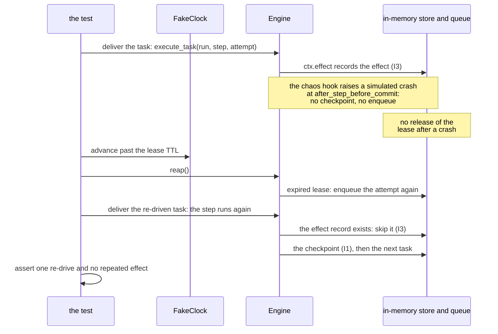

# Long-Running Agentic Workflows on Google Cloud — a primer

*This primer gives design patterns for agents that run for hours, days or weeks. It also shows how each pattern maps to a GCP service. Each pattern here has an implementation and tests in this repo. The text gives the file pointers at each pattern.*

---

## 0. TL;DR

A long-running agent is not a chatbot with a larger context window. It is a **durable state machine**, and a model selects its transitions (partly). All the difficult parts of this agent come from four facts:

1. **Workers stop.** Cloud Run scales to zero. A deploy replaces the instances. A container can stop when it is out of memory (OOM). The run must continue after its worker stops.
2. **Delivery is at-least-once.** Queues deliver a task again, and senders send a webhook two times. Each unit of work must have an idempotency key.
3. **Models go in loops.** A "keep improving until good" loop spends money with no end. Only limits on its steps, tokens, cost *and* time prevent this.
4. **Most of the run is idle.** A wait of three days for a person must cost nothing. The wait must not depend on a process that stays alive.

These four facts give this pattern:

- **Write the state to a document store as a checkpoint.**
- **Send the steps through a queue.**
- **Make each side effect idempotent.**
- **To suspend the run, write `WAITING` and do nothing more.**

On GCP, this pattern is Firestore, Cloud Tasks and Cloud Run. The pattern also uses these services:

- Pub/Sub for fan-out notifications.
- Cloud Scheduler for repair.
- Cloud Workflows when the control flow does not change.
- Agent Engine (ADK) when you want a managed runtime.

---

## 1. What "long-running" changes

| Short-lived agent (seconds–minutes) | Long-running agent (hours–weeks) |
|---|---|
| The state is the conversation. | The state is an explicit document. The conversation is a *log*. |
| One process, one request. | Many processes over time. No process owns the run. |
| On a failure, return an error. | On a failure, decide what to undo. Then decide who to tell. |
| A retry is a new call. | A retry runs *this step* again from *this checkpoint*, and it does not do the effects of the step again. |
| One context window sets the limit of the cost. | The cost has no limit, unless you set one. |
| A wait blocks the agent. | In a wait, the agent does not exist until an event arrives. |

Over days, a design with no durable state fails in three specific ways. The Google ADK team gives the same three in its guide for long-running agents:

- **Context pollution**: hundreds of turns and stale tool outputs. The model no longer knows which step it is on.
- **Token cost explosion**: each step replays the full history.
- **Hallucinated progress after idle time**: when the model resumes from a large history, it "remembers" approvals that did not occur.

The solution is in the architecture, not in a larger model. The agent reads *where it is* from the state, not from the chat.

---

## 2. The core idea in ~40 lines

If you remove everything else, a durable agent loop has three parts:

- a **run document**
- a **queue of step tasks**
- a **step function that is safe to run again**

```python
# Pseudocode of the whole engine (src/lra/core/engine.py is the real one, ~600 lines)
def worker(task):                                  # called by the queue, at-least-once
    run = store.get(task.run_id)
    if run.current_step != task.step or run.attempts[task.step] != task.attempt:
        return "stale"                             # duplicate/late delivery: ack and ignore
    run = store.acquire_lease(run.run_id, me, ttl=60s)   # one live worker per run
    state = deepcopy(run.state)                    # step works on a copy
    try:
        outcome = STEPS[run.workflow][task.step](state)   # Next(step) | Done | Wait(key) | FanOut(children)
    except Retryable:
        run.attempts[task.step] += 1               # bump attempt => old task becomes stale
        store.save(run, expected_version=run.version)
        queue.enqueue(task.run_id, task.step, run.attempts[task.step], delay=backoff(...))
        return "retry"
    run.state = state                              # --- one atomic checkpoint ---
    run.current_step = outcome.next_step           # (None if Done / a wait key if Wait)
    run.attempts[run.current_step] = 1
    store.save(run, expected_version=run.version)  # compare-and-set on version
    if outcome is Next: queue.enqueue(run.run_id, run.current_step, 1)   # AFTER the checkpoint
    if outcome is Done: notify_parent(run)
    store.release_lease(run.run_id, me)
```

Three invariants make this loop safe. It is useful to know them from memory:

- **I1: Write the checkpoint before the enqueue.** If a crash occurs between the two, the run stays consistent and its lease expires. Then a reaper re-enqueues the run. The reverse sequence can run step N+1 against a state that the engine never saved.
- **I2: `(run, step, attempt)` is the identity of work.** The queue uses this identity to remove duplicates. The worker rejects all tasks that do not agree with the run document. Thus a duplicate delivery does nothing (a no-op).
- **I3: Record each effect before the checkpoint, with its intent as the key.** `ctx.effect("charge", fn)` writes `{run:charge -> payment_id}`, and *then* the checkpoint. If a crash occurs between the two writes, the retry finds the effect record (`effect exists → skip`). Thus a retry never charges two times.

All the other parts of this primer are a result of these three lines, or an addition to them.

---

## 3. Pattern catalogue

Each pattern gives the problem, the shape, the GCP mapping, the trade-offs, and its location in this repo.

### 3.1 Durable state machine (explicit state, checkpoint per step)

**Problem.** Any worker must be able to resume the run from any point, after a wait of days.

**Shape.** Each run has one document with these fields: `status`, `current_step`, `state` (agent-owned and small), `attempts`, `history`, `budget`, `wait`, `lease`, `version`. The steps change a copy of `state`. The engine commits this copy and the transition in one atomic operation. The *prompt* of the model comes from `state` (for example, `Current step: {current_step}`), and never from a replay of the chat.

**GCP.** Use Firestore. One document holds one run, and Firestore transactions do the compare-and-set. Use Spanner if you must have transactions across documents, or a sustained rate of > ~1 write/s/document. Large artifacts (drafts, tool outputs) go to Cloud Storage. Only their URIs are in `state`.

**Trade-offs.** The 1 MiB limit on a Firestore document is a feature. Because of this limit, you must keep the state small and in summary form. The design uses optimistic concurrency (`version`), not locks. Thus writers that conflict retry. A conflict occurs rarely if the workers obey the leases.

**Repo.** `Run` is in `core/models.py`. `FirestoreStateStore.save` (transactional CAS) is in `adapters/gcp/firestore_store.py`.

### 3.2 Queue-driven step execution (at-least-once + idempotency keys)

**Problem.** A step takes seconds to minutes. It must run on a platform that can scale to zero and back.

**Shape.** Each transition enqueues one task `{run_id, step, attempt}`. The workers are stateless HTTP endpoints. Delivery is at-least-once. The stale-task guard (I2) and the idempotent effects (I3) make the result correct.

**GCP.** Use **Cloud Tasks** for dispatch. It gives these features:

- *Named tasks* give at-most-once *enqueue*. If you create a task with a name that exists, the call fails.
- `schedule_time` gives delays and timers of up to 30 days.
- A rate limit on each queue protects the model quota.
- OIDC tokens authenticate the call to the worker.

**Pub/Sub** is the incorrect tool for dispatch, because it has no dedup by name and it cannot schedule tasks. But it is the correct tool for *notifications*: progress events, audit, analytics, alerts.

**Trade-offs.** The dispatch deadline of Cloud Tasks limits one step to 30 min. A longer operation is a Cloud Run Job or a Batch job. The step *starts* this job and then `Wait`s on it. Cloud Tasks keeps a task name reserved for some time after the task completes. Put the attempt in the name, so that a retry never has the name of an earlier task of the step.

**Repo.** `CloudTasksQueue` is in `adapters/gcp/cloud_tasks_queue.py`. The worker endpoint `/tasks/step` is in `services/worker/main.py`. The queue configuration is in `infra/terraform/main.tf`.

### 3.3 Leases and the reaper (crash recovery)

**Problem.** Two workers must not execute the same run at the same time. Also, a worker that stops in the middle of a step must not leave the run stuck.

**Shape.** Before a worker executes a step, it claims `lease = {owner, expires_at}` atomically. If a different owner holds a live lease, the worker returns 503 (the queue retries later). The worker holds the lease through the commit *and* the enqueue (I1), and it releases the lease after them. A periodic **reaper** does these things:

- It re-enqueues the current attempt of each run with an expired lease.
- It re-drives the runs that lost their enqueue outside a lease.
- It expires waits.
- It spawns again each child run that does not exist.

**GCP.** The lease is in the Firestore document (one transaction). For the reaper, Cloud Scheduler calls the worker endpoint `/internal/reap` every 1–5 min.

**Trade-offs.** Compare the lease TTL with the length of a step. The TTL must be longer than the longest step. If the TTL is shorter, the reaper re-drives a step while a worker still executes that step. This is safe because of I2, but it wastes work.

The Firestore scan of the reaper works well up to ~10⁴ active runs. Above that number, add an index on `lease.expires_at`, or move the leases to a separate collection.

**Repo.** `Engine.execute_task` and `Engine.reap` are in `core/engine.py`. The tests are in `tests/test_durability.py`. Their chaos hooks simulate crashes at each crash window.

### 3.4 Retries, backoff, dead letters — and the two kinds of failure

**Problem.** Model APIs return 429/503, and tool calls time out. But some failures are *business* failures, and the engine must not retry them.

**Shape.** Make a distinction between two kinds of failure:

- `Retryable`: an error of the infrastructure or of the model. Retry with exponential backoff and jitter, and set a limit on the number of attempts.
- `StepFailed`: a business rule. Fail immediately, and compensate if applicable.

The engine makes the retries *explicit* (a new attempt, a delayed task). Thus the retries are in the history of the run, and a policy for each step is possible. A poison message on a subscription for notifications goes to a dead-letter topic.

**GCP.** Cloud Tasks `schedule_time` gives the backoff that the engine manages. Cloud Tasks `RetryConfig` is only for the 503 "lease held" case. Pub/Sub dead-letter topics are for the consumers. The model adapter itself handles short 429/5xx failures. Thus a 2-second outage does not cause a retry at the step level.

**Trade-offs.** Engine-managed retries cost one Firestore write for each attempt, but they give observability and control. Queue-managed retries are free. But you cannot see into them, and they cannot tell the failure classes apart.

**Repo.** The error branches of `_run_step` are in `core/engine.py`. The retry loop is in `GeminiLLM.generate`. `StepFailed` is in `core/workflow.py`.

### 3.5 Human-in-the-loop: suspend and resume

**Problem.** The run must wait days for an approval. The wait must use zero compute, and there must be zero chance that the run "forgets" that it waits.

**Shape.** A step returns `Wait(key, then, timeout, on_timeout)`. The engine writes `status=WAITING` and `wait={key, then, timeout_at}`, and it enqueues *nothing*. A resume is an external POST with `{run_id, key, payload}`. The resume has these properties:

- It is idempotent for each `event_id`.
- Its scope is one key (a stale link cannot resume the incorrect gate).
- It moves the run to `RUNNING` at `then`.

Timeouts are **absolute timestamps**, so they stay correct after a restart. The reaper applies them.

**GCP.** Three equivalent mechanisms are available. Select one by its layer:
- Engine: `POST /runs/{id}/events` (this repo).
- Cloud Workflows: `events.create_callback_endpoint` and `events.await_callback`. The execution can wait up to a year. The callback URL *is* the capability.
- ADK 2 / Agent Engine: a node yields an event with `long_running_tool_ids`. The app resumes the invocation with a `FunctionResponse` for that id (`ResumabilityConfig(is_resumable=True)`).

**Trade-offs.** A timeout must have a policy. There are two options:

- Fail. This is the safe default for all steps with side effects.
- Resume with a marker. Use this option to approve low-risk cases automatically.

The approval link must be impossible to guess, and valid for one use only. Treat it as a token.

**Repo.** The code is in `patterns/hitl.py`, `Engine.resume`, `workflows/research_approval.yaml` and `examples/adk_agent_engine/workflow_agent.py::review_gate`.

### 3.6 Orchestrator–worker fan-out / fan-in

**Problem.** A planner divides the work into N independent sub-tasks. Each sub-task is slow and can fail. The engine must retry each sub-task on its own and give each sub-task its own budget.

**Shape.** The planner step returns `FanOut(children, then)`. The parent writes `fan_in={expected, completed, then}` in a checkpoint **before** it spawns the children. Then it starts one *child run* for each sub-task, with a deterministic id (`parent--childkey`). Thus, if a crash occurs during the spawn, the repair spawns again only the children that do not exist.

Each completion of a child increases the counter of the parent in one atomic operation. The completion that gets to `expected` does the transition of the parent. A partial failure is **data** (`state.children.failures`). The aggregator decides if 3/5 is sufficient. The planner sets the maximum N. The model does not decide the budget.

**GCP.** The children are only runs (Firestore docs and Cloud Tasks). Thus a 40-way fan-out runs across the Cloud Run replicas, and it costs nothing during the wait.

For a fan-out that does not change, Cloud Workflows `parallel` and `concurrency_limit` are the declarative equivalent. ADK 2 `parallel_worker` does the fan-out with asyncio *inside one invocation*. The `parallel_worker` fan-out is simpler. But the fan-out is not distributed, and each branch is not durable on its own.

**Trade-offs.** If the fan-in uses a counter in the parent document, there are N writes to one document. For N > ~50, send the completions in batches through Pub/Sub, or divide the counter into shards.

**Repo.** The code is in `patterns/orchestrator_worker.py`, in `Engine._spawn_children`, `_notify_parent` and `_maybe_complete_fan_in`, and in `StateStore.record_child_result`.

### 3.7 Saga: acting across systems with compensation

**Problem.** The agent reserves stock, charges a card and books a shipment. No transaction goes across all of these systems. Step 3 can fail after steps 1–2 succeeded.

**Shape.** A step with side effects declares a `compensate` function. If a non-retryable failure occurs (or a cancel, or a budget breach), the engine runs the compensations of the *completed* steps in reverse sequence. The engine retries each compensation, and each compensation is idempotent. Each compensation uses the **effect record** (the payment id), and does not calculate the value again.

If a compensation fails after its retries, the engine puts the run in `FAILED` and sends an alert that is easy to see. Now a person must solve the problem. To hide the failure is worse.

**GCP.** No special service is necessary. This is logic in the engine. The alert goes to a Pub/Sub topic that is only for alerts (`agent-alerts`). This topic connects to the on-call system.

**Trade-offs.** You cannot undo some effects (for example, an e-mail). Put them last in the sequence, or make the compensation a corrective action. Each effect must have an idempotency key that comes from the *intent* (`run:charge`), not from the arguments.

**Repo.** The code is in `patterns/saga.py`, `examples/procurement_saga.py` and `Engine._run_compensation`.

### 3.8 Reflection (evaluator–optimizer) as durable steps

**Problem.** One loop writes a draft, writes a critique of the draft, and changes the draft until the score is ≥ 8. In agent design, this loop has the highest value and the highest risk.

**Shape.** Make each iteration a step. Write a checkpoint after each critique and after each revision. Keep **three** exits in the state:

- The score gets to the threshold.
- The iterations get to the maximum.
- The budget is empty.

The critique uses JSON mode with a schema. A malformed critique counts as "not good enough", not as an error. Thus the loop does not crash. The engine records the exit reason, so that an audit can show *why* the loop stopped.

**GCP.** Use Gemini JSON mode (`response_mime_type=application/json`) for the evaluator. No other special service is necessary.

**Trade-offs.** A checkpoint for each iteration costs writes. But with these checkpoints, you can resume a 6-iteration loop and monitor it. If the quality permits it, use a lower-cost model for the critique than for the generation.

**Repo.** The code is in `patterns/reflection.py` (`install_reflection_steps`).

### 3.9 Budgets, deadlines, cancellation (fail closed)

**Problem.** A run that does not stop is worse than a run that stops.

**Shape.** Each run has a `Budget{max_steps, max_tokens, max_cost_usd, deadline}`. The engine charges the budget after each step, and it examines the budget *before* each model call. `deadline` is absolute. On a breach, the run fails (and compensates). It does not make one more call.

Cancellation is a flag, and the engine examines it at each step boundary (cooperative). A `WAITING` run cancels immediately, because no step will ever run. The budget and the cancel are gates on *forward* progress only. The engine must let a run that compensates continue until the run has undone its effects.

**GCP.** The token counts come from `usage_metadata`. The cost comes from a pricing table that you own. The rate limits of the Cloud Tasks queue are the global ceiling.

**Repo.** `Budget` is in `core/models.py`. See also `StepContext.llm` and `Engine.cancel`. The tests are in `tests/test_fanout_saga_budget.py`.

### 3.10 Memory and context management

**Problem.** Over weeks, the information that the model sees must stay small and *true*.

**Shape.** Keep four things separate:

1. **run state**: the state machine. It is always in the prompt.
2. **working memory**: the inputs of this step, built again from the state and the artifacts.
3. **episodic log**: the history and the events, for people and to debug, *not* replayed to the model.
4. **long-term memory**: facts across runs about the user or the domain, retrieved on demand.

When the state contains the information from a tool output, make a summary of the output or remove it.

**GCP.** The state is in Firestore. The artifacts are in GCS. Long-term memory is in Agent Engine Memory Bank or in Vertex AI Vector Search. If you are on the managed path, use ADK sessions. They save `ToolContext.state` at each tool call: the same idea as the checkpoint.

**Repo.** See the division between `Run.state` and `Run.history`. `plan_and_fan_out` keeps the plan, not the prompt.

### 3.11 Versioning: deploying while runs are in flight

**Problem.** A run that started on v1 of a workflow is half-way through when v2 deploys. Version v2 removed a step.

**Shape.** Each run records its `workflow_version`, and the registry holds every deployed version. New runs use the latest version, and in-flight runs keep their version. If the registry does not hold the version of a run any more, the run does not guess. It fails with an error that is easy to see ("no longer deployed; redeploy or migrate"). Migration is an explicit operation.

**GCP.** No special service is necessary. Keep the old versions in the image until all of their runs end. To find these runs, do a query on Firestore by `workflow_version`.

**Repo.** See `WorkflowRegistry`. The tests are in `tests/test_fanout_saga_budget.py`.

### 3.12 Observability: per-run, not per-request

**Problem.** A run goes across dozens of requests over days. Dashboards at the request level show no problem while a run is stuck and gives no signal.

**Shape.** The design has three parts:

- Structured logs that contain `run_id/step/attempt`.
- One trace for each run, with a span for each step and attributes for tokens and cost.
- An event stream (`run.started`, `step.retry`, `run.waiting`, `run.fan_in_complete`, `run.compensated`, …).

Calculate the important metrics from the event stream: **runs that wait past the SLA, retries per step, cost per run, compensations per day, reaper recoveries**. An increase in the reaper count shows that workers crash.

**GCP.** Use Cloud Logging JSON (`severity`, the trace field) and Cloud Trace through OpenTelemetry. For the event stream, use a Pub/Sub subscription that writes to BigQuery. Set alerts on `agent-alerts`.

**Repo.** The code is in `observability.py` and `Engine._publish`, and in the BigQuery sink in Terraform.

### 3.13 Scheduled and event-triggered runs

**Problem.** Two examples of this problem are "Every Monday, review last week's tickets" and "when a file lands, process it".

**Shape.** A trigger starts a run with a deterministic `run_id` (for example, `weekly-review-2026-W37`). Thus, if the trigger sends the start two times, the result is idempotent.

**GCP.** Cloud Scheduler sends `POST /runs`. Eventarc (GCS/Audit events) sends `POST /runs`. A Pub/Sub push sends `POST /runs`.

**Repo.** `POST /runs` with `Idempotency-Key` is in `services/api/main.py`.

---

## 4. Reference architecture on GCP

```
                 ┌──────────────┐  start/resume/cancel   ┌───────────────────┐
  UI / Slack ───▶│ Cloud Run    │───────────────────────▶│ Firestore         │
  Scheduler      │ lra-api      │◀─ status/history ──────│ agent_runs        │
  Eventarc       └──────┬───────┘                        │ agent_effects     │
  Workflows             │ enqueue (run, step, attempt)   └────────▲──────────┘
                        ▼                                         │ CAS checkpoints, leases
                 ┌──────────────┐   OIDC push (2xx ack / 503)  ┌──┴────────────────┐
                 │ Cloud Tasks  │─────────────────────────────▶│ Cloud Run         │──▶ Vertex AI Gemini
                 │ agent-steps  │◀── enqueue next / retry ─────│ lra-worker (0..N) │──▶ tools / APIs
                 └──────────────┘                              └──┬────────┬───────┘
                        ▲                                         │        │ progress / alerts
                 Cloud Scheduler ── /internal/reap ───────────────┘        ▼
                                                                    Pub/Sub agent-events ─▶ BigQuery / UI / DLQ
```

**Data flow for one step.** Cloud Tasks sends a POST with `{run_id, step, attempt}` to the worker. Then the worker does these operations in sequence:

1. It applies the stale guard.
2. It takes the lease.
3. It executes the step against the Firestore state (model and tools).
4. It writes the transactional checkpoint.
5. It enqueues the next task.
6. It publishes the events.
7. It releases the lease.
8. It returns 200.

**Data model (Firestore).**
- `agent_runs/{run_id}`: the `Run` document (§3.1). Its indexes are `status` (for the reaper), `(workflow, workflow_version)` (to find the runs that must end before you remove their version) and `parent_run_id` (to debug fan-outs).
- `agent_effects/{run_id:effect_key}`: `{value}`. The engine writes it with `create()`, so the second writer loses.

**API contracts (`services/api`).**

| Endpoint | Semantics |
|---|---|
| `POST /runs` `{workflow, input, budget?}` + `Idempotency-Key` | 201 with the run. The same key gives the same run. |
| `GET /runs/{id}` | status, current step, wait, budget, history |
| `POST /runs/{id}/events` `{key, payload, event_id?}` | It resumes the run. For a duplicate or an incorrect key, it returns `applied:false` (not an error). |
| `POST /runs/{id}/cancel` | The cancel is cooperative. It is immediate if the run is WAITING. It compensates if applicable. |

**Service choice table.**

| Concern | Choice | Why not the alternative |
|---|---|---|
| Run state | Firestore | Select Spanner only if you must have transactions across docs, or documents with a write rate that is too high for Firestore. Memorystore is not sufficiently durable. |
| Step dispatch | Cloud Tasks | Pub/Sub has no dedup by name, and it cannot schedule tasks. Workflows cannot run dynamic graphs. |
| Notifications | Pub/Sub | Cloud Tasks is point-to-point. |
| Compute | Cloud Run services | Use GKE if you already operate it. Use Functions for small tools. |
| Long steps (> 30 min) | Cloud Run Jobs / Batch. A step that `Wait`s starts them. | The dispatch deadline of Cloud Tasks. |
| Control flow that does not change | Cloud Workflows | It is less flexible. But it has zero worker code and managed callbacks. |
| Managed agent runtime | Agent Engine and ADK | You lose some control, but you get sessions, Memory Bank, tracing and scale-to-zero. |
| Repair cron | Cloud Scheduler | All other options must keep a process alive. |

---

## 5. Three ways to run it

| | Code engine (this repo) | Cloud Workflows | ADK 2 `Workflow` on Agent Engine |
|---|---|---|---|
| Control flow | It is dynamic. The model can select `Next(step)`. | A YAML DAG that does not change, with branches and loops. | A graph with routes that the nodes set (model or code). |
| Durability unit | Each step is a task. The state is in Firestore. | The service logs each step. An execution can wait ≤ 1 year. | The session keeps the node outputs. A resume replays them. |
| Fan-out | child runs across replicas | `parallel` branches, `concurrency_limit` | `parallel_worker` (asyncio, one invocation) |
| Retries | a policy for each step, in the history of the run | declarative `retry` blocks | `RetryConfig`, in the process. The runtime does not keep the count across a resume. |
| HITL | `Wait` and `POST /events` | `await_callback` | interrupt and `FunctionResponse` |
| Budgets | first-class | none (add them in code) | through plugins or callbacks |
| Ops burden | You own the queues, the reaper and the dashboards. | almost none | a managed runtime |
| Best for | agents that **act** across systems, sagas, heavy fan-out, strict cost control | ETL-like agent pipelines with a few model calls | conversational and workflow agents, the fastest path to production with the Gemini tools |

You can use the three together. A Workflows step can `POST /runs` and then `await_callback` on the completion event of the run. An ADK tool can do the same. Start with the managed layers. Go down to the engine where sagas, budgets or a distributed fan-out are necessary.

---

## 6. Scale, cost and limits (worked estimate)

Assume **10,000 runs/day** and an average of **8 steps**. Also assume 2 model calls per step, 3 k tokens/call, and one 3-day wait for a person per run.

- **Firestore writes**: ~3 per step (lease, checkpoint, release). This gives 240 k/day. With the effects, the total is ≈ 300 k writes/day, which is ~3.5 writes/s on average. This is small for Firestore. The storage is 10 k docs × ~50 KB = 0.5 GB/day before TTL or archival. Add a TTL policy, or archive the terminal runs to GCS/BigQuery after 30 days.
- **Cloud Tasks**: 80 k tasks/day, which is ≈ 1/s on average. Bursts of 50/s are not a problem (queue `max_dispatches_per_second`). The load is well under the quotas.
- **Cloud Run worker**: if a step takes 20 s on average at concurrency 8, the sustained load is ~2.5 instances. At peaks, the service scales out. At night, it scales to zero. The **idle 3-day waits cost nothing**. This is the purpose of the design.
- **Model**: 160 k calls × 3 k tokens ≈ 480 M tokens/day. This cost is larger than all the other costs by orders of magnitude. You save money with budgets (§3.9), caching, and a low-cost model for critiques and routing. In comparison, the infrastructure cost is almost nothing.
- **Hot spots**: a parent with a 200-way fan-in writes 200 times to one document. Use shards or batches. The full status scan of the reaper becomes slow past ~10⁴ runs that are active at the same time. Add an index on the lease expiry.

Design around these limits:

- Firestore: 1 MiB/doc and ~1 write/s/doc sustained.
- Cloud Tasks: a 30 min dispatch deadline and a 30-day maximum schedule.
- Cloud Run: a 60 min request timeout (services). For longer work, use Jobs.
- Pub/Sub: at-least-once, with an ack deadline of ≤ 10 min.

Always make sure that your numbers agree with the current quotas on the product pages before you promise them in a design review.

---

## 7. Security

- **Identity per hop**: the API and the worker run as different service accounts. Only the *tasks* SA can call the worker (Cloud Run IAM, and an OIDC audience check in the code). Workflows executions use their own SA.
- **Approval links are capabilities**: `run_id + gate key` must be impossible to guess. It is best if the link is also valid for one use only. Send the link over an authenticated channel.
- **Least privilege for tools**: the SA of the worker gets exactly the APIs that its tools call. Each action that moves money goes through an effect with an idempotency key *and* a human gate.
- **Ingress**: the worker is internal-only. The API is behind IAP/API Gateway.
- **Data**: state documents can contain PII. Apply Firestore CMEK and retention when your policy makes them necessary. Never put secrets in `state`.

---

## 8. Testing long-running behaviour without waiting

- **Controllable clock + in-memory adapters**: in a test, move the clock forward through a 3-day wait (`FakeClock.advance(days=3)`). Then run the reaper.
- **Chaos hooks at each crash window** (`before_step`, `after_step_before_commit`, `after_commit_before_enqueue`): assert that the recovery is exactly one re-drive, with no repeated effects. See `tests/test_durability.py`.
- **Scripted model** (`FakeLLM` routes): use it for deterministic tests of the control flow. Keep a small set of *recorded* runs with the real model as golden files.
- **Managed path**: ADK evalsets set the session state before the test starts (`current_step = ...`). This gives a test of the resume after a simulated idle time.



*This figure shows one test of `tests/test_durability.py`. A chaos hook raises a simulated crash at one crash window, after the effect record and before the checkpoint. The test advances `FakeClock` past the lease TTL, runs the reaper and delivers the re-driven task. The assertion is one re-drive and no repeated effect.*

---

## 9. Trade-offs cheat sheet

| Decision | Choice | Because | Revisit when |
|---|---|---|---|
| Checkpoint before enqueue | yes | A consistent state is more important than an occasional reaper latency. | never |
| Engine-managed retries or queue-managed retries | engine | a policy for each step, a visible history, failure classes | you must have retries with zero writes at the largest scales |
| Lease in the run doc or a separate lock service | in doc | one transaction, no other system | > 10⁴ active runs or sub-second contention |
| Children as runs or parallelism in the process | runs | durability and individual budgets | small fan-outs where latency is more important than durability |
| Fail closed on budget | yes | An agent over its budget is a liability. | never. Adjust the limits instead. |
| On a compensation failure, put the run in `FAILED` and send an alert | yes | To hide the failure is worse. | you have an automated escalation path |
| Firestore or Spanner | Firestore | One doc for each run is a good fit. The cost scales to zero. | transactions across runs, docs with a write rate that is too high for Firestore |

**What to revisit as the system grows:**

- An outbox table for the enqueue. This table removes the role of the reaper in the enqueue window completely.
- Fan-in counters with shards.
- A queue for each tenant, for isolation.
- A move of the run archive to BigQuery, for cost analytics.

---

## 10. References (verify against current docs)

- Google Developers Blog, *Build long-running AI agents that pause, resume, and never lose context with ADK* (May 2026). It covers durable state schemas, event-driven dormancy and resume with `state_delta`.
- Cloud Tasks docs (named tasks, schedule time, OIDC targets, dispatch deadline).
- Cloud Workflows docs (`events.create_callback_endpoint`, `parallel`, `retry`).
- Firestore docs (transactions, document limits, TTL policies).
- ADK docs (adk.dev): `Workflow`, `node`, `RetryConfig`, `ResumabilityConfig`, and also Agent Engine sessions and Memory Bank.
