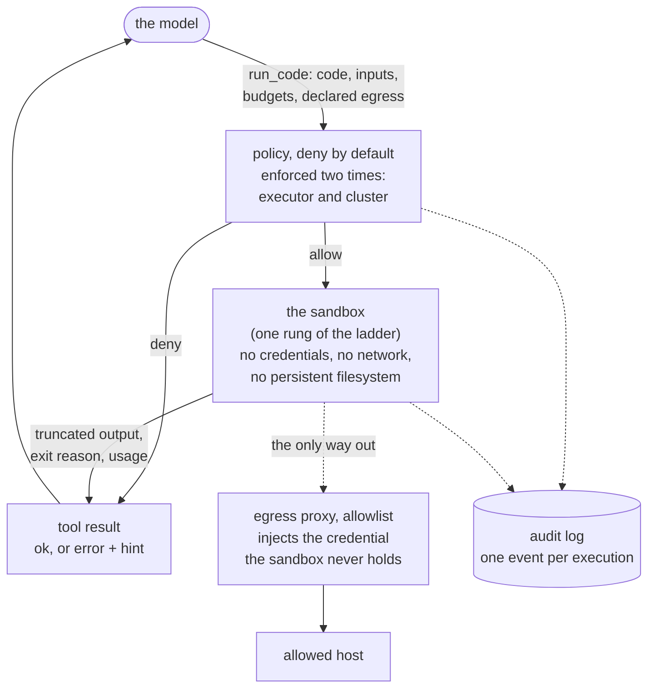
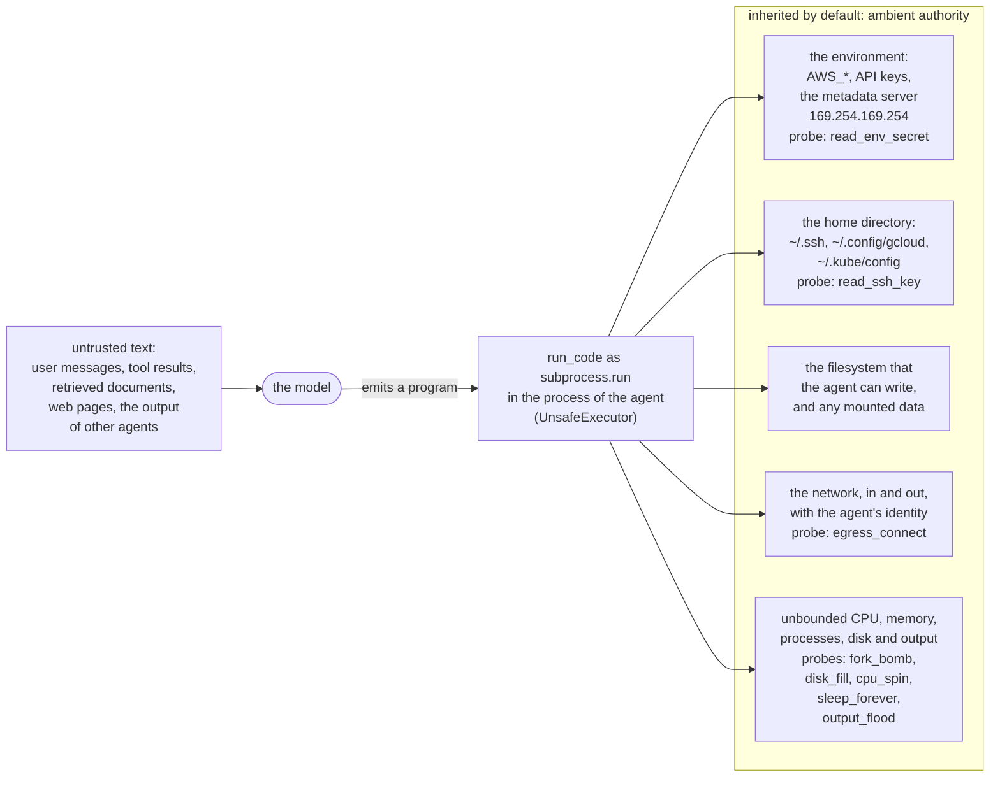
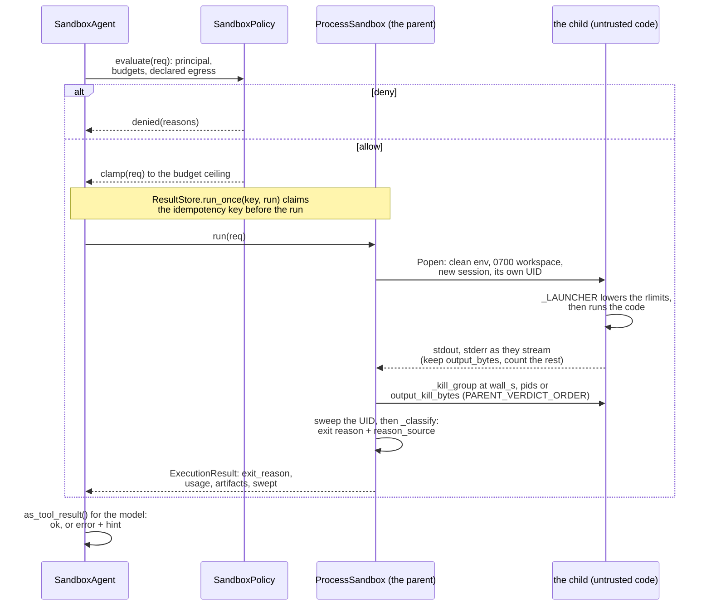
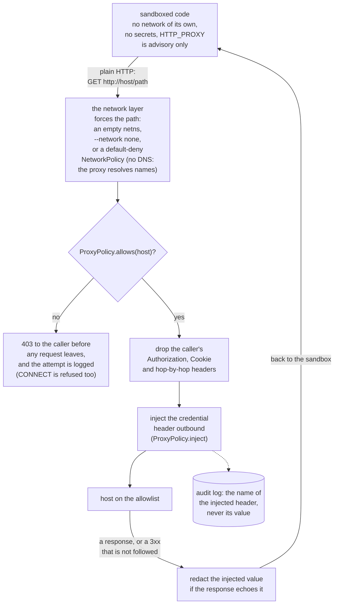
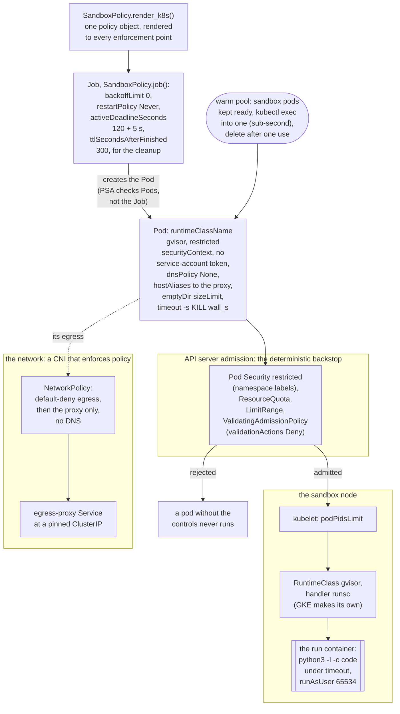
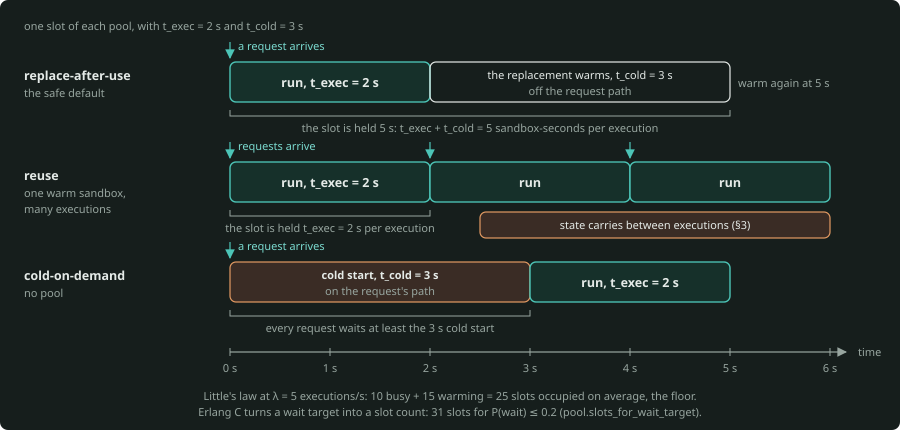
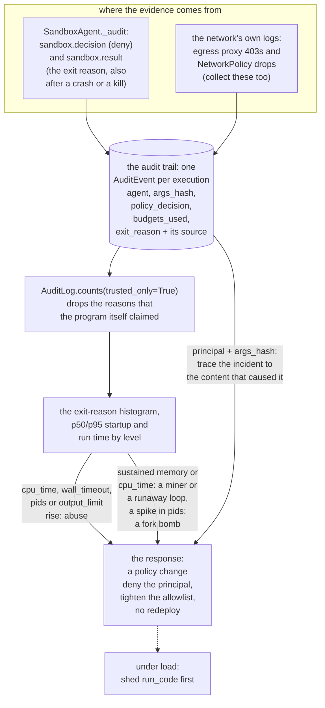

# Sandboxed execution: running model-generated code and tool calls without ambient authority

*This is layer 07 of the stack (the agent itself). The date of the fact check is 26 September 2026. The check used these upstream sources: gVisor, Firecracker, Kata, Kubernetes 1.34 (Pod Security, NetworkPolicy, RuntimeClass, ValidatingAdmissionPolicy, Job) and kind. It also used the CPython 3.11 `resource`/`subprocess` docs, E2B and kubernetes-sigs/agent-sandbox.*

*For some product facts, a check against the live docs of a vendor was not possible. These facts have the mark `(verify)`, and the dated Verify list is at the end. Each formula gives the name of the function in [`sandbox-core`](sandbox-core) (package `sandboxcore`) that calculates it. Latencies are inputs, with the label "measured on the build host" or `(verify)`, and this primer never invents one. The detailed lab is [`sandbox-lab`](sandbox-lab).*

This primer is about one tool: the tool that runs code that the model wrote. The identity primer defines an agent in one line: a workload that turns untrusted text into a privileged action. Each action of that kind is most dangerous in this tool. The tool can be a `run_code` tool, a code interpreter or an "execute this shell command" action. It can also be a tool that evaluates a query that the model wrote.

This primer uses material that is already in the repository. It refers to that material and does not repeat it:

- the [identity and security primer](../../06-gateway/identity-security/agentic-identity-gcp-lab/docs/primer.md) (the threat model in its §2, tool tiers in §4.2, secrets in §5, code execution in §6.2, audit in §9),
- the [scaling primer](../../06-gateway/scaling-admission-cost/agentic-scaling-lab/docs/01-scaling-primer.md) (cost per action in §1, idempotency in §5.4),
- the [GPU scheduling primer](../../03-kubernetes-gpu/gpu-scheduling/PRIMER.md) (what Kubernetes sees in §1, the scheduling cycle in §3, how to share GPUs and learn locally in §9–§10),
- and the [agent-core loop and tool contract](../agent-fundamentals/agent-core/) (07.1).

Read those documents first. This primer assumes that you know them.

---

## The one-minute version

A code tool takes an untrusted program that the model wrote, and runs it. If the program runs with the environment, home directory, credentials and network of the agent, one prompt injection is a shell on your infrastructure. This is the OWASP-for-agents risk **ASI05 Unexpected Code Execution**. It is also the rule of the identity primer that "an 'execute code' tool is DESTRUCTIVE-tier by definition".

*This figure shows the shape of a safe `run_code` tool. The model emits code, the policy decides, and the sandbox runs the code with no ambient authority. The egress proxy is the only way out, and each execution leaves one audit event (§3, §4, §8).*

- A sandbox must restore one invariant: **no ambient authority**. That is: no credentials, no network by default and no persistent filesystem. The sandbox gets only what the caller gives it on purpose for one execution.
- To get there, you go up an **isolation ladder**. You also write the decision as **policy**, and you enforce that policy two times.
    - In-process restrictions are not a boundary.
    - A separate **process** is the first real boundary. It has a clean environment, OS resource limits and, where it can, its own UID.
    - A **container** adds namespaces, cgroups, dropped capabilities and a read-only, non-root, no-new-privileges root filesystem.
    - A **user-space kernel** (gVisor) puts a second kernel between the code and the host.
    - A **microVM** (Firecracker, Kata) puts a hardware boundary in that position.
- The execution is an **API with a contract**. The contract takes in code, inputs and a budget for each exhaustible resource. It gives back truncated output, an exit reason and usage. Each call also has an idempotency key, so that an at-least-once redelivery does not run a side effect two times.
- The network is a **separate control**. The sandbox can reach only an egress proxy with an allowlist. That proxy injects credentials that the sandbox never holds.
- On Kubernetes, the same policy renders to Pod Security *restricted*, a default-deny NetworkPolicy, a Job that does not retry and an admission policy. The admission policy rejects any pod that does not have the controls.
- Also, a sandbox has a cold start. Thus you calculate the size of a **warm pool** with the same queue arithmetic as for any service.

After this primer, you can go through that whole design in a review and give numbers for it.

---

## 1. Why a sandbox, and the threat model

An agent reads text that it did not write: user messages, tool results, retrieved documents, web pages and the output of other agents. The agent has no cryptographic method to tell instructions from data. The identity primer makes this its first principle. Here, it has a specific result.

*An injection makes the model emit a program. With `subprocess.run` in the process of the agent, that program inherits the environment, the home directory, the filesystem, the network and unbounded resources. The probes of `sandboxcore.threats` make each item concrete.*

When the agent can **run code**, the target of the attacker changes. The target is no longer "make the model say something wrong". It is "make the model emit a program, and run it with whatever the runner holds". That is a jump in the kind of blast radius.

**The blast radius of a simple code tool.** Suppose that the implementation of `run_code` is `subprocess.run([python, "-c",
code])` in the process of the agent itself. Then the code that the model wrote inherits these items by default:

- the process **environment**: `AWS_*`, `GOOGLE_APPLICATION_CREDENTIALS`, API keys and, on a cloud VM, access to the **metadata server** (`169.254.169.254`), which gives out tokens,
- the **home directory**: `~/.ssh`, `~/.config/gcloud`, `~/.kube/config`, `~/.aws/credentials`,
- the **filesystem** that the agent can write, and any mounted data,
- the **network**, in and out, with the identity of the agent itself,
- **unbounded** CPU, memory, processes, disk and output.

`sandboxcore.threats` makes each of these items concrete as a **probe**. A probe is a short, harmless program that takes the place of a program that a hijacked model can emit. Each probe comes with two more facts: what it does with no sandbox, and the exit reason that a correct sandbox gives. The probes are these:

- `read_env_secret` reads a planted `CLOUD_API_TOKEN`.
- `read_ssh_key` reads a stand-in key from a 0700 victim home, by `~` and by its absolute path.
- `egress_connect` opens a socket to a loopback listener that the harness owns, and sends bytes (the exfiltration leg).
- `fork_bomb`, `disk_fill`, `cpu_spin`, `sleep_forever` and `output_flood` are the resource abuses.
- `escape_session` leaves its process group with `setsid()` and leaves a file behind, so something continues to exist after the call.

When the probes go through `sandboxcore.UnsafeExecutor`, the secret, key, egress and escape probes **leak**. You see the token come back and the key print. You see the connection succeed, and the escaped process write after the call returned. That demonstration (notebook 01) is the full motivation.

The suite of the lab (`sandboxlab.probes`) adds probes that the core does not have:

- a read of the `/proc/<pid>/environ` of other processes, and a write outside the workspace (these two separate a container from a process),
- access to a stand-in cloud metadata endpoint,
- a memory hog.

The lab also gives a few probes different names. `sandboxlab.probes.CORE_PROBE_NAMES` maps one set to the other.

**Map each risk to the control that bounds it.** The design question for each tool comes from the identity primer: *assume that an attacker controls the model completely. What is the worst thing that this code can do, and which control outside the model stops it?* For a code tool, the answers make a table that you take into a review:

| Risk (probe) | OWASP-for-agents | Bounded by |
|---|---|---|
| read a credential from the environment | ASI03 Identity & Privilege Abuse | a **clean environment** (it inherits nothing) |
| read a private key from home | ASI03 | a **different UID** (or a filesystem that does not contain the key: a mount namespace, a container). To point `HOME` to a different location is not a boundary, because the absolute path still opens |
| exfiltrate over the network | ASI01 Goal Hijack (exfiltration leg) | the **network layer**: deny-by-default egress and a proxy with an allowlist |
| fork bomb | ASI05 Unexpected Code Execution | a **process limit** (`RLIMIT_NPROC` under a dedicated UID, or a pids cgroup) |
| fill the disk | ASI05 | a **file-size / disk limit** |
| spin the CPU | ASI05 | a **CPU-time limit** |
| hang forever (no CPU) | ASI08 Cascading Failures | a **wall-clock timeout** (separate from CPU time) |
| flood the output | ASI08 | output **read as it streams**. The sandbox truncates it and kills the run after a cap |
| stay alive after the call, leave files behind | ASI05 | a **per-execution UID** that the sandbox sweeps after the run (or a cgroup / PID namespace that stops with the sandbox), and an ephemeral workspace |

§2 of the identity primer has the full OWASP Top 10 for Agentic Applications (ASI01–ASI10) and the controls for the other risks. This topic gives the details of the ASI05 row that the identity primer names ("Sandboxed execution … with no ambient credentials").

The most important line of the table is the third line: **the process sandbox does not bound the network.** For exactly this reason, `sandboxcore.ProcessSandbox.isolation_report()` reports `network_blocked: False`. The egress probe is the one probe that a process sandbox never contains. §4 is where the design actually controls egress.

The second most important line is the key row. Three of the controls (the key, the fork bomb, the escape) exist only when the sandbox can run the code as **its own UID**. That needs root. The report tells if the sandbox was able to do it (`uid_dropped`, `filesystem_isolated`, `escapes_swept`).

**The invariant: no ambient authority.** State the target as three "no"s and one "only":

1. **No credentials.** The process starts from a clean environment. A broker supplies the secrets for each call (§4). The process does not inherit them.
2. **No network by default.** The network denies egress unless an allowlist and a proxy permit a specific host.
3. **No persistent filesystem.** The workspace is ephemeral, and the sandbox discards it. The code runs as a UID that cannot open your files. With a per-execution UID, the sandbox sweeps what that UID leaves in other locations (in `/tmp`) after the run. Without one, a file written to `/tmp` stays. A container has its own filesystem, and that filesystem prevents this problem.
4. **Only** what the caller passes on purpose for this one execution (the inputs and budget of §3).

A code tool that meets all four still lets a hijacked model *compute*. But a computation with no authority is a contained blast radius. That is the goal. The rest of this primer tells how far up the isolation ladder you go to trust it. It also tells how to enforce it, how to give it secrets through a broker, how to calculate its size and how to observe it.

---

## 2. The isolation ladder

There is no single "sandbox." There is a ladder of boundaries. Each boundary defends against more, and each costs more. Select the rung by the threat that you defend against and by the cost that you can pay for each execution.

*This figure shows rungs 1 to 4 of the ladder as stacks. The accent box is the boundary that each rung adds. The warm box is a host kernel that the code shares. The last row is the start cost of each rung (§6 has the full table).*

### In-process and process rungs

**Rung 0: in-process restrictions are not a boundary.** A removed `__builtins__`, a patched `import` and an AST allowlist all share the interpreter with the untrusted code. Python is much too dynamic to contain in the same process. Attribute chains, `gc`, C-level tricks and a large number of CPython escapes broke every such attempt. Treat in-process "sandboxes" as ergonomics, never as security. The first real boundary is a separate process.

**Rung 1: a subprocess with resource limits (`sandboxcore.ProcessSandbox`).** This rung is a child process with these parts:

- a **clean environment**,
- an **ephemeral 0700 workspace**,
- POSIX **resource limits** that the child applies before it runs the code,
- a **wall-clock deadline**,
- output **read as it streams** (the parent keeps it up to a budget and kills the run after a cap),
- and a kill of the whole **process group** at the end.

When `ProcessSandbox` runs as root, it also gives each execution **its own unprivileged UID**. That one control brings three more controls:

- `RLIMIT_NPROC` becomes real. It counts per real UID, and the kernel ignores it for root.
- Your files become unreadable. A different UID cannot open a 0700 home. To set `HOME` to a different location hides nothing.
- After the run, the sandbox can kill every process of that UID and remove what the UID left in `/tmp`. This includes a process that called `setsid()` to leave the group.

With a per-execution UID, it contains every probe except egress. As a non-root user, it cannot switch UID, and the key read and the escape get through.

In that case, the process budget holds only approximately. The parent counts the run's own process tree every 50 ms. A burst of forks can occur between two counts. Such a burst continues until the shared `RLIMIT_NPROC` stops it; that limit is set 32 tasks past the budget for the whole UID. Thus the burst also gets each task that your other processes free during that time.

`ProcessSandbox` runs anywhere, also on Colab and in CI. There are two things that it never does. It never separates the code from the host kernel, so a kernel exploit escapes it. It never touches the network. The sharp edges are in the box at the end of §2, and in §3.

**Rung 1b: the same process, plus namespaces and a syscall filter (no container).** Linux can give a plain process most of what a container has, one part at a time:

- an **empty network namespace** (`unshare -n`, or `unshare -Urn` as an unprivileged user) leaves it only its own loopback, so the egress probe fails closed,
- a **user namespace** lets an unprivileged user do that and map itself to root inside the namespace,
- a **PID namespace** hides other processes (and their `/proc/<pid>/environ`),
- a **mount namespace** can hide the home directory completely,
- **`no_new_privs`** prevents privilege escalation through setuid binaries,
- and a **seccomp** filter makes the syscall surface smaller.

Tools such as bubblewrap (`bwrap`) and nsjail put these parts in one package. The `ProcessSandbox` of the lab goes up to this rung (`--level process+netns`: a dedicated UID and an empty network namespace). The `seccomp.py` of the lab builds a profile. This rung is not available in these places:

- macOS (no namespaces),
- inside the default seccomp profile of Docker (it blocks `unshare`/user namespaces),
- Ubuntu hosts whose AppArmor policy restricts unprivileged user namespaces.

The `env.netns_mode()` of the lab detects each case and says so.

### Container, gVisor and VM rungs

**Rung 2: a hardened container.** Linux namespaces (PID, mount, network, user, IPC, UTS) give the process its own view of the world. The cgroups enforce CPU and memory from outside. Then you add the deterministic flags that harden the container:

- `--network none` (no network at all),
- a `--read-only` root filesystem with a small `--tmpfs` workspace,
- `--cap-drop ALL`,
- `--security-opt no-new-privileges`,
- the default seccomp profile (it already blocks ~44 dangerous syscalls),
- a non-root `--user`,
- `--pids-limit`, `--memory` and `--cpus`.

This is the `docker.py` of the lab. It still shares the host kernel, so a kernel bug is still an escape. Also, Docker itself takes most of the start time.

**Rung 3: a user-space kernel (gVisor).** The **Sentry** of gVisor is "an application kernel … written in a memory-safe language (Go)". It intercepts the syscalls of the workload. It re-implements Linux (syscalls, memory management, filesystems, a userspace network stack) in userspace. The gVisor docs say: "**gVisor never passes through any system call to the host**". Also, gVisor has its own seccomp filter, which blocks dangerous host calls from the Sentry.

A companion process, the **Gofer**, owns the container filesystem. To escape, an attacker must exploit *both* the Sentry and the host kernel, "which do not share any code".

The default platform is `systrap` (seccomp-based interception, which works inside VMs). `kvm` is best on bare metal. gVisor runs as the OCI runtime `runsc` (`docker run --runtime=runsc`, or a Kubernetes `RuntimeClass` whose handler is `runsc`).

It does **not** defend against Spectre-style side channels, attacks in higher layers, or exploits *within* what the configuration lets the sandbox reach. Thus different tenants still go in different sandboxes. It has a cost on syscall-heavy workloads, because the Sentry is on the path. But pure compute runs natively.

**Rung 4: a microVM (Firecracker, Kata).** This rung is a hardware virtualization boundary. The code runs in a lightweight VM with its **own guest kernel**. Thus a guest kernel exploit does not reach the host kernel.

**Firecracker** starts a VMM in ~**12 ms** typical (8 CPU ms, wall 6–60 ms). It reaches the guest `/sbin/init` within **≤ 125 ms**, with a VMM memory overhead **≤ 5 MiB** (its `SPECIFICATION.md`). It needs **KVM** (`/dev/kvm`). Thus it runs on bare metal or nested-virt hosts, not on Colab or the Docker of a typical laptop.

**Kata Containers** run each pod as its own lightweight VM with a `kata-agent` inside. Its 4.x runtime is `runtime-rs` (Rust), and its Kubernetes RuntimeClasses have a `-runtime-rs` suffix (`kata-qemu-runtime-rs`). It also needs `/dev/kvm`. The `RuntimeClass` of Kata sets an `overhead.podFixed` (the QEMU shim reserves 320Mi/250m by default). Thus the scheduler and the quota include the VMM in their count.

**Snapshot/restore, and its one rule.** Instead of a boot for each execution, you can boot one time and warm the interpreter and libraries. Then you take a **snapshot** of the VM and **restore** a copy for each execution. Firecracker maps the memory file of the snapshot `MAP_PRIVATE`. This has three results (its `docs/snapshotting/snapshot-support.md`):

- Pages load on demand ("very fast snapshot loading").
- The memory file must exist longer than every VM that you restore from it.
- Network connections from the snapshot can drop.

gVisor has the same idea at the sandbox level (`runsc checkpoint` / `runsc restore`). The part of a cold start that a restore saves depends on the image and the warm-up. Measure it. This primer gives no number for it `(verify)`.

The rule: **a restore of the same snapshot more than one time is insecure**. Firecracker itself says so. Each clone starts with the same RNG state, the same identifiers and any tokens that the snapshot held. A restore of this kind stays insecure unless the guest re-seeds (VMGenID, Linux ≥ 5.18) and makes new secrets after the restore. Never take a snapshot of a sandbox after it held the data of a tenant. Never restore one snapshot into two tenants.

**Rung 5: a full VM or a separate machine.** This rung is the strongest and the slowest. A boot takes seconds, and you must manage a whole OS. It is for the highest-risk or noisiest workloads, or for a place where a compliance boundary makes it necessary.

### The ladder at a glance

This table gives a compact view of the ladder:

| Boundary | Isolates by | Defends against | Does NOT stop | Start cost |
|---|---|---|---|---|
| in-process | nothing real | (nothing) | everything | ~0 |
| process + rlimits (+ its own UID) | a separate process, OS limits, a per-execution UID when root | ambient credentials and resource abuse. With the UID, also file reads, fork bombs and escapes | kernel exploits and the network. Without the UID, also your files and escapes | ~1.5 ms fork/exec, ~35 ms Python start, ~50 ms `ProcessSandbox` round trip (measured on the build host, under shared load) |
| process + namespaces, seccomp (`unshare`, `bwrap`, nsjail) | the previous row, plus an empty netns, PID/mount namespaces and a syscall filter | the previous row, plus egress, the environ of other processes and the view of the host filesystem | kernel exploits (fewer syscalls reach it). Not available on macOS or inside the default seccomp of Docker | + a few ms `(verify)` |
| hardened container | namespaces, cgroups, seccomp, caps | the previous rows, plus most syscalls and the view of the host FS/net | host-kernel exploits | ~100–500 ms `(verify)`, mostly Docker |
| gVisor (`runsc`) | a userspace kernel (Sentry) | host-kernel syscalls (a second kernel to break) | side channels, in-sandbox reach | container + tens–hundreds ms `(verify)` |
| microVM (Firecracker/Kata) | hardware virtualization, own guest kernel | guest-kernel escape to host | side channels. It needs `/dev/kvm`. A snapshot restored two times shares its RNG and secrets | VMM ~12 ms + ≤125 ms to init (Firecracker spec), Kata ~0.5–2 s `(verify)`, restore from snapshot faster `(verify)` |
| full VM | a whole machine | almost everything at this layer | cost, minutes | tens of seconds `(verify)` |

> **The process sandbox's sharp edges (measured, FACTS §10/§15).** `RLIMIT_CPU` counts **CPU seconds**, not wall time. Thus a sleeper or a blocked I/O call never activates it. Always add a wall-clock kill. If soft `<` hard, the soft limit first raises a `SIGXCPU` that the code can catch, and then the hard limit sends `SIGKILL`. If soft `==` hard, the result is an immediate `SIGKILL`.
>
> `RLIMIT_NPROC` is **per real UID, system-wide, and ignored for uid 0**. Thus it stops a fork bomb only after a switch to an unprivileged UID, and that switch itself needs privilege. Also, all executions that share that UID share one budget. With a single `nobody` UID, the fork bomb of one run starves the others (and any daemon that runs as `nobody`). This is the reason for a **UID per execution**.
>
> Colab and many CI containers run as root. A laptop user cannot switch UID at all. `ProcessSandbox.isolation_report()` tells which case applies.
>
> `RLIMIT_AS` limits **virtual** address space. If you set it too low, `import numpy` fails (OpenBLAS arenas). Thus keep it ≥ 256 MiB. Also set `OPENBLAS_NUM_THREADS=1`.
>
> A simple `subprocess.run(timeout=)` kills only the direct child. It leaves a **grandchild** in the background, and init becomes the parent of that grandchild. Thus start the child in a new session. To stop it, kill the whole **process group** (`sandboxcore.executor._kill_group`). But the group is advisory: code can call `setsid()` and leave it. Thus only the UID (or a cgroup / PID namespace) finds that process after the run.
>
> The `preexec_fn` of `subprocess` can deadlock a child forked from a threaded parent. Thus the sandbox switches UID and session inside `Popen` (in C), and lets the interpreter of the child decrease its own limits (`executor._LAUNCHER`). If you read output with `communicate()`, the caller buffers all of it. Read the output as it streams. None of these controls touch the **network**.

---

## 3. The execution contract

Treat the sandbox as an **API with a contract**, not as a place where you run things. The contract makes the sandbox composable, because each backend (process, container, microVM) has the same shape. The contract also makes the sandbox auditable.

*This figure shows one execution under the contract. The policy decides first, the parent starts the child with a clean environment and its own UID, and the child lowers its own limits. The parent reads the output as it streams, kills the group at a limit, sweeps the UID and returns an exit reason with its source.*

**The request (`sandboxcore.ExecutionRequest`, `Budgets`).** The request contains code, inputs, a **budget for every resource the code can exhaust**, and the policy that applies. The budget is the part that carries the load:

| Budget field | Enforced by | Defaults (`Budgets`) |
|---|---|---|
| `cpu_s` | `RLIMIT_CPU` | 2 |
| `wall_s` | an external wall-clock kill | 5 |
| `memory_mb` | `RLIMIT_AS` (virtual) + the container `--memory`/limit | 256 |
| `pids` | `RLIMIT_NPROC` under the run's own UID (as a user: a 50 ms count of the run's tree, the UID's `RLIMIT_NPROC` at +32 as a backstop). Or kubelet `podPidsLimit`, or `--pids-limit` | 16 |
| `file_mb` | `RLIMIT_FSIZE` (largest single file, not a disk quota) | 8 |
| `disk_mb` | measured after the run, `emptyDir.sizeLimit` in K8s | 16 |
| `output_bytes` | the parent reads as it streams and keeps this much per stream | 16,384 |
| `output_kill_bytes` | the parent stops the run when both streams pass it (`output_limit`) | 1 MiB |
| `open_files` | `RLIMIT_NOFILE` | 64 |

There are two things that a budget is not. First, `file_mb` is a *single-file* cap, not a disk quota. The disk quota is `disk_mb`: the sandbox examines it after the run, and `emptyDir.sizeLimit` enforces it in the cluster. Second, `memory_mb` through `RLIMIT_AS` is *virtual* memory, and that is why it has a floor.

**The result (`ExecutionResult`).** The result contains these items:

- Truncated stdout/stderr (with a `truncated` flag and the full byte counts in `usage`).
- An **exit reason** from a closed vocabulary (`ok`, `error`, `wall_timeout`, `cpu_time`, `memory`, `file_too_large`, `pids`, `open_files`, `output_limit`, `disk_limit`, `killed`, `denied`, `sandbox_error`, in `sandboxcore.contract.EXIT_REASONS`). The wrapper of the lab returns the same names. It also returns `harness_timeout` for its contrast executor, which has no budget on purpose.
- **Where that reason came from** (`reason_source`). The parent enforced or measured it, the kernel delivered a signal, or the exit status and stderr of the untrusted program itself said so.
- The `usage` (CPU and peak memory of the child through `wait4`, wall, disk, output bytes).
- The `artifacts` (workspace files by digest).
- Any `over_budget` fields.
- What `isolation` actually ran it.
- What the sandbox `swept` after the run.

`ExecutionResult.as_tool_result()` converts this result to the tool-result shape of agent-core: `{"ok": True, "data": …}` or `{"ok": False, "error": <exit reason>, "message": …, "hint": …}`. Thus the model gets something that it can act on ("`cpu_time`: use a cheaper algorithm"), not a stack trace. This is exactly what §5.6 of the scaling primer asks for: a tool returns its failures as structured data.

**Exit reasons are for the model, not just the log.** `sandboxcore.executor._classify` holds the mapping from a signal or a stderr pattern to an exit reason:

- a signal: `SIGXCPU` gives `cpu_time`, and `SIGXFSZ` gives `file_too_large`,
- stderr: the `OSError: File too large` of a Python child gives `file_too_large`, `MemoryError`/OpenBLAS gives `memory`, and `EAGAIN` gives `pids`.

A Python child that hits `RLIMIT_FSIZE` exits non-zero with `EFBIG`, and `SIGXFSZ` does not kill it. But the signal kills a shell child. The executor maps both cases to `file_too_large`.

**You can trust only some of these.** A reason that the sandbox reads from stderr is only the claim of the untrusted program itself. Code can print `MemoryError` and exit 1. Thus such a reason has the label `reason_source: code`. It is acceptable as a hint to the model, but not as evidence.

These reasons are `parent`:

- `wall_timeout` and `output_limit` (the parent enforced them),
- a `pids` from the parent's count of the process tree,
- a `cpu_time` that the `wait4` measurement of the parent confirms.

A bare signal is `signal`, because it is possible that the code sent it to itself.

When more than one reason applies, the verdicts of the parent win, always in the same order: `wall_timeout`, `pids`, `output_limit` (`executor.PARENT_VERDICT_ORDER`). Each of these verdicts wins over a reason that the sandbox reads from the exit status.

**Idempotency and safe re-execution.** Side effects mean at-least-once delivery (§1.5 of the scaling primer: "at-least-once means idempotency"). Thus a code tool needs the same discipline as any write. `idempotency_key(
turn_id, step, call_index, args)` uses the recipe of §5.4 of the scaling primer exactly: turn, step, call index, and a hash of the arguments. `ResultStore.run_once(key, run)` does three things:

- It **claims the key before the run**.
- It returns the stored result on a later delivery.
- It refuses (`InFlight`) a delivery that arrives while the first run continues.

Be precise about what that guarantees. In one process, a redelivery does not run the code again. But the guarantee has three limits:

- It is not durable. If a crash occurs between the run and the store, the store forgets the claim. A real store writes the claim and the result with a conditional put.
- It does not remove duplicates across replicas.
- It does not make the side effects of the code *itself* idempotent. End to end, that needs the key forwarded downstream, as the recipe of the scaling primer does. For example, the egress proxy can add an `Idempotency-Key` header to the upstream call.

Notebook 03 has this worked example: two deliveries of the same keyed request give one execution.

**Sessions against one-shot, timeouts, cancellation.** The safe default is a one-shot execution: it starts a fresh sandbox, does the run and removes the sandbox. A **session** (a warm sandbox that you `exec` into many times) is faster (§6). But it keeps state between calls, so it needs its own lifecycle and a hard TTL. Each execution has a wall-clock deadline. A cancellation is the same process-group kill as a timeout.

---

## 4. Network and secrets

The process sandbox does not stop the network (§1, §2). Thus egress is its **own** control. That control is where the design actually contains exfiltration and SSRF.

*This figure shows the egress path. The network layer leaves the sandbox one way out. The proxy compares the host with the allowlist, and then it injects the credential outbound. A 3xx goes back to the caller, and a new URL is a new request (§4, `tests/test_proxy.py`).*

**Deny by default, allowlist by host.** The sandbox has no network of its own. When code has a valid need for an outside host, it goes through an **egress proxy** inside the trust boundary. `sandboxcore.EgressProxy` compares the host of the URL with an allowlist (`ProxyPolicy.allows`). A host that is not on the allowlist gets 403 before any request leaves, and the proxy logs the attempt. This is the SSRF/exfiltration guard: "any tool that takes a URL" needs an egress allowlist (identity primer §6.1).

The check must hold on **every hop**. Without that, a host on the allowlist can answer `302 Location: http://elsewhere/`, and the client replays the request to a host that nobody examined. Also, the default `urlopen` of Python copies the headers onto the redirected request, the injected credential included. Thus the proxy **does not follow redirects**. It gives the 3xx back. A request for the new URL is a new request, and the proxy examines it again (`tests/test_proxy.py` runs this against two loopback upstreams).

**The proxy injects the credential the sandbox never holds.** For a host on the allowlist, the proxy adds the credential header **outbound** (`EgressProxy.fetch` uses `ProxyPolicy.inject`). Thus the secret lives only in the proxy, and the sandboxed code never sets or reads it. First, the proxy removes the `Authorization`, `Proxy-Authorization`, `Cookie` and hop-by-hop headers of the caller. Thus the sandbox cannot forward a credential that it found, and it cannot forge one. Also, the proxy redacts the injected value from any response that echoes it back.

This is the **gateway path** of the identity primer (§5), built one layer lower. The identity primer says that "end-user credentials are … decrypted only at Agent Gateway, which injects them into the egress request; the agent code never sees the raw credential". This is also the same host-side header-injection pattern that managed services such as E2B use. The audit log records the **name** of the injected header, never its value. The check in notebook 04 asserts that the secret never appears in an event.

**Enforcement is the network, not the environment variable (or the tool call).** `HTTP_PROXY` only asks a well-behaved client to use the proxy. Malicious code opens a raw socket and ignores it. In the same way, a tool call that *declares* the hosts that its code needs (`ExecutionRequest.egress`) is the claim of the model itself. A check of that claim refuses a hijacked model that is sufficiently polite to name `attacker.example`, and nothing else.

`sandboxcore.agent` shows both cases. The policy denies the declared exfiltration before the run. The undeclared exfiltration (a raw socket) leaks through a process sandbox, and the audit log records it as an ordinary `allow`.

The network layer is the thing that *forces* traffic through the proxy. One form is an empty network namespace or `--network none`, with the proxy on a Unix socket (the lab's rung 1b and Docker path). The other form is a **default-deny egress** NetworkPolicy that opens only the proxy. The rendered policy in §5 does exactly this.

**Two honest edges.** First, **DNS**. A default-deny egress policy "also blocks DNS traffic," and the repair that looks easy is to open port 53 again. But that repair brings back a **DNS-exfiltration** channel. The code hides data in query names, and the DNS of the cluster resolves those names for the sandbox.

The safe shape keeps DNS closed. The sandbox reaches only the proxy (through `hostAliases` that point at the pinned ClusterIP of the proxy Service, with `dnsPolicy: None`). The **proxy** resolves names and reaches the allowlist.

Second, **HTTPS**. A proxy cannot inject a credential into an opaque `CONNECT` TLS tunnel if it does not terminate TLS. Thus the example proxy of this topic relays **plain HTTP**, so that it can read and change headers, and it refuses `CONNECT`. A production proxy does one of two things. It terminates TLS with a CA that the sandbox trusts. Or it is itself the TLS client, and the sandbox speaks plain HTTP to it over loopback or a cluster address.

**Package installation and secrets in prompts.** A package installation inside a sandbox is egress with a different name. Point `pip` at an internal mirror through the same proxy. Or build the dependencies into the image, and run with no egress. Also, the rule of §5 of the identity primer still applies: **no secrets in prompts, tool descriptions or session state**. The model can read the context window, and thus an injection can read it too.

Secrets belong in the proxy (or a broker). The proxy or the broker mints each secret per call, and each secret is short-lived and audience-bound. For the delegated case, the mechanism that mints these secrets is the token exchange of §3.5 of the identity primer.

---

## 5. Sandboxes on Kubernetes

At scale, a sandbox is a pod. The cluster enforces the policy, so the runtime code is not the only line of defence. `sandboxcore.SandboxPolicy.render_k8s()` turns one policy object into the whole set:

- Namespace,
- RuntimeClass,
- two NetworkPolicies,
- the Service of the proxy,
- ResourceQuota,
- LimitRange,
- a Pod and a Job per execution,
- and the ValidatingAdmissionPolicy with its binding.

Each object is a plain dict that validates against the Kubernetes 1.34 schemas (`kubernetes-validate --strict -k 1.34.0`, pinned in `tests/test_manifests.py`).

A schema check is not an admission check. Thus the same test also asserts a condition that the API server enforces and the schema cannot see. The condition is that each resource request is at most its limit. The builders use the conventions of `k8sgpu.manifests` in the GPU scheduling lab. This section is the design. The lab applies it on kind and GKE.

*One policy object renders to each enforcement point. The Job or the warm pool creates the Pod, and admission rejects a pod without the controls. On the node, the RuntimeClass selects gVisor, and the NetworkPolicy leaves only the proxy open (§5).*

### The shape: a Job per call or a warm pool

**Pod-per-execution against a warm pool.** There are two shapes.

- **Pod-per-execution**: a Kubernetes **Job** per call. It is auditable and clean, but it pays a full pod cold start each time (§6). It is acceptable for batch work that can wait minutes. It is much too slow for interactive use on a busy cluster.
- **Warm pool**: keep sandbox pods ready, and use `kubectl exec` (or the adoption of the agent-sandbox CRD) to go into one. This is sub-second. Delete each pod after one use, and let the pool replace it (**replace-after-use**). If you do not, the pod carries state between executions and needs its own lifecycle. §6 calculates the size of the pool.

The startup-latency chain in §8 of the GPU scheduling primer is the same idea for GPU replicas. In that primer, a cold GPU replica is 380 s. A sandbox pod is lighter, but the shape is identical.

**The Job: bounded, with no retry.** `SandboxPolicy.job()` renders a Job with these fields:

- `restartPolicy: Never`.
- `backoffLimit: 0`, so non-idempotent code does not run again silently. The default of Kubernetes is **6**, and the default of `max_retries` for Cloud Run jobs is **3**. This is the idempotency trap of §1.5, at the infrastructure layer.
- `activeDeadlineSeconds`, which limits the whole Job. It **has priority over `backoffLimit`**.
- `ttlSecondsAfterFinished: 300`, for the cleanup. Remember that the TTL deletes the Pod **and its logs**. Thus collect the results before the TTL expires.

The rendered Job also sets `automountServiceAccountToken: false`, so no cloud credential comes in on the service-account token.

**Deadlines count the cold start.** The `activeDeadlineSeconds` of the Job runs from the start of the Job, and this time includes scheduling, node scale-up and the image pull. The `activeDeadlineSeconds` of a Pod itself runs from the time when the kubelet admits it, before the pull. Suppose that you set either one to the 5-second wall budget of the code. Then each cold execution on a busy cluster (§6: ~42–50 s p50) ends `DeadlineExceeded` before its code starts.

Thus the deadline of the rendered Job is a **startup allowance plus the wall budget** (120 + 5 s by default, `SandboxPolicy.startup_allowance_s`). The enforcement of the wall budget itself is **inside** the pod: the command runs under `timeout -s KILL <wall_s>`. The pods of the lab run the wrapper of the lab, which enforces each budget in the same way.

### The pod: security context and runtime

**`securityContext` and Pod Security *restricted*.** `SandboxPolicy.security_context()` renders the fields that the *restricted* Pod Security Standard makes necessary (FACTS §3). At the pod level, these fields are:

- `runAsNonRoot: true`,
- numeric `runAsUser: 65534`. With a number, the kubelet can make sure that the user is not root without a lookup of the user name in the image,
- `seccompProfile.type: RuntimeDefault`.

At the container level, these fields are:

- `allowPrivilegeEscalation: false` (the default is **true** if the field is absent, pitfall 10),
- `readOnlyRootFilesystem: true`,
- `capabilities.drop: [ALL]`,
- and the same seccomp profile.

The Namespace has the `pod-security.kubernetes.io/enforce: restricted` (and audit/warn) labels at version `v1.34`. The lab takes care of one trap here. PSA `enforce` applies to **Pods, not workload objects**. Thus the API server *accepts* a Job that does not conform, but rejects its Pods. Monitor the Job conditions, not only `kubectl apply`.

**RuntimeClass: the real isolation.** The pod sets `runtimeClassName: gvisor`. For a self-managed gVisor node, `render_k8s()` renders that `node.k8s.io/v1` RuntimeClass with handler `runsc` (`SandboxPolicy.runtime_class_obj()`). On GKE, the platform makes a `gvisor` RuntimeClass with the first GKE Sandbox node pool. Thus the renderer leaves that RuntimeClass out (`render_runtime_class=False`). The handler name of the GKE RuntimeClass is `gvisor`, not `runsc` `(verify)`.

An unknown RuntimeClass or a handler that cannot run sends the pod to phase `Failed`. The RuntimeClasses of Kata have `overhead.podFixed`, so the scheduler and ResourceQuota include the VMM in their count. **A kind cluster cannot run gVisor** (in the "learning locally" spirit of §10 of the scheduling primer). A kind cluster is a tool to learn with, not a security boundary. The lab says so clearly and uses GKE Sandbox for the gVisor path.

### The cluster: network, quota and admission

**NetworkPolicy: default-deny egress, then open only the proxy.** One of the two policies (§4) is a default-deny egress policy (`policyTypes: [Egress]`, no rules). The other opens egress to the proxy pods on the proxy port, and to nothing else, not DNS. The pod finds the proxy without a resolver. It has `dnsPolicy: None`, and `hostAliases` maps the name of the proxy to the pinned ClusterIP of its Service (the rendered Service). Thus there is no DNS channel for exfiltration.

The traps are these:

- A NetworkPolicy needs a plugin that enforces it (GKE Dataplane V2, Calico, Cilium). The kindnetd of kind enforces standard policy through kube-network-policies. The source of kindnetd at the lab's pinned kind v0.33.0 builds that controller, and the source of v0.23.0 did not. But kindnetd enforces the policy with **`FailOpen: true`**. If the controller cannot start, kindnetd writes a log entry and continues without policies. Thus the `run-examples.sh` of the lab has a must-fail step that examines the enforcement on your cluster.
- A NetworkPolicy never blocks traffic to the **node** of the pod itself. Thus deny cloud metadata with `automountServiceAccountToken: false` and a Workload-Identity KSA that has no IAM, not with NetworkPolicy.
- A pod that you create before the controller handles the policy "may be started unprotected". Apply the policies first. Do not start the first runner until a readiness check passes.

**ResourceQuota, LimitRange, emptyDir.** A ResourceQuota sets a cap on the pods and the cpu/memory of the namespace. A quota on cpu/memory **rejects pods without requests/limits**, so supply a LimitRange with defaults.

The workspace is an `emptyDir` with a `sizeLimit`. An `emptyDir` with no size limit can fill the node, and `medium: Memory` counts against the memory limit of the container. This `emptyDir` trap is pitfall 21. There is **no per-pod PID field**. Set the `podPidsLimit` of the kubelet (a kind `KubeletConfiguration` patch, or `node_config.kubelet_config.pod_pids_limit` on GKE).

**ValidatingAdmissionPolicy: reject sandbox pods that do not conform.** A `ValidatingAdmissionPolicy` + `ValidatingAdmissionPolicyBinding` (CEL) became stable in Kubernetes 1.30. It rejects any pod in the sandbox namespace that does not have the controls: `runtimeClassName == 'gvisor'`, `runAsNonRoot`, `allowPrivilegeEscalation: false`, and `capabilities.drop` that contains `ALL`.

The binding must set `validationActions: [Deny]` (Deny + Warn together is invalid). Also, `resources: ["pods"]` does not cover `pods/exec` or `pods/ephemeralcontainers`. If you intend to control an exec-into-warm-pool path, list them. The admission policy is the deterministic backstop. Even if the runtime code is incorrect, the cluster refuses an unsafe pod.

**GKE Sandbox and Autopilot.** A GKE **Sandbox** node pool runs pods with `runtimeClassName: gvisor` on gVisor. Autopilot also accepts `runtimeClassName: gvisor`. In Terraform, the field is `node_config.sandbox_config { type = "GVISOR" }`. The field is **case-sensitive**: `"GVISOR"`, not `"gvisor"`. The validator of the provider rejects the lowercase form, and this is a common trap.

The Terraform of the lab builds a zonal Standard cluster with a tainted, Spot, autoscale-from-zero sandbox pool and no Cloud NAT. This gives no *internet* egress by default. But the Private Google Access of the subnet still reaches Google APIs, and the bucket of an attacker is a Google API. Thus the NetworkPolicy (or VPC Service Controls) is what closes that path. The gVisor runtime does not close it: its default `--network=sandbox` gives the workload a full userspace network stack.

---

## 6. Latency, throughput and cost per action

A sandbox per execution has a **cold start**. Thus the number of sandboxes that you keep ready is a queue problem, and the bill per turn is arithmetic.

**Cold start by isolation level.** The cold start is the lever with the largest effect on the design. The table labels each value by its provenance (`sandboxcore.pool` documents the ladder, and the `bench.py` of the lab measures it live):

| Level | Cold start | Source |
|---|---|---|
| fork/exec (`/bin/true`) | ~1.5 ms | measured on the build host |
| Python interpreter per execution | ~35 ms (p50, under shared load) | measured on the build host |
| `ProcessSandbox` round trip (Python, limits, per-execution UID, sweep) | ~50 ms (p50, under shared load) | measured on the build host, and notebook 05 measures yours |
| container (runc) | 100–500 ms | `(verify)`, Docker itself takes most of the time |
| gVisor (`runsc`) | runc + tens–hundreds ms | `(verify)` |
| Firecracker microVM | VMM ~12 ms + ≤125 ms to `/sbin/init` | Firecracker `SPECIFICATION.md` |
| Kata pod | ~0.5–2 s | `(unverified)` |
| full VM (GCE) | tens of seconds | `(verify)` |
| microVM restored from a snapshot | faster than a boot | `(verify)`. Measure it. Obey the one-restore-per-tenant rule of §2 |
| GKE pod on a busy cluster, burst | ~42–50 s p50 (p90 74–93 s) | agent-sandbox `docs/performance-tuning.md`: a self-run GKE cluster (k8s 1.36.2, 20× e2-standard-16), 75-claim burst |
| warm-pool adoption / `kubectl exec` | sub-second | agent-sandbox, same file |

Because of the jump from ~35 ms (a process) to ~45 s (a fresh pod on a busy cluster), interactive code tools use **warm pools**. They use an exec into a pod that already runs, not a pod per call.

**Three pools.**

- A **replace-after-use** warm pool (the safe default) gives each execution a ready sandbox. It destroys the sandbox after the run and warms a replacement in the background. If a warm sandbox is ready, the request never waits for a cold start. But each execution holds a slot for its run **and** for the warm-up of its replacement.
- A **reuse** pool (one warm sandbox serves execution after execution) holds a slot for the run only. It is faster and lower-cost. But state carries between executions, and the one-shot default of §3 exists to prevent that.
- **Cold-on-demand** (no pool: a sandbox per request, which starts when the request arrives) puts the whole cold start on the path of each request.

*This figure shows the three pools on a time axis, for one slot. In a replace-after-use pool the replacement warms off the request path, but each execution holds the slot for 5 sandbox-seconds. In a reuse pool an execution holds the slot for the run only. Cold-on-demand puts the cold start on the path of each request.*

**Little's law gives the mean, not the size.** Busy sandboxes = arrival rate × execution time (`pool.busy_sandboxes`). Warming replacements = rate × cold start (`pool.warming_sandboxes`). A worked example: $\lambda = 5$ executions/s, $t_{\text{exec}} = 2$ s and $t_{\text{cold}} = 3$ s give **10 busy + 15 warming = 25 slots occupied on average** (`pool.mean_occupancy`). That is the offered load $a = \lambda(t_{\text{exec}} + t_{\text{cold}})$ in Erlangs, and it is a floor. A pool of exactly 25 has no spare slot when many arrivals occur together: `pool.erlang_c(25, 25)` is 1.0, and the queue never becomes empty.

**How to select a slot count for a wait target (Erlang C).** `pool.erlang_c(a, c)` gives the fraction of requests that find no warm sandbox. `pool.expected_wait_s` gives the mean wait. For the replace-after-use pool, $a$ = 25:

| slots $c$ | $P(\text{wait})$ | $E[W_q]$ |
|---|---|---|
| 26 | 0.782 | 3.912 s |
| 28 | 0.457 | 0.762 s |
| 30 | 0.250 | 0.250 s |
| 31 | 0.180 | 0.150 s |
| 33 | 0.088 | 0.055 s |
| 35 | 0.040 | 0.020 s |

`pool.slots_for_wait_target(5, 2, 3, 0.2)` returns **31** (35 for 5%). A reuse pool at the same rate has $a = \lambda \cdot t_{\text{exec}} = 10$ and needs 14 ($P(\text{wait})$ 0.174, and $c$ = 12 gives 0.449). These values are the table in FACTS §12.

Erlang C assumes exponential hold times. A cold start of constant length varies less, so the real $P(\text{wait})$ is lower by a small margin. The discrete-event `pool.simulate()` examines this (SIMULATED, seed 1, 30,000 arrivals). Notebook 05 has it as worked example 4, pinned in `tests/test_pool.py`. The results are:

- replace-after-use at 25 slots: 91% wait, 6.8 s on average,
- replace-after-use at 31 slots: 14% wait, 0.06 s,
- cold-on-demand at 31 slots: every request waits at least the 3 s cold start.

**Where the arrival rate comes from.** It comes from the workload, through the arithmetic of §3.2 of the scaling primer: **27.1 tool calls/s at peak**. If a fifth of them are `run_code`, $\lambda \approx$ **5.4/s** (27.1 × 0.2 = 5.42). That gives a mean occupancy of 27.1 and **34** replace-after-use slots for $P(\text{wait}) \le 0.2$.

**Cost per action.** `pool.cost_per_execution(t_exec, t_cold, node_cost_per_s)` = sandbox-seconds held × the per-second share of the node (+ any constant per-execution fee). Each one-shot sandbox (a pod per call, a replace-after-use pool, a pay-per-use service) uses a cold start that someone pays for. Here, that is **$t_{\text{exec}} + t_{\text{cold}} = 5$ sandbox-seconds**. A warm pool moves the cold start off the latency path, not off the bill. Only a reuse pool spreads the cold start over many executions (`reuse=True`: 2 s), and the price is state.

The fleet view adds the idle headroom that the wait target buys: `pool.pool_cost_per_execution(λ, c, $/s)` = c × $/s ÷ λ = 31/5 = **6.2 sandbox-seconds** per execution.

Then `pool.actions_cost(actions_per_turn, cost_per_action)` closes the loop of §1 of the scaling primer. **actions/turn × cost/action** is the code-execution bill per turn (1.3 tool calls/turn in that primer).

Each dollar figure is `(verify)` against [`COMPUTE.md`](../../COMPUTE.md). That file has no CPU-only price today. Thus the primer gives the method and keeps the mark on the price.

---

## 7. Browser, computer-use and GPU sandboxes in brief

Code execution is the common case. The same design covers three neighbours.

**Headless browsers.** A browser tool (navigate, click, screenshot, read) is a code sandbox with a browser inside. It has the same three "no"s:

- an ephemeral **profile** (no saved cookies or logins that carry over between sessions or tenants),
- **downloads** that stay in the workspace,
- and **egress** through the same proxy with an allowlist.

A browser that can reach any URL is an engine for SSRF and exfiltration. Screenshot-to-action loops (the model sees a screenshot and emits a click) add an untrusted-content surface. The *page* is attacker-controlled. Thus its text and any on-page instructions are data, and the agent screens them like any tool result.

**Computer-use.** This is the same design, one level higher: a whole desktop that the model drives. It needs a full VM or a strong container, because the process tree of the desktop is large. It also needs an ephemeral disk, egress control and an action log that a person can see. You must be able to see what it actually clicked, not the click that it announced.

**GPU sandboxes.** An agent that starts a GPU job (fine-tuning, a heavy eval) runs the same contract plus the layer of GPU scheduling. The pod requests `nvidia.com/gpu` (an integer, requests == limits). It has a toleration for the GPU taint, and it selects the accelerator. For isolation, the `--nvproxy` of gVisor forwards NVIDIA `ioctl`s to the host driver with almost no overhead (supported on T4/L4/A100/H100).

Everything in the GPU scheduling primer (§1 what Kubernetes sees, §3 the scheduling cycle, §9 how to share a GPU) applies with no change. The sandbox adds the security context, the network policy and the budget.

---

## 8. Observability, audit and abuse detection

Each execution must leave a record, as each tool call does.

*This figure shows the audit path. The deny path, the result path, the proxy and the NetworkPolicy all leave evidence. `AuditLog.counts(trusted_only=True)` removes the reasons that the program claimed, the histogram shows abuse, and the response is a policy change (§8).*

**One structured event per execution.** `sandboxcore.audit.AuditEvent` is a mirror of the audit event in §9 of the identity primer. That section asks for a "minimum viable audit … trace ID, invocation ID, user, agent identity, authority mode, tool, argument hash, policy decision and reasons, approver, result hash, latency, provenance".

The event uses the same field names as `agentsec.audit.AuditEvent` in the identity lab. It is a standalone copy, so that the core stays dependency-free. It calculates `args_digest` in the same way (sha256 of canonical JSON, first 16 hex).

It adds the fields that a sandbox needs: **`budgets_used`** (CPU, wall, peak memory, disk, output), **`exit_reason`** with its **`exit_reason_source`**, and **`policy_decision`**. The executor layer emits the event. Thus the event exists even when the code crashes or the sandbox kills it. The deny path and the kill path both leave evidence (`SandboxAgent._audit`).

**Metrics.** The metrics are p50/p95 **startup** and **run** time by isolation level, and the **exit-reason histogram** (`AuditLog.counts()`). In the histogram:

- a rate of `cpu_time`/`wall_timeout`/`pids`/`output_limit` that increases is the abuse signal,
- sustained `memory`/`cpu_time` is a miner or a runaway loop,
- a spike in `pids` is a fork bomb.

Count only the reasons that the sandbox observed. `counts(trusted_only=True)` removes the reasons that the sandbox read from the stderr of the program itself. A hostile program can forge those reasons to hide abuse or to put the blame on a different cause.

Egress attempts need care. A spike of `denied` *declared* egress is an injection that announced itself. But a competent injection does not declare anything. Its attempts show only at the points that enforce the network, as proxy 403s and NetworkPolicy drops. Thus collect those logs too.

**Detection and response.** The controls of §1–§5 *bound* abuse, and the audit trail *detects* it and drives the response. You can attribute each execution to a principal, and each execution has an argument hash. Thus you can trace an incident to the content that caused it (provenance tags). The response is the kill switch of the identity primer. That is a policy change (deny the principal, tighten the egress allowlist) that takes effect without a redeploy.

The admission control of §5.3 of the scaling primer also belongs here. Under load, shed `run_code` first, because it is the action with the highest cost.

---

## 9. Where to run it

GCP is one target, never a prerequisite. You can learn every concept at T0.

**Laptop (T0).** `sandboxcore.ProcessSandbox` runs the whole conceptual model: clean env, rlimits, wall-clock kill, streamed output and the policy engine. It also runs the egress proxy, the pool arithmetic and the rendered manifests (validated offline). As a non-root user, it cannot switch UID and says so, but Colab (root) gets the per-execution UID. Where Docker is available, the `docker.py` of the lab adds a hardened `docker run` (and `--runtime=runsc` if gVisor is present). This is where you learn everything.

**kind (T0 + Docker).** A kind cluster runs the real scheduler, Pod Security, NetworkPolicy and the ValidatingAdmissionPolicy. For NetworkPolicy, kindnetd at kind v0.33.0 enforces standard policy but **fails open**: a broken policy controller means no policies, silently. Thus the must-fail egress step of the lab examines it on your cluster. If that step fails, create the cluster with `networking.disableDefaultCNI: true`. Then install Calico.

The `deploy/kind` of the lab makes the restricted namespace, the default-deny NetworkPolicy, the egress proxy, the quota and the runner Job. **A kind cluster cannot run gVisor**. Thus you examine the runtime-class path here, but you do not run it.

**One GPU/CPU box (T1).** A rented VM or box with Docker runs the hardened container. With `runsc` installed, it also runs real gVisor. A nested-virt or bare-metal host runs Firecracker/Kata. They need `/dev/kvm`, which is absent on Colab and in the Docker of most laptops.

**GCP (T3).** The Terraform of the lab builds a zonal GKE Standard cluster with these parts:

- a **GKE Sandbox (gVisor)** node pool (`sandbox_config { type = "GVISOR" }`, tainted, Spot, autoscale-from-zero),
- no Cloud NAT, thus no *internet* egress by default (Google APIs stay reachable over Private Google Access until the NetworkPolicy closes them, §5),
- Artifact Registry for the sandbox image,
- and managed Prometheus.

`deploy/gke` has the RuntimeClass, namespace, NetworkPolicy, runner Job and admission policy.

Cloud Run **jobs** are the serverless option. The first-generation execution environment is gVisor-based, and the second is a microVM-based full Linux `(verify)`. Set `max_retries: 0` for non-idempotent code (the default is 3). Also, remember that **Cloud Run egress to the internet is on by default** `(verify)`. To close it, you need Direct VPC egress with `ALL_TRAFFIC` plus firewall rules. Until you do this, a Cloud Run job is not "no network".

**Managed sandbox services** (with the `(verify)` tag). State the default for each provider, because "sandbox" ≠ "no network":

| Service | Isolation | Egress default | Notes |
|---|---|---|---|
| E2B | Firecracker microVMs `(unverified)` | **open** unless `allow_internet_access=False` | host-side header injection like the proxy of this topic, `E2B_API_KEY` |
| Modal | gVisor-based `(verify)` | `(verify)` | serverless Python GPUs |
| Daytona | `(verify)` | `(verify)` | — |
| Vertex AI Agent Engine code execution / Agent Sandbox | `(verify)` | `(verify)` | managed, no latency figure examined here |
| Cloud Run jobs | gen1 gVisor / gen2 microVM `(verify)` | **open** `(verify)`. Close it with Direct VPC egress `ALL_TRAFFIC` + firewall | the default of `max_retries` is 3 |
| kubernetes-sigs/agent-sandbox (self-hosted on your GKE/K8s) | whatever `RuntimeClass` you give it (gVisor, Kata) | its `SandboxTemplate` network policy: empty rules mean default deny | measured on a self-run cluster (k8s 1.36.2, 20× e2-standard-16, 75-claim burst): pod cold start ~42–50 s p50, warm adoption sub-second (`docs/performance-tuning.md`) |

For prices and availability, see [`COMPUTE.md`](../../COMPUTE.md).

---

## In a design review

**The two-minute walkthrough.** "A `run_code` tool takes untrusted programs that the model wrote, and runs them. Thus it is the highest-risk tool that we have: DESTRUCTIVE tier by definition. The design goal is *no ambient authority*: no credentials, no network by default, no persistent filesystem.

"I get there on an isolation ladder. In-process restrictions are not a boundary. A separate process with a clean environment and OS resource limits is the first real boundary. After it come a hardened container, the user-space kernel of gVisor, and a microVM with its own guest kernel. I select the rung by the threat that I defend against and by the cold-start budget.

"The execution is an API with a contract. The contract takes in code, inputs and a budget for each exhaustible resource. It gives back truncated output and an exit reason that the model can act on. It also has an idempotency key, so that an at-least-once redelivery does not run a side effect two times. Even the process rung runs each execution as its own UID. That UID is what keeps my files unreadable and finds a process that left the group.

"The network is a separate control: deny-by-default egress, and a proxy with an allowlist. The proxy injects credentials that the sandbox never holds, and it never follows a redirect. The hosts that a tool call declares are the claim of the model, not a control.

"On Kubernetes, I render the same policy to Pod Security restricted and to a default-deny NetworkPolicy that opens only the proxy (no DNS). I also render a Job that does not retry, with a deadline that has room for the cold start. Then I render a ValidatingAdmissionPolicy that refuses any pod without the controls. These are deterministic backstops for when the runtime code is incorrect.

"Sandboxes have a cold start. Thus I calculate the size of a replace-after-use warm pool with Erlang C. The input is the arrival rate of the workload times the sum of the run time and the warm-up time. Little's law gives only the floor. Cost per action is sandbox-seconds, cold start included, times the node price.

"Each execution leaves one audit event with the principal, the policy decision, the budgets used and the exit reason. I detect abuse from the exit-reason histogram. Under load, I shed code execution first."

**Drill questions**

1. *Why is a code-execution tool the most dangerous tool that an agent has, and what tier is it?* It turns any model output into any computation, with whatever authority the runner holds. Thus one injection becomes code execution (ASI05). It is DESTRUCTIVE tier by definition (identity primer §6.2).

2. *A colleague says "we sandbox with CPU, memory and PID limits, so we're safe." What is absent?* The network and the kernel boundary are absent. For the network, rlimits never touch sockets, and egress needs deny-by-default + a proxy or a netns. For the kernel, a process sandbox shares the host kernel, and a kernel exploit escapes it. Resource limits bound abuse, not exfiltration or escape.

3. *You set a 2-second CPU limit, and code still hangs for a minute. Why, and what do you add?* The code sleeps or waits on I/O and uses no CPU, so `RLIMIT_CPU` never activates. Add a wall-clock timeout that kills the whole process group, because a simple `subprocess` timeout leaves grandchildren alive.

4. *When sandboxed code calls an API on the allowlist, where does the credential live? How does the code get it?* It lives only in the egress proxy. The code makes a plain request to the proxy. The proxy examines the allowlist and injects the credential outbound. The code never sets or reads the credential. This is the gateway path of the identity primer.

5. *Your interactive code tool has a 2-second p95 budget. On a busy cluster, the pod cold start is ~45 seconds. What do you change?* Do not start a pod per call. Keep a replace-after-use warm pool, and give out ready sandboxes (sub-second). Calculate its size with Erlang C on $\lambda(t_{\text{exec}} + t_{\text{cold}})$, because busy + warming is only the mean. Or use a lighter boundary (gVisor, a microVM restored from a snapshot). Remember that a snapshot restored into two tenants shares its RNG state and secrets. Thus do one restore per tenant, and re-seed after the restore.

6. *You run agents as root in CI, with `RLIMIT_NPROC` set. Does that contain fork bombs?* No. The kernel ignores `RLIMIT_NPROC` for uid 0, and the limit counts per real UID system-wide. Thus it does nothing as root. One solution: first, switch each execution to its own unprivileged UID. That switch needs privilege, and a shared `nobody` makes concurrent runs share one budget. The other solution: enforce the process limit at the container/cgroup layer.

7. *We kill the process group on timeout and set `HOME` to a temp dir. What can still escape?* A process that calls `setsid()` leaves the group and stays alive after the call. Also, `HOME` only moves `~`, and the real key opens by its absolute path. Both need a different UID, with a kill and a sweep by UID after the run, or a container/PID/mount namespace.

---

## Glossary

| Term | Meaning |
|---|---|
| Ambient authority | The credentials, network and files that a process holds by default (inherited env, home, metadata server). A sandbox removes it. |
| Isolation ladder | The sequence in-process, process+rlimits, process+namespaces/seccomp, container, gVisor, microVM, VM. Each rung increases defence and cost. |
| rlimit | A POSIX per-process resource limit (`setrlimit`): CPU seconds, address space, processes, file size, open files. |
| `RLIMIT_CPU` / `RLIMIT_AS` / `RLIMIT_NPROC` / `RLIMIT_FSIZE` | CPU seconds / virtual memory / processes per real UID / largest single file. |
| Process group / `setsid` | A set of processes that the sandbox kills together. The sandbox puts the child in its own session, so a timeout kills grandchildren too. But code can call `setsid()` itself and leave the group. Thus only a per-execution UID (or a cgroup / PID namespace) finds that process. |
| Exit reason | The closed vocabulary of a sandbox result (`ok`, `error`, `wall_timeout`, `cpu_time`, `memory`, `file_too_large`, `pids`, `open_files`, `output_limit`, `disk_limit`, `killed`, `denied`, `sandbox_error`), which lets the model recover. Its source (`parent`/`signal`/`code`) tells how much to trust it. |
| Idempotency key | turn + step + call index + args hash. It lets an at-least-once redelivery return a stored result (scaling primer §5.4). |
| Egress proxy | A forward proxy with an allowlist, inside the boundary, that injects credentials outbound. The sandbox holds no keys. |
| gVisor / Sentry / Gofer | A user-space kernel (Sentry, Go) that intercepts syscalls and never passes them to the host. A Gofer owns the filesystem. gVisor runs as `runsc`. |
| Firecracker / Kata / microVM | Lightweight VMs with their own guest kernel. They are a hardware isolation boundary, and they need `/dev/kvm`. |
| RuntimeClass | A Kubernetes object that names a CRI handler (`runsc`, a Kata shim). Pods select it with `runtimeClassName`. |
| Pod Security *restricted* | The strictest built-in Pod Security Standard: non-root, no privilege escalation, drop ALL caps, seccomp RuntimeDefault, limited volumes. |
| NetworkPolicy (default-deny egress) | A policy that drops all egress. You open only the proxy again, not DNS, because an open DNS is an exfiltration channel. It needs a CNI that enforces it. |
| ValidatingAdmissionPolicy | CEL-based admission control (stable 1.30) that rejects pods that do not conform. It is the deterministic backstop. |
| Little's law | in-flight = arrival rate × time held. It gives the *mean* occupancy of a pool (busy + warming), the floor below any size that works. |
| Erlang C | The M/M/c formula for the fraction of requests that wait. It turns a wait target into a slot count. |
| Replace-after-use / reuse pool | A warm pool whose sandboxes run one execution, and then the pool replaces them (no state carries over, and each execution pays a warm-up). The other kind is a pool whose sandboxes serve many executions (lower-cost, stateful). |
| Per-execution UID | A fresh unprivileged UID for each run. It makes `RLIMIT_NPROC` real and keeps your files unreadable. It also lets the sandbox find and kill every process that the run left behind. |
| Cold start | The time from the need for a sandbox to the start of the code. It is ms for a process, ~125 ms for a microVM and tens of seconds for a fresh pod. |

---

## Sources

- **gVisor** (`gvisor.dev`, repo `google/gvisor` g3doc, snapshot 2026-09-25): `README.md`,
  `architecture_guide/intro_to_gvisor.md`, `security.md`, `user_guide/{platforms,networking,filesystem,gpu,
  install}.md`, `user_guide/containerd/quick_start.md`, `tutorials/kubernetes.md`.
- **Firecracker** (`firecracker-microvm/firecracker`, 2026-09-25): `SPECIFICATION.md`, `README.md`,
  `docs/{seccomp,jailer,getting-started,design}.md`, `docs/snapshotting/snapshot-support.md`.
- **Kata Containers** (`kata-containers/kata-containers`, 2026-09-25): `docs/{quick-start-guide,hypervisors,
  installation}.md`, `releases/4.2.0.md`, kata-deploy `runtimeclasses.yaml`.
- **Kubernetes** (`kubernetes/website`, 2026-09-26, K8s 1.34): Pod Security Standards and Admission, RuntimeClass
  and Pod Overhead, ValidatingAdmissionPolicy, NetworkPolicy, Job, securityContext, ResourceQuota, LimitRange,
  PID limits, volumes, configure-service-account, RBAC.
- **kind** (`kubernetes-sigs/kind`), **KWOK**, Run:ai `fake-gpu-operator` (learning locally).
- **kubernetes-sigs/agent-sandbox** (SIG Apps, 2026-09-25): CRDs `Sandbox`/`SandboxTemplate`/`SandboxClaim`/
  `SandboxWarmPool`, and `docs/performance-tuning.md` (cold-start measurements).
- **E2B** (`e2b-dev/e2b`), **Docker** (docker/cli, docker/docs, the moby default seccomp profile).
- **CPython 3.11** docs: `resource`, `subprocess` (the `preexec_fn`/threads and grandchild caveats).
- **Terraform google provider 8.4.0**: `google_container_node_pool.node_config.sandbox_config`,
  `google_cloud_run_v2_job` execution environment and retries.
- **Repo material cited, not restated**:
    - identity primer (`06-gateway/identity-security/
      agentic-identity-gcp-lab/docs/primer.md` §2, §3.5, §4.2, §5, §6.2, §9, and `agentsec_core.py`),
    - scaling primer (`06-gateway/scaling-admission-cost/agentic-scaling-lab/docs/01-scaling-primer.md` §1, §3.2, §5.3,
      §5.4, §5.6),
    - GPU scheduling primer (`03-kubernetes-gpu/gpu-scheduling/PRIMER.md` §1, §3, §8, §9, §10) and its lab,
    - agent-core (`07-application-agent-framework/agent-fundamentals/agent-core` tool/loop contracts).

---

## Verify list

Dated 26 September 2026. Examine these facts again before you rely on any of them.

| Fact | Status here |
|---|---|
| OWASP Top 10 for Agentic Applications (ASI01–ASI10), published 9 Dec 2025 | from the identity primer. Keep the `(verify)` tag on the exact words of OWASP |
| The gVisor install now has a `gvisor-bin/` dir beside `runsc` (tarball). The old single-binary snippet is stale. gVisor dropped the auto-download of sidecars at the end of Sep 2026 | gVisor docs. Examine the current release |
| gVisor `systrap` default platform, `kvm` for bare metal, `--nvproxy` GPUs T4/L4/A100/H100 | gVisor docs. Examine the GPU/driver window |
| Container cold start 100–500 ms, and gVisor adds tens–hundreds ms | `(verify)`. The docs show a graph, not a number |
| Firecracker: VMM ~12 ms typical, ≤125 ms to `/sbin/init`, ≤5 MiB VMM overhead, needs `/dev/kvm` | `SPECIFICATION.md`. Kata boot ~0.5–2 s is `(unverified)` |
| GKE pod cold start ~42–50 s p50 (burst, a self-run 20-node e2-standard-16 cluster, k8s 1.36.2), and warm adoption sub-second | agent-sandbox `docs/performance-tuning.md`. It is not the figure of a managed service |
| Terraform `sandbox_config.type = "GVISOR"` (case-sensitive, `"gvisor"` fails validate) | provider 8.4.0 source `tf-node_config.go` |
| Kubernetes: PSA `enforce` applies to Pods not workloads, `RLIMIT_NPROC` root/UID behaviour, emptyDir sizeLimit, no per-pod PID field | K8s docs / CPython docs / measured (FACTS §10) |
| kindnetd enforces NetworkPolicy (kube-network-policies) with `FailOpen: true`. Also, kind cannot run gVisor | kindnetd `main.go` at tags v0.33.0 and v0.24.0 builds the policy controller, and v0.23.0 does not (read 2026-09-26). It is `(verify)` that the pinned node image bundles that kindnetd. The must-fail egress step of the lab examines it on your cluster (fallback: `disableDefaultCNI` + Calico) |
| GKE makes RuntimeClass `gvisor` (handler `gvisor`, scheduling + toleration for sandbox nodes) | `(verify)` with `kubectl get runtimeclass gvisor -o yaml` |
| Cloud Run egress open by default. To close it, you need Direct VPC egress `ALL_TRAFFIC` + firewall | `(verify)`, the docs were not available |
| The start-up time that a snapshot/restore saves (Firecracker, `runsc checkpoint/restore`) | `(verify)`: no number here. The one-restore-per-tenant rule is from the snapshot docs of Firecracker |
| E2B egress open by default (`allow_internet_access=False` to deny), Firecracker-based, ~150 ms starts | E2B repo. Isolation/latency `(unverified)` |
| Cloud Run jobs `max_retries` default 3, gen1 gVisor / gen2 microVM | provider schema. The gen split is `(unverified)`, and the docs were not available |
| Node per-second price for cost-per-execution | `(verify)`. `COMPUTE.md` has no CPU-only price yet |
| kind v0.33.0, node image `kindest/node:v1.34.11@sha256:44e2…`, agent-sandbox v1.0.2, Kata 4.2.0 | FACTS §14. Examine the latest versions |
